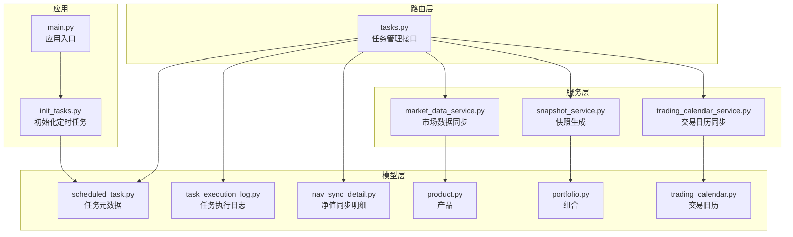
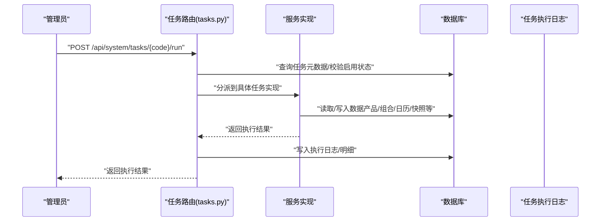
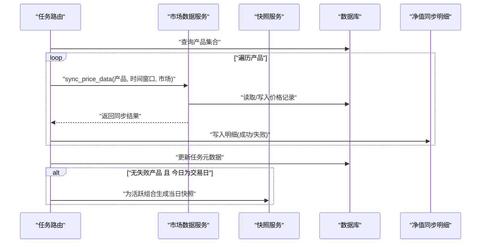
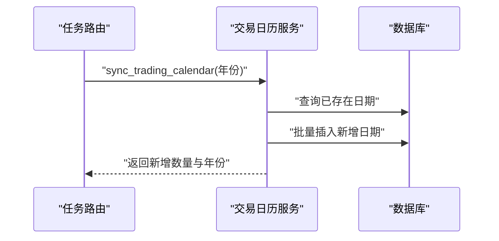
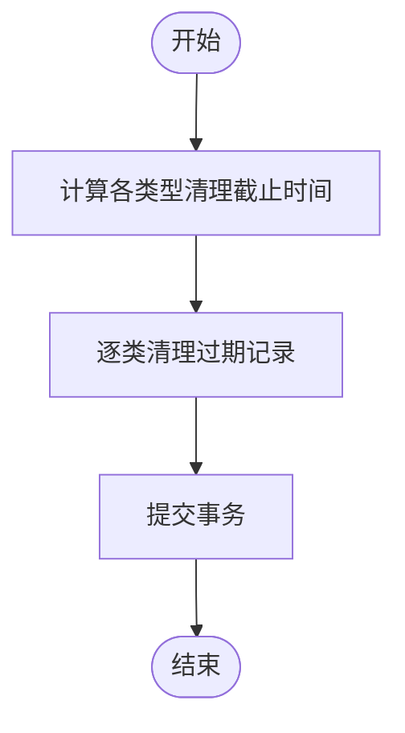
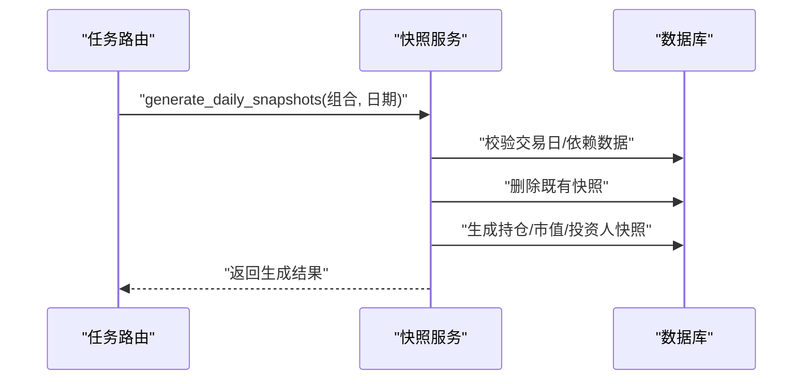
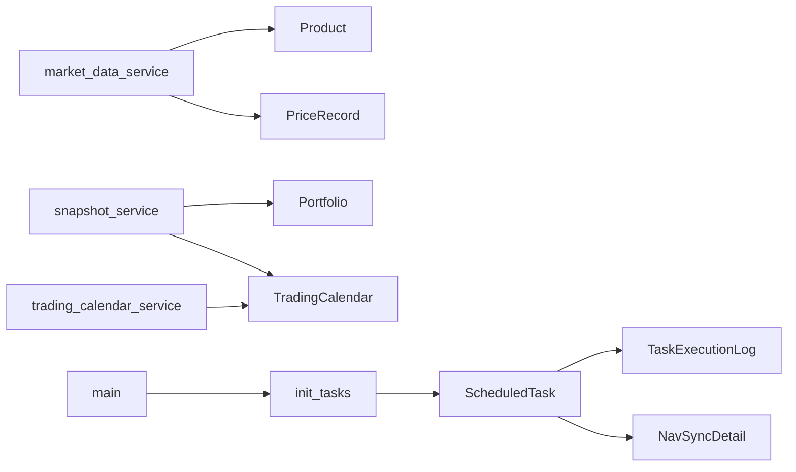

# 业务任务

<cite>
**本文引用的文件**
- [backend/app/main.py](file://backend/app/main.py)
- [backend/app/init_tasks.py](file://backend/app/init_tasks.py)
- [backend/app/models/scheduled_task.py](file://backend/app/models/scheduled_task.py)
- [backend/app/models/task_execution_log.py](file://backend/app/models/task_execution_log.py)
- [backend/app/models/nav_sync_detail.py](file://backend/app/models/nav_sync_detail.py)
- [backend/app/models/product.py](file://backend/app/models/product.py)
- [backend/app/models/portfolio.py](file://backend/app/models/portfolio.py)
- [backend/app/models/trading_calendar.py](file://backend/app/models/trading_calendar.py)
- [backend/app/routers/tasks.py](file://backend/app/routers/tasks.py)
- [backend/app/schemas/task.py](file://backend/app/schemas/task.py)
- [backend/app/services/market_data_service.py](file://backend/app/services/market_data_service.py)
- [backend/app/services/snapshot_service.py](file://backend/app/services/snapshot_service.py)
- [backend/app/services/trading_calendar_service.py](file://backend/app/services/trading_calendar_service.py)
</cite>

## 目录
1. [引言](#引言)
2. [项目结构](#项目结构)
3. [核心组件](#核心组件)
4. [架构总览](#架构总览)
5. [详细组件分析](#详细组件分析)
6. [依赖分析](#依赖分析)
7. [性能考虑](#性能考虑)
8. [故障排查指南](#故障排查指南)
9. [结论](#结论)
10. [附录](#附录)

## 引言
本文件系统性梳理 InvestRing 投资管理系统中的“业务任务”，重点覆盖以下任务类型及其业务逻辑、执行频率、依赖关系、参数配置、输入输出、数据处理流程、与业务规则的集成与校验、性能优化与资源管理、监控指标与质量控制、以及失败处理与恢复策略。当前系统内置三类核心业务任务：净值同步、交易日历同步、日志清理；同时提供统一的任务调度与执行日志管理能力，并在净值同步完成后自动触发当日快照生成。

## 项目结构
围绕“业务任务”的相关模块分布如下：
- 路由层：任务管理接口，负责手动触发、启停、查询日志等
- 服务层：具体业务逻辑实现（市场数据同步、快照生成、交易日历同步）
- 模型层：任务元数据、执行日志、净值同步明细、产品、组合、交易日历等
- 初始化：应用启动时初始化核心定时任务记录

图表来源
- [backend/app/main.py:1-53](file://backend/app/main.py#L1-L53)
- [backend/app/init_tasks.py:1-45](file://backend/app/init_tasks.py#L1-L45)
- [backend/app/routers/tasks.py:1-323](file://backend/app/routers/tasks.py#L1-L323)
- [backend/app/services/market_data_service.py:1-323](file://backend/app/services/market_data_service.py#L1-L323)
- [backend/app/services/snapshot_service.py:1-789](file://backend/app/services/snapshot_service.py#L1-L789)
- [backend/app/services/trading_calendar_service.py:1-125](file://backend/app/services/trading_calendar_service.py#L1-L125)
- [backend/app/models/scheduled_task.py:1-19](file://backend/app/models/scheduled_task.py#L1-L19)
- [backend/app/models/task_execution_log.py:1-21](file://backend/app/models/task_execution_log.py#L1-L21)
- [backend/app/models/nav_sync_detail.py:1-18](file://backend/app/models/nav_sync_detail.py#L1-L18)
- [backend/app/models/product.py:1-22](file://backend/app/models/product.py#L1-L22)
- [backend/app/models/portfolio.py:1-16](file://backend/app/models/portfolio.py#L1-L16)
- [backend/app/models/trading_calendar.py:1-13](file://backend/app/models/trading_calendar.py#L1-L13)

章节来源
- [backend/app/main.py:1-53](file://backend/app/main.py#L1-L53)
- [backend/app/init_tasks.py:1-45](file://backend/app/init_tasks.py#L1-L45)

## 核心组件
- 任务元数据模型：记录任务编码、名称、描述、Cron 表达式、启用状态、最近运行时间与状态、下次运行时间、超时秒数等
- 任务执行日志模型：记录每次任务执行的触发方式、状态、起止时间、耗时、记录总数/成功/失败、错误信息与堆栈
- 净值同步明细模型：记录单个产品在某日净值同步的明细，含状态、错误信息等
- 产品模型：产品基础信息、市场、是否 QDII、数据源、同步状态与时间等
- 组合模型：组合基本信息与状态
- 交易日历模型：日期、是否交易日等
- 任务路由：提供任务列表、手动触发、启停、查询日志等接口
- 服务实现：市场数据同步、快照生成、交易日历同步
- 应用初始化：启动时确保核心任务记录存在

章节来源
- [backend/app/models/scheduled_task.py:1-19](file://backend/app/models/scheduled_task.py#L1-L19)
- [backend/app/models/task_execution_log.py:1-21](file://backend/app/models/task_execution_log.py#L1-L21)
- [backend/app/models/nav_sync_detail.py:1-18](file://backend/app/models/nav_sync_detail.py#L1-L18)
- [backend/app/models/product.py:1-22](file://backend/app/models/product.py#L1-L22)
- [backend/app/models/portfolio.py:1-16](file://backend/app/models/portfolio.py#L1-L16)
- [backend/app/models/trading_calendar.py:1-13](file://backend/app/models/trading_calendar.py#L1-L13)
- [backend/app/routers/tasks.py:1-323](file://backend/app/routers/tasks.py#L1-L323)
- [backend/app/schemas/task.py:1-40](file://backend/app/schemas/task.py#L1-L40)
- [backend/app/services/market_data_service.py:1-323](file://backend/app/services/market_data_service.py#L1-L323)
- [backend/app/services/snapshot_service.py:1-789](file://backend/app/services/snapshot_service.py#L1-L789)
- [backend/app/services/trading_calendar_service.py:1-125](file://backend/app/services/trading_calendar_service.py#L1-L125)
- [backend/app/main.py:1-53](file://backend/app/main.py#L1-L53)
- [backend/app/init_tasks.py:1-45](file://backend/app/init_tasks.py#L1-L45)

## 架构总览
业务任务的总体执行链路如下：
- 应用启动时初始化核心任务记录
- 管理员通过任务路由手动触发任务
- 路由根据任务编码分派到对应服务实现
- 服务实现读取/写入数据库，记录执行日志与明细
- 某些任务完成后自动触发后续流程（如净值同步完成后触发当日快照生成）

图表来源
- [backend/app/routers/tasks.py:88-268](file://backend/app/routers/tasks.py#L88-L268)
- [backend/app/services/market_data_service.py:88-225](file://backend/app/services/market_data_service.py#L88-L225)
- [backend/app/services/snapshot_service.py:24-94](file://backend/app/services/snapshot_service.py#L24-L94)
- [backend/app/services/trading_calendar_service.py:15-66](file://backend/app/services/trading_calendar_service.py#L15-L66)
- [backend/app/models/task_execution_log.py:1-21](file://backend/app/models/task_execution_log.py#L1-L21)
- [backend/app/models/nav_sync_detail.py:1-18](file://backend/app/models/nav_sync_detail.py#L1-L18)

## 详细组件分析

### 任务类型与功能概览
- 净值同步（nav_sync）
  - 业务逻辑：遍历指定市场的全部产品，增量同步价格数据；记录同步明细；更新产品数据源状态；完成后尝试触发当日快照生成（仅在交易日且无失败产品时）
  - 执行频率：工作日 07:00（Cron 表达式）
  - 关键参数：产品集合、时间窗口（默认近 7 天）、市场类型
  - 输入输出：输入为产品与时间范围；输出为同步条数、失败产品列表、快照生成数量
  - 依赖关系：产品、价格记录、交易日历、净值同步明细
- 交易日历同步（trading_calendar_sync）
  - 业务逻辑：拉取指定年份的交易日历并批量写入数据库
  - 执行频率：每年 1 月 1 日 02:00（Cron 表达式）
  - 关键参数：年份
  - 输入输出：输入为年份；输出为新增记录数与年份
  - 依赖关系：交易日历
- 日志清理（log_cleanup）
  - 业务逻辑：清理登录、审计、任务执行、系统错误、净值同步明细等日志
  - 执行频率：每周日 04:00（Cron 表达式）
  - 关键参数：保留期限（硬编码）
  - 输入输出：返回各类日志清理数量
  - 依赖关系：多类日志模型

章节来源
- [backend/app/routers/tasks.py:88-268](file://backend/app/routers/tasks.py#L88-L268)
- [backend/app/init_tasks.py:14-33](file://backend/app/init_tasks.py#L14-L33)
- [backend/app/models/scheduled_task.py:1-19](file://backend/app/models/scheduled_task.py#L1-L19)
- [backend/app/models/nav_sync_detail.py:1-18](file://backend/app/models/nav_sync_detail.py#L1-L18)
- [backend/app/models/trading_calendar.py:1-13](file://backend/app/models/trading_calendar.py#L1-L13)

### 净值同步任务（nav_sync）
- 业务逻辑
  - 查询 CN_EXCHANGE 与 CN_OTC 市场的产品集合
  - 遍历产品，调用市场数据服务进行增量同步（默认近 7 天）
  - 记录每产品的同步明细（成功/失败），失败原因写入明细
  - 更新任务元数据的最近运行时间与状态
  - 若无失败产品且当天为交易日，则自动为所有活跃组合生成当日快照
- 参数配置
  - 时间窗口：默认起始日期为当前日期前 7 天，结束日期为当前日期
  - 市场类型：CN_EXCHANGE（场内）与 CN_OTC（场外）
- 输入输出
  - 输入：产品集合、时间窗口、市场类型
  - 输出：同步条数、产品总数、失败产品列表、快照生成数量
- 数据处理流程
  - 逐产品调用同步服务，去重与写入
  - 记录明细与错误
  - 自动触发快照生成（条件满足时）
- 与业务规则的集成与校验
  - 交易日校验：仅在交易日才触发快照
  - 组合状态校验：仅活跃组合参与快照
  - 明细状态：成功/失败，失败原因记录
- 失败处理与恢复
  - 单产品失败不影响整体任务状态（部分成功）
  - 失败明细用于后续人工干预与重试
- 性能与资源管理
  - 批量写入与去重，避免重复数据
  - 逐产品串行处理，便于限流与可观测性

图表来源
- [backend/app/routers/tasks.py:127-237](file://backend/app/routers/tasks.py#L127-L237)
- [backend/app/services/market_data_service.py:88-225](file://backend/app/services/market_data_service.py#L88-L225)
- [backend/app/services/snapshot_service.py:24-94](file://backend/app/services/snapshot_service.py#L24-L94)
- [backend/app/models/nav_sync_detail.py:1-18](file://backend/app/models/nav_sync_detail.py#L1-L18)

章节来源
- [backend/app/routers/tasks.py:127-237](file://backend/app/routers/tasks.py#L127-L237)
- [backend/app/services/market_data_service.py:88-225](file://backend/app/services/market_data_service.py#L88-L225)
- [backend/app/services/snapshot_service.py:24-94](file://backend/app/services/snapshot_service.py#L24-L94)

### 交易日历同步任务（trading_calendar_sync）
- 业务逻辑：调用交易日历服务，批量写入指定年份的交易日历
- 参数配置：年份（当前年份）
- 输入输出：输入为年份；输出为新增记录数与年份
- 依赖关系：交易日历模型
- 性能与资源管理：批量插入，避免重复日期

图表来源
- [backend/app/routers/tasks.py:112-125](file://backend/app/routers/tasks.py#L112-L125)
- [backend/app/services/trading_calendar_service.py:15-66](file://backend/app/services/trading_calendar_service.py#L15-L66)
- [backend/app/models/trading_calendar.py:1-13](file://backend/app/models/trading_calendar.py#L1-L13)

章节来源
- [backend/app/routers/tasks.py:112-125](file://backend/app/routers/tasks.py#L112-L125)
- [backend/app/services/trading_calendar_service.py:15-66](file://backend/app/services/trading_calendar_service.py#L15-L66)

### 日志清理任务（log_cleanup）
- 业务逻辑：清理登录日志（30 天）、审计日志（90 天）、任务执行日志（90 天）、系统错误日志（30 天）、净值同步明细（90 天）
- 参数配置：保留期限（硬编码）
- 输入输出：返回各类日志清理数量
- 依赖关系：多类日志模型

图表来源
- [backend/app/routers/tasks.py:19-68](file://backend/app/routers/tasks.py#L19-L68)

章节来源
- [backend/app/routers/tasks.py:19-68](file://backend/app/routers/tasks.py#L19-L68)

### 快照生成（自动触发）
- 触发条件：净值同步任务无失败产品且当天为交易日
- 业务逻辑：为所有活跃组合生成当日三张快照（持仓、市值、投资人份额），并进行依赖校验
- 依赖关系：交易日历、产品价格、交易、申赎、份额变动事件、投资人等
- 性能与资源管理：删除既有快照后批量生成，逐组合串行处理

图表来源
- [backend/app/routers/tasks.py:200-230](file://backend/app/routers/tasks.py#L200-L230)
- [backend/app/services/snapshot_service.py:24-94](file://backend/app/services/snapshot_service.py#L24-L94)
- [backend/app/models/portfolio.py:1-16](file://backend/app/models/portfolio.py#L1-L16)
- [backend/app/models/trading_calendar.py:1-13](file://backend/app/models/trading_calendar.py#L1-L13)

章节来源
- [backend/app/routers/tasks.py:200-230](file://backend/app/routers/tasks.py#L200-L230)
- [backend/app/services/snapshot_service.py:24-94](file://backend/app/services/snapshot_service.py#L24-L94)

## 依赖分析
- 任务元数据与执行日志：任务路由依赖任务元数据与执行日志模型以记录状态与结果
- 净值同步与快照：净值同步明细与快照服务相互配合，前者记录明细，后者生成三张快照表
- 产品与价格：市场数据服务依赖产品与价格记录模型，写入/更新价格数据
- 交易日历：快照生成与交易日历服务共同保障交易日判断
- 应用初始化：应用启动时初始化核心任务记录，确保任务可用

图表来源
- [backend/app/models/scheduled_task.py:1-19](file://backend/app/models/scheduled_task.py#L1-L19)
- [backend/app/models/task_execution_log.py:1-21](file://backend/app/models/task_execution_log.py#L1-L21)
- [backend/app/models/nav_sync_detail.py:1-18](file://backend/app/models/nav_sync_detail.py#L1-L18)
- [backend/app/models/product.py:1-22](file://backend/app/models/product.py#L1-L22)
- [backend/app/models/portfolio.py:1-16](file://backend/app/models/portfolio.py#L1-L16)
- [backend/app/models/trading_calendar.py:1-13](file://backend/app/models/trading_calendar.py#L1-L13)
- [backend/app/services/market_data_service.py:1-323](file://backend/app/services/market_data_service.py#L1-L323)
- [backend/app/services/snapshot_service.py:1-789](file://backend/app/services/snapshot_service.py#L1-L789)
- [backend/app/services/trading_calendar_service.py:1-125](file://backend/app/services/trading_calendar_service.py#L1-L125)
- [backend/app/init_tasks.py:1-45](file://backend/app/init_tasks.py#L1-L45)
- [backend/app/main.py:1-53](file://backend/app/main.py#L1-L53)

章节来源
- [backend/app/models/scheduled_task.py:1-19](file://backend/app/models/scheduled_task.py#L1-L19)
- [backend/app/models/task_execution_log.py:1-21](file://backend/app/models/task_execution_log.py#L1-L21)
- [backend/app/models/nav_sync_detail.py:1-18](file://backend/app/models/nav_sync_detail.py#L1-L18)
- [backend/app/models/product.py:1-22](file://backend/app/models/product.py#L1-L22)
- [backend/app/models/portfolio.py:1-16](file://backend/app/models/portfolio.py#L1-L16)
- [backend/app/models/trading_calendar.py:1-13](file://backend/app/models/trading_calendar.py#L1-L13)
- [backend/app/services/market_data_service.py:1-323](file://backend/app/services/market_data_service.py#L1-L323)
- [backend/app/services/snapshot_service.py:1-789](file://backend/app/services/snapshot_service.py#L1-L789)
- [backend/app/services/trading_calendar_service.py:1-125](file://backend/app/services/trading_calendar_service.py#L1-L125)
- [backend/app/init_tasks.py:1-45](file://backend/app/init_tasks.py#L1-L45)
- [backend/app/main.py:1-53](file://backend/app/main.py#L1-L53)

## 性能考虑
- 批量写入与去重：净值同步过程中对同一天多条记录进行去重，避免重复写入
- 事务控制：同步与写入在事务中进行，失败回滚，保证一致性
- 串行处理：按产品/组合串行处理，便于限流与可观测性；若需提升吞吐，可在服务层引入并发与队列
- 缓存与索引：建议为产品与日期建立合适索引，加速查询与去重
- 超时控制：任务模型提供超时秒数，路由层可结合实际任务设置合理超时

## 故障排查指南
- 通用步骤
  - 查看任务执行日志：定位状态、耗时、错误信息与堆栈
  - 检查任务元数据：确认任务启用状态、最近运行时间与状态
  - 核对依赖数据：交易日历、产品状态、价格数据完整性
- 典型问题
  - 净值同步失败：查看净值同步明细，定位失败产品与错误原因；检查产品数据源状态与最近同步时间
  - 快照生成失败：检查交易日校验、待确认交易、价格数据完整性、份额变动事件状态
  - 交易日历缺失：确认当年交易日历是否已同步
- 恢复策略
  - 重试失败产品：针对失败产品单独执行同步
  - 重算快照：在满足依赖条件下重算指定日期区间
  - 清理过期日志：定期执行日志清理任务释放存储空间

章节来源
- [backend/app/routers/tasks.py:300-322](file://backend/app/routers/tasks.py#L300-L322)
- [backend/app/models/task_execution_log.py:1-21](file://backend/app/models/task_execution_log.py#L1-L21)
- [backend/app/models/nav_sync_detail.py:1-18](file://backend/app/models/nav_sync_detail.py#L1-L18)
- [backend/app/services/snapshot_service.py:187-217](file://backend/app/services/snapshot_service.py#L187-L217)
- [backend/app/services/market_data_service.py:209-214](file://backend/app/services/market_data_service.py#L209-L214)

## 结论
系统通过统一的任务元数据与执行日志模型，实现了对净值同步、交易日历同步、日志清理等核心业务任务的标准化管理。净值同步任务具备完善的失败隔离与明细记录能力，并在满足条件时自动触发快照生成，形成“数据-估值-快照”的闭环。建议在生产环境中结合 Cron 调度器或任务队列进一步增强并发与可靠性，并持续完善监控与告警体系。

## 附录
- 任务参数与配置要点
  - 净值同步：时间窗口（默认近 7 天）、市场类型（CN_EXCHANGE/CN_OTC）、超时秒数
  - 交易日历同步：年份
  - 日志清理：各类型日志保留期限（硬编码）
- 监控指标建议
  - 任务成功率、失败率、平均耗时、最大耗时
  - 净值同步条数、失败产品数、快照生成数
  - 交易日历新增条数、日志清理条数
- 质量控制方法
  - 依赖校验：交易日、待确认交易、价格数据完整性、份额变动事件状态
  - 重算机制：支持按日期区间重算快照
  - 错误分级：成功/部分成功/失败，失败明细可追踪