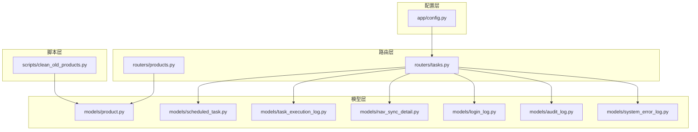
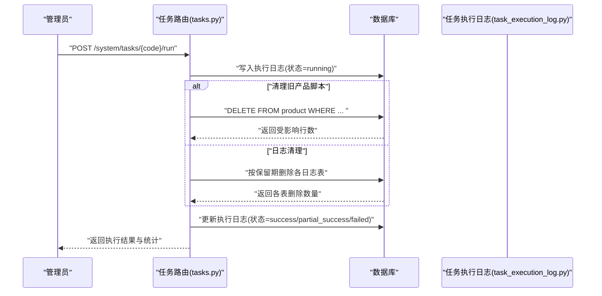
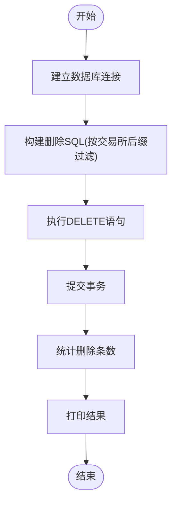
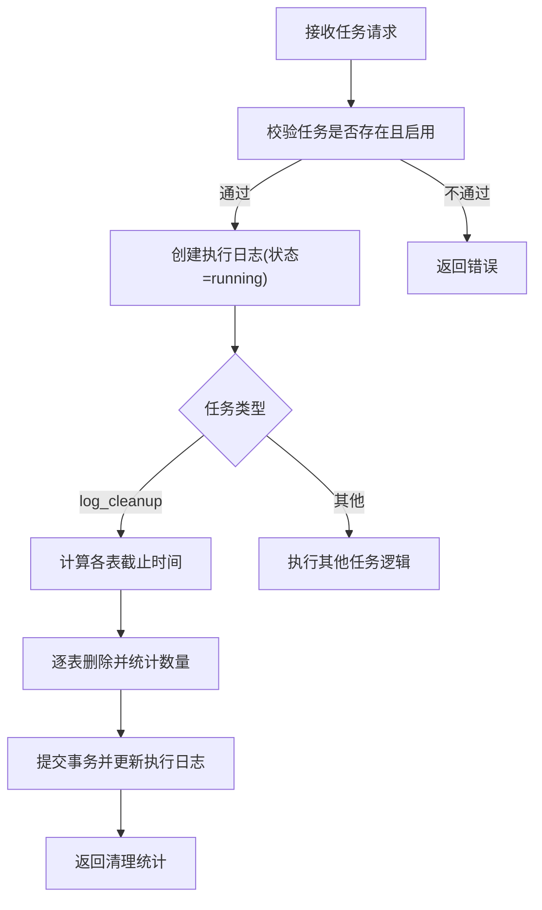
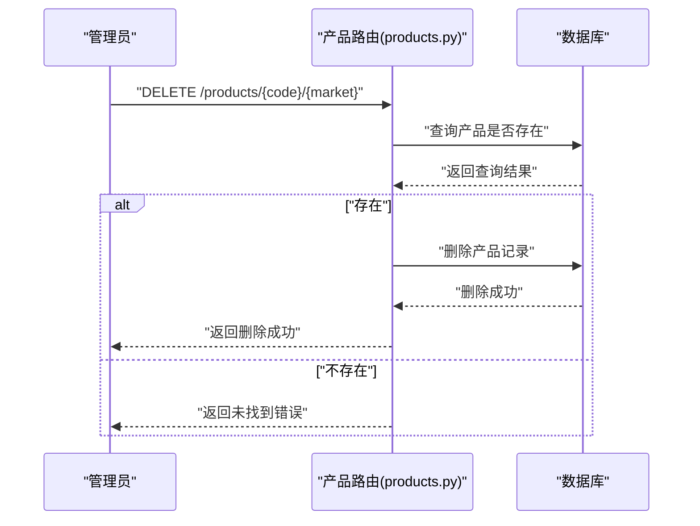
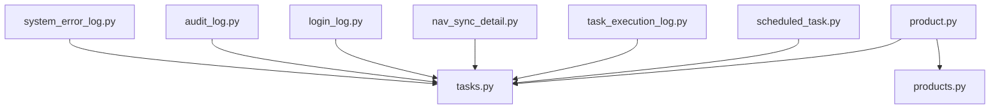

# 产品清理任务

<cite>
**本文引用的文件**
- [clean_old_products.py](file://backend/scripts/clean_old_products.py)
- [product.py](file://backend/app/models/product.py)
- [tasks.py](file://backend/app/routers/tasks.py)
- [scheduled_task.py](file://backend/app/models/scheduled_task.py)
- [task_execution_log.py](file://backend/app/models/task_execution_log.py)
- [nav_sync_detail.py](file://backend/app/models/nav_sync_detail.py)
- [login_log.py](file://backend/app/models/login_log.py)
- [audit_log.py](file://backend/app/models/audit_log.py)
- [system_error_log.py](file://backend/app/models/system_error_log.py)
- [products.py](file://backend/app/routers/products.py)
- [config.py](file://backend/app/config.py)
</cite>

## 目录
1. [简介](#简介)
2. [项目结构](#项目结构)
3. [核心组件](#核心组件)
4. [架构概览](#架构概览)
5. [详细组件分析](#详细组件分析)
6. [依赖分析](#依赖分析)
7. [性能考虑](#性能考虑)
8. [故障排查指南](#故障排查指南)
9. [结论](#结论)
10. [附录](#附录)

## 简介
本文件围绕“产品清理任务”进行系统化文档化，重点解释过期产品数据的清理逻辑与执行策略，涵盖产品状态检查、历史数据归档与无效数据删除；明确清理触发条件、清理范围与安全保护机制；阐述产品生命周期管理与清理任务的关系；说明清理过程中的数据一致性与事务处理；给出清理任务的配置参数与自定义规则建议；提供监控指标与执行报告要点；记录清理操作的日志与审计追踪。

## 项目结构
与产品清理任务直接相关的后端模块分布如下：
- 脚本层：独立脚本用于一次性清理旧产品数据
- 路由层：提供定时/手动任务接口，支持日志清理等任务
- 模型层：产品表、计划任务表、任务执行日志表、净值同步明细表及各类日志表
- 配置层：应用配置项（数据库连接等）

图表来源
- [clean_old_products.py:1-35](file://backend/scripts/clean_old_products.py#L1-L35)
- [tasks.py:1-323](file://backend/app/routers/tasks.py#L1-L323)
- [products.py:95-141](file://backend/app/routers/products.py#L95-L141)
- [product.py:1-22](file://backend/app/models/product.py#L1-L22)
- [scheduled_task.py:1-19](file://backend/app/models/scheduled_task.py#L1-L19)
- [task_execution_log.py:1-21](file://backend/app/models/task_execution_log.py#L1-L21)
- [nav_sync_detail.py:1-18](file://backend/app/models/nav_sync_detail.py#L1-L18)
- [login_log.py:1-16](file://backend/app/models/login_log.py#L1-L16)
- [audit_log.py:1-18](file://backend/app/models/audit_log.py#L1-L18)
- [system_error_log.py:1-19](file://backend/app/models/system_error_log.py#L1-L19)
- [config.py:1-37](file://backend/app/config.py#L1-L37)

章节来源
- [clean_old_products.py:1-35](file://backend/scripts/clean_old_products.py#L1-L35)
- [tasks.py:1-323](file://backend/app/routers/tasks.py#L1-L323)
- [products.py:95-141](file://backend/app/routers/products.py#L95-L141)
- [product.py:1-22](file://backend/app/models/product.py#L1-L22)
- [scheduled_task.py:1-19](file://backend/app/models/scheduled_task.py#L1-L19)
- [task_execution_log.py:1-21](file://backend/app/models/task_execution_log.py#L1-L21)
- [nav_sync_detail.py:1-18](file://backend/app/models/nav_sync_detail.py#L1-L18)
- [login_log.py:1-16](file://backend/app/models/login_log.py#L1-L16)
- [audit_log.py:1-18](file://backend/app/models/audit_log.py#L1-L18)
- [system_error_log.py:1-19](file://backend/app/models/system_error_log.py#L1-L19)
- [config.py:1-37](file://backend/app/config.py#L1-L37)

## 核心组件
- 产品模型：定义产品主键、名称、类型、资产分类、确认天数、数据源等字段，支撑清理任务对产品状态与属性的判断。
- 计划任务模型：记录任务编码、名称、Cron表达式、启用状态、最近运行时间与状态、超时时间等，用于统一调度与监控。
- 任务执行日志模型：记录每次任务执行的触发方式、状态、起止时间、耗时、影响记录数与错误信息，用于审计与报告。
- 净值同步明细模型：记录单个产品在某日的净值同步结果与错误信息，便于定位失败原因。
- 日志清理函数：按保留期限清理登录日志、审计日志、任务执行日志、系统错误日志与净值同步明细。
- 产品路由：提供产品更新与删除接口，删除前需确保未被业务引用，体现安全保护机制。
- 独立清理脚本：按交易所后缀规则批量删除旧产品数据，作为一次性修复手段。

章节来源
- [product.py:1-22](file://backend/app/models/product.py#L1-L22)
- [scheduled_task.py:1-19](file://backend/app/models/scheduled_task.py#L1-L19)
- [task_execution_log.py:1-21](file://backend/app/models/task_execution_log.py#L1-L21)
- [nav_sync_detail.py:1-18](file://backend/app/models/nav_sync_detail.py#L1-L18)
- [tasks.py:19-68](file://backend/app/routers/tasks.py#L19-L68)
- [products.py:125-141](file://backend/app/routers/products.py#L125-L141)
- [clean_old_products.py:15-31](file://backend/scripts/clean_old_products.py#L15-L31)

## 架构概览
产品清理任务通过统一的任务路由实现，支持手动触发与日志清理等子任务。清理流程中涉及事务提交、异常捕获与日志记录，确保数据一致性与可观测性。

图表来源
- [tasks.py:88-267](file://backend/app/routers/tasks.py#L88-L267)
- [task_execution_log.py:1-21](file://backend/app/models/task_execution_log.py#L1-L21)

章节来源
- [tasks.py:88-267](file://backend/app/routers/tasks.py#L88-L267)

## 详细组件分析

### 产品清理脚本（独立脚本）
- 触发条件：手动执行脚本，适用于一次性修复历史数据问题。
- 清理范围：删除不带交易所后缀且非特定代码的产品记录。
- 安全保护：脚本直接使用原生SQL执行删除，无复杂前置校验；建议在维护窗口执行并提前备份。
- 数据一致性：使用单次连接与提交，避免跨事务边界的数据不一致。

图表来源
- [clean_old_products.py:15-31](file://backend/scripts/clean_old_products.py#L15-L31)

章节来源
- [clean_old_products.py:1-35](file://backend/scripts/clean_old_products.py#L1-L35)

### 任务路由与日志清理
- 触发条件：管理员调用任务执行接口，传入任务编码。
- 清理范围：按保留期清理多类日志表（登录、审计、任务执行、系统错误、净值同步明细）。
- 安全保护：采用ORM查询与删除，异常时回滚；执行日志记录状态与错误信息。
- 数据一致性：每个删除操作在事务内完成，最终统一提交；失败时记录错误详情。

图表来源
- [tasks.py:88-267](file://backend/app/routers/tasks.py#L88-L267)
- [login_log.py:1-16](file://backend/app/models/login_log.py#L1-L16)
- [audit_log.py:1-18](file://backend/app/models/audit_log.py#L1-L18)
- [system_error_log.py:1-19](file://backend/app/models/system_error_log.py#L1-L19)
- [task_execution_log.py:1-21](file://backend/app/models/task_execution_log.py#L1-L21)
- [nav_sync_detail.py:1-18](file://backend/app/models/nav_sync_detail.py#L1-L18)

章节来源
- [tasks.py:19-68](file://backend/app/routers/tasks.py#L19-L68)
- [tasks.py:239-250](file://backend/app/routers/tasks.py#L239-L250)

### 产品删除与安全保护
- 触发条件：管理员调用产品删除接口。
- 清理范围：删除指定产品记录。
- 安全保护：删除前先查询产品是否存在，若不存在则抛出未找到错误；前端提示“已被使用，无法删除”，体现业务约束。
- 数据一致性：删除操作在单次事务中完成，提交后生效。

图表来源
- [products.py:125-141](file://backend/app/routers/products.py#L125-L141)

章节来源
- [products.py:125-141](file://backend/app/routers/products.py#L125-L141)

### 产品生命周期与清理任务关系
- 生命周期阶段：产品创建、数据源接入、状态变更（如市场类型、QDII）、使用与归档。
- 清理关联点：当产品不再符合命名规范（无交易所后缀且非特定代码）时，应被清理；当产品被业务引用时禁止删除。
- 自动化建议：结合计划任务模型与Cron表达式，定期执行清理与校验，确保数据整洁。

章节来源
- [product.py:1-22](file://backend/app/models/product.py#L1-L22)
- [scheduled_task.py:1-19](file://backend/app/models/scheduled_task.py#L1-L19)
- [products.py:125-141](file://backend/app/routers/products.py#L125-L141)

### 数据一致性与事务处理
- 统一日志：所有任务执行均写入任务执行日志，记录状态、起止时间、耗时与错误信息。
- 原子性：日志清理函数对各日志表的删除在事务内完成，异常时回滚。
- 可观测性：执行日志提供任务执行历史，便于审计与排障。

章节来源
- [task_execution_log.py:1-21](file://backend/app/models/task_execution_log.py#L1-L21)
- [tasks.py:46-67](file://backend/app/routers/tasks.py#L46-L67)

### 配置参数与自定义规则
- 数据库连接：通过配置类提供数据库URL，默认从环境变量读取。
- 任务超时：计划任务模型包含超时秒数字段，可用于限制任务执行时长。
- 自定义规则建议：
  - 产品命名规则：以交易所后缀结尾（如.SH/.SZ/.OF），保留特定代码（如CASH）。
  - 日志保留期：根据合规要求调整登录、审计、任务执行、系统错误与净值明细的保留天数。
  - 任务调度：为清理任务配置合适的Cron表达式，避免业务高峰期执行。

章节来源
- [config.py:1-37](file://backend/app/config.py#L1-L37)
- [scheduled_task.py:1-19](file://backend/app/models/scheduled_task.py#L1-L19)
- [tasks.py:19-68](file://backend/app/routers/tasks.py#L19-L68)

### 监控指标与执行报告
- 指标建议：
  - 产品清理：删除条数、耗时、失败率。
  - 日志清理：各日志表删除数量、清理耗时、错误次数。
  - 任务执行：任务成功率、平均耗时、最大耗时、失败原因分布。
- 报告内容：
  - 任务执行摘要、详细日志、失败产品清单、快照生成情况（如适用）。

章节来源
- [task_execution_log.py:1-21](file://backend/app/models/task_execution_log.py#L1-L21)
- [tasks.py:239-250](file://backend/app/routers/tasks.py#L239-L250)

### 日志记录与审计追踪
- 任务执行日志：记录每次任务的触发类型、状态、起止时间、耗时与错误详情。
- 审计日志：记录关键资源的操作行为、前后值与IP地址，便于审计。
- 系统错误日志：记录异常堆栈、请求路径与参数，辅助排障。

章节来源
- [task_execution_log.py:1-21](file://backend/app/models/task_execution_log.py#L1-L21)
- [audit_log.py:1-18](file://backend/app/models/audit_log.py#L1-L18)
- [system_error_log.py:1-19](file://backend/app/models/system_error_log.py#L1-L19)

## 依赖分析
- 产品模型依赖数据库基类，提供产品表结构。
- 任务路由依赖计划任务模型、任务执行日志模型、净值同步明细模型与产品模型，用于任务编排与结果记录。
- 日志清理函数依赖多类日志模型，按保留期删除过期数据。
- 产品路由依赖产品模型，提供产品更新与删除能力。

图表来源
- [product.py:1-22](file://backend/app/models/product.py#L1-L22)
- [tasks.py:1-323](file://backend/app/routers/tasks.py#L1-L323)
- [scheduled_task.py:1-19](file://backend/app/models/scheduled_task.py#L1-L19)
- [task_execution_log.py:1-21](file://backend/app/models/task_execution_log.py#L1-L21)
- [nav_sync_detail.py:1-18](file://backend/app/models/nav_sync_detail.py#L1-L18)
- [login_log.py:1-16](file://backend/app/models/login_log.py#L1-L16)
- [audit_log.py:1-18](file://backend/app/models/audit_log.py#L1-L18)
- [system_error_log.py:1-19](file://backend/app/models/system_error_log.py#L1-L19)
- [products.py:95-141](file://backend/app/routers/products.py#L95-L141)

章节来源
- [tasks.py:1-323](file://backend/app/routers/tasks.py#L1-L323)
- [products.py:95-141](file://backend/app/routers/products.py#L95-L141)

## 性能考虑
- 批量删除：日志清理采用分表删除，减少单次事务压力；建议在低峰期执行。
- 连接与事务：清理脚本使用单连接与提交，避免跨事务边界；任务路由对各日志表删除在事务内完成。
- 查询优化：清理函数按创建时间过滤，建议在相关列建立索引以提升删除效率。

## 故障排查指南
- 任务执行失败：
  - 查看任务执行日志中的状态与错误信息，定位具体失败环节。
  - 检查数据库连接与权限，确认任务超时设置合理。
- 产品删除失败：
  - 确认产品是否存在且未被业务引用；前端会提示“已被使用，无法删除”。
  - 检查是否有外键约束导致删除阻塞。
- 日志清理异常：
  - 确认各日志表的保留期配置是否合理；
  - 检查数据库事务隔离级别与锁竞争情况。

章节来源
- [task_execution_log.py:1-21](file://backend/app/models/task_execution_log.py#L1-L21)
- [tasks.py:259-267](file://backend/app/routers/tasks.py#L259-L267)
- [products.py:125-141](file://backend/app/routers/products.py#L125-L141)

## 结论
产品清理任务通过独立脚本与统一任务路由实现，覆盖产品数据与日志数据的清理需求。其设计强调安全保护（删除前校验、异常回滚）、数据一致性（事务提交与日志记录）与可观测性（执行日志与审计日志）。建议结合计划任务模型与Cron表达式实现自动化，并根据合规要求调整保留期与清理规则。

## 附录
- 任务编码示例：
  - log_cleanup：执行日志清理
  - 其他任务编码：如 trading_calendar_sync、nav_sync 等（用于对比理解任务体系）
- 关键字段说明：
  - 计划任务：cron_expr、is_enabled、timeout_seconds
  - 任务执行日志：status、started_at、finished_at、records_total、error_message
  - 净值同步明细：status、error_message

章节来源
- [tasks.py:88-267](file://backend/app/routers/tasks.py#L88-L267)
- [scheduled_task.py:1-19](file://backend/app/models/scheduled_task.py#L1-L19)
- [task_execution_log.py:1-21](file://backend/app/models/task_execution_log.py#L1-L21)
- [nav_sync_detail.py:1-18](file://backend/app/models/nav_sync_detail.py#L1-L18)