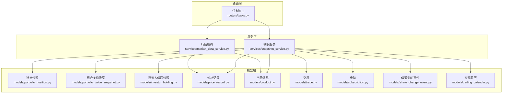
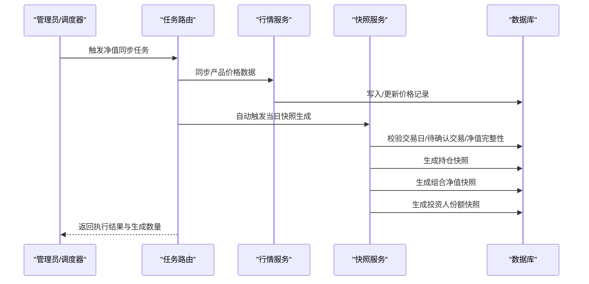
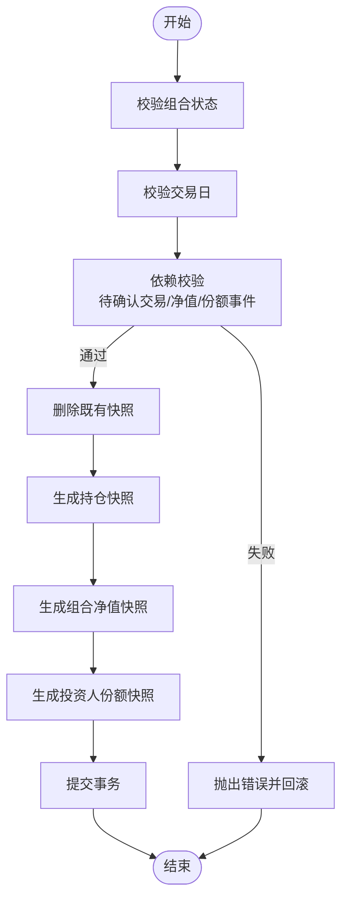
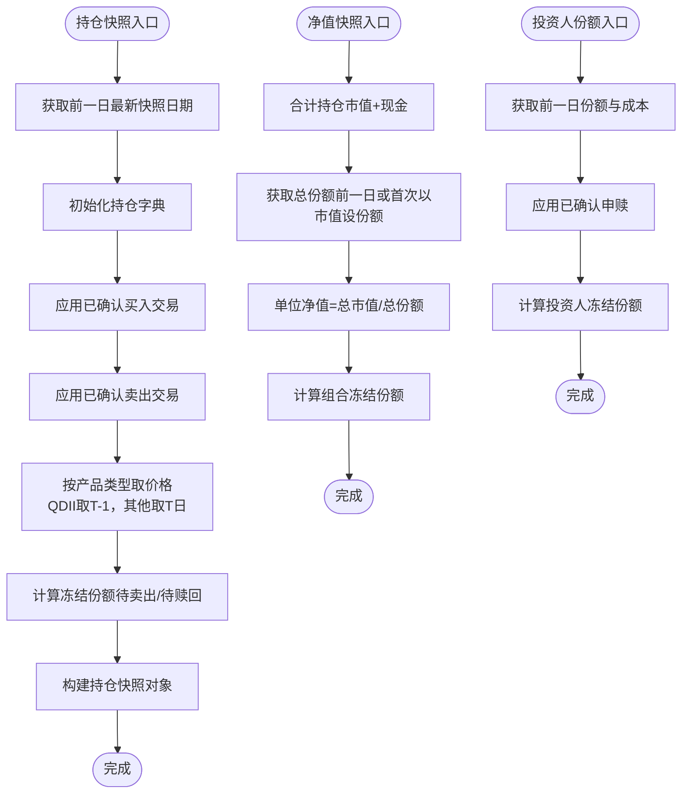
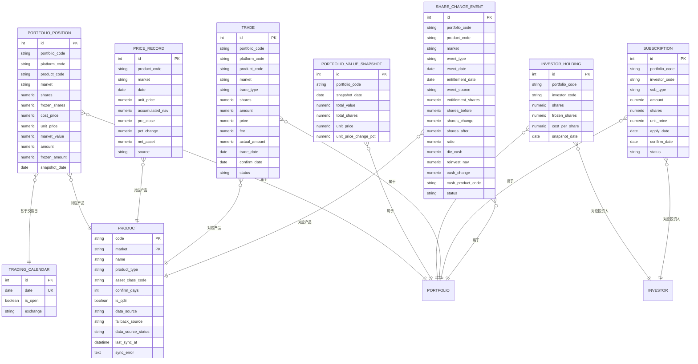

# 估值计算任务

<cite>
**本文引用的文件**
- [backend/app/services/snapshot_service.py](file://backend/app/services/snapshot_service.py)
- [backend/app/services/market_data_service.py](file://backend/app/services/market_data_service.py)
- [backend/app/routers/tasks.py](file://backend/app/routers/tasks.py)
- [backend/app/models/portfolio_position.py](file://backend/app/models/portfolio_position.py)
- [backend/app/models/portfolio_value_snapshot.py](file://backend/app/models/portfolio_value_snapshot.py)
- [backend/app/models/investor_holding.py](file://backend/app/models/investor_holding.py)
- [backend/app/models/price_record.py](file://backend/app/models/price_record.py)
- [backend/app/models/product.py](file://backend/app/models/product.py)
- [backend/app/models/trade.py](file://backend/app/models/trade.py)
- [backend/app/models/subscription.py](file://backend/app/models/subscription.py)
- [backend/app/models/share_change_event.py](file://backend/app/models/share_change_event.py)
- [backend/app/models/trading_calendar.py](file://backend/app/models/trading_calendar.py)
- [backend/app/models/asset_classification.py](file://backend/app/models/asset_classification.py)
</cite>

## 目录
1. [引言](#引言)
2. [项目结构](#项目结构)
3. [核心组件](#核心组件)
4. [架构总览](#架构总览)
5. [详细组件分析](#详细组件分析)
6. [依赖分析](#依赖分析)
7. [性能考虑](#性能考虑)
8. [故障排查指南](#故障排查指南)
9. [结论](#结论)
10. [附录](#附录)

## 引言
本文件围绕“估值计算任务”进行系统化文档化，覆盖投资组合估值的计算方法与算法实现，包括：
- 持仓估值、浮动盈亏与累计收益统计
- 时点选择、数据来源与计算精度
- 不同金融产品（股票、基金、债券等）的估值差异
- 批量处理与增量更新机制
- 准确性验证与对账流程
- 性能优化与缓存策略
- 异常处理与修正机制

## 项目结构
本项目采用分层架构，估值计算涉及以下关键模块：
- 服务层：快照生成与净值同步服务
- 模型层：快照表、产品、交易、份额变更等数据模型
- 路由层：定时任务与手动触发接口
- 数据源：Tushare 接口与本地价格记录

图表来源
- [backend/app/routers/tasks.py:1-323](file://backend/app/routers/tasks.py#L1-L323)
- [backend/app/services/snapshot_service.py:1-789](file://backend/app/services/snapshot_service.py#L1-L789)
- [backend/app/services/market_data_service.py:1-323](file://backend/app/services/market_data_service.py#L1-L323)
- [backend/app/models/portfolio_position.py:1-34](file://backend/app/models/portfolio_position.py#L1-L34)
- [backend/app/models/portfolio_value_snapshot.py:1-20](file://backend/app/models/portfolio_value_snapshot.py#L1-L20)
- [backend/app/models/investor_holding.py:1-20](file://backend/app/models/investor_holding.py#L1-L20)
- [backend/app/models/price_record.py:1-28](file://backend/app/models/price_record.py#L1-L28)
- [backend/app/models/product.py:1-22](file://backend/app/models/product.py#L1-L22)
- [backend/app/models/trade.py:1-32](file://backend/app/models/trade.py#L1-L32)
- [backend/app/models/subscription.py:1-21](file://backend/app/models/subscription.py#L1-L21)
- [backend/app/models/share_change_event.py:1-37](file://backend/app/models/share_change_event.py#L1-L37)
- [backend/app/models/trading_calendar.py:1-13](file://backend/app/models/trading_calendar.py#L1-L13)

章节来源
- [backend/app/routers/tasks.py:1-323](file://backend/app/routers/tasks.py#L1-L323)
- [backend/app/services/snapshot_service.py:1-789](file://backend/app/services/snapshot_service.py#L1-L789)
- [backend/app/services/market_data_service.py:1-323](file://backend/app/services/market_data_service.py#L1-L323)

## 核心组件
- 快照服务：负责生成/重算三类快照（持仓、组合净值、投资人份额），并进行依赖校验与一致性控制。
- 行情服务：负责从外部数据源同步价格数据，维护价格记录表，并支持组合净值的即时同步。
- 路由层任务：提供手动触发与自动调度能力，串联行情同步与快照生成。

章节来源
- [backend/app/services/snapshot_service.py:24-184](file://backend/app/services/snapshot_service.py#L24-L184)
- [backend/app/services/market_data_service.py:88-323](file://backend/app/services/market_data_service.py#L88-L323)
- [backend/app/routers/tasks.py:88-237](file://backend/app/routers/tasks.py#L88-L237)

## 架构总览
估值计算遵循“先交易与份额变更，再价格驱动”的顺序，确保时点一致与数据完整。

图表来源
- [backend/app/routers/tasks.py:127-237](file://backend/app/routers/tasks.py#L127-L237)
- [backend/app/services/market_data_service.py:88-225](file://backend/app/services/market_data_service.py#L88-L225)
- [backend/app/services/snapshot_service.py:24-94](file://backend/app/services/snapshot_service.py#L24-L94)

## 详细组件分析

### 快照生成与重算流程
- 生成流程：删除既有快照 → 生成持仓快照 → 生成组合净值快照 → 生成投资人份额快照。
- 重算流程：遍历交易日区间，逐日执行生成流程；支持强制重算跳过校验。
- 依赖校验：交易日、待确认交易、净值数据完整性、份额变动事件状态。

图表来源
- [backend/app/services/snapshot_service.py:24-94](file://backend/app/services/snapshot_service.py#L24-L94)
- [backend/app/services/snapshot_service.py:187-217](file://backend/app/services/snapshot_service.py#L187-L217)

章节来源
- [backend/app/services/snapshot_service.py:24-184](file://backend/app/services/snapshot_service.py#L24-L184)

### 持仓估值与单位净值计算
- 持仓快照：从前一日快照出发，应用已确认交易（买入加仓、卖出减仓），计算冻结份额；根据产品类型与交易日历获取价格，计算市值与成本价。
- 组合净值快照：总市值 = 持仓市值之和 + 现金；总份额来自前一日投资人份额；单位净值 = 总市值 / 总份额；冻结份额汇总自待确认赎回。
- 投资人份额快照：从前一日份额出发，应用已确认申赎，计算加权成本价与冻结份额。

图表来源
- [backend/app/services/snapshot_service.py:265-418](file://backend/app/services/snapshot_service.py#L265-L418)
- [backend/app/services/snapshot_service.py:421-473](file://backend/app/services/snapshot_service.py#L421-L473)
- [backend/app/services/snapshot_service.py:476-575](file://backend/app/services/snapshot_service.py#L476-L575)

章节来源
- [backend/app/services/snapshot_service.py:265-575](file://backend/app/services/snapshot_service.py#L265-L575)

### 不同金融产品的估值差异
- 股票（CN_EXCHANGE）：使用日线收盘价作为单位净值，计算当日涨跌幅与前收。
- 场内ETF/LOF（CN_EXCHANGE）：同上，额外记录涨跌幅与前收。
- 场外基金（CN_OTC）：使用净值序列，按交易日取最新净值；QDII基金取前一交易日净值用于估值。
- 现金：直接按金额计入总值，不参与份额摊薄。
- 债券：通过资产分类与产品类型映射，结合价格记录表的净值/单位净值进行估值（具体实现依赖产品类型与价格记录字段）。

章节来源
- [backend/app/models/price_record.py:1-28](file://backend/app/models/price_record.py#L1-L28)
- [backend/app/models/product.py:1-22](file://backend/app/models/product.py#L1-L22)
- [backend/app/models/asset_classification.py:1-13](file://backend/app/models/asset_classification.py#L1-L13)
- [backend/app/services/snapshot_service.py:374-398](file://backend/app/services/snapshot_service.py#L374-L398)

### 数据来源与计算精度
- 数据来源：价格记录表（PriceRecord）为主，产品表（Product）定义市场与数据源；行情服务负责从外部接口同步并去重。
- 计算精度：数值字段普遍采用高精度数值类型，服务层使用高精度十进制进行中间计算，最终落库时按需量化。

章节来源
- [backend/app/services/market_data_service.py:148-207](file://backend/app/services/market_data_service.py#L148-L207)
- [backend/app/services/snapshot_service.py:456-470](file://backend/app/services/snapshot_service.py#L456-L470)

### 批量处理与增量更新机制
- 批量处理：任务路由按产品批量同步价格数据，随后自动触发当日快照生成。
- 增量更新：行情服务对重复日期仅保留最新记录；快照服务按交易日推进，仅在交易日生成快照；冻结份额按待确认事件动态计算。

章节来源
- [backend/app/routers/tasks.py:127-237](file://backend/app/routers/tasks.py#L127-L237)
- [backend/app/services/market_data_service.py:148-207](file://backend/app/services/market_data_service.py#L148-L207)
- [backend/app/services/snapshot_service.py:134-176](file://backend/app/services/snapshot_service.py#L134-L176)

### 准确性验证与对账流程
- 依赖校验：交易日、待确认交易、净值完整性、份额变动事件状态。
- 对账要点：持仓快照与交易流水核对；净值快照与价格记录核对；投资人份额与申赎流水核对；冻结份额与待确认订单核对。
- 日志与审计：任务执行日志、净值同步明细、错误日志，便于事后追溯。

章节来源
- [backend/app/services/snapshot_service.py:187-217](file://backend/app/services/snapshot_service.py#L187-L217)
- [backend/app/routers/tasks.py:19-68](file://backend/app/routers/tasks.py#L19-L68)

### 性能优化与缓存策略
- 批量写入：行情同步一次性读取现有记录到内存字典，避免多次查询；批量插入/更新。
- 交易日历索引：交易日历表按日期唯一索引，快速判断交易日。
- 字段索引：价格记录按产品+市场+日期唯一约束，查询高效。
- 事务边界：单日快照生成在单事务中完成，保证一致性与原子性。

章节来源
- [backend/app/services/market_data_service.py:156-207](file://backend/app/services/market_data_service.py#L156-L207)
- [backend/app/models/trading_calendar.py:1-13](file://backend/app/models/trading_calendar.py#L1-L13)
- [backend/app/models/price_record.py:21-27](file://backend/app/models/price_record.py#L21-L27)

### 异常处理与修正机制
- 任务异常：捕获并记录错误，更新任务执行日志状态；部分失败不影响整体流程。
- 快照异常：生成失败回滚事务并记录错误；重算支持跳过校验的强制模式。
- 数据异常：行情同步失败标记数据源状态为失败；修正后重新触发同步。

章节来源
- [backend/app/routers/tasks.py:259-267](file://backend/app/routers/tasks.py#L259-L267)
- [backend/app/services/snapshot_service.py:90-93](file://backend/app/services/snapshot_service.py#L90-L93)
- [backend/app/services/market_data_service.py:210-214](file://backend/app/services/market_data_service.py#L210-L214)

## 依赖分析

图表来源
- [backend/app/models/portfolio_position.py:1-34](file://backend/app/models/portfolio_position.py#L1-L34)
- [backend/app/models/portfolio_value_snapshot.py:1-20](file://backend/app/models/portfolio_value_snapshot.py#L1-L20)
- [backend/app/models/investor_holding.py:1-20](file://backend/app/models/investor_holding.py#L1-L20)
- [backend/app/models/price_record.py:1-28](file://backend/app/models/price_record.py#L1-L28)
- [backend/app/models/product.py:1-22](file://backend/app/models/product.py#L1-L22)
- [backend/app/models/trade.py:1-32](file://backend/app/models/trade.py#L1-L32)
- [backend/app/models/subscription.py:1-21](file://backend/app/models/subscription.py#L1-L21)
- [backend/app/models/share_change_event.py:1-37](file://backend/app/models/share_change_event.py#L1-L37)
- [backend/app/models/trading_calendar.py:1-13](file://backend/app/models/trading_calendar.py#L1-L13)

## 性能考虑
- 批量写入与去重：行情同步阶段对重复日期仅保留最新记录，减少写入冲突。
- 单事务快照生成：降低并发冲突与数据不一致风险。
- 索引与约束：价格记录与交易日历的关键字段建立索引与唯一约束，提升查询与去重效率。
- 任务编排：净值同步完成后自动触发当日快照生成，避免遗漏。

章节来源
- [backend/app/services/market_data_service.py:148-207](file://backend/app/services/market_data_service.py#L148-L207)
- [backend/app/services/snapshot_service.py:54-73](file://backend/app/services/snapshot_service.py#L54-L73)
- [backend/app/routers/tasks.py:199-230](file://backend/app/routers/tasks.py#L199-L230)

## 故障排查指南
- 快照生成失败：检查交易日、待确认交易、净值完整性与份额事件状态；必要时启用强制重算。
- 行情同步失败：查看数据源状态与错误日志；修正后重新触发同步。
- 组合净值异常：核对持仓快照与价格记录；确认现金与份额的处理逻辑。
- 冻结份额异常：检查待确认交易与申赎；确认冻结计算函数的过滤条件。

章节来源
- [backend/app/services/snapshot_service.py:187-217](file://backend/app/services/snapshot_service.py#L187-L217)
- [backend/app/services/market_data_service.py:135-138](file://backend/app/services/market_data_service.py#L135-L138)
- [backend/app/routers/tasks.py:19-68](file://backend/app/routers/tasks.py#L19-L68)

## 结论
本系统通过严格的时序控制与依赖校验，实现了稳健的估值计算闭环：以交易日为单位，先处理交易与份额变更，再以价格记录驱动估值，最终形成三类快照并支持对账与修正。通过批量处理、事务边界与索引优化，兼顾了准确性与性能。

## 附录
- 关键流程路径参考
  - 快照生成入口：[generate_daily_snapshots:24-94](file://backend/app/services/snapshot_service.py#L24-L94)
  - 重算入口：[recalculate_snapshots:96-184](file://backend/app/services/snapshot_service.py#L96-L184)
  - 依赖校验：[validate_snapshot_dependencies:187-217](file://backend/app/services/snapshot_service.py#L187-L217)
  - 行情同步：[sync_price_data:88-225](file://backend/app/services/market_data_service.py#L88-L225)
  - 组合净值同步：[sync_portfolio_nav:228-323](file://backend/app/services/market_data_service.py#L228-L323)
  - 任务触发与自动快照：[路由任务执行:127-237](file://backend/app/routers/tasks.py#L127-L237)