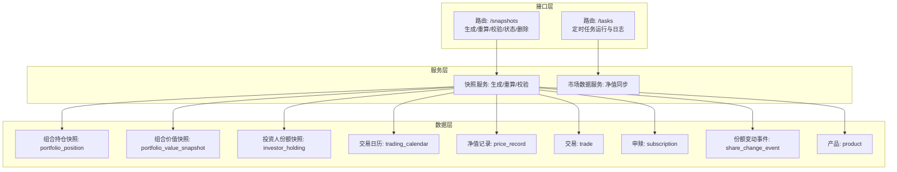
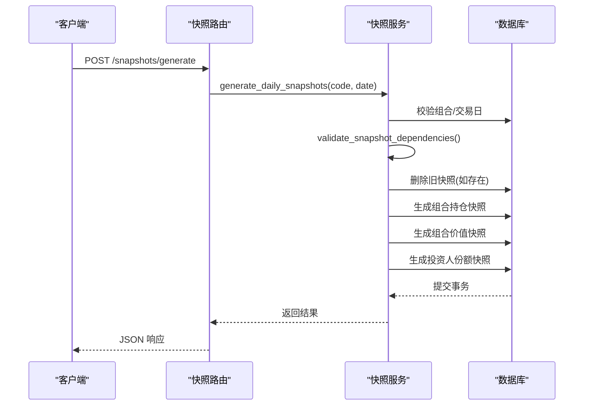
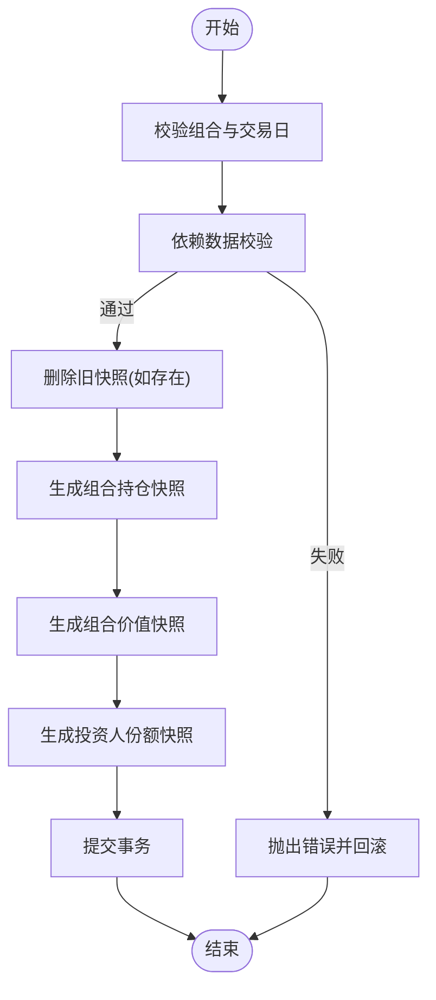
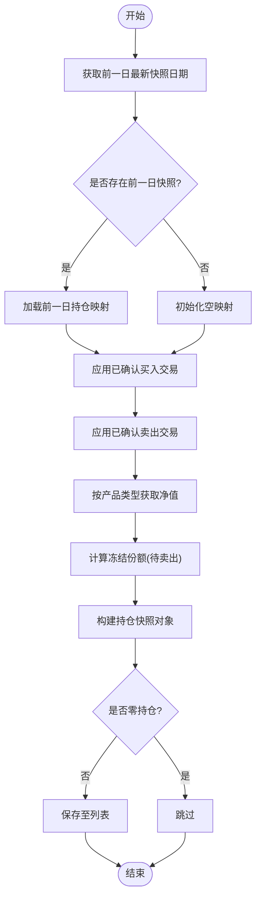
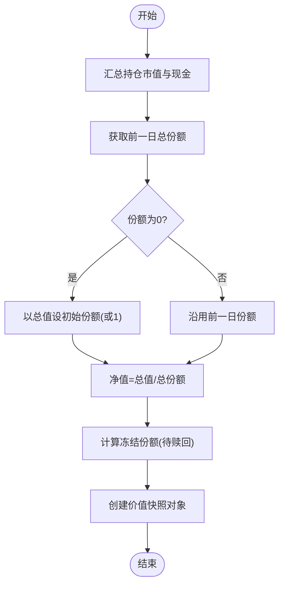
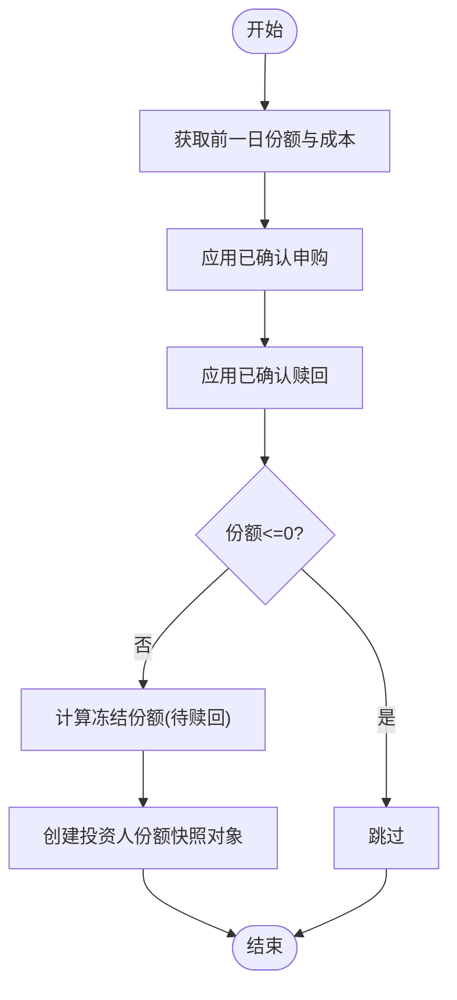
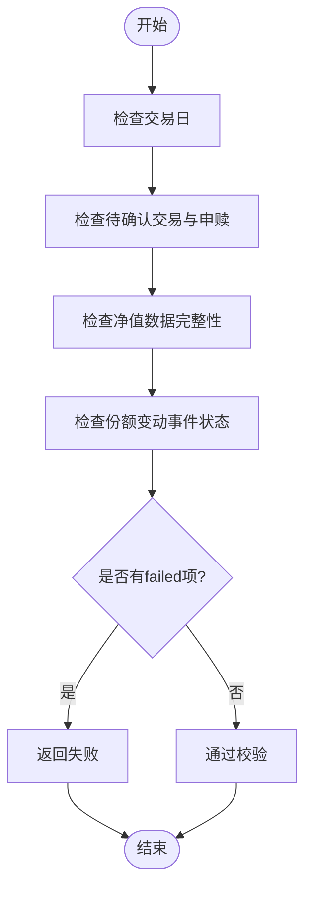
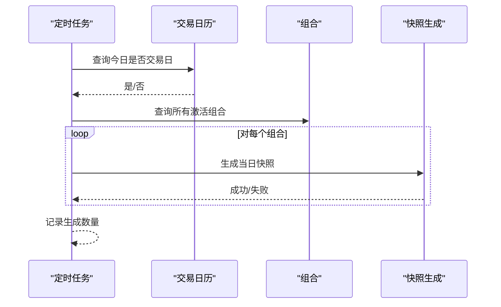
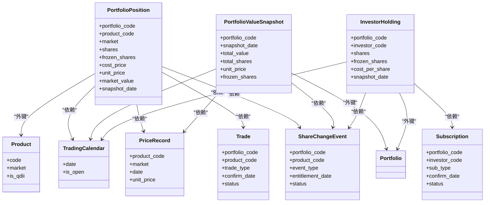

# 快照生成任务

<cite>
**本文引用的文件**
- [backend/app/schemas/snapshot.py](file://backend/app/schemas/snapshot.py)
- [backend/app/services/snapshot_service.py](file://backend/app/services/snapshot_service.py)
- [backend/app/routers/snapshots.py](file://backend/app/routers/snapshots.py)
- [backend/app/models/portfolio_value_snapshot.py](file://backend/app/models/portfolio_value_snapshot.py)
- [backend/app/models/portfolio_position.py](file://backend/app/models/portfolio_position.py)
- [backend/app/models/investor_holding.py](file://backend/app/models/investor_holding.py)
- [backend/app/models/trading_calendar.py](file://backend/app/models/trading_calendar.py)
- [backend/app/models/product.py](file://backend/app/models/product.py)
- [backend/app/models/price_record.py](file://backend/app/models/price_record.py)
- [backend/app/models/trade.py](file://backend/app/models/trade.py)
- [backend/app/models/subscription.py](file://backend/app/models/subscription.py)
- [backend/app/models/share_change_event.py](file://backend/app/models/share_change_event.py)
- [backend/app/routers/tasks.py](file://backend/app/routers/tasks.py)
- [backend/app/models/scheduled_task.py](file://backend/app/models/scheduled_task.py)
- [backend/app/init_tasks.py](file://backend/app/init_tasks.py)
- [backend/app/models/task_execution_log.py](file://backend/app/models/task_execution_log.py)
</cite>

## 目录
1. [简介](#简介)
2. [项目结构](#项目结构)
3. [核心组件](#核心组件)
4. [架构概览](#架构概览)
5. [详细组件分析](#详细组件分析)
6. [依赖关系分析](#依赖关系分析)
7. [性能考量](#性能考量)
8. [故障排查指南](#故障排查指南)
9. [结论](#结论)
10. [附录](#附录)

## 简介
本文件系统性阐述“快照生成任务”的设计与实现，覆盖以下关键主题：
- 投资组合价值快照与投资人份额快照的生成逻辑
- 净值计算、资产配置统计与收益计算的实现要点
- 快照生成的时间规则、触发条件与批量处理机制
- 快照数据的准确性验证与一致性检查
- 快照数据的存储格式、索引策略与查询优化
- 性能考虑与资源消耗控制
- 质量监控与异常处理机制
- 历史数据保留策略与清理规则

## 项目结构
快照系统由三层组成：
- 接口层：提供 REST API，支持手动触发、批量重算、依赖校验与状态查询
- 服务层：实现快照生成、重算、依赖校验与冻结份额计算等核心逻辑
- 数据层：定义快照与依赖数据的模型，包含交易日历、产品、净值、交易、申赎、份额变动事件等

图表来源
- [backend/app/routers/snapshots.py:1-188](file://backend/app/routers/snapshots.py#L1-L188)
- [backend/app/services/snapshot_service.py:1-789](file://backend/app/services/snapshot_service.py#L1-L789)
- [backend/app/models/portfolio_position.py:1-34](file://backend/app/models/portfolio_position.py#L1-L34)
- [backend/app/models/portfolio_value_snapshot.py:1-20](file://backend/app/models/portfolio_value_snapshot.py#L1-L20)
- [backend/app/models/investor_holding.py:1-20](file://backend/app/models/investor_holding.py#L1-L20)
- [backend/app/models/trading_calendar.py:1-13](file://backend/app/models/trading_calendar.py#L1-L13)
- [backend/app/models/price_record.py:1-28](file://backend/app/models/price_record.py#L1-L28)
- [backend/app/models/trade.py:1-32](file://backend/app/models/trade.py#L1-L32)
- [backend/app/models/subscription.py:1-21](file://backend/app/models/subscription.py#L1-L21)
- [backend/app/models/share_change_event.py:1-37](file://backend/app/models/share_change_event.py#L1-L37)
- [backend/app/models/product.py:1-22](file://backend/app/models/product.py#L1-L22)

章节来源
- [backend/app/routers/snapshots.py:1-188](file://backend/app/routers/snapshots.py#L1-L188)
- [backend/app/services/snapshot_service.py:1-789](file://backend/app/services/snapshot_service.py#L1-L789)

## 核心组件
- 快照生成服务：负责单日生成与区间重算，按顺序生成三张快照表，并进行依赖校验与错误回滚
- 快照路由：提供生成、重算、依赖校验、状态查询与删除接口
- 快照模型：定义组合持仓、组合价值、投资人份额三类快照的数据结构与唯一约束
- 依赖模型：交易日历、产品、净值、交易、申赎、份额变动事件等
- 定时任务：净值同步完成后自动触发当日快照生成

章节来源
- [backend/app/schemas/snapshot.py:1-69](file://backend/app/schemas/snapshot.py#L1-L69)
- [backend/app/services/snapshot_service.py:24-184](file://backend/app/services/snapshot_service.py#L24-L184)
- [backend/app/routers/snapshots.py:28-187](file://backend/app/routers/snapshots.py#L28-L187)
- [backend/app/models/portfolio_position.py:1-34](file://backend/app/models/portfolio_position.py#L1-L34)
- [backend/app/models/portfolio_value_snapshot.py:1-20](file://backend/app/models/portfolio_value_snapshot.py#L1-L20)
- [backend/app/models/investor_holding.py:1-20](file://backend/app/models/investor_holding.py#L1-L20)
- [backend/app/models/trading_calendar.py:1-13](file://backend/app/models/trading_calendar.py#L1-L13)
- [backend/app/models/product.py:1-22](file://backend/app/models/product.py#L1-L22)
- [backend/app/models/price_record.py:1-28](file://backend/app/models/price_record.py#L1-L28)
- [backend/app/models/trade.py:1-32](file://backend/app/models/trade.py#L1-L32)
- [backend/app/models/subscription.py:1-21](file://backend/app/models/subscription.py#L1-L21)
- [backend/app/models/share_change_event.py:1-37](file://backend/app/models/share_change_event.py#L1-L37)
- [backend/app/routers/tasks.py:19-237](file://backend/app/routers/tasks.py#L19-L237)
- [backend/app/models/scheduled_task.py:1-19](file://backend/app/models/scheduled_task.py#L1-L19)
- [backend/app/init_tasks.py:1-45](file://backend/app/init_tasks.py#L1-L45)
- [backend/app/models/task_execution_log.py:1-21](file://backend/app/models/task_execution_log.py#L1-L21)

## 架构概览
快照生成遵循“三表顺序生成”原则：先生成组合持仓快照，再生成组合价值快照，最后生成投资人份额快照。每张快照均带有唯一约束，确保同一组合在同一天仅有一条记录。

图表来源
- [backend/app/routers/snapshots.py:28-56](file://backend/app/routers/snapshots.py#L28-L56)
- [backend/app/services/snapshot_service.py:24-94](file://backend/app/services/snapshot_service.py#L24-L94)

## 详细组件分析

### 1) 快照生成流程与顺序
- 生成顺序：组合持仓快照 → 组合价值快照 → 投资人份额快照
- 事务性：任一步骤失败则整体回滚，保证一致性
- 删除策略：若目标日期已有快照则先删除旧记录，避免重复

图表来源
- [backend/app/services/snapshot_service.py:24-94](file://backend/app/services/snapshot_service.py#L24-L94)

章节来源
- [backend/app/services/snapshot_service.py:24-94](file://backend/app/services/snapshot_service.py#L24-L94)

### 2) 组合持仓快照生成逻辑
- 基准：以前一日最新快照为起点
- 应用：在目标日期前一日到目标日之间，应用已确认的买入/卖出交易
- 成本：采用加权平均法更新成本价
- 市值：根据产品类型选择净值来源（普通基金取当日净值；QDII取前一交易日净值）
- 冻结：统计 pending 卖出产生的冻结份额
- 过滤：零持仓不入快照

图表来源
- [backend/app/services/snapshot_service.py:265-418](file://backend/app/services/snapshot_service.py#L265-L418)

章节来源
- [backend/app/services/snapshot_service.py:265-418](file://backend/app/services/snapshot_service.py#L265-L418)

### 3) 组合价值快照生成逻辑
- 总值：持仓市值之和 + 现金余额
- 总份额：从前一日投资人份额汇总而来；若无历史份额则以总值作为初始份额
- 净值：总值/总份额；冻结份额来自 pending 赎回

图表来源
- [backend/app/services/snapshot_service.py:421-473](file://backend/app/services/snapshot_service.py#L421-L473)

章节来源
- [backend/app/services/snapshot_service.py:421-473](file://backend/app/services/snapshot_service.py#L421-L473)

### 4) 投资人份额快照生成逻辑
- 基准：以前一日该投资人的份额与成本价为起点
- 应用：在目标日期前一日到目标日之间，应用已确认的申购/赎回
- 成本：采用加权平均法更新成本价
- 冻结：统计 pending 赎回产生的冻结份额
- 过滤：份额<=0则不入快照

图表来源
- [backend/app/services/snapshot_service.py:476-575](file://backend/app/services/snapshot_service.py#L476-L575)

章节来源
- [backend/app/services/snapshot_service.py:476-575](file://backend/app/services/snapshot_service.py#L476-L575)

### 5) 依赖数据校验与准确性保障
- 交易日校验：目标日期必须为交易日
- 待确认交易：不允许存在待确认的交易与申赎
- 净值完整性：针对最新持仓产品检查当日/前一交易日净值是否存在
- 份额变动事件：存在待确认的份额变动事件需警告提示

图表来源
- [backend/app/services/snapshot_service.py:187-217](file://backend/app/services/snapshot_service.py#L187-L217)
- [backend/app/services/snapshot_service.py:580-714](file://backend/app/services/snapshot_service.py#L580-L714)

章节来源
- [backend/app/services/snapshot_service.py:187-217](file://backend/app/services/snapshot_service.py#L187-L217)
- [backend/app/services/snapshot_service.py:580-714](file://backend/app/services/snapshot_service.py#L580-L714)

### 6) 时间规则、触发条件与批量处理
- 触发条件：
  - 手动触发：调用生成接口
  - 自动触发：净值同步任务完成后，若当天为交易日，则对所有激活组合执行当日快照生成
- 批量处理：重算接口按日遍历区间，逐日生成；遇到失败会记录错误并继续处理其他日期
- 区间重算：可选择是否强制跳过依赖校验

图表来源
- [backend/app/routers/tasks.py:199-230](file://backend/app/routers/tasks.py#L199-L230)
- [backend/app/services/snapshot_service.py:96-184](file://backend/app/services/snapshot_service.py#L96-L184)

章节来源
- [backend/app/routers/tasks.py:199-230](file://backend/app/routers/tasks.py#L199-L230)
- [backend/app/services/snapshot_service.py:96-184](file://backend/app/services/snapshot_service.py#L96-L184)

### 7) 存储格式、索引策略与查询优化
- 快照表唯一约束：
  - 组合持仓快照：组合+产品+市场+日期唯一
  - 组合价值快照：组合+日期唯一
  - 投资人份额快照：组合+投资人+日期唯一
- 交易日历索引：日期唯一索引，用于快速判断交易日
- 查询优化建议：
  - 在组合代码、快照日期上建立复合索引
  - 在交易、申赎、份额变动事件上按状态、确认日期建立索引
  - 在净值记录上按产品+日期建立唯一索引

章节来源
- [backend/app/models/portfolio_position.py:23-33](file://backend/app/models/portfolio_position.py#L23-L33)
- [backend/app/models/portfolio_value_snapshot.py:17-19](file://backend/app/models/portfolio_value_snapshot.py#L17-L19)
- [backend/app/models/investor_holding.py:17-19](file://backend/app/models/investor_holding.py#L17-L19)
- [backend/app/models/trading_calendar.py:9-10](file://backend/app/models/trading_calendar.py#L9-L10)
- [backend/app/models/price_record.py:21-27](file://backend/app/models/price_record.py#L21-L27)

### 8) 收益计算与资产配置统计
- 净值变化：组合价值快照中的净值用于后续收益曲线与单位净值曲线展示
- 资产配置：组合持仓快照提供各产品的市值与占比，可用于资产配置统计
- 收益计算：基于净值序列与份额序列计算区间收益、年化收益等指标（前端图表组件使用）

章节来源
- [backend/app/models/portfolio_value_snapshot.py:10-15](file://backend/app/models/portfolio_value_snapshot.py#L10-L15)
- [backend/app/models/portfolio_position.py:13-21](file://backend/app/models/portfolio_position.py#L13-L21)
- [frontend/src/components/charts/NavCurve.tsx](file://frontend/src/components/charts/NavCurve.tsx)
- [frontend/src/components/charts/AllocationPie.tsx](file://frontend/src/components/charts/AllocationPie.tsx)
- [frontend/src/components/charts/ReturnChart.tsx](file://frontend/src/components/charts/ReturnChart.tsx)

### 9) 质量监控与异常处理
- 任务执行日志：记录任务触发方式、状态、耗时、成功/失败条数与错误信息
- 快照状态查询：返回最新/最早快照日期、总数与缺失日期占位（可扩展为完整缺失日计算）
- 异常处理：生成与重算过程中捕获异常并回滚，返回HTTP错误码与详细信息

章节来源
- [backend/app/models/task_execution_log.py:1-21](file://backend/app/models/task_execution_log.py#L1-L21)
- [backend/app/routers/snapshots.py:114-157](file://backend/app/routers/snapshots.py#L114-L157)
- [backend/app/routers/snapshots.py:46-55](file://backend/app/routers/snapshots.py#L46-L55)
- [backend/app/routers/snapshots.py:78-87](file://backend/app/routers/snapshots.py#L78-L87)

### 10) 历史数据保留策略与清理规则
- 日志清理策略（示例）：登录日志30天、审计与任务执行日志90天、系统错误日志30天
- 快照历史：按业务需要定期归档或清理，建议结合组合生命周期与合规要求制定策略

章节来源
- [backend/app/routers/tasks.py:19-68](file://backend/app/routers/tasks.py#L19-L68)

## 依赖关系分析

图表来源
- [backend/app/models/portfolio_position.py:1-34](file://backend/app/models/portfolio_position.py#L1-L34)
- [backend/app/models/portfolio_value_snapshot.py:1-20](file://backend/app/models/portfolio_value_snapshot.py#L1-L20)
- [backend/app/models/investor_holding.py:1-20](file://backend/app/models/investor_holding.py#L1-L20)
- [backend/app/models/trading_calendar.py:1-13](file://backend/app/models/trading_calendar.py#L1-L13)
- [backend/app/models/price_record.py:1-28](file://backend/app/models/price_record.py#L1-L28)
- [backend/app/models/trade.py:1-32](file://backend/app/models/trade.py#L1-L32)
- [backend/app/models/subscription.py:1-21](file://backend/app/models/subscription.py#L1-L21)
- [backend/app/models/share_change_event.py:1-37](file://backend/app/models/share_change_event.py#L1-L37)
- [backend/app/models/product.py:1-22](file://backend/app/models/product.py#L1-L22)

章节来源
- [backend/app/models/portfolio_position.py:1-34](file://backend/app/models/portfolio_position.py#L1-L34)
- [backend/app/models/portfolio_value_snapshot.py:1-20](file://backend/app/models/portfolio_value_snapshot.py#L1-L20)
- [backend/app/models/investor_holding.py:1-20](file://backend/app/models/investor_holding.py#L1-L20)
- [backend/app/models/trading_calendar.py:1-13](file://backend/app/models/trading_calendar.py#L1-L13)
- [backend/app/models/price_record.py:1-28](file://backend/app/models/price_record.py#L1-L28)
- [backend/app/models/trade.py:1-32](file://backend/app/models/trade.py#L1-L32)
- [backend/app/models/subscription.py:1-21](file://backend/app/models/subscription.py#L1-L21)
- [backend/app/models/share_change_event.py:1-37](file://backend/app/models/share_change_event.py#L1-L37)
- [backend/app/models/product.py:1-22](file://backend/app/models/product.py#L1-L22)

## 性能考量
- 事务边界：单日生成在单事务中完成，避免中间态；批量重算逐日处理，便于失败隔离
- 查询优化：利用唯一约束与索引减少扫描；按日期范围限制查询
- 冻结份额计算：对pending交易与申赎分别聚合，避免全表扫描
- 自动触发：仅在交易日执行，避免非交易日无效工作
- 资源控制：任务超时配置与日志记录，防止长时间阻塞

## 故障排查指南
- 依赖校验失败：优先确认交易日、待确认交易与净值数据完整性
- 生成失败：查看任务执行日志与快照生成接口返回的错误详情
- 重算中断：检查错误列表中的具体日期与原因，修复后再重试
- 数据缺失：核对产品净值来源与交易日历，确保数据同步任务正常运行

章节来源
- [backend/app/services/snapshot_service.py:47-51](file://backend/app/services/snapshot_service.py#L47-L51)
- [backend/app/routers/snapshots.py:46-55](file://backend/app/routers/snapshots.py#L46-L55)
- [backend/app/routers/snapshots.py:78-87](file://backend/app/routers/snapshots.py#L78-L87)
- [backend/app/models/task_execution_log.py:1-21](file://backend/app/models/task_execution_log.py#L1-L21)

## 结论
快照系统通过严格的依赖校验、顺序化的三表生成与完善的异常处理，确保了组合价值与投资人份额数据的准确性与时效性。结合自动触发与批量重算能力，满足日常运营与合规要求。建议持续完善缺失日期检测与历史数据保留策略，并加强监控告警以提升稳定性。

## 附录

### A. 快照接口一览
- 生成单日快照：POST /snapshots/generate
- 重算区间快照：POST /snapshots/recalculate
- 依赖预检：GET /snapshots/validation
- 查询快照状态：GET /snapshots/portfolios/{code}/status
- 删除指定快照：DELETE /snapshots/{portfolio_code}/{snapshot_date}

章节来源
- [backend/app/routers/snapshots.py:28-187](file://backend/app/routers/snapshots.py#L28-L187)

### B. 定时任务与初始化
- 核心任务：净值同步、交易日历同步、日志清理
- 初始化：确保核心任务记录存在
- 自动触发：净值同步成功后自动对所有激活组合生成当日快照

章节来源
- [backend/app/init_tasks.py:5-44](file://backend/app/init_tasks.py#L5-L44)
- [backend/app/models/scheduled_task.py:1-19](file://backend/app/models/scheduled_task.py#L1-L19)
- [backend/app/routers/tasks.py:199-230](file://backend/app/routers/tasks.py#L199-L230)