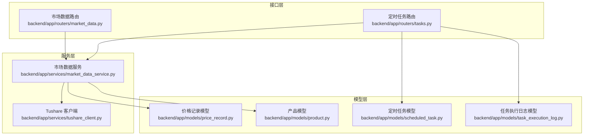
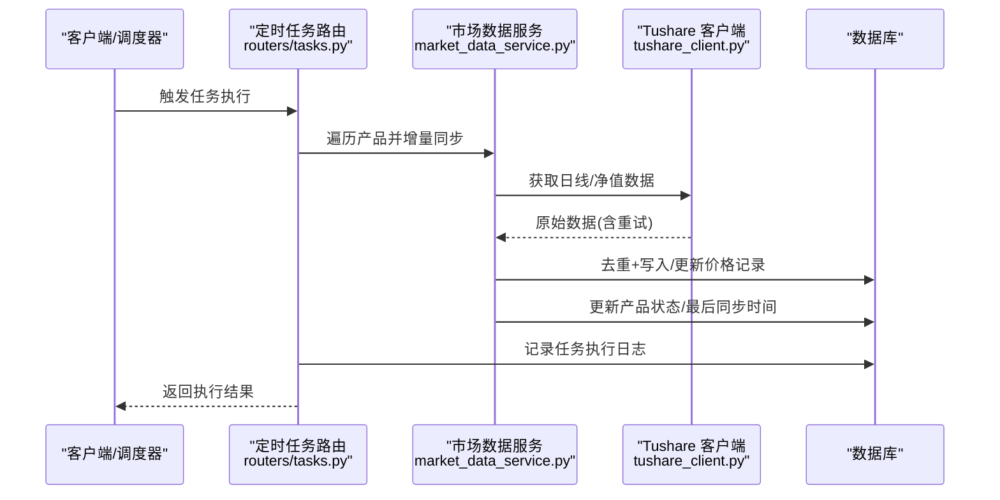
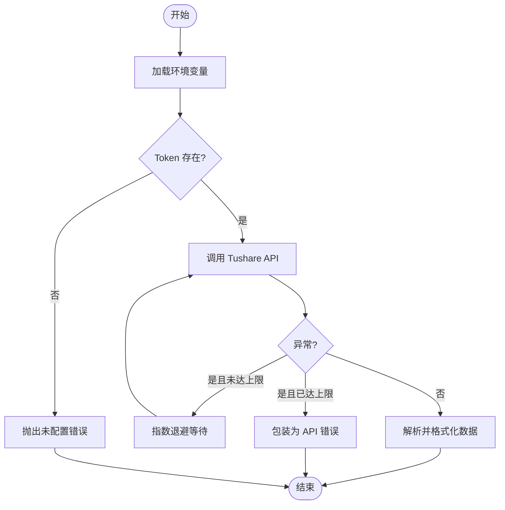
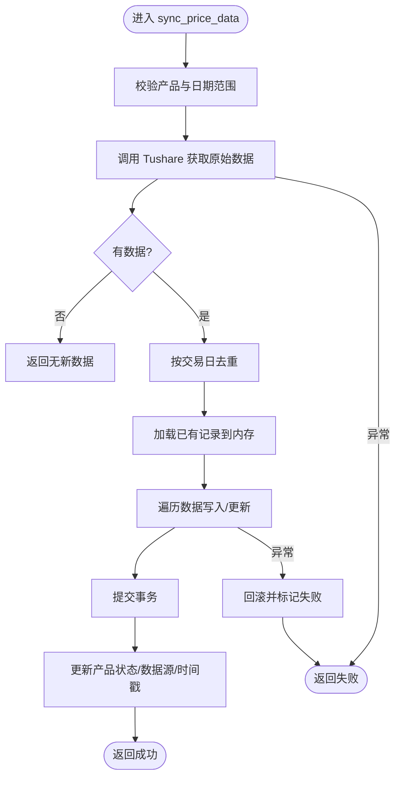
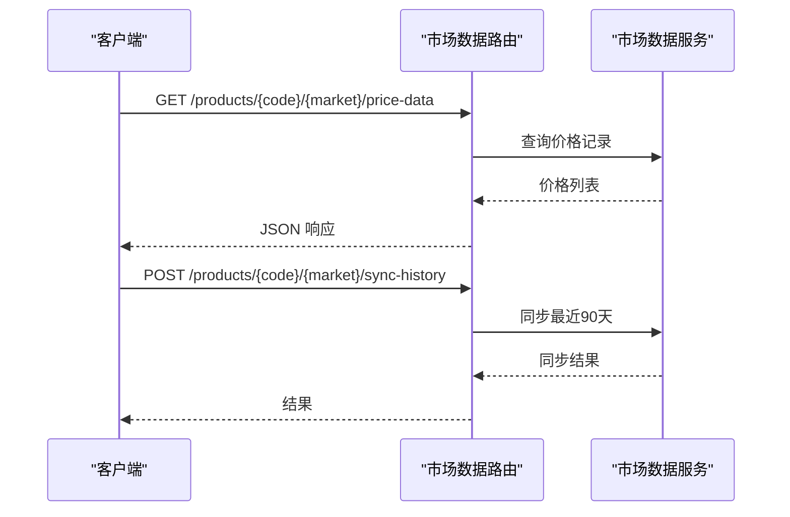
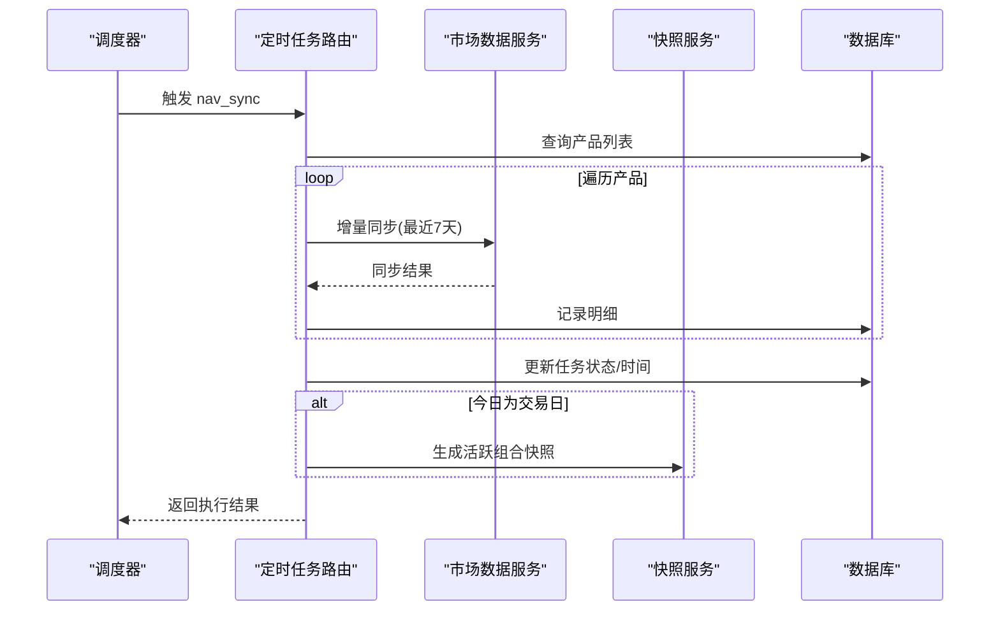
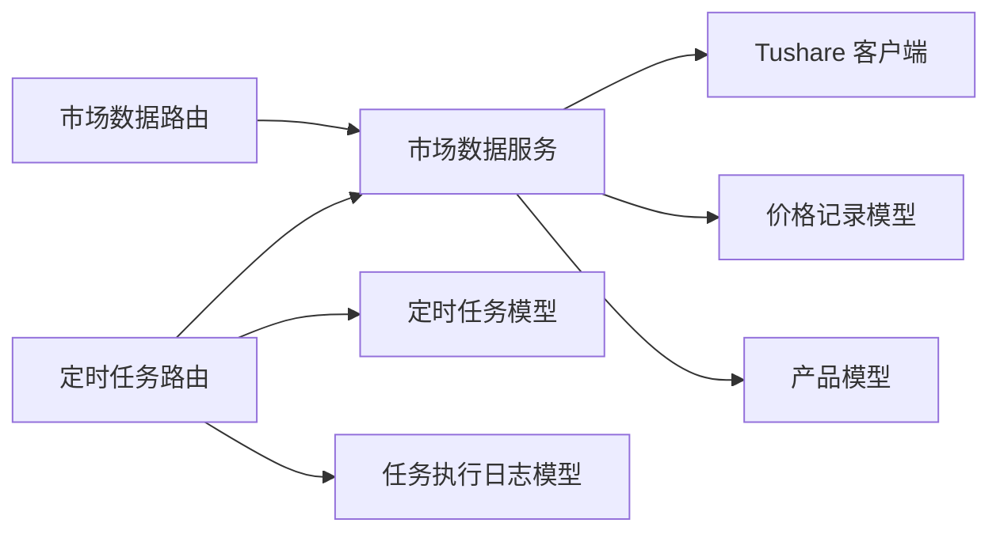

# 数据同步任务

<cite>
**本文引用的文件**
- [backend/app/services/tushare_client.py](file://backend/app/services/tushare_client.py)
- [backend/app/services/market_data_service.py](file://backend/app/services/market_data_service.py)
- [backend/app/models/price_record.py](file://backend/app/models/price_record.py)
- [backend/app/models/product.py](file://backend/app/models/product.py)
- [backend/app/routers/market_data.py](file://backend/app/routers/market_data.py)
- [backend/app/routers/tasks.py](file://backend/app/routers/tasks.py)
- [backend/app/models/scheduled_task.py](file://backend/app/models/scheduled_task.py)
- [backend/app/init_tasks.py](file://backend/app/init_tasks.py)
- [backend/app/models/task_execution_log.py](file://backend/app/models/task_execution_log.py)
- [backend/app/schemas/market_data.py](file://backend/app/schemas/market_data.py)
</cite>

## 目录
1. [引言](#引言)
2. [项目结构](#项目结构)
3. [核心组件](#核心组件)
4. [架构总览](#架构总览)
5. [详细组件分析](#详细组件分析)
6. [依赖分析](#依赖分析)
7. [性能考虑](#性能考虑)
8. [故障排查指南](#故障排查指南)
9. [结论](#结论)
10. [附录](#附录)

## 引言
本文件系统性地文档化“数据同步任务”的实现机制，重点覆盖市场数据同步（Tushare API 数据获取、历史数据回补、实时数据更新）、触发条件与执行频率、并发控制策略、数据验证与错误处理、重试策略、数据清洗与格式转换、存储流程、性能优化与限流、监控指标与故障排查、以及数据质量检查与异常处理流程。目标是帮助开发者与运维人员快速理解并维护数据同步子系统。

## 项目结构
围绕数据同步任务的关键模块与文件如下：
- 接口层：市场数据路由与定时任务路由
- 服务层：Tushare 客户端封装、市场数据同步服务、快照服务（用于净值同步后的快照生成）
- 模型层：价格记录、产品、定时任务、任务执行日志等
- 架构分层：接口层负责请求接入与参数校验；服务层负责业务逻辑与外部 API 调用；模型层负责数据持久化与约束

图表来源
- [backend/app/routers/market_data.py:1-112](file://backend/app/routers/market_data.py#L1-L112)
- [backend/app/routers/tasks.py:1-323](file://backend/app/routers/tasks.py#L1-L323)
- [backend/app/services/tushare_client.py:1-222](file://backend/app/services/tushare_client.py#L1-L222)
- [backend/app/services/market_data_service.py:1-323](file://backend/app/services/market_data_service.py#L1-L323)
- [backend/app/models/price_record.py:1-28](file://backend/app/models/price_record.py#L1-L28)
- [backend/app/models/product.py:1-22](file://backend/app/models/product.py#L1-L22)
- [backend/app/models/scheduled_task.py:1-19](file://backend/app/models/scheduled_task.py#L1-L19)
- [backend/app/models/task_execution_log.py:1-21](file://backend/app/models/task_execution_log.py#L1-L21)

章节来源
- [backend/app/routers/market_data.py:1-112](file://backend/app/routers/market_data.py#L1-L112)
- [backend/app/routers/tasks.py:1-323](file://backend/app/routers/tasks.py#L1-L323)
- [backend/app/services/tushare_client.py:1-222](file://backend/app/services/tushare_client.py#L1-L222)
- [backend/app/services/market_data_service.py:1-323](file://backend/app/services/market_data_service.py#L1-L323)
- [backend/app/models/price_record.py:1-28](file://backend/app/models/price_record.py#L1-L28)
- [backend/app/models/product.py:1-22](file://backend/app/models/product.py#L1-L22)
- [backend/app/models/scheduled_task.py:1-19](file://backend/app/models/scheduled_task.py#L1-L19)
- [backend/app/models/task_execution_log.py:1-21](file://backend/app/models/task_execution_log.py#L1-L21)

## 核心组件
- Tushare 客户端：封装 Tushare Pro 的访问、Token 校验、交易日历与基金行情/净值获取，并内置指数退避重试
- 市场数据服务：统一的价格数据同步入口，按市场类型选择不同数据源字段，去重与写库，更新产品数据源状态
- 接口路由：提供查询价格、手动同步、历史回补、组合净值同步等接口
- 定时任务：定义 nav_sync、trading_calendar_sync、log_cleanup 三类任务，支持手动运行、启停与日志查看
- 模型与日志：价格记录、产品、定时任务、任务执行日志等，支撑数据持久化与监控

章节来源
- [backend/app/services/tushare_client.py:1-222](file://backend/app/services/tushare_client.py#L1-L222)
- [backend/app/services/market_data_service.py:1-323](file://backend/app/services/market_data_service.py#L1-L323)
- [backend/app/routers/market_data.py:1-112](file://backend/app/routers/market_data.py#L1-L112)
- [backend/app/routers/tasks.py:1-323](file://backend/app/routers/tasks.py#L1-L323)
- [backend/app/models/price_record.py:1-28](file://backend/app/models/price_record.py#L1-L28)
- [backend/app/models/product.py:1-22](file://backend/app/models/product.py#L1-L22)
- [backend/app/models/scheduled_task.py:1-19](file://backend/app/models/scheduled_task.py#L1-L19)
- [backend/app/models/task_execution_log.py:1-21](file://backend/app/models/task_execution_log.py#L1-L21)

## 架构总览
数据同步从接口层进入，经服务层调用 Tushare 客户端获取原始数据，再由市场数据服务进行清洗与入库，同时更新产品状态与最后同步时间。定时任务路由负责周期性调度与手动触发执行，并记录任务执行日志。

图表来源
- [backend/app/routers/tasks.py:88-268](file://backend/app/routers/tasks.py#L88-L268)
- [backend/app/services/market_data_service.py:88-226](file://backend/app/services/market_data_service.py#L88-L226)
- [backend/app/services/tushare_client.py:48-222](file://backend/app/services/tushare_client.py#L48-L222)

## 详细组件分析

### Tushare 客户端
- 功能要点
  - 环境变量加载与 Token 校验
  - 交易日历批量获取与格式化
  - 场内基金日线与场外基金净值获取
  - 指数退避重试（最多3次，延迟倍增）
- 错误处理
  - 未配置 Token 抛出特定异常
  - API 调用异常包装为统一异常类型
- 性能与限流
  - 内置重试与延迟增长，降低瞬时压力
  - 建议：结合业务侧并发控制与速率限制

图表来源
- [backend/app/services/tushare_client.py:13-46](file://backend/app/services/tushare_client.py#L13-L46)
- [backend/app/services/tushare_client.py:48-102](file://backend/app/services/tushare_client.py#L48-L102)
- [backend/app/services/tushare_client.py:123-171](file://backend/app/services/tushare_client.py#L123-L171)
- [backend/app/services/tushare_client.py:174-221](file://backend/app/services/tushare_client.py#L174-L221)

章节来源
- [backend/app/services/tushare_client.py:1-222](file://backend/app/services/tushare_client.py#L1-L222)

### 市场数据服务
- 功能要点
  - 价格数据同步：根据市场类型选择字段映射，去重（按交易日），增量写入/更新
  - 组合净值同步：基于持仓与最新价格计算单位净值并写入快照
  - 产品状态管理：成功/失败状态、数据源、最后同步时间
- 数据清洗与格式转换
  - 去除重复交易日记录，保留最新一条
  - 字段映射：日线行情映射为 unit_price、pre_close、pct_change；净值映射为 unit_price、accumulated_nav
- 错误处理与重试
  - 外部 API 异常捕获并返回失败结果
  - 写库异常回滚并标记产品状态为失败
- 并发控制
  - 当前实现逐产品顺序执行，未见显式并发池或队列控制

图表来源
- [backend/app/services/market_data_service.py:88-226](file://backend/app/services/market_data_service.py#L88-L226)

章节来源
- [backend/app/services/market_data_service.py:1-323](file://backend/app/services/market_data_service.py#L1-L323)
- [backend/app/models/price_record.py:1-28](file://backend/app/models/price_record.py#L1-L28)
- [backend/app/models/product.py:1-22](file://backend/app/models/product.py#L1-L22)

### 接口路由
- 市场数据接口
  - 查询价格数据：支持起止日期与条数限制
  - 手动同步：按传入日期范围同步
  - 历史回补：默认最近90天
  - 组合净值同步：基于持仓与最新价格计算
- 错误处理
  - 参数与业务异常转换为 HTTP 4xx/5xx

图表来源
- [backend/app/routers/market_data.py:17-93](file://backend/app/routers/market_data.py#L17-L93)
- [backend/app/schemas/market_data.py:1-19](file://backend/app/schemas/market_data.py#L1-L19)

章节来源
- [backend/app/routers/market_data.py:1-112](file://backend/app/routers/market_data.py#L1-L112)
- [backend/app/schemas/market_data.py:1-19](file://backend/app/schemas/market_data.py#L1-L19)

### 定时任务与执行日志
- 任务定义
  - nav_sync：工作日 07:00 增量同步净值（最近7天）
  - trading_calendar_sync：每年 1 月 1 日 02:00 同步新年交易日历
  - log_cleanup：周日 04:00 清理过期日志
- 执行流程
  - 手动运行：记录执行日志，按任务类型执行
  - nav_sync：遍历产品，逐个执行增量同步，记录明细与最终状态
  - 自动快照：净值同步成功后，在交易日自动为活跃组合生成当日快照
- 日志与监控
  - 任务执行日志包含触发方式、状态、耗时、记录总数/成功/失败、错误信息

图表来源
- [backend/app/routers/tasks.py:88-268](file://backend/app/routers/tasks.py#L88-L268)
- [backend/app/models/scheduled_task.py:1-19](file://backend/app/models/scheduled_task.py#L1-L19)
- [backend/app/models/task_execution_log.py:1-21](file://backend/app/models/task_execution_log.py#L1-L21)

章节来源
- [backend/app/routers/tasks.py:1-323](file://backend/app/routers/tasks.py#L1-L323)
- [backend/app/models/scheduled_task.py:1-19](file://backend/app/models/scheduled_task.py#L1-L19)
- [backend/app/models/task_execution_log.py:1-21](file://backend/app/models/task_execution_log.py#L1-L21)
- [backend/app/init_tasks.py:1-45](file://backend/app/init_tasks.py#L1-L45)

## 依赖分析
- 组件耦合
  - 路由依赖服务层；服务层依赖模型层与 Tushare 客户端
  - 定时任务路由在执行 nav_sync 时依赖市场数据服务与快照服务
- 外部依赖
  - Tushare Pro SDK
  - SQLAlchemy ORM 与数据库
- 潜在循环依赖
  - 未发现直接循环依赖

图表来源
- [backend/app/routers/market_data.py:1-112](file://backend/app/routers/market_data.py#L1-L112)
- [backend/app/routers/tasks.py:1-323](file://backend/app/routers/tasks.py#L1-L323)
- [backend/app/services/market_data_service.py:1-323](file://backend/app/services/market_data_service.py#L1-L323)
- [backend/app/services/tushare_client.py:1-222](file://backend/app/services/tushare_client.py#L1-L222)
- [backend/app/models/price_record.py:1-28](file://backend/app/models/price_record.py#L1-L28)
- [backend/app/models/product.py:1-22](file://backend/app/models/product.py#L1-L22)
- [backend/app/models/scheduled_task.py:1-19](file://backend/app/models/scheduled_task.py#L1-L19)
- [backend/app/models/task_execution_log.py:1-21](file://backend/app/models/task_execution_log.py#L1-L21)

章节来源
- [backend/app/routers/market_data.py:1-112](file://backend/app/routers/market_data.py#L1-L112)
- [backend/app/routers/tasks.py:1-323](file://backend/app/routers/tasks.py#L1-L323)
- [backend/app/services/market_data_service.py:1-323](file://backend/app/services/market_data_service.py#L1-L323)
- [backend/app/services/tushare_client.py:1-222](file://backend/app/services/tushare_client.py#L1-L222)
- [backend/app/models/price_record.py:1-28](file://backend/app/models/price_record.py#L1-L28)
- [backend/app/models/product.py:1-22](file://backend/app/models/product.py#L1-L22)
- [backend/app/models/scheduled_task.py:1-19](file://backend/app/models/scheduled_task.py#L1-L19)
- [backend/app/models/task_execution_log.py:1-21](file://backend/app/models/task_execution_log.py#L1-L21)

## 性能考虑
- 重试与退避
  - Tushare 客户端采用指数退避重试，减少瞬时失败带来的压力
- 写库策略
  - 先加载已有记录到内存，再批量更新/插入，避免重复 IO
- 并发控制
  - 当前 nav_sync 逐产品顺序执行，建议引入任务队列与并发池以提升吞吐
- 限流与节流
  - 建议在服务层增加速率限制与并发上限，防止外部 API 限流
- 索引与查询
  - 价格记录按产品码+市场+日期建立唯一索引，有利于去重与查询
- 缓存
  - 对于高频查询的交易日历等静态数据，可引入本地缓存减少重复拉取

## 故障排查指南
- 常见问题定位
  - Tushare Token 未配置：检查环境变量与 .env 文件
  - API 调用失败：查看重试日志与异常栈
  - 写库失败：检查数据库连接、权限与唯一约束冲突
  - 产品不存在：确认产品编码与市场类型
- 监控与日志
  - 查看任务执行日志：包含状态、耗时、错误信息
  - 查看产品数据源状态：success/failed/pending
- 处理步骤
  - 手动触发同步：使用路由接口进行小范围验证
  - 分批重试：对失败产品单独重试
  - 核对交易日历：确保当天为交易日后再生成快照

章节来源
- [backend/app/services/tushare_client.py:38-46](file://backend/app/services/tushare_client.py#L38-L46)
- [backend/app/services/market_data_service.py:135-138](file://backend/app/services/market_data_service.py#L135-L138)
- [backend/app/routers/tasks.py:101-110](file://backend/app/routers/tasks.py#L101-L110)
- [backend/app/models/task_execution_log.py:1-21](file://backend/app/models/task_execution_log.py#L1-L21)
- [backend/app/models/product.py:15-18](file://backend/app/models/product.py#L15-L18)

## 结论
本数据同步体系以 Tushare 为核心数据源，通过清晰的服务层与路由层实现历史回补、增量同步与组合净值计算，并配套完善的任务调度与日志监控。当前实现具备基础的重试与去重能力，建议后续引入并发控制、限流与缓存策略以进一步提升稳定性与性能。

## 附录

### 数据同步触发条件与执行频率
- nav_sync：工作日 07:00 增量同步（最近7天）
- trading_calendar_sync：每年 1 月 1 日 02:00 同步新年交易日历
- log_cleanup：每周日 04:00 清理过期日志

章节来源
- [backend/app/init_tasks.py:14-33](file://backend/app/init_tasks.py#L14-L33)
- [backend/app/models/scheduled_task.py:11-16](file://backend/app/models/scheduled_task.py#L11-L16)

### 数据验证规则与异常处理
- 数据验证
  - 价格记录唯一性：产品码+市场+日期
  - 组合净值计算前置条件：组合激活、存在持仓、份额非零
- 异常处理
  - 外部 API 异常：统一包装为服务层错误并返回
  - 写库异常：回滚并标记产品状态为失败
  - 未知任务：返回 404 并记录错误

章节来源
- [backend/app/models/price_record.py:21-27](file://backend/app/models/price_record.py#L21-L27)
- [backend/app/services/market_data_service.py:244-256](file://backend/app/services/market_data_service.py#L244-L256)
- [backend/app/routers/tasks.py:252-257](file://backend/app/routers/tasks.py#L252-L257)

### 数据清洗、格式转换与存储流程
- 清洗
  - 去重：按交易日合并，保留最新记录
- 转换
  - 日线行情：unit_price=close，pre_close、pct_change
  - 场外净值：unit_price=unit_nav，accumulated_nav
- 存储
  - 新增：写入价格记录
  - 更新：按日期覆盖字段
  - 产品状态：成功/失败、数据源、最后同步时间

章节来源
- [backend/app/services/market_data_service.py:147-219](file://backend/app/services/market_data_service.py#L147-L219)
- [backend/app/models/price_record.py:8-19](file://backend/app/models/price_record.py#L8-L19)
- [backend/app/models/product.py:15-18](file://backend/app/models/product.py#L15-L18)