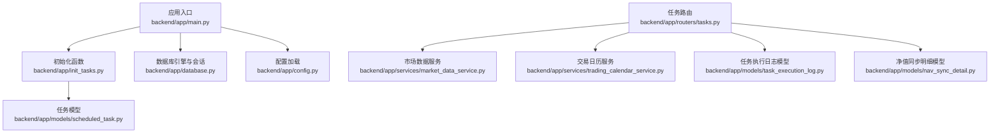
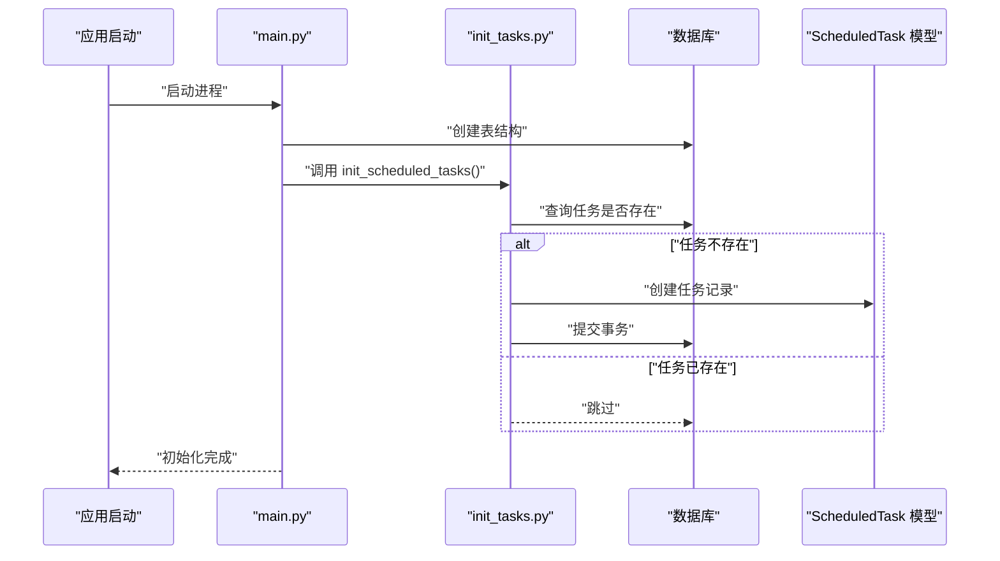
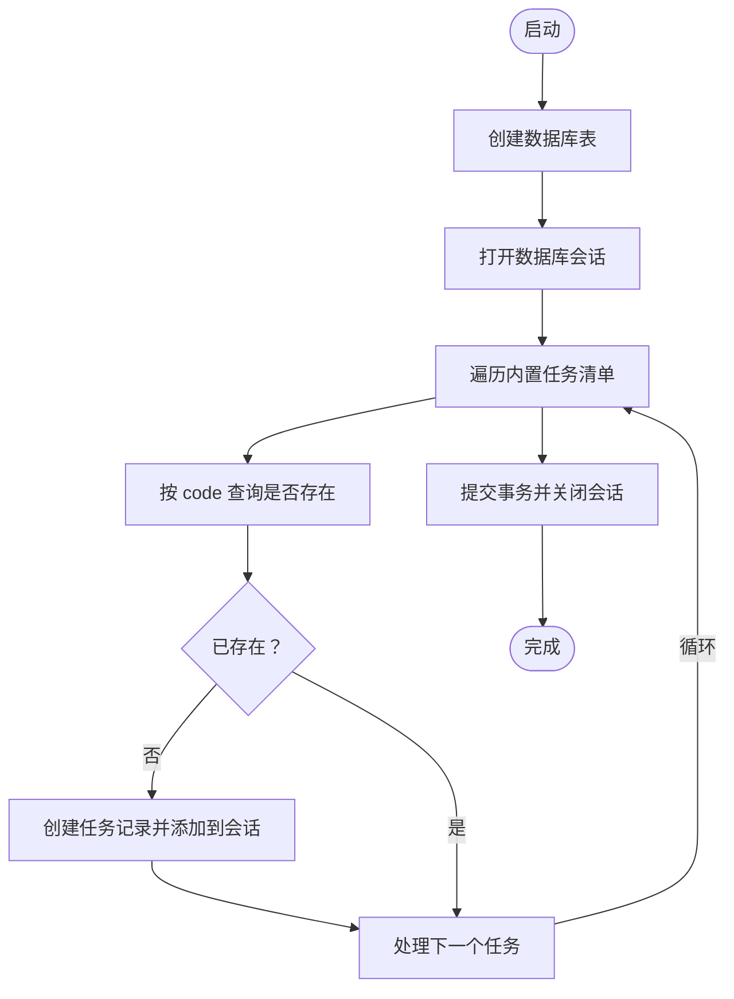
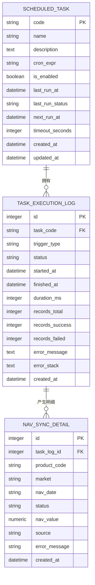
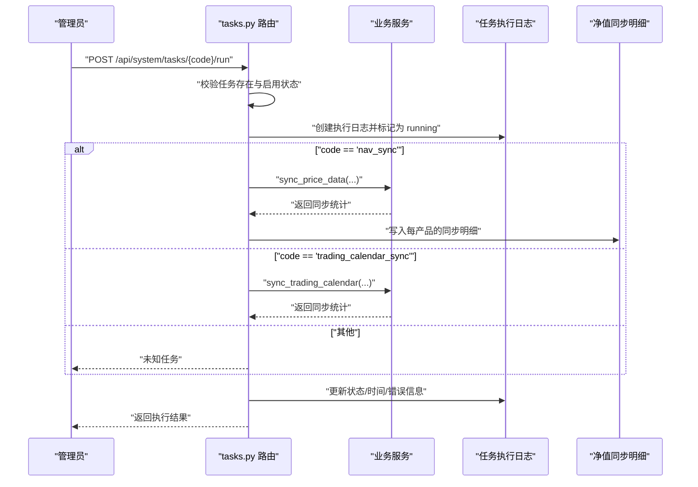
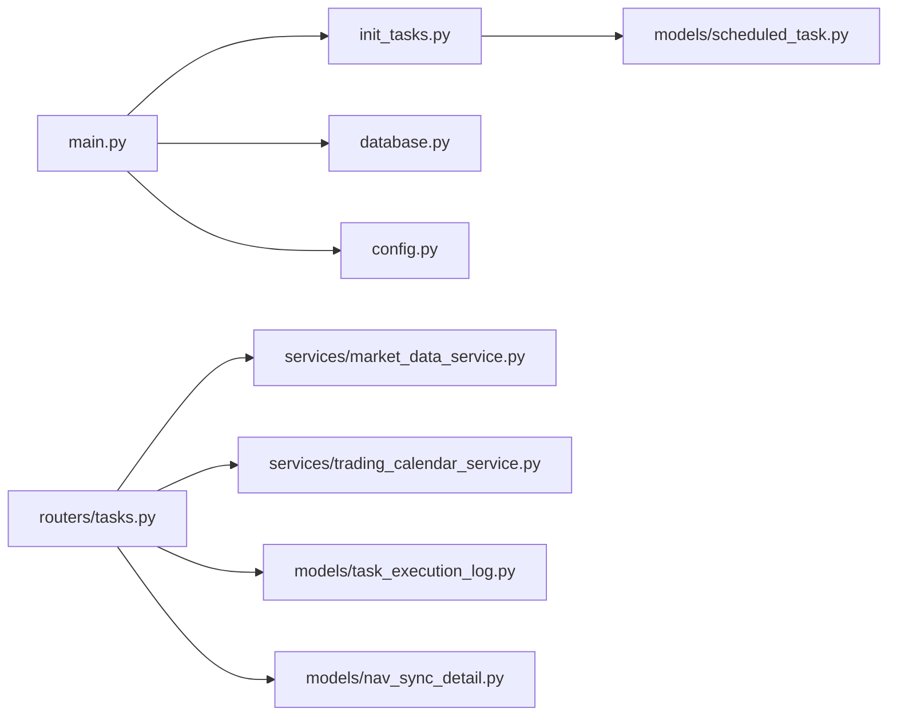

# 任务初始化

<cite>
**本文引用的文件**
- [backend/app/main.py](file://backend/app/main.py)
- [backend/app/init_tasks.py](file://backend/app/init_tasks.py)
- [backend/app/config.py](file://backend/app/config.py)
- [backend/app/database.py](file://backend/app/database.py)
- [backend/app/models/scheduled_task.py](file://backend/app/models/scheduled_task.py)
- [backend/app/models/task_execution_log.py](file://backend/app/models/task_execution_log.py)
- [backend/app/models/nav_sync_detail.py](file://backend/app/models/nav_sync_detail.py)
- [backend/app/routers/tasks.py](file://backend/app/routers/tasks.py)
- [backend/app/services/market_data_service.py](file://backend/app/services/market_data_service.py)
- [backend/app/services/trading_calendar_service.py](file://backend/app/services/trading_calendar_service.py)
</cite>

## 目录
1. [简介](#简介)
2. [项目结构](#项目结构)
3. [核心组件](#核心组件)
4. [架构总览](#架构总览)
5. [详细组件分析](#详细组件分析)
6. [依赖关系分析](#依赖关系分析)
7. [性能考量](#性能考量)
8. [故障排除指南](#故障排除指南)
9. [结论](#结论)
10. [附录](#附录)

## 简介
本文件系统性阐述 InvestRing 后端在启动阶段的任务初始化与调度管理机制，重点覆盖以下方面：
- 系统启动时的内置任务注册与初始化流程
- 任务元数据的存储与管理方式
- 任务依赖关系的解析与初始化顺序
- 自定义任务的注册流程与配置方法
- 任务初始化与数据库迁移的关系
- 调试与故障排除建议

本系统通过应用启动时的一次性初始化，确保核心定时任务在数据库中存在且可用；同时提供任务管理接口以支持手动执行、启用/禁用与历史日志查看。

## 项目结构
与任务初始化直接相关的模块分布如下：
- 应用入口与初始化：backend/app/main.py
- 启动时任务初始化：backend/app/init_tasks.py
- 配置与数据库连接：backend/app/config.py、backend/app/database.py
- 任务元数据模型：backend/app/models/scheduled_task.py
- 任务执行日志与明细：backend/app/models/task_execution_log.py、backend/app/models/nav_sync_detail.py
- 任务管理路由：backend/app/routers/tasks.py
- 业务服务（净值/日历同步等）：backend/app/services/market_data_service.py、backend/app/services/trading_calendar_service.py

图表来源
- [backend/app/main.py:1-53](file://backend/app/main.py#L1-L53)
- [backend/app/init_tasks.py:1-45](file://backend/app/init_tasks.py#L1-L45)
- [backend/app/database.py:1-39](file://backend/app/database.py#L1-L39)
- [backend/app/config.py:1-37](file://backend/app/config.py#L1-L37)
- [backend/app/models/scheduled_task.py:1-19](file://backend/app/models/scheduled_task.py#L1-L19)
- [backend/app/routers/tasks.py:1-323](file://backend/app/routers/tasks.py#L1-L323)
- [backend/app/services/market_data_service.py:1-323](file://backend/app/services/market_data_service.py#L1-L323)
- [backend/app/services/trading_calendar_service.py:1-125](file://backend/app/services/trading_calendar_service.py#L1-L125)
- [backend/app/models/task_execution_log.py:1-21](file://backend/app/models/task_execution_log.py#L1-L21)
- [backend/app/models/nav_sync_detail.py:1-18](file://backend/app/models/nav_sync_detail.py#L1-L18)

章节来源
- [backend/app/main.py:1-53](file://backend/app/main.py#L1-L53)
- [backend/app/init_tasks.py:1-45](file://backend/app/init_tasks.py#L1-L45)
- [backend/app/config.py:1-37](file://backend/app/config.py#L1-L37)
- [backend/app/database.py:1-39](file://backend/app/database.py#L1-L39)

## 核心组件
- 应用入口与初始化
  - 在应用启动时创建数据库表并调用初始化函数，确保内置任务记录存在。
- 启动时任务初始化
  - 保证三个核心任务在数据库中存在：净值同步、交易日历同步、日志清理。
- 配置与数据库
  - 通过配置类加载环境变量，构造数据库连接池与会话工厂。
- 任务元数据模型
  - 定义任务的标识、名称、描述、Cron 表达式、启用状态、时间戳等字段。
- 任务执行日志与明细
  - 记录每次任务执行的触发方式、状态、耗时、错误信息以及净值同步的逐产品明细。
- 任务管理路由
  - 提供任务列表、手动执行、启用/禁用、历史日志查询等接口。
- 业务服务
  - 净值同步服务负责对接第三方数据源并写入价格记录。
  - 交易日历服务负责同步交易日历到数据库。

章节来源
- [backend/app/main.py:1-53](file://backend/app/main.py#L1-L53)
- [backend/app/init_tasks.py:1-45](file://backend/app/init_tasks.py#L1-L45)
- [backend/app/models/scheduled_task.py:1-19](file://backend/app/models/scheduled_task.py#L1-L19)
- [backend/app/models/task_execution_log.py:1-21](file://backend/app/models/task_execution_log.py#L1-L21)
- [backend/app/models/nav_sync_detail.py:1-18](file://backend/app/models/nav_sync_detail.py#L1-L18)
- [backend/app/routers/tasks.py:1-323](file://backend/app/routers/tasks.py#L1-L323)
- [backend/app/services/market_data_service.py:1-323](file://backend/app/services/market_data_service.py#L1-L323)
- [backend/app/services/trading_calendar_service.py:1-125](file://backend/app/services/trading_calendar_service.py#L1-L125)

## 架构总览
下图展示了应用启动时的任务初始化与后续任务执行的整体流程。

图表来源
- [backend/app/main.py:7-15](file://backend/app/main.py#L7-L15)
- [backend/app/init_tasks.py:5-44](file://backend/app/init_tasks.py#L5-L44)
- [backend/app/models/scheduled_task.py:5-19](file://backend/app/models/scheduled_task.py#L5-L19)

## 详细组件分析

### 启动时任务初始化流程
- 初始化目标
  - 确保三个核心任务记录存在于数据库中：净值同步、交易日历同步、日志清理。
- 初始化逻辑
  - 遍历预设任务清单，按 code 查询是否存在；若不存在则创建并持久化。
- 触发时机
  - 应用启动时在创建表之后立即执行，确保后续任务管理接口可用。
- 事务与资源
  - 使用独立会话进行初始化，结束后关闭会话，避免影响主请求生命周期。

图表来源
- [backend/app/main.py:7-15](file://backend/app/main.py#L7-L15)
- [backend/app/init_tasks.py:5-44](file://backend/app/init_tasks.py#L5-L44)

章节来源
- [backend/app/main.py:7-15](file://backend/app/main.py#L7-L15)
- [backend/app/init_tasks.py:5-44](file://backend/app/init_tasks.py#L5-L44)

### 任务元数据的存储与管理
- 存储模型
  - ScheduledTask：保存任务的唯一标识、名称、描述、Cron 表达式、启用状态、最近/下次运行时间、超时等。
- 管理方式
  - 启动时一次性写入；运行时通过任务管理接口进行启用/禁用、手动执行、查看日志等操作。
- 关联模型
  - TaskExecutionLog：记录每次执行的触发类型、状态、开始/结束时间、耗时、错误信息等。
  - NavSyncDetail：净值同步的逐产品明细，关联任务执行日志 ID。

图表来源
- [backend/app/models/scheduled_task.py:5-19](file://backend/app/models/scheduled_task.py#L5-L19)
- [backend/app/models/task_execution_log.py:5-21](file://backend/app/models/task_execution_log.py#L5-L21)
- [backend/app/models/nav_sync_detail.py:5-18](file://backend/app/models/nav_sync_detail.py#L5-L18)

章节来源
- [backend/app/models/scheduled_task.py:5-19](file://backend/app/models/scheduled_task.py#L5-L19)
- [backend/app/models/task_execution_log.py:5-21](file://backend/app/models/task_execution_log.py#L5-L21)
- [backend/app/models/nav_sync_detail.py:5-18](file://backend/app/models/nav_sync_detail.py#L5-L18)

### 任务依赖关系与初始化顺序
- 内置任务之间无显式依赖
  - 净值同步、交易日历同步、日志清理均为独立任务，彼此不强依赖。
- 业务内依赖
  - 净值同步完成后，系统会在交易日且有产品数据的情况下自动触发日线快照生成（由任务路由实现），这属于“执行后动作”，而非启动时的依赖。
- 初始化顺序
  - 先创建表，再初始化内置任务，最后挂载路由与中间件，确保任务管理接口可用。

章节来源
- [backend/app/routers/tasks.py:199-230](file://backend/app/routers/tasks.py#L199-L230)
- [backend/app/main.py:7-15](file://backend/app/main.py#L7-L15)

### 自定义任务的注册流程与配置
- 注册流程
  - 在启动初始化函数中增加新的任务项，确保其 code 唯一且描述清晰。
  - 通过任务管理接口启用/禁用、设置 Cron 表达式（如需）、手动执行。
- 配置方法
  - Cron 表达式：在初始化时写入数据库；运行时可通过接口更新任务记录的 cron_expr 字段。
  - 超时设置：可在任务记录中设置 timeout_seconds，用于控制执行超时。
- 执行入口
  - 通过任务路由的 POST /api/system/tasks/{code}/run 接口触发手动执行；接口内部根据 code 分派到具体业务服务。

图表来源
- [backend/app/routers/tasks.py:88-268](file://backend/app/routers/tasks.py#L88-L268)
- [backend/app/services/market_data_service.py:88-225](file://backend/app/services/market_data_service.py#L88-L225)
- [backend/app/services/trading_calendar_service.py:15-66](file://backend/app/services/trading_calendar_service.py#L15-L66)
- [backend/app/models/task_execution_log.py:5-21](file://backend/app/models/task_execution_log.py#L5-L21)
- [backend/app/models/nav_sync_detail.py:5-18](file://backend/app/models/nav_sync_detail.py#L5-L18)

章节来源
- [backend/app/routers/tasks.py:88-268](file://backend/app/routers/tasks.py#L88-L268)
- [backend/app/services/market_data_service.py:88-225](file://backend/app/services/market_data_service.py#L88-L225)
- [backend/app/services/trading_calendar_service.py:15-66](file://backend/app/services/trading_calendar_service.py#L15-L66)

### 任务初始化与数据库迁移的关系
- 迁移职责
  - 数据库迁移通常由 Alembic 管理，负责版本化地变更表结构与索引。
- 启动初始化职责
  - 仅负责在表结构就绪后，向任务表中写入必要的初始记录，不涉及表结构变更。
- 协作顺序
  - 建议先执行数据库迁移，确保表结构完整；随后启动应用，由 init_tasks 完成任务记录的初始化。

章节来源
- [backend/app/main.py:7-8](file://backend/app/main.py#L7-L8)
- [backend/app/init_tasks.py:5-44](file://backend/app/init_tasks.py#L5-L44)

## 依赖关系分析
- 组件耦合
  - main.py 与 init_tasks.py 低耦合：前者仅在启动时调用后者一次。
  - 任务路由与业务服务高内聚：按任务 code 解耦分派，便于扩展新任务。
- 外部依赖
  - 数据库连接由 database.py 统一提供；配置由 config.py 提供。
  - 第三方数据源通过服务层封装，便于替换与测试。

图表来源
- [backend/app/main.py:1-53](file://backend/app/main.py#L1-L53)
- [backend/app/init_tasks.py:1-45](file://backend/app/init_tasks.py#L1-L45)
- [backend/app/database.py:1-39](file://backend/app/database.py#L1-L39)
- [backend/app/config.py:1-37](file://backend/app/config.py#L1-L37)
- [backend/app/models/scheduled_task.py:1-19](file://backend/app/models/scheduled_task.py#L1-L19)
- [backend/app/routers/tasks.py:1-323](file://backend/app/routers/tasks.py#L1-L323)
- [backend/app/services/market_data_service.py:1-323](file://backend/app/services/market_data_service.py#L1-L323)
- [backend/app/services/trading_calendar_service.py:1-125](file://backend/app/services/trading_calendar_service.py#L1-L125)
- [backend/app/models/task_execution_log.py:1-21](file://backend/app/models/task_execution_log.py#L1-L21)
- [backend/app/models/nav_sync_detail.py:1-18](file://backend/app/models/nav_sync_detail.py#L1-L18)

## 性能考量
- 连接池与回滚
  - 数据库连接池参数已在配置中设定，有助于提升并发性能；初始化使用短生命周期会话，避免长事务占用。
- 批量写入
  - 交易日历同步采用批量插入新记录，减少多次往返。
- 写入去重
  - 净值同步对同一天多条记录进行去重，避免重复写入。
- 超时控制
  - 任务记录可配置超时秒数，防止长时间阻塞。

章节来源
- [backend/app/database.py:7-26](file://backend/app/database.py#L7-L26)
- [backend/app/services/trading_calendar_service.py:58-61](file://backend/app/services/trading_calendar_service.py#L58-L61)
- [backend/app/services/market_data_service.py:147-153](file://backend/app/services/market_data_service.py#L147-L153)
- [backend/app/models/scheduled_task.py:16](file://backend/app/models/scheduled_task.py#L16)

## 故障排除指南
- 启动后任务不可见
  - 确认数据库表已创建且初始化函数已执行；检查初始化函数中的任务清单与数据库中记录是否一致。
- 手动执行报错
  - 查看任务执行日志的状态与错误信息；核对任务 code 是否正确、任务是否启用。
- 净值同步失败
  - 检查第三方数据源接口是否可用；查看每产品明细中的错误信息；确认产品市场类型与数据源支持范围。
- 交易日历同步异常
  - 检查 Tushare Token 配置；确认网络连通性；查看服务层抛出的具体异常类型。
- 日志清理无效
  - 确认清理策略的时间阈值是否合理；检查数据库中各日志表的数据是否超过阈值。

章节来源
- [backend/app/routers/tasks.py:19-68](file://backend/app/routers/tasks.py#L19-L68)
- [backend/app/routers/tasks.py:111-267](file://backend/app/routers/tasks.py#L111-L267)
- [backend/app/services/market_data_service.py:135-138](file://backend/app/services/market_data_service.py#L135-L138)
- [backend/app/services/trading_calendar_service.py:27-30](file://backend/app/services/trading_calendar_service.py#L27-L30)

## 结论
本系统通过启动时的一次性初始化，确保核心任务在数据库中存在，为后续的任务管理与执行提供了基础。任务元数据与执行日志模型清晰分离，既满足了运行期的可观测性，也为扩展自定义任务提供了便利。配合合理的性能参数与完善的错误日志，系统具备良好的可维护性与可扩展性。

## 附录
- 配置文件位置
  - 配置文件路径由配置类读取，建议在部署环境中提供 .env 文件以覆盖默认值。
- 数据库连接
  - 支持 MySQL 与 SQLite；SQLite 场景下启用 WAL 模式以提升兼容性。

章节来源
- [backend/app/config.py:25-36](file://backend/app/config.py#L25-L36)
- [backend/app/database.py:18-26](file://backend/app/database.py#L18-L26)