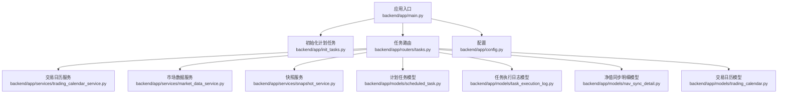
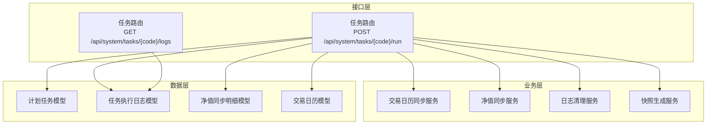
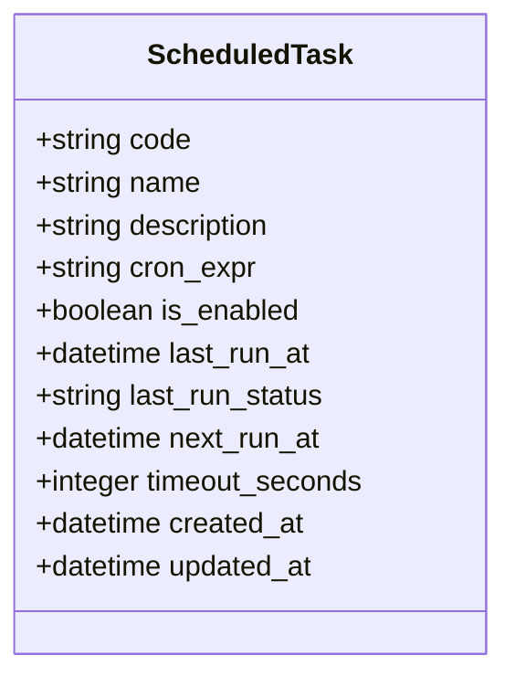
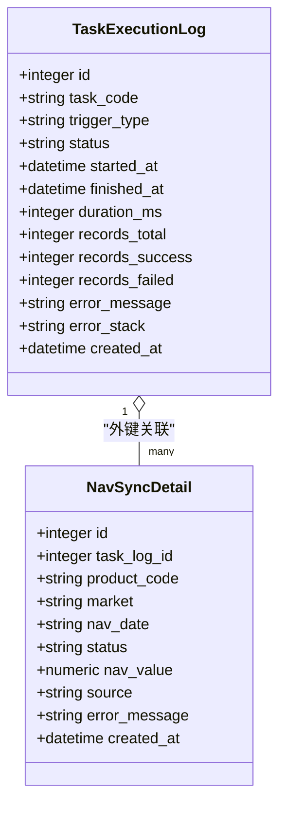
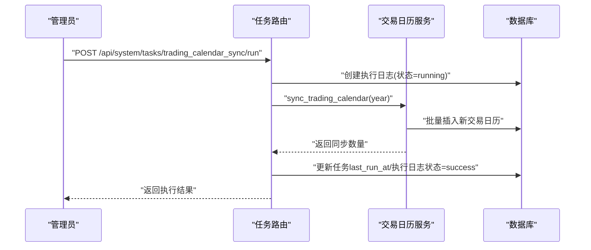
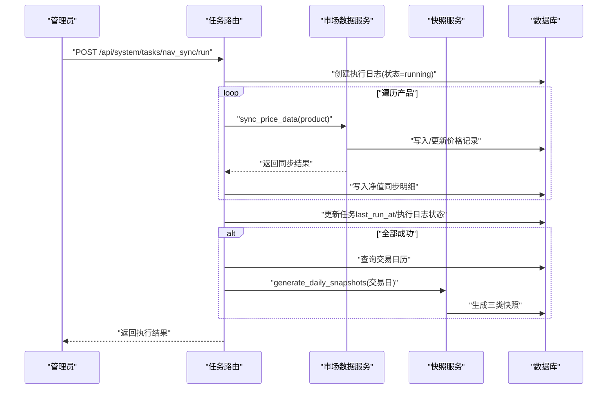
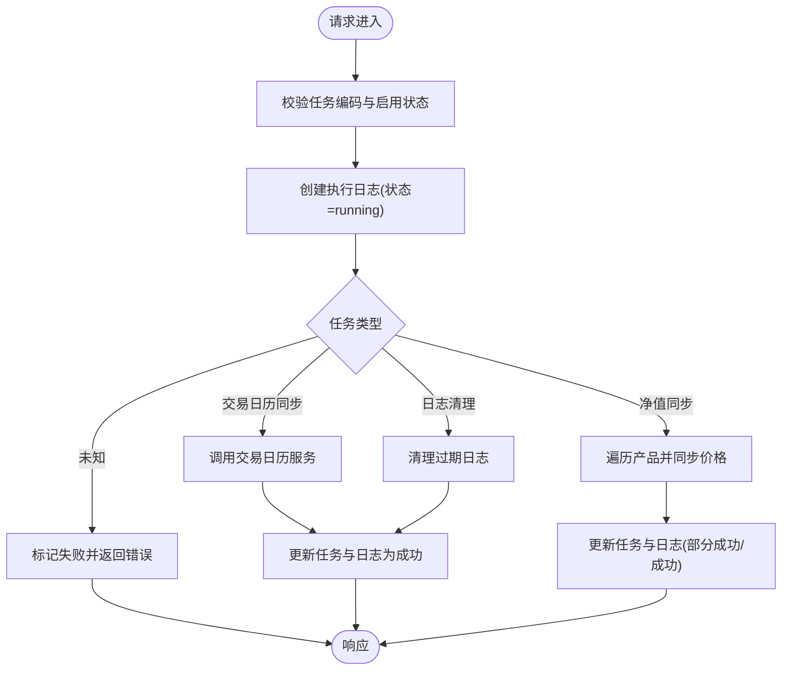
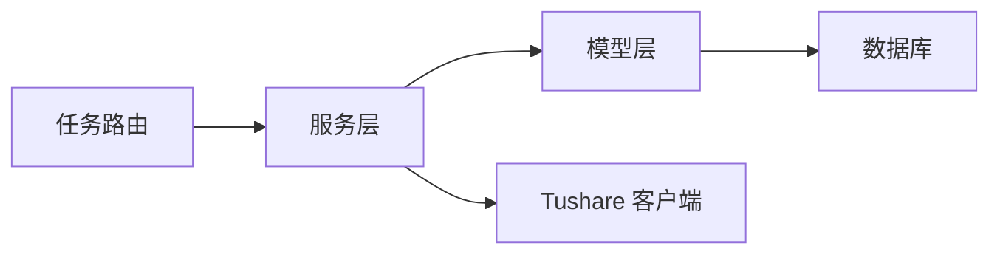

# 任务执行引擎

<cite>
**本文档引用的文件**
- [backend/app/main.py](file://backend/app/main.py)
- [backend/app/init_tasks.py](file://backend/app/init_tasks.py)
- [backend/app/routers/tasks.py](file://backend/app/routers/tasks.py)
- [backend/app/models/scheduled_task.py](file://backend/app/models/scheduled_task.py)
- [backend/app/models/task_execution_log.py](file://backend/app/models/task_execution_log.py)
- [backend/app/models/nav_sync_detail.py](file://backend/app/models/nav_sync_detail.py)
- [backend/app/models/trading_calendar.py](file://backend/app/models/trading_calendar.py)
- [backend/app/services/market_data_service.py](file://backend/app/services/market_data_service.py)
- [backend/app/services/snapshot_service.py](file://backend/app/services/snapshot_service.py)
- [backend/app/services/trading_calendar_service.py](file://backend/app/services/trading_calendar_service.py)
- [backend/app/config.py](file://backend/app/config.py)
</cite>

## 目录
1. [简介](#简介)
2. [项目结构](#项目结构)
3. [核心组件](#核心组件)
4. [架构概览](#架构概览)
5. [详细组件分析](#详细组件分析)
6. [依赖分析](#依赖分析)
7. [性能考虑](#性能考虑)
8. [故障排查指南](#故障排查指南)
9. [结论](#结论)
10. [附录](#附录)

## 简介
本文件系统性阐述 InvestRing 投资组合管理系统中的“任务执行引擎”。该引擎负责：
- 任务调度与触发：基于预设的计划任务与手动触发
- 任务执行与状态跟踪：记录每次执行的开始、结束、耗时、结果与错误
- 队列与并发控制：当前实现采用单实例串行执行，未引入外部队列中间件
- 资源分配与超时：通过任务模型的超时配置与异常捕获实现基础保护
- 错误处理与重试：当前路由层提供一次执行与异常捕获，未内置自动重试
- 监控与性能：通过任务执行日志与明细表进行可观测性与性能分析

## 项目结构
任务执行引擎围绕以下模块协同工作：
- 应用入口与初始化：FastAPI 应用启动时创建数据库表并初始化核心计划任务
- 路由层：对外暴露任务管理接口（启用/禁用、手动执行、查看日志）
- 服务层：封装具体业务任务（交易日历同步、净值同步、日志清理、快照生成）
- 模型层：定义计划任务元数据与执行日志、明细等持久化结构
- 配置层：数据库连接与应用参数

**图表来源**
- [backend/app/main.py:1-53](file://backend/app/main.py#L1-L53)
- [backend/app/init_tasks.py:1-45](file://backend/app/init_tasks.py#L1-L45)
- [backend/app/routers/tasks.py:1-323](file://backend/app/routers/tasks.py#L1-L323)
- [backend/app/models/scheduled_task.py:1-19](file://backend/app/models/scheduled_task.py#L1-L19)
- [backend/app/models/task_execution_log.py:1-21](file://backend/app/models/task_execution_log.py#L1-L21)
- [backend/app/models/nav_sync_detail.py:1-18](file://backend/app/models/nav_sync_detail.py#L1-L18)
- [backend/app/models/trading_calendar.py:1-13](file://backend/app/models/trading_calendar.py#L1-L13)
- [backend/app/services/market_data_service.py:1-323](file://backend/app/services/market_data_service.py#L1-L323)
- [backend/app/services/snapshot_service.py:1-789](file://backend/app/services/snapshot_service.py#L1-L789)
- [backend/app/services/trading_calendar_service.py:1-125](file://backend/app/services/trading_calendar_service.py#L1-L125)
- [backend/app/config.py:1-37](file://backend/app/config.py#L1-L37)

**章节来源**
- [backend/app/main.py:1-53](file://backend/app/main.py#L1-L53)
- [backend/app/config.py:1-37](file://backend/app/config.py#L1-L37)

## 核心组件
- 计划任务模型：存储任务元数据（编码、名称、描述、Cron 表达式、启用状态、下次/上次运行时间、超时秒数等）
- 任务执行日志模型：记录每次执行的触发方式、状态、起止时间、耗时、记录总数/成功/失败、错误信息与堆栈
- 净值同步明细模型：记录净值同步过程中每个产品的同步结果与错误详情
- 交易日历模型：维护交易日历，用于判断执行时机（如快照生成）
- 任务路由：提供任务查询、手动执行、启停、日志查询等接口
- 服务层任务：
  - 交易日历同步：从第三方接口拉取并批量写入交易日历
  - 净值同步：遍历产品并增量同步价格数据，记录明细
  - 日志清理：按策略清理过期日志
  - 快照生成：按顺序生成组合持仓、市值与投资人份额三类快照

**章节来源**
- [backend/app/models/scheduled_task.py:1-19](file://backend/app/models/scheduled_task.py#L1-L19)
- [backend/app/models/task_execution_log.py:1-21](file://backend/app/models/task_execution_log.py#L1-L21)
- [backend/app/models/nav_sync_detail.py:1-18](file://backend/app/models/nav_sync_detail.py#L1-L18)
- [backend/app/models/trading_calendar.py:1-13](file://backend/app/models/trading_calendar.py#L1-L13)
- [backend/app/routers/tasks.py:1-323](file://backend/app/routers/tasks.py#L1-L323)
- [backend/app/services/trading_calendar_service.py:1-125](file://backend/app/services/trading_calendar_service.py#L1-L125)
- [backend/app/services/market_data_service.py:1-323](file://backend/app/services/market_data_service.py#L1-L323)
- [backend/app/services/snapshot_service.py:1-789](file://backend/app/services/snapshot_service.py#L1-L789)

## 架构概览
任务执行引擎采用“路由驱动 + 服务层执行”的结构。应用启动时初始化核心计划任务；管理员可通过路由手动触发任务；服务层封装具体业务逻辑；所有执行均持久化到日志与明细表，便于监控与审计。

**图表来源**
- [backend/app/routers/tasks.py:1-323](file://backend/app/routers/tasks.py#L1-L323)
- [backend/app/services/trading_calendar_service.py:1-125](file://backend/app/services/trading_calendar_service.py#L1-L125)
- [backend/app/services/market_data_service.py:1-323](file://backend/app/services/market_data_service.py#L1-L323)
- [backend/app/services/snapshot_service.py:1-789](file://backend/app/services/snapshot_service.py#L1-L789)
- [backend/app/models/scheduled_task.py:1-19](file://backend/app/models/scheduled_task.py#L1-L19)
- [backend/app/models/task_execution_log.py:1-21](file://backend/app/models/task_execution_log.py#L1-L21)
- [backend/app/models/nav_sync_detail.py:1-18](file://backend/app/models/nav_sync_detail.py#L1-L18)
- [backend/app/models/trading_calendar.py:1-13](file://backend/app/models/trading_calendar.py#L1-L13)

## 详细组件分析

### 计划任务模型与初始化
- 计划任务模型包含任务编码、名称、描述、Cron 表达式、启用状态、最近/下一次运行时间、超时秒数等字段，用于描述与追踪任务
- 应用启动时调用初始化函数，确保三个核心任务记录存在：净值同步、交易日历同步、日志清理

**图表来源**
- [backend/app/models/scheduled_task.py:1-19](file://backend/app/models/scheduled_task.py#L1-L19)

**章节来源**
- [backend/app/models/scheduled_task.py:1-19](file://backend/app/models/scheduled_task.py#L1-L19)
- [backend/app/init_tasks.py:1-45](file://backend/app/init_tasks.py#L1-L45)
- [backend/app/main.py:1-53](file://backend/app/main.py#L1-L53)

### 任务执行日志与明细
- 任务执行日志记录每次执行的触发方式、状态、起止时间、耗时、记录统计与错误信息
- 净值同步明细记录每个产品同步的结果与错误，便于定位问题

**图表来源**
- [backend/app/models/task_execution_log.py:1-21](file://backend/app/models/task_execution_log.py#L1-L21)
- [backend/app/models/nav_sync_detail.py:1-18](file://backend/app/models/nav_sync_detail.py#L1-L18)

**章节来源**
- [backend/app/models/task_execution_log.py:1-21](file://backend/app/models/task_execution_log.py#L1-L21)
- [backend/app/models/nav_sync_detail.py:1-18](file://backend/app/models/nav_sync_detail.py#L1-L18)

### 交易日历同步任务
- 触发条件：按 Cron 表达式或手动触发
- 执行时机：在交易日历服务中根据年份从第三方接口获取数据并批量写入
- 并发控制：当前实现为串行执行，未引入队列
- 超时与错误：通过服务层异常捕获与路由层统一处理
- 结果记录：更新任务最近运行时间与执行日志状态

**图表来源**
- [backend/app/routers/tasks.py:112-125](file://backend/app/routers/tasks.py#L112-L125)
- [backend/app/services/trading_calendar_service.py:15-66](file://backend/app/services/trading_calendar_service.py#L15-L66)

**章节来源**
- [backend/app/routers/tasks.py:112-125](file://backend/app/routers/tasks.py#L112-L125)
- [backend/app/services/trading_calendar_service.py:15-66](file://backend/app/services/trading_calendar_service.py#L15-L66)

### 净值同步任务
- 触发条件：按 Cron 或手动触发
- 执行时机：遍历产品，增量同步价格数据，记录明细
- 并发控制：逐产品串行处理，避免并发写冲突
- 超时与错误：服务层捕获第三方 API 异常与数据库写入异常，路由层统一转换为 HTTP 错误
- 结果记录：更新任务与执行日志状态，失败产品写入明细表
- 自动后续：若全部成功，检查交易日历并在交易日自动触发快照生成

**图表来源**
- [backend/app/routers/tasks.py:127-237](file://backend/app/routers/tasks.py#L127-L237)
- [backend/app/services/market_data_service.py:88-225](file://backend/app/services/market_data_service.py#L88-L225)
- [backend/app/services/snapshot_service.py:24-94](file://backend/app/services/snapshot_service.py#L24-L94)

**章节来源**
- [backend/app/routers/tasks.py:127-237](file://backend/app/routers/tasks.py#L127-L237)
- [backend/app/services/market_data_service.py:88-225](file://backend/app/services/market_data_service.py#L88-L225)
- [backend/app/services/snapshot_service.py:24-94](file://backend/app/services/snapshot_service.py#L24-L94)

### 日志清理任务
- 触发条件：按 Cron 或手动触发
- 执行时机：清理登录、审计、任务执行、系统错误等日志
- 并发控制：串行执行，分表清理
- 超时与错误：异常捕获并回滚
- 结果记录：更新任务与执行日志状态

**章节来源**
- [backend/app/routers/tasks.py:239-250](file://backend/app/routers/tasks.py#L239-L250)

### 任务管理接口
- 查询任务列表与分页
- 启用/禁用任务
- 手动执行任务
- 查看任务执行日志

**图表来源**
- [backend/app/routers/tasks.py:88-268](file://backend/app/routers/tasks.py#L88-L268)

**章节来源**
- [backend/app/routers/tasks.py:70-323](file://backend/app/routers/tasks.py#L70-L323)

## 依赖分析
- 组件耦合
  - 路由层依赖服务层与模型层，承担编排职责
  - 服务层依赖模型层与第三方接口客户端
  - 模型层之间通过外键建立关联（执行日志与明细）
- 外部依赖
  - 数据库：MySQL（通过 SQLAlchemy ORM）
  - 第三方数据源：Tushare（交易日历与净值/行情数据）
- 循环依赖
  - 未发现循环导入或循环依赖

**图表来源**
- [backend/app/routers/tasks.py:1-323](file://backend/app/routers/tasks.py#L1-L323)
- [backend/app/services/market_data_service.py:1-323](file://backend/app/services/market_data_service.py#L1-L323)
- [backend/app/services/trading_calendar_service.py:1-125](file://backend/app/services/trading_calendar_service.py#L1-L125)
- [backend/app/models/scheduled_task.py:1-19](file://backend/app/models/scheduled_task.py#L1-L19)
- [backend/app/models/task_execution_log.py:1-21](file://backend/app/models/task_execution_log.py#L1-L21)
- [backend/app/models/nav_sync_detail.py:1-18](file://backend/app/models/nav_sync_detail.py#L1-L18)

**章节来源**
- [backend/app/routers/tasks.py:1-323](file://backend/app/routers/tasks.py#L1-L323)
- [backend/app/services/market_data_service.py:1-323](file://backend/app/services/market_data_service.py#L1-L323)
- [backend/app/services/trading_calendar_service.py:1-125](file://backend/app/services/trading_calendar_service.py#L1-L125)
- [backend/app/models/scheduled_task.py:1-19](file://backend/app/models/scheduled_task.py#L1-L19)
- [backend/app/models/task_execution_log.py:1-21](file://backend/app/models/task_execution_log.py#L1-L21)
- [backend/app/models/nav_sync_detail.py:1-18](file://backend/app/models/nav_sync_detail.py#L1-L18)

## 性能考虑
- 数据库写入优化
  - 交易日历同步采用批量插入以降低往返开销
  - 净值同步在内存中构建去重后的原始数据，减少重复写入
- 查询与索引
  - 交易日历按日期唯一索引，提高查询效率
- 并发与锁
  - 当前为串行执行，避免了锁竞争；若扩展为分布式执行，需引入分布式锁或队列去重
- 超时与资源
  - 任务模型提供超时秒数字段，建议在路由层或服务层增加超时控制（当前未实现）
- 监控指标
  - 建议补充：执行耗时分布、失败率、重试次数、吞吐量等

**章节来源**
- [backend/app/services/trading_calendar_service.py:58-66](file://backend/app/services/trading_calendar_service.py#L58-L66)
- [backend/app/services/market_data_service.py:147-209](file://backend/app/services/market_data_service.py#L147-L209)
- [backend/app/models/trading_calendar.py:8-12](file://backend/app/models/trading_calendar.py#L8-L12)
- [backend/app/models/scheduled_task.py:16](file://backend/app/models/scheduled_task.py#L16)

## 故障排查指南
- 常见问题
  - 任务未执行：检查任务是否启用、Cron 表达式是否正确、系统时间与时区
  - 执行失败：查看任务执行日志的错误消息与堆栈，定位具体产品或服务
  - 数据缺失：检查交易日历是否正确同步、产品是否在支持市场、价格数据是否到达
- 排查步骤
  - 通过任务日志接口获取最近执行记录
  - 针对失败产品查看净值同步明细
  - 检查数据库连接与第三方 API 配置
- 重试机制
  - 当前未实现自动重试；可在路由层或外部调度器中增加重试策略

**章节来源**
- [backend/app/routers/tasks.py:300-322](file://backend/app/routers/tasks.py#L300-L322)
- [backend/app/models/task_execution_log.py:10-20](file://backend/app/models/task_execution_log.py#L10-L20)
- [backend/app/models/nav_sync_detail.py:9-17](file://backend/app/models/nav_sync_detail.py#L9-L17)

## 结论
该任务执行引擎以简洁清晰的方式实现了计划任务的生命周期管理与执行监控。其优势在于：
- 明确的日志与明细记录，便于审计与问题定位
- 服务层职责单一，易于扩展新的任务
- 与系统其他组件（交易日历、市场数据、快照）紧密集成

建议后续增强：
- 引入队列与并发执行框架，提升吞吐与可靠性
- 在路由层或服务层增加超时控制与自动重试
- 增加任务执行指标采集与可视化面板

## 附录
- 关键路径参考
  - 应用启动与初始化：[backend/app/main.py:10-15](file://backend/app/main.py#L10-L15)
  - 核心任务初始化：[backend/app/init_tasks.py:5-44](file://backend/app/init_tasks.py#L5-L44)
  - 交易日历同步流程：[backend/app/routers/tasks.py:112-125](file://backend/app/routers/tasks.py#L112-L125)
  - 净值同步流程：[backend/app/routers/tasks.py:127-237](file://backend/app/routers/tasks.py#L127-L237)
  - 日志清理流程：[backend/app/routers/tasks.py:239-250](file://backend/app/routers/tasks.py#L239-L250)
  - 任务日志查询：[backend/app/routers/tasks.py:300-322](file://backend/app/routers/tasks.py#L300-L322)