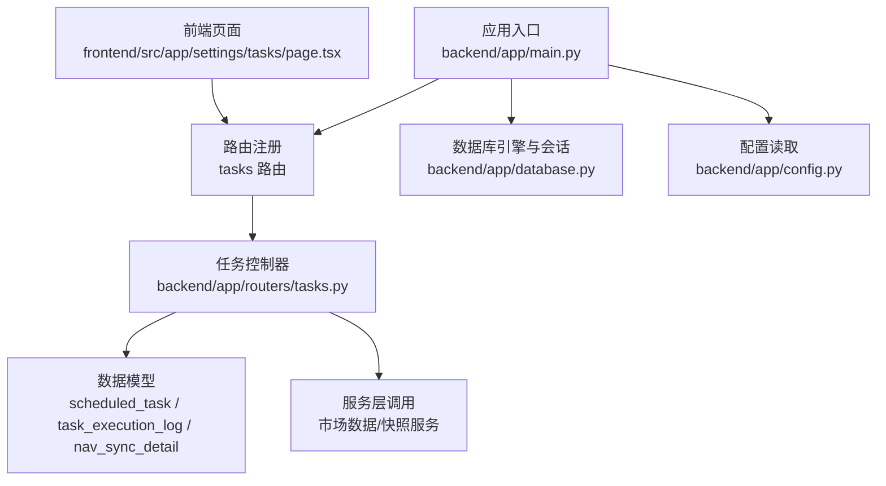
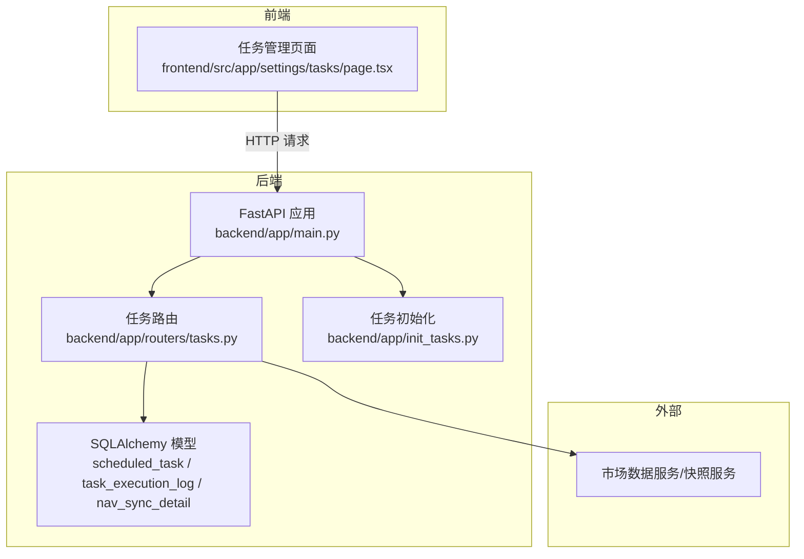
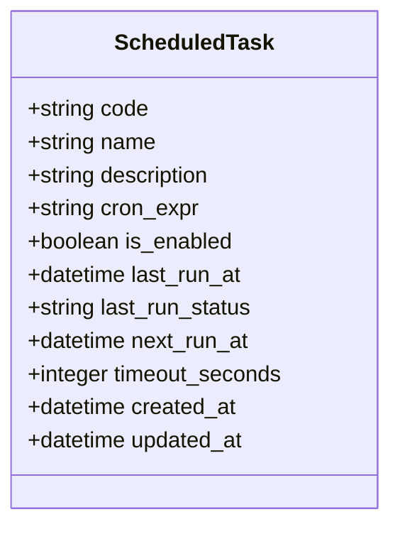
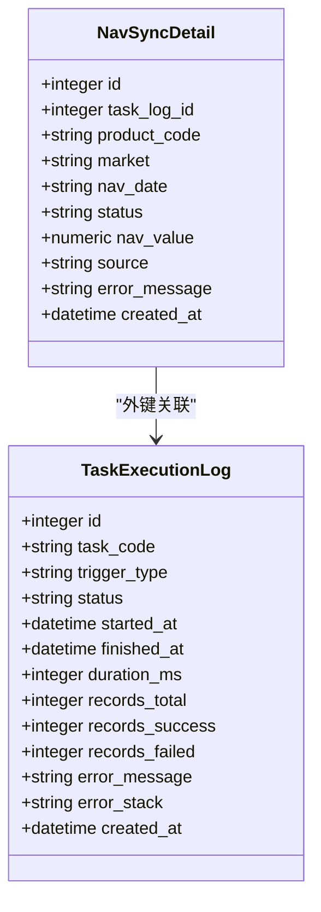
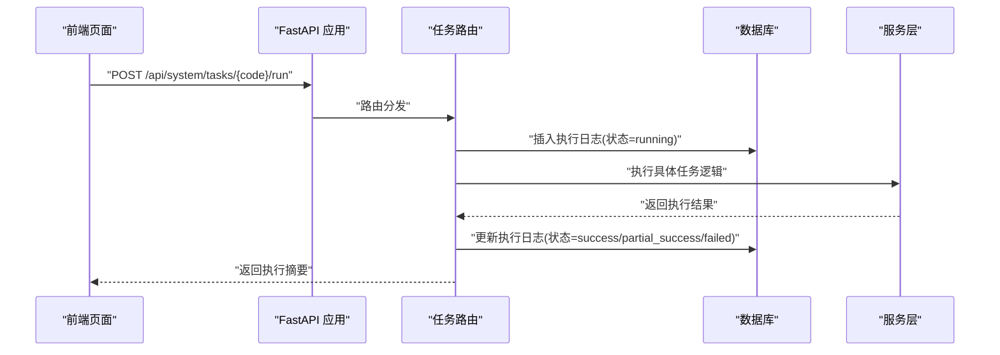
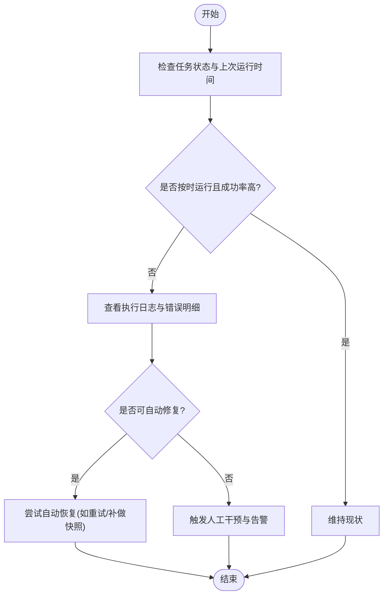
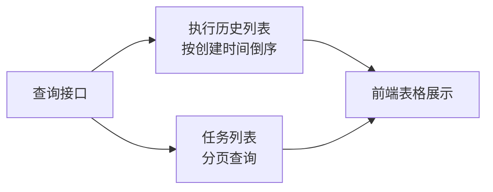
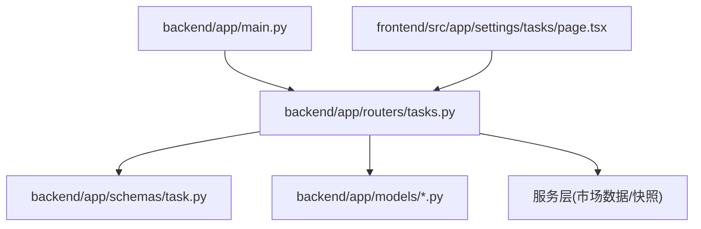

# 任务监控

<cite>
**本文引用的文件**
- [backend/app/main.py](file://backend/app/main.py)
- [backend/app/models/__init__.py](file://backend/app/models/__init__.py)
- [backend/app/models/scheduled_task.py](file://backend/app/models/scheduled_task.py)
- [backend/app/models/task_execution_log.py](file://backend/app/models/task_execution_log.py)
- [backend/app/models/nav_sync_detail.py](file://backend/app/models/nav_sync_detail.py)
- [backend/app/routers/tasks.py](file://backend/app/routers/tasks.py)
- [backend/app/schemas/task.py](file://backend/app/schemas/task.py)
- [backend/app/init_tasks.py](file://backend/app/init_tasks.py)
- [backend/app/database.py](file://backend/app/database.py)
- [backend/app/config.py](file://backend/app/config.py)
- [frontend/src/app/settings/tasks/page.tsx](file://frontend/src/app/settings/tasks/page.tsx)
- [Docs/04-后端开发.md](file://Docs/04-后端开发.md)
</cite>

## 目录
1. [简介](#简介)
2. [项目结构](#项目结构)
3. [核心组件](#核心组件)
4. [架构总览](#架构总览)
5. [组件详解](#组件详解)
6. [依赖关系分析](#依赖关系分析)
7. [性能与容量规划](#性能与容量规划)
8. [故障排查指南](#故障排查指南)
9. [结论](#结论)
10. [附录](#附录)

## 简介
本文件面向运维与开发人员，系统化阐述 InvestRing 任务监控体系的设计与实现，覆盖任务执行日志记录与管理、任务状态监控、性能指标采集与告警、执行时间统计与成功率计算、异常检测、监控数据存储与查询、可视化与报告、健康检查与自动恢复、以及监控仪表板与趋势分析方法。文档以仓库现有代码为依据，结合前端页面与后端接口，给出可落地的使用指南。

## 项目结构
后端采用 FastAPI + SQLAlchemy 架构，任务监控相关的核心文件集中在以下位置：
- 应用入口与路由注册：backend/app/main.py
- 数据模型：backend/app/models/*.py（含定时任务与执行日志）
- 任务路由与执行逻辑：backend/app/routers/tasks.py
- 任务初始化：backend/app/init_tasks.py
- 数据库与配置：backend/app/database.py、backend/app/config.py
- 前端任务管理页面：frontend/src/app/settings/tasks/page.tsx

图表来源
- [backend/app/main.py:1-53](file://backend/app/main.py#L1-L53)
- [backend/app/routers/tasks.py:1-323](file://backend/app/routers/tasks.py#L1-L323)
- [backend/app/models/scheduled_task.py:1-19](file://backend/app/models/scheduled_task.py#L1-L19)
- [backend/app/models/task_execution_log.py:1-21](file://backend/app/models/task_execution_log.py#L1-L21)
- [backend/app/models/nav_sync_detail.py:1-18](file://backend/app/models/nav_sync_detail.py#L1-L18)
- [backend/app/database.py:1-39](file://backend/app/database.py#L1-L39)
- [backend/app/config.py:1-37](file://backend/app/config.py#L1-L37)
- [frontend/src/app/settings/tasks/page.tsx:1-239](file://frontend/src/app/settings/tasks/page.tsx#L1-L239)

章节来源
- [backend/app/main.py:1-53](file://backend/app/main.py#L1-L53)
- [frontend/src/app/settings/tasks/page.tsx:1-239](file://frontend/src/app/settings/tasks/page.tsx#L1-L239)

## 核心组件
- 定时任务模型：记录任务代码、名称、描述、Cron 表达式、启用状态、下次/上次运行时间、超时时间等。
- 任务执行日志模型：记录每次任务执行的触发方式、状态、开始/结束时间、耗时、记录总数/成功/失败数、错误信息与堆栈、创建时间等。
- 净值同步明细模型：记录单个产品在某日的净值同步结果与错误信息，与任务执行日志建立外键关联。
- 任务路由与控制器：提供任务列表、手动触发、启停、执行历史查询等接口；内置日志清理策略。
- 任务初始化：确保核心任务（净值同步、交易日历同步、日志清理）在数据库中存在。
- 前端任务管理页面：展示定时任务、执行历史，支持手动触发与启停。

章节来源
- [backend/app/models/scheduled_task.py:1-19](file://backend/app/models/scheduled_task.py#L1-L19)
- [backend/app/models/task_execution_log.py:1-21](file://backend/app/models/task_execution_log.py#L1-L21)
- [backend/app/models/nav_sync_detail.py:1-18](file://backend/app/models/nav_sync_detail.py#L1-L18)
- [backend/app/routers/tasks.py:1-323](file://backend/app/routers/tasks.py#L1-L323)
- [backend/app/init_tasks.py:1-45](file://backend/app/init_tasks.py#L1-L45)
- [backend/app/schemas/task.py:1-40](file://backend/app/schemas/task.py#L1-L40)

## 架构总览
任务监控系统围绕“定时任务 + 执行日志 + 明细表 + 前端仪表板”的闭环构建：

图表来源
- [backend/app/main.py:1-53](file://backend/app/main.py#L1-L53)
- [backend/app/routers/tasks.py:1-323](file://backend/app/routers/tasks.py#L1-L323)
- [backend/app/models/scheduled_task.py:1-19](file://backend/app/models/scheduled_task.py#L1-L19)
- [backend/app/models/task_execution_log.py:1-21](file://backend/app/models/task_execution_log.py#L1-L21)
- [backend/app/models/nav_sync_detail.py:1-18](file://backend/app/models/nav_sync_detail.py#L1-L18)
- [backend/app/init_tasks.py:1-45](file://backend/app/init_tasks.py#L1-L45)
- [frontend/src/app/settings/tasks/page.tsx:1-239](file://frontend/src/app/settings/tasks/page.tsx#L1-L239)

## 组件详解

### 1) 任务模型与初始化
- ScheduledTask：维护任务元数据与调度信息，包含 Cron 表达式、启用状态、下次/上次运行时间、超时时间等。
- init_scheduled_tasks：在应用启动时确保三个核心任务记录存在，避免缺失导致调度失败。

图表来源
- [backend/app/models/scheduled_task.py:5-19](file://backend/app/models/scheduled_task.py#L5-L19)
- [backend/app/init_tasks.py:5-45](file://backend/app/init_tasks.py#L5-L45)

章节来源
- [backend/app/models/scheduled_task.py:1-19](file://backend/app/models/scheduled_task.py#L1-L19)
- [backend/app/init_tasks.py:1-45](file://backend/app/init_tasks.py#L1-L45)

### 2) 任务执行日志与明细
- TaskExecutionLog：记录每次任务执行的生命周期与结果，包括触发方式、状态、开始/结束时间、耗时、记录统计、错误信息与堆栈。
- NavSyncDetail：记录净值同步任务对单个产品的同步明细，与任务执行日志建立外键关联，便于定位失败产品。

图表来源
- [backend/app/models/task_execution_log.py:5-21](file://backend/app/models/task_execution_log.py#L5-L21)
- [backend/app/models/nav_sync_detail.py:5-18](file://backend/app/models/nav_sync_detail.py#L5-L18)

章节来源
- [backend/app/models/task_execution_log.py:1-21](file://backend/app/models/task_execution_log.py#L1-L21)
- [backend/app/models/nav_sync_detail.py:1-18](file://backend/app/models/nav_sync_detail.py#L1-L18)

### 3) 任务路由与执行流程
- 任务列表与启停：提供分页查询、启用/禁用接口。
- 手动触发：根据任务代码执行对应逻辑，记录执行日志并更新任务状态。
- 执行历史：按任务代码查询执行日志，支持分页排序。
- 日志清理：统一清理过期日志（含任务执行日志）。

图表来源
- [backend/app/routers/tasks.py:88-268](file://backend/app/routers/tasks.py#L88-L268)
- [frontend/src/app/settings/tasks/page.tsx:40-84](file://frontend/src/app/settings/tasks/page.tsx#L40-L84)

章节来源
- [backend/app/routers/tasks.py:1-323](file://backend/app/routers/tasks.py#L1-L323)
- [frontend/src/app/settings/tasks/page.tsx:1-239](file://frontend/src/app/settings/tasks/page.tsx#L1-L239)

### 4) 性能指标与统计
- 执行时间：由 started_at 与 finished_at 计算 duration_ms。
- 成功率：records_success / records_total（若未统计可设为 null）。
- 异常检测：通过 status=failed/error_message 非空识别失败；部分任务支持 partial_success。
- 明细追踪：通过 NavSyncDetail 对失败产品进行逐项记录，便于定位与重试。

章节来源
- [backend/app/models/task_execution_log.py:8-20](file://backend/app/models/task_execution_log.py#L8-L20)
- [backend/app/models/nav_sync_detail.py:8-17](file://backend/app/models/nav_sync_detail.py#L8-L17)
- [backend/app/routers/tasks.py:111-267](file://backend/app/routers/tasks.py#L111-L267)

### 5) 健康检查与自动恢复
- 健康检查：通过查询任务列表与最近执行历史判断任务是否按时运行、是否出现连续失败。
- 自动恢复：在净值同步任务成功后，自动触发当日快照生成（仅在交易日且组合处于活跃状态时）。

图表来源
- [backend/app/routers/tasks.py:199-230](file://backend/app/routers/tasks.py#L199-L230)
- [backend/app/routers/tasks.py:300-322](file://backend/app/routers/tasks.py#L300-L322)

章节来源
- [backend/app/routers/tasks.py:199-230](file://backend/app/routers/tasks.py#L199-L230)
- [backend/app/routers/tasks.py:300-322](file://backend/app/routers/tasks.py#L300-L322)

### 6) 存储、查询与可视化
- 存储：使用 SQLAlchemy ORM 映射至 MySQL，连接池参数与 WAL 模式已在数据库配置中设置。
- 查询：任务列表与执行历史均支持分页与排序；执行历史按创建时间倒序。
- 可视化：前端页面展示执行历史与任务状态，支持按状态筛选与耗时换算显示。

图表来源
- [backend/app/routers/tasks.py:70-85](file://backend/app/routers/tasks.py#L70-L85)
- [backend/app/routers/tasks.py:300-322](file://backend/app/routers/tasks.py#L300-L322)
- [frontend/src/app/settings/tasks/page.tsx:24-38](file://frontend/src/app/settings/tasks/page.tsx#L24-L38)

章节来源
- [backend/app/routers/tasks.py:70-85](file://backend/app/routers/tasks.py#L70-L85)
- [backend/app/routers/tasks.py:300-322](file://backend/app/routers/tasks.py#L300-L322)
- [frontend/src/app/settings/tasks/page.tsx:1-239](file://frontend/src/app/settings/tasks/page.tsx#L1-L239)

### 7) 告警机制
- 触发条件：任务连续失败、执行时间异常延长、成功率低于阈值、日志清理失败。
- 告警渠道：可在现有路由中扩展 Webhook/邮件/IM 集成（当前实现未包含具体告警发送逻辑，建议在路由层增加告警钩子）。
- 告警内容：包含任务代码、状态、错误摘要、耗时、失败明细等。

章节来源
- [backend/app/routers/tasks.py:19-68](file://backend/app/routers/tasks.py#L19-L68)
- [backend/app/routers/tasks.py:259-267](file://backend/app/routers/tasks.py#L259-L267)

### 8) 报表与趋势分析
- 报表维度：按任务代码、日期区间、状态分布统计执行次数、成功/失败率、平均耗时、P95/P99 耗时。
- 趋势分析：按日/周聚合成功率与耗时，观察任务稳定性与性能退化。
- 建议：在前端或独立报表服务中对执行历史进行聚合统计与可视化展示。

章节来源
- [backend/app/routers/tasks.py:300-322](file://backend/app/routers/tasks.py#L300-L322)
- [backend/app/schemas/task.py:23-40](file://backend/app/schemas/task.py#L23-L40)

## 依赖关系分析
- 应用入口负责创建表与初始化任务，注册各模块路由。
- 任务路由依赖数据模型与服务层；服务层依赖外部数据源（如 Tushare）。
- 前端通过 HTTP 请求与后端交互，展示任务状态与执行历史。

图表来源
- [backend/app/main.py:1-53](file://backend/app/main.py#L1-L53)
- [backend/app/routers/tasks.py:1-323](file://backend/app/routers/tasks.py#L1-L323)
- [backend/app/schemas/task.py:1-40](file://backend/app/schemas/task.py#L1-L40)
- [backend/app/models/__init__.py:1-46](file://backend/app/models/__init__.py#L1-L46)
- [frontend/src/app/settings/tasks/page.tsx:1-239](file://frontend/src/app/settings/tasks/page.tsx#L1-L239)

章节来源
- [backend/app/main.py:1-53](file://backend/app/main.py#L1-L53)
- [backend/app/models/__init__.py:1-46](file://backend/app/models/__init__.py#L1-L46)

## 性能与容量规划
- 数据库连接池：连接池大小、溢出与回收策略已在数据库配置中设定，建议根据并发任务数与查询负载调整。
- 日志清理：定期清理过期日志，避免表膨胀影响查询性能。
- 前端缓存：查询接口设置短期缓存（staleTime），降低频繁刷新带来的后端压力。
- 任务超时：ScheduledTask.timeout_seconds 可作为任务执行超时阈值，配合告警与自动恢复策略。

章节来源
- [backend/app/database.py:7-16](file://backend/app/database.py#L7-L16)
- [backend/app/routers/tasks.py:19-68](file://backend/app/routers/tasks.py#L19-L68)
- [backend/app/models/scheduled_task.py:16](file://backend/app/models/scheduled_task.py#L16)
- [frontend/src/app/settings/tasks/page.tsx:24-38](file://frontend/src/app/settings/tasks/page.tsx#L24-L38)

## 故障排查指南
- 任务未运行：检查 ScheduledTask 的 is_enabled 与 cron_expr；确认 init_scheduled_tasks 是否成功执行。
- 手动触发失败：查看 TaskExecutionLog 的 error_message 与 error_stack；核对服务层调用链路。
- 成功率低：通过 NavSyncDetail 查看失败产品清单，定位个别产品数据源问题。
- 日志清理失败：检查清理策略与事务回滚逻辑，确认异常捕获与重试。
- 前端无数据：确认查询接口返回结构与前端解析一致；检查网络与鉴权头。

章节来源
- [backend/app/routers/tasks.py:19-68](file://backend/app/routers/tasks.py#L19-L68)
- [backend/app/routers/tasks.py:88-268](file://backend/app/routers/tasks.py#L88-L268)
- [backend/app/models/nav_sync_detail.py:8-17](file://backend/app/models/nav_sync_detail.py#L8-L17)
- [frontend/src/app/settings/tasks/page.tsx:1-239](file://frontend/src/app/settings/tasks/page.tsx#L1-L239)

## 结论
本任务监控体系以清晰的数据模型与路由实现为基础，提供了任务生命周期的完整可观测性：从定时任务配置、手动触发、执行日志记录、明细追踪，到前端可视化与健康检查、自动恢复。建议后续增强告警通道与报表分析能力，以满足生产环境的持续监控与质量保障需求。

## 附录
- 接口参考（来自后端开发文档）：任务管理相关接口包括任务列表、手动触发、启停、执行历史查询等，详见文档对应章节。
- 配置参考：数据库连接、调试模式、Tushare Token 等配置项位于配置文件中。

章节来源
- [Docs/04-后端开发.md:1-1000](file://Docs/04-后端开发.md#L1-L1000)
- [backend/app/config.py:1-37](file://backend/app/config.py#L1-L37)