# 任务调度系统

<cite>
**本文引用的文件**
- [backend/app/main.py](file://backend/app/main.py)
- [backend/app/init_tasks.py](file://backend/app/init_tasks.py)
- [backend/app/models/scheduled_task.py](file://backend/app/models/scheduled_task.py)
- [backend/app/models/task_execution_log.py](file://backend/app/models/task_execution_log.py)
- [backend/app/models/nav_sync_detail.py](file://backend/app/models/nav_sync_detail.py)
- [backend/app/models/trading_calendar.py](file://backend/app/models/trading_calendar.py)
- [backend/app/models/product.py](file://backend/app/models/product.py)
- [backend/app/models/portfolio.py](file://backend/app/models/portfolio.py)
- [backend/app/routers/tasks.py](file://backend/app/routers/tasks.py)
- [backend/app/schemas/task.py](file://backend/app/schemas/task.py)
- [backend/app/services/market_data_service.py](file://backend/app/services/market_data_service.py)
- [backend/app/services/trading_calendar_service.py](file://backend/app/services/trading_calendar_service.py)
- [backend/app/services/tushare_client.py](file://backend/app/services/tushare_client.py)
</cite>

## 目录
1. [简介](#简介)
2. [项目结构](#项目结构)
3. [核心组件](#核心组件)
4. [架构总览](#架构总览)
5. [详细组件分析](#详细组件分析)
6. [依赖分析](#依赖分析)
7. [性能考虑](#性能考虑)
8. [故障排查指南](#故障排查指南)
9. [结论](#结论)
10. [附录](#附录)

## 简介
本文件面向系统管理员与开发者，全面阐述 InvestRing 的任务调度系统设计与实现。系统通过数据库驱动的任务元数据模型、手动触发接口与交易日历集成，实现了“系统初始化任务”“数据同步任务”“业务计算任务”的统一编排与可观测性。核心能力包括：
- 任务生命周期管理：创建、启用/禁用、手动触发、状态记录与日志审计
- 三类核心任务：净值同步、交易日历同步、日志清理
- 与交易日历联动的业务时间窗口控制
- 任务执行日志、错误恢复与重试策略
- 面向管理员的可视化与运维接口

## 项目结构
任务调度系统主要由以下层次构成：
- 应用入口与初始化：应用启动时创建表并初始化核心任务记录
- 数据模型层：任务元数据、执行日志、净值同步明细、交易日历、产品与组合等
- 服务层：市场数据同步、交易日历同步、Tushare 客户端封装
- 路由层：任务管理 API，支持查询、手动触发、启停、查看日志
- 架构图（概念示意）

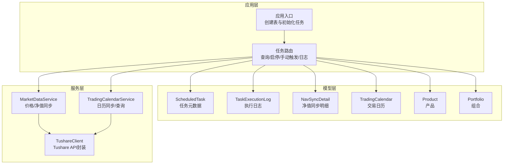

**图表来源**
- [backend/app/main.py:1-53](file://backend/app/main.py#L1-L53)
- [backend/app/routers/tasks.py:1-323](file://backend/app/routers/tasks.py#L1-L323)
- [backend/app/models/scheduled_task.py:1-19](file://backend/app/models/scheduled_task.py#L1-L19)
- [backend/app/models/task_execution_log.py:1-21](file://backend/app/models/task_execution_log.py#L1-L21)
- [backend/app/models/nav_sync_detail.py:1-18](file://backend/app/models/nav_sync_detail.py#L1-L18)
- [backend/app/models/trading_calendar.py:1-13](file://backend/app/models/trading_calendar.py#L1-L13)
- [backend/app/models/product.py:1-22](file://backend/app/models/product.py#L1-L22)
- [backend/app/models/portfolio.py:1-16](file://backend/app/models/portfolio.py#L1-L16)
- [backend/app/services/market_data_service.py:1-323](file://backend/app/services/market_data_service.py#L1-L323)
- [backend/app/services/trading_calendar_service.py:1-125](file://backend/app/services/trading_calendar_service.py#L1-L125)
- [backend/app/services/tushare_client.py:1-222](file://backend/app/services/tushare_client.py#L1-L222)

**章节来源**
- [backend/app/main.py:1-53](file://backend/app/main.py#L1-L53)
- [backend/app/routers/tasks.py:1-323](file://backend/app/routers/tasks.py#L1-L323)

## 核心组件
- 任务元数据模型：存储任务编码、名称、描述、Cron 表达式、启用状态、最近运行时间与状态、下次运行时间、超时秒数等
- 执行日志模型：记录每次任务执行的触发方式、状态、起止时间、耗时、记录总数/成功/失败、错误信息与堆栈
- 净值同步明细模型：记录单个产品在某日的净值同步结果与错误详情
- 交易日历模型：按日记录是否为交易日
- 产品与组合模型：支撑净值同步与快照生成的业务对象
- 任务路由：提供查询、启停、手动触发、查看日志等接口
- 服务层：封装 Tushare API、日历同步、价格/净值同步逻辑

**章节来源**
- [backend/app/models/scheduled_task.py:1-19](file://backend/app/models/scheduled_task.py#L1-L19)
- [backend/app/models/task_execution_log.py:1-21](file://backend/app/models/task_execution_log.py#L1-L21)
- [backend/app/models/nav_sync_detail.py:1-18](file://backend/app/models/nav_sync_detail.py#L1-L18)
- [backend/app/models/trading_calendar.py:1-13](file://backend/app/models/trading_calendar.py#L1-L13)
- [backend/app/models/product.py:1-22](file://backend/app/models/product.py#L1-L22)
- [backend/app/models/portfolio.py:1-16](file://backend/app/models/portfolio.py#L1-L16)
- [backend/app/routers/tasks.py:1-323](file://backend/app/routers/tasks.py#L1-L323)

## 架构总览
系统采用“数据库驱动 + 手动触发 + 交易日历约束”的轻量级任务调度方案：
- 应用启动时创建表并初始化三个核心任务记录
- 任务执行通过路由层的手动触发接口完成
- 交易日历用于判断业务时间窗口（如净值同步后生成日快照）
- 所有执行过程均写入执行日志与明细，便于监控与回溯

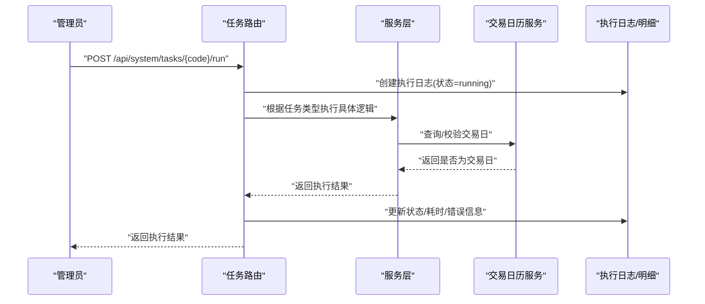

**图表来源**
- [backend/app/routers/tasks.py:88-268](file://backend/app/routers/tasks.py#L88-L268)
- [backend/app/services/trading_calendar_service.py:15-125](file://backend/app/services/trading_calendar_service.py#L15-L125)
- [backend/app/models/task_execution_log.py:1-21](file://backend/app/models/task_execution_log.py#L1-L21)

## 详细组件分析

### 任务元数据模型（ScheduledTask）
- 字段要点：任务编码、名称、描述、Cron 表达式、启用状态、最近/下次运行时间、超时秒数、创建/更新时间
- 设计意图：以数据库记录承载任务定义，避免硬编码；Cron 表达式用于未来扩展为周期性调度（当前通过手动触发实现）

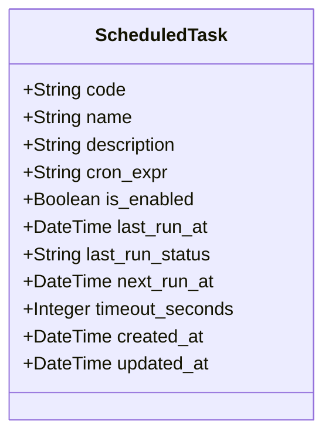

**图表来源**
- [backend/app/models/scheduled_task.py:5-19](file://backend/app/models/scheduled_task.py#L5-L19)

**章节来源**
- [backend/app/models/scheduled_task.py:1-19](file://backend/app/models/scheduled_task.py#L1-L19)

### 执行日志模型（TaskExecutionLog）
- 字段要点：任务编码、触发类型、状态、起止时间、耗时毫秒、记录总数/成功/失败、错误信息与堆栈
- 作用：统一记录每次任务执行的全生命周期信息，支持分页查询与导出

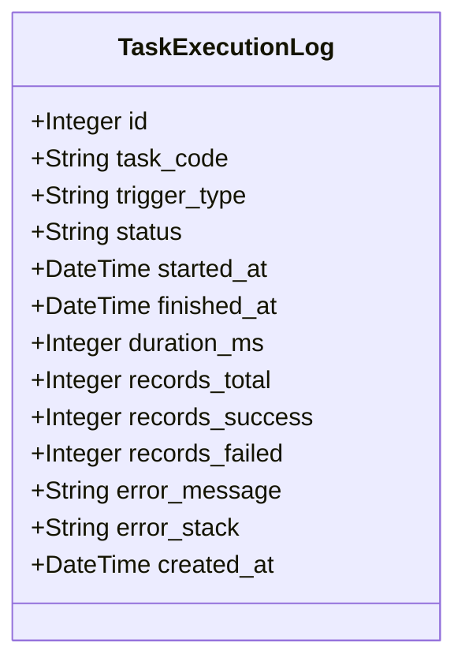

**图表来源**
- [backend/app/models/task_execution_log.py:5-21](file://backend/app/models/task_execution_log.py#L5-L21)

**章节来源**
- [backend/app/models/task_execution_log.py:1-21](file://backend/app/models/task_execution_log.py#L1-L21)

### 净值同步明细模型（NavSyncDetail）
- 字段要点：关联执行日志、产品代码、市场、净值日期、状态、净值数值、来源、错误信息
- 作用：记录单个产品的每日同步结果，支持失败重试与人工干预

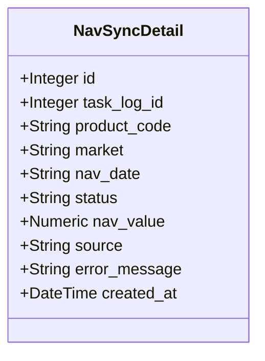

**图表来源**
- [backend/app/models/nav_sync_detail.py:5-18](file://backend/app/models/nav_sync_detail.py#L5-L18)

**章节来源**
- [backend/app/models/nav_sync_detail.py:1-18](file://backend/app/models/nav_sync_detail.py#L1-L18)

### 交易日历模型（TradingCalendar）
- 字段要点：日期唯一索引、是否交易日、交易所、创建时间
- 作用：提供业务时间窗口判断，确保仅在交易日执行相关任务

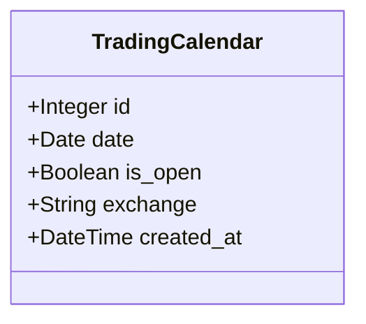

**图表来源**
- [backend/app/models/trading_calendar.py:5-13](file://backend/app/models/trading_calendar.py#L5-L13)

**章节来源**
- [backend/app/models/trading_calendar.py:1-13](file://backend/app/models/trading_calendar.py#L1-L13)

### 产品与组合模型（Product/Portfolio）
- 作用：支撑净值同步与快照生成的业务对象，组合状态影响是否可计算净值

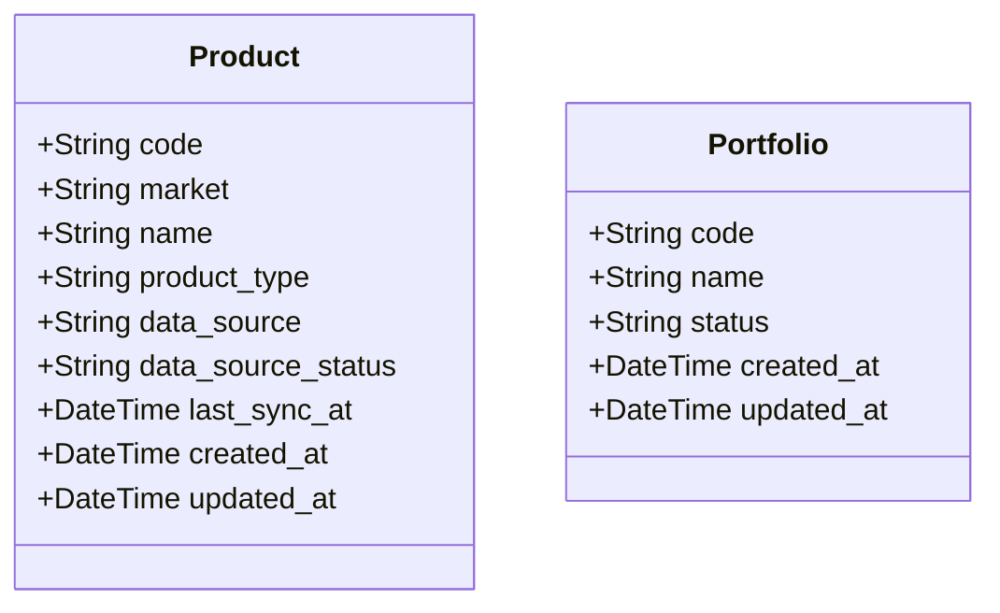

**图表来源**
- [backend/app/models/product.py:5-22](file://backend/app/models/product.py#L5-L22)
- [backend/app/models/portfolio.py:5-16](file://backend/app/models/portfolio.py#L5-L16)

**章节来源**
- [backend/app/models/product.py:1-22](file://backend/app/models/product.py#L1-L22)
- [backend/app/models/portfolio.py:1-16](file://backend/app/models/portfolio.py#L1-L16)

### 任务路由与执行流程（tasks.py）
- 查询任务：分页返回任务列表
- 启用/禁用：修改任务启用状态
- 手动触发：按任务编码执行对应逻辑，并写入执行日志
- 日志查询：按任务编码分页查询执行日志

**图表来源**
- [backend/app/routers/tasks.py:88-268](file://backend/app/routers/tasks.py#L88-L268)

**章节来源**
- [backend/app/routers/tasks.py:1-323](file://backend/app/routers/tasks.py#L1-L323)

### 服务层：市场数据同步（MarketDataService）
- 功能：按产品与市场类型同步价格数据，去重、写入数据库，更新产品数据源状态
- 错误处理：捕获 API 异常与写入异常，返回结构化结果并回滚事务

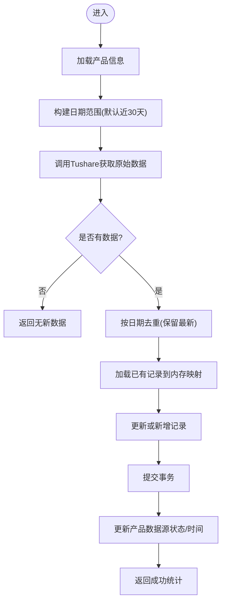

**图表来源**
- [backend/app/services/market_data_service.py:88-226](file://backend/app/services/market_data_service.py#L88-L226)
- [backend/app/services/tushare_client.py:123-222](file://backend/app/services/tushare_client.py#L123-L222)

**章节来源**
- [backend/app/services/market_data_service.py:1-323](file://backend/app/services/market_data_service.py#L1-L323)
- [backend/app/services/tushare_client.py:1-222](file://backend/app/services/tushare_client.py#L1-L222)

### 服务层：交易日历同步（TradingCalendarService）
- 功能：拉取指定年份交易日历，过滤已存在日期，批量插入新记录
- 查询与判断：提供按年/区间/是否开盘的查询接口，以及单日是否交易日判断

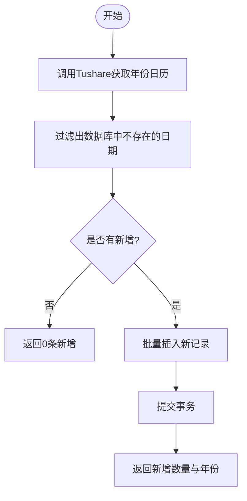

**图表来源**
- [backend/app/services/trading_calendar_service.py:15-66](file://backend/app/services/trading_calendar_service.py#L15-L66)
- [backend/app/services/tushare_client.py:48-102](file://backend/app/services/tushare_client.py#L48-L102)

**章节来源**
- [backend/app/services/trading_calendar_service.py:1-125](file://backend/app/services/trading_calendar_service.py#L1-L125)
- [backend/app/services/tushare_client.py:1-222](file://backend/app/services/tushare_client.py#L1-L222)

### 应用入口与初始化（main.py 与 init_tasks.py）
- 应用启动时创建数据库表并初始化三个核心任务记录
- 三个核心任务：净值同步、交易日历同步、日志清理

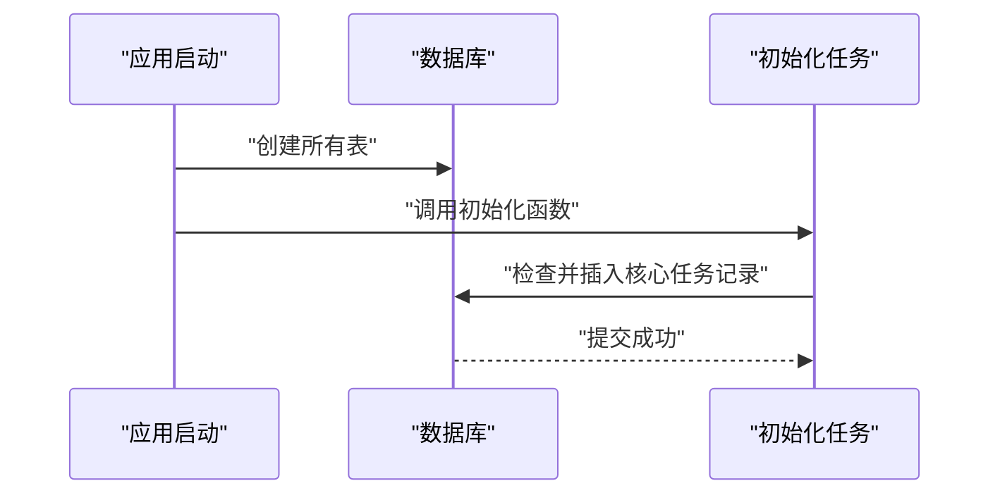

**图表来源**
- [backend/app/main.py:7-16](file://backend/app/main.py#L7-L16)
- [backend/app/init_tasks.py:5-45](file://backend/app/init_tasks.py#L5-L45)

**章节来源**
- [backend/app/main.py:1-53](file://backend/app/main.py#L1-L53)
- [backend/app/init_tasks.py:1-45](file://backend/app/init_tasks.py#L1-L45)

## 依赖分析
- 路由层依赖模型层与服务层，负责编排任务执行与日志记录
- 服务层依赖数据库会话与 Tushare 客户端，封装外部 API 调用与错误处理
- 交易日历服务依赖模型层的交易日历表，提供业务时间窗口判断
- 产品与组合模型为业务计算提供基础数据

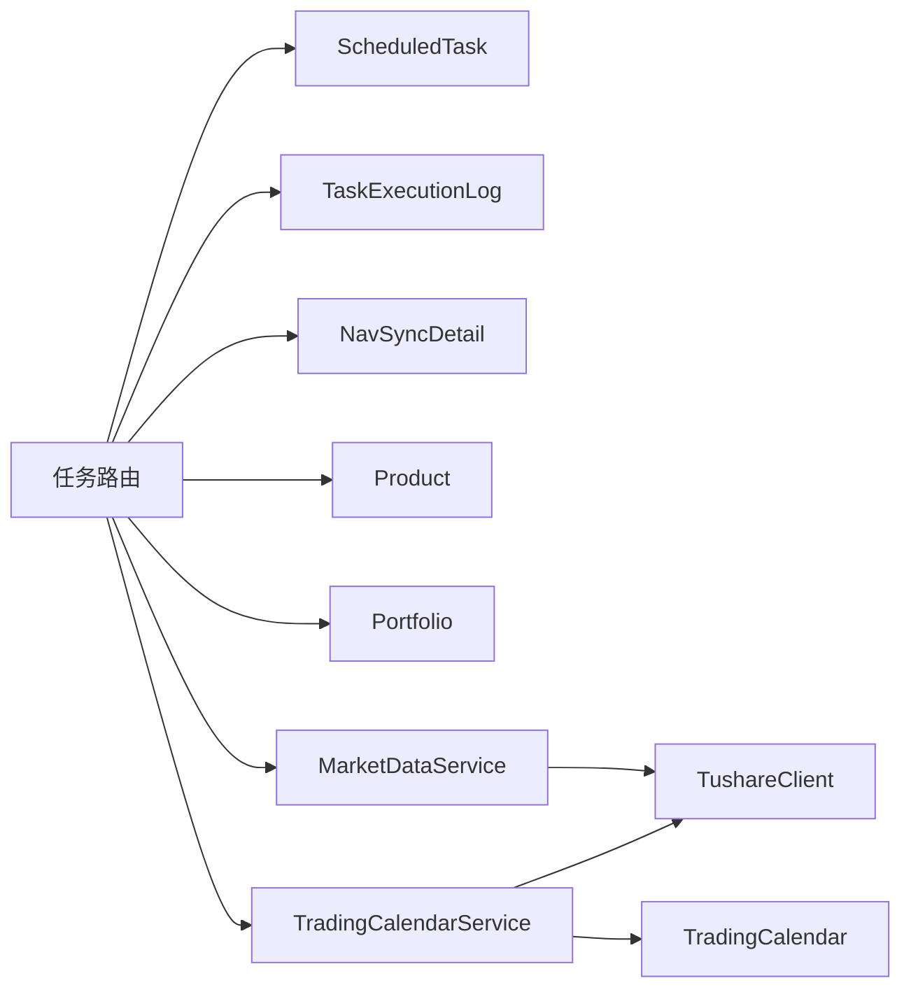

**图表来源**
- [backend/app/routers/tasks.py:1-323](file://backend/app/routers/tasks.py#L1-L323)
- [backend/app/services/market_data_service.py:1-323](file://backend/app/services/market_data_service.py#L1-L323)
- [backend/app/services/trading_calendar_service.py:1-125](file://backend/app/services/trading_calendar_service.py#L1-L125)
- [backend/app/services/tushare_client.py:1-222](file://backend/app/services/tushare_client.py#L1-L222)
- [backend/app/models/trading_calendar.py:1-13](file://backend/app/models/trading_calendar.py#L1-L13)

**章节来源**
- [backend/app/routers/tasks.py:1-323](file://backend/app/routers/tasks.py#L1-L323)
- [backend/app/services/market_data_service.py:1-323](file://backend/app/services/market_data_service.py#L1-L323)
- [backend/app/services/trading_calendar_service.py:1-125](file://backend/app/services/trading_calendar_service.py#L1-L125)
- [backend/app/services/tushare_client.py:1-222](file://backend/app/services/tushare_client.py#L1-L222)

## 性能考虑
- 批量写入：交易日历同步使用批量插入减少事务次数
- 内存去重：价格同步先加载已有记录到内存映射，降低重复写入与查询成本
- 事务边界：服务层在异常时回滚，保证数据一致性
- 超时控制：任务模型提供超时秒数字段，可用于后续接入队列/调度器时的超时策略
- 分页查询：执行日志与任务列表支持分页，避免大结果集带来的响应压力

[本节为通用性能建议，无需特定文件引用]

## 故障排查指南
- 任务执行失败
  - 查看执行日志中的状态、错误信息与堆栈
  - 检查任务是否启用、是否被禁用
  - 对于净值同步，检查产品数据源状态与最近同步时间
- Tushare 相关错误
  - 确认环境变量中已配置 Token
  - 观察服务层返回的 API 错误类型，区分未配置与调用失败
- 交易日窗口问题
  - 使用交易日历查询接口确认目标日期是否为交易日
  - 若非交易日，相关业务任务应跳过或延后
- 日志清理
  - 使用日志清理任务清理过期日志，释放存储空间

**章节来源**
- [backend/app/routers/tasks.py:19-68](file://backend/app/routers/tasks.py#L19-L68)
- [backend/app/services/tushare_client.py:38-45](file://backend/app/services/tushare_client.py#L38-L45)
- [backend/app/services/trading_calendar_service.py:69-125](file://backend/app/services/trading_calendar_service.py#L69-L125)

## 结论
InvestRing 的任务调度系统以“数据库驱动 + 手动触发 + 交易日历约束”为核心，实现了对系统初始化、数据同步与日志清理的统一管理。通过完善的日志与明细记录，系统具备良好的可观测性与可维护性。未来可在此基础上引入周期性调度器，结合 Cron 字段实现自动化执行。

[本节为总结性内容，无需特定文件引用]

## 附录

### 任务类型与执行策略
- 系统初始化任务
  - 作用：确保核心任务记录存在
  - 触发：应用启动时自动执行
- 数据同步任务
  - 净值同步（nav_sync）：按产品与市场类型同步价格数据，支持增量与去重
  - 交易日历同步（trading_calendar_sync）：按年份同步交易日历，批量插入新增日期
- 日志清理任务（log_cleanup）：按策略清理登录、审计、任务执行、系统错误与净值同步明细日志

**章节来源**
- [backend/app/init_tasks.py:5-45](file://backend/app/init_tasks.py#L5-L45)
- [backend/app/routers/tasks.py:112-250](file://backend/app/routers/tasks.py#L112-L250)
- [backend/app/services/market_data_service.py:88-226](file://backend/app/services/market_data_service.py#L88-L226)
- [backend/app/services/trading_calendar_service.py:15-66](file://backend/app/services/trading_calendar_service.py#L15-L66)

### 任务创建、配置与调度
- 创建与配置
  - 在数据库中维护任务元数据，设置 Cron 表达式、启用状态、超时秒数
  - 通过路由接口进行启停与手动触发
- 调度策略
  - 当前通过手动触发实现；未来可基于 Cron 字段接入调度器
  - 交易日历用于业务时间窗口控制，确保仅在交易日执行相关任务

**章节来源**
- [backend/app/models/scheduled_task.py:1-19](file://backend/app/models/scheduled_task.py#L1-L19)
- [backend/app/routers/tasks.py:270-298](file://backend/app/routers/tasks.py#L270-L298)

### 并发控制、错误恢复与重试
- 并发控制
  - 通过执行日志的状态字段与数据库事务实现串行化执行
- 错误恢复
  - 服务层捕获异常并回滚事务，更新产品数据源状态
- 重试策略
  - Tushare 客户端对 API 调用采用指数退避重试
  - 建议在接入调度器后，为任务增加最大重试次数与退避策略

**章节来源**
- [backend/app/services/market_data_service.py:210-214](file://backend/app/services/market_data_service.py#L210-L214)
- [backend/app/services/tushare_client.py:69-86](file://backend/app/services/tushare_client.py#L69-L86)

### 任务与交易日历的集成
- 交易日历查询与判断：按年/区间/是否开盘过滤
- 业务时间窗口控制：仅在 is_open=true 的日期执行相关任务
- 示例：净值同步完成后，在交易日自动触发组合日快照生成

**章节来源**
- [backend/app/services/trading_calendar_service.py:69-125](file://backend/app/services/trading_calendar_service.py#L69-L125)
- [backend/app/routers/tasks.py:209-230](file://backend/app/routers/tasks.py#L209-L230)

### 任务执行日志与监控
- 执行日志字段：任务编码、触发类型、状态、起止时间、耗时、记录统计、错误信息
- 监控建议：基于执行日志统计成功率、平均耗时、失败率，建立告警阈值

**章节来源**
- [backend/app/models/task_execution_log.py:1-21](file://backend/app/models/task_execution_log.py#L1-L21)
- [backend/app/schemas/task.py:23-40](file://backend/app/schemas/task.py#L23-L40)

### 任务配置指南与最佳实践
- 配置指南
  - 设置任务 Cron 表达式与超时秒数
  - 明确任务描述与业务含义
- 最佳实践
  - 优先使用手动触发验证任务逻辑
  - 对关键任务开启执行日志与明细记录
  - 使用交易日历服务确保业务时间窗口正确
  - 对外部 API 调用设置合理的重试与超时策略

**章节来源**
- [backend/app/models/scheduled_task.py:1-19](file://backend/app/models/scheduled_task.py#L1-L19)
- [backend/app/services/tushare_client.py:123-222](file://backend/app/services/tushare_client.py#L123-L222)