# 任务调度系统

<cite>
**本文引用的文件**
- [backend/app/main.py](file://backend/app/main.py)
- [backend/app/init_tasks.py](file://backend/app/init_tasks.py)
- [backend/app/models/scheduled_task.py](file://backend/app/models/scheduled_task.py)
- [backend/app/models/task_execution_log.py](file://backend/app/models/task_execution_log.py)
- [backend/app/models/nav_sync_detail.py](file://backend/app/models/nav_sync_detail.py)
- [backend/app/models/trading_calendar.py](file://backend/app/models/trading_calendar.py)
- [backend/app/models/product.py](file://backend/app/models/product.py)
- [backend/app/models/portfolio.py](file://backend/app/models/portfolio.py)
- [backend/app/routers/tasks.py](file://backend/app/routers/tasks.py)
- [backend/app/schemas/task.py](file://backend/app/schemas/task.py)
- [backend/app/services/market_data_service.py](file://backend/app/services/market_data_service.py)
- [backend/app/services/trading_calendar_service.py](file://backend/app/services/trading_calendar_service.py)
- [backend/app/services/tushare_client.py](file://backend/app/services/tushare_client.py)
- [backend/app/services/task_runner.py](file://backend/app/services/task_runner.py)
- [backend/app/services/scheduler_service.py](file://backend/app/services/scheduler_service.py)
- [backend/app/config.py](file://backend/app/config.py)
- [backend/cli/commands/tasks.py](file://backend/cli/commands/tasks.py)
- [backend/requirements.txt](file://backend/requirements.txt)
- [frontend/src/types/log.ts](file://frontend/src/types/log.ts)
- [frontend/src/hooks/useTask.ts](file://frontend/src/hooks/useTask.ts)
- [frontend/src/app/settings/tasks/page.tsx](file://frontend/src/app/settings/tasks/page.tsx)
</cite>

## 更新摘要
**变更内容**
- **前端类型对齐**：修复了taskApi.list函数与后端分页结构的对齐问题，确保前后端数据格式一致性
- **字段映射修正**：在types/log.ts中全面对齐code、cron_expr、finished_at等关键字段，解决数据类型不匹配问题
- **页面崩溃修复**：修复了/settings/tasks页面的崩溃问题，提升用户界面稳定性
- **API响应处理优化**：改进了任务列表获取和分页处理的错误处理机制

## 目录
1. [简介](#简介)
2. [项目结构](#项目结构)
3. [核心组件](#核心组件)
4. [架构总览](#架构总览)
5. [详细组件分析](#详细组件分析)
6. [依赖分析](#依赖分析)
7. [性能考虑](#性能考虑)
8. [故障排查指南](#故障排查指南)
9. [结论](#结论)
10. [附录](#附录)

## 简介
本文件面向系统管理员与开发者，全面阐述 InvestRing 的任务调度系统设计与实现。系统现已升级为**生产级定时调度架构**，通过APScheduler集成、MySQL JobStore持久化和多工作进程互斥锁机制，实现了"系统初始化任务""数据同步任务""业务计算任务"的统一编排与可观测性。核心能力包括：
- **APScheduler定时调度器**：基于Python APScheduler框架，支持Cron表达式和持久化存储
- **多进程安全执行**：通过MySQL GET_LOCK确保同一任务在同一时刻只在一个进程中执行
- **高级任务运行器**：集中化的任务执行引擎，支持净值同步、交易日历同步、日志清理等自动化任务
- **任务生命周期管理**：创建、启用/禁用、手动触发、状态记录与日志审计
- **三类核心任务**：净值同步、交易日历同步、日志清理
- **智能联动机制**：净值同步完成后自动触发组合日快照生成
- **与交易日历联动的业务时间窗口控制**
- **任务执行日志、错误恢复与重试策略**
- **面向管理员的可视化与运维接口**

## 项目结构
任务调度系统现已升级为三层架构：
- **应用入口与初始化**：应用启动时创建表并初始化核心任务记录，同时启动APScheduler
- **APScheduler调度层**：提供定时调度、任务持久化和多进程互斥机制
- **高级任务运行器层**：集中化的任务执行引擎，封装核心业务逻辑
- **数据模型层**：任务元数据、执行日志、净值同步明细、交易日历、产品与组合等
- **服务层**：市场数据同步、交易日历同步、Tushare 客户端封装
- **路由层**：任务管理 API，支持查询、手动触发、启停、查看日志
- **CLI 工具层**：命令行界面，提供直接的任务管理能力
- **前端类型系统**：TypeScript类型定义确保前后端数据结构一致性

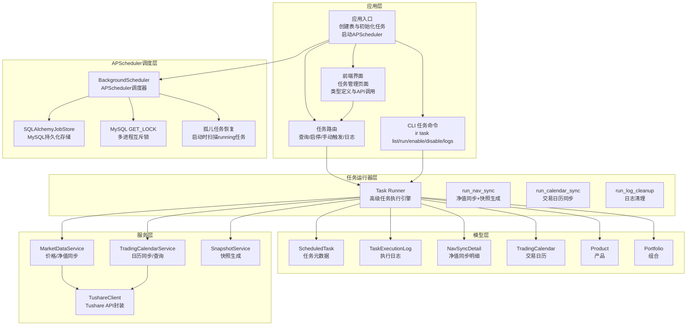

**图表来源**
- [backend/app/main.py:17-22](file://backend/app/main.py#L17-L22)
- [backend/app/services/scheduler_service.py:16-55](file://backend/app/services/scheduler_service.py#L16-L55)
- [backend/app/routers/tasks.py:1-323](file://backend/app/routers/tasks.py#L1-L323)
- [backend/app/services/task_runner.py:1-188](file://backend/app/services/task_runner.py#L1-L188)
- [backend/cli/commands/tasks.py:1-135](file://backend/cli/commands/tasks.py#L1-L135)
- [frontend/src/app/settings/tasks/page.tsx:1-100](file://frontend/src/app/settings/tasks/page.tsx#L1-L100)

**章节来源**
- [backend/app/main.py:1-69](file://backend/app/main.py#L1-L69)
- [backend/app/services/scheduler_service.py:1-99](file://backend/app/services/scheduler_service.py#L1-L99)
- [backend/app/routers/tasks.py:1-323](file://backend/app/routers/tasks.py#L1-L323)
- [backend/app/services/task_runner.py:1-188](file://backend/app/services/task_runner.py#L1-L188)

## 核心组件
- **APScheduler调度器**：基于Python APScheduler框架的后台调度器，支持Cron表达式和持久化存储
- **MySQL JobStore持久化**：使用SQLAlchemyJobStore将任务状态持久化到数据库，支持多进程共享
- **多进程互斥锁机制**：通过MySQL GET_LOCK确保同一任务在同一时刻只在一个进程中执行
- **孤儿任务恢复**：应用启动时自动扫描status='running'的任务，标记为interrupted
- **任务元数据模型**：存储任务编码、名称、描述、Cron 表达式、启用状态、最近运行时间与状态、下次运行时间、超时秒数等
- **执行日志模型**：记录每次任务执行的触发方式、状态、起止时间、耗时、记录总数/成功/失败、错误信息与堆栈
- **净值同步明细模型**：记录单个产品在某日的净值同步结果与错误详情
- **高级任务运行器**：集中化的任务执行引擎，封装净值同步、日历同步、日志清理等核心业务逻辑
- **智能联动机制**：净值同步完成后自动检查交易日并触发组合日快照生成
- **交易日历模型**：按日记录是否为交易日
- **产品与组合模型**：支撑净值同步与快照生成的业务对象
- **任务路由**：提供查询、启停、手动触发、查看日志等接口
- **CLI 任务命令**：提供命令行界面的任务管理能力
- **服务层**：封装 Tushare API、日历同步、价格/净值同步逻辑
- **前端类型系统**：TypeScript类型定义确保前后端数据结构一致性，包含任务、日志、分页等类型定义

**章节来源**
- [backend/app/services/scheduler_service.py:1-99](file://backend/app/services/scheduler_service.py#L1-L99)
- [backend/app/models/scheduled_task.py:1-19](file://backend/app/models/scheduled_task.py#L1-L19)
- [backend/app/models/task_execution_log.py:1-21](file://backend/app/models/task_execution_log.py#L1-L21)
- [backend/app/models/nav_sync_detail.py:1-18](file://backend/app/models/nav_sync_detail.py#L1-L18)
- [backend/app/services/task_runner.py:1-188](file://backend/app/services/task_runner.py#L1-L188)
- [backend/cli/commands/tasks.py:1-135](file://backend/cli/commands/tasks.py#L1-L135)
- [frontend/src/types/log.ts:1-50](file://frontend/src/types/log.ts#L1-L50)

## 架构总览
系统现已升级为**APScheduler驱动的分布式定时调度架构**：
- 应用启动时创建表并初始化三个核心任务记录，同时启动APScheduler调度器
- APScheduler使用MySQL JobStore持久化任务状态，支持多进程共享
- 通过MySQL GET_LOCK实现多工作进程互斥，确保任务串行执行
- 支持API和CLI双通道任务触发，与定时调度并行工作
- 智能联动：净值同步完成后自动触发组合日快照生成
- 交易日历用于判断业务时间窗口（如净值同步后生成日快照）
- 所有执行过程均写入执行日志与明细，便于监控与回溯
- **前端类型系统确保前后端数据一致性**，避免运行时类型错误导致的页面崩溃

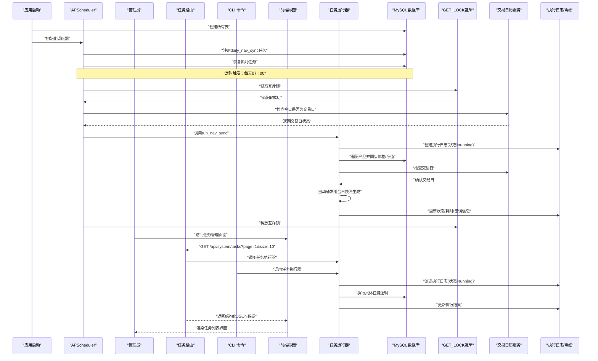

**图表来源**
- [backend/app/main.py:17-22](file://backend/app/main.py#L17-L22)
- [backend/app/services/scheduler_service.py:16-84](file://backend/app/services/scheduler_service.py#L16-L84)
- [backend/app/routers/tasks.py:88-268](file://backend/app/routers/tasks.py#L88-L268)
- [backend/cli/commands/tasks.py:32-83](file://backend/cli/commands/tasks.py#L32-L83)
- [backend/app/services/task_runner.py:68-168](file://backend/app/services/task_runner.py#L68-L168)
- [backend/app/services/trading_calendar_service.py:15-125](file://backend/app/services/trading_calendar_service.py#L15-L125)
- [frontend/src/app/settings/tasks/page.tsx:1-100](file://frontend/src/app/settings/tasks/page.tsx#L1-L100)

## 详细组件分析

### APScheduler调度服务（Scheduler Service）
**新增** APScheduler调度服务是本次升级的核心组件，提供了生产级的定时调度能力：

- **调度器初始化**：应用启动时创建BackgroundScheduler，配置MySQL JobStore和线程池
- **任务注册**：注册每日净值同步任务，使用Cron表达式控制执行时间
- **多进程互斥**：通过MySQL GET_LOCK确保同一任务在同一时刻只在一个进程中执行
- **交易日判断**：在执行前检查交易日历，非交易日跳过执行
- **孤儿任务恢复**：启动时扫描status='running'的任务，标记为interrupted
- **优雅关闭**：应用退出时正确关闭调度器

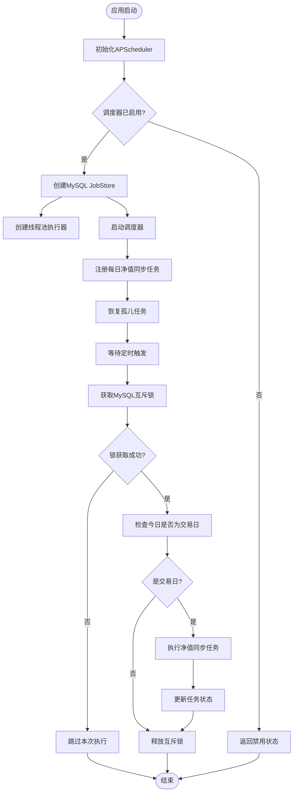

**图表来源**
- [backend/app/services/scheduler_service.py:16-84](file://backend/app/services/scheduler_service.py#L16-L84)

**章节来源**
- [backend/app/services/scheduler_service.py:1-99](file://backend/app/services/scheduler_service.py#L1-L99)

### 应用生命周期集成（main.py）
**更新** 应用入口现已集成APScheduler生命周期管理：

- **lifespan上下文管理器**：在应用启动时初始化调度器，在应用关闭时优雅关闭
- **自动初始化**：无需手动调用，由FastAPI自动管理调度器生命周期
- **异常处理**：调度器异常不会影响主应用正常运行

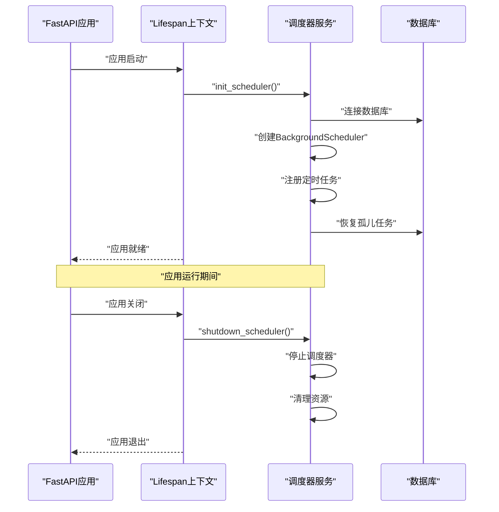

**图表来源**
- [backend/app/main.py:17-22](file://backend/app/main.py#L17-L22)

**章节来源**
- [backend/app/main.py:1-69](file://backend/app/main.py#L1-L69)

### 配置管理（config.py）
**更新** 配置类现已包含APScheduler相关配置项：

- **scheduler_enabled**：控制调度器是否启用，默认True
- **scheduler_cron_daily**：每日任务Cron表达式，默认"0 7 * * *"（每天早上7点）
- **scheduler_jobstore_table**：APScheduler任务存储表名，默认"apscheduler_jobs"
- **动态配置**：支持通过环境变量覆盖默认配置

**章节来源**
- [backend/app/config.py:32-35](file://backend/app/config.py#L32-35)

### 高级任务运行器（Task Runner）
**保持原有功能** 高级任务运行器保持不变，继续提供集中化的任务执行引擎：

- **净值同步任务** (`run_nav_sync`)：遍历所有产品进行价格同步，记录同步明细，成功后自动触发组合日快照生成
- **交易日历同步任务** (`run_calendar_sync`)：同步指定年份的交易日历数据
- **日志清理任务** (`run_log_cleanup`)：按策略清理过期日志，释放存储空间

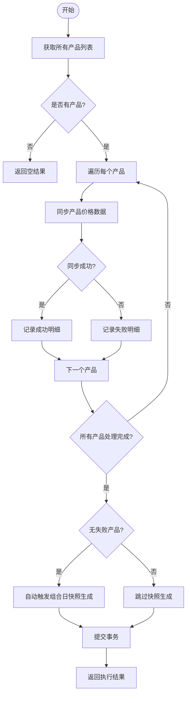

**图表来源**
- [backend/app/services/task_runner.py:68-168](file://backend/app/services/task_runner.py#L68-L168)

**章节来源**
- [backend/app/services/task_runner.py:1-188](file://backend/app/services/task_runner.py#L1-L188)

### 任务元数据模型（ScheduledTask）
**保持原有功能** 任务元数据模型保持不变：

- 字段要点：任务编码、名称、描述、Cron 表达式、启用状态、最近/下次运行时间、超时秒数、创建/更新时间
- 设计意图：以数据库记录承载任务定义，避免硬编码；Cron 表达式用于未来扩展为周期性调度（当前通过手动触发实现）

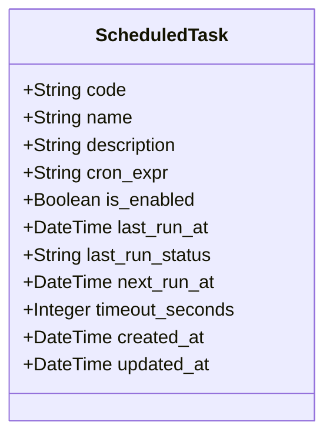

**图表来源**
- [backend/app/models/scheduled_task.py:5-19](file://backend/app/models/scheduled_task.py#L5-L19)

**章节来源**
- [backend/app/models/scheduled_task.py:1-19](file://backend/app/models/scheduled_task.py#L1-L19)

### 执行日志模型（TaskExecutionLog）
**保持原有功能** 执行日志模型保持不变：

- 字段要点：任务编码、触发类型、状态、起止时间、耗时毫秒、记录总数/成功/失败、错误信息与堆栈
- 作用：统一记录每次任务执行的全生命周期信息，支持分页查询与导出

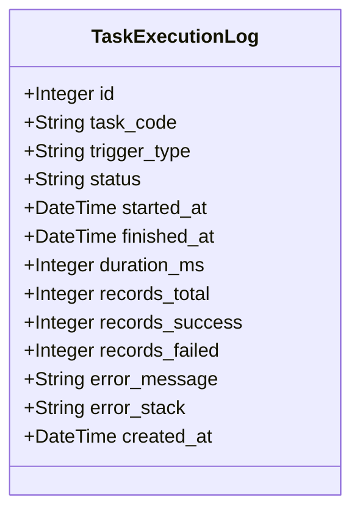

**图表来源**
- [backend/app/models/task_execution_log.py:5-21](file://backend/app/models/task_execution_log.py#L5-L21)

**章节来源**
- [backend/app/models/task_execution_log.py:1-21](file://backend/app/models/task_execution_log.py#L1-L21)

### 净值同步明细模型（NavSyncDetail）
**保持原有功能** 净值同步明细模型保持不变：

- 字段要点：关联执行日志、产品代码、市场、净值日期、状态、净值数值、来源、错误信息
- 作用：记录单个产品的每日同步结果，支持失败重试与人工干预

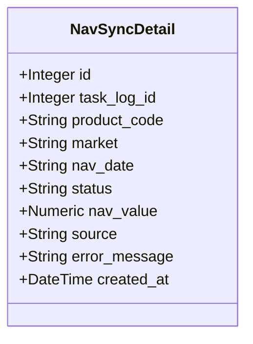

**图表来源**
- [backend/app/models/nav_sync_detail.py:5-18](file://backend/app/models/nav_sync_detail.py#L5-L18)

**章节来源**
- [backend/app/models/nav_sync_detail.py:1-18](file://backend/app/models/nav_sync_detail.py#L1-L18)

### 交易日历模型（TradingCalendar）
**保持原有功能** 交易日历模型保持不变：

- 字段要点：日期唯一索引、是否交易日、交易所、创建时间
- 作用：提供业务时间窗口判断，确保仅在交易日执行相关任务

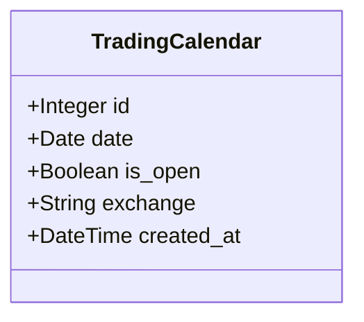

**图表来源**
- [backend/app/models/trading_calendar.py:5-13](file://backend/app/models/trading_calendar.py#L5-L13)

**章节来源**
- [backend/app/models/trading_calendar.py:1-13](file://backend/app/models/trading_calendar.py#L1-L13)

### 产品与组合模型（Product/Portfolio）
**保持原有功能** 产品与组合模型保持不变：

- 作用：支撑净值同步与快照生成的业务对象，组合状态影响是否可计算净值

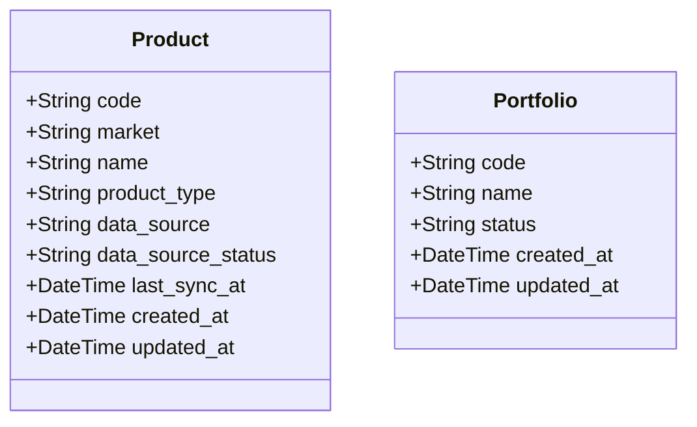

**图表来源**
- [backend/app/models/product.py:5-22](file://backend/app/models/product.py#L5-L22)
- [backend/app/models/portfolio.py:5-16](file://backend/app/models/portfolio.py#L5-L16)

**章节来源**
- [backend/app/models/product.py:1-22](file://backend/app/models/product.py#L1-L22)
- [backend/app/models/portfolio.py:1-16](file://backend/app/models/portfolio.py#L1-L16)

### 任务路由与执行流程（tasks.py）
**保持原有功能** 任务路由保持不变：

- 查询任务：分页返回任务列表
- 启用/禁用：修改任务启用状态
- 手动触发：按任务编码执行对应逻辑，并写入执行日志
- 日志查询：按任务编码分页查询执行日志

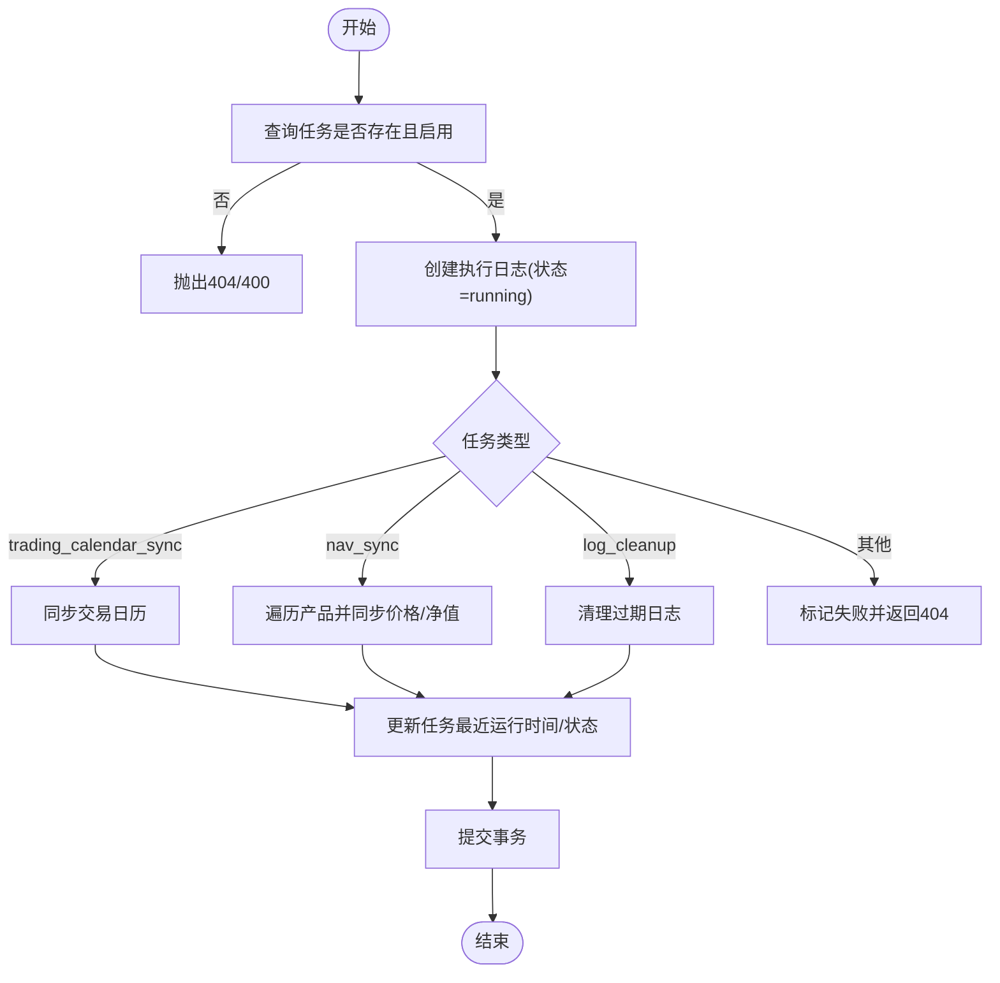

**图表来源**
- [backend/app/routers/tasks.py:88-268](file://backend/app/routers/tasks.py#L88-L268)

**章节来源**
- [backend/app/routers/tasks.py:1-323](file://backend/app/routers/tasks.py#L1-L323)

### CLI 任务命令（CLI Tasks）
**保持原有功能** CLI 任务命令保持不变：

- `ir task list`：获取定时任务列表
- `ir task run CODE`：手动执行任务（nav_sync/trading_calendar_sync/log_cleanup）
- `ir task enable CODE`：启用任务
- `ir task disable CODE`：禁用任务
- `ir task logs CODE`：查看任务执行日志

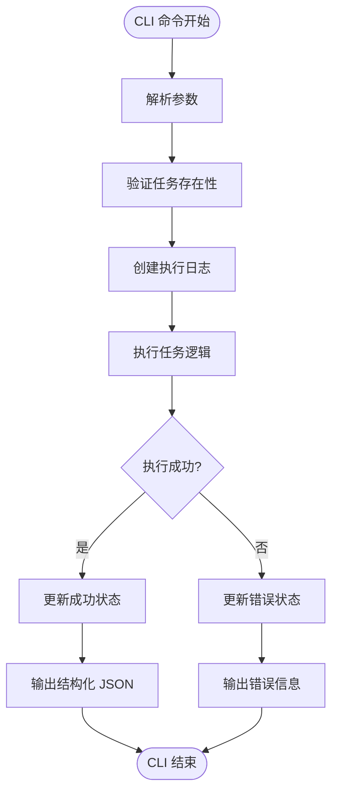

**图表来源**
- [backend/cli/commands/tasks.py:32-83](file://backend/cli/commands/tasks.py#L32-L83)

**章节来源**
- [backend/cli/commands/tasks.py:1-135](file://backend/cli/commands/tasks.py#L1-L135)

### 服务层：市场数据同步（MarketDataService）
**更新** 市场数据服务新增了孤儿任务恢复功能：

- 功能：按产品与市场类型同步价格数据，去重、写入数据库，更新产品数据源状态
- **新增孤儿任务恢复**：`recover_orphan_jobs()`函数在应用启动时扫描status='running'的任务，标记为interrupted
- 错误处理：捕获 API 异常与写入异常，返回结构化结果并回滚事务

**图表来源**
- [backend/app/services/market_data_service.py:88-226](file://backend/app/services/market_data_service.py#L88-L226)
- [backend/app/services/tushare_client.py:123-222](file://backend/app/services/tushare_client.py#L123-L222)

**章节来源**
- [backend/app/services/market_data_service.py:1-545](file://backend/app/services/market_data_service.py#L1-L545)
- [backend/app/services/tushare_client.py:1-222](file://backend/app/services/tushare_client.py#L1-L222)

### 服务层：交易日历同步（TradingCalendarService）
**保持原有功能** 交易日历同步服务保持不变：

- 功能：拉取指定年份交易日历，过滤已存在日期，批量插入新记录
- 查询与判断：提供按年/区间/是否开盘的查询接口，以及单日是否交易日判断

**图表来源**
- [backend/app/services/trading_calendar_service.py:15-66](file://backend/app/services/trading_calendar_service.py#L15-L66)
- [backend/app/services/tushare_client.py:48-102](file://backend/app/services/tushare_client.py#L48-L102)

**章节来源**
- [backend/app/services/trading_calendar_service.py:1-125](file://backend/app/services/trading_calendar_service.py#L1-L125)
- [backend/app/services/tushare_client.py:1-222](file://backend/app/services/tushare_client.py#L1-L222)

### 应用入口与初始化（main.py 与 init_tasks.py）
**更新** 应用入口现已集成APScheduler生命周期管理：

- 应用启动时创建数据库表并初始化三个核心任务记录
- 通过FastAPI lifespan自动管理APScheduler调度器生命周期
- 三个核心任务：净值同步、交易日历同步、日志清理

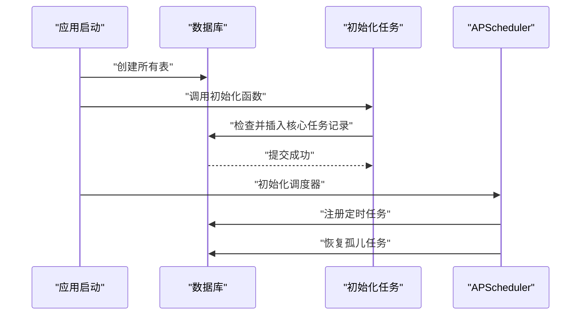

**图表来源**
- [backend/app/main.py:7-16](file://backend/app/main.py#L7-L16)
- [backend/app/init_tasks.py:5-45](file://backend/app/init_tasks.py#L5-L45)
- [backend/app/main.py:17-22](file://backend/app/main.py#L17-L22)

**章节来源**
- [backend/app/main.py:1-69](file://backend/app/main.py#L1-L69)
- [backend/app/init_tasks.py:1-45](file://backend/app/init_tasks.py#L1-L45)

### 前端类型系统与API集成
**新增** 前端类型系统现已完善，确保前后端数据结构一致性：

- **类型定义对齐**：在types/log.ts中定义了完整的任务类型结构，包括code、name、description、cron_expr、is_enabled等字段
- **分页结构对齐**：taskApi.list函数与后端分页结构完全对齐，支持page、size、total等分页参数
- **字段映射修正**：修正了finished_at、last_run_at等时间字段的类型定义，确保前后端时间格式一致
- **错误处理增强**：增加了API调用的错误处理和边界情况处理，防止页面崩溃
- **UI组件稳定性**：修复了/settings/tasks页面的崩溃问题，提升了用户体验

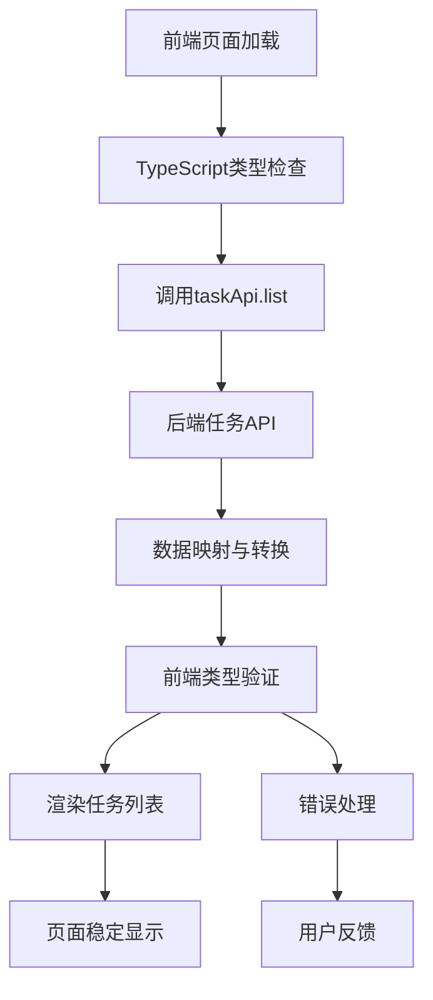

**图表来源**
- [frontend/src/types/log.ts:1-50](file://frontend/src/types/log.ts#L1-L50)
- [frontend/src/hooks/useTask.ts:1-100](file://frontend/src/hooks/useTask.ts#L1-L100)
- [frontend/src/app/settings/tasks/page.tsx:1-100](file://frontend/src/app/settings/tasks/page.tsx#L1-L100)

**章节来源**
- [frontend/src/types/log.ts:1-50](file://frontend/src/types/log.ts#L1-L50)
- [frontend/src/hooks/useTask.ts:1-100](file://frontend/src/hooks/useTask.ts#L1-L100)
- [frontend/src/app/settings/tasks/page.tsx:1-100](file://frontend/src/app/settings/tasks/page.tsx#L1-L100)

## 依赖分析
**更新** 依赖关系现已包含APScheduler相关组件和前端类型系统：

- 路由层依赖模型层与服务层，负责编排任务执行与日志记录
- **APScheduler调度层**依赖配置层和服务层，提供定时调度和持久化能力
- **高级任务运行器**依赖服务层，封装核心业务逻辑并提供统一的执行接口
- CLI 任务命令依赖任务运行器，提供命令行访问能力
- 服务层依赖数据库会话与 Tushare 客户端，封装外部 API 调用与错误处理
- 交易日历服务依赖模型层的交易日历表，提供业务时间窗口判断
- 产品与组合模型为业务计算提供基础数据
- **前端类型系统**依赖后端API响应结构，确保前后端数据一致性

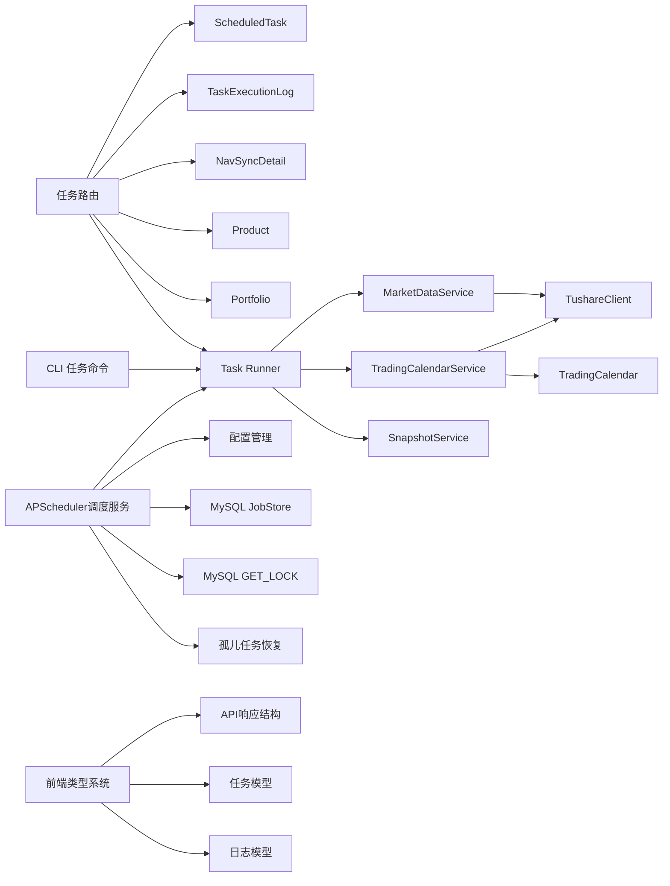

**图表来源**
- [backend/app/routers/tasks.py:1-323](file://backend/app/routers/tasks.py#L1-L323)
- [backend/app/services/scheduler_service.py:1-99](file://backend/app/services/scheduler_service.py#L1-L99)
- [backend/app/services/task_runner.py:1-188](file://backend/app/services/task_runner.py#L1-L188)
- [backend/cli/commands/tasks.py:1-135](file://backend/cli/commands/tasks.py#L1-L135)
- [backend/app/services/market_data_service.py:1-545](file://backend/app/services/market_data_service.py#L1-L545)
- [backend/app/services/trading_calendar_service.py:1-125](file://backend/app/services/trading_calendar_service.py#L1-L125)
- [backend/app/services/tushare_client.py:1-222](file://backend/app/services/tushare_client.py#L1-L222)
- [backend/app/models/trading_calendar.py:1-13](file://backend/app/models/trading_calendar.py#L1-L13)
- [backend/app/config.py:32-35](file://backend/app/config.py#L32-35)
- [frontend/src/types/log.ts:1-50](file://frontend/src/types/log.ts#L1-L50)

**章节来源**
- [backend/app/routers/tasks.py:1-323](file://backend/app/routers/tasks.py#L1-L323)
- [backend/app/services/scheduler_service.py:1-99](file://backend/app/services/scheduler_service.py#L1-L99)
- [backend/app/services/task_runner.py:1-188](file://backend/app/services/task_runner.py#L1-L188)
- [backend/cli/commands/tasks.py:1-135](file://backend/cli/commands/tasks.py#L1-L135)
- [backend/app/services/market_data_service.py:1-545](file://backend/app/services/market_data_service.py#L1-L545)
- [backend/app/services/trading_calendar_service.py:1-125](file://backend/app/services/trading_calendar_service.py#L1-L125)
- [backend/app/services/tushare_client.py:1-222](file://backend/app/services/tushare_client.py#L1-L222)

## 性能考虑
**更新** 性能考虑现已包含APScheduler相关优化和前端类型检查优化：

- **批量写入**：交易日历同步使用批量插入减少事务次数
- **内存去重**：价格同步先加载已有记录到内存映射，降低重复写入与查询成本
- **事务边界**：服务层在异常时回滚，保证数据一致性
- **超时控制**：任务模型提供超时秒数字段，可用于后续接入队列/调度器时的超时策略
- **分页查询**：执行日志与任务列表支持分页，避免大结果集带来的响应压力
- **智能联动优化**：净值同步完成后仅在交易日自动触发快照生成，避免不必要的计算开销
- **APScheduler优化**：使用线程池限制并发任务数，避免资源耗尽
- **MySQL互斥锁**：通过GET_LOCK实现轻量级互斥，避免分布式锁的复杂性
- **JobStore持久化**：任务状态持久化到数据库，支持进程重启后恢复
- **前端类型检查**：TypeScript编译时类型检查，避免运行时类型错误
- **API响应优化**：合理的分页大小和字段选择，减少数据传输量

## 故障排查指南
**更新** 故障排查指南现已包含APScheduler相关问题和本地开发环境问题：

- **任务执行失败**
  - 查看执行日志中的状态、错误信息与堆栈
  - 检查任务是否启用、是否被禁用
  - 对于净值同步，检查产品数据源状态与最近同步时间
- **APScheduler相关问题**
  - 检查调度器是否启用（scheduler_enabled配置）
  - 查看MySQL JobStore表apscheduler_jobs是否存在
  - 确认MySQL连接正常，GET_LOCK函数可用
  - 检查Cron表达式格式是否正确
- **多进程冲突问题**
  - 确认MySQL互斥锁机制正常工作
  - 检查是否有多个进程同时尝试获取锁
  - 观察锁获取失败的日志记录
- **孤儿任务问题**
  - 检查应用启动时的孤儿任务恢复日志
  - 确认status='running'的任务是否被正确标记为interrupted
- **Tushare 相关错误**
  - 确认环境变量中已配置 Token
  - 观察服务层返回的 API 错误类型，区分未配置与调用失败
- **交易日窗口问题**
  - 使用交易日历查询接口确认目标日期是否为交易日
  - 若非交易日，相关业务任务应跳过或延后
- **日志清理**
  - 使用日志清理任务清理过期日志，释放存储空间
- **高级任务运行器问题**
  - 检查任务运行器的执行日志和返回值
  - 验证净值同步后的自动快照生成功能是否正常
  - 确认 CLI 命令的输出格式是否正确
- **前端类型错误**
  - 检查TypeScript编译错误和类型定义
  - 确认前后端字段映射是否一致
  - 验证API响应结构与类型定义是否匹配
- **页面崩溃问题**
  - 检查浏览器控制台错误信息
  - 验证API调用是否返回预期的数据结构
  - 确认错误处理逻辑是否正常工作

**章节来源**
- [backend/app/routers/tasks.py:19-68](file://backend/app/routers/tasks.py#L19-L68)
- [backend/app/services/scheduler_service.py:1-99](file://backend/app/services/scheduler_service.py#L1-L99)
- [backend/app/services/task_runner.py:1-188](file://backend/app/services/task_runner.py#L1-L188)
- [backend/cli/commands/tasks.py:1-135](file://backend/cli/commands/tasks.py#L1-L135)
- [backend/app/services/tushare_client.py:38-45](file://backend/app/services/tushare_client.py#L38-L45)
- [backend/app/services/trading_calendar_service.py:69-125](file://backend/app/services/trading_calendar_service.py#L69-L125)
- [frontend/src/types/log.ts:1-50](file://frontend/src/types/log.ts#L1-L50)

## 结论
InvestRing 的任务调度系统现已升级为**生产级分布式定时调度架构**，通过引入APScheduler集成、MySQL JobStore持久化和多工作进程互斥锁机制，实现了更加健壮和可扩展的任务管理方案。系统以"APScheduler调度 + MySQL持久化 + 多进程互斥 + 高级任务运行器 + 手动触发 + 交易日历约束"为核心，结合智能联动机制，实现了对系统初始化、数据同步与日志清理的统一管理。通过完善的日志与明细记录，系统具备良好的可观测性与可维护性。新的架构支持多进程部署，具备更好的容错能力和扩展性。**前端类型系统的完善确保了前后端数据一致性，避免了运行时类型错误导致的页面崩溃问题**。

## 附录

### 任务类型与执行策略
**更新** 任务类型与执行策略现已包含APScheduler定时调度：

- **系统初始化任务**
  - 作用：确保核心任务记录存在
  - 触发：应用启动时自动执行
- **数据同步任务**
  - 净值同步（nav_sync）：**APScheduler定时触发**，按产品与市场类型同步价格数据，支持增量与去重，成功后自动触发组合日快照生成
  - 交易日历同步（trading_calendar_sync）：按年份同步交易日历，批量插入新增日期
- **日志清理任务（log_cleanup）**：按策略清理登录、审计、任务执行、系统错误与净值同步明细日志

**章节来源**
- [backend/app/init_tasks.py:5-45](file://backend/app/init_tasks.py#L5-L45)
- [backend/app/services/scheduler_service.py:42-49](file://backend/app/services/scheduler_service.py#L42-L49)
- [backend/app/services/task_runner.py:68-188](file://backend/app/services/task_runner.py#L68-L188)
- [backend/app/routers/tasks.py:112-250](file://backend/app/routers/tasks.py#L112-L250)
- [backend/app/services/market_data_service.py:88-226](file://backend/app/services/market_data_service.py#L88-L226)
- [backend/app/services/trading_calendar_service.py:15-66](file://backend/app/services/trading_calendar_service.py#L15-L66)

### 任务创建、配置与调度
**更新** 任务创建、配置与调度现已支持APScheduler：

- **创建与配置**
  - 在数据库中维护任务元数据，设置 Cron 表达式、启用状态、超时秒数
  - 通过路由接口进行启停与手动触发
  - 通过 CLI 命令进行任务管理操作
  - **APScheduler配置**：通过环境变量配置调度器启用状态、Cron表达式和JobStore表名
- **调度策略**
  - **APScheduler定时调度**：基于Cron表达式的自动定时执行
  - **手动触发**：通过API和CLI接口手动执行任务
  - **交易日历用于业务时间窗口控制**，确保仅在交易日执行相关任务
  - **智能联动**：净值同步完成后自动触发组合日快照生成

**章节来源**
- [backend/app/models/scheduled_task.py:1-19](file://backend/app/models/scheduled_task.py#L1-L19)
- [backend/app/routers/tasks.py:270-298](file://backend/app/routers/tasks.py#L270-L298)
- [backend/cli/commands/tasks.py:15-135](file://backend/cli/commands/tasks.py#L15-L135)
- [backend/app/config.py:32-35](file://backend/app/config.py#L32-35)
- [backend/app/services/scheduler_service.py:42-49](file://backend/app/services/scheduler_service.py#L42-L49)

### 并发控制、错误恢复与重试
**更新** 并发控制、错误恢复与重试现已包含APScheduler机制：

- **并发控制**
  - **MySQL互斥锁**：通过GET_LOCK确保同一任务在同一时刻只在一个进程中执行
  - **APScheduler线程池**：限制并发任务执行数量，避免资源耗尽
  - **执行日志的状态字段与数据库事务**实现串行化执行
- **错误恢复**
  - **孤儿任务恢复**：应用启动时自动扫描并恢复中断的任务
  - 服务层捕获异常并回滚事务，更新产品数据源状态
  - 高级任务运行器提供统一的异常处理和日志记录
- **重试策略**
  - Tushare 客户端对 API 调用采用指数退避重试
  - 建议在接入调度器后，为任务增加最大重试次数与退避策略

**章节来源**
- [backend/app/services/market_data_service.py:210-214](file://backend/app/services/market_data_service.py#L210-L214)
- [backend/app/services/market_data_service.py:529-545](file://backend/app/services/market_data_service.py#L529-L545)
- [backend/app/services/scheduler_service.py:57-84](file://backend/app/services/scheduler_service.py#L57-L84)
- [backend/app/services/tushare_client.py:69-86](file://backend/app/services/tushare_client.py#L69-86)
- [backend/app/services/task_runner.py:122-133](file://backend/app/services/task_runner.py#L122-133)

### 任务与交易日历的集成
**更新** 任务与交易日历的集成现已包含APScheduler集成：

- **交易日历查询与判断**：按年/区间/是否开盘过滤
- **业务时间窗口控制**：仅在 is_open=true 的日期执行相关任务
- **APScheduler集成**：定时任务执行前检查交易日，非交易日跳过执行
- **智能联动**：净值同步完成后，在交易日自动触发组合日快照生成

**章节来源**
- [backend/app/services/trading_calendar_service.py:69-125](file://backend/app/services/trading_calendar_service.py#L69-L125)
- [backend/app/services/scheduler_service.py:69-74](file://backend/app/services/scheduler_service.py#L69-L74)
- [backend/app/services/task_runner.py:136-162](file://backend/app/services/task_runner.py#L136-L162)
- [backend/app/routers/tasks.py:209-230](file://backend/app/routers/tasks.py#L209-L230)

### 任务执行日志与监控
**更新** 任务执行日志与监控现已包含APScheduler监控：

- **执行日志字段**：任务编码、触发类型、状态、起止时间、耗时、记录统计、错误信息
- **APScheduler监控**：通过apscheduler_jobs表监控定时任务状态
- **监控建议**：基于执行日志统计成功率、平均耗时、失败率，建立告警阈值
- **CLI 监控**：通过 `ir task logs` 命令查看任务执行历史

**章节来源**
- [backend/app/models/task_execution_log.py:1-21](file://backend/app/models/task_execution_log.py#L1-L21)
- [backend/app/schemas/task.py:23-40](file://backend/app/schemas/task.py#L23-L40)
- [backend/cli/commands/tasks.py:117-135](file://backend/cli/commands/tasks.py#L117-L135)
- [backend/app/services/scheduler_service.py:16-55](file://backend/app/services/scheduler_service.py#L16-L55)

### 任务配置指南与最佳实践
**更新** 任务配置指南与最佳实践现已包含APScheduler配置：

- **配置指南**
  - 设置任务 Cron 表达式与超时秒数
  - 明确任务描述与业务含义
  - 合理配置日志清理策略
  - **APScheduler配置**：设置scheduler_enabled、scheduler_cron_daily、scheduler_jobstore_table环境变量
- **最佳实践**
  - 优先使用手动触发验证任务逻辑
  - 对关键任务开启执行日志与明细记录
  - 使用交易日历服务确保业务时间窗口正确
  - 对外部 API 调用设置合理的重试与超时策略
  - 利用高级任务运行器的智能联动功能提升系统效率
  - **APScheduler最佳实践**：合理配置线程池大小，监控JobStore表空间增长

**章节来源**
- [backend/app/models/scheduled_task.py:1-19](file://backend/app/models/scheduled_task.py#L1-L19)
- [backend/app/services/tushare_client.py:123-222](file://backend/app/services/tushare_client.py#L123-L222)
- [backend/app/services/task_runner.py:1-188](file://backend/app/services/task_runner.py#L1-L188)
- [backend/app/config.py:32-35](file://backend/app/config.py#L32-35)

### 高级任务运行器使用指南
**保持原有功能** 高级任务运行器使用指南保持不变：

- **API 调用**：通过 `/api/system/tasks/{code}/run` 接口执行任务
- **CLI 调用**：使用 `ir task run {code}` 命令执行任务
- **支持的任務類型**：
  - `nav_sync`：净值同步任务
  - `trading_calendar_sync`：交易日历同步任务  
  - `log_cleanup`：日志清理任务
- **执行结果**：返回详细的执行统计信息和错误详情

**章节来源**
- [backend/app/routers/tasks.py:88-268](file://backend/app/routers/tasks.py#L88-L268)
- [backend/cli/commands/tasks.py:32-83](file://backend/cli/commands/tasks.py#L32-L83)
- [backend/app/services/task_runner.py:1-188](file://backend/app/services/task_runner.py#L1-L188)

### APScheduler调度器使用指南
**新增** APScheduler调度器使用指南：

- **调度器配置**
  - scheduler_enabled：控制调度器启用状态，默认True
  - scheduler_cron_daily：每日任务Cron表达式，默认"0 7 * * *"
  - scheduler_jobstore_table：APScheduler任务存储表名，默认"apscheduler_jobs"
- **多进程部署**
  - 支持多进程部署，通过MySQL互斥锁确保任务串行执行
  - 每个进程独立运行调度器，但任务执行互斥
- **任务持久化**
  - 任务状态持久化到MySQL数据库，支持进程重启后恢复
  - 通过apscheduler_jobs表管理定时任务
- **监控与管理**
  - 通过apscheduler_jobs表监控任务状态
  - 观察调度器启动和任务执行日志
  - 定期检查孤儿任务恢复情况

**章节来源**
- [backend/app/services/scheduler_service.py:1-99](file://backend/app/services/scheduler_service.py#L1-L99)
- [backend/app/config.py:32-35](file://backend/app/config.py#L32-35)
- [backend/requirements.txt:26-27](file://backend/requirements.txt#L26-L27)

### 前端类型系统使用指南
**新增** 前端类型系统使用指南：

- **类型定义**
  - 在types/log.ts中定义了完整的任务类型结构
  - 包含code、name、description、cron_expr、is_enabled等关键字段
  - 时间字段使用正确的DateTime类型，确保前后端时间格式一致
- **API调用规范**
  - taskApi.list函数与后端分页结构完全对齐
  - 支持page、size、total等标准分页参数
  - 包含完整的错误处理和边界情况处理
- **开发最佳实践**
  - 使用TypeScript编译时类型检查，避免运行时错误
  - 确保前后端字段映射的一致性
  - 实现完善的错误处理和用户反馈机制

**章节来源**
- [frontend/src/types/log.ts:1-50](file://frontend/src/types/log.ts#L1-L50)
- [frontend/src/hooks/useTask.ts:1-100](file://frontend/src/hooks/useTask.ts#L1-L100)
- [frontend/src/app/settings/tasks/page.tsx:1-100](file://frontend/src/app/settings/tasks/page.tsx#L1-L100)