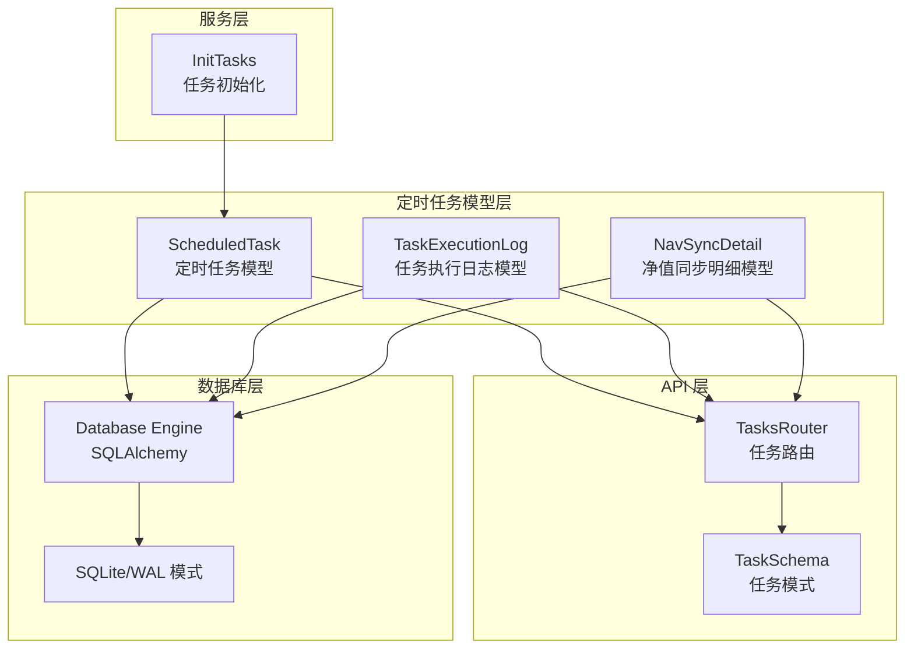
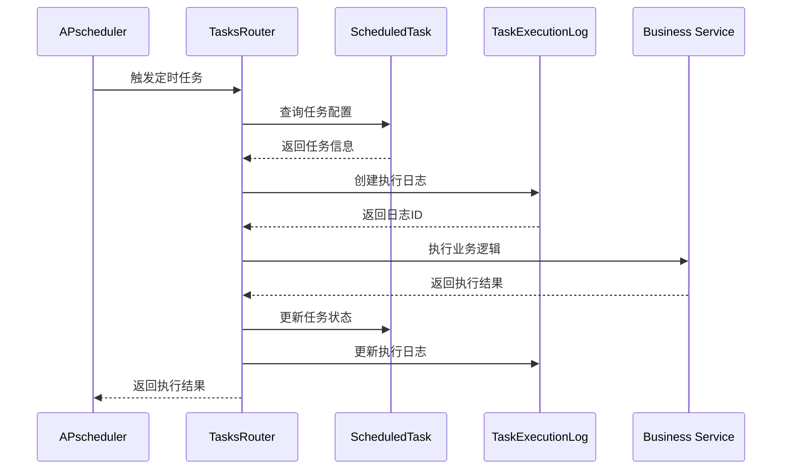
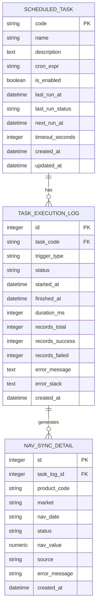
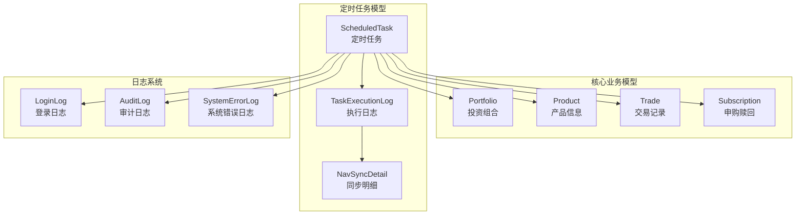

# 定时任务模型

<cite>
**本文档引用的文件**
- [scheduled_task.py](file://backend/app/models/scheduled_task.py)
- [task_execution_log.py](file://backend/app/models/task_execution_log.py)
- [nav_sync_detail.py](file://backend/app/models/nav_sync_detail.py)
- [task.py](file://backend/app/schemas/task.py)
- [tasks.py](file://backend/app/routers/tasks.py)
- [init_tasks.py](file://backend/app/init_tasks.py)
- [database.py](file://backend/app/database.py)
- [main.py](file://backend/app/main.py)
- [__init__.py](file://backend/app/models/__init__.py)
- [02-数据库设计.md](file://Docs/02-数据库设计.md)
- [07-日志系统设计.md](file://Docs/07-日志系统设计.md)
</cite>

## 目录
1. [简介](#简介)
2. [项目结构](#项目结构)
3. [核心组件](#核心组件)
4. [架构概览](#架构概览)
5. [详细组件分析](#详细组件分析)
6. [数据库映射与索引策略](#数据库映射与索引策略)
7. [查询优化](#查询优化)
8. [任务配置示例](#任务配置示例)
9. [最佳实践](#最佳实践)
10. [与其他业务模型的关系](#与其他业务模型的关系)
11. [故障排除指南](#故障排除指南)
12. [结论](#结论)

## 简介

定时任务模型是 InvestRing 投资组合管理系统的核心基础设施之一，负责管理和调度各种后台任务。该模型提供了完整的任务生命周期管理，包括任务定义、执行监控、状态跟踪和日志记录等功能。系统内置了三个核心任务：净值同步、交易日历同步和日志清理，这些任务构成了系统的日常运营基础。

## 项目结构

定时任务模型在项目中的组织结构如下：



**图表来源**
- [scheduled_task.py:1-19](file://backend/app/models/scheduled_task.py#L1-L19)
- [task_execution_log.py:1-21](file://backend/app/models/task_execution_log.py#L1-L21)
- [tasks.py:1-323](file://backend/app/routers/tasks.py#L1-L323)

**章节来源**
- [scheduled_task.py:1-19](file://backend/app/models/scheduled_task.py#L1-L19)
- [task_execution_log.py:1-21](file://backend/app/models/task_execution_log.py#L1-L21)
- [nav_sync_detail.py:1-18](file://backend/app/models/nav_sync_detail.py#L1-L18)

## 核心组件

定时任务模型由三个核心组件构成，每个组件都有其特定的职责和功能：

### 1. ScheduledTask 模型
这是定时任务的核心数据模型，负责存储任务的基本配置信息和执行状态。

### 2. TaskExecutionLog 模型  
负责记录任务的执行历史，包括执行时间、状态、结果统计等详细信息。

### 3. NavSyncDetail 模型
专门用于记录净值同步任务的详细执行结果，提供更精细的任务执行监控。

**章节来源**
- [scheduled_task.py:5-19](file://backend/app/models/scheduled_task.py#L5-L19)
- [task_execution_log.py:5-21](file://backend/app/models/task_execution_log.py#L5-L21)
- [nav_sync_detail.py:5-18](file://backend/app/models/nav_sync_detail.py#L5-L18)

## 架构概览

定时任务系统的整体架构采用分层设计，确保了良好的可维护性和扩展性：



**图表来源**
- [tasks.py:88-268](file://backend/app/routers/tasks.py#L88-L268)
- [init_tasks.py:5-45](file://backend/app/init_tasks.py#L5-L45)

## 详细组件分析

### ScheduledTask 数据模型

ScheduledTask 是定时任务系统的核心数据模型，定义了任务的所有基本属性和状态信息。

#### 字段定义与数据类型

| 字段名 | 数据类型 | 约束条件 | 描述 | 默认值 |
|--------|----------|----------|------|--------|
| code | String(50) | 主键, 非空 | 任务代码, 唯一键 | 无 |
| name | String(100) | 非空 | 任务名称 | 无 |
| description | Text | 可空 | 任务描述 | None |
| cron_expr | String(100) | 可空 | Cron 表达式 | None |
| is_enabled | Boolean | 默认 True | 是否启用 | True |
| last_run_at | DateTime | 可空 | 最后执行时间 | None |
| last_run_status | String(20) | 可空 | 最后执行状态 | None |
| next_run_at | DateTime | 可空 | 下次执行时间 | None |
| timeout_seconds | Integer | 默认 300 | 超时时间(秒) | 300 |
| created_at | DateTime | 服务器默认值 | 创建时间 | CURRENT_TIMESTAMP |
| updated_at | DateTime | 服务器默认值 + 更新回调 | 更新时间 | CURRENT_TIMESTAMP |

#### 字段约束分析

1. **主键约束**: `code` 字段作为主键，确保每个任务的唯一性
2. **非空约束**: `name` 字段必须提供，保证任务基本信息的完整性
3. **默认值约束**: `is_enabled` 和 `timeout_seconds` 提供合理的默认行为
4. **时间戳约束**: 自动化的创建和更新时间记录

#### 状态管理字段详解

- **启用状态**: `is_enabled` 字段控制任务是否参与调度
- **执行状态**: `last_run_status` 记录上次执行的结果状态
- **时间跟踪**: `last_run_at` 和 `next_run_at` 提供完整的执行时间轨迹

**章节来源**
- [scheduled_task.py:8-18](file://backend/app/models/scheduled_task.py#L8-L18)
- [02-数据库设计.md:707-729](file://Docs/02-数据库设计.md#L707-L729)

### TaskExecutionLog 数据模型

TaskExecutionLog 模型专门用于记录任务的执行历史，提供详细的执行监控能力。

#### 字段定义

| 字段名 | 数据类型 | 约束条件 | 描述 |
|--------|----------|----------|------|
| id | Integer | 主键, 自增 | 日志记录ID |
| task_code | String(50) | 非空 | 关联的任务代码 |
| trigger_type | String(20) | 非空 | 触发方式(schedule/manual) |
| status | String(20) | 非空 | 执行状态(running/success/failed/timeout) |
| started_at | DateTime | 可空 | 开始执行时间 |
| finished_at | DateTime | 可空 | 完成执行时间 |
| duration_ms | Integer | 可空 | 执行时长(毫秒) |
| records_total | Integer | 可空 | 总记录数 |
| records_success | Integer | 可空 | 成功记录数 |
| records_failed | Integer | 可空 | 失败记录数 |
| error_message | Text | 可空 | 错误信息 |
| error_stack | Text | 可空 | 错误堆栈 |
| created_at | DateTime | 服务器默认值 | 创建时间 |

#### 状态定义

| 状态值 | 描述 | 使用场景 |
|--------|------|----------|
| running | 执行中 | 任务开始执行时 |
| success | 成功 | 任务正常完成时 |
| failed | 失败 | 任务执行异常时 |
| timeout | 超时 | 任务执行超时时 |

**章节来源**
- [task_execution_log.py:8-21](file://backend/app/models/task_execution_log.py#L8-L21)
- [07-日志系统设计.md:148-156](file://Docs/07-日志系统设计.md#L148-L156)

### NavSyncDetail 数据模型

NavSyncDetail 模型用于记录净值同步任务的详细执行结果，提供精细化的任务监控。

#### 字段定义

| 字段名 | 数据类型 | 约束条件 | 描述 |
|--------|----------|----------|------|
| id | Integer | 主键, 自增 | 明细记录ID |
| task_log_id | Integer | 外键, 非空 | 关联的任务日志ID |
| product_code | String(10) | 非空 | 基金代码 |
| market | String(20) | 非空 | 市场类型 |
| nav_date | String(20) | 非空 | 净值日期 |
| status | String(20) | 非空 | 执行状态(success/failed/skipped) |
| nav_value | Numeric(10,4) | 可空 | 净值数值 |
| source | String(20) | 可空 | 数据来源 |
| error_message | String(500) | 可空 | 错误信息 |
| created_at | DateTime | 服务器默认值 | 创建时间 |

**章节来源**
- [nav_sync_detail.py:8-18](file://backend/app/models/nav_sync_detail.py#L8-L18)

### 任务配置示例

系统内置了三个核心任务，展示了完整的任务配置模式：

#### 净值同步任务 (nav_sync)
- **任务代码**: `nav_sync`
- **任务名称**: 净值同步
- **Cron 表达式**: `0 7 * * 1-5`
- **描述**: 每个交易日 07:00 同步净值数据（增量同步）

#### 交易日历同步任务 (trading_calendar_sync)
- **任务代码**: `trading_calendar_sync`
- **任务名称**: 交易日历同步
- **Cron 表达式**: `0 2 1 1 *`
- **描述**: 每年 1 月 1 日 02:00 同步新年交易日历

#### 日志清理任务 (log_cleanup)
- **任务代码**: `log_cleanup`
- **任务名称**: 日志清理
- **Cron 表达式**: `0 4 * * 0`
- **描述**: 每周日 04:00 清理过期日志

**章节来源**
- [init_tasks.py:14-33](file://backend/app/init_tasks.py#L14-L33)
- [02-数据库设计.md:724-729](file://Docs/02-数据库设计.md#L724-L729)

## 数据库映射与索引策略

### 数据库表结构映射

定时任务模型的数据库表结构设计遵循了标准化的命名约定和约束规则：



**图表来源**
- [scheduled_task.py:5-19](file://backend/app/models/scheduled_task.py#L5-L19)
- [task_execution_log.py:5-21](file://backend/app/models/task_execution_log.py#L5-L21)
- [nav_sync_detail.py:5-18](file://backend/app/models/nav_sync_detail.py#L5-L18)

### 索引策略

为了优化查询性能，系统为关键字段建立了相应的索引：

#### 定时任务表索引
- **主键索引**: `PRIMARY KEY (code)` - 唯一标识任务
- **查询优化**: 通过任务代码快速定位任务配置

#### 任务执行日志索引
- **复合索引**: `(task_code, started_at DESC)` - 按任务和时间排序查询
- **状态索引**: `(status, started_at DESC)` - 按状态过滤查询

#### 净值同步明细索引
- **外键索引**: `(task_log_id)` - 快速关联任务日志
- **产品索引**: `(product_code, market, nav_date)` - 快速查询特定产品的净值
- **状态索引**: `(status, created_at DESC)` - 按状态和时间排序

**章节来源**
- [02-数据库设计.md:563-595](file://Docs/02-数据库设计.md#L563-L595)
- [07-日志系统设计.md:144-178](file://Docs/07-日志系统设计.md#L144-L178)

## 查询优化

### 性能优化策略

1. **索引优化**: 为高频查询字段建立适当索引
2. **查询限制**: 使用分页机制限制查询结果数量
3. **连接优化**: 使用 JOIN 操作减少数据库往返次数
4. **缓存策略**: 对静态配置数据进行缓存

### 常用查询模式

#### 获取任务列表
```sql
SELECT code, name, cron_expr, is_enabled, last_run_at, last_run_status, next_run_at
FROM scheduled_task
ORDER BY name
LIMIT 20 OFFSET 0
```

#### 获取任务执行历史
```sql
SELECT task_code, status, started_at, finished_at, duration_ms
FROM task_execution_log
WHERE task_code = ?
ORDER BY started_at DESC
LIMIT 20 OFFSET 0
```

**章节来源**
- [tasks.py:70-85](file://backend/app/routers/tasks.py#L70-L85)
- [tasks.py:300-322](file://backend/app/routers/tasks.py#L300-L322)

## 任务配置示例

### Cron 表达式配置

Cron 表达式遵循标准格式，支持复杂的调度需求：

| 表达式 | 含义 | 示例 |
|--------|------|------|
| `0 7 * * 1-5` | 工作日 07:00 | 净值同步 |
| `0 2 1 1 *` | 每年 1 月 1 日 02:00 | 交易日历同步 |
| `0 4 * * 0` | 每周日 04:00 | 日志清理 |
| `*/30 * * * *` | 每 30 分钟 | 调试任务 |

### 任务超时设置

- **默认超时**: 300 秒 (5 分钟)
- **自定义超时**: 可根据任务复杂度调整
- **超时处理**: 超时任务会被标记为 `timeout` 状态

**章节来源**
- [init_tasks.py:19](file://backend/app/init_tasks.py#L19)
- [scheduled_task.py:16](file://backend/app/models/scheduled_task.py#L16)

## 最佳实践

### 任务设计原则

1. **幂等性**: 任务应该能够安全地重复执行而不产生副作用
2. **原子性**: 任务执行应该是原子性的，要么完全成功，要么完全失败
3. **可观测性**: 任务应该提供详细的执行日志和状态信息
4. **可恢复性**: 任务应该能够在中断后从断点恢复

### 性能优化建议

1. **批量处理**: 对于大量数据的任务，采用批量处理策略
2. **异步执行**: 将耗时操作异步化，避免阻塞主线程
3. **资源管理**: 合理管理数据库连接和外部 API 调用
4. **错误重试**: 实现智能的错误重试机制

### 安全考虑

1. **权限控制**: 任务管理接口需要管理员权限
2. **输入验证**: 对所有外部输入进行严格验证
3. **日志保护**: 避免在日志中记录敏感信息
4. **资源隔离**: 不同任务之间应该相互隔离

## 与其他业务模型的关系

定时任务模型与系统中的其他业务模型存在密切的关联关系：



**图表来源**
- [tasks.py:10-14](file://backend/app/routers/tasks.py#L10-L14)
- [__init__.py:16-21](file://backend/app/models/__init__.py#L16-L21)

### 任务执行依赖关系

1. **净值同步任务**: 依赖于产品信息和交易记录模型
2. **交易日历同步**: 依赖于交易日历模型
3. **日志清理**: 依赖于所有日志模型

### 数据一致性保证

1. **事务管理**: 任务执行使用数据库事务确保数据一致性
2. **回滚机制**: 任务失败时自动回滚所有更改
3. **状态同步**: 任务状态与执行日志保持同步

**章节来源**
- [tasks.py:112-237](file://backend/app/routers/tasks.py#L112-L237)
- [__init__.py:1-46](file://backend/app/models/__init__.py#L1-L46)

## 故障排除指南

### 常见问题及解决方案

#### 任务无法启动
1. **检查任务状态**: 确认 `is_enabled` 字段为 True
2. **验证 Cron 表达式**: 检查表达式格式是否正确
3. **查看日志**: 检查系统错误日志获取详细错误信息

#### 任务执行超时
1. **调整超时设置**: 根据任务复杂度增加 `timeout_seconds`
2. **优化任务逻辑**: 减少不必要的数据库查询和外部调用
3. **检查数据库性能**: 确保数据库连接和索引正常

#### 任务执行失败
1. **查看错误日志**: 检查 `error_message` 和 `error_stack` 字段
2. **重试机制**: 实现智能的错误重试逻辑
3. **降级处理**: 为关键任务提供降级处理方案

### 调试技巧

1. **启用详细日志**: 在开发环境中启用详细的执行日志
2. **单元测试**: 为任务逻辑编写单元测试
3. **性能监控**: 监控任务执行时间和资源使用情况

**章节来源**
- [tasks.py:259-267](file://backend/app/routers/tasks.py#L259-L267)
- [07-日志系统设计.md:430-451](file://Docs/07-日志系统设计.md#L430-L451)

## 结论

定时任务模型为 InvestRing 系统提供了强大而灵活的任务管理能力。通过精心设计的数据模型、完善的日志系统和优化的查询策略，系统能够可靠地执行各种后台任务，确保业务的连续性和稳定性。

该模型的主要优势包括：

1. **完整的生命周期管理**: 从任务创建到执行监控的全流程覆盖
2. **强大的扩展性**: 支持自定义任务类型的灵活扩展
3. **完善的监控机制**: 详细的执行日志和状态跟踪
4. **高性能设计**: 通过索引优化和查询限制确保系统性能
5. **安全可靠的执行**: 事务管理和错误处理机制保障数据一致性

通过遵循本文档的最佳实践和配置指南，开发者可以有效地利用定时任务模型构建稳定可靠的后台任务系统。