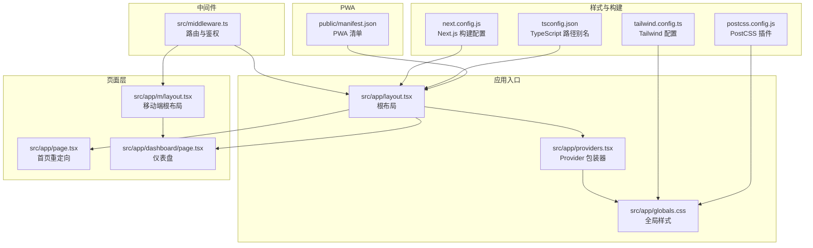
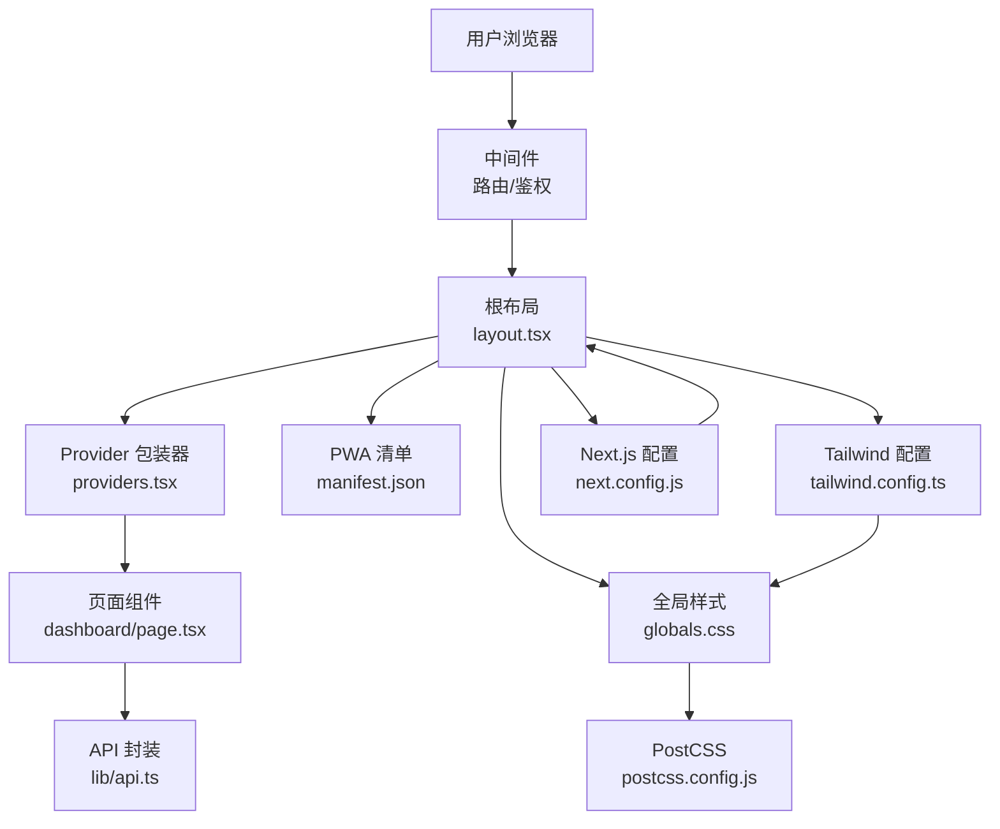
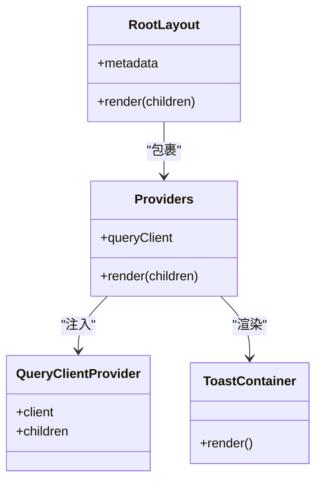
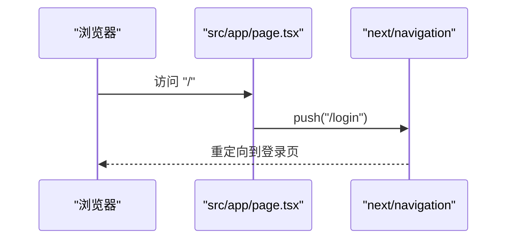
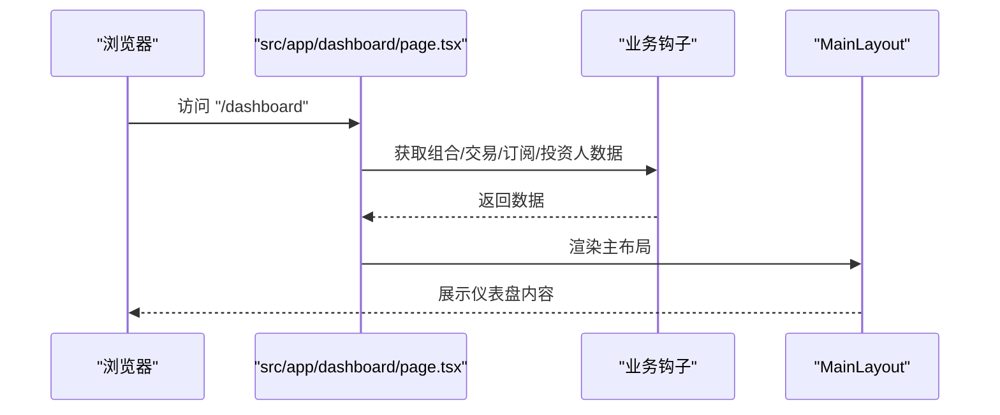
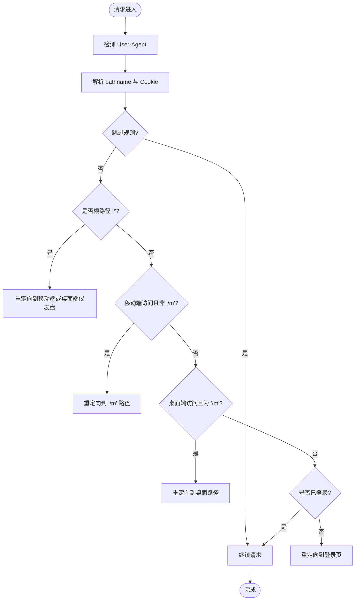
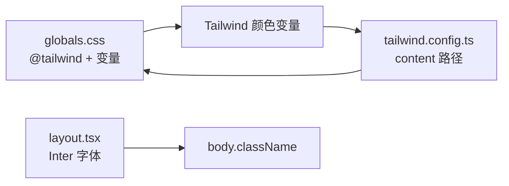
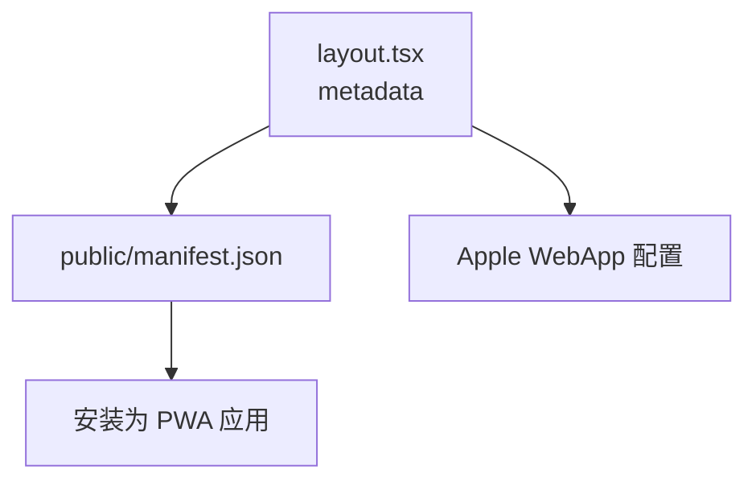
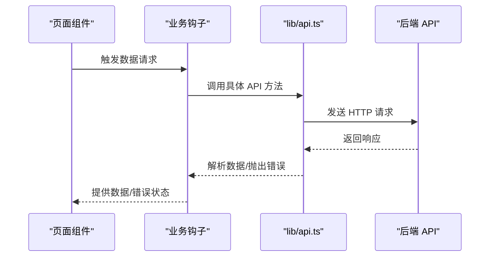
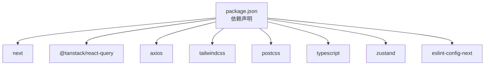

# Next.js 应用结构

<cite>
**本文档引用的文件**
- [layout.tsx](file://frontend/src/app/layout.tsx)
- [providers.tsx](file://frontend/src/app/providers.tsx)
- [page.tsx](file://frontend/src/app/page.tsx)
- [dashboard/page.tsx](file://frontend/src/app/dashboard/page.tsx)
- [m/layout.tsx](file://frontend/src/app/m/layout.tsx)
- [MainLayout.tsx](file://frontend/src/components/layout/MainLayout.tsx)
- [middleware.ts](file://frontend/src/middleware.ts)
- [globals.css](file://frontend/src/app/globals.css)
- [tailwind.config.ts](file://frontend/tailwind.config.ts)
- [postcss.config.js](file://frontend/postcss.config.js)
- [next.config.js](file://frontend/next.config.js)
- [package.json](file://frontend/package.json)
- [tsconfig.json](file://frontend/tsconfig.json)
- [manifest.json](file://frontend/public/manifest.json)
- [api.ts](file://frontend/src/lib/api.ts)
</cite>

## 目录
1. [简介](#简介)
2. [项目结构](#项目结构)
3. [核心组件](#核心组件)
4. [架构总览](#架构总览)
5. [详细组件分析](#详细组件分析)
6. [依赖关系分析](#依赖关系分析)
7. [性能考虑](#性能考虑)
8. [故障排除指南](#故障排除指南)
9. [结论](#结论)
10. [附录](#附录)

## 简介
本文件面向 Next.js 14+ App Router 应用，系统性梳理 InvestRing 前端项目的目录结构、文件命名规范、根布局与 Provider 包装器设计、全局样式与字体配置、元数据与 PWA 设置、路由组织原则、页面组件最佳实践、SSR/SSG 策略选择与实现、应用启动流程以及性能优化建议。内容以仓库现有实现为依据，避免臆测，确保可操作性与可追溯性。

## 项目结构
前端项目位于 `frontend/` 目录，采用 Next.js App Router 标准目录结构：
- 根布局与全局样式：`src/app/layout.tsx`、`src/app/globals.css`
- Provider 包装器：`src/app/providers.tsx`
- 页面与路由：`src/app/dashboard/page.tsx`、`src/app/m/layout.tsx`、`src/app/page.tsx`
- 中间件：`src/middleware.ts`
- 样式与构建：`tailwind.config.ts`、`postcss.config.js`、`next.config.js`
- 类型与工具：`tsconfig.json`、`src/lib/api.ts`
- PWA 清单：`public/manifest.json`

**图表来源**
- [layout.tsx:1-32](file://frontend/src/app/layout.tsx#L1-L32)
- [providers.tsx:1-28](file://frontend/src/app/providers.tsx#L1-L28)
- [globals.css:1-84](file://frontend/src/app/globals.css#L1-L84)
- [page.tsx:1-15](file://frontend/src/app/page.tsx#L1-L15)
- [dashboard/page.tsx:1-290](file://frontend/src/app/dashboard/page.tsx#L1-L290)
- [m/layout.tsx:1-27](file://frontend/src/app/m/layout.tsx#L1-L27)
- [middleware.ts:1-40](file://frontend/src/middleware.ts#L1-L40)
- [tailwind.config.ts:1-57](file://frontend/tailwind.config.ts#L1-L57)
- [postcss.config.js:1-7](file://frontend/postcss.config.js#L1-L7)
- [next.config.js:1-16](file://frontend/next.config.js#L1-L16)
- [tsconfig.json:1-27](file://frontend/tsconfig.json#L1-L27)
- [manifest.json:1-27](file://frontend/public/manifest.json#L1-L27)

**章节来源**
- [layout.tsx:1-32](file://frontend/src/app/layout.tsx#L1-L32)
- [globals.css:1-84](file://frontend/src/app/globals.css#L1-L84)
- [tailwind.config.ts:1-57](file://frontend/tailwind.config.ts#L1-L57)
- [postcss.config.js:1-7](file://frontend/postcss.config.js#L1-L7)
- [next.config.js:1-16](file://frontend/next.config.js#L1-L16)
- [tsconfig.json:1-27](file://frontend/tsconfig.json#L1-L27)
- [manifest.json:1-27](file://frontend/public/manifest.json#L1-L27)

## 核心组件
- 根布局组件：负责语言、字体、全局样式引入与 Provider 包装，作为所有页面的根容器。
- Provider 包装器：集中初始化数据查询客户端、全局提示等客户端上下文。
- 页面组件：按路由层级组织，使用客户端指令与业务逻辑钩子。
- 中间件：统一处理移动端/桌面端分流、登录态校验与重定向。
- 全局样式与主题：通过 Tailwind CSS 变量与暗色模式支持，提供一致的视觉基础。
- PWA 清单：定义应用名称、图标、启动行为与主题色。

**章节来源**
- [layout.tsx:1-32](file://frontend/src/app/layout.tsx#L1-L32)
- [providers.tsx:1-28](file://frontend/src/app/providers.tsx#L1-L28)
- [page.tsx:1-15](file://frontend/src/app/page.tsx#L1-L15)
- [dashboard/page.tsx:1-290](file://frontend/src/app/dashboard/page.tsx#L1-L290)
- [m/layout.tsx:1-27](file://frontend/src/app/m/layout.tsx#L1-L27)
- [middleware.ts:1-40](file://frontend/src/middleware.ts#L1-L40)
- [globals.css:1-84](file://frontend/src/app/globals.css#L1-L84)
- [manifest.json:1-27](file://frontend/public/manifest.json#L1-L27)

## 架构总览
Next.js App Router 以“约定优于配置”的方式组织路由与布局。根布局负责注入全局样式与 Provider；页面组件按路径映射渲染；中间件在请求阶段进行路由与鉴权处理；构建配置启用严格模式与 SWC 压缩；样式通过 PostCSS/Tailwind 自动化生成。

**图表来源**
- [layout.tsx:1-32](file://frontend/src/app/layout.tsx#L1-L32)
- [providers.tsx:1-28](file://frontend/src/app/providers.tsx#L1-L28)
- [dashboard/page.tsx:1-290](file://frontend/src/app/dashboard/page.tsx#L1-L290)
- [middleware.ts:1-40](file://frontend/src/middleware.ts#L1-L40)
- [globals.css:1-84](file://frontend/src/app/globals.css#L1-L84)
- [manifest.json:1-27](file://frontend/public/manifest.json#L1-L27)
- [api.ts:1-627](file://frontend/src/lib/api.ts#L1-L627)
- [tailwind.config.ts:1-57](file://frontend/tailwind.config.ts#L1-L57)
- [postcss.config.js:1-7](file://frontend/postcss.config.js#L1-L7)
- [next.config.js:1-16](file://frontend/next.config.js#L1-L16)

## 详细组件分析

### 根布局与 Provider 包装器
- 根布局负责：
  - 元数据声明（标题、描述、PWA 清单与 Apple WebApp 配置）。
  - 字体加载（Inter 字体）与全局样式引入。
  - 根节点包裹 Provider，向子树注入数据查询与全局提示。
- Provider 包装器负责：
  - 初始化数据查询客户端，设置默认过期时间、窗口焦点重取策略与重试次数。
  - 在根节点下方渲染全局提示组件，便于跨页面展示通知。

**图表来源**
- [layout.tsx:1-32](file://frontend/src/app/layout.tsx#L1-L32)
- [providers.tsx:1-28](file://frontend/src/app/providers.tsx#L1-L28)

**章节来源**
- [layout.tsx:1-32](file://frontend/src/app/layout.tsx#L1-L32)
- [providers.tsx:1-28](file://frontend/src/app/providers.tsx#L1-L28)

### 页面组件与路由组织
- 首页重定向：根路径页面组件在客户端跳转到登录页，避免服务端渲染阻塞。
- 仪表盘页面：使用客户端指令，组合多个业务钩子拉取数据，渲染统计卡片与活动列表。
- 移动端根布局：根据登录态决定是否渲染移动端布局，未登录则跳转至移动端登录页。
- 主布局组件：桌面端统一导航与侧边栏，未登录时跳转至桌面登录页。

**图表来源**
- [page.tsx:1-15](file://frontend/src/app/page.tsx#L1-L15)

**图表来源**
- [dashboard/page.tsx:1-290](file://frontend/src/app/dashboard/page.tsx#L1-L290)
- [MainLayout.tsx:1-41](file://frontend/src/components/layout/MainLayout.tsx#L1-L41)

**章节来源**
- [page.tsx:1-15](file://frontend/src/app/page.tsx#L1-L15)
- [dashboard/page.tsx:1-290](file://frontend/src/app/dashboard/page.tsx#L1-L290)
- [m/layout.tsx:1-27](file://frontend/src/app/m/layout.tsx#L1-L27)
- [MainLayout.tsx:1-41](file://frontend/src/components/layout/MainLayout.tsx#L1-L41)

### 中间件与路由策略
- 用户代理检测：区分移动端与桌面端，自动重定向至对应路径。
- 登录态校验：未登录且非登录页时，重定向至登录页。
- 路由匹配：排除静态资源与 API，对动态路由生效。

**图表来源**
- [middleware.ts:1-40](file://frontend/src/middleware.ts#L1-L40)

**章节来源**
- [middleware.ts:1-40](file://frontend/src/middleware.ts#L1-L40)

### 全局样式、字体与主题
- 全局样式：通过 Tailwind 指令引入基础、组件与工具层，定义暗色模式变量与颜色体系。
- 字体：使用 Next.js 字体加载 Inter，设置语言属性。
- 主题：Tailwind 配置扩展颜色与圆角变量，配合 CSS 变量实现明暗切换。

**图表来源**
- [globals.css:1-84](file://frontend/src/app/globals.css#L1-L84)
- [layout.tsx:1-32](file://frontend/src/app/layout.tsx#L1-L32)
- [tailwind.config.ts:1-57](file://frontend/tailwind.config.ts#L1-L57)

**章节来源**
- [globals.css:1-84](file://frontend/src/app/globals.css#L1-L84)
- [layout.tsx:1-32](file://frontend/src/app/layout.tsx#L1-L32)
- [tailwind.config.ts:1-57](file://frontend/tailwind.config.ts#L1-L57)

### PWA 与元数据
- 元数据：根布局声明标题、描述、PWA 清单与 Apple WebApp 配置。
- PWA 清单：定义应用名称、图标、启动行为、主题色与分类信息。

**图表来源**
- [layout.tsx:1-32](file://frontend/src/app/layout.tsx#L1-L32)
- [manifest.json:1-27](file://frontend/public/manifest.json#L1-L27)

**章节来源**
- [layout.tsx:1-32](file://frontend/src/app/layout.tsx#L1-L32)
- [manifest.json:1-27](file://frontend/public/manifest.json#L1-L27)

### API 与数据流
- API 封装：基于 Axios 创建实例，统一请求/响应拦截器，处理 401 跳转与错误格式化。
- 业务模块：按领域拆分 API 模块（认证、投资人、组合、持仓、交易、产品、平台、系统、日志、任务、通知、快照、份额变动事件）。
- 错误处理：统一异常类与错误处理函数，保证前端错误一致性。

**图表来源**
- [dashboard/page.tsx:1-290](file://frontend/src/app/dashboard/page.tsx#L1-L290)
- [api.ts:1-627](file://frontend/src/lib/api.ts#L1-L627)

**章节来源**
- [api.ts:1-627](file://frontend/src/lib/api.ts#L1-L627)

## 依赖关系分析
- 构建与运行：Next.js 14、React 18、TypeScript、Tailwind CSS、PostCSS、SWC。
- 客户端状态与网络：@tanstack/react-query、axios。
- UI 组件：Radix UI、Lucide React、Recharts、Zustand。
- 开发工具：ESLint、Autoprefixer。

**图表来源**
- [package.json:1-45](file://frontend/package.json#L1-L45)

**章节来源**
- [package.json:1-45](file://frontend/package.json#L1-L45)

## 性能考虑
- 构建优化：启用严格模式与 SWC 压缩，减少打包体积与提升编译速度。
- 图片优化：使用 Next.js 内置图片优化能力（需在页面中使用相应组件）。
- 缓存策略：Provider 中设置查询缓存过期时间与重试次数，平衡实时性与性能。
- 路由与渲染：中间件提前分流，避免不必要的服务端渲染；页面组件按需加载。
- 样式体积：Tailwind content 路径精准扫描，避免生成冗余样式。

**章节来源**
- [next.config.js:1-16](file://frontend/next.config.js#L1-L16)
- [providers.tsx:1-28](file://frontend/src/app/providers.tsx#L1-L28)
- [tailwind.config.ts:1-57](file://frontend/tailwind.config.ts#L1-L57)

## 故障排除指南
- 登录态相关问题：检查中间件登录态判断与重定向逻辑，确认 Cookie 名称与路径。
- 路由跳转异常：核对移动端/桌面端路径映射与重定向目标。
- API 401：确认请求拦截器是否正确附加 Token，响应拦截器是否触发跳转。
- 样式不生效：检查 Tailwind content 路径与 CSS 变量覆盖顺序。
- PWA 安装失败：核对清单文件字段与图标资源可用性。

**章节来源**
- [middleware.ts:1-40](file://frontend/src/middleware.ts#L1-L40)
- [api.ts:1-627](file://frontend/src/lib/api.ts#L1-L627)
- [globals.css:1-84](file://frontend/src/app/globals.css#L1-L84)
- [manifest.json:1-27](file://frontend/public/manifest.json#L1-L27)

## 结论
该应用遵循 Next.js 14+ App Router 最佳实践，通过根布局与 Provider 包装器实现全局上下文注入，结合中间件完成路由与鉴权控制，利用 Tailwind CSS 与 PostCSS 构建一致的视觉体系，并通过 PWA 清单提升用户体验。页面组件采用客户端指令与业务钩子组织数据流，整体结构清晰、职责明确，具备良好的可维护性与扩展性。

## 附录

### 目录结构速览
- 根布局与样式：`src/app/layout.tsx`、`src/app/globals.css`
- Provider：`src/app/providers.tsx`
- 页面：`src/app/dashboard/page.tsx`、`src/app/m/layout.tsx`、`src/app/page.tsx`
- 中间件：`src/middleware.ts`
- 样式与构建：`tailwind.config.ts`、`postcss.config.js`、`next.config.js`
- 类型与工具：`tsconfig.json`、`src/lib/api.ts`
- PWA：`public/manifest.json`

**章节来源**
- [layout.tsx:1-32](file://frontend/src/app/layout.tsx#L1-L32)
- [providers.tsx:1-28](file://frontend/src/app/providers.tsx#L1-L28)
- [page.tsx:1-15](file://frontend/src/app/page.tsx#L1-L15)
- [dashboard/page.tsx:1-290](file://frontend/src/app/dashboard/page.tsx#L1-L290)
- [m/layout.tsx:1-27](file://frontend/src/app/m/layout.tsx#L1-L27)
- [middleware.ts:1-40](file://frontend/src/middleware.ts#L1-L40)
- [globals.css:1-84](file://frontend/src/app/globals.css#L1-L84)
- [tailwind.config.ts:1-57](file://frontend/tailwind.config.ts#L1-L57)
- [postcss.config.js:1-7](file://frontend/postcss.config.js#L1-L7)
- [next.config.js:1-16](file://frontend/next.config.js#L1-L16)
- [tsconfig.json:1-27](file://frontend/tsconfig.json#L1-L27)
- [manifest.json:1-27](file://frontend/public/manifest.json#L1-L27)
- [api.ts:1-627](file://frontend/src/lib/api.ts#L1-L627)