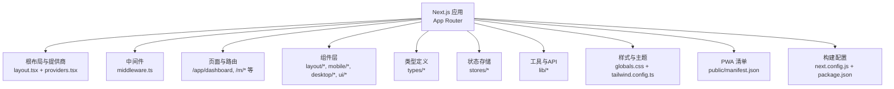
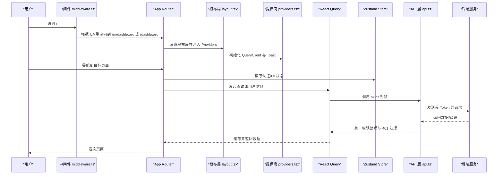
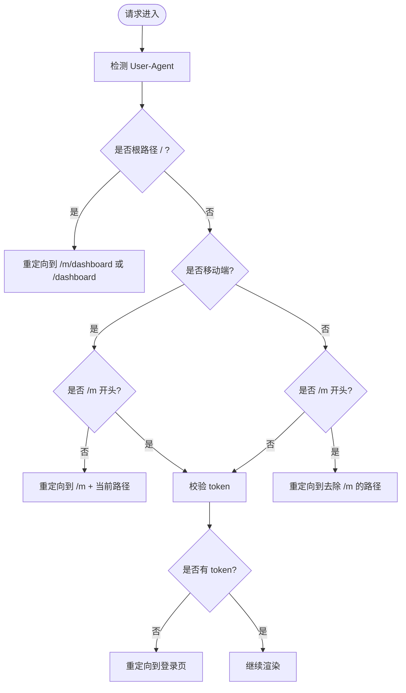
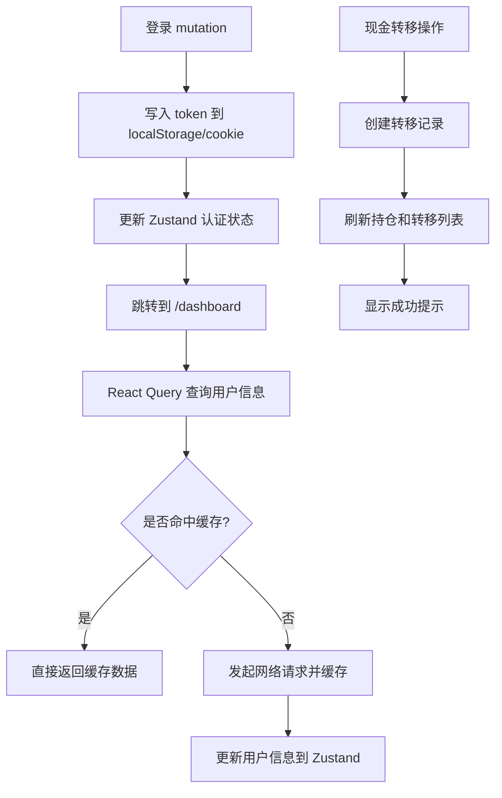
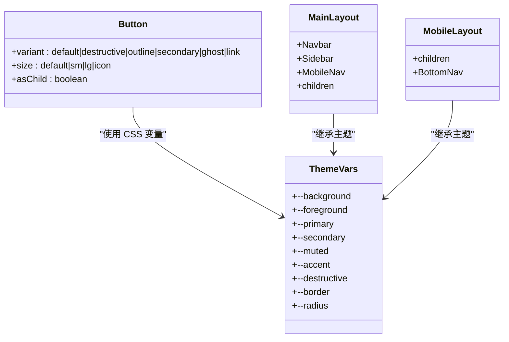
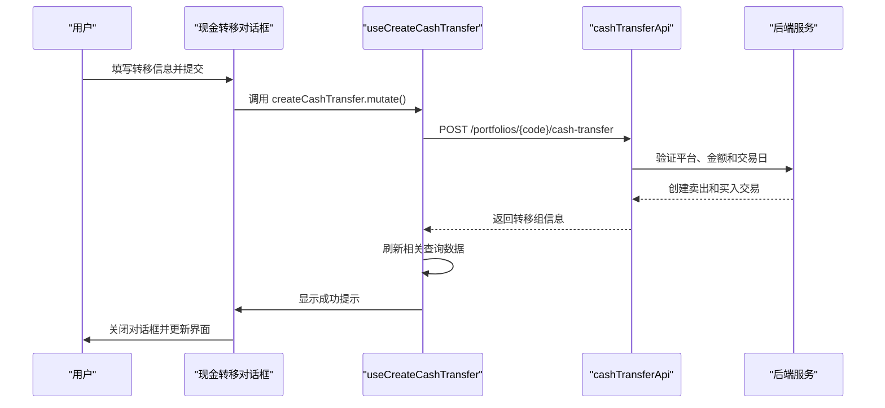
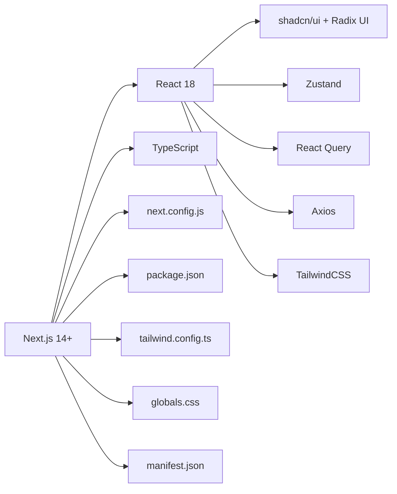

# 前端应用架构

<cite>
**本文引用的文件**
- [package.json](file://frontend/package.json)
- [next.config.js](file://frontend/next.config.js)
- [tailwind.config.ts](file://frontend/tailwind.config.ts)
- [src/app/layout.tsx](file://frontend/src/app/layout.tsx)
- [src/app/providers.tsx](file://frontend/src/app/providers.tsx)
- [src/middleware.ts](file://frontend/src/middleware.ts)
- [public/manifest.json](file://frontend/public/manifest.json)
- [src/lib/api/client.ts](file://frontend/src/lib/api/client.ts)
- [src/lib/api/index.ts](file://frontend/src/lib/api/index.ts)
- [src/lib/api/cash-transfer.ts](file://frontend/src/lib/api/cash-transfer.ts)
- [src/stores/authStore.ts](file://frontend/src/stores/authStore.ts)
- [src/stores/uiStore.ts](file://frontend/src/stores/uiStore.ts)
- [src/hooks/useAuth.ts](file://frontend/src/hooks/useAuth.ts)
- [src/hooks/useCashTransfer.ts](file://frontend/src/hooks/useCashTransfer.ts)
- [src/types/cash-transfer.ts](file://frontend/src/types/cash-transfer.ts)
- [src/types/common.ts](file://frontend/src/types/common.ts)
- [src/app/portfolio/[code]/positions/page.tsx](file://frontend/src/app/portfolio/[code]/positions/page.tsx)
- [src/app/globals.css](file://frontend/src/app/globals.css)
- [src/components/layout/MainLayout.tsx](file://frontend/src/components/layout/MainLayout.tsx)
- [src/components/mobile/MobileLayout.tsx](file://frontend/src/components/mobile/MobileLayout.tsx)
- [src/components/desktop/Sidebar.tsx](file://frontend/src/components/desktop/Sidebar.tsx)
- [src/components/mobile/BottomNav.tsx](file://frontend/src/components/mobile/BottomNav.tsx)
- [src/components/ui/button.tsx](file://frontend/src/components/ui/button.tsx)
- [src/types/auth.ts](file://frontend/src/types/auth.ts)
</cite>

## 更新摘要
**变更内容**
- 新增现金转移功能模块，包括API客户端、React Hooks、类型定义和用户界面组件
- 扩展持仓管理页面，支持平台间现金转移操作
- 完善状态管理和错误处理机制
- 增强移动端和PC端的双端适配体验

## 目录
1. [引言](#引言)
2. [项目结构](#项目结构)
3. [核心组件](#核心组件)
4. [架构总览](#架构总览)
5. [详细组件分析](#详细组件分析)
6. [依赖关系分析](#依赖关系分析)
7. [性能考量](#性能考量)
8. [故障排查指南](#故障排查指南)
9. [结论](#结论)
10. [附录](#附录)

## 引言
本文件面向 InvestRing 前端团队，系统性梳理基于 Next.js 14+ App Router 的应用架构，覆盖移动端与 PC 端双端设计、路由与中间件策略、状态管理（Zustand + React Query）、UI 组件库（shadcn/ui + TailwindCSS）使用规范、响应式布局与移动端适配、以及 PWA 离线能力与 Service Worker 配置。文档同时提供组件开发规范、样式约定与交互设计指南，帮助开发者高效协作与长期维护。

**更新** 新增现金转移功能模块的完整实现，支持平台间资金调拨和跨天到账处理。

## 项目结构
前端采用 Next.js 14+ App Router 结构，按功能域组织页面与组件，并通过中间件实现移动端与 PC 端的分流与跳转。根级配置文件负责构建优化、API 代理与 PWA 清单注入；全局样式与主题变量通过 TailwindCSS 与 CSS 变量统一管理；状态管理由 Zustand 提供轻量本地状态，React Query 负责服务端数据缓存与失效策略；UI 层以 shadcn/ui 组件为基础，结合 Tailwind 工具类进行定制。

图表来源
- [src/app/layout.tsx:1-32](file://frontend/src/app/layout.tsx#L1-L32)
- [src/app/providers.tsx:1-28](file://frontend/src/app/providers.tsx#L1-L28)
- [src/middleware.ts:1-40](file://frontend/src/middleware.ts#L1-L40)
- [next.config.js:1-16](file://frontend/next.config.js#L1-L16)
- [tailwind.config.ts:1-57](file://frontend/tailwind.config.ts#L1-L57)
- [src/app/globals.css:1-84](file://frontend/src/app/globals.css#L1-L84)
- [public/manifest.json:1-27](file://frontend/public/manifest.json#L1-L27)

章节来源
- [src/app/layout.tsx:1-32](file://frontend/src/app/layout.tsx#L1-L32)
- [src/app/providers.tsx:1-28](file://frontend/src/app/providers.tsx#L1-L28)
- [src/middleware.ts:1-40](file://frontend/src/middleware.ts#L1-L40)
- [next.config.js:1-16](file://frontend/next.config.js#L1-L16)
- [tailwind.config.ts:1-57](file://frontend/tailwind.config.ts#L1-L57)
- [src/app/globals.css:1-84](file://frontend/src/app/globals.css#L1-L84)
- [public/manifest.json:1-27](file://frontend/public/manifest.json#L1-L27)

## 核心组件
- 中间件与路由分流：根据 UA 自动跳转至移动端或 PC 端路径，统一登录校验与访问控制。
- 数据层：Axios 封装统一请求/响应拦截，错误处理与 401 自动登出；React Query 提供查询客户端与默认缓存策略。
- 状态层：Zustand 存储认证态与 UI 态，持久化到 localStorage/cookie，支持 UI 状态记忆。
- UI 层：基于 shadcn/ui 的 Button、Dialog、Tabs 等组件，配合 Tailwind 工具类与 CSS 变量主题。
- 布局层：MainLayout（PC）与 MobileLayout（移动端）分别承载桌面与移动端导航与内容区域。
- **新增** 现金转移功能：完整的平台间资金调拨流程，支持当天到账和跨天到账模式。

章节来源
- [src/middleware.ts:1-40](file://frontend/src/middleware.ts#L1-L40)
- [src/lib/api/client.ts:1-94](file://frontend/src/lib/api/client.ts#L1-L94)
- [src/stores/authStore.ts:1-71](file://frontend/src/stores/authStore.ts#L1-L71)
- [src/stores/uiStore.ts:1-85](file://frontend/src/stores/uiStore.ts#L1-L85)
- [src/components/ui/button.tsx:1-56](file://frontend/src/components/ui/button.tsx#L1-L56)
- [src/components/layout/MainLayout.tsx:1-41](file://frontend/src/components/layout/MainLayout.tsx#L1-L41)
- [src/components/mobile/MobileLayout.tsx:1-16](file://frontend/src/components/mobile/MobileLayout.tsx#L1-L16)

## 架构总览
下图展示从浏览器请求到页面渲染、数据获取与状态更新的全链路：

图表来源
- [src/middleware.ts:1-40](file://frontend/src/middleware.ts#L1-L40)
- [src/app/layout.tsx:1-32](file://frontend/src/app/layout.tsx#L1-L32)
- [src/app/providers.tsx:1-28](file://frontend/src/app/providers.tsx#L1-L28)
- [src/lib/api/client.ts:1-94](file://frontend/src/lib/api/client.ts#L1-L94)
- [src/stores/authStore.ts:1-71](file://frontend/src/stores/authStore.ts#L1-L71)
- [src/stores/uiStore.ts:1-85](file://frontend/src/stores/uiStore.ts#L1-L85)

## 详细组件分析

### 路由与中间件（移动端/PC 端分流）
- 功能要点
  - 识别移动端 UA，自动将根路径重定向至移动端入口。
  - 非移动端访问移动端路由时，重定向至 PC 路径。
  - 未登录访问受保护路由时，统一跳转到登录页。
  - 支持 /api 代理到后端服务，便于开发联调。
- 设计理念
  - 通过中间件集中处理路由与鉴权，避免在各页面重复逻辑。
  - 使用固定匹配规则与正则判断，兼顾可维护性与性能。

图表来源
- [src/middleware.ts:1-40](file://frontend/src/middleware.ts#L1-L40)

章节来源
- [src/middleware.ts:1-40](file://frontend/src/middleware.ts#L1-L40)
- [next.config.js:5-12](file://frontend/next.config.js#L5-L12)

### 数据层与 API 封装（Axios + 错误处理）
- 统一基地址与超时配置，自动附加 Bearer Token。
- 响应拦截器统一处理 401 并清空本地 token 后跳转登录。
- 按业务域拆分 API 模块（认证、投资人、组合、持仓、交易、产品、平台、系统、日志与任务、快照、份额变动事件、**现金转移**等），便于维护与测试。
- 提供通用请求封装与异常类型，便于上层统一处理。

**更新** 新增现金转移 API 模块，支持创建转移、确认跨天转账和列表查询功能。

```mermaid
classDiagram
class ApiClient {
+baseURL
+timeout
+request(config)
+interceptors
}
class AuthApi {
+login(data)
+changePassword(data)
+getCurrentUser()
}
class PortfolioApi {
+list(params)
+get(code)
+create(data)
+update(code,data)
+close(code)
+activate(code)
+remove(code)
+getSnapshots(code,params)
+getLatestSnapshot(code)
+getAvailableCash(code)
+getInvestors(code)
}
class PositionApi {
+list(portfolioCode,params)
+getLatest(portfolioCode)
+create(data)
+update(id,data)
+updateCashPosition(portfolioCode,amount,platformCode,updateDate)
+getAttribution(portfolioCode)
}
class SubscriptionApi {
+list(params)
+get(id)
+create(data)
+confirm(id,opts)
+cancel(id)
}
class TradeApi {
+list(params)
+get(id)
+create(data)
+update(id,data)
+confirm(id,opts)
+cancel(id)
+batchRebalance(portfolioCode,trades,idempotencyKey)
}
class ProductApi {
+list(params)
+get(code,market)
+create(data)
+update(code,data,market)
+delete(code,market)
+syncPrice(code,market,data)
+syncHistory(code,market)
+getPriceData(code,market,params)
}
class PlatformApi {
+list(params)
+get(code)
+create(data)
+update(code,data)
+delete(code)
}
class SystemApi {
+getTradingCalendar(year)
+syncTradingCalendar(year)
+getDataSourceConfig()
+updateDataSourceConfig(source,config)
}
class LogApi {
+loginLogs(params)
+auditLogs(params)
+errorLogs(params)
+taskLogs(params)
}
class TaskApi {
+list()
+run(code)
+enable(code)
+disable(code)
+executionHistory(params)
}
class NotificationApi {
+list(params)
+markAsRead(id)
+markAllAsRead()
}
class SnapshotApi {
+generate(portfolioCode,targetDate)
+recalculate(portfolioCode,start,end,force)
+validate(portfolioCode,targetDate)
+getStatus(portfolioCode)
+delete(portfolioCode,snapshotDate)
}
class ShareChangeEventApi {
+list(params)
+get(id)
+create(data)
+update(id,data)
+confirm(id)
+cancel(id)
+delete(id)
}
class CashTransferApi {
+create(portfolioCode,data)
+confirm(portfolioCode,transferGroup)
+list(portfolioCode,params)
}
ApiClient <.. AuthApi
ApiClient <.. PortfolioApi
ApiClient <.. PositionApi
ApiClient <.. SubscriptionApi
ApiClient <.. TradeApi
ApiClient <.. ProductApi
ApiClient <.. PlatformApi
ApiClient <.. SystemApi
ApiClient <.. LogApi
ApiClient <.. TaskApi
ApiClient <.. NotificationApi
ApiClient <.. SnapshotApi
ApiClient <.. ShareChangeEventApi
ApiClient <.. CashTransferApi
```

图表来源
- [src/lib/api/client.ts:1-94](file://frontend/src/lib/api/client.ts#L1-L94)
- [src/lib/api/cash-transfer.ts:1-26](file://frontend/src/lib/api/cash-transfer.ts#L1-L26)

章节来源
- [src/lib/api/client.ts:1-94](file://frontend/src/lib/api/client.ts#L1-L94)
- [src/lib/api/index.ts:1-44](file://frontend/src/lib/api/index.ts#L1-L44)
- [src/lib/api/cash-transfer.ts:1-26](file://frontend/src/lib/api/cash-transfer.ts#L1-L26)

### 状态管理（Zustand + React Query）
- 认证状态（Zustand）
  - 保存 token、用户信息、认证状态与加载状态。
  - 登录写入 localStorage 与 cookie，登出清理并触发全局清理。
  - 仅持久化必要字段，减少存储体积。
- UI 状态（Zustand）
  - PC 侧边栏展开/折叠、移动端底部导航显隐、全局加载态、Toast 列表。
  - 侧边栏状态持久化，提升用户体验。
- React Query（数据缓存）
  - 默认查询缓存 30 秒，窗口聚焦不自动刷新，重试 1 次。
  - 在登录/登出时清理缓存，避免脏数据。
- **新增** 现金转移状态管理
  - 专门的 useCashTransfer Hook 管理转移列表、创建和确认操作。
  - 自动刷新相关查询数据，确保状态一致性。

图表来源
- [src/stores/authStore.ts:1-71](file://frontend/src/stores/authStore.ts#L1-L71)
- [src/stores/uiStore.ts:1-85](file://frontend/src/stores/uiStore.ts#L1-L85)
- [src/hooks/useAuth.ts:1-134](file://frontend/src/hooks/useAuth.ts#L1-L134)
- [src/hooks/useCashTransfer.ts:1-71](file://frontend/src/hooks/useCashTransfer.ts#L1-L71)
- [src/app/providers.tsx:1-28](file://frontend/src/app/providers.tsx#L1-L28)

章节来源
- [src/stores/authStore.ts:1-71](file://frontend/src/stores/authStore.ts#L1-L71)
- [src/stores/uiStore.ts:1-85](file://frontend/src/stores/uiStore.ts#L1-L85)
- [src/hooks/useAuth.ts:1-134](file://frontend/src/hooks/useAuth.ts#L1-L134)
- [src/hooks/useCashTransfer.ts:1-71](file://frontend/src/hooks/useCashTransfer.ts#L1-L71)
- [src/app/providers.tsx:1-28](file://frontend/src/app/providers.tsx#L1-L28)

### UI 组件库与样式规范（shadcn/ui + TailwindCSS）
- 组件选择
  - 按需引入 Button、Dialog、DropdownMenu、Select、Tabs、Tooltip 等基础组件。
  - 通过 cva 与 class-variance-authority 定义变体与尺寸，保持风格一致。
- 主题与变量
  - Tailwind 扩展颜色与圆角变量，CSS 变量在 :root 与 .dark 下切换。
  - 金融数值展示工具类（右对齐、等宽数字）统一金额/数量显示。
- 布局与导航
  - PC 端：MainLayout + Sidebar（含折叠/展开与高亮）。
  - 移动端：MobileLayout + BottomNav（按角色显示不同菜单项）。

图表来源
- [src/components/ui/button.tsx:1-56](file://frontend/src/components/ui/button.tsx#L1-L56)
- [src/app/globals.css:1-84](file://frontend/src/app/globals.css#L1-L84)
- [tailwind.config.ts:1-57](file://frontend/tailwind.config.ts#L1-L57)
- [src/components/layout/MainLayout.tsx:1-41](file://frontend/src/components/layout/MainLayout.tsx#L1-L41)
- [src/components/mobile/MobileLayout.tsx:1-16](file://frontend/src/components/mobile/MobileLayout.tsx#L1-L16)

章节来源
- [src/components/ui/button.tsx:1-56](file://frontend/src/components/ui/button.tsx#L1-L56)
- [src/app/globals.css:1-84](file://frontend/src/app/globals.css#L1-L84)
- [tailwind.config.ts:1-57](file://frontend/tailwind.config.ts#L1-L57)
- [src/components/layout/MainLayout.tsx:1-41](file://frontend/src/components/layout/MainLayout.tsx#L1-L41)
- [src/components/mobile/MobileLayout.tsx:1-16](file://frontend/src/components/mobile/MobileLayout.tsx#L1-L16)

### 响应式布局与移动端适配
- 断点策略
  - 使用 Tailwind lg 断点（1024px）区分桌面与移动端布局。
- 适配方案
  - PC 端：左侧固定导航 + 内容区滚动；侧边栏支持折叠与高亮。
  - 移动端：底部导航栏常驻，内容区上下留白，安全区域适配。
- 交互细节
  - 侧边栏折叠时使用 Tooltip 显示菜单名。
  - 移动端导航高亮状态与 PC 端一致，保证一致性体验。

章节来源
- [src/components/desktop/Sidebar.tsx:1-147](file://frontend/src/components/desktop/Sidebar.tsx#L1-L147)
- [src/components/mobile/BottomNav.tsx:1-79](file://frontend/src/components/mobile/BottomNav.tsx#L1-L79)
- [src/app/globals.css:1-84](file://frontend/src/app/globals.css#L1-L84)

### PWA 离线能力与 Service Worker
- 清单配置
  - 提供名称、短名、描述、启动路径、显示模式、背景色、主题色、图标集与分类。
- 离线能力
  - 通过根布局元数据注入 manifest，启用 standalone 显示模式。
  - Service Worker 未在仓库中显式实现，建议后续补充以支持缓存策略与离线回退。
- 建议
  - 在开发阶段使用 next-pwa 或 workbox-webpack-plugin 生成 SW。
  - 对静态资源与关键 API 做缓存策略，确保核心功能可用。

章节来源
- [src/app/layout.tsx:8-17](file://frontend/src/app/layout.tsx#L8-L17)
- [public/manifest.json:1-27](file://frontend/public/manifest.json#L1-L27)

### 现金转移功能详解

#### 功能概述
现金转移功能允许用户在投资组合的不同平台之间转移现金，支持当天到账和跨天到账两种模式。该功能复用了现有的交易表结构，通过创建一对买卖交易来实现资金的实际划转。

#### 核心组件
- **API 客户端** (`cash-transfer.ts`)：提供创建转移、确认跨天转账和列表查询接口
- **React Hooks** (`useCashTransfer.ts`)：封装查询和变更操作的 Hook，包含错误处理和状态管理
- **类型定义** (`cash-transfer.ts`)：定义转移相关的 TypeScript 接口
- **用户界面**：集成在持仓管理页面中的对话框表单

#### 业务流程

图表来源
- [src/hooks/useCashTransfer.ts:20-44](file://frontend/src/hooks/useCashTransfer.ts#L20-L44)
- [src/lib/api/cash-transfer.ts:5-11](file://frontend/src/lib/api/cash-transfer.ts#L5-L11)
- [src/app/portfolio/[code]/positions/page.tsx:177-208](file://frontend/src/app/portfolio/[code]/positions/page.tsx#L177-L208)

#### 类型定义
- `CashTransferCreate`：创建转移请求的数据结构，包含转出平台、转入平台、金额、是否跨天、转移日期等字段
- `CashTransferResponse`：创建转移后的响应数据结构，包含转移组标识、交易ID和状态信息
- `CashTransferListItem`：转移列表项的数据结构，包含详细的转移信息和确认状态

#### 用户界面特性
- 平台选择下拉框，防止选择相同平台
- 金额输入验证，确保大于0
- 日期选择器，支持交易日历验证
- 跨天到账选项，适用于银行转账等场景
- 实时表单验证和错误提示
- 加载状态和成功/失败反馈

**更新** 新增完整的现金转移功能模块，包括前后端全链路实现。

章节来源
- [src/lib/api/cash-transfer.ts:1-26](file://frontend/src/lib/api/cash-transfer.ts#L1-L26)
- [src/hooks/useCashTransfer.ts:1-71](file://frontend/src/hooks/useCashTransfer.ts#L1-L71)
- [src/types/cash-transfer.ts:1-36](file://frontend/src/types/cash-transfer.ts#L1-L36)
- [src/app/portfolio/[code]/positions/page.tsx:441-537](file://frontend/src/app/portfolio/[code]/positions/page.tsx#L441-L537)

## 依赖关系分析
- 运行时依赖
  - Next.js 14+、React 18、TypeScript、TailwindCSS、Lucide Icons、Radix UI、Zustand、React Query、Axios、date-fns、Recharts 等。
- 构建与开发
  - next.config.js 启用严格模式与 SWC 压缩，配置 /api 重写指向后端。
  - package.json 定义脚本与 ESLint 规则。

图表来源
- [package.json:11-38](file://frontend/package.json#L11-L38)
- [next.config.js:1-16](file://frontend/next.config.js#L1-L16)
- [tailwind.config.ts:1-57](file://frontend/tailwind.config.ts#L1-L57)
- [src/app/globals.css:1-84](file://frontend/src/app/globals.css#L1-L84)
- [public/manifest.json:1-27](file://frontend/public/manifest.json#L1-L27)

章节来源
- [package.json:1-45](file://frontend/package.json#L1-L45)
- [next.config.js:1-16](file://frontend/next.config.js#L1-L16)
- [tailwind.config.ts:1-57](file://frontend/tailwind.config.ts#L1-L57)
- [src/app/globals.css:1-84](file://frontend/src/app/globals.css#L1-L84)
- [public/manifest.json:1-27](file://frontend/public/manifest.json#L1-L27)

## 性能考量
- 缓存策略
  - React Query 默认缓存 30 秒，减少重复请求；窗口聚焦不刷新，降低抖动。
  - 登出时清理缓存，避免状态污染。
  - 现金转移操作后自动刷新相关查询数据，确保状态一致性。
- 网络与错误
  - Axios 超时 30 秒，统一错误处理与 401 自动登出。
  - 完善的错误消息提取和处理机制。
- 构建优化
  - 启用 SWC Minify 与严格模式，减小包体与提升运行效率。
- 图表与大列表
  - Recharts 用于净值曲线等可视化，建议在大数据场景下分页或虚拟化渲染。

## 故障排查指南
- 登录相关
  - 若出现 401，确认本地 token 是否存在且未过期；检查响应拦截器是否触发自动跳转。
  - 使用 useLogin/useLogout/useCurrentUser Hook 辅助定位问题。
- 路由与跳转
  - 中间件重定向异常时，检查 UA 识别与路径匹配规则。
  - 确认 /api 重写是否指向正确后端地址。
- 状态同步
  - 登录后 UI 未更新：确认 Zustand 认证状态写入与持久化；检查 Provider 注入层级。
  - 侧边栏状态丢失：确认 UI Store 的持久化配置与键名。
- 样式与主题
  - 深色/浅色主题不生效：检查 CSS 变量与 .dark 类是否正确切换。
- PWA
  - 清单未生效：核对 manifest.json 字段与根布局 meta 注入。
- **新增** 现金转移相关
  - 转移失败：检查平台代码有效性、金额格式和交易日验证。
  - 跨天转账确认问题：确认确认日期是否为下一个交易日。
  - 状态不同步：检查 React Query 的 queryKey 配置和数据刷新逻辑。

章节来源
- [src/lib/api/client.ts:30-42](file://frontend/src/lib/api/client.ts#L30-L42)
- [src/hooks/useAuth.ts:1-134](file://frontend/src/hooks/useAuth.ts#L1-L134)
- [src/middleware.ts:1-40](file://frontend/src/middleware.ts#L1-L40)
- [next.config.js:5-12](file://frontend/next.config.js#L5-L12)
- [src/stores/authStore.ts:1-71](file://frontend/src/stores/authStore.ts#L1-L71)
- [src/stores/uiStore.ts:1-85](file://frontend/src/stores/uiStore.ts#L1-L85)
- [src/app/globals.css:29-49](file://frontend/src/app/globals.css#L29-L49)
- [src/app/layout.tsx:8-17](file://frontend/src/app/layout.tsx#L8-L17)
- [src/hooks/useCashTransfer.ts:36-43](file://frontend/src/hooks/useCashTransfer.ts#L36-L43)

## 结论
InvestRing 前端以 Next.js 14+ App Router 为核心，结合中间件实现移动端/PC 端分流与统一鉴权；通过 Zustand 与 React Query 构建清晰的状态与数据流；UI 层以 shadcn/ui + TailwindCSS 提供一致的视觉与交互体验。**新增的现金转移功能**完善了平台间资金管理的能力，支持灵活的转账模式和完善的错误处理。建议后续完善 Service Worker 与缓存策略，进一步增强 PWA 能力与离线可用性；持续优化数据缓存与图表渲染性能，提升复杂场景下的用户体验。

## 附录

### 组件开发规范
- 文件命名
  - 页面组件使用 page.tsx，布局组件使用 Layout.tsx，功能组件使用 *.tsx。
- 组件职责
  - 单一职责，尽量无副作用；数据获取放在 Hook 中，UI 仅负责渲染。
- 样式规范
  - 优先使用 Tailwind 工具类；自定义样式放入 globals.css 或组件局部样式。
  - 使用 CSS 变量与主题类名，避免硬编码颜色。
- 交互设计
  - 按钮与表单控件统一使用 shadcn/ui 组件，保持一致的禁用/聚焦/悬停状态。
  - Toast 统一通过 UI Store 添加与移除，避免分散逻辑。

### 样式约定
- 颜色体系：使用主题变量 --primary/--secondary/--muted/--destructive 等。
- 数字显示：金额/数量使用等宽数字与右对齐工具类，提升可读性。
- 圆角与间距：遵循 theme.borderRadius 与常用内边距类，保持一致性。

### 交互设计指南
- 导航高亮：PC 侧边栏与移动端底部导航均以路径前缀匹配高亮。
- 折叠行为：侧边栏折叠时仅显示图标，使用 Tooltip 提示文本。
- 加载与反馈：全局加载态与 Toast 统一管理，避免重复提示。
- **新增** 表单验证：所有用户输入都需要进行前端验证，提供清晰的错误提示。
- **新增** 异步操作：使用 React Query 的 mutation 处理异步操作，提供加载状态和错误处理。

### 现金转移功能开发指南
- API 设计原则
  - RESTful 风格，资源导向的 URL 设计。
  - 统一的错误响应格式和状态码。
  - 支持分页查询和参数过滤。
- 状态管理最佳实践
  - 使用专用的 Hook 封装业务逻辑。
  - 合理的 queryKey 设计，确保数据正确失效。
  - 完善的错误处理和用户反馈。
- 用户体验优化
  - 实时的表单验证和错误提示。
  - 清晰的加载状态和进度反馈。
  - 操作成功后的数据自动刷新。