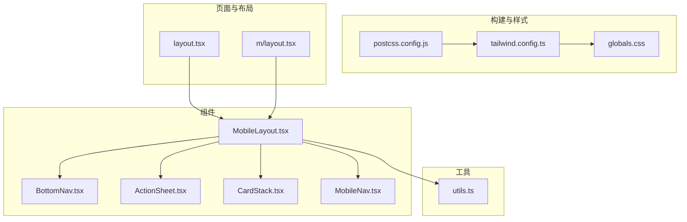
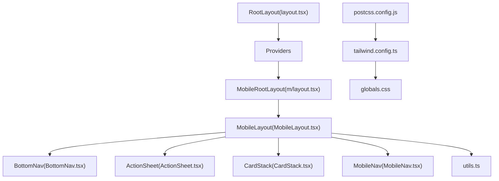
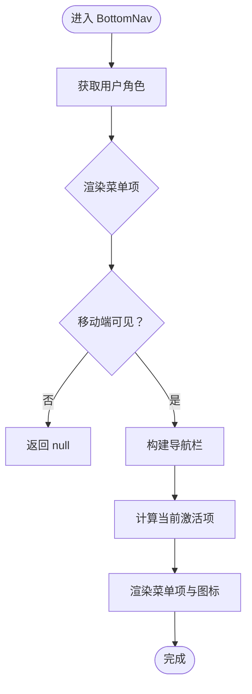
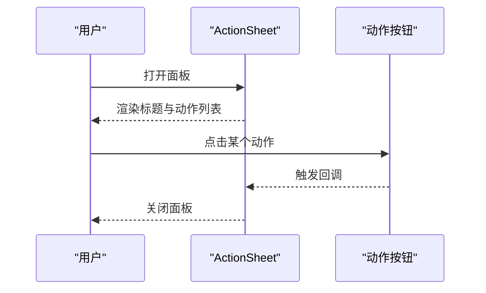
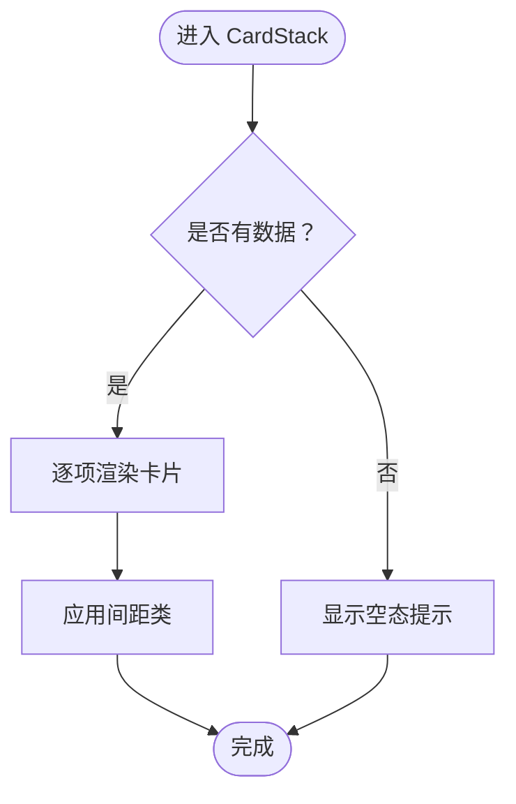
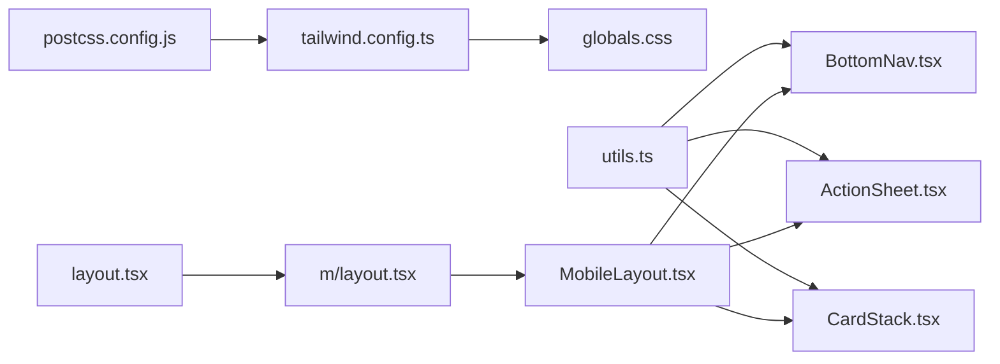

# 响应式与移动端设计

<cite>
**本文引用的文件**
- [tailwind.config.ts](file://frontend/tailwind.config.ts)
- [postcss.config.js](file://frontend/postcss.config.js)
- [package.json](file://frontend/package.json)
- [globals.css](file://frontend/src/app/globals.css)
- [layout.tsx](file://frontend/src/app/layout.tsx)
- [utils.ts](file://frontend/src/lib/utils.ts)
- [BottomNav.tsx](file://frontend/src/components/mobile/BottomNav.tsx)
- [ActionSheet.tsx](file://frontend/src/components/mobile/ActionSheet.tsx)
- [CardStack.tsx](file://frontend/src/components/mobile/CardStack.tsx)
- [MobileNav.tsx](file://frontend/src/components/layout/MobileNav.tsx)
- [MobileLayout.tsx](file://frontend/src/components/mobile/MobileLayout.tsx)
- [m/layout.tsx](file://frontend/src/app/m/layout.tsx)
</cite>

## 目录
1. [引言](#引言)
2. [项目结构](#项目结构)
3. [核心组件](#核心组件)
4. [架构总览](#架构总览)
5. [详细组件分析](#详细组件分析)
6. [依赖关系分析](#依赖关系分析)
7. [性能考虑](#性能考虑)
8. [故障排查指南](#故障排查指南)
9. [结论](#结论)
10. [附录](#附录)

## 引言
本文件面向移动端优先的设计理念与实现，结合 InvestRing 前端工程中的 Next.js 应用、TailwindCSS 主题系统与移动端专用组件，系统阐述断点策略、布局组件设计模式（底部导航、动作面板、卡片堆叠）、触摸交互优化、手势支持、性能优化（懒加载与资源压缩）、跨平台兼容与浏览器适配、以及移动端调试与测试策略。内容以仓库现有实现为依据，避免臆测，便于开发者快速理解与落地。

## 项目结构
移动端与响应式设计在本项目中主要由以下层次构成：
- 构建与样式层：PostCSS、TailwindCSS、主题变量与全局样式
- 组件层：移动端专用组件（底部导航、动作面板、卡片堆叠）与通用 UI 组件
- 页面与布局层：移动端根布局、主布局容器与路由级布局
- 工具与状态层：通用工具函数、UI 状态存储

图表来源
- [postcss.config.js:1-7](file://frontend/postcss.config.js#L1-L7)
- [tailwind.config.ts:1-57](file://frontend/tailwind.config.ts#L1-L57)
- [globals.css:1-84](file://frontend/src/app/globals.css#L1-L84)
- [layout.tsx:1-32](file://frontend/src/app/layout.tsx#L1-L32)
- [m/layout.tsx:1-27](file://frontend/src/app/m/layout.tsx#L1-L27)
- [MobileLayout.tsx:1-16](file://frontend/src/components/mobile/MobileLayout.tsx#L1-L16)
- [BottomNav.tsx:1-79](file://frontend/src/components/mobile/BottomNav.tsx#L1-L79)
- [ActionSheet.tsx:1-59](file://frontend/src/components/mobile/ActionSheet.tsx#L1-L59)
- [CardStack.tsx:1-35](file://frontend/src/components/mobile/CardStack.tsx#L1-L35)
- [MobileNav.tsx:1-61](file://frontend/src/components/layout/MobileNav.tsx#L1-L61)
- [utils.ts:1-270](file://frontend/src/lib/utils.ts#L1-L270)

章节来源
- [postcss.config.js:1-7](file://frontend/postcss.config.js#L1-L7)
- [tailwind.config.ts:1-57](file://frontend/tailwind.config.ts#L1-L57)
- [globals.css:1-84](file://frontend/src/app/globals.css#L1-L84)
- [layout.tsx:1-32](file://frontend/src/app/layout.tsx#L1-L32)
- [m/layout.tsx:1-27](file://frontend/src/app/m/layout.tsx#L1-L27)

## 核心组件
- 移动端底部导航 BottomNav：基于路径高亮、角色权限动态渲染、固定定位与安全区域处理，适合移动端底部导航。
- 动作面板 ActionSheet：从底部滑入的动作面板，支持标题、图标、变体按钮与点击回调，提供统一的移动端操作入口。
- 卡片堆叠 CardStack：将一组卡片按层级堆叠排列，支持间距控制与空态提示，适合移动端信息密集展示。
- 移动端导航 MobileNav：基础的移动端底部导航（未启用模糊与安全区），作为对比参考。
- 移动端布局 MobileLayout：为移动端页面提供最小高度、内边距与底部导航容器。

章节来源
- [BottomNav.tsx:1-79](file://frontend/src/components/mobile/BottomNav.tsx#L1-L79)
- [ActionSheet.tsx:1-59](file://frontend/src/components/mobile/ActionSheet.tsx#L1-L59)
- [CardStack.tsx:1-35](file://frontend/src/components/mobile/CardStack.tsx#L1-L35)
- [MobileNav.tsx:1-61](file://frontend/src/components/layout/MobileNav.tsx#L1-L61)
- [MobileLayout.tsx:1-16](file://frontend/src/components/mobile/MobileLayout.tsx#L1-L16)

## 架构总览
移动端优先的架构通过“页面布局 → 布局容器 → 专用组件”的分层组织，配合 TailwindCSS 的响应式工具类与主题变量，实现一致的视觉与交互体验。

图表来源
- [layout.tsx:1-32](file://frontend/src/app/layout.tsx#L1-L32)
- [m/layout.tsx:1-27](file://frontend/src/app/m/layout.tsx#L1-L27)
- [MobileLayout.tsx:1-16](file://frontend/src/components/mobile/MobileLayout.tsx#L1-L16)
- [BottomNav.tsx:1-79](file://frontend/src/components/mobile/BottomNav.tsx#L1-L79)
- [ActionSheet.tsx:1-59](file://frontend/src/components/mobile/ActionSheet.tsx#L1-L59)
- [CardStack.tsx:1-35](file://frontend/src/components/mobile/CardStack.tsx#L1-L35)
- [MobileNav.tsx:1-61](file://frontend/src/components/layout/MobileNav.tsx#L1-L61)
- [utils.ts:1-270](file://frontend/src/lib/utils.ts#L1-L270)
- [tailwind.config.ts:1-57](file://frontend/tailwind.config.ts#L1-L57)
- [postcss.config.js:1-7](file://frontend/postcss.config.js#L1-L7)

## 详细组件分析

### 底部导航 BottomNav
- 设计要点
  - 固定定位于屏幕底部，仅在移动端可见（使用断点类隐藏于大屏）。
  - 基于当前路径进行高亮，支持前缀匹配以覆盖子路由。
  - 角色驱动的菜单项差异（管理员与访客）。
  - 使用模糊背景与安全区域类，提升沉浸感与适配刘海屏/圆切 notch。
- 响应式与断点
  - 通过 Tailwind 断点类控制在大屏隐藏，移动端始终可见。
- 交互与可访问性
  - 图标与文字组合，提供清晰的语义标识；激活态提供视觉反馈。
- 可扩展性
  - 可通过状态存储控制可见性，便于在特定页面隐藏或显示。

图表来源
- [BottomNav.tsx:1-79](file://frontend/src/components/mobile/BottomNav.tsx#L1-L79)

章节来源
- [BottomNav.tsx:1-79](file://frontend/src/components/mobile/BottomNav.tsx#L1-L79)

### 动作面板 ActionSheet
- 设计要点
  - 从底部滑入的模态面板，支持标题、图标与多种按钮变体。
  - 点击遮罩层或关闭按钮可收起面板，提供统一的操作入口。
  - 使用动画类实现入场动画，增强交互自然度。
- 响应式与断点
  - 面板宽度与圆角在移动端自适应，保证在小屏下的可读性与可触达性。
- 交互与可访问性
  - 提供明确的关闭方式与操作按钮，避免误触。
- 可扩展性
  - 支持传入任意数量的动作项，便于业务扩展。

图表来源
- [ActionSheet.tsx:1-59](file://frontend/src/components/mobile/ActionSheet.tsx#L1-L59)

章节来源
- [ActionSheet.tsx:1-59](file://frontend/src/components/mobile/ActionSheet.tsx#L1-L59)

### 卡片堆叠 CardStack
- 设计要点
  - 将多个卡片按层级堆叠展示，支持自定义间距，适合移动端信息密度较高的场景。
  - 当无数据时显示占位文案，提升用户体验。
- 响应式与断点
  - 堆叠间距通过 Tailwind 工具类动态拼接，保证在不同设备上的一致性。
- 可扩展性
  - 内容区域可插入任意组件，满足不同业务场景。

图表来源
- [CardStack.tsx:1-35](file://frontend/src/components/mobile/CardStack.tsx#L1-L35)

章节来源
- [CardStack.tsx:1-35](file://frontend/src/components/mobile/CardStack.tsx#L1-L35)

### 移动端导航 MobileNav 与移动端布局 MobileLayout
- 设计要点
  - MobileNav 提供基础的底部导航能力，未启用模糊与安全区处理。
  - MobileLayout 为移动端页面提供统一的容器，包含最小高度、内边距与底部导航挂载点。
- 响应式与断点
  - 通过断点类控制在大屏隐藏，移动端始终可见。
- 可扩展性
  - 可替换为更完善的 BottomNav 或引入手势支持。

章节来源
- [MobileNav.tsx:1-61](file://frontend/src/components/layout/MobileNav.tsx#L1-L61)
- [MobileLayout.tsx:1-16](file://frontend/src/components/mobile/MobileLayout.tsx#L1-L16)

### 移动端根布局 MobileRootLayout
- 设计要点
  - 在移动端路由下校验登录状态，未登录重定向至登录页。
  - 已登录时包裹 MobileLayout，确保所有移动端页面共享统一布局。
- 响应式与断点
  - 通过 Next.js 路由约定与客户端逻辑实现移动端专属布局。

章节来源
- [m/layout.tsx:1-27](file://frontend/src/app/m/layout.tsx#L1-L27)

## 依赖关系分析
- 构建链路
  - PostCSS 通过 TailwindCSS 插件解析与生成样式，Autoprefixer 自动添加厂商前缀。
  - Tailwind 配置扩展主题变量与圆角半径，与全局 CSS 的 CSS 变量保持一致。
- 组件依赖
  - 移动端布局容器依赖底部导航与动作面板等组件。
  - 通用工具函数提供类名合并与格式化等能力，被多处组件复用。
- 版本与生态
  - 项目使用 Next.js、TailwindCSS、Radix UI 组件库与 Lucide React 图标，形成现代化移动端开发栈。

图表来源
- [postcss.config.js:1-7](file://frontend/postcss.config.js#L1-L7)
- [tailwind.config.ts:1-57](file://frontend/tailwind.config.ts#L1-L57)
- [globals.css:1-84](file://frontend/src/app/globals.css#L1-L84)
- [utils.ts:1-270](file://frontend/src/lib/utils.ts#L1-L270)
- [MobileLayout.tsx:1-16](file://frontend/src/components/mobile/MobileLayout.tsx#L1-L16)
- [BottomNav.tsx:1-79](file://frontend/src/components/mobile/BottomNav.tsx#L1-L79)
- [ActionSheet.tsx:1-59](file://frontend/src/components/mobile/ActionSheet.tsx#L1-L59)
- [CardStack.tsx:1-35](file://frontend/src/components/mobile/CardStack.tsx#L1-L35)
- [m/layout.tsx:1-27](file://frontend/src/app/m/layout.tsx#L1-L27)
- [layout.tsx:1-32](file://frontend/src/app/layout.tsx#L1-L32)

章节来源
- [package.json:1-45](file://frontend/package.json#L1-L45)
- [postcss.config.js:1-7](file://frontend/postcss.config.js#L1-L7)
- [tailwind.config.ts:1-57](file://frontend/tailwind.config.ts#L1-L57)
- [globals.css:1-84](file://frontend/src/app/globals.css#L1-L84)
- [utils.ts:1-270](file://frontend/src/lib/utils.ts#L1-L270)

## 性能考虑
- 样式体积与构建
  - TailwindCSS 通过内容扫描裁剪未使用的样式，建议保持内容扫描路径完整，避免冗余样式打包。
  - Autoprefixer 自动生成厂商前缀，减少手动维护成本。
- 运行时性能
  - 使用工具函数合并类名，避免重复与冲突，降低运行时开销。
  - 动作面板与卡片堆叠采用轻量级组件，尽量减少不必要的重渲染。
- 资源与网络
  - 图标库按需引入，避免全量引入导致包体增大。
  - 建议在生产环境开启图片与脚本压缩，结合 CDN 加速静态资源。
- 懒加载与首屏优化
  - 对非关键路径的组件或图表可采用动态导入与懒加载，缩短首屏渲染时间。
  - 移动端建议优先加载核心功能与首屏内容，延后加载次要内容。

## 故障排查指南
- 断点与布局异常
  - 若底部导航在桌面端显示异常，请检查断点类与容器布局是否正确。
  - 确认全局 CSS 中的主题变量与 Tailwind 配置一致，避免样式不生效。
- 触摸与手势问题
  - 如点击无反馈或误触，检查事件绑定与触摸目标尺寸是否符合移动端最佳实践。
  - 对于滑动关闭等手势，可在组件中引入手势库或使用原生触摸事件监听。
- 动画与过渡
  - 若动画不生效，确认动画类与浏览器支持情况，并检查构建链路是否正确注入。
- 调试与测试
  - 使用浏览器开发者工具的设备模拟器与触摸模式进行测试。
  - 在真机上验证手势、滚动与键盘弹出对布局的影响。
  - 对关键交互编写端到端测试，覆盖移动端常见场景。

## 结论
本项目以移动端优先为核心，通过 TailwindCSS 主题系统与响应式工具类、专用的移动端组件与统一布局容器，实现了简洁一致的移动端体验。建议在后续迭代中进一步完善手势支持、性能监控与自动化测试体系，持续优化跨平台兼容性与用户体验。

## 附录

### 断点策略与响应式工具类
- 断点与可见性
  - 使用 Tailwind 断点类控制元素在不同屏幕尺寸下的可见性，移动端优先时通常在大屏隐藏，在移动端显示。
- 主题变量与圆角
  - Tailwind 配置扩展了圆角与颜色变量，与全局 CSS 的 CSS 变量保持一致，确保组件风格统一。
- 动画与过渡
  - 使用内置动画类实现底部面板滑入等交互，提升自然度。

章节来源
- [tailwind.config.ts:1-57](file://frontend/tailwind.config.ts#L1-L57)
- [globals.css:1-84](file://frontend/src/app/globals.css#L1-L84)

### 自定义断点配置
- 当前配置
  - Tailwind 配置未显式声明自定义断点，使用默认断点即可满足移动端优先需求。
- 扩展建议
  - 如需更细粒度的断点控制，可在主题扩展中新增断点键值，并在组件中按需使用。

章节来源
- [tailwind.config.ts:1-57](file://frontend/tailwind.config.ts#L1-L57)

### 触摸交互优化与手势支持
- 触摸目标尺寸
  - 确保按钮与导航项具备足够的触摸目标尺寸，避免误触。
- 手势支持
  - 可在动作面板等组件中引入手势库或使用原生触摸事件，实现滑动关闭等交互。
- 滚动与键盘
  - 在移动端注意键盘弹出对布局的影响，必要时调整视口与安全区域。

### 跨平台兼容性与浏览器适配
- 浏览器支持
  - 使用 Autoprefixer 自动添加厂商前缀，确保主流移动端浏览器兼容。
- PWA 与 WebApp
  - 通过根布局元数据配置 PWA 与 Apple WebApp，提升安装与启动体验。

章节来源
- [postcss.config.js:1-7](file://frontend/postcss.config.js#L1-L7)
- [layout.tsx:1-32](file://frontend/src/app/layout.tsx#L1-L32)

### 移动端调试工具与测试策略
- 调试工具
  - 使用浏览器开发者工具的设备模拟器与触摸模式进行测试。
- 测试策略
  - 编写端到端测试覆盖移动端关键流程，包括登录、导航与操作面板等。
  - 在真机上验证手势、滚动与键盘弹出对布局的影响。