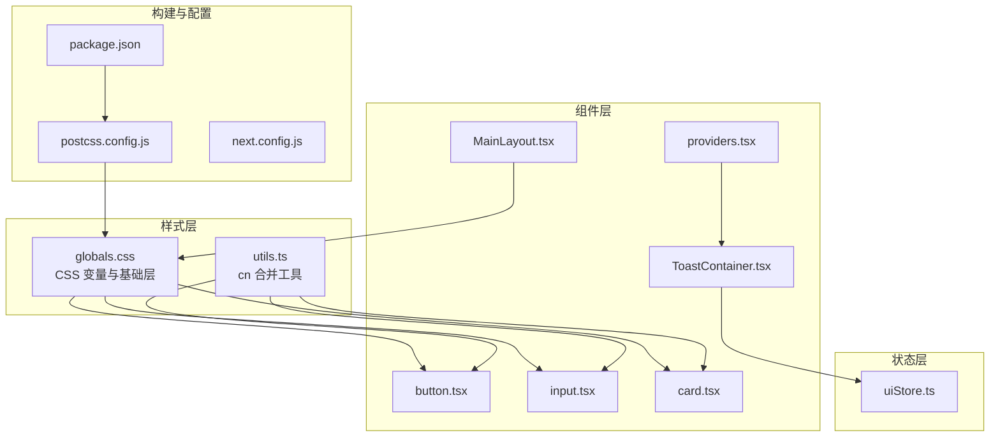
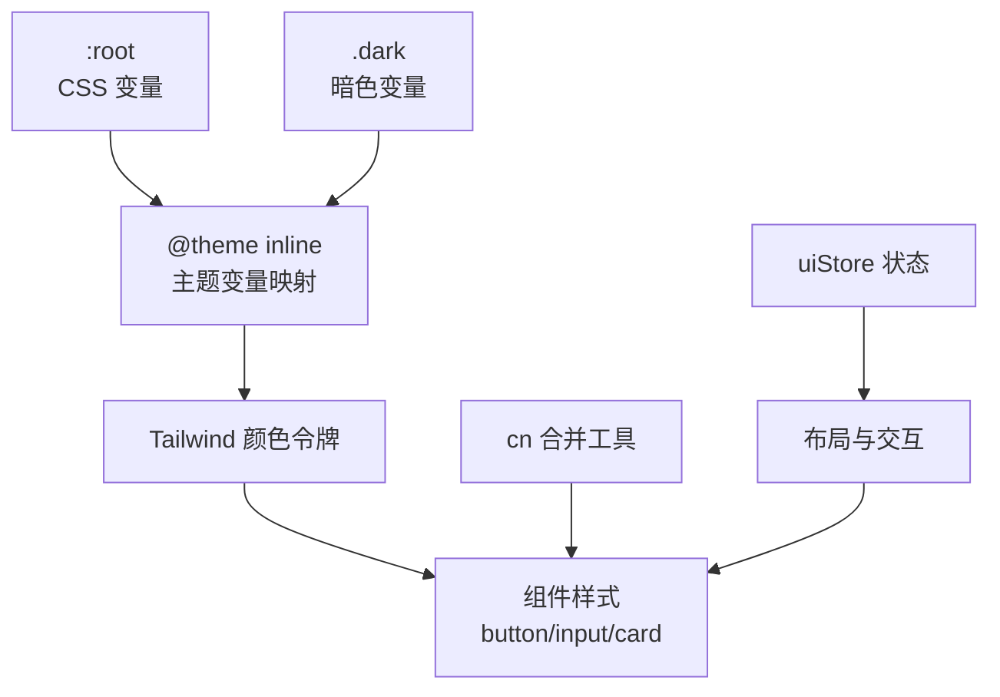
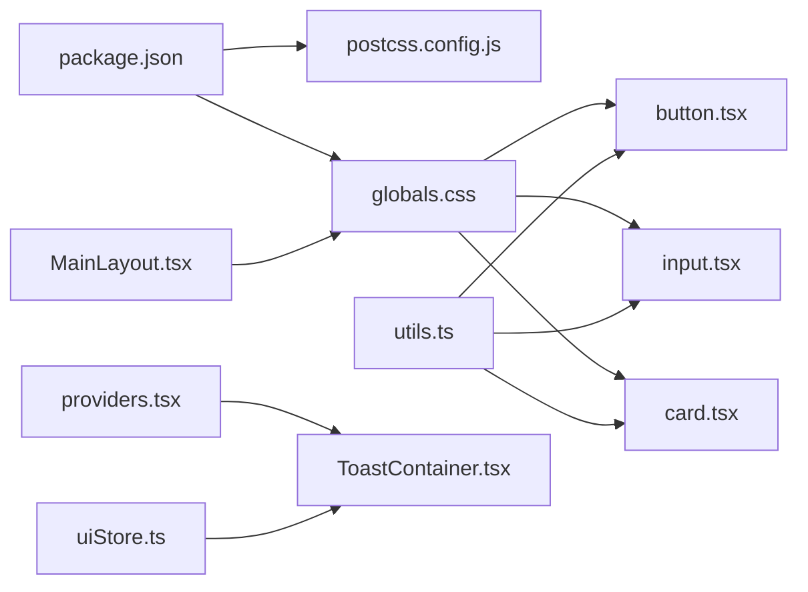

# 样式与主题系统

<cite>
**本文引用的文件**
- [postcss.config.js](file://frontend/postcss.config.js)
- [globals.css](file://frontend/src/app/globals.css)
- [package.json](file://frontend/package.json)
- [button.tsx](file://frontend/src/components/ui/button.tsx)
- [input.tsx](file://frontend/src/components/ui/input.tsx)
- [card.tsx](file://frontend/src/components/ui/card.tsx)
- [utils.ts](file://frontend/src/lib/utils.ts)
- [MainLayout.tsx](file://frontend/src/components/layout/MainLayout.tsx)
- [providers.tsx](file://frontend/src/app/providers.tsx)
- [ToastContainer.tsx](file://frontend/src/components/ui/ToastContainer.tsx)
- [uiStore.ts](file://frontend/src/stores/uiStore.ts)
- [next.config.js](file://frontend/next.config.js)
</cite>

## 更新摘要
**所做更改**
- 删除了 tailwind.config.ts 相关内容，反映了从传统 TailwindCSS 配置系统到 CSS-first 方法论的迁移
- 更新了样式配置架构，采用 @theme inline 和 @tailwindcss/postcss 插件的新方法
- 重新组织了样式系统文档结构，移除了与旧配置相关的章节
- 更新了构建流程和依赖关系分析

## 目录
1. [简介](#简介)
2. [项目结构](#项目结构)
3. [核心组件](#核心组件)
4. [架构总览](#架构总览)
5. [详细组件分析](#详细组件分析)
6. [依赖关系分析](#依赖关系分析)
7. [性能考量](#性能考量)
8. [故障排查指南](#故障排查指南)
9. [结论](#结论)
10. [附录](#附录)

## 简介
本文件系统化梳理 InvestRing 前端的样式与主题系统，重点覆盖以下方面：
- TailwindCSS v4 的 CSS-first 配置与定制化策略
- shadcn/ui 组件库的集成与主题定制方法
- CSS 变量与颜色系统的使用规范
- 暗色模式与主题切换的实现机制
- 样式组织原则与 CSS 模块化策略
- 组件样式复用与样式继承的最佳实践
- 样式性能优化与 CSS-in-JS 替代方案
- 样式调试工具与开发工作流优化

**更新** 本版本反映了从传统 TailwindCSS 配置系统到 CSS-first 方法论的重大迁移，删除了 tailwind.config.ts 并采用新的样式组织方式。

## 项目结构
前端样式与主题系统主要由以下部分组成：
- TailwindCSS v4 CSS-first 配置与 PostCSS 流水线
- 全局样式与 CSS 变量定义
- shadcn/ui 风格的原子化组件库
- 工具函数与样式合并策略
- 布局容器与全局提供者
- 主题状态管理与 Toast 通知系统

**图表来源**
- [postcss.config.js:1-6](file://frontend/postcss.config.js#L1-L6)
- [globals.css:1-111](file://frontend/src/app/globals.css#L1-L111)
- [utils.ts:1-270](file://frontend/src/lib/utils.ts#L1-L270)
- [button.tsx:1-56](file://frontend/src/components/ui/button.tsx#L1-L56)
- [input.tsx:1-24](file://frontend/src/components/ui/input.tsx#L1-L24)
- [card.tsx:1-79](file://frontend/src/components/ui/card.tsx#L1-L79)
- [MainLayout.tsx:1-41](file://frontend/src/components/layout/MainLayout.tsx#L1-L41)
- [providers.tsx:1-28](file://frontend/src/app/providers.tsx#L1-L28)
- [ToastContainer.tsx:1-77](file://frontend/src/components/ui/ToastContainer.tsx#L1-L77)
- [uiStore.ts:1-85](file://frontend/src/stores/uiStore.ts#L1-L85)
- [next.config.js:1-21](file://frontend/next.config.js#L1-L21)

**章节来源**
- [postcss.config.js:1-6](file://frontend/postcss.config.js#L1-L6)
- [globals.css:1-111](file://frontend/src/app/globals.css#L1-L111)
- [package.json:1-48](file://frontend/package.json#L1-L48)
- [next.config.js:1-21](file://frontend/next.config.js#L1-L21)

## 核心组件
- CSS-first 配置：通过 @theme inline 直接在 CSS 中定义主题变量，无需额外的 tailwind.config.ts 配置文件
- CSS 变量与颜色系统：在根作用域与 .dark 类中定义 HSL 变量，配合 Tailwind 的 hsl(var(--x)) 使用，实现主题切换
- 组件库风格：采用 shadcn/ui 风格的原子化组件，结合 class-variance-authority 定义变体，使用 cn 工具合并类名
- 工具函数：统一的 cn 合并策略，确保条件类名不会重复且顺序合理
- 布局与提供者：主布局容器使用背景变量，全局提供者注入查询客户端与 Toast 容器

**更新** 移除了与 tailwind.config.ts 相关的内容，采用纯 CSS 配置方式

**章节来源**
- [globals.css:3-32](file://frontend/src/app/globals.css#L3-L32)
- [globals.css:34-79](file://frontend/src/app/globals.css#L34-L79)
- [button.tsx:6-33](file://frontend/src/components/ui/button.tsx#L6-L33)
- [utils.ts:8-10](file://frontend/src/lib/utils.ts#L8-L10)
- [MainLayout.tsx:28-39](file://frontend/src/components/layout/MainLayout.tsx#L28-L39)
- [providers.tsx:7-26](file://frontend/src/app/providers.tsx#L7-L26)

## 架构总览
样式与主题系统围绕"CSS 变量驱动 + 原子化组件 + 状态管理"的架构展开：
- CSS 变量驱动：CSS 变量集中于根作用域，Tailwind 通过 @theme inline 直接引用，实现主题切换
- 原子化组件：按钮、输入框、卡片等组件以最小语义单元组合，支持变体与尺寸
- 状态管理：UI 状态（如侧边栏、Toast）通过 Zustand 存储，影响布局与交互反馈
- 构建流水线：@tailwindcss/postcss 插件 + TailwindCSS v4 生成最终样式

**更新** 架构图反映了从传统配置到 CSS-first 的转变

**图表来源**
- [globals.css:36-79](file://frontend/src/app/globals.css#L36-L79)
- [globals.css:8-32](file://frontend/src/app/globals.css#L8-L32)
- [button.tsx:6-33](file://frontend/src/components/ui/button.tsx#L6-L33)
- [utils.ts:8-10](file://frontend/src/lib/utils.ts#L8-L10)
- [uiStore.ts:40-84](file://frontend/src/stores/uiStore.ts#L40-L84)

## 详细组件分析

### CSS-first 配置与定制化策略
- 主题变量：通过 @theme inline 在 CSS 中直接定义颜色变量映射，无需额外配置文件
- 内容扫描：移除了 content 字段，因为 CSS-first 方法不需要内容扫描
- 主题扩展：colors 与 borderRadius 通过 CSS 变量桥接，实现与 CSS 变量一致的主题控制
- 插件：使用 @tailwindcss/postcss 插件处理 CSS-first 配置

最佳实践
- 仅在 @theme inline 中声明实际使用的变量，避免样式膨胀
- 使用 CSS 变量作为单一真实来源，Tailwind 通过 @theme 直接引用

**更新** 完全移除了 tailwind.config.ts 相关内容，采用纯 CSS 配置

**章节来源**
- [globals.css:8-32](file://frontend/src/app/globals.css#L8-L32)
- [postcss.config.js:1-6](file://frontend/postcss.config.js#L1-L6)

### CSS 变量与颜色系统
- 根作用域变量：定义 background、foreground、primary、secondary、muted、accent、destructive、border、input、ring、card 等
- 暗色模式变量：在 .dark 类中重定义上述变量，实现一键切换
- Tailwind 引用：通过 @theme inline 在 theme.extend.colors 中引用变量，保证一致性

使用规范
- 所有颜色使用 --color 与 --color-foreground 对应的配对变量，确保前景对比度
- 圆角半径通过 --radius 控制，保持组件圆角一致性

**章节来源**
- [globals.css:36-79](file://frontend/src/app/globals.css#L36-L79)
- [globals.css:8-32](file://frontend/src/app/globals.css#L8-L32)

### 暗色模式与主题切换机制
- 触发方式：通过在根元素或 html/body 上添加/移除 .dark 类，即可切换到暗色变量集
- 切换时机：可在应用启动时根据系统偏好或用户设置初始化，也可在 UI 中提供切换入口
- 效果范围：所有使用 CSS 变量的组件与 Tailwind 令牌均会随之更新

注意
- 若使用 Next.js 的深色模式，建议在根布局或 App Router 层统一处理类名切换，并持久化用户选择

**章节来源**
- [globals.css:59-79](file://frontend/src/app/globals.css#L59-L79)

### shadcn/ui 集成与组件定制
- 组件风格：采用 class-variance-authority 定义变体与尺寸，使用 cn 合并类名，确保可维护性与一致性
- 卡片组件：以语义化子组件（header/description/title/content/footer）组织，便于复用
- 输入与按钮：基于原子化类名组合，支持禁用、聚焦、悬停等状态

定制方法
- 通过修改 globals.css 中的变量值，即可统一调整主题色板
- 通过扩展 @theme inline 的变量定义，新增自定义令牌，再在组件中使用

**更新** 组件定制方法从 tailwind.config.ts 迁移到 @theme inline

**章节来源**
- [button.tsx:6-33](file://frontend/src/components/ui/button.tsx#L6-L33)
- [input.tsx:7-21](file://frontend/src/components/ui/input.tsx#L7-L21)
- [card.tsx:4-76](file://frontend/src/components/ui/card.tsx#L4-L76)
- [globals.css:8-32](file://frontend/src/app/globals.css#L8-L32)

### 样式组织原则与模块化策略
- 原子化优先：组件内部尽量使用原子化 Tailwind 类，减少自定义 CSS
- 变体与尺寸：通过 class-variance-authority 定义统一变体，避免重复样式
- 工具函数：cn 工具负责类名合并与冲突消除，确保条件类名正确叠加
- 基础层：globals.css 的 @layer base 与自定义 @utility 提供全局基线与通用工具类

**章节来源**
- [button.tsx:6-33](file://frontend/src/components/ui/button.tsx#L6-L33)
- [utils.ts:8-10](file://frontend/src/lib/utils.ts#L8-L10)
- [globals.css:81-99](file://frontend/src/app/globals.css#L81-L99)

### 组件样式复用与继承最佳实践
- 复用：通过 cn 合并与变体组合，实现跨组件的样式复用
- 继承：父容器使用背景变量，子组件继承前景色与对比度，保证一致性
- 可组合：组件通过 className 参数接收外部类名，支持上层覆盖

**章节来源**
- [utils.ts:8-10](file://frontend/src/lib/utils.ts#L8-L10)
- [MainLayout.tsx:28-39](file://frontend/src/components/layout/MainLayout.tsx#L28-L39)
- [card.tsx:10-15](file://frontend/src/components/ui/card.tsx#L10-L15)

### 布局与全局提供者
- 主布局容器：使用背景变量作为页面底色，保证主题切换时整体一致
- 全局提供者：注入 React Query 客户端与 Toast 容器，统一数据获取与提示反馈

**章节来源**
- [MainLayout.tsx:28-39](file://frontend/src/components/layout/MainLayout.tsx#L28-L39)
- [providers.tsx:7-26](file://frontend/src/app/providers.tsx#L7-L26)

### Toast 通知与 UI 状态
- Toast 容器：固定定位在右上角，按类型使用不同边框与背景色
- 状态管理：uiStore 管理 toasts 列表，支持添加、移除与自动清理
- 动画：Toast 使用滑入动画，提升交互体验

**章节来源**
- [ToastContainer.tsx:10-76](file://frontend/src/components/ui/ToastContainer.tsx#L10-L76)
- [uiStore.ts:21-75](file://frontend/src/stores/uiStore.ts#L21-L75)

## 依赖关系分析
- 构建链路：package.json 中声明 tailwindcss v4、@tailwindcss/postcss，postcss.config.js 指定插件配置
- 组件依赖：button/input/card 组件依赖 cn 工具与 CSS 变量；布局依赖全局样式；Toast 依赖 uiStore
- 主题耦合：@theme inline 与 globals.css 的变量定义强关联，任一改动会影响组件外观

**更新** 依赖关系从传统 Tailwind 配置迁移到 CSS-first 方案

**图表来源**
- [package.json:40-46](file://frontend/package.json#L40-L46)
- [postcss.config.js:1-6](file://frontend/postcss.config.js#L1-L6)
- [globals.css:1-111](file://frontend/src/app/globals.css#L1-L111)
- [utils.ts:1-270](file://frontend/src/lib/utils.ts#L1-L270)
- [button.tsx:1-56](file://frontend/src/components/ui/button.tsx#L1-L56)
- [input.tsx:1-24](file://frontend/src/components/ui/input.tsx#L1-L24)
- [card.tsx:1-79](file://frontend/src/components/ui/card.tsx#L1-L79)
- [MainLayout.tsx:1-41](file://frontend/src/components/layout/MainLayout.tsx#L1-L41)
- [providers.tsx:1-28](file://frontend/src/app/providers.tsx#L1-L28)
- [ToastContainer.tsx:1-77](file://frontend/src/components/ui/ToastContainer.tsx#L1-L77)
- [uiStore.ts:1-85](file://frontend/src/stores/uiStore.ts#L1-L85)

**章节来源**
- [package.json:40-46](file://frontend/package.json#L40-L46)
- [postcss.config.js:1-6](file://frontend/postcss.config.js#L1-L6)
- [globals.css:1-111](file://frontend/src/app/globals.css#L1-L111)
- [utils.ts:1-270](file://frontend/src/lib/utils.ts#L1-L270)
- [button.tsx:1-56](file://frontend/src/components/ui/button.tsx#L1-L56)
- [input.tsx:1-24](file://frontend/src/components/ui/input.tsx#L1-L24)
- [card.tsx:1-79](file://frontend/src/components/ui/card.tsx#L1-L79)
- [MainLayout.tsx:1-41](file://frontend/src/components/layout/MainLayout.tsx#L1-L41)
- [providers.tsx:1-28](file://frontend/src/app/providers.tsx#L1-L28)
- [ToastContainer.tsx:1-77](file://frontend/src/components/ui/ToastContainer.tsx#L1-L77)
- [uiStore.ts:1-85](file://frontend/src/stores/uiStore.ts#L1-L85)

## 性能考量
- 按需生成：移除了 content 限定扫描目录的需求，CSS-first 方法更高效
- 类名合并：使用 twMerge 与 clsx 合并类名，减少重复与冲突，降低运行时开销
- 变量驱动：CSS 变量集中管理，避免多处硬编码颜色，便于缓存与复用
- 动画与布局：Toast 使用轻量动画，避免复杂滤镜与阴影导致的重排

**更新** 性能考量反映了 CSS-first 方法的优势

## 故障排查指南
- 样式不生效
  - 检查 globals.css 是否被正确引入（Next 应用通常在根布局中引入）
  - 确认 @theme inline 配置正确，变量名与组件中使用的变量名一致
- 主题切换无效
  - 确认 .dark 类已正确添加到根元素或 html/body
  - 检查 CSS 变量是否在 .dark 中被覆盖
- 类名冲突
  - 使用 cn 工具合并类名，确保条件类名顺序与覆盖逻辑正确
- 构建异常
  - 检查 postcss.config.js 中 @tailwindcss/postcss 插件配置
  - 确保 tailwindcss 版本为 v4 或兼容版本

**更新** 故障排查指南反映了 CSS-first 配置的差异

**章节来源**
- [globals.css:1-3](file://frontend/src/app/globals.css#L1-L3)
- [globals.css:34-35](file://frontend/src/app/globals.css#L34-L35)
- [utils.ts:8-10](file://frontend/src/lib/utils.ts#L8-L10)
- [postcss.config.js:1-6](file://frontend/postcss.config.js#L1-L6)

## 结论
本项目采用"CSS 变量 + @theme inline + 原子化组件"的 CSS-first 样式体系，具备更好的主题一致性与可维护性。通过 cn 工具与变体系统，组件样式复用与定制化得到平衡；借助 Zustand 管理 UI 状态，Toast 与布局反馈清晰可控。CSS-first 方法相比传统配置方式具有更简洁的构建流程和更好的性能表现。建议在后续迭代中：
- 明确主题切换入口与持久化策略
- 扩展 @theme inline 以支持更多自定义令牌
- 逐步沉淀通用工具类至 @utility
- 在大型组件中引入局部样式模块，保持原子化与可读性的平衡

**更新** 结论反映了 CSS-first 方法论的优势和未来发展方向

## 附录

### 样式调试与开发工作流
- 开发阶段：利用浏览器开发者工具检查元素类名与 CSS 变量值，确认主题切换是否生效
- 构建验证：在本地执行构建命令，检查产物大小与关键样式是否按预期生成
- ESLint：遵循现有规则，避免在组件中引入硬编码颜色与冗余类名

**更新** 开发工作流保持不变，但调试重点从 Tailwind 配置转向 CSS 变量

**章节来源**
- [package.json:5-10](file://frontend/package.json#L5-L10)
- [postcss.config.js:1-6](file://frontend/postcss.config.js#L1-L6)
- [globals.css:1-111](file://frontend/src/app/globals.css#L1-L111)