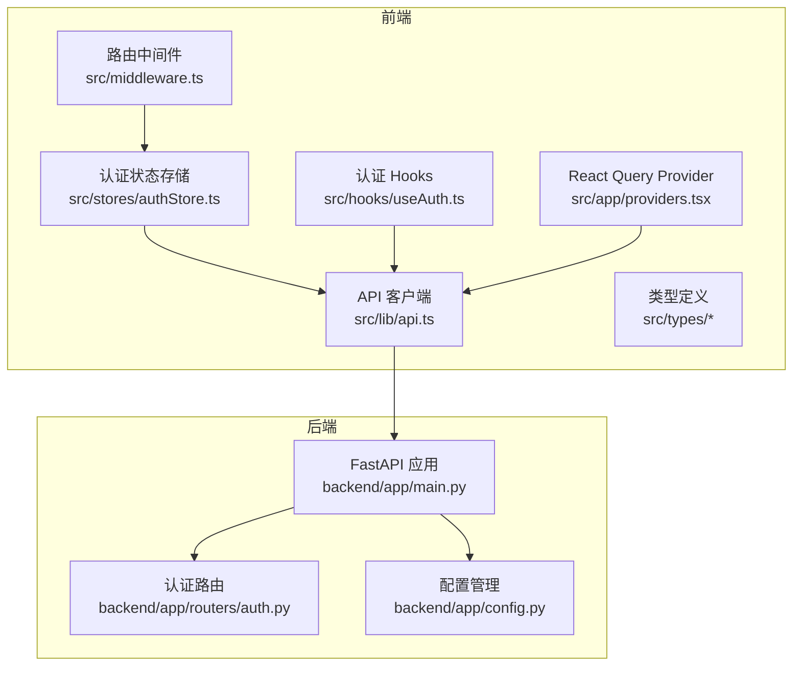
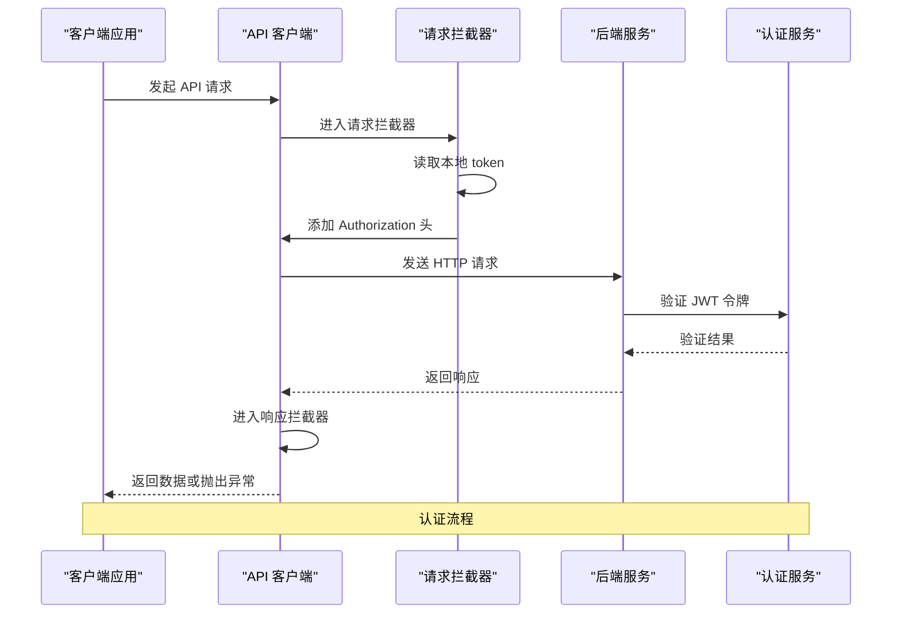
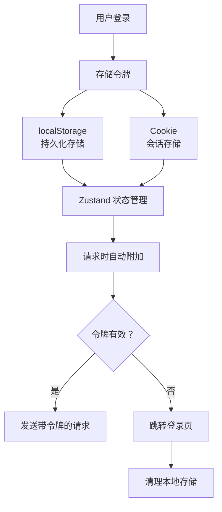
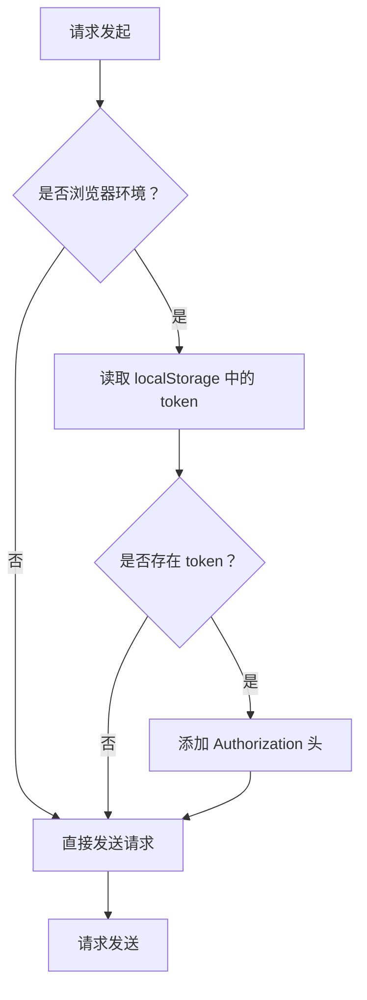
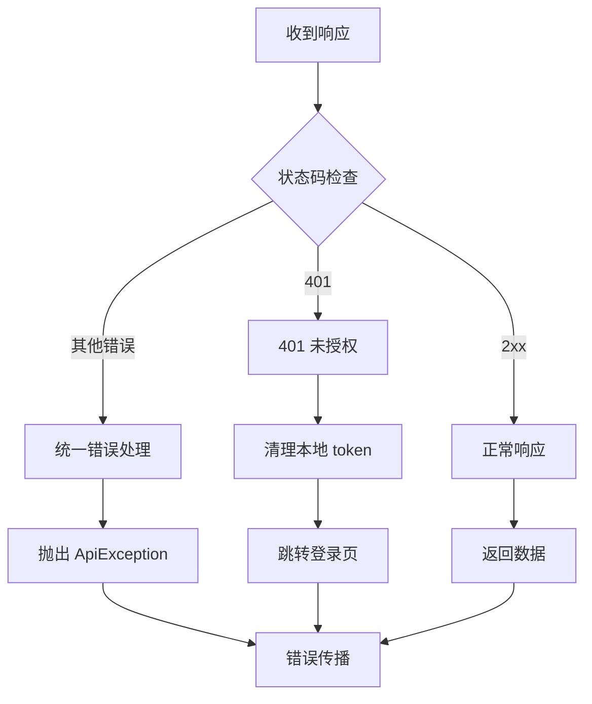
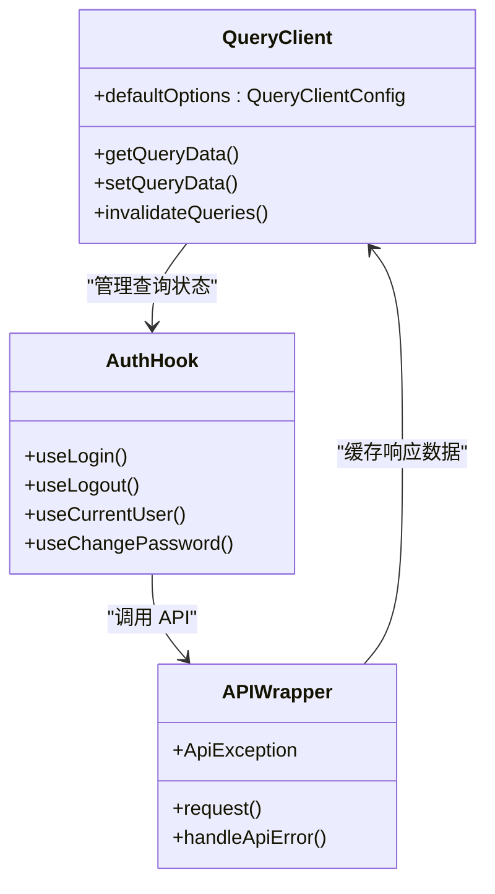
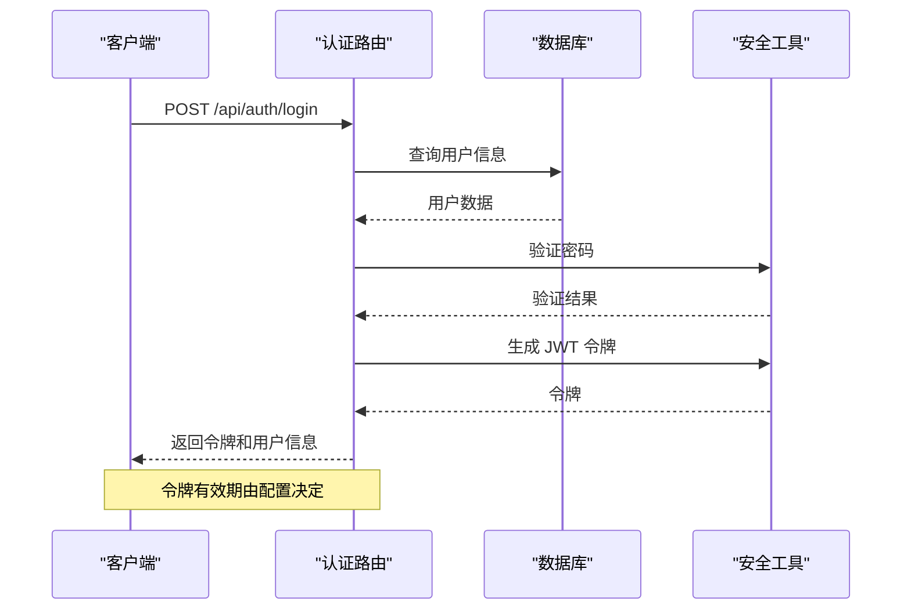
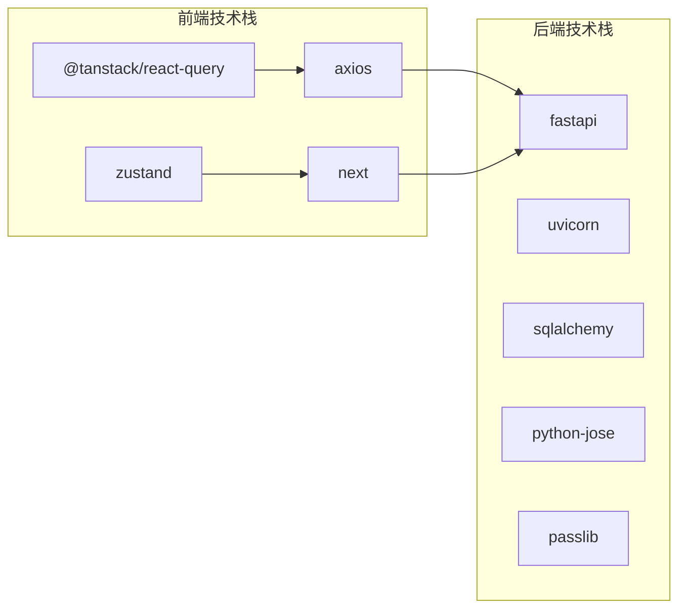

# API 客户端设计

<cite>
**本文档引用的文件**
- [frontend/src/lib/api.ts](file://frontend/src/lib/api.ts)
- [frontend/src/stores/authStore.ts](file://frontend/src/stores/authStore.ts)
- [frontend/src/hooks/useAuth.ts](file://frontend/src/hooks/useAuth.ts)
- [frontend/src/types/auth.ts](file://frontend/src/types/auth.ts)
- [frontend/src/types/common.ts](file://frontend/src/types/common.ts)
- [frontend/src/stores/uiStore.ts](file://frontend/src/stores/uiStore.ts)
- [frontend/src/app/providers.tsx](file://frontend/src/app/providers.tsx)
- [frontend/src/middleware.ts](file://frontend/src/middleware.ts)
- [backend/app/main.py](file://backend/app/main.py)
- [backend/app/routers/auth.py](file://backend/app/routers/auth.py)
- [backend/app/config.py](file://backend/app/config.py)
- [frontend/package.json](file://frontend/package.json)
- [backend/requirements.txt](file://backend/requirements.txt)
</cite>

## 目录
1. [简介](#简介)
2. [项目结构](#项目结构)
3. [核心组件](#核心组件)
4. [架构概览](#架构概览)
5. [详细组件分析](#详细组件分析)
6. [依赖分析](#依赖分析)
7. [性能考虑](#性能考虑)
8. [故障排除指南](#故障排除指南)
9. [结论](#结论)
10. [附录](#附录)

## 简介

InvestRing 项目采用前后端分离架构，前端使用 Next.js + TypeScript + React Query 构建，后端使用 FastAPI 提供 RESTful API 服务。本设计文档专注于前端 API 客户端的设计与实现，涵盖 HTTP 客户端封装、请求/响应拦截器、错误处理机制、认证令牌管理、重试策略、超时配置、并发控制以及最佳实践等内容。

## 项目结构

前端项目采用按功能模块组织的结构，API 客户端位于 `src/lib/api.ts`，认证状态管理位于 `src/stores/authStore.ts`，认证相关的 React Hooks 位于 `src/hooks/useAuth.ts`，类型定义位于 `src/types/` 目录下。

**图表来源**
- [frontend/src/lib/api.ts:1-627](file://frontend/src/lib/api.ts#L1-L627)
- [frontend/src/stores/authStore.ts:1-71](file://frontend/src/stores/authStore.ts#L1-L71)
- [frontend/src/hooks/useAuth.ts:1-134](file://frontend/src/hooks/useAuth.ts#L1-L134)
- [backend/app/main.py:1-53](file://backend/app/main.py#L1-L53)
- [backend/app/routers/auth.py:1-186](file://backend/app/routers/auth.py#L1-L186)

**章节来源**
- [frontend/src/lib/api.ts:1-627](file://frontend/src/lib/api.ts#L1-L627)
- [backend/app/main.py:1-53](file://backend/app/main.py#L1-L53)

## 核心组件

### HTTP 客户端实例

项目基于 Axios 创建了统一的 HTTP 客户端实例，配置了基础 URL、请求头和超时时间：

- 基础 URL：从环境变量 `NEXT_PUBLIC_API_URL` 获取，默认为 `/api`
- Content-Type：固定为 `application/json`
- 超时时间：30000ms（30秒）

### 拦截器体系

实现了完整的请求和响应拦截器：

**请求拦截器**：
- 自动从 localStorage 读取 token
- 在客户端环境为每个请求添加 Authorization 头
- 支持服务端渲染场景的环境检测

**响应拦截器**：
- 统一错误处理
- 401 状态码时自动清理本地 token 并跳转到登录页
- 保持错误链路的完整性

### 错误处理机制

提供了专门的异常类和错误处理函数：

- `ApiException`：自定义异常类，包含错误码、状态码和消息
- `handleApiError`：统一错误处理函数，支持 Axios 错误和普通错误
- 返回标准的错误对象，便于上层处理

### API 接口分层

按照业务模块划分了多个 API 对象：

- 认证模块：登录、修改密码、获取当前用户
- 投资人管理：列表、详情、创建、更新、删除
- 组合管理：列表、详情、创建、更新、激活/关闭、快照查询
- 持仓管理：列表、最新持仓、创建、更新、现金仓位更新、归因分析
- 申购赎回：列表、详情、创建、确认、取消
- 调仓交易：列表、详情、创建、更新、确认、取消、批量调仓
- 产品管理：列表、详情、创建、更新、删除、价格数据同步
- 平台管理：列表、详情、创建、更新、删除
- 系统管理：交易日历、数据源配置
- 日志与任务：登录日志、审计日志、错误日志、任务管理
- 快照管理：单日生成、区间重算、预检验证、状态查询、删除
- 份额变动事件：列表、详情、创建、更新、确认、取消、删除

**章节来源**
- [frontend/src/lib/api.ts:41-117](file://frontend/src/lib/api.ts#L41-L117)
- [frontend/src/lib/api.ts:119-627](file://frontend/src/lib/api.ts#L119-L627)

## 架构概览

**图表来源**
- [frontend/src/lib/api.ts:50-79](file://frontend/src/lib/api.ts#L50-L79)
- [backend/app/routers/auth.py:29-95](file://backend/app/routers/auth.py#L29-L95)

## 详细组件分析

### 认证令牌管理

#### 令牌存储策略

项目实现了多层令牌存储机制：

**图表来源**
- [frontend/src/stores/authStore.ts:37-51](file://frontend/src/stores/authStore.ts#L37-L51)
- [frontend/src/lib/api.ts:50-65](file://frontend/src/lib/api.ts#L50-L65)

#### 认证状态管理

使用 Zustand 实现轻量级状态管理：

- 支持持久化存储（localStorage + cookie）
- 提供登录、登出、用户信息设置等操作
- 自动同步 token 和用户状态

**章节来源**
- [frontend/src/stores/authStore.ts:18-71](file://frontend/src/stores/authStore.ts#L18-L71)
- [frontend/src/hooks/useAuth.ts:11-36](file://frontend/src/hooks/useAuth.ts#L11-L36)

### 请求拦截器实现

请求拦截器的核心功能包括：

1. **环境检测**：仅在浏览器环境中读取 token
2. **令牌注入**：自动为每个请求添加 Authorization 头
3. **错误处理**：拦截请求阶段的错误并返回

**图表来源**
- [frontend/src/lib/api.ts:50-65](file://frontend/src/lib/api.ts#L50-L65)

**章节来源**
- [frontend/src/lib/api.ts:50-65](file://frontend/src/lib/api.ts#L50-L65)

### 响应拦截器与错误处理

响应拦截器实现了统一的错误处理策略：

**图表来源**
- [frontend/src/lib/api.ts:67-79](file://frontend/src/lib/api.ts#L67-L79)
- [frontend/src/lib/api.ts:94-107](file://frontend/src/lib/api.ts#L94-L107)

#### 异常类设计

`ApiException` 类提供了结构化的错误信息：

- `code`：错误码，来源于后端 API 错误详情
- `status`：HTTP 状态码
- `message`：错误描述信息
- 继承自 Error，保持与 JavaScript 标准异常兼容

**章节来源**
- [frontend/src/lib/api.ts:82-107](file://frontend/src/lib/api.ts#L82-L107)

### React Query 集成

项目使用 React Query 进行数据缓存和状态管理：

**图表来源**
- [frontend/src/app/providers.tsx:8-19](file://frontend/src/app/providers.tsx#L8-L19)
- [frontend/src/hooks/useAuth.ts:11-94](file://frontend/src/hooks/useAuth.ts#L11-L94)

#### 查询配置

- 默认过期时间：30 秒
- 窗口焦点时不自动重新获取
- 失败重试：1 次
- 支持查询键值管理

**章节来源**
- [frontend/src/app/providers.tsx:8-19](file://frontend/src/app/providers.tsx#L8-L19)
- [frontend/src/hooks/useAuth.ts:61-70](file://frontend/src/hooks/useAuth.ts#L61-L70)

### 后端认证流程

后端使用 FastAPI 和 JWT 实现认证：

**图表来源**
- [backend/app/routers/auth.py:29-95](file://backend/app/routers/auth.py#L29-L95)
- [backend/app/config.py:14-16](file://backend/app/config.py#L14-L16)

**章节来源**
- [backend/app/routers/auth.py:29-95](file://backend/app/routers/auth.py#L29-L95)
- [backend/app/config.py:14-16](file://backend/app/config.py#L14-L16)

## 依赖分析

### 前端依赖

项目的关键依赖包括：

- **axios**：HTTP 客户端库，提供请求/响应拦截器功能
- **@tanstack/react-query**：数据获取和状态管理
- **zustand**：轻量级状态管理库
- **next**：React 框架，提供 SSR 和路由功能

### 后端依赖

后端使用 FastAPI 生态系统：

- **fastapi**：Web 框架
- **uvicorn**：ASGI 服务器
- **sqlalchemy**：ORM 框架
- **python-jose**：JWT 令牌处理
- **passlib**：密码哈希

**图表来源**
- [frontend/package.json:24](file://frontend/package.json#L24)
- [backend/requirements.txt:1](file://backend/requirements.txt#L1)

**章节来源**
- [frontend/package.json:11-38](file://frontend/package.json#L11-L38)
- [backend/requirements.txt:1-19](file://backend/requirements.txt#L1-L19)

## 性能考虑

### 缓存策略

- **查询缓存**：React Query 默认 30 秒过期时间
- **状态持久化**：Zustand 支持本地存储，减少重复请求
- **智能失效**：操作成功后主动失效相关查询

### 并发控制

- **请求去重**：React Query 自动处理重复查询
- **并发限制**：通过查询键值避免不必要的重复请求
- **内存管理**：合理设置过期时间和缓存大小

### 网络优化

- **超时控制**：30 秒全局超时设置
- **错误重试**：默认重试 1 次
- **连接复用**：Axios 实例复用 HTTP 连接

## 故障排除指南

### 常见问题诊断

#### 401 未授权错误

当出现 401 错误时，系统会自动：
1. 清理本地存储的 token
2. 跳转到登录页面
3. 阻止后续请求

#### 网络连接问题

可能的原因包括：
- 后端服务未启动
- CORS 配置不正确
- 网络连接中断
- 代理配置错误

#### 认证状态异常

解决方案：
- 检查 localStorage 中的 token 是否存在
- 验证 token 是否过期
- 确认后端 JWT 密钥配置正确
- 检查用户角色权限

**章节来源**
- [frontend/src/lib/api.ts:67-79](file://frontend/src/lib/api.ts#L67-L79)
- [frontend/src/stores/authStore.ts:45-51](file://frontend/src/stores/authStore.ts#L45-L51)

### 调试技巧

1. **启用开发模式**：查看详细的错误堆栈信息
2. **检查网络面板**：观察请求和响应详情
3. **验证令牌**：使用 JWT 解码工具检查 token 内容
4. **监控查询状态**：使用 React DevTools 检查查询状态

## 结论

InvestRing 项目的 API 客户端设计体现了现代前端开发的最佳实践：

1. **统一的客户端封装**：基于 Axios 的标准化 HTTP 客户端
2. **完善的拦截器体系**：自动化的认证和错误处理
3. **状态管理集成**：与 React Query 和 Zustand 的无缝集成
4. **可扩展的模块化设计**：按业务领域划分的 API 接口
5. **健壮的错误处理**：结构化的异常管理和用户体验

该设计为后续的功能扩展和维护奠定了良好的基础，同时保证了系统的稳定性和可维护性。

## 附录

### API 调用最佳实践

1. **使用统一的 API 客户端**：避免直接使用原生 fetch 或其他 HTTP 库
2. **合理设置缓存策略**：根据数据变化频率选择合适的缓存时间
3. **错误处理标准化**：统一使用 ApiException 进行错误处理
4. **令牌管理自动化**：利用拦截器自动处理认证头
5. **查询键值规范化**：确保查询参数的顺序和格式一致

### 错误恢复策略

1. **自动重试**：对于临时性网络错误进行有限次重试
2. **降级处理**：在网络异常时提供基本功能
3. **用户反馈**：及时向用户展示错误信息和恢复选项
4. **日志记录**：记录详细的错误信息用于调试

### 离线支持方案

虽然当前实现主要面向在线场景，但可以考虑以下扩展：
1. **Service Worker**：实现基础的离线缓存
2. **IndexedDB**：持久化存储关键数据
3. **同步队列**：离线操作排队，网络恢复后同步
4. **冲突解决**：处理离线期间的数据冲突