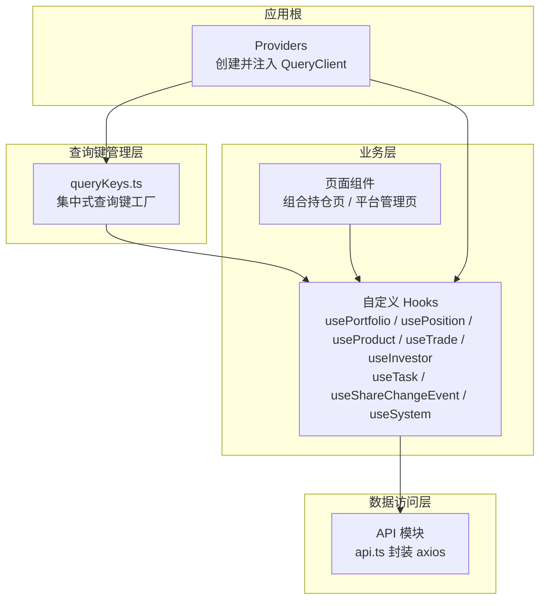
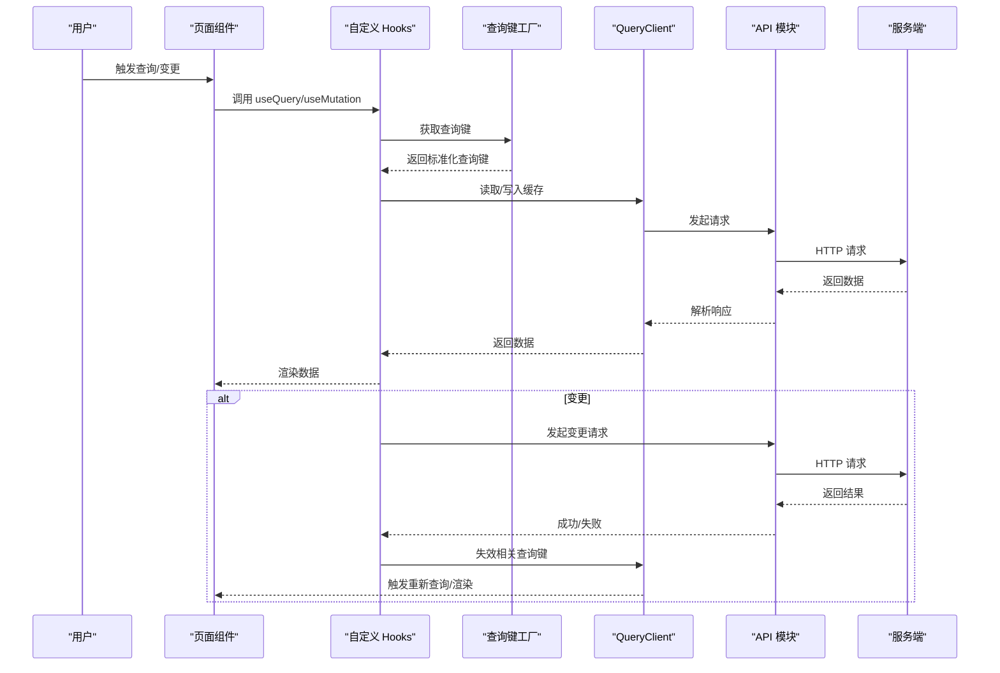
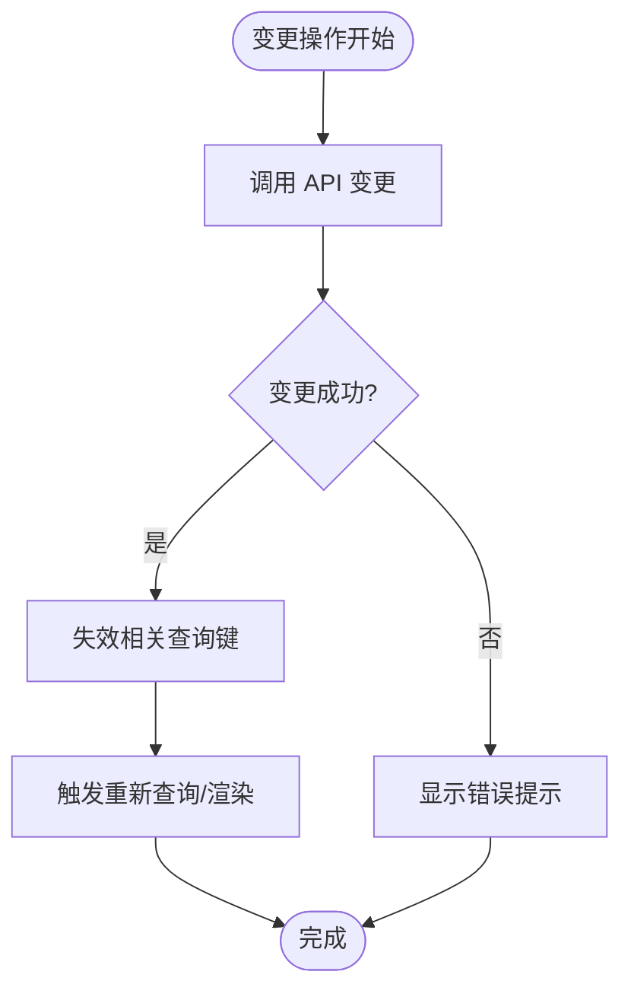
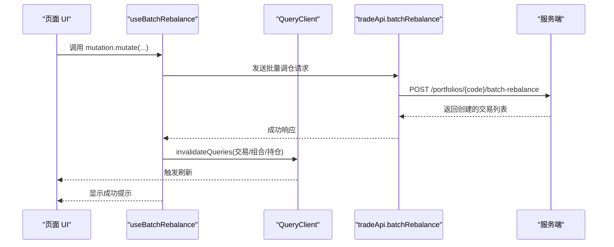
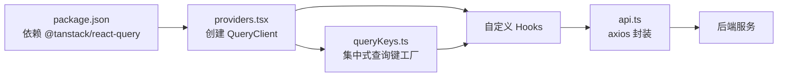

# React Query 集成

<cite>
**本文引用的文件**
- [providers.tsx](file://frontend/src/app/providers.tsx)
- [queryKeys.ts](file://frontend/src/lib/queryKeys.ts)
- [useTask.ts](file://frontend/src/hooks/useTask.ts)
- [useShareChangeEvent.ts](file://frontend/src/hooks/useShareChangeEvent.ts)
- [useSystem.ts](file://frontend/src/hooks/useSystem.ts)
- [package.json](file://frontend/package.json)
- [api.ts](file://frontend/src/lib/api.ts)
- [usePortfolio.ts](file://frontend/src/hooks/usePortfolio.ts)
- [usePosition.ts](file://frontend/src/hooks/usePosition.ts)
- [useProduct.ts](file://frontend/src/hooks/useProduct.ts)
- [useTrade.ts](file://frontend/src/hooks/useTrade.ts)
- [useInvestor.ts](file://frontend/src/hooks/useInvestor.ts)
- [page.tsx（组合持仓页）](file://frontend/src/app/portfolio/[code]/positions/page.tsx)
- [page.tsx（平台管理页）](file://frontend/src/app/platforms/page.tsx)
</cite>

## 更新摘要
**变更内容**
- 新增集中式查询键工厂 queryKeys.ts，统一管理所有查询键定义
- 新增 useTask、useShareChangeEvent、useSystem 三个自定义 Hooks
- 改进了数据获取模式和错误处理机制
- 优化了查询键的组织结构和复用性

## 目录
1. [简介](#简介)
2. [项目结构](#项目结构)
3. [核心组件](#核心组件)
4. [架构总览](#架构总览)
5. [详细组件分析](#详细组件分析)
6. [依赖关系分析](#依赖关系分析)
7. [性能考虑](#性能考虑)
8. [故障排查指南](#故障排查指南)
9. [结论](#结论)
10. [附录](#附录)

## 简介
本文件系统性梳理 InvestRing 前端中基于 @tanstack/react-query 的数据获取与缓存集成实践，覆盖以下主题：
- QueryClient 全局配置与默认行为
- 集中式查询键工厂 queryKeys.ts 的使用模式
- 查询钩子 useQuery 的使用模式与参数配置
- 缓存策略、失效策略与乐观更新思路
- 变更操作 Mutation 的使用与批量更新处理
- 错误处理与重试机制
- 数据同步与状态一致性保障
- 性能优化与内存管理建议

## 项目结构
前端采用 Next.js App Router 架构，React Query 通过应用根组件 Provider 注入，各业务模块通过自定义 hooks 封装查询与变更逻辑，并在页面组件中消费。新增的集中式查询键工厂统一管理所有查询键定义，提升了代码的可维护性和复用性。

**图表来源**
- [providers.tsx:1-28](file://frontend/src/app/providers.tsx#L1-L28)
- [queryKeys.ts:1-100](file://frontend/src/lib/queryKeys.ts#L1-L100)
- [api.ts:1-627](file://frontend/src/lib/api.ts#L1-L627)
- [usePortfolio.ts:1-241](file://frontend/src/hooks/usePortfolio.ts#L1-L241)
- [useTask.ts:1-100](file://frontend/src/hooks/useTask.ts#L1-L100)
- [useShareChangeEvent.ts:1-100](file://frontend/src/hooks/useShareChangeEvent.ts#L1-L100)
- [useSystem.ts:1-100](file://frontend/src/hooks/useSystem.ts#L1-L100)

**章节来源**
- [providers.tsx:1-28](file://frontend/src/app/providers.tsx#L1-L28)
- [package.json:1-45](file://frontend/package.json#L1-L45)

## 核心组件
- QueryClientProvider 与默认配置
  - 在应用根组件中创建并注入 QueryClient，设置全局查询默认项：staleTime、refetchOnWindowFocus、retry。
  - 该配置对所有 useQuery/useMutation 生效，是统一缓存与重试策略的基础。

- 集中式查询键工厂
  - queryKeys.ts 提供统一的查询键定义和管理，确保查询键的一致性和可维护性。
  - 支持按资源类型组织查询键，便于批量失效和缓存管理。

- 自定义 Hooks
  - 每个业务域提供一组 useQuery/useMutation 组合，封装查询键、查询函数、启用条件、过期时间与变更后的缓存失效策略。
  - 通过 useQueryClient 在变更成功后主动失效相关查询键，确保视图与缓存一致。

- 页面组件
  - 页面直接消费自定义 Hooks，结合表单校验、加载态与错误提示，完成用户交互与数据展示。

**章节来源**
- [providers.tsx:7-27](file://frontend/src/app/providers.tsx#L7-L27)
- [queryKeys.ts:1-100](file://frontend/src/lib/queryKeys.ts#L1-L100)
- [usePortfolio.ts:17-33](file://frontend/src/hooks/usePortfolio.ts#L17-L33)
- [useTask.ts:10-29](file://frontend/src/hooks/useTask.ts#L10-L29)
- [useShareChangeEvent.ts:10-29](file://frontend/src/hooks/useShareChangeEvent.ts#L10-L29)
- [useSystem.ts:10-29](file://frontend/src/hooks/useSystem.ts#L10-L29)

## 架构总览
React Query 在本项目中的作用链路如下：
- 应用启动时创建 QueryClient（含默认查询选项）
- 集中式查询键工厂统一管理所有查询键定义
- 各业务页面通过自定义 Hooks 发起查询或变更
- API 层通过 axios 统一封装请求与错误处理
- 变更成功后通过 useQueryClient 失效相关查询键，触发缓存更新与 UI 刷新

**图表来源**
- [providers.tsx:7-27](file://frontend/src/app/providers.tsx#L7-L27)
- [queryKeys.ts:1-100](file://frontend/src/lib/queryKeys.ts#L1-L100)
- [api.ts:1-627](file://frontend/src/lib/api.ts#L1-L627)
- [usePortfolio.ts:36-58](file://frontend/src/hooks/usePortfolio.ts#L36-L58)
- [useTrade.ts:49-77](file://frontend/src/hooks/useTrade.ts#L49-L77)
- [page.tsx（组合持仓页）:99-118](file://frontend/src/app/portfolio/[code]/positions/page.tsx#L99-L118)

## 详细组件分析

### QueryClient 配置与全局设置
- 默认查询选项
  - staleTime：缓存被视为"新鲜"的时间窗口，超过该时间视为陈旧但仍可显示，用于减少不必要的网络请求。
  - refetchOnWindowFocus：窗口焦点变化时不自动刷新，避免频繁网络抖动。
  - retry：失败重试次数，降低瞬时网络波动对用户体验的影响。
- 适用范围
  - 以上默认值对所有 useQuery/useMutation 生效，可在具体 Hook 中按需覆盖。

**章节来源**
- [providers.tsx:8-19](file://frontend/src/app/providers.tsx#L8-L19)

### 集中式查询键工厂
- 查询键组织结构
  - 使用模块化方式组织查询键，按资源类型分组管理。
  - 支持动态参数生成，确保查询键的唯一性和可失效性。
- 查询键命名规范
  - 采用层级结构：`[resource, subresource, params]`
  - 示例：`['portfolios', 'list']`、`['portfolios', code, 'details']`
- 最佳实践
  - 所有查询键必须通过工厂函数生成，避免硬编码。
  - 支持批量失效和精准失效操作。

**章节来源**
- [queryKeys.ts:1-100](file://frontend/src/lib/queryKeys.ts#L1-L100)

### 查询钩子 useQuery 使用模式与参数配置
- 查询键（queryKey）
  - 通过集中式工厂函数获取标准化的查询键。
  - 以数组形式组织，包含资源标识、子资源、分页参数等，确保唯一性与可失效性。
  - 示例：组合列表、组合详情、最新净值、可用现金、平台列表等均使用明确的查询键。
- 启用条件（enabled）
  - 对于需要依赖路由参数或条件判断的查询，使用 enabled 控制是否发起请求。
- 过期时间（staleTime）
  - 不同业务场景设置不同 staleTime，平衡实时性与性能。
- 加载与错误处理
  - 页面组件根据 isLoading 与错误状态进行 UI 呈现与提示。

**章节来源**
- [usePortfolio.ts:17-33](file://frontend/src/hooks/usePortfolio.ts#L17-L33)
- [useTask.ts:10-29](file://frontend/src/hooks/useTask.ts#L10-L29)
- [useShareChangeEvent.ts:10-29](file://frontend/src/hooks/useShareChangeEvent.ts#L10-L29)
- [useSystem.ts:10-29](file://frontend/src/hooks/useSystem.ts#L10-L29)
- [usePosition.ts:10-29](file://frontend/src/hooks/usePosition.ts#L10-L29)
- [useProduct.ts:15-31](file://frontend/src/hooks/useProduct.ts#L15-L31)
- [useTrade.ts:23-46](file://frontend/src/hooks/useTrade.ts#L23-46)
- [useInvestor.ts:15-31](file://frontend/src/hooks/useInvestor.ts#L15-31)
- [page.tsx（平台管理页）:35-39](file://frontend/src/app/platforms/page.tsx#L35-L39)

### 缓存策略与失效策略
- 缓存策略
  - 通过 queryKey 精准定位缓存条目；对高频访问的数据设置合理的 staleTime。
  - 集中式查询键工厂确保缓存键的一致性和可预测性。
- 失效策略
  - 变更成功后，使用 useQueryClient.invalidateQueries 失效相关查询键，确保后续读取到最新数据。
  - 对于删除类操作，还可使用 removeQueries 清理不再需要的缓存。
- 场景示例
  - 创建/更新组合：同时失效"列表"和"详情"查询键。
  - 创建交易：失效交易列表、组合详情、持仓列表等关联查询键。
  - 更新非净值资产：失效对应组合的持仓查询键。

**图表来源**
- [usePortfolio.ts:40-57](file://frontend/src/hooks/usePortfolio.ts#L40-L57)
- [useTrade.ts:53-77](file://frontend/src/hooks/useTrade.ts#L53-L77)
- [page.tsx（组合持仓页）:121-156](file://frontend/src/app/portfolio/[code]/positions/page.tsx#L121-L156)

**章节来源**
- [usePortfolio.ts:36-58](file://frontend/src/hooks/usePortfolio.ts#L36-L58)
- [useTrade.ts:49-77](file://frontend/src/hooks/useTrade.ts#L49-L77)
- [usePosition.ts:44-62](file://frontend/src/hooks/usePosition.ts#L44-L62)
- [page.tsx（组合持仓页）:121-156](file://frontend/src/app/portfolio/[code]/positions/page.tsx#L121-L156)

### 乐观更新机制
- 当前实现
  - 项目未显式使用 react-query 的 optimistic updates 选项。
- 推荐实践
  - 对于支持幂等的变更（如批量调仓），可在 mutationFn 中先本地更新缓存，再异步同步服务端；若服务端失败则回滚。
  - 幂等键（Idempotency-Key）已在批量调仓接口中使用，有助于服务端去重与一致性保障。
- 注意事项
  - 乐观更新需谨慎处理并发与错误回滚，避免 UI 与服务端状态不一致。

**章节来源**
- [useTrade.ts:168-204](file://frontend/src/hooks/useTrade.ts#L168-L204)
- [api.ts:262-269](file://frontend/src/lib/api.ts#L262-L269)

### Mutation 操作与批量更新处理
- 常规变更
  - 创建/更新/删除：在 onSuccess 中失效相关查询键并提示用户。
- 批量更新
  - 批量调仓：传入 trades 数组与可选幂等键，成功后失效交易列表与组合/持仓相关查询键。
- 错误处理
  - 在 onError 中统一提示错误信息，避免用户困惑。

**图表来源**
- [useTrade.ts:168-204](file://frontend/src/hooks/useTrade.ts#L168-L204)
- [api.ts:262-269](file://frontend/src/lib/api.ts#L262-L269)

**章节来源**
- [useTrade.ts:168-204](file://frontend/src/hooks/useTrade.ts#L168-L204)
- [api.ts:262-269](file://frontend/src/lib/api.ts#L262-L269)

### 错误处理与重试机制
- 重试机制
  - QueryClient 默认 retry=1，对瞬时失败有一定容错能力。
- 错误处理
  - API 层统一拦截 401 并跳转登录；各页面与 Hooks 在 onError 中统一提示。
  - 页面组件对表单输入进行前置校验，减少无效请求。

**章节来源**
- [providers.tsx:11-16](file://frontend/src/app/providers.tsx#L11-L16)
- [api.ts:68-79](file://frontend/src/lib/api.ts#L68-L79)
- [usePortfolio.ts:50-56](file://frontend/src/hooks/usePortfolio.ts#L50-L56)
- [page.tsx（组合持仓页）:194-240](file://frontend/src/app/portfolio/[code]/positions/page.tsx#L194-L240)

### 数据同步与状态一致性
- 关联查询失效
  - 交易确认/取消会失效交易列表、组合详情与持仓列表，确保多处数据一致。
- 查询键命名规范
  - 以资源名+子资源+参数组织，便于精准失效与缓存复用。
- 幂等键
  - 批量调仓使用 Idempotency-Key，避免重复创建交易。

**章节来源**
- [useTrade.ts:110-136](file://frontend/src/hooks/useTrade.ts#L110-L136)
- [useTrade.ts:182-194](file://frontend/src/hooks/useTrade.ts#L182-L194)
- [api.ts:262-269](file://frontend/src/lib/api.ts#L262-L269)

## 依赖关系分析
- React Query 版本
  - 项目依赖 @tanstack/react-query ^5.17.0，具备稳定的查询/变更与缓存管理能力。
- 与 axios 的协作
  - API 层统一拦截请求与响应，处理鉴权与错误，为 React Query 提供稳定的数据源。

**图表来源**
- [package.json:20-20](file://frontend/package.json#L20-L20)
- [providers.tsx:3-3](file://frontend/src/app/providers.tsx#L3-L3)
- [queryKeys.ts:1-100](file://frontend/src/lib/queryKeys.ts#L1-L100)
- [api.ts:1-627](file://frontend/src/lib/api.ts#L1-L627)

**章节来源**
- [package.json:11-45](file://frontend/package.json#L11-L45)
- [providers.tsx:3-3](file://frontend/src/app/providers.tsx#L3-L3)
- [api.ts:1-627](file://frontend/src/lib/api.ts#L1-L627)

## 性能考虑
- 缓存新鲜度控制
  - 为高频读取设置合理 staleTime，避免过度网络请求；对实时性要求高的数据可缩短 staleTime 或禁用。
- 窗口焦点与轮询
  - 关闭 refetchOnWindowFocus，减少不必要的后台刷新；如需定时刷新，建议使用手动 refetch 或外部轮询。
- 查询键设计
  - 将分页、筛选等参数纳入查询键，避免缓存污染；对不需要的参数可省略，减少缓存碎片。
  - 使用集中式查询键工厂确保查询键的一致性和可维护性。
- 批量操作与幂等
  - 使用幂等键进行批量变更，降低重复请求风险；在 UI 上提供加载态与禁用按钮，避免重复提交。
- 内存管理
  - 对长期不使用的查询键可考虑使用 removeQueries 清理；避免在组件卸载后仍保留大量缓存。
- 错误与重试
  - 合理设置 retry 次数与退避策略，避免雪崩效应；对可预期的错误提供友好提示。

## 故障排查指南
- 常见问题
  - 查询未刷新：检查是否正确失效相关查询键；确认查询键是否包含必要参数。
  - 401 未登录：API 层已拦截并跳转登录，确认本地 token 是否存在且有效。
  - 表单提交失败：页面组件已做基础校验，查看 onError 提示与后端返回的错误信息。
- 定位步骤
  - 在页面组件中打印查询状态（isLoading、error）与查询键，核对缓存命中情况。
  - 在 Mutation 的 onSuccess/onError 中输出关键信息，确认失效与提示逻辑。
  - 检查 API 层拦截器与错误处理函数，确保异常被正确包装与抛出。

**章节来源**
- [api.ts:68-79](file://frontend/src/lib/api.ts#L68-L79)
- [page.tsx（组合持仓页）:111-117](file://frontend/src/app/portfolio/[code]/positions/page.tsx#L111-L117)
- [usePortfolio.ts:50-56](file://frontend/src/hooks/usePortfolio.ts#L50-L56)

## 结论
本项目通过在应用根部集中配置 QueryClient，并使用集中式查询键工厂统一管理查询键，在各业务模块封装自定义 Hooks，实现了统一、可维护的数据获取与缓存策略。配合明确的查询键设计、精确的失效策略与完善的错误处理，整体具备良好的性能与一致性表现。新增的 useTask、useShareChangeEvent、useSystem 等自定义 Hooks 进一步丰富了数据获取能力。建议在后续迭代中引入幂等更新与更细粒度的重试策略，进一步提升用户体验与系统稳定性。

## 附录
- 查询键最佳实践
  - 使用数组形式表达层级与参数，例如：["resources", id, "subresource", params]。
  - 对分页、筛选等动态参数务必纳入查询键。
  - 通过集中式工厂函数生成查询键，确保一致性和可维护性。
- 失效策略清单
  - 列表与详情：变更后同时失效列表与详情查询键。
  - 关联资源：变更主资源时，失效其关联的子资源查询键。
- 幂等键使用
  - 对支持幂等的批量操作，传递 Idempotency-Key，避免重复创建。
- 新 Hooks 使用指南
  - useTask：任务管理相关的查询与变更操作。
  - useShareChangeEvent：份额变更事件的数据获取与处理。
  - useSystem：系统级配置和状态管理。