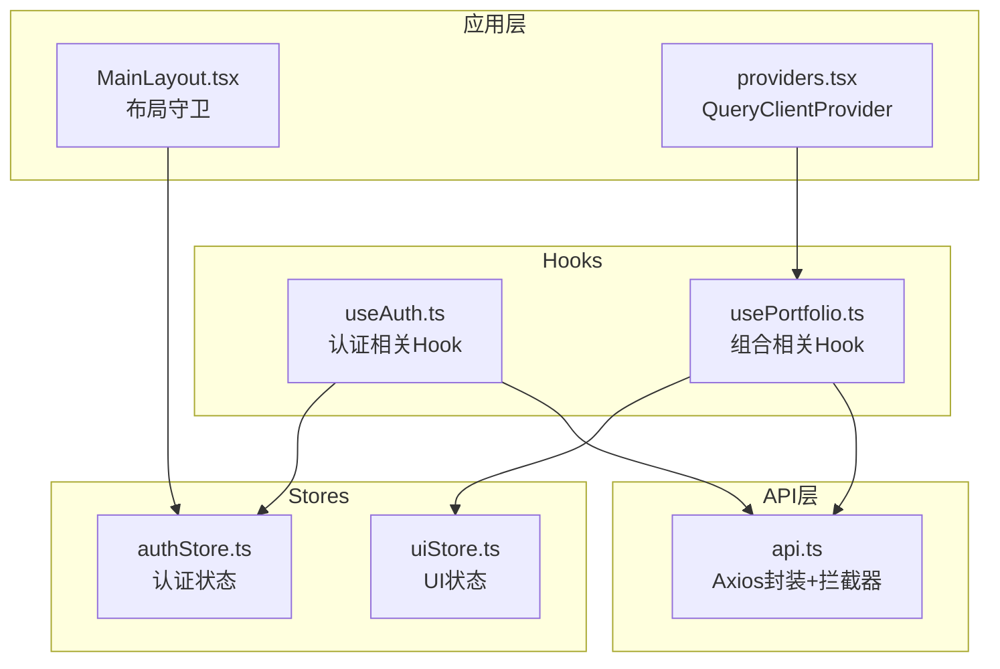
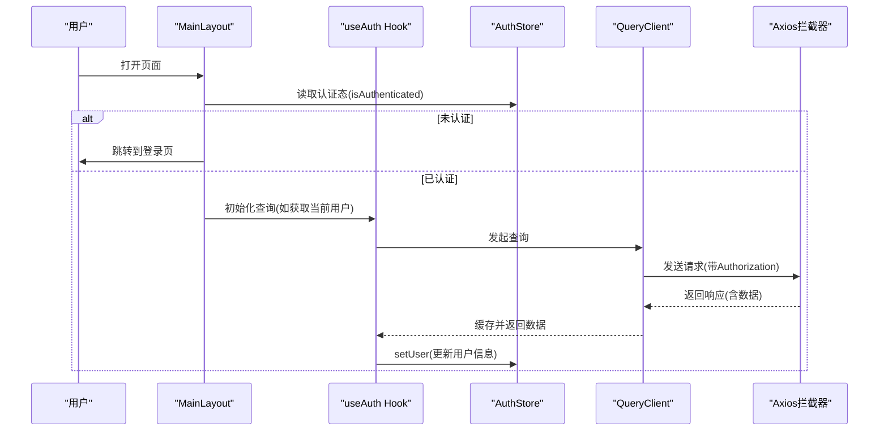
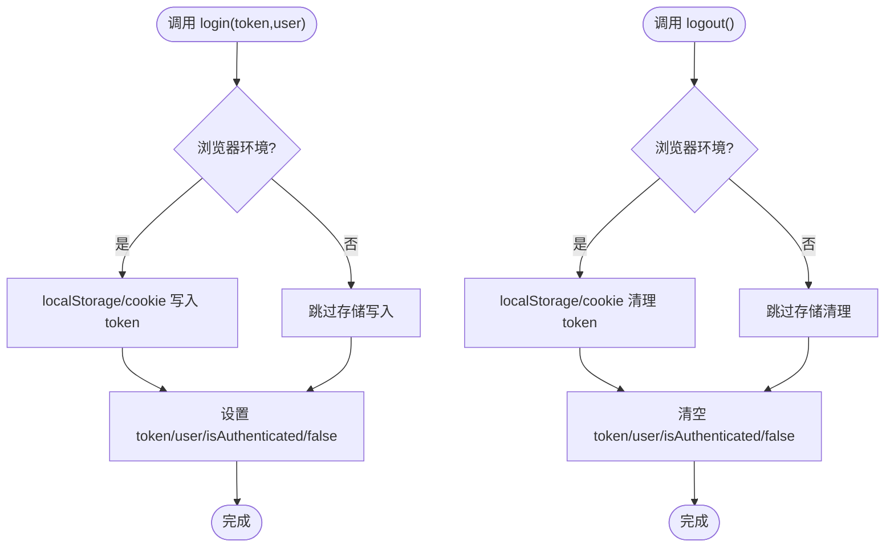
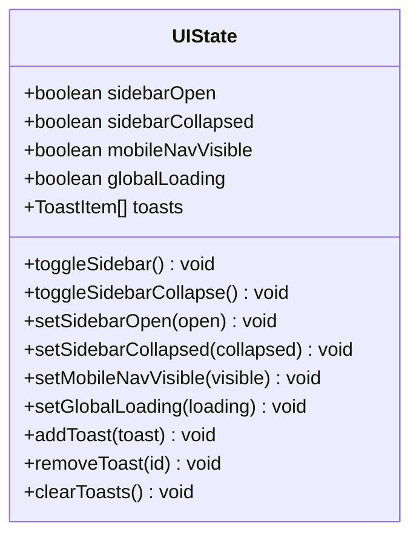
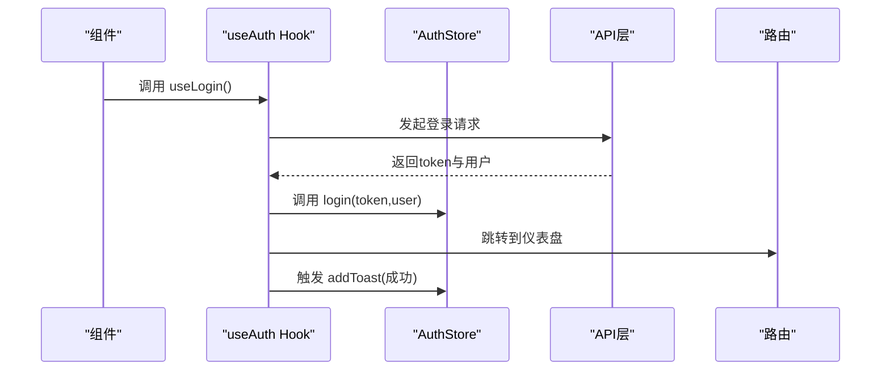
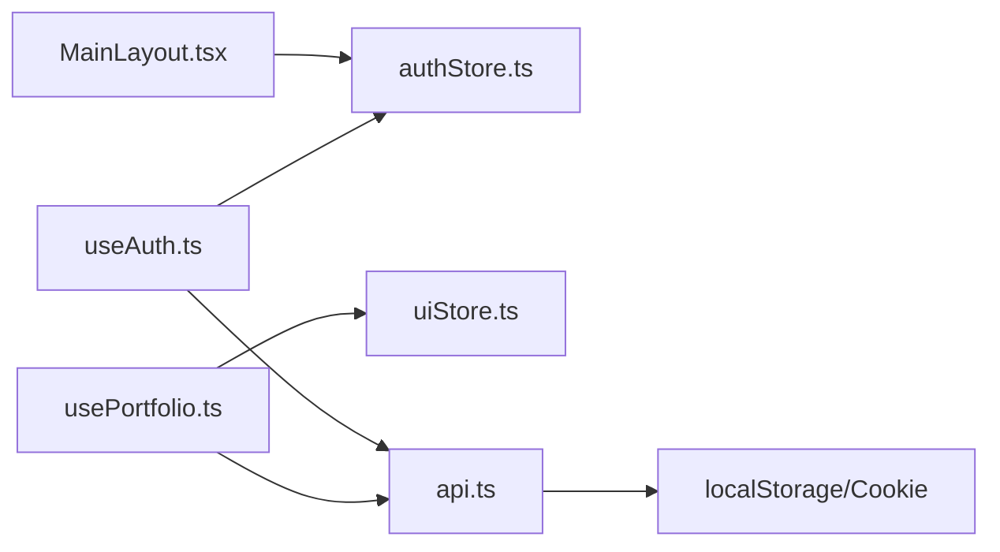

# Zustand Store 设计

<cite>
**本文引用的文件**
- [frontend/src/stores/authStore.ts](file://frontend/src/stores/authStore.ts)
- [frontend/src/stores/uiStore.ts](file://frontend/src/stores/uiStore.ts)
- [frontend/src/hooks/useAuth.ts](file://frontend/src/hooks/useAuth.ts)
- [frontend/src/hooks/usePortfolio.ts](file://frontend/src/hooks/usePortfolio.ts)
- [frontend/src/lib/api.ts](file://frontend/src/lib/api.ts)
- [frontend/src/components/layout/MainLayout.tsx](file://frontend/src/components/layout/MainLayout.tsx)
- [frontend/src/app/providers.tsx](file://frontend/src/app/providers.tsx)
- [frontend/src/types/auth.ts](file://frontend/src/types/auth.ts)
- [frontend/src/types/portfolio.ts](file://frontend/src/types/portfolio.ts)
- [frontend/src/types/common.ts](file://frontend/src/types/common.ts)
</cite>

## 目录
1. [简介](#简介)
2. [项目结构](#项目结构)
3. [核心组件](#核心组件)
4. [架构总览](#架构总览)
5. [详细组件分析](#详细组件分析)
6. [依赖关系分析](#依赖关系分析)
7. [性能考量](#性能考量)
8. [故障排查指南](#故障排查指南)
9. [结论](#结论)
10. [附录](#附录)

## 简介
本设计文档围绕前端 Zustand Store 的创建模式、状态结构设计、动作函数实现、持久化中间件与本地存储策略、状态选择器与订阅机制、Store 间的依赖与通信方式进行系统化梳理，并给出最佳实践建议与常见问题解决方案。文档以 InvestRing 前端工程为背景，重点参考了认证与 UI 状态 Store、配套 Hooks、API 层与布局组件的协作方式。

## 项目结构
前端 Zustand Store 主要位于 stores 目录，配合 hooks 目录中的业务 Hooks 使用；API 层通过 axios 封装并注入认证头；全局提供者负责 QueryClient 与 Toast 容器的装配。

图表来源
- [frontend/src/stores/authStore.ts:1-71](file://frontend/src/stores/authStore.ts#L1-L71)
- [frontend/src/stores/uiStore.ts:1-85](file://frontend/src/stores/uiStore.ts#L1-L85)
- [frontend/src/hooks/useAuth.ts:1-134](file://frontend/src/hooks/useAuth.ts#L1-L134)
- [frontend/src/hooks/usePortfolio.ts:1-241](file://frontend/src/hooks/usePortfolio.ts#L1-L241)
- [frontend/src/lib/api.ts:1-627](file://frontend/src/lib/api.ts#L1-L627)
- [frontend/src/components/layout/MainLayout.tsx:1-41](file://frontend/src/components/layout/MainLayout.tsx#L1-L41)
- [frontend/src/app/providers.tsx:1-28](file://frontend/src/app/providers.tsx#L1-L28)

章节来源
- [frontend/src/stores/authStore.ts:1-71](file://frontend/src/stores/authStore.ts#L1-L71)
- [frontend/src/stores/uiStore.ts:1-85](file://frontend/src/stores/uiStore.ts#L1-L85)
- [frontend/src/hooks/useAuth.ts:1-134](file://frontend/src/hooks/useAuth.ts#L1-L134)
- [frontend/src/hooks/usePortfolio.ts:1-241](file://frontend/src/hooks/usePortfolio.ts#L1-L241)
- [frontend/src/lib/api.ts:1-627](file://frontend/src/lib/api.ts#L1-L627)
- [frontend/src/components/layout/MainLayout.tsx:1-41](file://frontend/src/components/layout/MainLayout.tsx#L1-L41)
- [frontend/src/app/providers.tsx:1-28](file://frontend/src/app/providers.tsx#L1-L28)

## 核心组件
- 认证 Store（authStore）：维护 token、用户信息、认证态与加载态，提供登录、登出、设置用户、设置加载态等动作，并通过 persist 中间件持久化 token 与用户基本信息。
- UI Store（uiStore）：维护侧边栏、移动端导航、全局加载、Toast 列表等 UI 状态，提供切换与设置动作，并通过 persist 中间件持久化侧边栏状态。

章节来源
- [frontend/src/stores/authStore.ts:18-71](file://frontend/src/stores/authStore.ts#L18-L71)
- [frontend/src/stores/uiStore.ts:4-85](file://frontend/src/stores/uiStore.ts#L4-L85)

## 架构总览
Zustand Store 与 React Query、Axios 拦截器协同工作：React Query 负责数据获取与缓存失效；Axios 拦截器自动附加认证头并在 401 时清理本地 token；UI Store 提供 Toast 与全局加载态；布局组件基于认证 Store 进行访问控制。

图表来源
- [frontend/src/components/layout/MainLayout.tsx:10-41](file://frontend/src/components/layout/MainLayout.tsx#L10-L41)
- [frontend/src/hooks/useAuth.ts:56-71](file://frontend/src/hooks/useAuth.ts#L56-L71)
- [frontend/src/lib/api.ts:50-79](file://frontend/src/lib/api.ts#L50-L79)

## 详细组件分析

### 认证 Store（authStore）
- 状态结构
  - token：字符串或空，用于后端鉴权
  - user：用户信息对象或空
  - isAuthenticated：布尔值，表示是否已认证
  - isLoading：布尔值，表示认证流程状态
- 动作函数
  - login：写入本地存储与 Cookie，设置 token、user、isAuthenticated、清除加载态
  - logout：移除本地存储与 Cookie，清空 token、user、isAuthenticated、清除加载态
  - setUser：设置用户信息
  - setLoading：设置加载态
- 持久化策略
  - 使用 persist 中间件，命名空间为“auth-storage”
  - 仅持久化 token、user、isAuthenticated，避免持久化敏感字段
- 本地存储策略
  - 登录时同时写入 localStorage 与 Cookie，保证服务端与客户端均可用
  - 登出时同步清理 localStorage 与 Cookie
- 选择器与订阅
  - 通过 useAuthStore(selector) 在组件中按需订阅状态片段，减少重渲染
- 与 API 层交互
  - Axios 请求拦截器从 localStorage 读取 token 并附加 Authorization 头
  - 响应拦截器在 401 时清理 token 并跳转登录页

图表来源
- [frontend/src/stores/authStore.ts:37-51](file://frontend/src/stores/authStore.ts#L37-L51)
- [frontend/src/stores/authStore.ts:61-69](file://frontend/src/stores/authStore.ts#L61-L69)
- [frontend/src/lib/api.ts:50-79](file://frontend/src/lib/api.ts#L50-L79)

章节来源
- [frontend/src/stores/authStore.ts:18-71](file://frontend/src/stores/authStore.ts#L18-L71)
- [frontend/src/lib/api.ts:50-79](file://frontend/src/lib/api.ts#L50-L79)

### UI Store（uiStore）
- 状态结构
  - sidebarOpen：侧边栏展开状态
  - sidebarCollapsed：侧边栏折叠状态
  - mobileNavVisible：移动端底部导航可见性
  - globalLoading：全局加载态
  - toasts：Toast 列表
- 动作函数
  - toggleSidebar / toggleSidebarCollapse / setSidebarOpen / setSidebarCollapsed：侧边栏状态切换与设置
  - setMobileNavVisible：移动端导航可见性设置
  - setGlobalLoading：全局加载态设置
  - addToast / removeToast / clearToasts：Toast 管理
- 持久化策略
  - 使用 persist 中间件，命名空间为“ui-storage”
  - 仅持久化 sidebarOpen 与 sidebarCollapsed，保持 UI 体验一致性
- 选择器与订阅
  - 通过 useUIStore(selector) 在组件中按需订阅 UI 片段

图表来源
- [frontend/src/stores/uiStore.ts:4-85](file://frontend/src/stores/uiStore.ts#L4-L85)

章节来源
- [frontend/src/stores/uiStore.ts:4-85](file://frontend/src/stores/uiStore.ts#L4-L85)

### Hooks 与 Store 的协作
- useAuth Hook
  - useLogin/useLogout：结合 API 层进行登录/登出，触发 Store 动作与路由跳转
  - useCurrentUser：拉取当前用户信息并写入 Store
  - useAuthGuard：基于认证态进行路由守卫
  - useRoleCheck：基于用户角色进行权限判断
- usePortfolio Hook
  - 与 QueryClient 协同，对组合、持仓、快照等数据进行查询与缓存失效
  - 通过 UI Store 添加 Toast 提示

图表来源
- [frontend/src/hooks/useAuth.ts:12-36](file://frontend/src/hooks/useAuth.ts#L12-L36)
- [frontend/src/stores/authStore.ts:29-71](file://frontend/src/stores/authStore.ts#L29-L71)
- [frontend/src/lib/api.ts:120-129](file://frontend/src/lib/api.ts#L120-L129)

章节来源
- [frontend/src/hooks/useAuth.ts:1-134](file://frontend/src/hooks/useAuth.ts#L1-L134)
- [frontend/src/hooks/usePortfolio.ts:1-241](file://frontend/src/hooks/usePortfolio.ts#L1-L241)

### 类型定义与数据模型
- 认证相关类型：登录请求/响应、用户信息、修改密码请求
- 组合相关类型：组合、创建/更新、净值快照
- 通用类型：分页响应、枚举类型（角色、状态、事件类型等）

章节来源
- [frontend/src/types/auth.ts:1-23](file://frontend/src/types/auth.ts#L1-L23)
- [frontend/src/types/portfolio.ts:1-36](file://frontend/src/types/portfolio.ts#L1-L36)
- [frontend/src/types/common.ts:1-30](file://frontend/src/types/common.ts#L1-L30)

## 依赖关系分析
- 组件依赖 Store：MainLayout 依赖 AuthStore 进行访问控制
- Hooks 依赖 Store：useAuth/usePortfolio 依赖各自 Store 与 API 层
- API 层依赖 Store：Axios 请求拦截器从 localStorage 读取 token
- Provider 依赖 Hooks：Providers 注入 QueryClient 与 Toast 容器

图表来源
- [frontend/src/components/layout/MainLayout.tsx:5-16](file://frontend/src/components/layout/MainLayout.tsx#L5-L16)
- [frontend/src/hooks/useAuth.ts:6-9](file://frontend/src/hooks/useAuth.ts#L6-L9)
- [frontend/src/hooks/usePortfolio.ts:10](file://frontend/src/hooks/usePortfolio.ts#L10)
- [frontend/src/lib/api.ts:50-79](file://frontend/src/lib/api.ts#L50-L79)

章节来源
- [frontend/src/components/layout/MainLayout.tsx:1-41](file://frontend/src/components/layout/MainLayout.tsx#L1-L41)
- [frontend/src/hooks/useAuth.ts:1-134](file://frontend/src/hooks/useAuth.ts#L1-L134)
- [frontend/src/hooks/usePortfolio.ts:1-241](file://frontend/src/hooks/usePortfolio.ts#L1-L241)
- [frontend/src/lib/api.ts:1-627](file://frontend/src/lib/api.ts#L1-L627)

## 性能考量
- 状态选择器与最小订阅
  - 使用选择器仅订阅所需状态片段，降低重渲染频率
  - 示例：useAuthStore(state => state.isAuthenticated)、useUIStore(state => state.sidebarOpen)
- 持久化范围控制
  - 仅持久化必要字段，避免存储冗余与序列化开销
  - 示例：authStore 仅持久化 token、user、isAuthenticated；uiStore 仅持久化侧边栏状态
- 缓存与失效策略
  - QueryClient 的 staleTime、refetchOnWindowFocus、retry 等配置提升用户体验与网络效率
- 不可变更新
  - 使用 set(state => ...) 或 set({...state, ...}) 形式进行浅拷贝更新，避免直接修改引用
- 副作用处理
  - 登录/登出时同步操作 localStorage 与 Cookie，确保前后端一致
  - Axios 拦截器集中处理认证头与 401 跳转，避免分散逻辑

## 故障排查指南
- 登录后仍被重定向到登录页
  - 检查 localStorage 是否写入 token，确认 Axios 请求拦截器是否附加 Authorization 头
  - 确认 useCurrentUser 查询 enabled 条件与 staleTime 设置
- 401 未触发跳转
  - 检查响应拦截器是否正确识别 401 并清理 token
  - 确认浏览器环境判断与路由跳转逻辑
- UI 状态未持久化
  - 检查 persist 配置的 name 与 partialize 是否覆盖目标字段
  - 确认浏览器支持 localStorage 与 Cookie
- Toast 不显示
  - 确认 Providers 中已注入 ToastContainer
  - 检查 useUIStore 的 addToast 调用与 UI 组件渲染

章节来源
- [frontend/src/lib/api.ts:50-79](file://frontend/src/lib/api.ts#L50-L79)
- [frontend/src/stores/authStore.ts:37-51](file://frontend/src/stores/authStore.ts#L37-L51)
- [frontend/src/stores/uiStore.ts:76-83](file://frontend/src/stores/uiStore.ts#L76-L83)
- [frontend/src/app/providers.tsx:7-27](file://frontend/src/app/providers.tsx#L7-L27)

## 结论
本项目采用轻量、直观的 Zustand Store 架构，结合 persist 中间件实现关键状态的持久化，通过选择器与订阅机制优化性能，并与 React Query、Axios 拦截器形成清晰的数据流闭环。认证与 UI 两大 Store 各司其职，配合 Hooks 与布局组件实现访问控制与交互反馈，整体设计简洁、可维护性强。

## 附录
- 最佳实践清单
  - 状态扁平化：避免嵌套深的状态树，拆分为多个小 Store
  - 不可变更新：始终返回新对象或使用浅拷贝更新
  - 副作用隔离：将副作用集中在 Store 动作内部，保持纯函数式更新
  - 选择器优先：使用选择器订阅最小状态集合
  - 持久化审慎：仅持久化必要字段，注意隐私与安全
  - 错误处理：统一错误处理与提示，结合 Toast 与路由跳转
- 常见问题速查
  - token 丢失：检查 localStorage 与 Cookie 同步写入/清理
  - 认证头缺失：确认请求拦截器生效与 enabled 条件
  - 缓存不刷新：合理设置 staleTime 与手动 invalidateQueries