# 状态管理策略

<cite>
**本文引用的文件**
- [authStore.ts](file://frontend/src/stores/authStore.ts)
- [uiStore.ts](file://frontend/src/stores/uiStore.ts)
- [useAuth.ts](file://frontend/src/hooks/useAuth.ts)
- [useDashboardStats.ts](file://frontend/src/hooks/useDashboardStats.ts)
- [useTrade.ts](file://frontend/src/hooks/useTrade.ts)
- [usePortfolio.ts](file://frontend/src/hooks/usePortfolio.ts)
- [usePosition.ts](file://frontend/src/hooks/usePosition.ts)
- [useInvestor.ts](file://frontend/src/hooks/useInvestor.ts)
- [api/index.ts](file://frontend/src/lib/api/index.ts)
- [api/client.ts](file://frontend/src/lib/api/client.ts)
- [api/trade.ts](file://frontend/src/lib/api/trade.ts)
- [api/subscription.ts](file://frontend/src/lib/api/subscription.ts)
- [providers.tsx](file://frontend/src/app/providers.tsx)
- [ToastContainer.tsx](file://frontend/src/components/ui/ToastContainer.tsx)
- [auth.ts](file://frontend/src/types/auth.ts)
- [common.ts](file://frontend/src/types/common.ts)
- [portfolio.ts](file://frontend/src/types/portfolio.ts)
- [position.ts](file://frontend/src/types/position.ts)
- [trade.ts](file://frontend/src/types/trade.ts)
- [subscription.ts](file://frontend/src/types/subscription.ts)
- [page.tsx](file://frontend/src/app/login/page.tsx)
- [page.tsx](file://frontend/src/app/dashboard/page.tsx)
- [MainLayout.tsx](file://frontend/src/components/layout/MainLayout.tsx)
- [package.json](file://frontend/package.json)
</cite>

## 更新摘要
**所做更改**
- 新增 useDashboardStats 自定义 Hook 的详细文档
- 新增 useTrade 自定义 Hook 的完整功能说明
- 更新 API 客户端架构文档，包括模块化 API 设计
- 增强交易和订阅业务状态管理策略
- 完善状态聚合与数据流分析

## 目录
1. [引言](#引言)
2. [项目结构](#项目结构)
3. [核心组件](#核心组件)
4. [架构总览](#架构总览)
5. [详细组件分析](#详细组件分析)
6. [依赖关系分析](#依赖关系分析)
7. [性能考量](#性能考量)
8. [故障排查指南](#故障排查指南)
9. [结论](#结论)
10. [附录](#附录)

## 引言
本文件系统性梳理 InvestRing 前端的状态管理策略，围绕以下目标展开：
- 解释 Zustand 状态管理库的使用模式与 Store 设计原则
- 明确认证状态、UI 状态与业务数据状态的分离策略
- 文档化 React Query 的数据获取与缓存机制（查询配置、缓存策略、错误处理）
- 说明状态持久化与本地存储策略
- 解释状态同步与并发控制机制
- 提供状态管理最佳实践与性能优化建议
- 包含状态调试工具与开发体验提升方案

## 项目结构
前端采用"按职责分层"的组织方式：
- stores：Zustand 状态存储，负责认证与 UI 状态
- hooks：React Query 数据钩子，封装查询与变更逻辑
- lib：API 层，统一请求与响应处理
- app：应用入口与布局，提供 Provider 注入
- components：UI 组件与布局组件
- types：TypeScript 类型定义

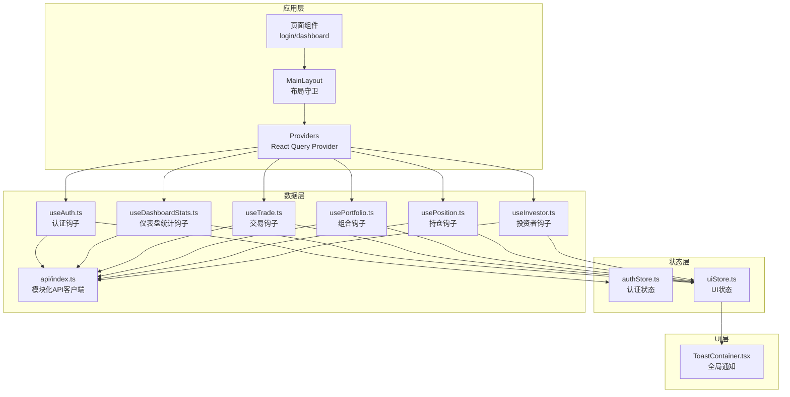

**图表来源**
- [providers.tsx:7-27](file://frontend/src/app/providers.tsx#L7-L27)
- [MainLayout.tsx:10-40](file://frontend/src/components/layout/MainLayout.tsx#L10-L40)
- [authStore.ts:29-70](file://frontend/src/stores/authStore.ts#L29-L70)
- [uiStore.ts:40-84](file://frontend/src/stores/uiStore.ts#L40-L84)
- [useAuth.ts:12-36](file://frontend/src/hooks/useAuth.ts#L12-L36)
- [useDashboardStats.ts:28-66](file://frontend/src/hooks/useDashboardStats.ts#L28-L66)
- [useTrade.ts:14-381](file://frontend/src/hooks/useTrade.ts#L14-L381)
- [usePortfolio.ts:17-23](file://frontend/src/hooks/usePortfolio.ts#L17-L23)
- [usePosition.ts:10-19](file://frontend/src/hooks/usePosition.ts#L10-L19)
- [api/index.ts:1-43](file://frontend/src/lib/api/index.ts#L1-L43)
- [ToastContainer.tsx:7-17](file://frontend/src/components/ui/ToastContainer.tsx#L7-L17)

**章节来源**
- [providers.tsx:7-27](file://frontend/src/app/providers.tsx#L7-L27)
- [authStore.ts:29-70](file://frontend/src/stores/authStore.ts#L29-L70)
- [uiStore.ts:40-84](file://frontend/src/stores/uiStore.ts#L40-L84)
- [useAuth.ts:12-36](file://frontend/src/hooks/useAuth.ts#L12-L36)
- [useDashboardStats.ts:28-66](file://frontend/src/hooks/useDashboardStats.ts#L28-L66)
- [useTrade.ts:14-381](file://frontend/src/hooks/useTrade.ts#L14-L381)
- [usePortfolio.ts:17-23](file://frontend/src/hooks/usePortfolio.ts#L17-L23)
- [usePosition.ts:10-19](file://frontend/src/hooks/usePosition.ts#L10-L19)
- [api/index.ts:1-43](file://frontend/src/lib/api/index.ts#L1-L43)
- [ToastContainer.tsx:7-17](file://frontend/src/components/ui/ToastContainer.tsx#L7-L17)

## 核心组件
- Zustand 认证 Store（authStore.ts）：集中管理 token、用户信息、认证状态与加载状态，并通过持久化中间件实现跨会话保留
- Zustand UI Store（uiStore.ts）：集中管理侧边栏、移动端导航、全局加载与 Toast 通知等 UI 状态
- React Query Provider（providers.tsx）：统一配置查询默认行为（staleTime、refetchOnWindowFocus、retry）
- 模块化 API 客户端（api/index.ts）：按业务域拆分的 API 模块，提供统一的错误处理和类型安全
- 认证钩子（useAuth.ts）：登录、登出、当前用户、修改密码、认证守卫与角色校验
- 仪表盘统计钩子（useDashboardStats.ts）：聚合组合、交易、订阅、投资者数据，计算关键指标
- 交易业务钩子（useTrade.ts）：完整的交易生命周期管理，包括 CRUD、确认、取消等操作
- 业务数据钩子（usePortfolio.ts、usePosition.ts、useInvestor.ts）：组合、持仓、投资者的数据查询、变更与缓存失效策略

**章节来源**
- [authStore.ts:18-70](file://frontend/src/stores/authStore.ts#L18-L70)
- [uiStore.ts:4-84](file://frontend/src/stores/uiStore.ts#L4-L84)
- [providers.tsx:8-19](file://frontend/src/app/providers.tsx#L8-L19)
- [api/index.ts:1-43](file://frontend/src/lib/api/index.ts#L1-L43)
- [useAuth.ts:12-133](file://frontend/src/hooks/useAuth.ts#L12-L133)
- [useDashboardStats.ts:28-66](file://frontend/src/hooks/useDashboardStats.ts#L28-L66)
- [useTrade.ts:14-381](file://frontend/src/hooks/useTrade.ts#L14-L381)
- [usePortfolio.ts:17-241](file://frontend/src/hooks/usePortfolio.ts#L17-L241)
- [usePosition.ts:10-87](file://frontend/src/hooks/usePosition.ts#L10-L87)
- [useInvestor.ts](file://frontend/src/hooks/useInvestor.ts)

## 架构总览
下图展示从页面到状态与数据层的整体交互流程。

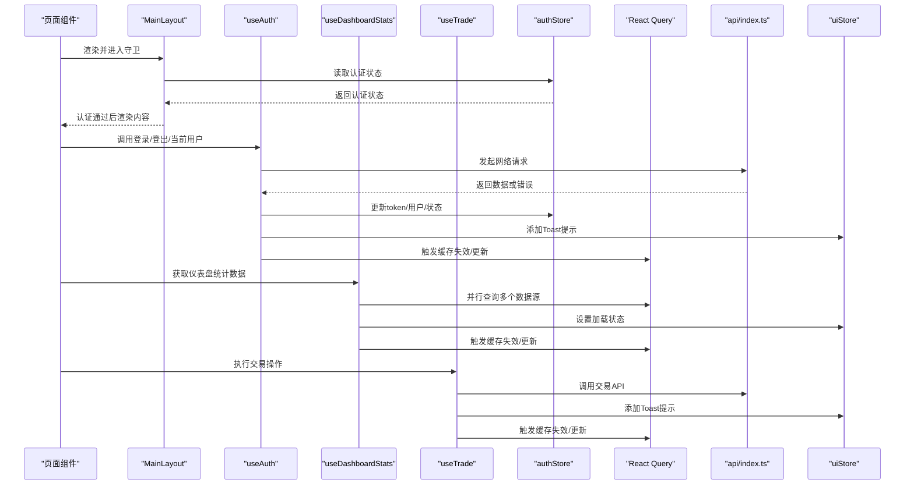

**图表来源**
- [MainLayout.tsx:18-22](file://frontend/src/components/layout/MainLayout.tsx#L18-L22)
- [useAuth.ts:12-36](file://frontend/src/hooks/useAuth.ts#L12-L36)
- [useDashboardStats.ts:28-66](file://frontend/src/hooks/useDashboardStats.ts#L28-L66)
- [useTrade.ts:14-381](file://frontend/src/hooks/useTrade.ts#L14-L381)
- [authStore.ts:37-51](file://frontend/src/stores/authStore.ts#L37-L51)
- [api/index.ts:1-43](file://frontend/src/lib/api/index.ts#L1-L43)
- [providers.tsx:8-19](file://frontend/src/app/providers.tsx#L8-L19)
- [ToastContainer.tsx:7-17](file://frontend/src/components/ui/ToastContainer.tsx#L7-L17)

## 详细组件分析

### Zustand 认证状态管理（authStore.ts）
- 状态模型
  - token：字符串或空，用于鉴权
  - user：用户信息对象
  - isAuthenticated：布尔值，表示是否已认证
  - isLoading：布尔值，表示认证流程状态
- 行为方法
  - login：写入 token 与 cookie，设置用户与认证状态
  - logout：移除 token 与 cookie，清空用户与认证状态
  - setUser：更新用户信息
  - setLoading：切换加载状态
- 持久化策略
  - 使用 persist 中间件，仅持久化 token、user、isAuthenticated
  - 存储键名自定义，避免冗余字段
- Cookie 同步
  - 登录时同时写入 localStorage 与 cookie，保证服务端可用性
  - 登出时同步清理

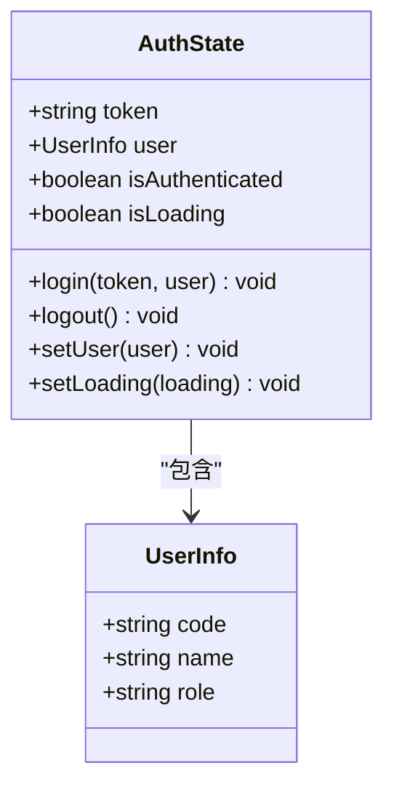

**图表来源**
- [authStore.ts:18-27](file://frontend/src/stores/authStore.ts#L18-L27)
- [auth.ts:12-16](file://frontend/src/types/auth.ts#L12-L16)

**章节来源**
- [authStore.ts:18-70](file://frontend/src/stores/authStore.ts#L18-L70)
- [auth.ts:12-16](file://frontend/src/types/auth.ts#L12-L16)

### Zustand UI 状态管理（uiStore.ts）
- 状态模型
  - 侧边栏：sidebarOpen、sidebarCollapsed
  - 移动端导航：mobileNavVisible
  - 全局加载：globalLoading
  - Toast 列表：toasts，支持添加、移除、清空
- 行为方法
  - toggleSidebar/toggleSidebarCollapse/setSidebarOpen/setSidebarCollapsed
  - setMobileNavVisible
  - setGlobalLoading
  - addToast/removeToast/clearToasts
- 持久化策略
  - 仅持久化 sidebarOpen 与 sidebarCollapsed，保持简洁

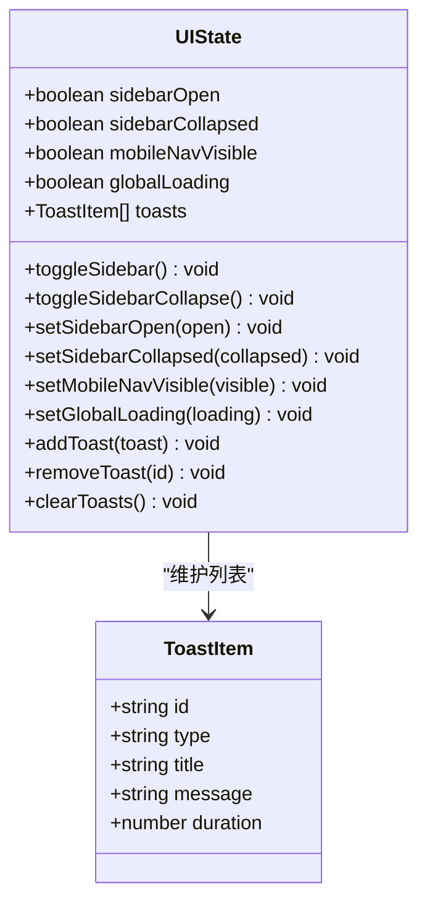

**图表来源**
- [uiStore.ts:4-34](file://frontend/src/stores/uiStore.ts#L4-L34)

**章节来源**
- [uiStore.ts:4-84](file://frontend/src/stores/uiStore.ts#L4-L84)

### React Query Provider 与缓存策略（providers.tsx）
- 默认配置
  - staleTime：30 秒
  - refetchOnWindowFocus：关闭（减少不必要的刷新）
  - retry：1 次
- 作用范围
  - 在应用根部注入，所有页面与钩子共享同一 QueryClient 实例
- 与 Zustand 的协作
  - Mutation 成功后通过 invalidateQueries 触发缓存失效
  - 登出时调用 queryClient.clear() 清空缓存

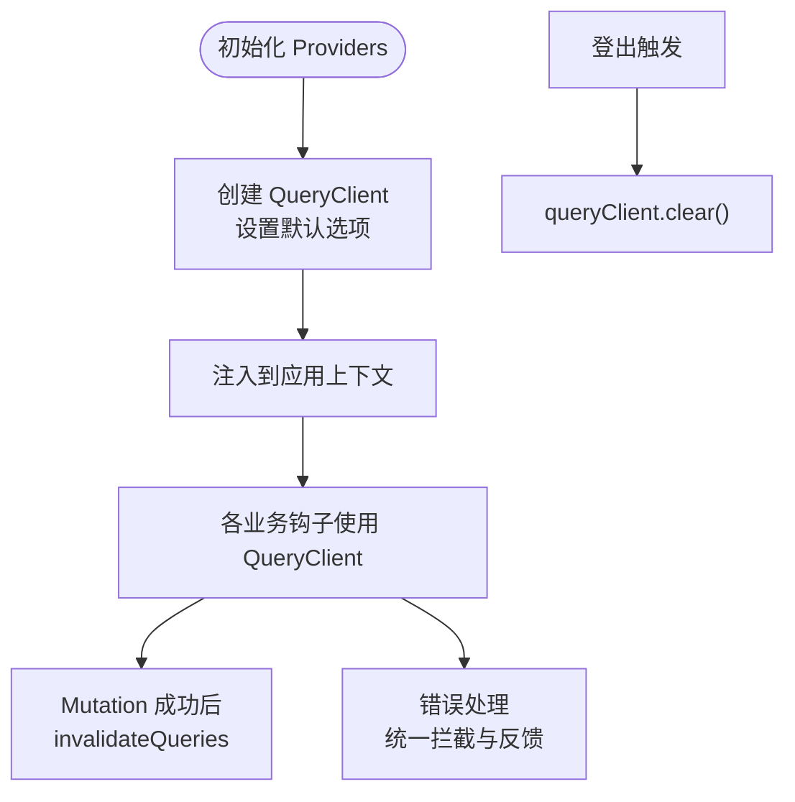

**图表来源**
- [providers.tsx:8-19](file://frontend/src/app/providers.tsx#L8-L19)
- [useAuth.ts:45-53](file://frontend/src/hooks/useAuth.ts#L45-L53)

**章节来源**
- [providers.tsx:8-19](file://frontend/src/app/providers.tsx#L8-L19)
- [useAuth.ts:45-53](file://frontend/src/hooks/useAuth.ts#L45-L53)

### 模块化 API 客户端（api/index.ts）
- 设计理念
  - 按业务域拆分 API 模块，保持向后兼容性
  - 统一的错误处理和类型安全
  - 模块化导入路径，便于维护和扩展
- 核心模块
  - 认证模块：authApi
  - 投资者模块：investorApi
  - 组合模块：portfolioApi、positionApi
  - 交易模块：tradeApi
  - 订阅模块：subscriptionApi
  - 其他业务模块：productApi、platformApi 等

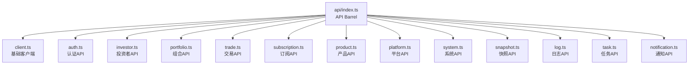

**图表来源**
- [api/index.ts:1-43](file://frontend/src/lib/api/index.ts#L1-L43)
- [api/client.ts:1-94](file://frontend/src/lib/api/client.ts#L1-L94)

**章节来源**
- [api/index.ts:1-43](file://frontend/src/lib/api/index.ts#L1-L43)
- [api/client.ts:1-94](file://frontend/src/lib/api/client.ts#L1-L94)

### 仪表盘统计钩子（useDashboardStats.ts）
- 功能概述
  - 聚合多个数据源：组合、订阅、交易、投资者
  - 计算关键指标：总资产值、平均收益率、待处理数量
  - 支持桌面端与移动端共用同一数据源
- 数据聚合逻辑
  - activePortfolios：筛选状态为 active 的组合
  - totalValue：计算活跃组合的总价值
  - avgReturn：计算有收益率数据的组合的平均值
  - pendingSubscriptions/pendingTrades：筛选待处理状态
- 性能优化
  - 并行查询多个数据源
  - 统一的加载状态管理
  - 合理的 staleTime 设置

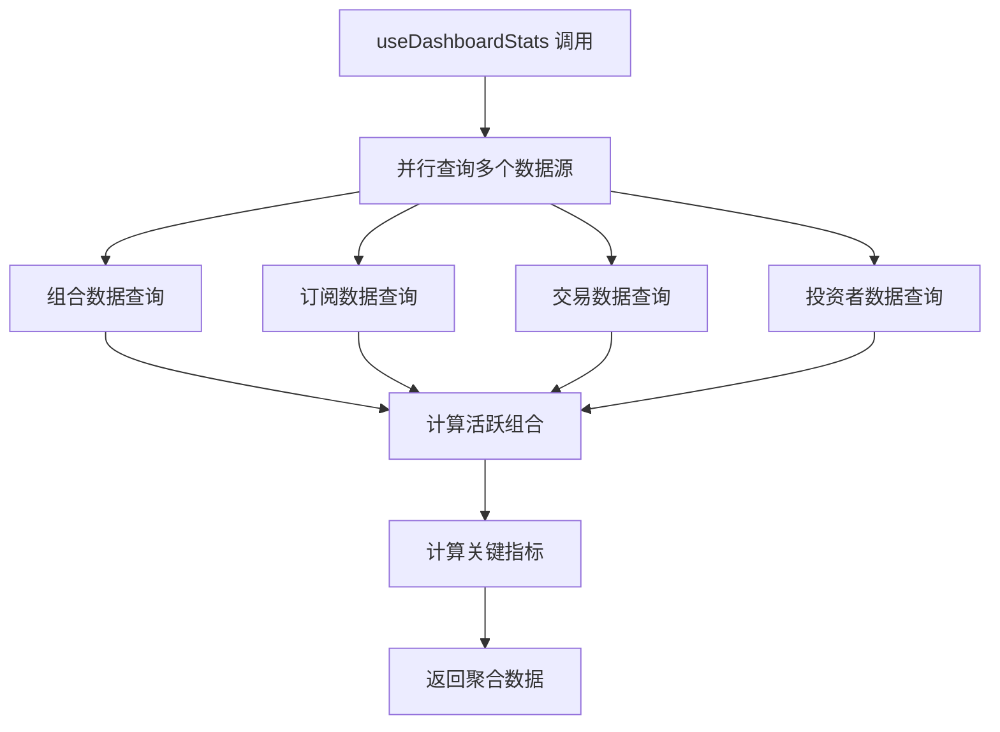

**图表来源**
- [useDashboardStats.ts:28-66](file://frontend/src/hooks/useDashboardStats.ts#L28-L66)

**章节来源**
- [useDashboardStats.ts:28-66](file://frontend/src/hooks/useDashboardStats.ts#L28-L66)

### 交易业务钩子（useTrade.ts）
- 交易生命周期管理
  - 列表查询：useTradeList
  - 详情查询：useTrade
  - 创建交易：useCreateTrade
  - 更新交易：useUpdateTrade
  - 确认交易：useConfirmTrade
  - 取消交易：useCancelTrade
  - 取消确认：useUnconfirmTrade
  - 删除交易：useDeleteTrade
  - 批量调仓：useBatchRebalance
- 订阅赎回管理
  - 列表查询：useSubscriptionList
  - 详情查询：useSubscription
  - 创建申请：useCreateSubscription
  - 确认申请：useConfirmSubscription
  - 取消申请：useCancelSubscription
  - 取消确认：useUnconfirmSubscription
- 缓存策略
  - 统一的 queryKey 命名规范
  - 针对不同操作设置合适的 staleTime
  - 精确的缓存失效策略
- 错误处理
  - 统一的错误消息提取函数
  - 用户友好的错误提示
  - 详细的错误信息处理

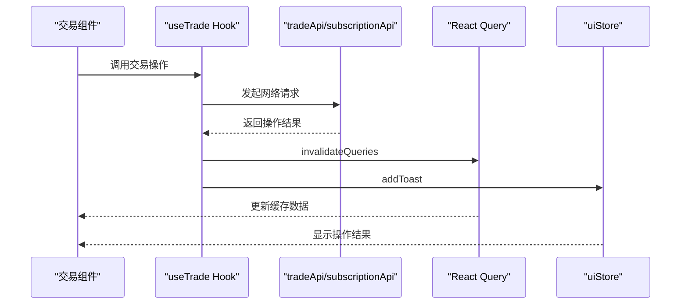

**图表来源**
- [useTrade.ts:14-381](file://frontend/src/hooks/useTrade.ts#L14-L381)
- [api/trade.ts:5-37](file://frontend/src/lib/api/trade.ts#L5-L37)
- [api/subscription.ts:9-33](file://frontend/src/lib/api/subscription.ts#L9-L33)

**章节来源**
- [useTrade.ts:14-381](file://frontend/src/hooks/useTrade.ts#L14-L381)
- [api/trade.ts:5-37](file://frontend/src/lib/api/trade.ts#L5-L37)
- [api/subscription.ts:9-33](file://frontend/src/lib/api/subscription.ts#L9-L33)

### 认证钩子（useAuth.ts）
- useLogin：发起登录请求，成功后写入认证状态并跳转
- useLogout：登出并清理缓存，提示信息
- useCurrentUser：拉取当前用户信息，启用条件为存在 token，staleTime 5 分钟
- useChangePassword：修改密码并提示结果
- useAuthGuard：根据认证状态进行路由守卫
- useRoleCheck：基于用户角色进行权限判断

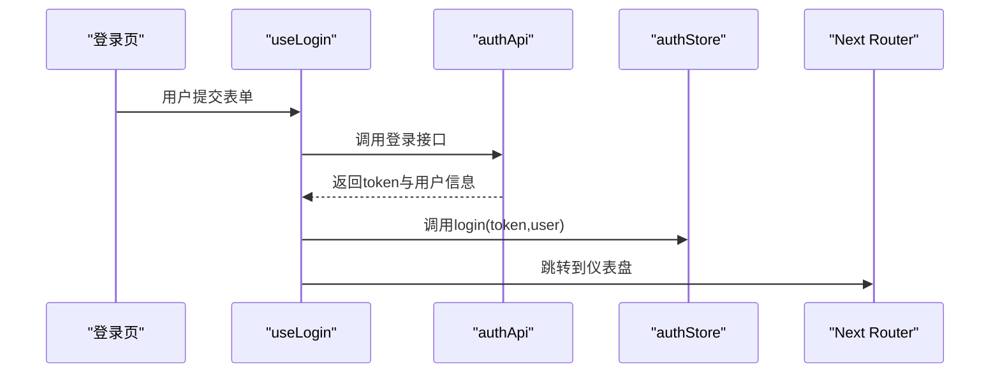

**图表来源**
- [useAuth.ts:12-36](file://frontend/src/hooks/useAuth.ts#L12-L36)
- [authStore.ts:37-42](file://frontend/src/stores/authStore.ts#L37-L42)
- [page.tsx:14-43](file://frontend/src/app/login/page.tsx#L14-L43)

**章节来源**
- [useAuth.ts:12-133](file://frontend/src/hooks/useAuth.ts#L12-L133)
- [page.tsx:14-43](file://frontend/src/app/login/page.tsx#L14-L43)

### 业务数据钩子（usePortfolio.ts、usePosition.ts、useInvestor.ts）
- usePortfolioList/usePortfolio/useLatestSnapshot/useAvailableCash 等
  - queryKey：以模块名与参数为键，确保缓存隔离
  - enabled：对必填参数进行判空，避免无效请求
  - staleTime：针对不同数据设定合理的过期时间
- useCreatePortfolio/useUpdatePortfolio/useClosePortfolio 等
  - onSuccess：调用 queryClient.invalidateQueries 使相关缓存失效
  - onError：通过 UIStore.addToast 提示错误

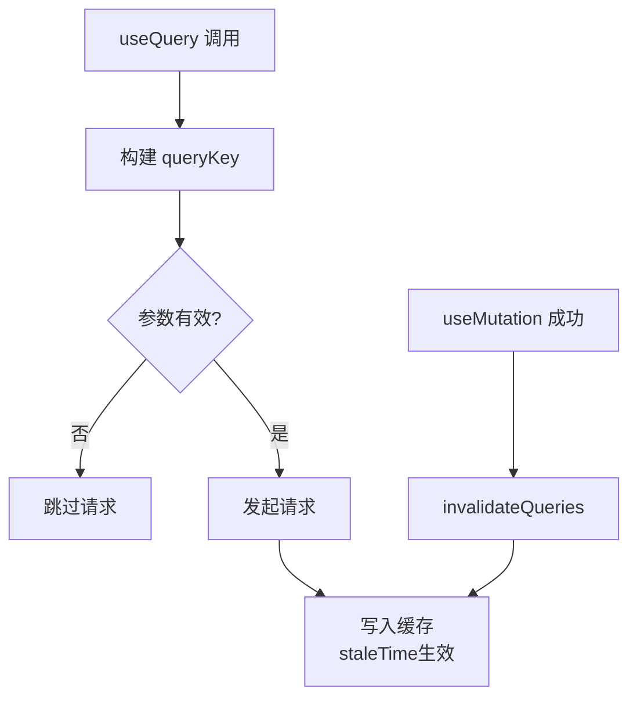

**图表来源**
- [usePortfolio.ts:17-33](file://frontend/src/hooks/usePortfolio.ts#L17-L33)
- [usePosition.ts:10-29](file://frontend/src/hooks/usePosition.ts#L10-L29)
- [useInvestor.ts](file://frontend/src/hooks/useInvestor.ts)

**章节来源**
- [usePortfolio.ts:17-241](file://frontend/src/hooks/usePortfolio.ts#L17-L241)
- [usePosition.ts:10-87](file://frontend/src/hooks/usePosition.ts#L10-L87)
- [useInvestor.ts](file://frontend/src/hooks/useInvestor.ts)

### 页面与布局中的状态使用
- 登录页（login/page.tsx）
  - 直接使用 authStore 的 login 方法，手动处理错误并提示
- 主布局（MainLayout.tsx）
  - 通过 useAuthStore 的 isAuthenticated 进行路由守卫
- 仪表盘（dashboard/page.tsx）
  - 使用 useDashboardStats 聚合数据，展示统计与活动
  - 使用多个 useTrade 钩子管理交易生命周期

**章节来源**
- [page.tsx:14-43](file://frontend/src/app/login/page.tsx#L14-L43)
- [MainLayout.tsx:18-22](file://frontend/src/components/layout/MainLayout.tsx#L18-L22)
- [page.tsx:12-290](file://frontend/src/app/dashboard/page.tsx#L12-L290)

## 依赖关系分析
- 库依赖
  - @tanstack/react-query：数据获取与缓存
  - zustand：轻量级状态管理
  - axios：HTTP 客户端
- 文件耦合
  - hooks 依赖 api/index.ts 与 stores
  - providers.tsx 为 hooks 提供 QueryClient 上下文
  - ToastContainer 依赖 uiStore.ts

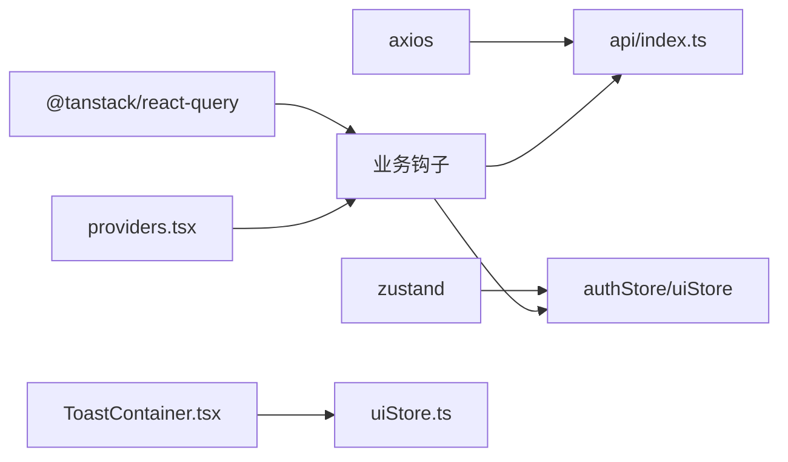

**图表来源**
- [package.json:20-38](file://frontend/package.json#L20-L38)
- [providers.tsx:3-26](file://frontend/src/app/providers.tsx#L3-L26)
- [ToastContainer.tsx:3-17](file://frontend/src/components/ui/ToastContainer.tsx#L3-L17)

**章节来源**
- [package.json:20-38](file://frontend/package.json#L20-L38)
- [providers.tsx:3-26](file://frontend/src/app/providers.tsx#L3-L26)
- [ToastContainer.tsx:3-17](file://frontend/src/components/ui/ToastContainer.tsx#L3-L17)

## 性能考量
- 缓存策略
  - 不同业务设置差异化 staleTime，平衡实时性与性能
  - Mutation 成功后精确失效相关 queryKey，避免全量刷新
  - useDashboardStats 并行查询多个数据源，提升响应速度
- 网络层
  - 请求拦截器统一注入 token，减少重复代码
  - 401 自动登出，避免无效请求堆积
  - 模块化 API 客户端提高代码复用性
- UI 体验
  - 全局 Toast 统一提示，减少重复的错误处理逻辑
  - Provider 默认关闭 refetchOnWindowFocus，降低后台切换开销
  - 统一的错误消息提取函数，提供更好的用户体验

**章节来源**
- [providers.tsx:11-16](file://frontend/src/app/providers.tsx#L11-L16)
- [useDashboardStats.ts:28-66](file://frontend/src/hooks/useDashboardStats.ts#L28-L66)
- [useTrade.ts:14-381](file://frontend/src/hooks/useTrade.ts#L14-L381)
- [api/index.ts:1-43](file://frontend/src/lib/api/index.ts#L1-L43)
- [api/client.ts:13-42](file://frontend/src/lib/api/client.ts#L13-L42)

## 故障排查指南
- 登录失败
  - 检查 api/client.ts 的请求拦截器是否正确附加 token
  - 确认 useAuth.ts 的 useLogin 是否正确调用 authStore.login
- 401 未跳转
  - 检查响应拦截器是否执行了清理与跳转逻辑
- 缓存未更新
  - 确认 Mutation 的 onSuccess 是否调用了 invalidateQueries
  - 检查 queryKey 是否与查询一致
- 登出后仍显示数据
  - 确认 useLogout 是否调用了 queryClient.clear()
- 仪表盘数据不准确
  - 检查 useDashboardStats 的数据聚合逻辑
  - 确认各数据源的 staleTime 设置是否合理
- 交易操作失败
  - 检查 useTrade.ts 的错误处理函数
  - 确认 API 响应格式是否符合预期

**章节来源**
- [api/client.ts:13-42](file://frontend/src/lib/api/client.ts#L13-L42)
- [useAuth.ts:45-53](file://frontend/src/hooks/useAuth.ts#L45-L53)
- [useDashboardStats.ts:28-66](file://frontend/src/hooks/useDashboardStats.ts#L28-L66)
- [useTrade.ts:14-381](file://frontend/src/hooks/useTrade.ts#L14-L381)

## 结论
本项目采用"Zustand + React Query"的混合状态管理方案：
- 认证与 UI 状态由 Zustand 负责，具备持久化与细粒度控制
- 业务数据由 React Query 统一管理，具备完善的缓存、失效与错误处理机制
- 通过模块化的 API 客户端设计，实现业务域的清晰分离
- useDashboardStats 提供了强大的数据聚合能力
- useTrade 实现了完整的交易生命周期管理
- 通过 Provider 统一注入与拦截器统一处理，形成清晰的职责边界与良好的扩展性

## 附录

### 状态持久化与本地存储策略
- 认证状态持久化
  - localStorage：保存 token，确保 SSR/CSR 场景可用
  - cookie：登录时同步写入，满足服务端校验需求
  - authStore.persist：仅持久化 token、user、isAuthenticated
- UI 状态持久化
  - uiStore.persist：仅持久化 sidebarOpen 与 sidebarCollapsed

**章节来源**
- [authStore.ts:37-51](file://frontend/src/stores/authStore.ts#L37-L51)
- [authStore.ts:61-68](file://frontend/src/stores/authStore.ts#L61-L68)
- [uiStore.ts:76-82](file://frontend/src/stores/uiStore.ts#L76-L82)

### 状态同步与并发控制
- 并发控制
  - React Query 默认串行化相同 queryKey 的请求，避免重复并发
  - Mutation 串行化，避免竞态
  - useDashboardStats 并行查询多个数据源
- 状态同步
  - 登录成功后立即更新 authStore，触发依赖该状态的组件重渲染
  - 登出时清理 QueryClient 缓存，确保后续请求不会携带旧数据
  - 交易操作后精确失效相关缓存，保持数据一致性

**章节来源**
- [useAuth.ts:12-36](file://frontend/src/hooks/useAuth.ts#L12-L36)
- [useAuth.ts:45-53](file://frontend/src/hooks/useAuth.ts#L45-L53)
- [useDashboardStats.ts:28-66](file://frontend/src/hooks/useDashboardStats.ts#L28-L66)
- [useTrade.ts:14-381](file://frontend/src/hooks/useTrade.ts#L14-L381)

### 开发体验与调试建议
- 使用 React DevTools + Zustand Devtools（如需）观察状态变化
- 在 providers.tsx 中开启调试日志（例如打印 queryKey 与 staleTime）
- 对关键 Mutation 添加测试用例，覆盖成功/失败分支
- 对高频查询设置合理 staleTime，避免过度刷新
- 利用模块化 API 客户端的类型安全特性，提升开发效率
- 使用统一的错误消息提取函数，确保用户获得一致的反馈

**章节来源**
- [providers.tsx:8-19](file://frontend/src/app/providers.tsx#L8-L19)
- [api/client.ts:87-91](file://frontend/src/lib/api/client.ts#L87-L91)
- [api/index.ts:1-43](file://frontend/src/lib/api/index.ts#L1-L43)