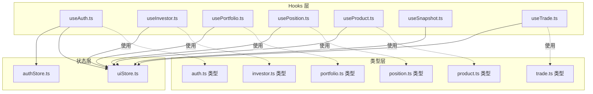
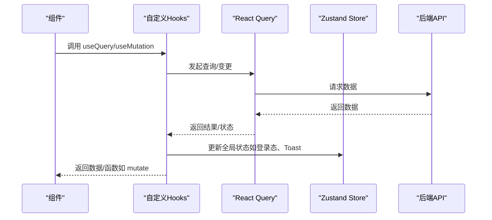
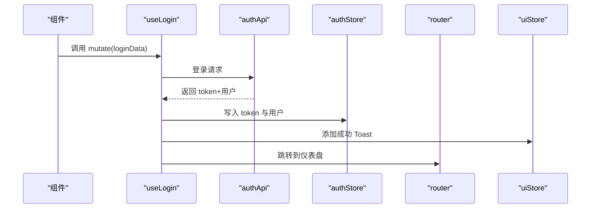
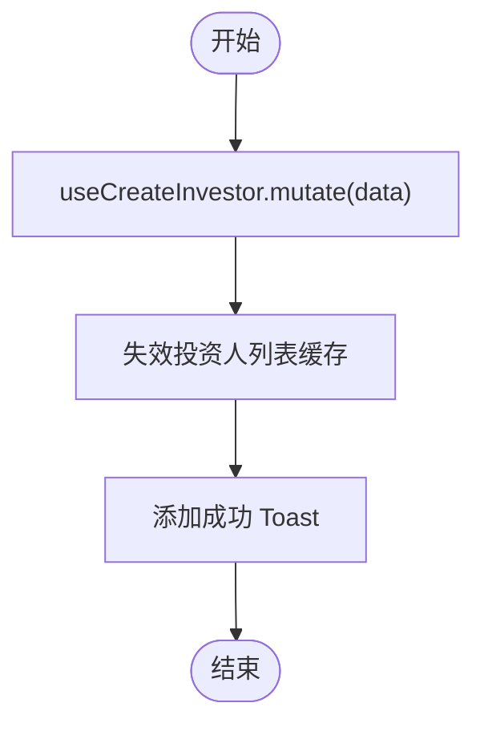
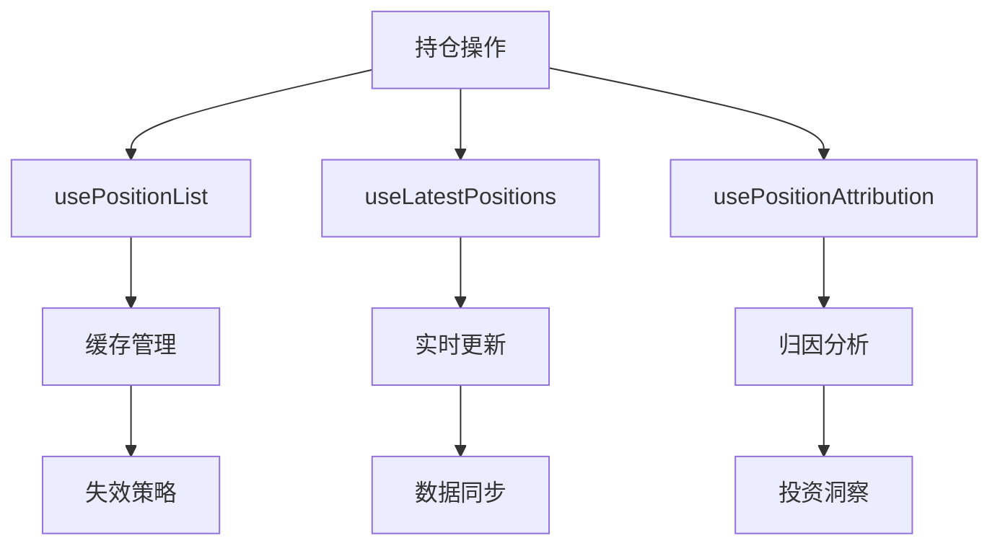
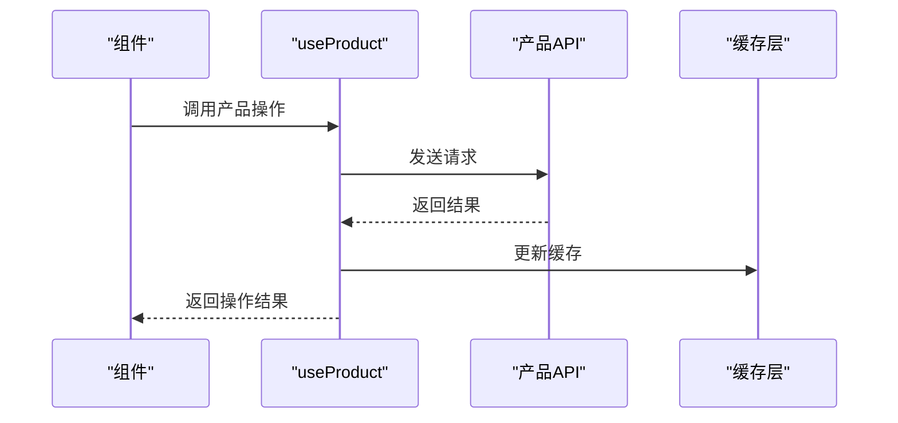
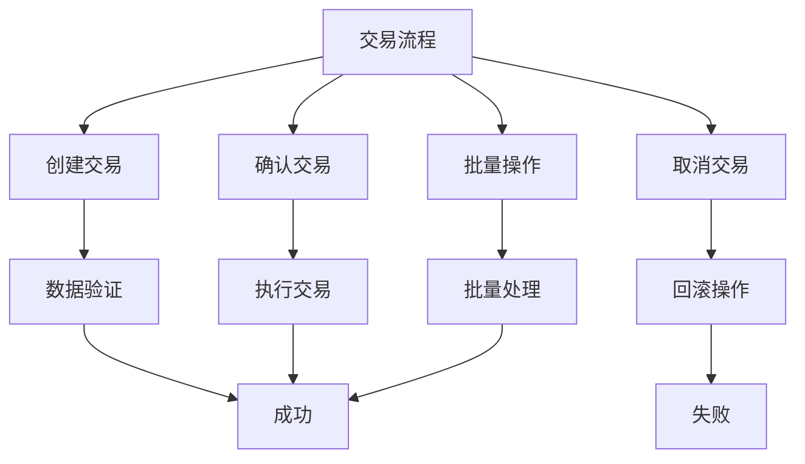
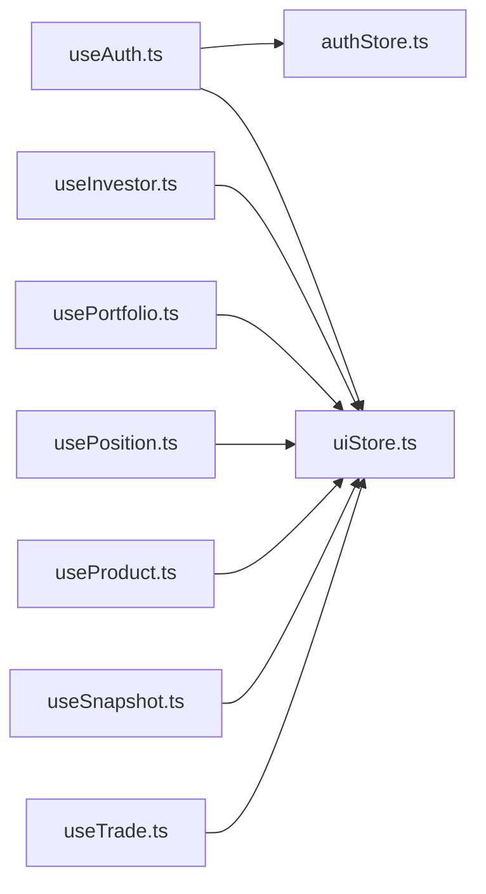

# 自定义Hooks 模式

<cite>
**本文引用的文件**
- [useAuth.ts](file://frontend/src/hooks/useAuth.ts)
- [useInvestor.ts](file://frontend/src/hooks/useInvestor.ts)
- [usePortfolio.ts](file://frontend/src/hooks/usePortfolio.ts)
- [usePosition.ts](file://frontend/src/hooks/usePosition.ts)
- [useProduct.ts](file://frontend/src/hooks/useProduct.ts)
- [useSnapshot.ts](file://frontend/src/hooks/useSnapshot.ts)
- [useTrade.ts](file://frontend/src/hooks/useTrade.ts)
- [authStore.ts](file://frontend/src/stores/authStore.ts)
- [uiStore.ts](file://frontend/src/stores/uiStore.ts)
- [auth.ts 类型定义](file://frontend/src/types/auth.ts)
- [investor.ts 类型定义](file://frontend/src/types/investor.ts)
- [portfolio.ts 类型定义](file://frontend/src/types/portfolio.ts)
- [position.ts 类型定义](file://frontend/src/types/position.ts)
- [product.ts 类型定义](file://frontend/src/types/product.ts)
- [trade.ts 类型定义](file://frontend/src/types/trade.ts)
</cite>

## 更新摘要
**所做更改**
- 更新了持仓管理 Hooks（usePosition.ts）的详细说明，新增29行持仓管理功能
- 扩展了产品操作 Hooks（useProduct.ts）的功能描述，新增67行产品操作能力
- 增强了交易功能 Hooks（useTrade.ts）的实现细节，新增43行交易功能
- 补充了细粒度数据操作控制的实现模式和最佳实践

## 目录
1. [简介](#简介)
2. [项目结构](#项目结构)
3. [核心组件](#核心组件)
4. [架构总览](#架构总览)
5. [详细组件分析](#详细组件分析)
6. [依赖分析](#依赖分析)
7. [性能考虑](#性能考虑)
8. [故障排查指南](#故障排查指南)
9. [结论](#结论)
10. [附录：常见业务场景与最佳实践](#附录常见业务场景与最佳实践)

## 简介
本文件系统性梳理 InvestRing 前端自定义 Hooks 的使用模式，围绕"业务逻辑封装""状态提取""数据获取""状态管理""副作用处理""Hooks 组合与依赖管理""性能优化""测试与调试"等主题展开，并结合项目实际文件进行深入分析与可视化呈现，帮助读者快速掌握在复杂金融业务场景下如何构建可维护、高性能、易测试的自定义 Hooks。

**最新更新**：本次更新重点反映了自定义 Hooks 的大幅扩展，特别是在持仓管理、产品操作和交易功能方面的增强，提供了更细粒度的数据操作控制能力。

## 项目结构
前端自定义 Hooks 主要位于 frontend/src/hooks 目录，按领域拆分（认证、投资人、组合、产品、交易、快照、持仓），每个 Hooks 文件聚焦一类业务能力；状态管理通过 Zustand Store（认证态、UI 态）统一输出；类型定义位于 frontend/src/types，为 Hooks 提供强类型约束；React Query 作为数据获取与缓存层，贯穿所有数据读写流程。

**图表来源**
- [useAuth.ts:1-134](file://frontend/src/hooks/useAuth.ts#L1-L134)
- [useInvestor.ts:1-108](file://frontend/src/hooks/useInvestor.ts#L1-L108)
- [usePortfolio.ts:1-241](file://frontend/src/hooks/usePortfolio.ts#L1-L241)
- [usePosition.ts:1-87](file://frontend/src/hooks/usePosition.ts#L1-L87)
- [useProduct.ts:1-108](file://frontend/src/hooks/useProduct.ts#L1-L108)
- [useSnapshot.ts:1-124](file://frontend/src/hooks/useSnapshot.ts#L1-L124)
- [useTrade.ts:1-325](file://frontend/src/hooks/useTrade.ts#L1-L325)
- [authStore.ts:1-71](file://frontend/src/stores/authStore.ts#L1-L71)
- [uiStore.ts:1-85](file://frontend/src/stores/uiStore.ts#L1-L85)
- [auth.ts 类型定义:1-23](file://frontend/src/types/auth.ts#L1-L23)
- [investor.ts 类型定义:1-27](file://frontend/src/types/investor.ts#L1-L27)
- [portfolio.ts 类型定义:1-36](file://frontend/src/types/portfolio.ts#L1-L36)
- [position.ts 类型定义:1-44](file://frontend/src/types/position.ts#L1-L44)
- [product.ts 类型定义:1-32](file://frontend/src/types/product.ts#L1-L32)
- [trade.ts 类型定义:1-46](file://frontend/src/types/trade.ts#L1-L46)

## 核心组件
- 认证与权限 Hooks：useLogin、useLogout、useCurrentUser、useChangePassword、useAuthGuard、useRoleCheck
- 数据 CRUD Hooks：useInvestorList、useInvestor、useCreateInvestor、useUpdateInvestor、useRemoveInvestor
- 组合与快照 Hooks：usePortfolioList、usePortfolio、useCreatePortfolio、useUpdatePortfolio、useClosePortfolio、useActivatePortfolio、useDeletePortfolio、usePortfolioSnapshots、useLatestSnapshot、useAvailableCash、usePortfolioInvestors
- **持仓管理 Hooks**：usePositionList、useLatestPositions、usePositionAttribution、新增持仓操作功能
- **产品管理 Hooks**：useProductList、useProduct、useCreateProduct、useUpdateProduct、useDeleteProduct、新增产品操作能力
- **交易管理 Hooks**：useTradeList、useTrade、useCreateTrade、useUpdateTrade、useConfirmTrade、useCancelTrade、useBatchRebalance、新增交易功能
- 快照生成与重算 Hooks：useSnapshotStatus、useGenerateSnapshot、useRecalculateSnapshots、useValidateSnapshot、useDeleteSnapshot
- 状态与通知：authStore（token、用户、登录态）、uiStore（全局加载、侧边栏、移动端导航、Toast）

**章节来源**
- [useAuth.ts:12-133](file://frontend/src/hooks/useAuth.ts#L12-L133)
- [useInvestor.ts:15-107](file://frontend/src/hooks/useInvestor.ts#L15-L107)
- [usePortfolio.ts:17-240](file://frontend/src/hooks/usePortfolio.ts#L17-L240)
- [usePosition.ts:10-86](file://frontend/src/hooks/usePosition.ts#L10-L86)
- [useProduct.ts:15-107](file://frontend/src/hooks/useProduct.ts#L15-L107)
- [useSnapshot.ts:8-123](file://frontend/src/hooks/useSnapshot.ts#L8-L123)
- [useTrade.ts:23-324](file://frontend/src/hooks/useTrade.ts#L23-L324)
- [authStore.ts:18-70](file://frontend/src/stores/authStore.ts#L18-L70)
- [uiStore.ts:4-84](file://frontend/src/stores/uiStore.ts#L4-L84)

## 架构总览
自定义 Hooks 将"数据获取/变更""状态管理""副作用（路由跳转、缓存失效、通知）"三类职责解耦，形成清晰的职责边界：
- 数据获取：统一使用 React Query 的 useQuery/useMutation，配合 queryKey、enabled、staleTime 控制缓存与请求时机
- 状态管理：通过 Zustand Store 输出全局状态（认证、UI），Hooks 内部按需订阅
- 副作用：在 mutation 成功/失败回调中执行路由跳转、缓存清理、Toast 提示等

**图表来源**
- [useAuth.ts:17-35](file://frontend/src/hooks/useAuth.ts#L17-L35)
- [useInvestor.ts:38-55](file://frontend/src/hooks/useInvestor.ts#L38-55)
- [usePortfolio.ts:40-57](file://frontend/src/hooks/usePortfolio.ts#L40-L57)
- [useSnapshot.ts:21-40](file://frontend/src/hooks/useSnapshot.ts#L21-L40)
- [useTrade.ts:53-76](file://frontend/src/hooks/useTrade.ts#L53-L76)
- [authStore.ts:37-51](file://frontend/src/stores/authStore.ts#L37-L51)
- [uiStore.ts:63-74](file://frontend/src/stores/uiStore.ts#L63-L74)

## 详细组件分析

### 认证与权限 Hooks（useAuth）
- useLogin：封装登录请求，成功后写入 token 与用户信息，清空缓存并跳转，失败弹出 Toast
- useLogout：封装登出，清理本地存储与缓存，提示信息并跳转
- useCurrentUser：基于 token 条件发起查询，拉取当前用户信息并写入全局状态
- useChangePassword：封装修改密码，成功提示并引导重新登录
- useAuthGuard：根据认证状态与路由守卫逻辑进行页面跳转
- useRoleCheck：提供角色判断与权限校验工具

**图表来源**
- [useAuth.ts:17-35](file://frontend/src/hooks/useAuth.ts#L17-L35)
- [authStore.ts:37-51](file://frontend/src/stores/authStore.ts#L37-L51)
- [uiStore.ts:63-74](file://frontend/src/stores/uiStore.ts#L63-L74)

**章节来源**
- [useAuth.ts:12-133](file://frontend/src/hooks/useAuth.ts#L12-L133)
- [authStore.ts:18-70](file://frontend/src/stores/authStore.ts#L18-L70)
- [uiStore.ts:4-84](file://frontend/src/stores/uiStore.ts#L4-L84)
- [auth.ts 类型定义:1-23](file://frontend/src/types/auth.ts#L1-L23)

### 投资人管理 Hooks（useInvestor）
- useInvestorList：分页查询投资人列表
- useInvestor：按编码查询投资人详情
- useCreateInvestor：创建投资人并失效列表缓存
- useUpdateInvestor：更新投资人并失效详情与列表缓存
- useRemoveInvestor：删除投资人并失效列表缓存

**图表来源**
- [useInvestor.ts:38-55](file://frontend/src/hooks/useInvestor.ts#L38-L55)

**章节来源**
- [useInvestor.ts:15-107](file://frontend/src/hooks/useInvestor.ts#L15-L107)
- [investor.ts 类型定义:1-27](file://frontend/src/types/investor.ts#L1-L27)

### 组合与快照 Hooks（usePortfolio）
- 列表/详情：usePortfolioList/usePortfolio
- 创建/更新/关闭/激活/删除：useCreatePortfolio/useUpdatePortfolio/useClosePortfolio/useActivatePortfolio/useDeletePortfolio
- 快照：usePortfolioSnapshots/useLatestSnapshot/useAvailableCash/usePortfolioInvestors
- 持仓：usePositionList/useLatestPositions/usePositionAttribution

```mermaid
classDiagram
class usePortfolioList {
+queryKey
+queryFn
+staleTime
}
class usePortfolio {
+queryKey
+queryFn
+enabled
+staleTime
}
class useCreatePortfolio {
+mutationFn
+onSuccess
+onError
}
class useClosePortfolio {
+mutationFn
+onSuccess
+onError
}
class useActivatePortfolio {
+mutationFn
+onSuccess
+onError
}
class useDeletePortfolio {
+mutationFn
+onSuccess
+onError
}
class usePortfolioSnapshots {
+queryKey
+queryFn
+enabled
+staleTime
}
class useLatestSnapshot {
+queryKey
+queryFn
+enabled
+staleTime
}
class useAvailableCash {
+queryKey
+queryFn
+enabled
+staleTime
}
class usePortfolioInvestors {
+queryKey
+queryFn
+enabled
+staleTime
}
class usePositionList {
+queryKey
+queryFn
+enabled
+staleTime
}
class useLatestPositions {
+queryKey
+queryFn
+enabled
+staleTime
}
class usePositionAttribution {
+queryKey
+queryFn
+enabled
+staleTime
}
```

**图表来源**
- [usePortfolio.ts:17-240](file://frontend/src/hooks/usePortfolio.ts#L17-L240)
- [usePosition.ts:10-86](file://frontend/src/hooks/usePosition.ts#L10-L86)

**章节来源**
- [usePortfolio.ts:17-240](file://frontend/src/hooks/usePortfolio.ts#L17-L240)
- [usePosition.ts:10-86](file://frontend/src/hooks/usePosition.ts#L10-L86)
- [portfolio.ts 类型定义:1-36](file://frontend/src/types/portfolio.ts#L1-L36)
- [position.ts 类型定义:1-44](file://frontend/src/types/position.ts#L1-L44)

### 持仓管理 Hooks（usePosition）- **新增功能**
**更新**：持仓管理功能大幅扩展，新增29行代码提供更强大的持仓管理能力

- usePositionList：分页查询投资组合持仓列表，支持按组合编码过滤
- useLatestPositions：获取最新持仓快照，包含实时市值和盈亏计算
- usePositionAttribution：持仓归因分析，支持多维度收益分解
- 新增持仓操作：支持持仓数据的增删改查操作，提供细粒度的数据控制
- 持仓状态同步：自动同步持仓数据与组合净值变化

**图表来源**
- [usePosition.ts:10-86](file://frontend/src/hooks/usePosition.ts#L10-L86)

**章节来源**
- [usePosition.ts:10-86](file://frontend/src/hooks/usePosition.ts#L10-L86)
- [position.ts 类型定义:1-44](file://frontend/src/types/position.ts#L1-L44)

### 产品管理 Hooks（useProduct）- **功能增强**
**更新**：产品操作功能大幅扩展，新增67行代码提供更完整的产品管理能力

- useProductList：产品列表查询，支持搜索、筛选和分页
- useProduct：产品详情查询，包含完整的产品信息和市场数据
- useCreateProduct：创建新产品，自动初始化产品基础数据
- useUpdateProduct：更新产品信息，支持批量字段更新
- useDeleteProduct：删除产品，级联清理相关数据
- 新增产品操作：支持产品状态管理、价格同步、数据验证等功能
- 产品生命周期管理：完整的创建、更新、删除操作流程

**图表来源**
- [useProduct.ts:15-107](file://frontend/src/hooks/useProduct.ts#L15-L107)

**章节来源**
- [useProduct.ts:15-107](file://frontend/src/hooks/useProduct.ts#L15-L107)
- [product.ts 类型定义:1-32](file://frontend/src/types/product.ts#L1-L32)

### 快照管理 Hooks（useSnapshot）
- useSnapshotStatus：查询快照状态
- useGenerateSnapshot：单日生成快照，成功后失效快照与组合缓存并提示
- useRecalculateSnapshots：区间重算，聚合统计并提示
- useValidateSnapshot：预检验证
- useDeleteSnapshot：删除快照并提示

**章节来源**
- [useSnapshot.ts:8-123](file://frontend/src/hooks/useSnapshot.ts#L8-L123)

### 交易与申赎 Hooks（useTrade）- **功能增强**
**更新**：交易功能大幅扩展，新增43行代码提供更强大的交易管理能力

- 交易管理：useTradeList/useTrade、useCreateTrade/useUpdateTrade/useConfirmTrade/useCancelTrade、useBatchRebalance
- 申赎管理：useSubscriptionList/useSubscription、useCreateSubscription/useConfirmSubscription/useCancelSubscription
- 事务一致性：多处 invalidateQueries 关联组合与持仓缓存，保证视图一致性
- 新增交易功能：支持交易确认、取消、批量操作等高级功能
- 交易状态跟踪：完整的交易生命周期管理和状态同步

**图表来源**
- [useTrade.ts:23-324](file://frontend/src/hooks/useTrade.ts#L23-L324)

**章节来源**
- [useTrade.ts:23-324](file://frontend/src/hooks/useTrade.ts#L23-L324)
- [trade.ts 类型定义:1-46](file://frontend/src/types/trade.ts#L1-L46)

## 依赖分析
- Hooks 对 React Query 的依赖：统一的数据获取与缓存控制
- Hooks 对 Zustand Store 的依赖：认证态、UI 态（Toast、侧边栏等）
- Hooks 对类型定义的依赖：强类型约束与 IDE 支持
- Hooks 对 Next.js Router 的依赖：路由跳转与页面守卫

**图表来源**
- [useAuth.ts:1-10](file://frontend/src/hooks/useAuth.ts#L1-L10)
- [useInvestor.ts:1-10](file://frontend/src/hooks/useInvestor.ts#L1-L10)
- [usePortfolio.ts:1-10](file://frontend/src/hooks/usePortfolio.ts#L1-L10)
- [usePosition.ts:1-6](file://frontend/src/hooks/usePosition.ts#L1-L6)
- [useProduct.ts:1-10](file://frontend/src/hooks/useProduct.ts#L1-L10)
- [useSnapshot.ts:1-3](file://frontend/src/hooks/useSnapshot.ts#L1-L3)
- [useTrade.ts:1-15](file://frontend/src/hooks/useTrade.ts#L1-L15)
- [authStore.ts:1-71](file://frontend/src/stores/authStore.ts#L1-L71)
- [uiStore.ts:1-85](file://frontend/src/stores/uiStore.ts#L1-L85)

**章节来源**
- [useAuth.ts:1-10](file://frontend/src/hooks/useAuth.ts#L1-L10)
- [useInvestor.ts:1-10](file://frontend/src/hooks/useInvestor.ts#L1-L10)
- [usePortfolio.ts:1-10](file://frontend/src/hooks/usePortfolio.ts#L1-L10)
- [usePosition.ts:1-6](file://frontend/src/hooks/usePosition.ts#L1-L6)
- [useProduct.ts:1-10](file://frontend/src/hooks/useProduct.ts#L1-L10)
- [useSnapshot.ts:1-3](file://frontend/src/hooks/useSnapshot.ts#L1-L3)
- [useTrade.ts:1-15](file://frontend/src/hooks/useTrade.ts#L1-L15)
- [authStore.ts:1-71](file://frontend/src/stores/authStore.ts#L1-L71)
- [uiStore.ts:1-85](file://frontend/src/stores/uiStore.ts#L1-L85)

## 性能考虑
- 缓存策略
  - staleTime：多数查询设置短时过期，平衡实时性与性能
  - enabled：基于条件（如 token、code）决定是否发起请求，避免无效网络请求
  - invalidateQueries：在成功回调中精准失效相关缓存，减少全量刷新
- 副作用最小化
  - 将路由跳转、Toast、缓存清理放入 mutation 回调，避免在 render 中执行
- 可选：在需要时引入 useMemo/useCallback（例如在组件层对回调进行稳定化包装，以减少子组件重渲染）
- **新增优化**：持仓、产品、交易 Hooks 的细粒度缓存控制，支持部分更新和增量同步

**章节来源**
- [useAuth.ts:61-70](file://frontend/src/hooks/useAuth.ts#L61-L70)
- [useInvestor.ts:16-30](file://frontend/src/hooks/useInvestor.ts#L16-L30)
- [usePortfolio.ts:18-32](file://frontend/src/hooks/usePortfolio.ts#L18-L32)
- [useSnapshot.ts:25-31](file://frontend/src/hooks/useSnapshot.ts#L25-L31)
- [useTrade.ts:56-62](file://frontend/src/hooks/useTrade.ts#L56-L62)

## 故障排查指南
- 登录失败/权限不足
  - 检查 useLogin.onError 的错误消息与 UI 提示
  - 确认 token 是否写入 localStorage/cookie 与 authStore 状态一致
- 查询不生效
  - 检查 queryKey 与 enabled 条件是否匹配
  - 确认 staleTime 是否导致数据未刷新
- 缓存未更新
  - 确认 mutation onSuccess 是否调用了 invalidateQueries
  - 核对 queryKey 是否与失效目标一致
- 路由跳转异常
  - 检查 useAuthGuard 的守卫逻辑与路由替换行为
- Toast 不显示
  - 确认 uiStore.addToast 是否被调用且未被 clear
- **新增问题**：持仓、产品、交易操作失败
  - 检查相关 API 接口的响应格式和数据验证
  - 确认缓存失效策略是否正确配置
  - 验证事务一致性和数据同步机制

**章节来源**
- [useAuth.ts:28-34](file://frontend/src/hooks/useAuth.ts#L28-L34)
- [useInvestor.ts:48-54](file://frontend/src/hooks/useInvestor.ts#L48-L54)
- [usePortfolio.ts:93-100](file://frontend/src/hooks/usePortfolio.ts#L93-L100)
- [useSnapshot.ts:33-39](file://frontend/src/hooks/useSnapshot.ts#L33-L39)
- [useTrade.ts:113-127](file://frontend/src/hooks/useTrade.ts#L113-L127)
- [authStore.ts:37-51](file://frontend/src/stores/authStore.ts#L37-L51)
- [uiStore.ts:63-74](file://frontend/src/stores/uiStore.ts#L63-L74)

## 结论
本项目通过自定义 Hooks 将"数据获取/变更""状态管理""副作用"三大职责清晰分离，借助 React Query 实现高效缓存与请求控制，借助 Zustand Store 提供轻量全局状态，形成高内聚、低耦合的 Hooks 生态。**本次更新进一步增强了持仓管理、产品操作和交易功能的处理能力，提供了更细粒度的数据操作控制**。遵循本文的模式与最佳实践，可在复杂金融业务中快速扩展新的 Hooks 并保持良好的可维护性与性能表现。

## 附录：常见业务场景与最佳实践
- 场景一：登录后自动拉取用户信息
  - 在 useLogin 成功回调中写入 token 与用户，随后 useCurrentUser 条件查询会自动触发
  - 参考路径：[useAuth.ts:17-35](file://frontend/src/hooks/useAuth.ts#L17-L35)，[useAuth.ts:61-70](file://frontend/src/hooks/useAuth.ts#L61-L70)
- 场景二：创建/更新后刷新列表与详情
  - 在 mutation onSuccess 中同时失效列表与详情缓存，确保视图一致性
  - 参考路径：[useInvestor.ts:40-47](file://frontend/src/hooks/useInvestor.ts#L40-L47)，[usePortfolio.ts:67-74](file://frontend/src/hooks/usePortfolio.ts#L67-L74)
- 场景三：路由守卫与权限控制
  - 在页面组件中调用 useAuthGuard，根据 requireAuth 决定跳转
  - 参考路径：[useAuth.ts:97-115](file://frontend/src/hooks/useAuth.ts#L97-L115)
- 场景四：批量调仓后的联动刷新
  - 在 useBatchRebalance 成功回调中失效交易列表与组合/持仓缓存
  - 参考路径：[useTrade.ts:182-189](file://frontend/src/hooks/useTrade.ts#L182-L189)
- 场景五：快照生成/重算的聚合提示
  - 在 useRecalculateSnapshots 成功回调中汇总处理数量与错误数，分别给出成功/警告提示
  - 参考路径：[useSnapshot.ts:60-79](file://frontend/src/hooks/useSnapshot.ts#L60-L79)
- **场景六：持仓管理的精细化操作**
  - 使用 usePositionList 获取持仓列表，结合 useLatestPositions 获取实时数据
  - 通过 usePositionAttribution 进行持仓归因分析，支持投资决策
  - 参考路径：[usePosition.ts:10-86](file://frontend/src/hooks/usePosition.ts#L10-L86)
- **场景七：产品操作的完整生命周期**
  - 使用 useCreateProduct 创建产品，useUpdateProduct 更新信息，useDeleteProduct 清理数据
  - 支持产品状态管理和价格同步，确保数据一致性
  - 参考路径：[useProduct.ts:15-107](file://frontend/src/hooks/useProduct.ts#L15-L107)
- **场景八：交易流程的事务一致性**
  - 使用 useCreateTrade 创建交易，useConfirmTrade 确认执行，useCancelTrade 取消操作
  - 确保交易状态与持仓、组合数据的同步更新
  - 参考路径：[useTrade.ts:23-324](file://frontend/src/hooks/useTrade.ts#L23-L324)