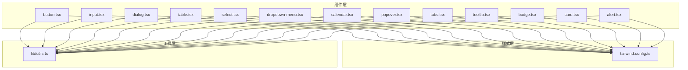
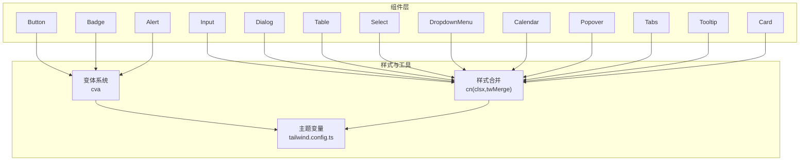
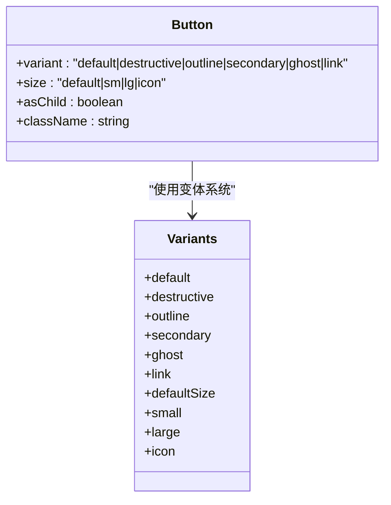
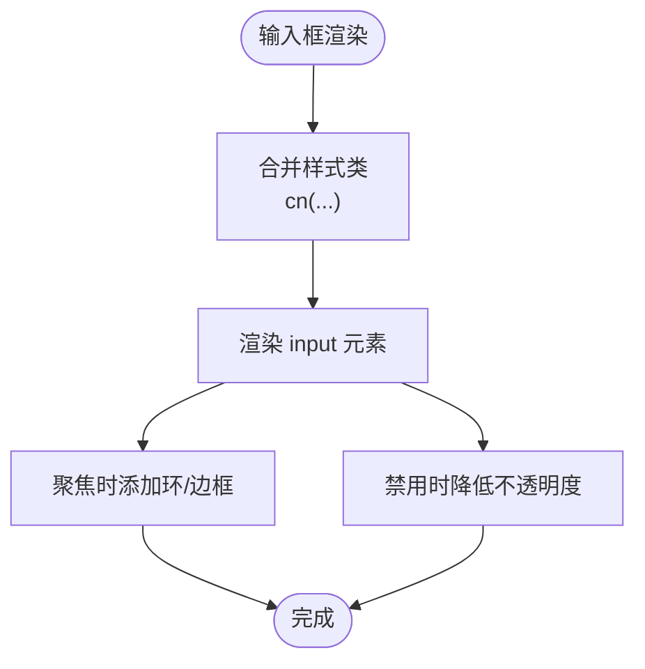
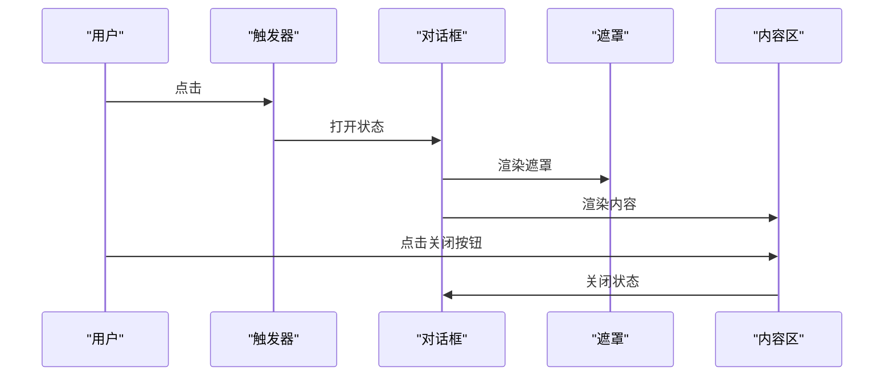
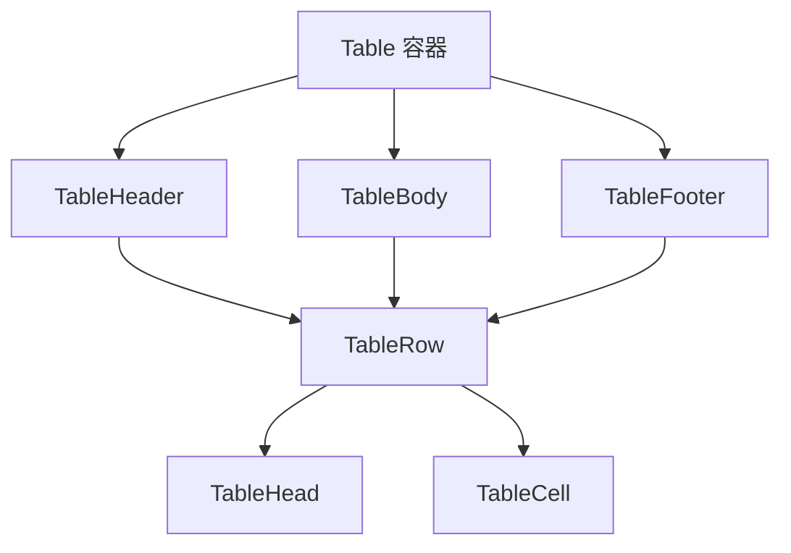
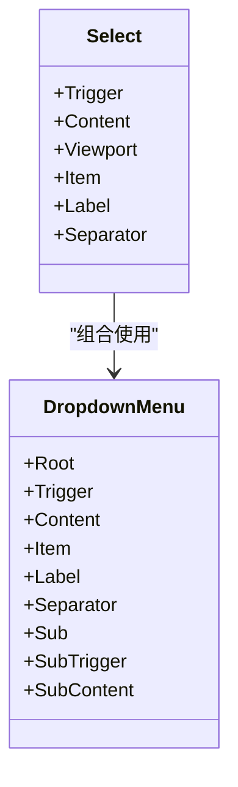
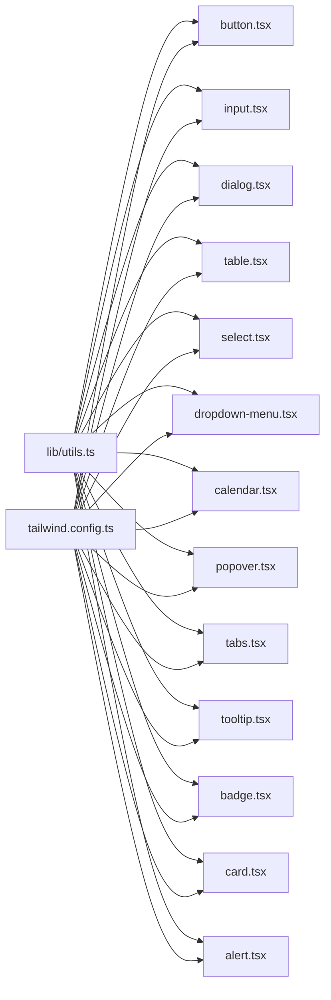

# UI组件库

<cite>
**本文引用的文件**
- [frontend/src/components/ui/button.tsx](file://frontend/src/components/ui/button.tsx)
- [frontend/src/components/ui/input.tsx](file://frontend/src/components/ui/input.tsx)
- [frontend/src/components/ui/dialog.tsx](file://frontend/src/components/ui/dialog.tsx)
- [frontend/src/components/ui/table.tsx](file://frontend/src/components/ui/table.tsx)
- [frontend/src/components/ui/badge.tsx](file://frontend/src/components/ui/badge.tsx)
- [frontend/src/components/ui/card.tsx](file://frontend/src/components/ui/card.tsx)
- [frontend/src/components/ui/select.tsx](file://frontend/src/components/ui/select.tsx)
- [frontend/src/components/ui/dropdown-menu.tsx](file://frontend/src/components/ui/dropdown-menu.tsx)
- [frontend/src/components/ui/calendar.tsx](file://frontend/src/components/ui/calendar.tsx)
- [frontend/src/components/ui/popover.tsx](file://frontend/src/components/ui/popover.tsx)
- [frontend/src/components/ui/tabs.tsx](file://frontend/src/components/ui/tabs.tsx)
- [frontend/src/components/ui/tooltip.tsx](file://frontend/src/components/ui/tooltip.tsx)
- [frontend/src/components/ui/alert.tsx](file://frontend/src/components/ui/alert.tsx)
- [frontend/tailwind.config.ts](file://frontend/tailwind.config.ts)
- [frontend/src/lib/utils.ts](file://frontend/src/lib/utils.ts)
</cite>

## 目录
1. [简介](#简介)
2. [项目结构](#项目结构)
3. [核心组件](#核心组件)
4. [架构总览](#架构总览)
5. [详细组件分析](#详细组件分析)
6. [依赖分析](#依赖分析)
7. [性能考虑](#性能考虑)
8. [故障排查指南](#故障排查指南)
9. [结论](#结论)
10. [附录](#附录)

## 简介
本文件面向 InvestRing 前端的 UI 组件库，系统性梳理基于 shadcn/ui 设计理念与 Radix UI 原子能力，结合 TailwindCSS 的原子化样式体系，构建的一套可定制、可扩展的基础 UI 组件体系。内容涵盖按钮、输入框、表格、对话框、选择器、下拉菜单、日历、弹出层、标签页、提示气泡、徽章、卡片、警告等组件的实现方式、可定制点、主题系统、样式覆盖机制、交互状态与事件处理、无障碍与国际化建议，以及开发规范、性能优化与组件间组合模式。

## 项目结构
UI 组件集中位于前端工程的组件目录中，采用“按功能域拆分”的组织方式：
- 组件层：frontend/src/components/ui 下存放所有基础 UI 组件
- 样式层：frontend/tailwind.config.ts 定义主题变量与扩展
- 工具层：frontend/src/lib/utils.ts 提供通用工具函数与样式合并

图表来源
- [frontend/src/components/ui/button.tsx:1-56](file://frontend/src/components/ui/button.tsx#L1-L56)
- [frontend/src/components/ui/input.tsx:1-25](file://frontend/src/components/ui/input.tsx#L1-L25)
- [frontend/src/components/ui/dialog.tsx:1-119](file://frontend/src/components/ui/dialog.tsx#L1-L119)
- [frontend/src/components/ui/table.tsx:1-114](file://frontend/src/components/ui/table.tsx#L1-L114)
- [frontend/src/components/ui/select.tsx:1-118](file://frontend/src/components/ui/select.tsx#L1-L118)
- [frontend/src/components/ui/dropdown-menu.tsx:1-145](file://frontend/src/components/ui/dropdown-menu.tsx#L1-L145)
- [frontend/src/components/ui/calendar.tsx:1-52](file://frontend/src/components/ui/calendar.tsx#L1-L52)
- [frontend/src/components/ui/popover.tsx:1-32](file://frontend/src/components/ui/popover.tsx#L1-L32)
- [frontend/src/components/ui/tabs.tsx:1-55](file://frontend/src/components/ui/tabs.tsx#L1-L55)
- [frontend/src/components/ui/tooltip.tsx:1-31](file://frontend/src/components/ui/tooltip.tsx#L1-L31)
- [frontend/src/components/ui/badge.tsx:1-37](file://frontend/src/components/ui/badge.tsx#L1-L37)
- [frontend/src/components/ui/card.tsx:1-79](file://frontend/src/components/ui/card.tsx#L1-L79)
- [frontend/src/components/ui/alert.tsx:1-59](file://frontend/src/components/ui/alert.tsx#L1-L59)
- [frontend/tailwind.config.ts:1-57](file://frontend/tailwind.config.ts#L1-L57)
- [frontend/src/lib/utils.ts:1-270](file://frontend/src/lib/utils.ts#L1-L270)

章节来源
- [frontend/src/components/ui/button.tsx:1-56](file://frontend/src/components/ui/button.tsx#L1-L56)
- [frontend/src/components/ui/input.tsx:1-25](file://frontend/src/components/ui/input.tsx#L1-L25)
- [frontend/src/components/ui/dialog.tsx:1-119](file://frontend/src/components/ui/dialog.tsx#L1-L119)
- [frontend/src/components/ui/table.tsx:1-114](file://frontend/src/components/ui/table.tsx#L1-L114)
- [frontend/tailwind.config.ts:1-57](file://frontend/tailwind.config.ts#L1-L57)

## 核心组件
本节概述各组件的职责、可定制点与典型用法要点：
- 按钮 Button：通过变体与尺寸变体系统提供多种视觉与尺寸形态；支持透传原生按钮属性与 asChild 渲染策略。
- 输入框 Input：提供基础输入能力，内置焦点、禁用、占位符等样式；支持原生 input 属性透传。
- 对话框 Dialog：基于 Radix UI 构建，包含根组件、触发器、门户、遮罩、内容、标题、描述与页脚布局。
- 表格 Table：容器 + 表头/体/尾 + 行/单元格/标题/说明 + 可滚动容器，统一选中态与悬停态。
- 徽章 Badge：强调性标签，支持多变体与边框样式。
- 卡片 Card：容器型组件，提供头部、标题、描述、内容、底部区域，便于信息区块化展示。
- 选择器 Select：下拉选择，支持组、标签、项、分隔符与视口自适应定位。
- 下拉菜单 Dropdown Menu：支持子菜单、快捷键提示、分组与多级嵌套。
- 日历 Calendar：基于 react-day-picker，内置中文本地化、下拉式年月选择、选中/范围/外部日期样式。
- 弹出层 Popover：轻量弹出容器，支持对齐与偏移。
- 标签页 Tabs：列表与内容区分离，支持激活态样式切换。
- 提示 Tooltip：提供轻提示，支持定位与动画。
- 警告 Alert：强调性信息块，支持默认与破坏性样式。

章节来源
- [frontend/src/components/ui/button.tsx:35-56](file://frontend/src/components/ui/button.tsx#L35-L56)
- [frontend/src/components/ui/input.tsx:4-25](file://frontend/src/components/ui/input.tsx#L4-L25)
- [frontend/src/components/ui/dialog.tsx:8-119](file://frontend/src/components/ui/dialog.tsx#L8-L119)
- [frontend/src/components/ui/table.tsx:4-114](file://frontend/src/components/ui/table.tsx#L4-L114)
- [frontend/src/components/ui/badge.tsx:6-37](file://frontend/src/components/ui/badge.tsx#L6-L37)
- [frontend/src/components/ui/card.tsx:4-79](file://frontend/src/components/ui/card.tsx#L4-L79)
- [frontend/src/components/ui/select.tsx:8-118](file://frontend/src/components/ui/select.tsx#L8-L118)
- [frontend/src/components/ui/dropdown-menu.tsx:8-145](file://frontend/src/components/ui/dropdown-menu.tsx#L8-L145)
- [frontend/src/components/ui/calendar.tsx:11-52](file://frontend/src/components/ui/calendar.tsx#L11-L52)
- [frontend/src/components/ui/popover.tsx:8-32](file://frontend/src/components/ui/popover.tsx#L8-L32)
- [frontend/src/components/ui/tabs.tsx:7-55](file://frontend/src/components/ui/tabs.tsx#L7-L55)
- [frontend/src/components/ui/tooltip.tsx:8-31](file://frontend/src/components/ui/tooltip.tsx#L8-L31)
- [frontend/src/components/ui/alert.tsx:5-59](file://frontend/src/components/ui/alert.tsx#L5-L59)

## 架构总览
组件库整体遵循以下架构原则：
- 组件封装：以 forwardRef 包裹，统一 className 合并与原生属性透传。
- 变体系统：使用 class-variance-authority 定义变体与默认值，提升可定制性。
- 动画与交互：基于 Radix UI 的状态数据属性与内置动画类，保证一致性与可访问性。
- 样式系统：TailwindCSS 主题变量驱动，配合 cn 合并工具实现条件样式与冲突消除。

图表来源
- [frontend/src/components/ui/button.tsx:6-33](file://frontend/src/components/ui/button.tsx#L6-L33)
- [frontend/src/components/ui/badge.tsx:6-24](file://frontend/src/components/ui/badge.tsx#L6-L24)
- [frontend/src/components/ui/alert.tsx:5-19](file://frontend/src/components/ui/alert.tsx#L5-L19)
- [frontend/src/lib/utils.ts:8-10](file://frontend/src/lib/utils.ts#L8-L10)
- [frontend/tailwind.config.ts:9-51](file://frontend/tailwind.config.ts#L9-L51)

## 详细组件分析

### 按钮 Button
- 设计要点
  - 使用变体系统定义视觉风格（默认、破坏性、描边、次级、幽灵、链接）与尺寸（默认、小、大、图标）。
  - 通过 asChild 支持将按钮渲染为任意元素（如链接或插槽），增强语义与可组合性。
  - 统一聚焦环、禁用态与过渡动画，保持一致的交互反馈。
- 可定制性
  - 通过 variant/size 传参切换外观与尺寸。
  - 通过 className 扩展或覆盖样式，借助 cn 合并工具避免冲突。
- 无障碍与交互
  - 内置聚焦环与禁用指针事件，符合键盘可达与可用性要求。
- 性能
  - 无额外状态开销，渲染成本低。

图表来源
- [frontend/src/components/ui/button.tsx:6-33](file://frontend/src/components/ui/button.tsx#L6-L33)

章节来源
- [frontend/src/components/ui/button.tsx:6-56](file://frontend/src/components/ui/button.tsx#L6-L56)

### 输入框 Input
- 设计要点
  - 统一圆角、边框、背景、占位符与聚焦环样式。
  - 支持原生 input 类型与属性透传，便于表单集成。
- 可定制性
  - 通过 className 覆盖默认样式，满足不同布局与主题需求。
- 无障碍与交互
  - 内置聚焦环与禁用态，保障键盘操作体验。
- 性能
  - 纯展示与事件透传，渲染开销极低。

图表来源
- [frontend/src/components/ui/input.tsx:7-21](file://frontend/src/components/ui/input.tsx#L7-L21)
- [frontend/src/lib/utils.ts:8-10](file://frontend/src/lib/utils.ts#L8-L10)

章节来源
- [frontend/src/components/ui/input.tsx:1-25](file://frontend/src/components/ui/input.tsx#L1-L25)

### 对话框 Dialog
- 设计要点
  - 基于 Radix UI Root/Portal/Overlay/Content/Trigger/Close 构建，支持模态遮罩与动画入场/出场。
  - 内置 Header/Footer 布局容器，标题与描述组件提供语义化结构。
- 可定制性
  - 通过 className 覆盖遮罩、内容区与关闭按钮样式。
  - 支持自定义动画类与定位策略。
- 无障碍与交互
  - 自动管理焦点与可访问性属性，支持 ESC 关闭。
- 性能
  - Portal 渲染减少 DOM 深度，动画基于数据属性切换，开销可控。

图表来源
- [frontend/src/components/ui/dialog.tsx:8-50](file://frontend/src/components/ui/dialog.tsx#L8-L50)

章节来源
- [frontend/src/components/ui/dialog.tsx:1-119](file://frontend/src/components/ui/dialog.tsx#L1-L119)

### 表格 Table
- 设计要点
  - 容器包裹实现横向滚动，统一字号与标题/单元格对齐。
  - 行组件支持选中态与悬停态，尾部提供汇总背景。
- 可定制性
  - 通过 className 覆盖表头/体/尾、行、单元格样式。
- 无障碍与交互
  - 保持原生表格语义，利于屏幕阅读器识别。
- 性能
  - 仅在大量数据时需关注虚拟化策略。

图表来源
- [frontend/src/components/ui/table.tsx:4-113](file://frontend/src/components/ui/table.tsx#L4-L113)

章节来源
- [frontend/src/components/ui/table.tsx:1-114](file://frontend/src/components/ui/table.tsx#L1-L114)

### 选择器 Select 与下拉菜单 Dropdown Menu
- 设计要点
  - Select：触发器 + 内容 + 视口 + 项 + 分隔符，支持 popper 定位与滚动视口。
  - Dropdown Menu：根组件 + 子菜单 + 内容 + 项 + 标签 + 分隔符 + 快捷键提示。
- 可定制性
  - 通过 className 覆盖触发器、内容区与项样式；支持 inset 缩进与侧向定位。
- 无障碍与交互
  - 基于 Radix UI 的键盘导航与焦点管理，支持嵌套子菜单。
- 性能
  - Portal 渲染与数据属性动画，适合复杂菜单层级。

图表来源
- [frontend/src/components/ui/select.tsx:8-117](file://frontend/src/components/ui/select.tsx#L8-L117)
- [frontend/src/components/ui/dropdown-menu.tsx:8-144](file://frontend/src/components/ui/dropdown-menu.tsx#L8-L144)

章节来源
- [frontend/src/components/ui/select.tsx:1-118](file://frontend/src/components/ui/select.tsx#L1-L118)
- [frontend/src/components/ui/dropdown-menu.tsx:1-145](file://frontend/src/components/ui/dropdown-menu.tsx#L1-L145)

### 日历 Calendar、弹出层 Popover、标签页 Tabs、提示 Tooltip
- 日历 Calendar：基于 react-day-picker，内置中文本地化、下拉式年月选择、选中/范围/外部日期样式。
- 弹出层 Popover：轻量弹出容器，支持对齐与偏移。
- 标签页 Tabs：列表与内容区分离，支持激活态样式切换。
- 提示 Tooltip：提供轻提示，支持定位与动画。
- 可定制性：均通过 className 覆盖默认样式，支持 align/offset/position 等参数。
- 无障碍与交互：基于 Radix UI，具备键盘导航与焦点管理。
- 性能：轻量组件，渲染与动画开销低。

章节来源
- [frontend/src/components/ui/calendar.tsx:1-52](file://frontend/src/components/ui/calendar.tsx#L1-L52)
- [frontend/src/components/ui/popover.tsx:1-32](file://frontend/src/components/ui/popover.tsx#L1-L32)
- [frontend/src/components/ui/tabs.tsx:1-55](file://frontend/src/components/ui/tabs.tsx#L1-L55)
- [frontend/src/components/ui/tooltip.tsx:1-31](file://frontend/src/components/ui/tooltip.tsx#L1-L31)

### 徽章 Badge、卡片 Card、警告 Alert
- 徽章 Badge：强调性标签，支持多变体与边框样式。
- 卡片 Card：容器型组件，提供头部、标题、描述、内容、底部区域。
- 警告 Alert：强调性信息块，支持默认与破坏性样式。
- 可定制性：通过变体系统与 className 覆盖样式。
- 无障碍与交互：语义化结构，适合信息提示与错误提醒。

章节来源
- [frontend/src/components/ui/badge.tsx:1-37](file://frontend/src/components/ui/badge.tsx#L1-L37)
- [frontend/src/components/ui/card.tsx:1-79](file://frontend/src/components/ui/card.tsx#L1-L79)
- [frontend/src/components/ui/alert.tsx:1-59](file://frontend/src/components/ui/alert.tsx#L1-L59)

## 依赖分析
- 组件到工具的依赖
  - 所有组件均依赖 cn 合并工具，确保样式类合并与冲突消除。
- 组件到 Radix UI 的依赖
  - Dialog、Select、DropdownMenu、Popover、Tabs、Tooltip、Calendar 等组件直接依赖 Radix UI 原子组件，以获得一致的状态数据属性与动画行为。
- 组件到 Tailwind 主题的依赖
  - 所有组件样式依赖 tailwind.config.ts 中的主题变量（颜色、圆角半径等），保证全局一致性与可定制性。
- 组件间耦合
  - 组件彼此独立，通过组合使用实现复杂界面；未发现循环依赖。

图表来源
- [frontend/src/lib/utils.ts:8-10](file://frontend/src/lib/utils.ts#L8-L10)
- [frontend/tailwind.config.ts:9-51](file://frontend/tailwind.config.ts#L9-L51)
- [frontend/src/components/ui/button.tsx:1-56](file://frontend/src/components/ui/button.tsx#L1-L56)
- [frontend/src/components/ui/dialog.tsx:1-119](file://frontend/src/components/ui/dialog.tsx#L1-L119)
- [frontend/src/components/ui/table.tsx:1-114](file://frontend/src/components/ui/table.tsx#L1-L114)
- [frontend/src/components/ui/select.tsx:1-118](file://frontend/src/components/ui/select.tsx#L1-L118)
- [frontend/src/components/ui/dropdown-menu.tsx:1-145](file://frontend/src/components/ui/dropdown-menu.tsx#L1-L145)
- [frontend/src/components/ui/calendar.tsx:1-52](file://frontend/src/components/ui/calendar.tsx#L1-L52)
- [frontend/src/components/ui/popover.tsx:1-32](file://frontend/src/components/ui/popover.tsx#L1-L32)
- [frontend/src/components/ui/tabs.tsx:1-55](file://frontend/src/components/ui/tabs.tsx#L1-L55)
- [frontend/src/components/ui/tooltip.tsx:1-31](file://frontend/src/components/ui/tooltip.tsx#L1-L31)
- [frontend/src/components/ui/badge.tsx:1-37](file://frontend/src/components/ui/badge.tsx#L1-L37)
- [frontend/src/components/ui/card.tsx:1-79](file://frontend/src/components/ui/card.tsx#L1-L79)
- [frontend/src/components/ui/alert.tsx:1-59](file://frontend/src/components/ui/alert.tsx#L1-L59)

章节来源
- [frontend/src/lib/utils.ts:1-270](file://frontend/src/lib/utils.ts#L1-L270)
- [frontend/tailwind.config.ts:1-57](file://frontend/tailwind.config.ts#L1-L57)

## 性能考虑
- 样式合并
  - 使用 cn(clsx, twMerge) 合并类名，避免重复与冲突，减少样式计算开销。
- 动画与渲染
  - 基于 Radix UI 的数据属性动画，仅在状态变化时触发动画，避免不必要的重排。
- 组件体积
  - 组件均为轻量封装，无复杂状态，适合在大型页面中高频复用。
- 大数据表格
  - 建议在数据量较大时采用虚拟滚动或分页策略，避免一次性渲染过多行。

## 故障排查指南
- 样式不生效或冲突
  - 检查是否正确使用 cn 合并工具；确认 Tailwind 配置 content 路径包含组件目录。
- 焦点环与禁用态异常
  - 确保未覆盖关键交互类（如聚焦环、禁用不支持事件）；检查 className 顺序。
- 对话框/下拉菜单遮罩或定位问题
  - 确认 Portal 渲染位置；检查 z-index 与定位参数（如 sideOffset、align）。
- 日历不可选或本地化异常
  - 确认 locale 与 captionLayout 设置；检查外部日期样式与选中态类名。
- 表格横向滚动失效
  - 确认 Table 容器包裹与宽度设置；检查行/单元格内是否有强制换行导致溢出。

章节来源
- [frontend/src/lib/utils.ts:8-10](file://frontend/src/lib/utils.ts#L8-L10)
- [frontend/tailwind.config.ts:4-8](file://frontend/tailwind.config.ts#L4-L8)
- [frontend/src/components/ui/dialog.tsx:32-48](file://frontend/src/components/ui/dialog.tsx#L32-L48)
- [frontend/src/components/ui/select.tsx:36-58](file://frontend/src/components/ui/select.tsx#L36-L58)
- [frontend/src/components/ui/calendar.tsx:17-46](file://frontend/src/components/ui/calendar.tsx#L17-L46)
- [frontend/src/components/ui/table.tsx:8-14](file://frontend/src/components/ui/table.tsx#L8-L14)

## 结论
本 UI 组件库以 shadcn/ui 的设计思想为基础，结合 Radix UI 的可访问性与动画能力，以及 TailwindCSS 的原子化样式体系，实现了高可定制、强一致性的基础组件集合。通过变体系统与 cn 合并工具，组件在保持简洁的同时提供了足够的扩展空间；借助主题变量与内容扫描，样式覆盖与主题切换变得简单可靠。建议在实际业务中遵循组件组合与最小依赖原则，结合性能优化策略，持续完善表单验证、无障碍与国际化支持。

## 附录
- 开发规范
  - 统一使用 forwardRef 包裹组件，透传原生属性与 ref。
  - 优先使用变体系统与 className 覆盖样式，避免内联样式的硬编码。
  - 为交互组件提供明确的 aria-* 属性与键盘导航支持。
- 样式约定
  - 使用 Tailwind 主题变量（colors、borderRadius）统一风格。
  - 通过 cn 合并工具确保类名顺序与冲突消除。
- 性能优化
  - 大数据场景采用虚拟化或分页；避免在渲染路径中进行昂贵计算。
  - 合理使用 Portal 与动画，减少不必要的重绘与重排。
- 组件组合模式
  - 对话框 + 表单：在 DialogContent 内部组合 Input、Select、Alert 等组件。
  - 下拉菜单 + 表格：在表格操作列使用 DropdownMenu 提供批量操作入口。
  - 卡片 + 表格：在 Card 内放置 Table，形成信息区块化布局。
- 无障碍与国际化
  - 为交互组件提供可访问性标签与键盘操作；必要时引入 i18n 文案。
  - 日历等组件可按需切换语言与地区化设置。