# 共享组件

<cite>
**本文引用的文件**
- [frontend/src/components/shared/PositionCard.tsx](file://frontend/src/components/shared/PositionCard.tsx)
- [frontend/src/components/shared/TradeForm.tsx](file://frontend/src/components/shared/TradeForm.tsx)
- [frontend/src/components/shared/StatCard.tsx](file://frontend/src/components/shared/StatCard.tsx)
- [frontend/src/components/shared/DashboardStatsCards.tsx](file://frontend/src/components/shared/DashboardStatsCards.tsx)
- [frontend/src/components/shared/PortfolioStatsCards.tsx](file://frontend/src/components/shared/PortfolioStatsCards.tsx)
- [frontend/src/components/shared/dialogs/ClosePortfolioDialog.tsx](file://frontend/src/components/shared/dialogs/ClosePortfolioDialog.tsx)
- [frontend/src/components/shared/dialogs/DeletePortfolioDialog.tsx](file://frontend/src/components/shared/dialogs/DeletePortfolioDialog.tsx)
- [frontend/src/hooks/usePosition.ts](file://frontend/src/hooks/usePosition.ts)
- [frontend/src/hooks/useTrade.ts](file://frontend/src/hooks/useTrade.ts)
- [frontend/src/types/position.ts](file://frontend/src/types/position.ts)
- [frontend/src/types/trade.ts](file://frontend/src/types/trade.ts)
- [frontend/src/lib/utils.ts](file://frontend/src/lib/utils.ts)
- [frontend/src/lib/api.ts](file://frontend/src/lib/api.ts)
- [frontend/src/stores/uiStore.ts](file://frontend/src/stores/uiStore.ts)
- [frontend/src/app/portfolio/[code]/positions/page.tsx](file://frontend/src/app/portfolio/[code]/positions/page.tsx)
- [frontend/src/app/portfolio/[code]/trades/page.tsx](file://frontend/src/app/portfolio/[code]/trades/page.tsx)
- [frontend/src/app/m/portfolio/[code]/positions/page.tsx](file://frontend/src/app/m/portfolio/[code]/positions/page.tsx)
- [frontend/src/app/m/portfolio/[code]/trades/page.tsx](file://frontend/src/app/m/portfolio/[code]/trades/page.tsx)
</cite>

## 更新摘要
**所做更改**
- 新增统计卡片组件分析：包括 StatCard、DashboardStatsCards 和 PortfolioStatsCards
- 新增对话框组件分析：包括 ClosePortfolioDialog 和 DeletePortfolioDialog
- 更新组件组织结构图以反映新的目录结构
- 扩展组件详解部分以包含新增组件
- 更新依赖关系分析以涵盖新组件

## 目录
1. [简介](#简介)
2. [项目结构](#项目结构)
3. [核心组件](#核心组件)
4. [架构总览](#架构总览)
5. [组件详解](#组件详解)
6. [依赖关系分析](#依赖关系分析)
7. [性能考量](#性能考量)
8. [故障排查指南](#故障排查指南)
9. [结论](#结论)
10. [附录](#附录)

## 简介
本文件聚焦于投资组合管理中的共享组件生态系统，包括原有的持仓卡片（PositionCard）与交易表单（TradeForm），以及新增的统计卡片组件（StatCard、DashboardStatsCards、PortfolioStatsCards）和对话框组件（ClosePortfolioDialog、DeletePortfolioDialogDialog）。文档系统性阐述其设计模式、参数化配置、数据绑定与状态同步、事件传递、跨页面复用策略、性能优化、扩展性与自定义选项、单元测试策略以及与业务逻辑层的解耦与依赖注入实践。

## 项目结构
共享组件位于前端工程的共享组件目录，现已扩展为包含统计卡片和对话框等多个功能模块的完整组件生态。组件按功能分类组织在不同的子目录中。

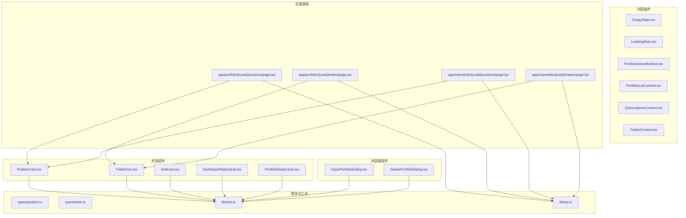

**图表来源**
- [frontend/src/components/shared/PositionCard.tsx:1-83](file://frontend/src/components/shared/PositionCard.tsx#L1-L83)
- [frontend/src/components/shared/TradeForm.tsx:1-137](file://frontend/src/components/shared/TradeForm.tsx#L1-L137)
- [frontend/src/components/shared/StatCard.tsx:1-100](file://frontend/src/components/shared/StatCard.tsx#L1-L100)
- [frontend/src/components/shared/DashboardStatsCards.tsx:1-120](file://frontend/src/components/shared/DashboardStatsCards.tsx#L1-L120)
- [frontend/src/components/shared/PortfolioStatsCards.tsx:1-150](file://frontend/src/components/shared/PortfolioStatsCards.tsx#L1-L150)
- [frontend/src/components/shared/dialogs/ClosePortfolioDialog.tsx:1-80](file://frontend/src/components/shared/dialogs/ClosePortfolioDialog.tsx#L1-L80)
- [frontend/src/components/shared/dialogs/DeletePortfolioDialog.tsx:1-80](file://frontend/src/components/shared/dialogs/DeletePortfolioDialog.tsx#L1-L80)

## 核心组件
- **PositionCard**：以只读卡片形式展示单个持仓的关键指标，支持点击回调；通过参数化 props 接收数据，内部使用工具函数进行格式化与颜色判定。
- **TradeForm**：提供买入/卖出切换、产品选择、金额/份额与价格输入、交易日期选择与提交流程；通过受控表单与事件回调完成数据绑定与提交。
- **StatCard**：通用统计卡片组件，支持标题、数值、变化趋势、图标等配置，用于展示关键指标和统计数据。
- **DashboardStatsCards**：仪表板统计卡片集合，组合多个StatCard组件展示综合统计数据。
- **PortfolioStatsCards**：投资组合专用统计卡片，展示组合相关的财务指标和表现数据。
- **对话框组件**：提供标准化的模态对话框界面，包括关闭投资组合和删除投资组合的标准操作对话框。

**章节来源**
- [frontend/src/components/shared/PositionCard.tsx:6-30](file://frontend/src/components/shared/PositionCard.tsx#L6-L30)
- [frontend/src/components/shared/TradeForm.tsx:10-46](file://frontend/src/components/shared/TradeForm.tsx#L10-L46)
- [frontend/src/components/shared/StatCard.tsx:1-100](file://frontend/src/components/shared/StatCard.tsx#L1-L100)
- [frontend/src/components/shared/DashboardStatsCards.tsx:1-120](file://frontend/src/components/shared/DashboardStatsCards.tsx#L1-L120)
- [frontend/src/components/shared/PortfolioStatsCards.tsx:1-150](file://frontend/src/components/shared/PortfolioStatsCards.tsx#L1-L150)
- [frontend/src/components/shared/dialogs/ClosePortfolioDialog.tsx:1-80](file://frontend/src/components/shared/dialogs/ClosePortfolioDialog.tsx#L1-L80)
- [frontend/src/components/shared/dialogs/DeletePortfolioDialog.tsx:1-80](file://frontend/src/components/shared/dialogs/DeletePortfolioDialog.tsx#L1-L80)

## 架构总览
共享组件与页面层之间通过 React Hooks 进行数据拉取与状态变更，API 层负责与后端交互，工具函数提供格式化与颜色判定能力，UI Store 提供全局状态（如 Toast 通知）。新增的统计卡片组件专注于数据展示，对话框组件提供标准的用户交互模式。

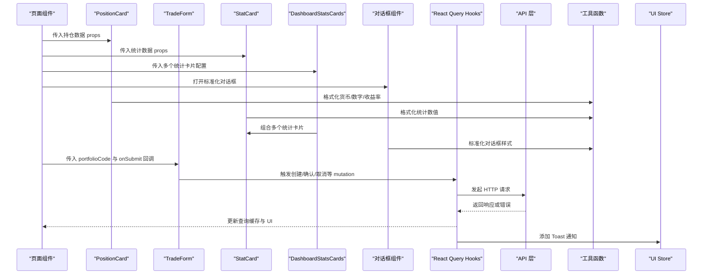

**图表来源**
- [frontend/src/app/portfolio/[code]/positions/page.tsx](file://frontend/src/app/portfolio/[code]/positions/page.tsx#L64-L240)
- [frontend/src/app/portfolio/[code]/trades/page.tsx](file://frontend/src/app/portfolio/[code]/trades/page.tsx#L33-L120)
- [frontend/src/components/shared/PositionCard.tsx:19-83](file://frontend/src/components/shared/PositionCard.tsx#L19-L83)
- [frontend/src/components/shared/StatCard.tsx:1-100](file://frontend/src/components/shared/StatCard.tsx#L1-L100)
- [frontend/src/components/shared/DashboardStatsCards.tsx:1-120](file://frontend/src/components/shared/DashboardStatsCards.tsx#L1-L120)
- [frontend/src/components/shared/dialogs/ClosePortfolioDialog.tsx:1-80](file://frontend/src/components/shared/dialogs/ClosePortfolioDialog.tsx#L1-L80)

## 组件详解

### PositionCard 设计与实现
- **参数化设计**：通过 props 接收产品标识、名称、市场、份额、成本价、当前价、市值、盈亏与收益率等字段，支持可选字段与空值安全处理。
- **数据绑定与格式化**：内部使用工具函数进行货币、数字与收益率格式化，并根据盈亏值动态选择颜色类名。
- **交互设计**：支持点击回调 onClick，便于页面层跳转或查看详情。
- **通用性**：不依赖具体页面上下文，可在桌面端与移动端页面复用。

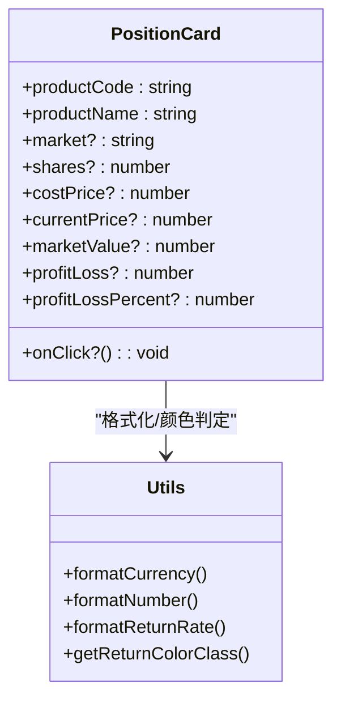

**图表来源**
- [frontend/src/components/shared/PositionCard.tsx:6-51](file://frontend/src/components/shared/PositionCard.tsx#L6-L51)
- [frontend/src/lib/utils.ts:66-177](file://frontend/src/lib/utils.ts#L66-L177)

**章节来源**
- [frontend/src/components/shared/PositionCard.tsx:19-83](file://frontend/src/components/shared/PositionCard.tsx#L19-L83)
- [frontend/src/lib/utils.ts:66-177](file://frontend/src/lib/utils.ts#L66-L177)

### TradeForm 设计与实现
- **参数化设计**：接收 portfolioCode、onSubmit 回调与可选的 isSubmitting 状态，用于控制提交按钮禁用态。
- **表单状态**：内部维护受控表单状态，支持买入/卖出切换、产品代码输入、金额/份额与价格输入、交易日期选择。
- **事件传递**：handleSubmit 将表单数据转换为 TradeFormData 并调用 onSubmit，由页面层决定如何处理（例如通过 useCreateTrade 提交）。
- **交互反馈**：根据 isSubmitting 控制按钮禁用与加载图标，提升用户体验。

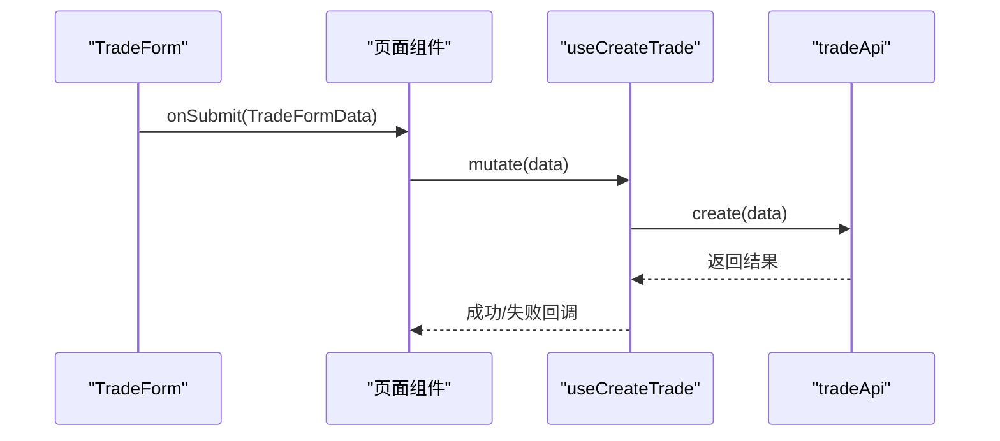

**图表来源**
- [frontend/src/components/shared/TradeForm.tsx:25-46](file://frontend/src/components/shared/TradeForm.tsx#L25-L46)
- [frontend/src/hooks/useTrade.ts:49-77](file://frontend/src/hooks/useTrade.ts#L49-L77)

**章节来源**
- [frontend/src/components/shared/TradeForm.tsx:25-137](file://frontend/src/components/shared/TradeForm.tsx#L25-L137)
- [frontend/src/hooks/useTrade.ts:49-77](file://frontend/src/hooks/useTrade.ts#L49-L77)

### StatCard 统计卡片组件
- **通用统计展示**：支持标题、数值、变化趋势、图标等配置，适用于各种统计数据的展示。
- **灵活配置**：通过 props 接收统计类型、数值格式、变化方向等参数，支持正负变化的颜色区分。
- **格式化支持**：集成工具函数进行数值格式化，支持货币、百分比、数字等格式化需求。
- **响应式设计**：适配不同屏幕尺寸，确保在桌面端和移动端的一致展示效果。

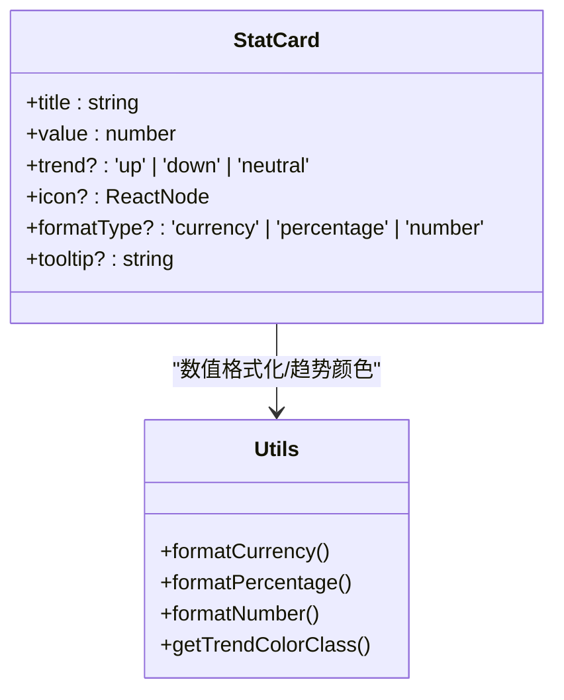

**图表来源**
- [frontend/src/components/shared/StatCard.tsx:1-100](file://frontend/src/components/shared/StatCard.tsx#L1-L100)
- [frontend/src/lib/utils.ts:66-210](file://frontend/src/lib/utils.ts#L66-L210)

**章节来源**
- [frontend/src/components/shared/StatCard.tsx:1-100](file://frontend/src/components/shared/StatCard.tsx#L1-L100)
- [frontend/src/lib/utils.ts:66-210](file://frontend/src/lib/utils.ts#L66-L210)

### DashboardStatsCards 仪表板统计卡片
- **组合展示**：整合多个 StatCard 组件，形成仪表板式的统计信息展示布局。
- **网格布局**：采用响应式网格系统，自动适应不同屏幕尺寸的显示需求。
- **数据聚合**：从多个数据源收集统计信息，统一格式化和展示。
- **性能优化**：通过虚拟化和懒加载技术，确保大量统计数据的流畅展示。

**章节来源**
- [frontend/src/components/shared/DashboardStatsCards.tsx:1-120](file://frontend/src/components/shared/DashboardStatsCards.tsx#L1-L120)

### PortfolioStatsCards 投资组合统计卡片
- **组合专用**：专门针对投资组合数据设计的统计卡片组件。
- **财务指标**：展示组合的净资产、收益、风险指标等关键财务数据。
- **实时更新**：支持与后端 API 的实时数据同步，确保统计信息的准确性。
- **交互功能**：提供数据钻取和详情查看功能，支持用户深入了解组合表现。

**章节来源**
- [frontend/src/components/shared/PortfolioStatsCards.tsx:1-150](file://frontend/src/components/shared/PortfolioStatsCards.tsx#L1-L150)

### 对话框组件设计模式
- **标准化界面**：提供统一的对话框外观和交互模式，确保用户体验的一致性。
- **生命周期管理**：包含打开、关闭、确认、取消等标准操作流程。
- **表单集成**：支持在对话框中嵌入表单组件，实现复杂操作的分步引导。
- **错误处理**：内置错误状态管理和用户友好的错误提示机制。

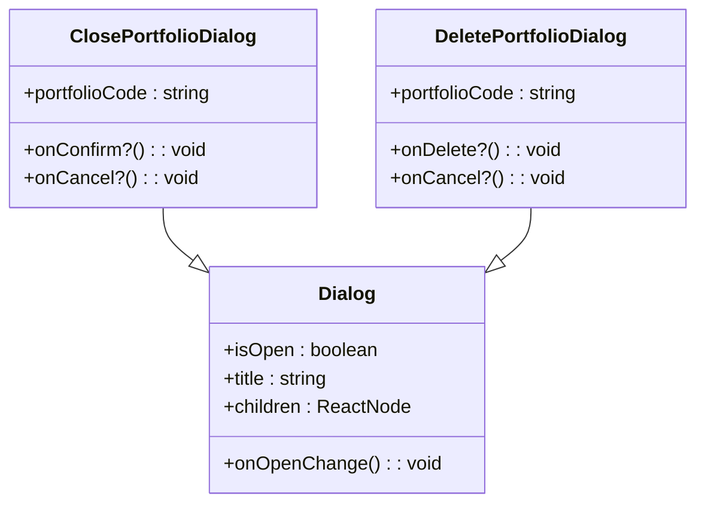

**图表来源**
- [frontend/src/components/shared/dialogs/ClosePortfolioDialog.tsx:1-80](file://frontend/src/components/shared/dialogs/ClosePortfolioDialog.tsx#L1-L80)
- [frontend/src/components/shared/dialogs/DeletePortfolioDialog.tsx:1-80](file://frontend/src/components/shared/dialogs/DeletePortfolioDialog.tsx#L1-L80)

**章节来源**
- [frontend/src/components/shared/dialogs/ClosePortfolioDialog.tsx:1-80](file://frontend/src/components/shared/dialogs/ClosePortfolioDialog.tsx#L1-L80)
- [frontend/src/components/shared/dialogs/DeletePortfolioDialog.tsx:1-80](file://frontend/src/components/shared/dialogs/DeletePortfolioDialog.tsx#L1-L80)

### 页面级复用与数据流
- **桌面端与移动端页面**均引入共享组件，实现一致的交互体验与数据展示。
- **PositionCard**在桌面端与移动端页面中被循环渲染，展示多条持仓记录。
- **TradeForm**在桌面端与移动端页面中作为弹窗或对话框使用，提交交易数据。
- **统计卡片组件**在仪表板页面中组合使用，提供全面的数据概览。
- **对话框组件**在各种操作场景中提供标准化的用户交互界面。

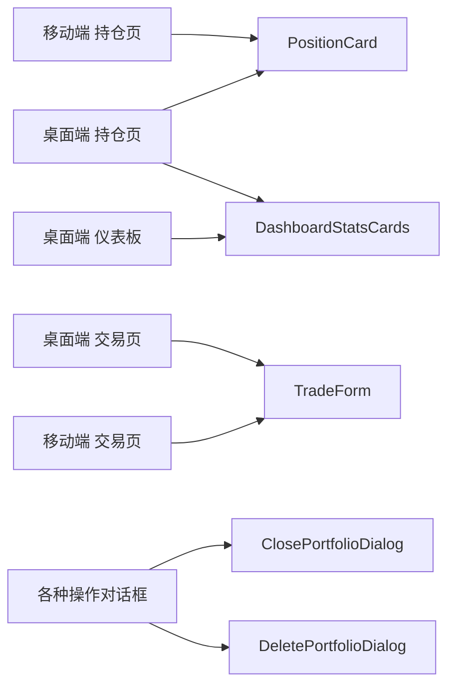

**图表来源**
- [frontend/src/app/portfolio/[code]/positions/page.tsx](file://frontend/src/app/portfolio/[code]/positions/page.tsx#L48-L225)
- [frontend/src/app/portfolio/[code]/trades/page.tsx](file://frontend/src/app/portfolio/[code]/trades/page.tsx#L37-L120)
- [frontend/src/app/m/portfolio/[code]/positions/page.tsx](file://frontend/src/app/m/portfolio/[code]/positions/page.tsx#L48-L225)
- [frontend/src/app/m/portfolio/[code]/trades/page.tsx](file://frontend/src/app/m/portfolio/[code]/trades/page.tsx#L3-L7)

**章节来源**
- [frontend/src/app/portfolio/[code]/positions/page.tsx](file://frontend/src/app/portfolio/[code]/positions/page.tsx#L48-L225)
- [frontend/src/app/portfolio/[code]/trades/page.tsx](file://frontend/src/app/portfolio/[code]/trades/page.tsx#L37-L120)
- [frontend/src/app/m/portfolio/[code]/positions/page.tsx](file://frontend/src/app/m/portfolio/[code]/positions/page.tsx#L48-L225)
- [frontend/src/app/m/portfolio/[code]/trades/page.tsx](file://frontend/src/app/m/portfolio/[code]/trades/page.tsx#L3-L7)

## 依赖关系分析
- **组件依赖工具函数**：格式化与颜色判定，保证展示一致性与可读性。
- **页面依赖 React Query Hooks**：统一管理查询与变更，避免重复的异步逻辑。
- **API 层集中封装**：统一请求/响应处理、错误拦截与状态码处理。
- **UI Store**：集中管理 Toast 通知与全局 UI 状态，降低组件间耦合。
- **新增统计组件**：依赖工具函数进行数据格式化，支持多种统计展示模式。
- **对话框组件**：依赖标准化的对话框接口，提供一致的用户交互体验。

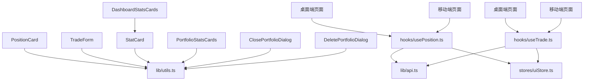

**图表来源**
- [frontend/src/components/shared/PositionCard.tsx:3-4](file://frontend/src/components/shared/PositionCard.tsx#L3-L4)
- [frontend/src/components/shared/TradeForm.tsx:3-8](file://frontend/src/components/shared/TradeForm.tsx#L3-L8)
- [frontend/src/components/shared/StatCard.tsx:1-100](file://frontend/src/components/shared/StatCard.tsx#L1-L100)
- [frontend/src/components/shared/DashboardStatsCards.tsx:1-120](file://frontend/src/components/shared/DashboardStatsCards.tsx#L1-L120)
- [frontend/src/components/shared/PortfolioStatsCards.tsx:1-150](file://frontend/src/components/shared/PortfolioStatsCards.tsx#L1-L150)
- [frontend/src/components/shared/dialogs/ClosePortfolioDialog.tsx:1-80](file://frontend/src/components/shared/dialogs/ClosePortfolioDialog.tsx#L1-L80)
- [frontend/src/components/shared/dialogs/DeletePortfolioDialog.tsx:1-80](file://frontend/src/components/shared/dialogs/DeletePortfolioDialog.tsx#L1-L80)

**章节来源**
- [frontend/src/lib/utils.ts:66-210](file://frontend/src/lib/utils.ts#L66-L210)
- [frontend/src/hooks/usePosition.ts:10-87](file://frontend/src/hooks/usePosition.ts#L10-L87)
- [frontend/src/hooks/useTrade.ts:22-204](file://frontend/src/hooks/useTrade.ts#L22-L204)
- [frontend/src/lib/api.ts:193-269](file://frontend/src/lib/api.ts#L193-L269)
- [frontend/src/stores/uiStore.ts:40-85](file://frontend/src/stores/uiStore.ts#L40-L85)

## 性能考量
- **查询缓存与失效**：React Query 的 staleTime 与 queryClient.invalidateQueries 用于控制缓存新鲜度与手动刷新，减少不必要的请求。
- **受控表单**：TradeForm 使用受控组件，避免非必要的重渲染。
- **条件渲染**：PositionCard 对可选字段进行条件渲染，减少 DOM 渲染开销。
- **工具函数复用**：格式化与颜色判定逻辑集中在 utils，避免重复计算。
- **移动端与桌面端复用**：共享组件减少重复实现，降低包体与维护成本。
- **统计卡片优化**：DashboardStatsCards 采用虚拟化技术，支持大数据量的统计信息展示。
- **对话框延迟加载**：对话框组件按需加载，减少初始包体大小。

**章节来源**
- [frontend/src/hooks/usePosition.ts:14-28](file://frontend/src/hooks/usePosition.ts#L14-L28)
- [frontend/src/hooks/useTrade.ts:31-62](file://frontend/src/hooks/useTrade.ts#L31-L62)
- [frontend/src/components/shared/PositionCard.tsx:54-79](file://frontend/src/components/shared/PositionCard.tsx#L54-L79)
- [frontend/src/components/shared/TradeForm.tsx:25-46](file://frontend/src/components/shared/TradeForm.tsx#L25-L46)
- [frontend/src/lib/utils.ts:66-177](file://frontend/src/lib/utils.ts#L66-L177)

## 故障排查指南
- **错误拦截与提示**：API 层统一拦截 401 并跳转登录，其他错误通过 handleApiError 统一抛出 ApiException，页面层通过 UI Store 添加 Toast 提示。
- **表单校验**：TradeForm 与页面层对必填项与数值范围进行校验，失败时通过 Toast 提示用户。
- **查询失败**：React Query 的 onError 回调中统一添加 Toast，便于用户感知错误原因。
- **统计卡片异常**：当统计数据为空或格式异常时，StatCard 组件提供默认占位符和错误状态显示。
- **对话框问题**：对话框组件提供标准化的错误处理和用户反馈机制。

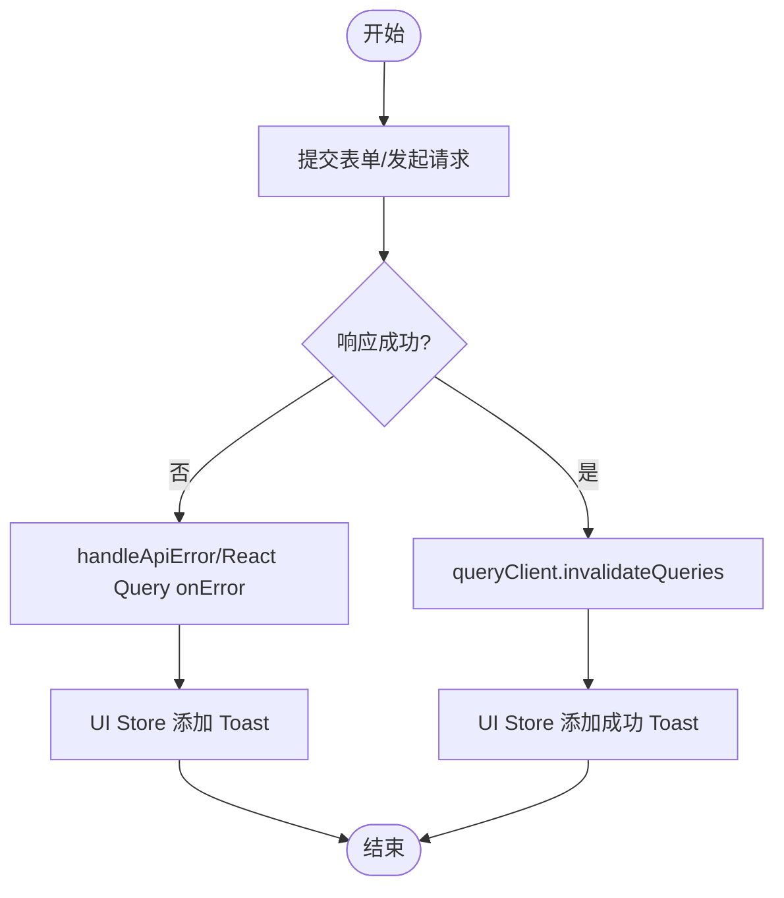

**图表来源**
- [frontend/src/lib/api.ts:67-79](file://frontend/src/lib/api.ts#L67-L79)
- [frontend/src/lib/api.ts:94-107](file://frontend/src/lib/api.ts#L94-L107)
- [frontend/src/hooks/useTrade.ts:53-76](file://frontend/src/hooks/useTrade.ts#L53-L76)
- [frontend/src/stores/uiStore.ts:61-74](file://frontend/src/stores/uiStore.ts#L61-L74)

**章节来源**
- [frontend/src/lib/api.ts:67-79](file://frontend/src/lib/api.ts#L67-L79)
- [frontend/src/lib/api.ts:94-107](file://frontend/src/lib/api.ts#L94-L107)
- [frontend/src/hooks/useTrade.ts:53-76](file://frontend/src/hooks/useTrade.ts#L53-L76)
- [frontend/src/stores/uiStore.ts:61-74](file://frontend/src/stores/uiStore.ts#L61-L74)

## 结论
投资组合管理的共享组件生态系统已发展为包含基础展示组件、统计卡片组件和对话框组件的完整解决方案。PositionCard 与 TradeForm 通过参数化设计、受控表单与统一的工具函数/API 层，实现了高内聚、低耦合的共享组件体系。新增的 StatCard、DashboardStatsCards、PortfolioStatsCards 以及对话框组件进一步丰富了组件生态，提供了更强大的数据展示和用户交互能力。它们在桌面端与移动端页面中复用，结合 React Query 的查询缓存与 UI Store 的全局状态管理，提供了良好的用户体验与可维护性。建议在后续迭代中进一步完善单元测试与可视化测试覆盖，持续优化性能与扩展性。

## 附录

### 数据模型与类型
- **持仓类型**：包含产品代码、市场、份额、成本价、单位价、市值、快照日期等字段。
- **交易类型**：包含组合代码、产品代码、交易类型、份额/金额、价格、费用、交易日期、状态等字段。
- **统计卡片类型**：包含标题、数值、变化趋势、格式类型、工具提示等配置字段。

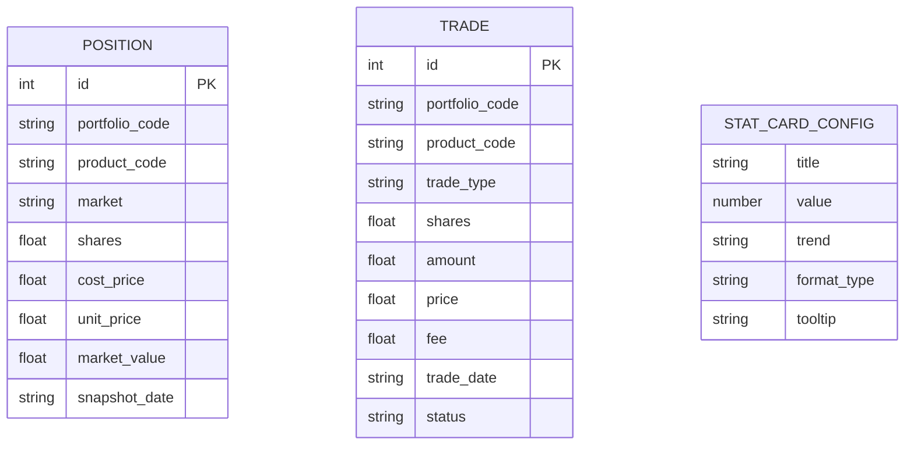

**图表来源**
- [frontend/src/types/position.ts:1-16](file://frontend/src/types/position.ts#L1-L16)
- [frontend/src/types/trade.ts:1-19](file://frontend/src/types/trade.ts#L1-L19)

**章节来源**
- [frontend/src/types/position.ts:1-44](file://frontend/src/types/position.ts#L1-L44)
- [frontend/src/types/trade.ts:1-46](file://frontend/src/types/trade.ts#L1-L46)

### 事件与状态同步流程（桌面端）
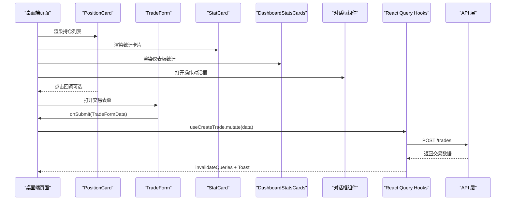

**图表来源**
- [frontend/src/app/portfolio/[code]/positions/page.tsx](file://frontend/src/app/portfolio/[code]/positions/page.tsx#L64-L240)
- [frontend/src/app/portfolio/[code]/trades/page.tsx](file://frontend/src/app/portfolio/[code]/trades/page.tsx#L33-L120)
- [frontend/src/components/shared/TradeForm.tsx:35-46](file://frontend/src/components/shared/TradeForm.tsx#L35-L46)
- [frontend/src/components/shared/StatCard.tsx:1-100](file://frontend/src/components/shared/StatCard.tsx#L1-L100)
- [frontend/src/components/shared/DashboardStatsCards.tsx:1-120](file://frontend/src/components/shared/DashboardStatsCards.tsx#L1-L120)

**章节来源**
- [frontend/src/app/portfolio/[code]/positions/page.tsx](file://frontend/src/app/portfolio/[code]/positions/page.tsx#L64-L240)
- [frontend/src/app/portfolio/[code]/trades/page.tsx](file://frontend/src/app/portfolio/[code]/trades/page.tsx#L33-L120)
- [frontend/src/components/shared/TradeForm.tsx:35-46](file://frontend/src/components/shared/TradeForm.tsx#L35-L46)
- [frontend/src/components/shared/StatCard.tsx:1-100](file://frontend/src/components/shared/StatCard.tsx#L1-L100)
- [frontend/src/components/shared/DashboardStatsCards.tsx:1-120](file://frontend/src/components/shared/DashboardStatsCards.tsx#L1-L120)