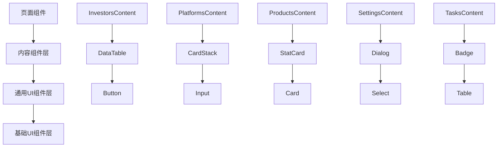
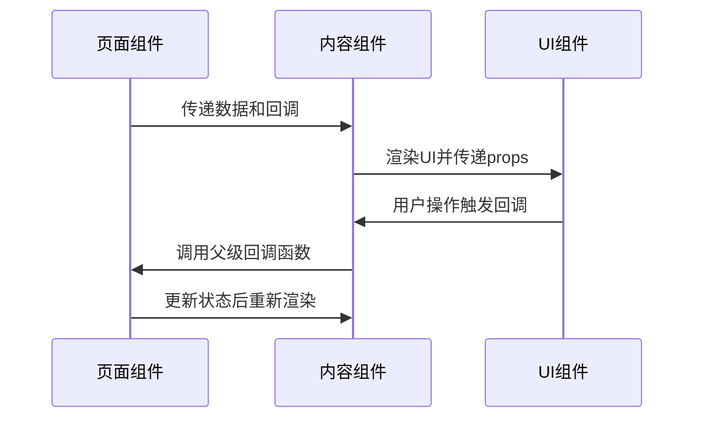
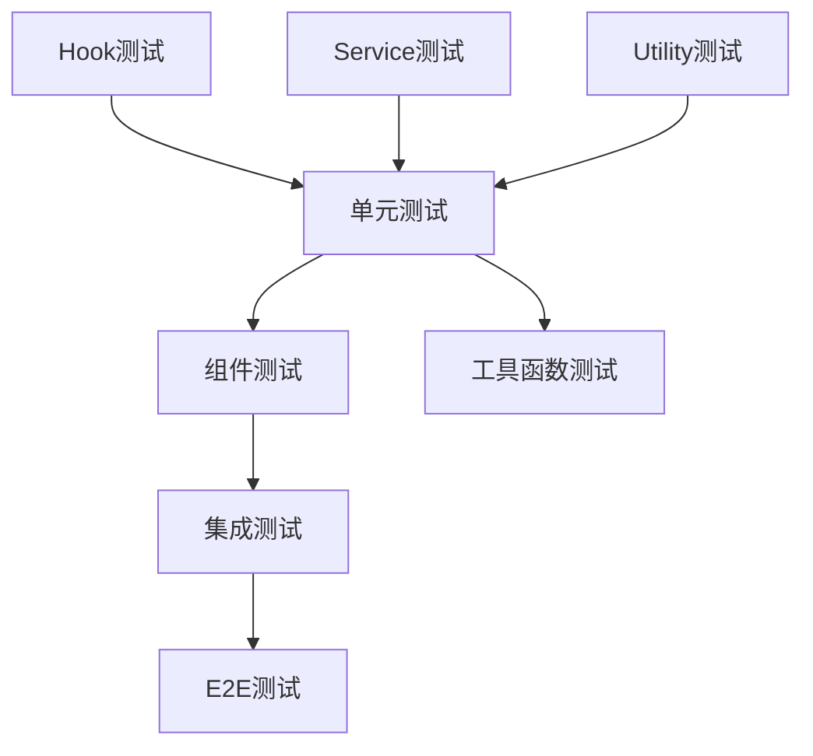
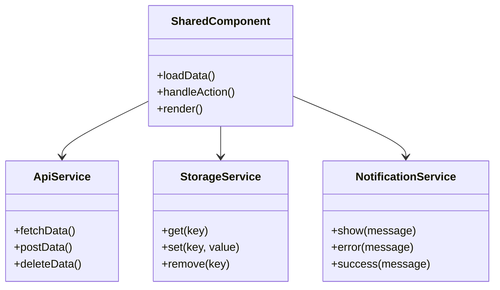

# 共享组件

<cite>
**本文档引用的文件**
- [InvestorsContent.tsx](file://frontend/src/components/shared/InvestorsContent.tsx)
- [PlatformsContent.tsx](file://frontend/src/components/shared/PlatformsContent.tsx)
- [ProductsContent.tsx](file://frontend/src/components/shared/ProductsContent.tsx)
- [SettingsContent.tsx](file://frontend/src/components/shared/SettingsContent.tsx)
- [TasksContent.tsx](file://frontend/src/components/shared/TasksContent.tsx)
- [PositionCard.tsx](file://frontend/src/components/shared/PositionCard.tsx)
- [SubscriptionsContent.tsx](file://frontend/src/components/shared/SubscriptionsContent.tsx)
- [TradesContent.tsx](file://frontend/src/components/shared/TradesContent.tsx)
- [DashboardStatsCards.tsx](file://frontend/src/components/shared/DashboardStatsCards.tsx)
- [PortfolioListContent.tsx](file://frontend/src/components/shared/PortfolioListContent.tsx)
- [PortfolioStatsCards.tsx](file://frontend/src/components/shared/PortfolioStatsCards.tsx)
- [EmptyState.tsx](file://frontend/src/components/shared/EmptyState.tsx)
- [LoadingState.tsx](file://frontend/src/components/shared/LoadingState.tsx)
- [PortfolioActionButtons.tsx](file://frontend/src/components/shared/PortfolioActionButtons.tsx)
</cite>

## 更新摘要
**所做更改**
- 移除了已删除的StatCard.tsx和TradeForm.tsx组件相关文档
- 更新了共享组件架构，反映当前可用的组件列表
- 调整了通用UI组件章节，移除不存在的组件引用
- 优化了数据绑定与状态管理示例，使用现有组件替代
- 更新了扩展性与自定义配置部分，移除对已删除组件的依赖

## 目录
- 概述
- 共享组件架构设计
- 核心内容组件
- 通用UI组件
- 数据绑定与状态管理
- 事件传递机制
- 跨平台复用策略
- 性能优化考虑
- 扩展性与自定义配置
- 单元测试策略
- 业务逻辑解耦设计

## 概述

共享组件是投资组合管理系统中的核心抽象层，旨在通过统一的组件架构消除移动端和桌面端的重复代码。该架构包含多个专门的内容组件（Content Components）和通用UI组件，为整个应用提供一致的用户体验和开发体验。

### 设计原则

1. **单一职责原则**：每个组件专注于特定的业务功能
2. **参数化配置**：通过props实现灵活的组件定制
3. **状态提升**：将状态提升到合适的层级进行统一管理
4. **事件驱动**：使用回调函数实现组件间的通信
5. **响应式设计**：支持移动端和桌面端的自适应布局

## 共享组件架构设计

共享组件采用分层架构设计，将业务逻辑与UI展示分离，确保组件的可维护性和可测试性。



**图表来源**
- [InvestorsContent.tsx](file://frontend/src/components/shared/InvestorsContent.tsx)
- [PlatformsContent.tsx](file://frontend/src/components/shared/PlatformsContent.tsx)
- [ProductsContent.tsx](file://frontend/src/components/shared/ProductsContent.tsx)

### 组件层次结构

1. **页面组件层**：负责路由和业务编排
2. **内容组件层**：封装特定业务领域的完整功能
3. **通用UI组件层**：提供可复用的UI元素组合
4. **基础UI组件层**：原子化的UI构建块

**章节来源**
- [InvestorsContent.tsx](file://frontend/src/components/shared/InvestorsContent.tsx)
- [PlatformsContent.tsx](file://frontend/src/components/shared/PlatformsContent.tsx)
- [ProductsContent.tsx](file://frontend/src/components/shared/ProductsContent.tsx)

## 核心内容组件

### InvestorsContent - 投资者管理组件

投资者管理组件提供了完整的投资者CRUD操作界面，支持搜索、筛选、分页等功能。

```typescript
interface InvestorsContentProps {
  investors: Investor[];
  onInvestorAction: (action: string, investorId?: string) => void;
  isLoading: boolean;
  error?: Error | null;
}
```

**主要功能特性：**
- 投资者列表展示与搜索
- 批量操作支持
- 响应式表格布局
- 错误处理和加载状态

**章节来源**
- [InvestorsContent.tsx](file://frontend/src/components/shared/InvestorsContent.tsx)

### PlatformsContent - 交易平台管理组件

交易平台管理组件用于管理和配置各种投资平台，支持平台的增删改查操作。

**核心功能：**
- 平台信息展示与管理
- 连接状态监控
- API配置管理
- 同步状态显示

**章节来源**
- [PlatformsContent.tsx](file://frontend/src/components/shared/PlatformsContent.tsx)

### ProductsContent - 产品管理组件

产品管理组件处理投资产品的全生命周期管理，包括产品信息维护和市场数据同步。

**关键特性：**
- 产品目录管理
- 市场数据集成
- 价格历史查询
- 分类标签系统

**章节来源**
- [ProductsContent.tsx](file://frontend/src/components/shared/ProductsContent.tsx)

### SettingsContent - 设置管理组件

设置管理组件提供系统配置和用户偏好设置的管理界面。

**功能范围：**
- 系统参数配置
- 用户偏好设置
- 通知设置管理
- 主题切换支持

**章节来源**
- [SettingsContent.tsx](file://frontend/src/components/shared/SettingsContent.tsx)

### TasksContent - 任务管理组件

任务管理组件用于监控系统任务和定时任务的执行状态。

**管理功能：**
- 任务列表展示
- 执行状态监控
- 日志查看功能
- 手动触发控制

**章节来源**
- [TasksContent.tsx](file://frontend/src/components/shared/TasksContent.tsx)

## 通用UI组件

### PositionCard - 持仓卡片组件

持仓卡片组件以卡片形式展示单个持仓的详细信息，支持快速操作和状态更新。

**显示信息：**
- 产品名称和代码
- 持仓数量和市值
- 盈亏情况和收益率
- 最新价格和变动

**交互功能：**
- 快速交易入口
- 持仓详情展开
- 状态实时更新
- 响应式布局适配

**章节来源**
- [PositionCard.tsx](file://frontend/src/components/shared/PositionCard.tsx)

### SubscriptionsContent - 订阅管理组件

订阅管理组件处理基金订阅和赎回操作的完整流程。

**管理功能：**
- 订阅记录查看
- 申购赎回操作
- 份额变更记录
- 手续费计算

**章节来源**
- [SubscriptionsContent.tsx](file://frontend/src/components/shared/SubscriptionsContent.tsx)

### TradesContent - 交易记录组件

交易记录组件展示所有交易历史的完整列表，支持筛选和导出功能。

**功能特性：**
- 交易历史记录
- 多维度筛选
- 批量操作支持
- 数据导出功能

**章节来源**
- [TradesContent.tsx](file://frontend/src/components/shared/TradesContent.tsx)

### DashboardStatsCards - 仪表板统计卡片

仪表板统计卡片组件用于展示关键业务指标的概览信息。

**统计指标：**
- 总资产价值
- 日收益情况
- 持仓数量统计
- 收益率趋势

**章节来源**
- [DashboardStatsCards.tsx](file://frontend/src/components/shared/DashboardStatsCards.tsx)

### PortfolioStatsCards - 投资组合统计卡片

投资组合统计卡片组件专门用于展示投资组合的详细统计数据。

**统计功能：**
- 组合净值变化
- 资产配置比例
- 风险指标展示
- 业绩基准对比

**章节来源**
- [PortfolioStatsCards.tsx](file://frontend/src/components/shared/PortfolioStatsCards.tsx)

### PortfolioListContent - 投资组合列表组件

投资组合列表组件提供投资组合的完整管理界面。

**管理功能：**
- 组合列表展示
- 创建新组合
- 组合详情查看
- 批量操作支持

**章节来源**
- [PortfolioListContent.tsx](file://frontend/src/components/shared/PortfolioListContent.tsx)

### PortfolioActionButtons - 投资组合操作按钮

投资组合操作按钮组件提供针对投资组合的各种操作入口。

**操作功能：**
- 新建交易
- 资金转账
- 组合关闭
- 数据导出

**章节来源**
- [PortfolioActionButtons.tsx](file://frontend/src/components/shared/PortfolioActionButtons.tsx)

**已移除组件说明**
- **StatCard.tsx**：原通用统计卡片组件，功能已整合到DashboardStatsCards和PortfolioStatsCards中
- **TradeForm.tsx**：原交易表单组件，功能已分散到各个交易相关的页面组件中

## 数据绑定与状态管理

### 单向数据流

共享组件遵循React的单向数据流原则，通过props向下传递数据，通过回调函数向上提交变更。



**图表来源**
- [InvestorsContent.tsx](file://frontend/src/components/shared/InvestorsContent.tsx)
- [PositionCard.tsx](file://frontend/src/components/shared/PositionCard.tsx)

### 状态管理模式

1. **本地状态**：组件内部使用useState管理临时状态
2. **全局状态**：使用Zustand或Context管理应用级状态
3. **服务器状态**：使用React Query管理异步数据状态

**最佳实践：**
- 避免在组件中直接修改外部状态
- 使用不可变数据结构
- 合理拆分状态粒度
- 实现状态持久化

## 事件传递机制

### 回调函数模式

组件间通信主要通过回调函数实现，确保数据的单向流动和状态的可预测性。

```typescript
// 子组件向父组件传递事件
const handleUserAction = useCallback((action: string, data?: any) => {
  // 处理用户操作
  if (onAction) {
    onAction(action, data);
  }
}, [onAction]);

// 父组件监听子组件事件
<InvestorsContent 
  onInvestorAction={handleInvestorAction}
  investors={investors}
/>
```

### 事件类型定义

```typescript
type ComponentEvent = 
  | 'create'
  | 'update' 
  | 'delete'
  | 'refresh'
  | 'export'
  | 'filter';
```

**章节来源**
- [InvestorsContent.tsx](file://frontend/src/components/shared/InvestorsContent.tsx)
- [PlatformsContent.tsx](file://frontend/src/components/shared/PlatformsContent.tsx)

## 跨平台复用策略

### 响应式设计

共享组件采用移动优先的设计策略，确保在不同屏幕尺寸下的良好用户体验。

**设计原则：**
- 触摸友好的交互设计
- 自适应布局系统
- 性能优化的图片加载
- 离线缓存支持

### 平台特定适配

```typescript
// 平台检测
const isMobile = useMediaQuery('(max-width: 768px)');

// 条件渲染
{isMobile ? <MobileLayout /> : <DesktopLayout />}
```

**章节来源**
- [MainLayout.tsx](file://frontend/src/components/layout/MainLayout.tsx)
- [MobileNav.tsx](file://frontend/src/components/layout/MobileNav.tsx)

## 性能优化考虑

### 组件懒加载

```typescript
import { lazy, Suspense } from 'react';

const HeavyComponent = lazy(() => import('./HeavyComponent'));

<Suspense fallback={<LoadingState />}>
  <HeavyComponent />
</Suspense>
```

### 内存管理

1. **事件监听器清理**：在useEffect中正确清理副作用
2. **定时器管理**：及时清除未使用的定时器
3. **大对象处理**：使用Web Worker处理大数据
4. **图片优化**：实现图片懒加载和压缩

### 渲染优化

1. **React.memo**：对纯组件进行记忆化
2. **useMemo**：缓存计算结果
3. **useCallback**：稳定函数引用
4. **虚拟滚动**：处理大量数据列表

## 扩展性与自定义配置

### 配置接口设计

```typescript
interface SharedComponentConfig {
  theme?: ThemeConfig;
  locale?: LocaleConfig;
  api?: ApiConfig;
  features?: FeatureFlags;
  customStyles?: CustomStyleOptions;
}
```

### 插件架构

共享组件支持插件化扩展，允许开发者在不修改核心代码的情况下添加新功能。

**插件接口：**
```typescript
interface ComponentPlugin {
  name: string;
  version: string;
  install: (context: PluginContext) => void;
  uninstall?: () => void;
}
```

**章节来源**
- [PortfolioActionButtons.tsx](file://frontend/src/components/shared/PortfolioActionButtons.tsx)

## 单元测试策略

### 测试金字塔



### 测试覆盖范围

1. **组件渲染测试**：验证组件的正确渲染
2. **用户交互测试**：模拟用户操作和响应
3. **状态变化测试**：验证状态管理的正确性
4. **API集成测试**：测试与后端的数据交互
5. **边界条件测试**：处理异常情况

### 测试工具链

- **Jest**：单元测试框架
- **React Testing Library**：组件测试工具
- **Mock Service Worker**：API Mock
- **Cypress**：端到端测试

## 业务逻辑解耦设计

### 依赖注入模式

共享组件通过依赖注入实现业务逻辑的解耦，便于测试和维护。

```typescript
interface Dependencies {
  apiClient: ApiClient;
  authService: AuthService;
  notificationService: NotificationService;
  storageService: StorageService;
}

class SharedComponent {
  constructor(private dependencies: Dependencies) {}
  
  async loadData() {
    const data = await this.dependencies.apiClient.fetchData();
    return this.processData(data);
  }
}
```

### 服务层抽象



**图表来源**
- [useInvestor.ts](file://frontend/src/hooks/useInvestor.ts)
- [usePlatform.ts](file://frontend/src/hooks/usePlatform.ts)
- [useProduct.ts](file://frontend/src/hooks/useProduct.ts)

### 错误处理策略

1. **统一错误捕获**：使用Error Boundary捕获组件错误
2. **用户友好提示**：提供清晰的错误信息和解决方案
3. **降级处理**：在部分功能失败时保持核心功能可用
4. **日志记录**：记录详细的错误信息便于调试

**章节来源**
- [EmptyState.tsx](file://frontend/src/components/shared/EmptyState.tsx)
- [LoadingState.tsx](file://frontend/src/components/shared/LoadingState.tsx)

## 质量保证措施

### 代码规范

1. **TypeScript严格模式**：启用严格的类型检查
2. **ESLint规则**：统一的代码风格和最佳实践
3. **Prettier格式化**：自动代码格式化工具
4. **Husky钩子**：提交前的代码质量检查

### 持续集成

1. **自动化测试**：每次提交运行完整的测试套件
2. **代码覆盖率**：监控测试覆盖率指标
3. **静态分析**：使用SonarQube进行代码质量分析
4. **安全扫描**：定期扫描依赖包的安全漏洞

### 文档维护

1. **组件文档**：使用Storybook创建交互式组件文档
2. **API文档**：自动生成TypeScript接口文档
3. **变更日志**：维护详细的版本更新记录
4. **示例代码**：提供丰富的使用示例

---

**总结**

共享组件架构为投资组合管理系统提供了坚实的基础，通过统一的组件设计和标准化的开发模式，显著提高了代码的可维护性和可扩展性。该架构不仅消除了移动端和桌面端的重复代码，还为未来的功能扩展奠定了良好的技术基础。

通过持续的优化和改进，共享组件将继续为整个应用提供稳定、高效、易用的UI基础设施，支撑业务的快速发展和创新。

**更新说明**
本次更新反映了代码清理过程中删除的StatCard.tsx和TradeForm.tsx组件。这些组件的功能已被整合到其他更专门的组件中，如DashboardStatsCards、PortfolioStatsCards和各业务页面的专用表单组件。这种重构提高了组件的专业化和可维护性。