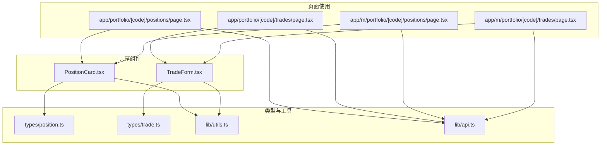
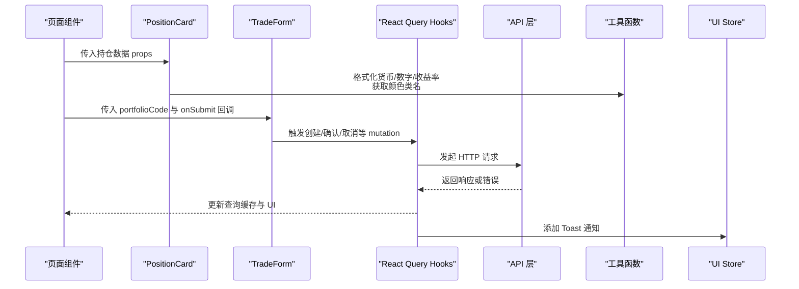
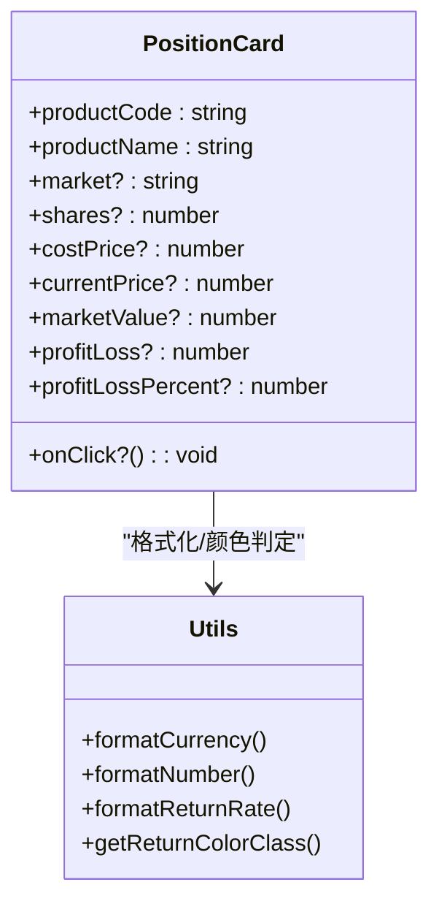
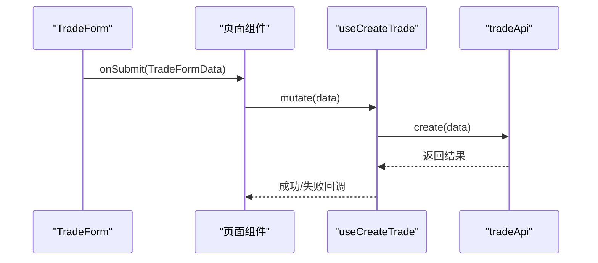
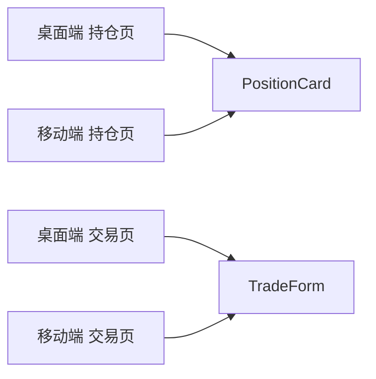
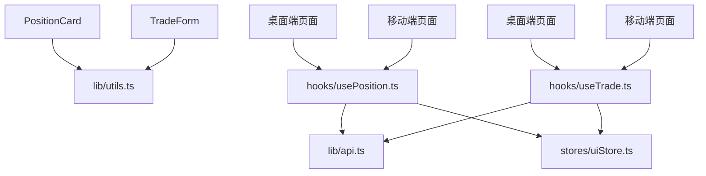
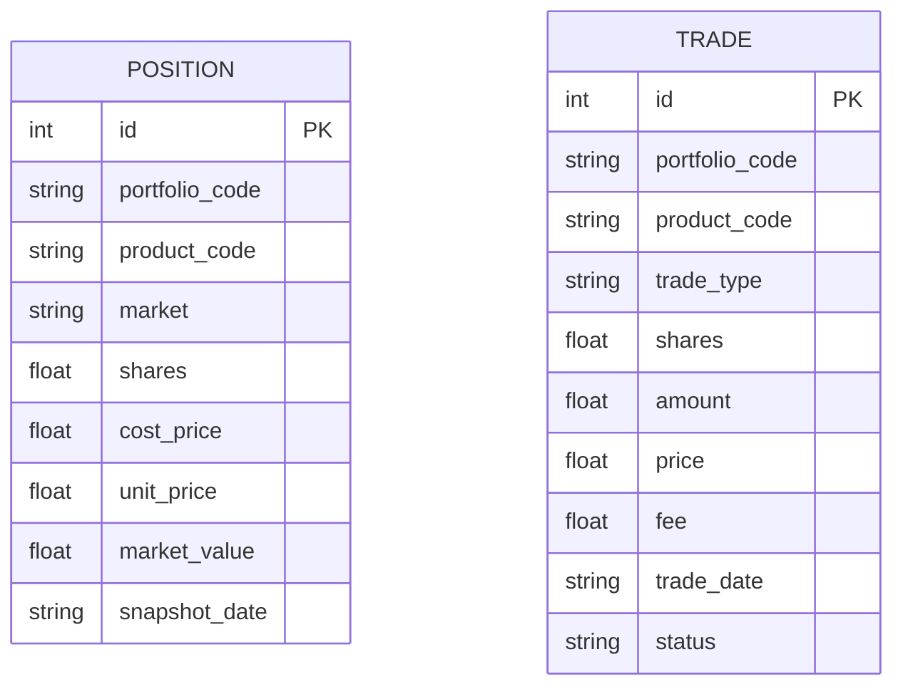
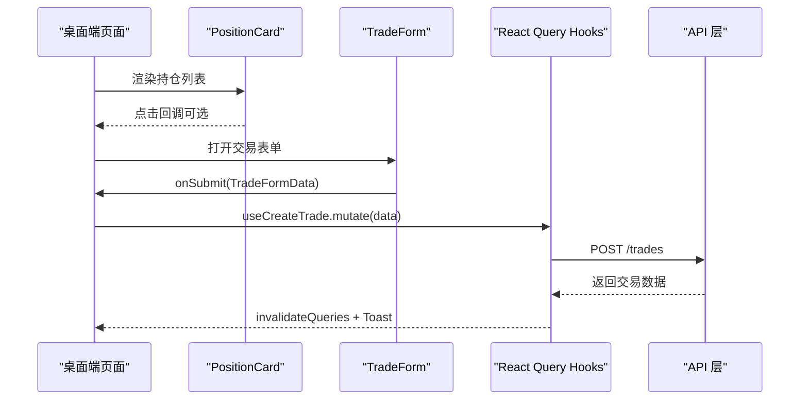

# 共享组件

<cite>
**本文引用的文件**
- [frontend/src/components/shared/PositionCard.tsx](file://frontend/src/components/shared/PositionCard.tsx)
- [frontend/src/components/shared/TradeForm.tsx](file://frontend/src/components/shared/TradeForm.tsx)
- [frontend/src/hooks/usePosition.ts](file://frontend/src/hooks/usePosition.ts)
- [frontend/src/hooks/useTrade.ts](file://frontend/src/hooks/useTrade.ts)
- [frontend/src/types/position.ts](file://frontend/src/types/position.ts)
- [frontend/src/types/trade.ts](file://frontend/src/types/trade.ts)
- [frontend/src/lib/utils.ts](file://frontend/src/lib/utils.ts)
- [frontend/src/lib/api.ts](file://frontend/src/lib/api.ts)
- [frontend/src/stores/uiStore.ts](file://frontend/src/stores/uiStore.ts)
- [frontend/src/app/portfolio/[code]/positions/page.tsx](file://frontend/src/app/portfolio/[code]/positions/page.tsx)
- [frontend/src/app/portfolio/[code]/trades/page.tsx](file://frontend/src/app/portfolio/[code]/trades/page.tsx)
- [frontend/src/app/m/portfolio/[code]/positions/page.tsx](file://frontend/src/app/m/portfolio/[code]/positions/page.tsx)
- [frontend/src/app/m/portfolio/[code]/trades/page.tsx](file://frontend/src/app/m/portfolio/[code]/trades/page.tsx)
</cite>

## 目录
1. [简介](#简介)
2. [项目结构](#项目结构)
3. [核心组件](#核心组件)
4. [架构总览](#架构总览)
5. [组件详解](#组件详解)
6. [依赖关系分析](#依赖关系分析)
7. [性能考量](#性能考量)
8. [故障排查指南](#故障排查指南)
9. [结论](#结论)
10. [附录](#附录)

## 简介
本文件聚焦于投资组合管理中的共享组件：持仓卡片（PositionCard）与交易表单（TradeForm）。文档系统性阐述其设计模式、参数化配置、数据绑定与状态同步、事件传递、跨页面复用策略、性能优化、扩展性与自定义选项、单元测试策略以及与业务逻辑层的解耦与依赖注入实践。

## 项目结构
共享组件位于前端工程的共享组件目录，配合类型定义、工具函数、API 层与页面级使用示例共同构成完整的组件生态。

**图表来源**
- [frontend/src/components/shared/PositionCard.tsx:1-83](file://frontend/src/components/shared/PositionCard.tsx#L1-L83)
- [frontend/src/components/shared/TradeForm.tsx:1-137](file://frontend/src/components/shared/TradeForm.tsx#L1-L137)
- [frontend/src/types/position.ts:1-44](file://frontend/src/types/position.ts#L1-L44)
- [frontend/src/types/trade.ts:1-46](file://frontend/src/types/trade.ts#L1-L46)
- [frontend/src/lib/utils.ts:1-270](file://frontend/src/lib/utils.ts#L1-L270)
- [frontend/src/lib/api.ts:1-627](file://frontend/src/lib/api.ts#L1-L627)
- [frontend/src/app/portfolio/[code]/positions/page.tsx](file://frontend/src/app/portfolio/[code]/positions/page.tsx#L1-L544)
- [frontend/src/app/portfolio/[code]/trades/page.tsx](file://frontend/src/app/portfolio/[code]/trades/page.tsx#L1-L330)
- [frontend/src/app/m/portfolio/[code]/positions/page.tsx](file://frontend/src/app/m/portfolio/[code]/positions/page.tsx#L1-L335)
- [frontend/src/app/m/portfolio/[code]/trades/page.tsx](file://frontend/src/app/m/portfolio/[code]/trades/page.tsx#L1-L7)

**章节来源**
- [frontend/src/components/shared/PositionCard.tsx:1-83](file://frontend/src/components/shared/PositionCard.tsx#L1-L83)
- [frontend/src/components/shared/TradeForm.tsx:1-137](file://frontend/src/components/shared/TradeForm.tsx#L1-L137)
- [frontend/src/lib/utils.ts:1-270](file://frontend/src/lib/utils.ts#L1-L270)
- [frontend/src/lib/api.ts:1-627](file://frontend/src/lib/api.ts#L1-L627)
- [frontend/src/app/portfolio/[code]/positions/page.tsx](file://frontend/src/app/portfolio/[code]/positions/page.tsx#L1-L544)
- [frontend/src/app/portfolio/[code]/trades/page.tsx](file://frontend/src/app/portfolio/[code]/trades/page.tsx#L1-L330)
- [frontend/src/app/m/portfolio/[code]/positions/page.tsx](file://frontend/src/app/m/portfolio/[code]/positions/page.tsx#L1-L335)
- [frontend/src/app/m/portfolio/[code]/trades/page.tsx](file://frontend/src/app/m/portfolio/[code]/trades/page.tsx#L1-L7)

## 核心组件
- PositionCard：以只读卡片形式展示单个持仓的关键指标，支持点击回调；通过参数化 props 接收数据，内部使用工具函数进行格式化与颜色判定。
- TradeForm：提供买入/卖出切换、产品选择、金额/份额与价格输入、交易日期选择与提交流程；通过受控表单与事件回调完成数据绑定与提交。

**章节来源**
- [frontend/src/components/shared/PositionCard.tsx:6-30](file://frontend/src/components/shared/PositionCard.tsx#L6-L30)
- [frontend/src/components/shared/TradeForm.tsx:10-46](file://frontend/src/components/shared/TradeForm.tsx#L10-L46)

## 架构总览
共享组件与页面层之间通过 React Hooks 进行数据拉取与状态变更，API 层负责与后端交互，工具函数提供格式化与颜色判定能力，UI Store 提供全局状态（如 Toast 通知）。

**图表来源**
- [frontend/src/app/portfolio/[code]/positions/page.tsx](file://frontend/src/app/portfolio/[code]/positions/page.tsx#L64-L240)
- [frontend/src/app/portfolio/[code]/trades/page.tsx](file://frontend/src/app/portfolio/[code]/trades/page.tsx#L33-L120)
- [frontend/src/components/shared/PositionCard.tsx:19-83](file://frontend/src/components/shared/PositionCard.tsx#L19-L83)
- [frontend/src/components/shared/TradeForm.tsx:25-137](file://frontend/src/components/shared/TradeForm.tsx#L25-L137)
- [frontend/src/hooks/usePosition.ts:10-87](file://frontend/src/hooks/usePosition.ts#L10-L87)
- [frontend/src/hooks/useTrade.ts:22-204](file://frontend/src/hooks/useTrade.ts#L22-L204)
- [frontend/src/lib/api.ts:193-269](file://frontend/src/lib/api.ts#L193-L269)
- [frontend/src/lib/utils.ts:66-210](file://frontend/src/lib/utils.ts#L66-L210)
- [frontend/src/stores/uiStore.ts:40-85](file://frontend/src/stores/uiStore.ts#L40-L85)

## 组件详解

### PositionCard 设计与实现
- 参数化设计：通过 props 接收产品标识、名称、市场、份额、成本价、当前价、市值、盈亏与收益率等字段，支持可选字段与空值安全处理。
- 数据绑定与格式化：内部使用工具函数进行货币、数字与收益率格式化，并根据盈亏值动态选择颜色类名。
- 交互设计：支持点击回调 onClick，便于页面层跳转或查看详情。
- 通用性：不依赖具体页面上下文，可在桌面端与移动端页面复用。

**图表来源**
- [frontend/src/components/shared/PositionCard.tsx:6-51](file://frontend/src/components/shared/PositionCard.tsx#L6-L51)
- [frontend/src/lib/utils.ts:66-177](file://frontend/src/lib/utils.ts#L66-L177)

**章节来源**
- [frontend/src/components/shared/PositionCard.tsx:19-83](file://frontend/src/components/shared/PositionCard.tsx#L19-L83)
- [frontend/src/lib/utils.ts:66-177](file://frontend/src/lib/utils.ts#L66-L177)

### TradeForm 设计与实现
- 参数化设计：接收 portfolioCode、onSubmit 回调与可选的 isSubmitting 状态，用于控制提交按钮禁用态。
- 表单状态：内部维护受控表单状态，支持买入/卖出切换、产品代码输入、金额/份额与价格输入、交易日期选择。
- 事件传递：handleSubmit 将表单数据转换为 TradeFormData 并调用 onSubmit，由页面层决定如何处理（例如通过 useCreateTrade 提交）。
- 交互反馈：根据 isSubmitting 控制按钮禁用与加载图标，提升用户体验。

**图表来源**
- [frontend/src/components/shared/TradeForm.tsx:25-46](file://frontend/src/components/shared/TradeForm.tsx#L25-L46)
- [frontend/src/hooks/useTrade.ts:49-77](file://frontend/src/hooks/useTrade.ts#L49-L77)
- [frontend/src/lib/api.ts:250-251](file://frontend/src/lib/api.ts#L250-L251)

**章节来源**
- [frontend/src/components/shared/TradeForm.tsx:25-137](file://frontend/src/components/shared/TradeForm.tsx#L25-L137)
- [frontend/src/hooks/useTrade.ts:49-77](file://frontend/src/hooks/useTrade.ts#L49-L77)
- [frontend/src/lib/api.ts:243-269](file://frontend/src/lib/api.ts#L243-L269)

### 页面级复用与数据流
- 桌面端与移动端页面均引入共享组件，实现一致的交互体验与数据展示。
- PositionCard 在桌面端与移动端页面中被循环渲染，展示多条持仓记录。
- TradeForm 在桌面端与移动端页面中作为弹窗或对话框使用，提交交易数据。

**图表来源**
- [frontend/src/app/portfolio/[code]/positions/page.tsx](file://frontend/src/app/portfolio/[code]/positions/page.tsx#L48-L225)
- [frontend/src/app/portfolio/[code]/trades/page.tsx](file://frontend/src/app/portfolio/[code]/trades/page.tsx#L37-L120)
- [frontend/src/app/m/portfolio/[code]/positions/page.tsx](file://frontend/src/app/m/portfolio/[code]/positions/page.tsx#L48-L225)
- [frontend/src/app/m/portfolio/[code]/trades/page.tsx](file://frontend/src/app/m/portfolio/[code]/trades/page.tsx#L3-L7)

**章节来源**
- [frontend/src/app/portfolio/[code]/positions/page.tsx](file://frontend/src/app/portfolio/[code]/positions/page.tsx#L48-L225)
- [frontend/src/app/portfolio/[code]/trades/page.tsx](file://frontend/src/app/portfolio/[code]/trades/page.tsx#L37-L120)
- [frontend/src/app/m/portfolio/[code]/positions/page.tsx](file://frontend/src/app/m/portfolio/[code]/positions/page.tsx#L48-L225)
- [frontend/src/app/m/portfolio/[code]/trades/page.tsx](file://frontend/src/app/m/portfolio/[code]/trades/page.tsx#L3-L7)

## 依赖关系分析
- 组件依赖工具函数：格式化与颜色判定，保证展示一致性与可读性。
- 页面依赖 React Query Hooks：统一管理查询与变更，避免重复的异步逻辑。
- API 层集中封装：统一请求/响应处理、错误拦截与状态码处理。
- UI Store：集中管理 Toast 通知与全局 UI 状态，降低组件间耦合。

**图表来源**
- [frontend/src/components/shared/PositionCard.tsx:3-4](file://frontend/src/components/shared/PositionCard.tsx#L3-L4)
- [frontend/src/components/shared/TradeForm.tsx:3-8](file://frontend/src/components/shared/TradeForm.tsx#L3-L8)
- [frontend/src/lib/utils.ts:1-270](file://frontend/src/lib/utils.ts#L1-L270)
- [frontend/src/hooks/usePosition.ts:1-87](file://frontend/src/hooks/usePosition.ts#L1-L87)
- [frontend/src/hooks/useTrade.ts:1-325](file://frontend/src/hooks/useTrade.ts#L1-L325)
- [frontend/src/lib/api.ts:1-627](file://frontend/src/lib/api.ts#L1-L627)
- [frontend/src/stores/uiStore.ts:1-85](file://frontend/src/stores/uiStore.ts#L1-L85)

**章节来源**
- [frontend/src/lib/utils.ts:66-210](file://frontend/src/lib/utils.ts#L66-L210)
- [frontend/src/hooks/usePosition.ts:10-87](file://frontend/src/hooks/usePosition.ts#L10-L87)
- [frontend/src/hooks/useTrade.ts:22-204](file://frontend/src/hooks/useTrade.ts#L22-L204)
- [frontend/src/lib/api.ts:193-269](file://frontend/src/lib/api.ts#L193-L269)
- [frontend/src/stores/uiStore.ts:40-85](file://frontend/src/stores/uiStore.ts#L40-L85)

## 性能考量
- 查询缓存与失效：React Query 的 staleTime 与 queryClient.invalidateQueries 用于控制缓存新鲜度与手动刷新，减少不必要的请求。
- 受控表单：TradeForm 使用受控组件，避免非必要的重渲染。
- 条件渲染：PositionCard 对可选字段进行条件渲染，减少 DOM 渲染开销。
- 工具函数复用：格式化与颜色判定逻辑集中在 utils，避免重复计算。
- 移动端与桌面端复用：共享组件减少重复实现，降低包体与维护成本。

**章节来源**
- [frontend/src/hooks/usePosition.ts:14-28](file://frontend/src/hooks/usePosition.ts#L14-L28)
- [frontend/src/hooks/useTrade.ts:31-62](file://frontend/src/hooks/useTrade.ts#L31-L62)
- [frontend/src/components/shared/PositionCard.tsx:54-79](file://frontend/src/components/shared/PositionCard.tsx#L54-L79)
- [frontend/src/components/shared/TradeForm.tsx:25-46](file://frontend/src/components/shared/TradeForm.tsx#L25-L46)
- [frontend/src/lib/utils.ts:66-177](file://frontend/src/lib/utils.ts#L66-L177)

## 故障排查指南
- 错误拦截与提示：API 层统一拦截 401 并跳转登录，其他错误通过 handleApiError 统一抛出 ApiException，页面层通过 UI Store 添加 Toast 提示。
- 表单校验：TradeForm 与页面层对必填项与数值范围进行校验，失败时通过 Toast 提示用户。
- 查询失败：React Query 的 onError 回调中统一添加 Toast，便于用户感知错误原因。

**图表来源**
- [frontend/src/lib/api.ts:67-79](file://frontend/src/lib/api.ts#L67-L79)
- [frontend/src/lib/api.ts:94-107](file://frontend/src/lib/api.ts#L94-L107)
- [frontend/src/hooks/useTrade.ts:53-76](file://frontend/src/hooks/useTrade.ts#L53-L76)
- [frontend/src/stores/uiStore.ts:61-74](file://frontend/src/stores/uiStore.ts#L61-L74)

**章节来源**
- [frontend/src/lib/api.ts:67-79](file://frontend/src/lib/api.ts#L67-L79)
- [frontend/src/lib/api.ts:94-107](file://frontend/src/lib/api.ts#L94-L107)
- [frontend/src/hooks/useTrade.ts:53-76](file://frontend/src/hooks/useTrade.ts#L53-L76)
- [frontend/src/stores/uiStore.ts:61-74](file://frontend/src/stores/uiStore.ts#L61-L74)

## 结论
PositionCard 与 TradeForm 通过参数化设计、受控表单与统一的工具函数/API 层，实现了高内聚、低耦合的共享组件体系。它们在桌面端与移动端页面中复用，结合 React Query 的查询缓存与 UI Store 的全局状态管理，提供了良好的用户体验与可维护性。建议在后续迭代中进一步完善单元测试与可视化测试覆盖，持续优化性能与扩展性。

## 附录

### 数据模型与类型
- 持仓类型：包含产品代码、市场、份额、成本价、单位价、市值、快照日期等字段。
- 交易类型：包含组合代码、产品代码、交易类型、份额/金额、价格、费用、交易日期、状态等字段。

**图表来源**
- [frontend/src/types/position.ts:1-16](file://frontend/src/types/position.ts#L1-L16)
- [frontend/src/types/trade.ts:1-19](file://frontend/src/types/trade.ts#L1-L19)

**章节来源**
- [frontend/src/types/position.ts:1-44](file://frontend/src/types/position.ts#L1-L44)
- [frontend/src/types/trade.ts:1-46](file://frontend/src/types/trade.ts#L1-L46)

### 事件与状态同步流程（桌面端）

**图表来源**
- [frontend/src/app/portfolio/[code]/positions/page.tsx](file://frontend/src/app/portfolio/[code]/positions/page.tsx#L64-L240)
- [frontend/src/app/portfolio/[code]/trades/page.tsx](file://frontend/src/app/portfolio/[code]/trades/page.tsx#L33-L120)
- [frontend/src/components/shared/TradeForm.tsx:35-46](file://frontend/src/components/shared/TradeForm.tsx#L35-L46)
- [frontend/src/hooks/useTrade.ts:49-77](file://frontend/src/hooks/useTrade.ts#L49-L77)
- [frontend/src/lib/api.ts:250-251](file://frontend/src/lib/api.ts#L250-L251)

**章节来源**
- [frontend/src/app/portfolio/[code]/positions/page.tsx](file://frontend/src/app/portfolio/[code]/positions/page.tsx#L64-L240)
- [frontend/src/app/portfolio/[code]/trades/page.tsx](file://frontend/src/app/portfolio/[code]/trades/page.tsx#L33-L120)
- [frontend/src/components/shared/TradeForm.tsx:35-46](file://frontend/src/components/shared/TradeForm.tsx#L35-L46)
- [frontend/src/hooks/useTrade.ts:49-77](file://frontend/src/hooks/useTrade.ts#L49-L77)
- [frontend/src/lib/api.ts:250-251](file://frontend/src/lib/api.ts#L250-L251)