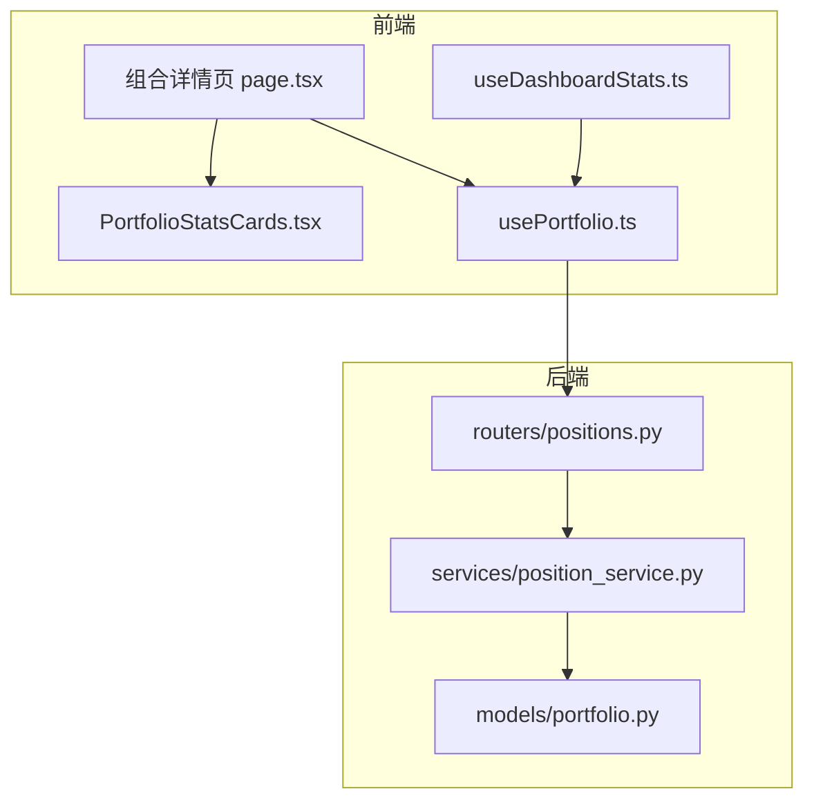
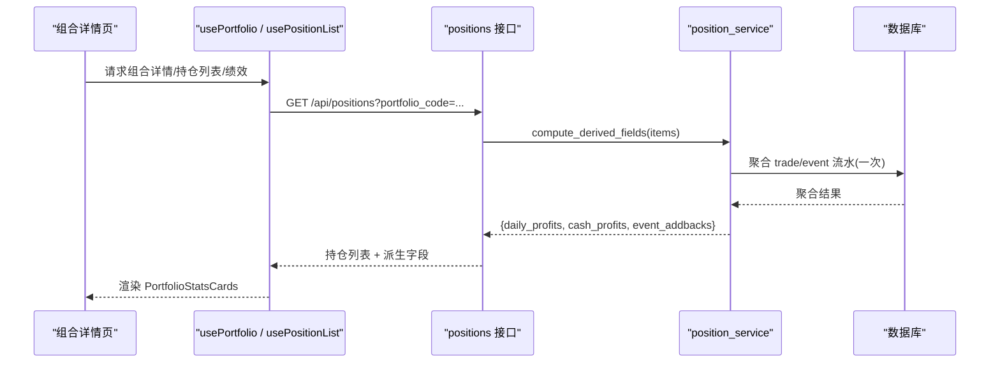
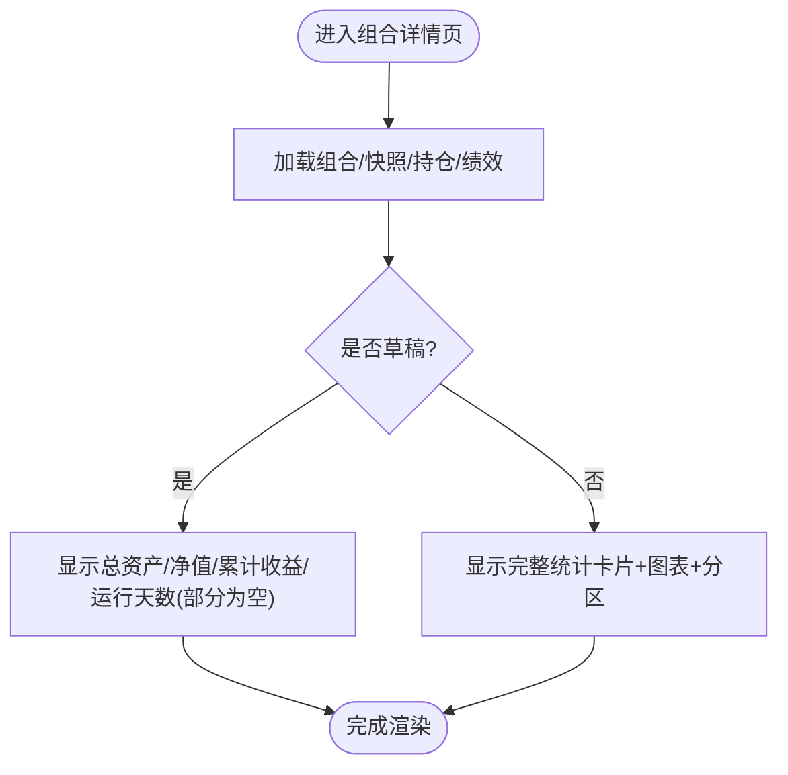
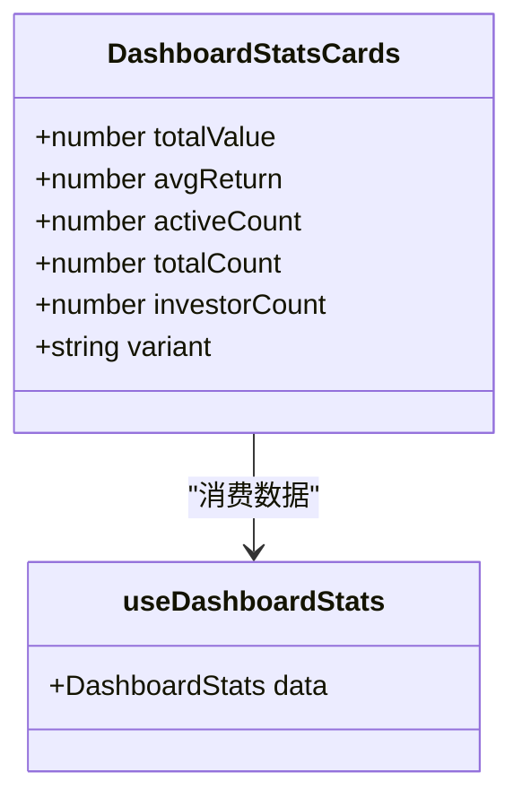
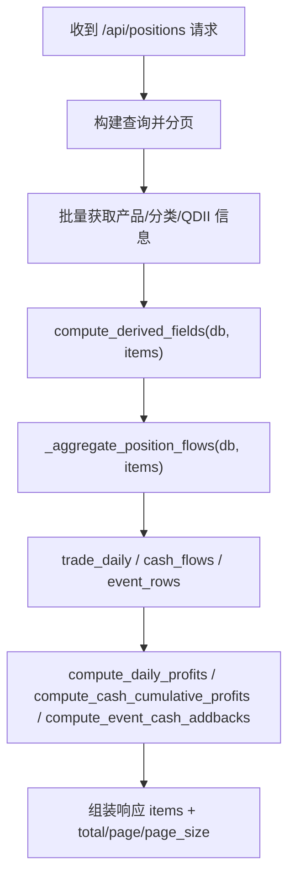
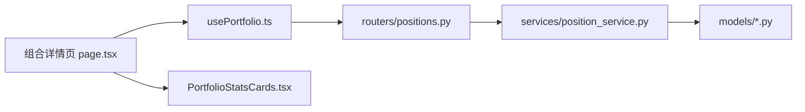

# 投资组合统计卡片

<cite>
**本文引用的文件**
- [backend/app/routers/positions.py](file://backend/app/routers/positions.py)
- [backend/app/services/position_service.py](file://backend/app/services/position_service.py)
- [frontend/src/components/shared/PortfolioStatsCards.tsx](file://frontend/src/components/shared/PortfolioStatsCards.tsx)
- [frontend/src/hooks/useDashboardStats.ts](file://frontend/src/hooks/useDashboardStats.ts)
- [frontend/src/app/portfolio/[code]/page.tsx](file://frontend/src/app/portfolio/[code]/page.tsx)
- [frontend/src/hooks/usePortfolio.ts](file://frontend/src/hooks/usePortfolio.ts)
- [backend/app/models/portfolio.py](file://backend/app/models/portfolio.py)
</cite>

## 目录
1. [简介](#简介)
2. [项目结构](#项目结构)
3. [核心组件](#核心组件)
4. [架构总览](#架构总览)
5. [详细组件分析](#详细组件分析)
6. [依赖关系分析](#依赖关系分析)
7. [性能考量](#性能考量)
8. [故障排查指南](#故障排查指南)
9. [结论](#结论)
10. [附录](#附录)

## 简介
本文件聚焦“投资组合统计卡片”的前后端实现与数据流，覆盖组合详情页的四大统计指标（总资产、净值、累计收益、运行天数）以及首页仪表盘统计卡片。同时，结合 issue #103 对 positions 接口三 compute 函数冗余聚合查询的修复，说明读侧派生字段的一次聚合优化如何支撑前端卡片的稳定展示。

## 项目结构
- 后端 FastAPI 提供组合详情、持仓列表、净值历史等接口；持仓列表接口在读取时批量计算派生字段（当日收益、现金累计收益、分红加回），并通过一次聚合避免重复查询。
- 前端 Next.js 页面通过 hooks 拉取组合信息、最新快照、持仓列表与绩效指标，渲染组合详情页的统计卡片与图表。
- 首页仪表盘使用独立的统计卡片组件聚合活跃组合资产与平均收益等指标。

**图示来源**
- [frontend/src/app/portfolio/[code]/page.tsx:53-194](file://frontend/src/app/portfolio/[code]/page.tsx#L53-L194)
- [frontend/src/components/shared/PortfolioStatsCards.tsx:31-102](file://frontend/src/components/shared/PortfolioStatsCards.tsx#L31-L102)
- [frontend/src/hooks/usePortfolio.ts:21-29](file://frontend/src/hooks/usePortfolio.ts#L21-L29)
- [backend/app/routers/positions.py:24-112](file://backend/app/routers/positions.py#L24-L112)
- [backend/app/services/position_service.py:113-426](file://backend/app/services/position_service.py#L113-L426)
- [backend/app/models/portfolio.py:5-16](file://backend/app/models/portfolio.py#L5-L16)

**章节来源**
- [frontend/src/app/portfolio/[code]/page.tsx:53-194](file://frontend/src/app/portfolio/[code]/page.tsx#L53-L194)
- [frontend/src/components/shared/PortfolioStatsCards.tsx:31-102](file://frontend/src/components/shared/PortfolioStatsCards.tsx#L31-L102)
- [frontend/src/hooks/usePortfolio.ts:21-29](file://frontend/src/hooks/usePortfolio.ts#L21-L29)
- [backend/app/routers/positions.py:24-112](file://backend/app/routers/positions.py#L24-L112)
- [backend/app/services/position_service.py:113-426](file://backend/app/services/position_service.py#L113-L426)
- [backend/app/models/portfolio.py:5-16](file://backend/app/models/portfolio.py#L5-L16)

## 核心组件
- 组合详情页统计卡片：展示总资产、净值、累计收益、运行天数，支持桌面与移动端布局切换。
- 首页仪表盘统计卡片：展示总资产、平均累计收益、活跃组合数、投资人数量。
- 后端持仓列表接口：批量计算派生字段（当日收益、现金累计收益、分红加回），通过一次聚合减少数据库查询次数。

**章节来源**
- [frontend/src/components/shared/PortfolioStatsCards.tsx:31-102](file://frontend/src/components/shared/PortfolioStatsCards.tsx#L31-L102)
- [frontend/src/components/shared/DashboardStatsCards.tsx:29-107](file://frontend/src/components/shared/DashboardStatsCards.tsx#L29-L107)
- [backend/app/routers/positions.py:24-112](file://backend/app/routers/positions.py#L24-L112)
- [backend/app/services/position_service.py:113-426](file://backend/app/services/position_service.py#L113-L426)

## 架构总览
组合详情页的数据获取与渲染流程如下：
- 页面通过 usePortfolio 获取组合基本信息与最新快照，通过 usePositionList 获取持仓列表，通过 usePortfolioPerformance 获取绩效指标。
- 后端 positions 接口在返回持仓列表时，调用 position_service 的一次聚合函数 compute_derived_fields，产出三个派生字典供前端消费。
- 前端将组合信息与快照数据映射到 PortfolioStatsCards 组件进行展示。

**图示来源**
- [frontend/src/app/portfolio/[code]/page.tsx:53-194](file://frontend/src/app/portfolio/[code]/page.tsx#L53-L194)
- [frontend/src/hooks/usePortfolio.ts:21-29](file://frontend/src/hooks/usePortfolio.ts#L21-L29)
- [backend/app/routers/positions.py:24-112](file://backend/app/routers/positions.py#L24-L112)
- [backend/app/services/position_service.py:113-426](file://backend/app/services/position_service.py#L113-L426)

## 详细组件分析

### 组合详情页统计卡片
- 数据来源：组合基本信息来自 usePortfolio(code)，最新快照来自 useLatestSnapshot(code)，持仓列表来自 usePositionList(code)，绩效指标来自 usePortfolioPerformance(code)。
- 展示逻辑：根据是否为草稿状态决定是否展示净值与绩效；总资产优先使用组合 total_value，否则回退到快照 total_value；净值取自快照 unit_price；累计收益取自组合 total_profit；运行天数取自绩效 holding_days。
- 组件特性：支持 desktop/mobile 两种布局，统一数据源，仅布局差异。

**图示来源**
- [frontend/src/app/portfolio/[code]/page.tsx:53-194](file://frontend/src/app/portfolio/[code]/page.tsx#L53-L194)
- [frontend/src/components/shared/PortfolioStatsCards.tsx:31-102](file://frontend/src/components/shared/PortfolioStatsCards.tsx#L31-L102)

**章节来源**
- [frontend/src/app/portfolio/[code]/page.tsx:53-194](file://frontend/src/app/portfolio/[code]/page.tsx#L53-L194)
- [frontend/src/components/shared/PortfolioStatsCards.tsx:31-102](file://frontend/src/components/shared/PortfolioStatsCards.tsx#L31-L102)
- [frontend/src/hooks/usePortfolio.ts:21-29](file://frontend/src/hooks/usePortfolio.ts#L21-L29)

### 首页仪表盘统计卡片
- 数据来源：通过 useDashboardStats 聚合活跃组合、订阅、交易、投资人列表，计算总资产与平均累计收益。
- 展示逻辑：桌面端与移动端共用同一数据源，仅布局不同；包含总资产、平均累计收益、活跃组合数、投资人数量四项。

**图示来源**
- [frontend/src/components/shared/DashboardStatsCards.tsx:29-107](file://frontend/src/components/shared/DashboardStatsCards.tsx#L29-L107)
- [frontend/src/hooks/useDashboardStats.ts:28-66](file://frontend/src/hooks/useDashboardStats.ts#L28-L66)

**章节来源**
- [frontend/src/components/shared/DashboardStatsCards.tsx:29-107](file://frontend/src/components/shared/DashboardStatsCards.tsx#L29-L107)
- [frontend/src/hooks/useDashboardStats.ts:28-66](file://frontend/src/hooks/useDashboardStats.ts#L28-L66)

### 后端持仓列表接口与派生字段计算
- 入口：GET /api/positions，支持按 portfolio_code、snapshot_date 过滤与分页。
- 派生字段：通过 compute_derived_fields 一次性聚合 trade/event 流水，产出 daily_profits、cash_profits、event_addbacks 三个字典，供后续利润与收益率计算使用。
- 正确性保障：三个 compute 函数接收外部传入的 flows，内部不再重复聚合；超集聚合后按行级条件过滤，确保结果一致。

**图示来源**
- [backend/app/routers/positions.py:24-112](file://backend/app/routers/positions.py#L24-L112)
- [backend/app/services/position_service.py:113-426](file://backend/app/services/position_service.py#L113-L426)

**章节来源**
- [backend/app/routers/positions.py:24-112](file://backend/app/routers/positions.py#L24-L112)
- [backend/app/services/position_service.py:113-426](file://backend/app/services/position_service.py#L113-L426)

## 依赖关系分析
- 前端依赖：
  - 组合详情页依赖 usePortfolio、useLatestSnapshot、usePositionList、usePortfolioPerformance。
  - 统计卡片组件依赖格式化与颜色工具函数。
- 后端依赖：
  - positions 路由依赖 position_service 的 compute_derived_fields。
  - position_service 依赖 Trade、ShareChangeEvent、PortfolioPosition 等模型进行聚合计算。
  - Portfolio 模型用于组合基础信息查询。

**图示来源**
- [frontend/src/app/portfolio/[code]/page.tsx:53-194](file://frontend/src/app/portfolio/[code]/page.tsx#L53-L194)
- [frontend/src/hooks/usePortfolio.ts:21-29](file://frontend/src/hooks/usePortfolio.ts#L21-L29)
- [backend/app/routers/positions.py:24-112](file://backend/app/routers/positions.py#L24-L112)
- [backend/app/services/position_service.py:113-426](file://backend/app/services/position_service.py#L113-L426)
- [backend/app/models/portfolio.py:5-16](file://backend/app/models/portfolio.py#L5-L16)

**章节来源**
- [frontend/src/app/portfolio/[code]/page.tsx:53-194](file://frontend/src/app/portfolio/[code]/page.tsx#L53-L194)
- [frontend/src/hooks/usePortfolio.ts:21-29](file://frontend/src/hooks/usePortfolio.ts#L21-L29)
- [backend/app/routers/positions.py:24-112](file://backend/app/routers/positions.py#L24-L112)
- [backend/app/services/position_service.py:113-426](file://backend/app/services/position_service.py#L113-L426)
- [backend/app/models/portfolio.py:5-16](file://backend/app/models/portfolio.py#L5-L16)

## 性能考量
- 一次聚合优化：issue #103 将三个 compute 函数的内部聚合合并为一次 _aggregate_position_flows，减少重复查询，提升响应效率。
- 批量查询：派生字段计算采用批量查询与内存映射，避免 N+1 问题。
- 前端缓存：hooks 使用 staleTime 控制缓存过期时间，减少频繁请求。

[本节为通用性能指导，不直接分析具体文件]

## 故障排查指南
- 组合详情页数据为空：检查组合状态是否为草稿；草稿状态下净值与绩效可能为空。
- 统计卡片数值异常：确认后端 positions 接口是否正确返回派生字段；验证 compute_derived_fields 是否被调用且返回非空。
- 首页仪表盘统计不准确：检查 useDashboardStats 聚合逻辑与数据源是否完整。

**章节来源**
- [frontend/src/app/portfolio/[code]/page.tsx:53-194](file://frontend/src/app/portfolio/[code]/page.tsx#L53-L194)
- [backend/app/routers/positions.py:24-112](file://backend/app/routers/positions.py#L24-L112)
- [backend/app/services/position_service.py:113-426](file://backend/app/services/position_service.py#L113-L426)
- [frontend/src/hooks/useDashboardStats.ts:28-66](file://frontend/src/hooks/useDashboardStats.ts#L28-L66)

## 结论
投资组合统计卡片通过前后端协作实现了清晰的指标展示与稳定的数据流。后端通过一次聚合优化提升了持仓列表接口的性能，前端则通过可复用的统计卡片组件提供了一致的视觉体验。整体设计兼顾了可读性与可扩展性，便于后续功能迭代。

[本节为总结性内容，不直接分析具体文件]

## 附录
- 相关接口与组件路径参考：
  - 组合详情页：[frontend/src/app/portfolio/[code]/page.tsx](file://frontend/src/app/portfolio/[code]/page.tsx)
  - 统计卡片组件：[frontend/src/components/shared/PortfolioStatsCards.tsx](file://frontend/src/components/shared/PortfolioStatsCards.tsx)
  - 仪表盘统计卡片：[frontend/src/components/shared/DashboardStatsCards.tsx](file://frontend/src/components/shared/DashboardStatsCards.tsx)
  - 持仓接口与服务：[backend/app/routers/positions.py](file://backend/app/routers/positions.py)、[backend/app/services/position_service.py](file://backend/app/services/position_service.py)
  - 组合模型：[backend/app/models/portfolio.py](file://backend/app/models/portfolio.py)

[本节为附录，不直接分析具体文件]