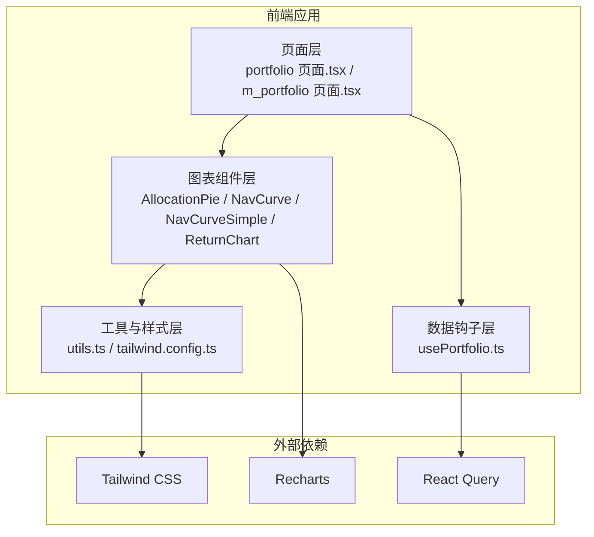
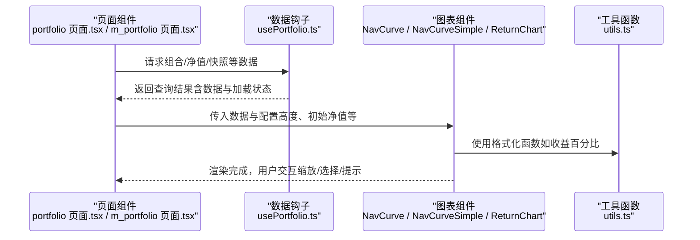
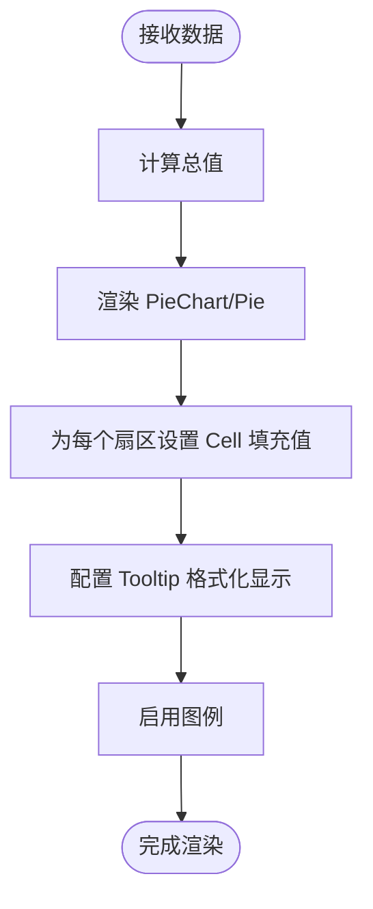
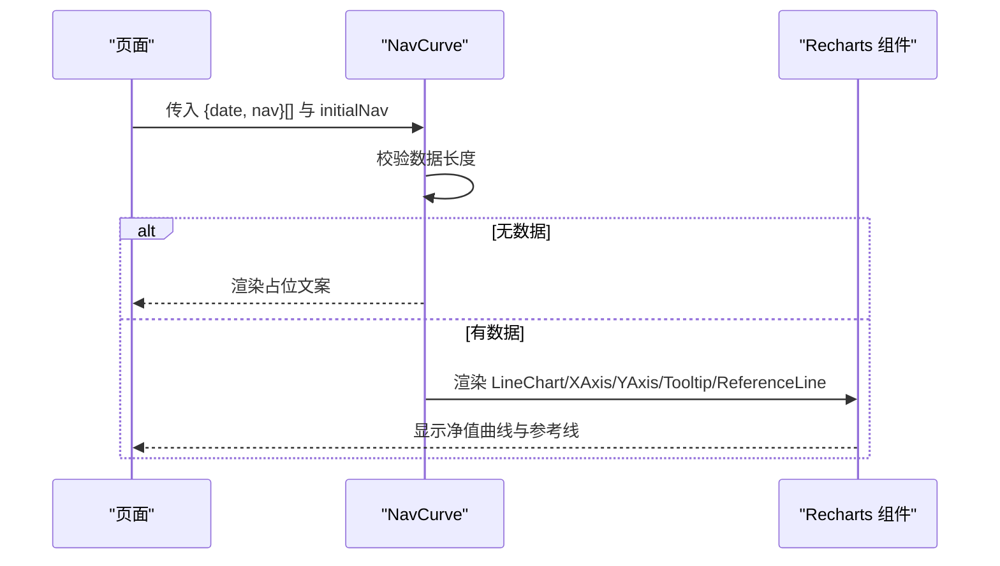
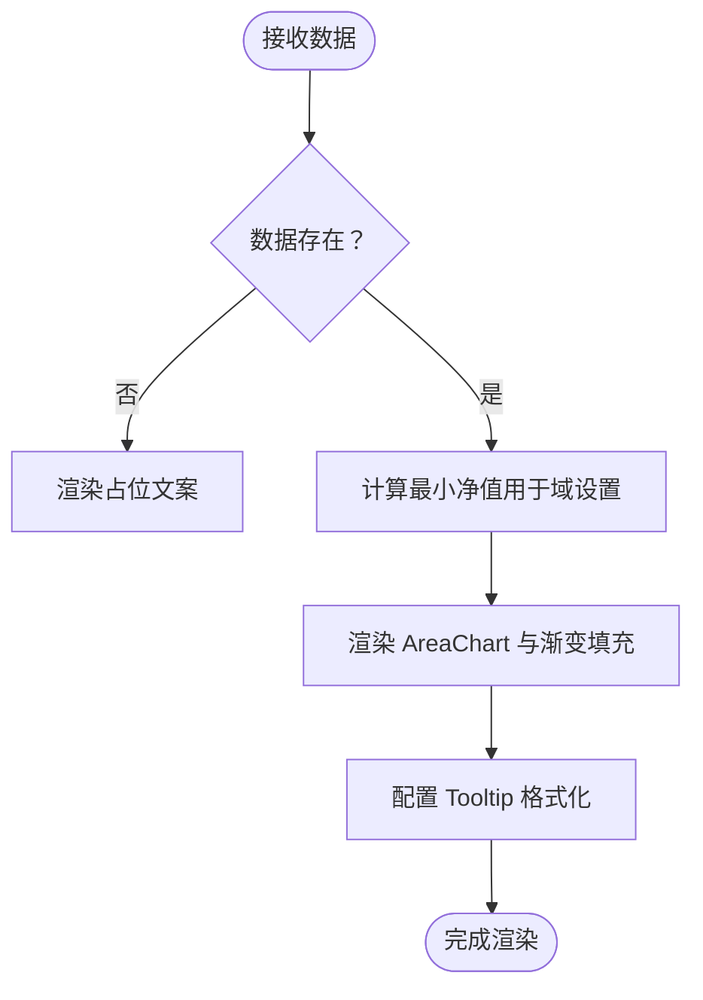
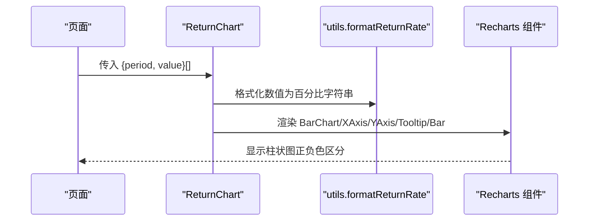
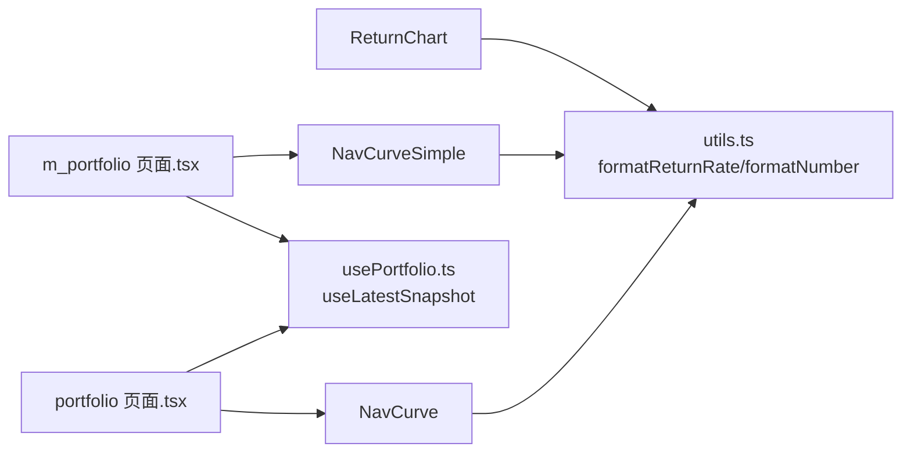
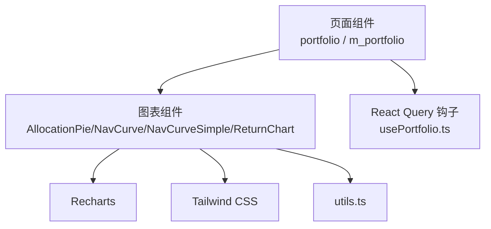

# 图表组件

<cite>
**本文引用的文件**   
- [AllocationPie.tsx](file://frontend/src/components/charts/AllocationPie.tsx)
- [NavCurve.tsx](file://frontend/src/components/charts/NavCurve.tsx)
- [NavCurveSimple.tsx](file://frontend/src/components/charts/NavCurveSimple.tsx)
- [ReturnChart.tsx](file://frontend/src/components/charts/ReturnChart.tsx)
- [utils.ts](file://frontend/src/lib/utils.ts)
- [package.json](file://frontend/package.json)
- [tailwind.config.ts](file://frontend/tailwind.config.ts)
- [portfolio 页面.tsx](file://frontend/src/app/portfolio/[code]/page.tsx)
- [m_portfolio 页面.tsx](file://frontend/src/app/m/portfolio/[code]/page.tsx)
- [usePortfolio.ts](file://frontend/src/hooks/usePortfolio.ts)
</cite>

## 目录
1. [简介](#简介)
2. [项目结构](#项目结构)
3. [核心组件](#核心组件)
4. [架构总览](#架构总览)
5. [详细组件分析](#详细组件分析)
6. [依赖关系分析](#依赖关系分析)
7. [性能考虑](#性能考虑)
8. [故障排查指南](#故障排查指南)
9. [结论](#结论)
10. [附录](#附录)

## 简介
本文件面向前端工程师与数据可视化开发者，系统化梳理 InvestRing 项目中图表组件的设计与实现，重点覆盖：
- 资产配置饼图（AllocationPie）的数据可视化与交互设计
- 净值曲线图（NavCurve、NavCurveSimple）的时间序列数据处理与动态更新机制
- 收益率图表（ReturnChart）的计算逻辑与展示优化
- 图表组件的响应式设计与多分辨率适配策略
- 图表数据的格式化、过滤与聚合处理方案
- 大数据量渲染的性能优化技巧与交互功能（缩放、选择、工具提示）实践

## 项目结构
图表组件位于前端工程的组件目录下，采用“按功能模块划分”的组织方式，配合 Recharts 进行可视化，Tailwind CSS 提供样式基础，React Query 管理数据获取与缓存。

**图表来源**
- [portfolio 页面.tsx:1-491](file://frontend/src/app/portfolio/[code]/page.tsx#L1-L491)
- [m_portfolio 页面.tsx:1-249](file://frontend/src/app/m/portfolio/[code]/page.tsx#L1-L249)
- [AllocationPie.tsx:1-63](file://frontend/src/components/charts/AllocationPie.tsx#L1-L63)
- [NavCurve.tsx:1-70](file://frontend/src/components/charts/NavCurve.tsx#L1-L70)
- [NavCurveSimple.tsx:1-66](file://frontend/src/components/charts/NavCurveSimple.tsx#L1-L66)
- [ReturnChart.tsx:1-49](file://frontend/src/components/charts/ReturnChart.tsx#L1-L49)
- [utils.ts:1-270](file://frontend/src/lib/utils.ts#L1-L270)
- [tailwind.config.ts:1-57](file://frontend/tailwind.config.ts#L1-L57)

**章节来源**
- [package.json:1-45](file://frontend/package.json#L1-L45)
- [tailwind.config.ts:1-57](file://frontend/tailwind.config.ts#L1-L57)

## 核心组件
- AllocationPie：资产配置饼图，支持自定义高度、颜色与百分比标签，使用 Recharts 的 Pie/PieChart/Cell/Tooltip/Legend 组合实现。
- NavCurve：净值曲线图（复杂版），支持初始净值参考线、网格、坐标轴格式化与工具提示；在无数据时显示占位文案。
- NavCurveSimple：净值曲线图（简洁版），采用面积图与渐变填充，强调趋势与视觉层次；同样具备占位与格式化能力。
- ReturnChart：收益率柱状图，支持正负颜色区分、百分比格式化与工具提示；通过外部格式化函数统一收益展示。

**章节来源**
- [AllocationPie.tsx:1-63](file://frontend/src/components/charts/AllocationPie.tsx#L1-L63)
- [NavCurve.tsx:1-70](file://frontend/src/components/charts/NavCurve.tsx#L1-L70)
- [NavCurveSimple.tsx:1-66](file://frontend/src/components/charts/NavCurveSimple.tsx#L1-L66)
- [ReturnChart.tsx:1-49](file://frontend/src/components/charts/ReturnChart.tsx#L1-L49)

## 架构总览
图表组件与页面、数据钩子、工具函数之间的协作关系如下：

**图表来源**
- [portfolio 页面.tsx:24-422](file://frontend/src/app/portfolio/[code]/page.tsx#L24-L422)
- [m_portfolio 页面.tsx:14-218](file://frontend/src/app/m/portfolio/[code]/page.tsx#L14-L218)
- [usePortfolio.ts:164-185](file://frontend/src/hooks/usePortfolio.ts#L164-L185)
- [utils.ts:146-159](file://frontend/src/lib/utils.ts#L146-L159)

## 详细组件分析

### 资产配置饼图（AllocationPie）
- 数据模型与渲染
  - 输入数据为对象数组，每个元素包含名称与数值字段；组件内部计算总数用于百分比显示。
  - 使用 Pie/PieChart/Cell/Tooltip/Legend 组合，Cell 填充色支持自定义或默认色板循环。
- 交互与展示
  - 鼠标悬停显示数值与占比；图例辅助识别各分类。
  - 响应式容器保证在不同宽度下保持比例一致。
- 设计要点
  - 默认色板与分类数量解耦，避免颜色重复。
  - 百分比标签格式化，提升可读性。

**图表来源**
- [AllocationPie.tsx:27-62](file://frontend/src/components/charts/AllocationPie.tsx#L27-L62)

**章节来源**
- [AllocationPie.tsx:1-63](file://frontend/src/components/charts/AllocationPie.tsx#L1-L63)

### 净值曲线图（NavCurve）
- 数据模型与渲染
  - 输入为时间序列点集合，每点包含日期与净值；支持初始净值参考线。
- 动态更新机制
  - 无数据时显示占位文案；坐标轴与工具提示均进行格式化处理。
- 展示优化
  - 网格与单调样条曲线增强趋势可读性；参考线帮助对比基准。

**图表来源**
- [NavCurve.tsx:25-70](file://frontend/src/components/charts/NavCurve.tsx#L25-L70)

**章节来源**
- [NavCurve.tsx:1-70](file://frontend/src/components/charts/NavCurve.tsx#L1-L70)

### 净值曲线图（NavCurveSimple）
- 数据模型与渲染
  - 输入与 NavCurve 相同，但采用面积图与线性渐变填充，强调趋势与空间感。
- 展示优化
  - Y 轴域根据最小净值微调，减少空白区域；坐标轴刻度与宽度精细化。
  - 工具提示与网格保持一致风格。

**图表来源**
- [NavCurveSimple.tsx:23-66](file://frontend/src/components/charts/NavCurveSimple.tsx#L23-L66)

**章节来源**
- [NavCurveSimple.tsx:1-66](file://frontend/src/components/charts/NavCurveSimple.tsx#L1-L66)

### 收益率图表（ReturnChart）
- 数据模型与渲染
  - 输入为周期与数值的点集，数值为百分比形式；正负值使用不同颜色。
- 计算逻辑与展示优化
  - 使用外部格式化函数统一百分比显示；工具提示与坐标轴刻度格式化。
- 交互设计
  - 柱状图支持悬停高亮与单元格颜色切换，直观表达涨跌。

**图表来源**
- [ReturnChart.tsx:25-49](file://frontend/src/components/charts/ReturnChart.tsx#L25-L49)
- [utils.ts:146-159](file://frontend/src/lib/utils.ts#L146-L159)

**章节来源**
- [ReturnChart.tsx:1-49](file://frontend/src/components/charts/ReturnChart.tsx#L1-L49)
- [utils.ts:146-159](file://frontend/src/lib/utils.ts#L146-L159)

### 页面集成与数据流
- 桌面端与移动端页面分别引入不同净值图表组件，并通过 React Query 钩子获取数据。
- 页面负责状态管理（如收益率类型切换）、错误与加载态处理，并将数据传递给图表组件。

**图表来源**
- [portfolio 页面.tsx:24-422](file://frontend/src/app/portfolio/[code]/page.tsx#L24-L422)
- [m_portfolio 页面.tsx:14-218](file://frontend/src/app/m/portfolio/[code]/page.tsx#L14-L218)
- [usePortfolio.ts:164-185](file://frontend/src/hooks/usePortfolio.ts#L164-L185)
- [utils.ts:146-159](file://frontend/src/lib/utils.ts#L146-L159)

**章节来源**
- [portfolio 页面.tsx:24-422](file://frontend/src/app/portfolio/[code]/page.tsx#L24-L422)
- [m_portfolio 页面.tsx:14-218](file://frontend/src/app/m/portfolio/[code]/page.tsx#L14-L218)
- [usePortfolio.ts:164-185](file://frontend/src/hooks/usePortfolio.ts#L164-L185)

## 依赖关系分析
- 图表组件依赖 Recharts 提供图表渲染能力；依赖 Tailwind CSS 提供样式基础；依赖 utils.ts 提供数据格式化能力。
- 页面通过 React Query 钩子获取数据，再将数据注入图表组件，形成“数据—视图”单向流动。

**图表来源**
- [package.json:34](file://frontend/package.json#L34)
- [tailwind.config.ts:1-57](file://frontend/tailwind.config.ts#L1-L57)
- [utils.ts:1-270](file://frontend/src/lib/utils.ts#L1-L270)
- [usePortfolio.ts:1-241](file://frontend/src/hooks/usePortfolio.ts#L1-L241)

**章节来源**
- [package.json:1-45](file://frontend/package.json#L1-L45)
- [tailwind.config.ts:1-57](file://frontend/tailwind.config.ts#L1-L57)

## 性能考虑
- 数据规模与渲染优化
  - 对于大量时间序列点，建议在上游进行采样或聚合（如按周/月聚合），减少单次渲染点数。
  - 使用 Recharts 的动画与交互开关（如 dot=false、activeDot 精简）降低渲染开销。
- 内存与重绘
  - 避免频繁重建数据对象，尽量复用稳定引用；必要时使用浅比较优化。
- 响应式与布局
  - 使用 ResponsiveContainer 与 Tailwind 尺寸控制，避免强制重排；在移动端优先使用更轻量的 NavCurveSimple。
- 缓存与请求
  - 利用 React Query 的 staleTime 与查询键管理，减少重复请求与抖动。

[本节为通用性能指导，不直接分析具体文件，故无“章节来源”]

## 故障排查指南
- 无数据或空数据
  - 所有图表在无数据时均提供占位文案，检查数据钩子是否正确返回数据或查询是否启用。
- 格式化异常
  - 收益率与数值格式化依赖 utils.ts 的格式化函数，若显示异常，检查传入值类型与边界情况。
- 颜色与主题
  - 颜色类名与 Tailwind 主题配置相关，若颜色不生效，检查 tailwind.config.ts 与类名拼接逻辑。
- 交互失效
  - 若工具提示或图例不显示，检查 Recharts 组件的 Tooltip/Legend 配置与数据键一致性。

**章节来源**
- [NavCurve.tsx:26-32](file://frontend/src/components/charts/NavCurve.tsx#L26-L32)
- [NavCurveSimple.tsx:24-30](file://frontend/src/components/charts/NavCurveSimple.tsx#L24-L30)
- [ReturnChart.tsx:26-32](file://frontend/src/components/charts/ReturnChart.tsx#L26-L32)
- [utils.ts:146-159](file://frontend/src/lib/utils.ts#L146-L159)
- [tailwind.config.ts:1-57](file://frontend/tailwind.config.ts#L1-L57)

## 结论
InvestRing 的图表组件以 Recharts 为核心，结合 React Query 与工具函数，实现了从数据到可视化的完整链路。通过清晰的组件职责划分与统一的格式化策略，既保证了可维护性，也兼顾了用户体验与性能表现。建议在大数据量场景下进一步引入数据聚合与采样策略，并持续优化移动端体验。

[本节为总结性内容，不直接分析具体文件，故无“章节来源”]

## 附录
- 数据格式化与展示
  - 百分比与收益格式化：统一使用 utils.ts 的格式化函数，确保跨组件一致性。
  - 颜色与主题：基于 Tailwind 颜色体系与主题扩展，遵循涨跌颜色规范。
- 多分辨率适配
  - 桌面端使用 NavCurve，移动端使用 NavCurveSimple，通过页面条件渲染实现差异化体验。
- 交互功能
  - 工具提示、图例与参考线等交互由 Recharts 组件内置支持，页面层仅负责数据与配置传递。

**章节来源**
- [utils.ts:146-159](file://frontend/src/lib/utils.ts#L146-L159)
- [tailwind.config.ts:1-57](file://frontend/tailwind.config.ts#L1-L57)
- [portfolio 页面.tsx:400-422](file://frontend/src/app/portfolio/[code]/page.tsx#L400-L422)
- [m_portfolio 页面.tsx:204-218](file://frontend/src/app/m/portfolio/[code]/page.tsx#L204-L218)