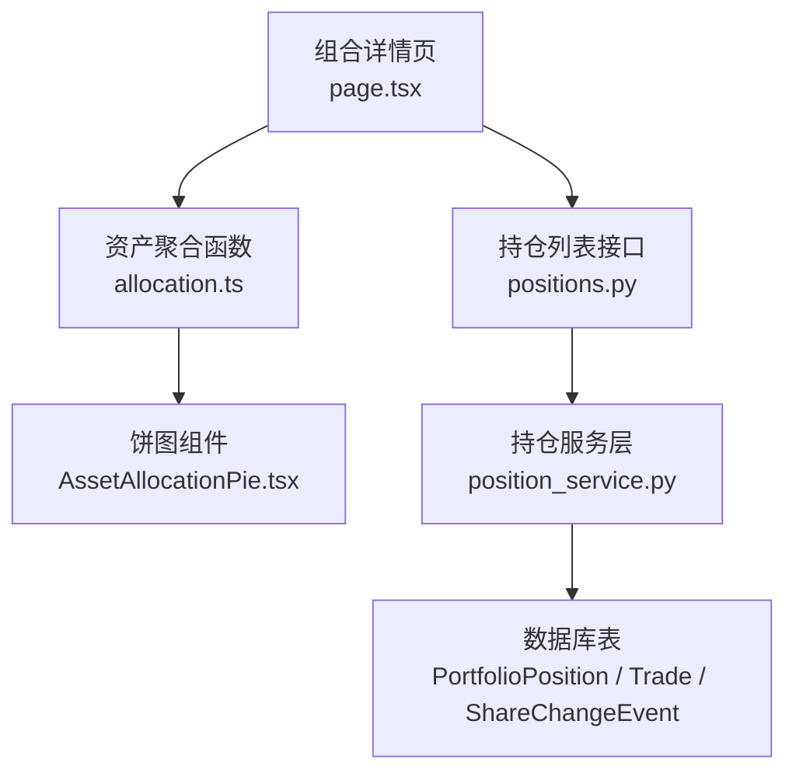
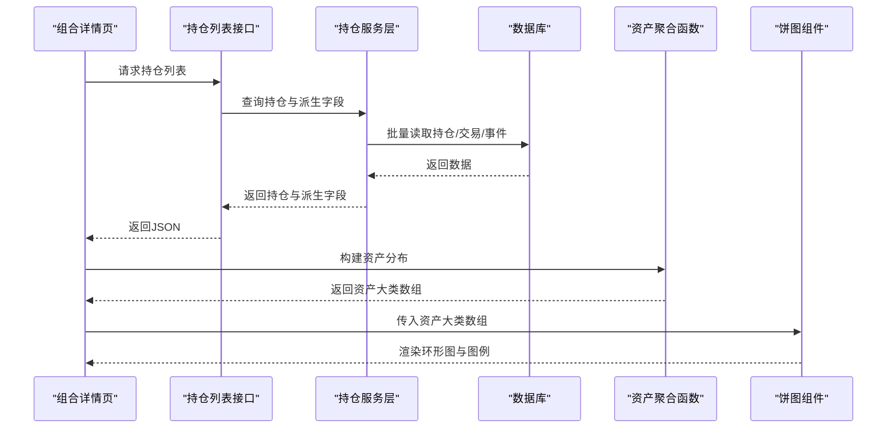
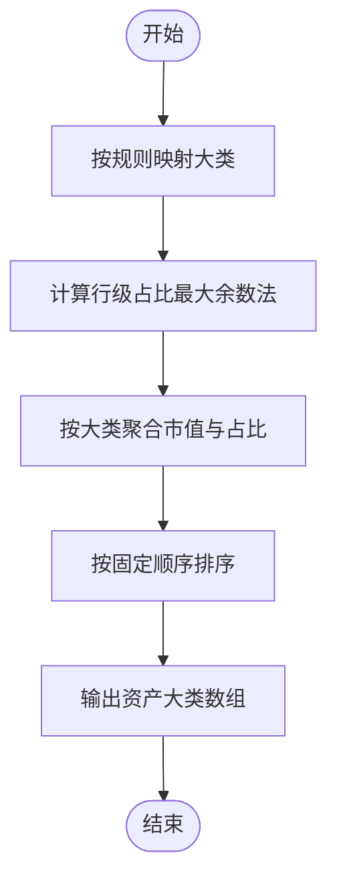
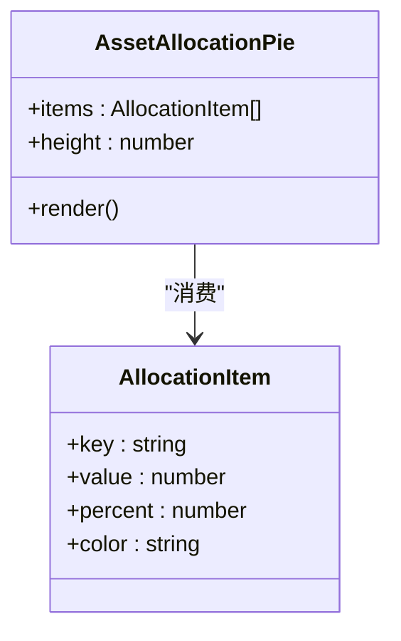
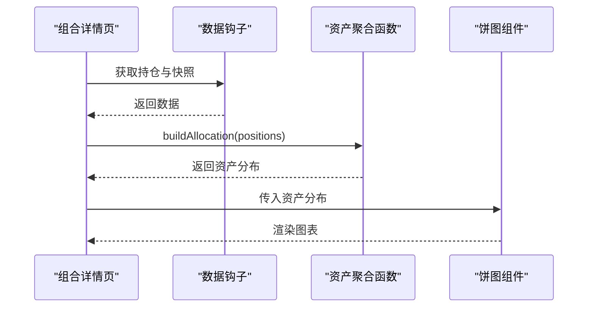
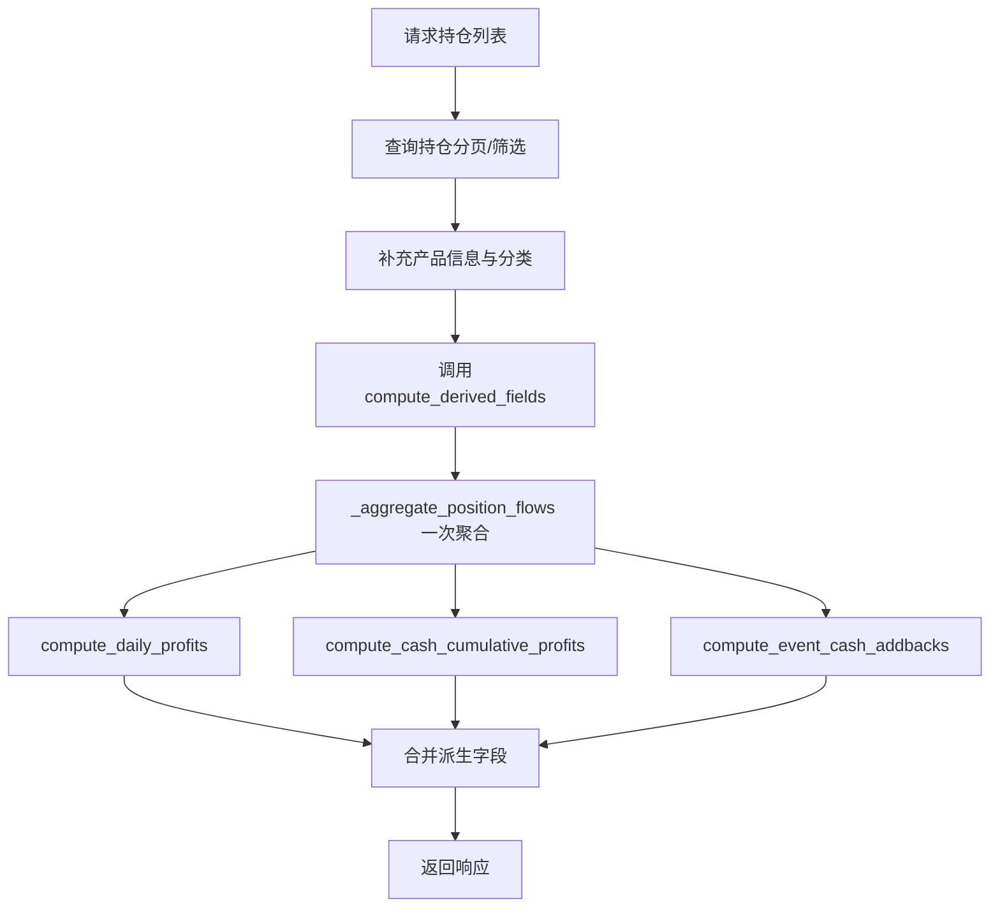
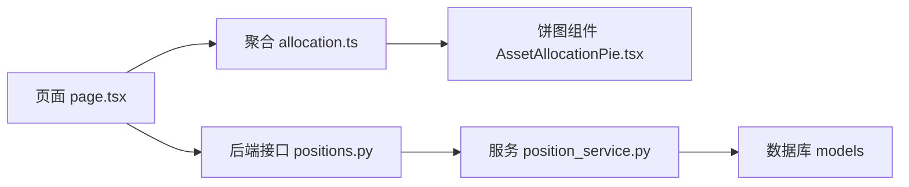

# 资产配置饼图组件

<cite>
**本文引用的文件**
- [AssetAllocationPie.tsx](file://frontend/src/components/charts/AssetAllocationPie.tsx)
- [allocation.ts](file://frontend/src/lib/allocation.ts)
- [position.ts](file://frontend/src/types/position.ts)
- [page.tsx（组合详情页）](file://frontend/src/app/portfolio/[code]/page.tsx)
- [positions.py](file://backend/app/routers/positions.py)
- [position_service.py](file://backend/app/services/position_service.py)
</cite>

## 目录
1. [简介](#简介)
2. [项目结构](#项目结构)
3. [核心组件](#核心组件)
4. [架构总览](#架构总览)
5. [详细组件分析](#详细组件分析)
6. [依赖关系分析](#依赖关系分析)
7. [性能考量](#性能考量)
8. [故障排查指南](#故障排查指南)
9. [结论](#结论)

## 简介
本组件为“资产配置饼图”，用于在组合详情页中可视化展示按资产大类（股票、债券、黄金、现金、在途、其他）聚合的市值分布与占比。前端通过统一的聚合函数将持仓行映射到资产大类，并使用环形图与右侧图例呈现；后端提供持仓列表接口，包含读侧派生字段（如当日收益等），便于前端基于最新快照进行计算与展示。

## 项目结构
围绕该组件的关键文件分布如下：
- 前端图表组件：负责渲染环形图与图例
- 前端聚合逻辑：负责将持仓行归入资产大类并计算占比
- 前端类型定义：描述持仓数据结构
- 前端页面：组合详情页调用聚合函数并传入饼图组件
- 后端路由与服务：提供持仓数据与读侧派生字段，支撑前端计算

图示来源
- [page.tsx（组合详情页）:117-203](file://frontend/src/app/portfolio/[code]/page.tsx#L117-L203)
- [allocation.ts:58-78](file://frontend/src/lib/allocation.ts#L58-L78)
- [AssetAllocationPie.tsx:17-70](file://frontend/src/components/charts/AssetAllocationPie.tsx#L17-L70)
- [positions.py:24-112](file://backend/app/routers/positions.py#L24-L112)
- [position_service.py:113-198](file://backend/app/services/position_service.py#L113-L198)

章节来源
- [page.tsx（组合详情页）:117-203](file://frontend/src/app/portfolio/[code]/page.tsx#L117-L203)
- [allocation.ts:58-78](file://frontend/src/lib/allocation.ts#L58-L78)
- [AssetAllocationPie.tsx:17-70](file://frontend/src/components/charts/AssetAllocationPie.tsx#L17-L70)
- [positions.py:24-112](file://backend/app/routers/positions.py#L24-L112)
- [position_service.py:113-198](file://backend/app/services/position_service.py#L113-L198)

## 核心组件
- 资产聚合函数（allocation.ts）
  - 职责：将持仓行归类为资产大类，使用最大余数法保证占比总和恒为100%，并按固定顺序输出结果
  - 关键能力：类别判定、行级占比、大类聚合、色板与排序
- 饼图组件（AssetAllocationPie.tsx）
  - 职责：接收聚合后的资产大类数组，渲染环形图与右侧图例，显示金额与百分比
  - 交互：悬浮提示显示金额与名称
- 组合详情页（page.tsx）
  - 职责：获取持仓列表，调用聚合函数生成资产分布数据，并传递给饼图组件
- 后端持仓接口（positions.py + position_service.py）
  - 职责：返回持仓列表及读侧派生字段（如当日收益、累计收益、分红加回），供前端计算与展示

章节来源
- [allocation.ts:28-78](file://frontend/src/lib/allocation.ts#L28-L78)
- [AssetAllocationPie.tsx:7-70](file://frontend/src/components/charts/AssetAllocationPie.tsx#L7-L70)
- [page.tsx（组合详情页）:65-118](file://frontend/src/app/portfolio/[code]/page.tsx#L65-L118)
- [positions.py:24-112](file://backend/app/routers/positions.py#L24-L112)
- [position_service.py:201-426](file://backend/app/services/position_service.py#L201-L426)

## 架构总览
从数据到展示的端到端流程如下：
- 前端请求持仓列表接口，获得持仓项与读侧派生字段
- 前端使用聚合函数将持仓项转换为资产大类数组
- 饼图组件渲染环形图与图例，展示各资产大类的市值与占比

图示来源
- [positions.py:24-112](file://backend/app/routers/positions.py#L24-L112)
- [position_service.py:113-198](file://backend/app/services/position_service.py#L113-L198)
- [allocation.ts:58-78](file://frontend/src/lib/allocation.ts#L58-L78)
- [AssetAllocationPie.tsx:17-70](file://frontend/src/components/charts/AssetAllocationPie.tsx#L17-L70)
- [page.tsx（组合详情页）:65-118](file://frontend/src/app/portfolio/[code]/page.tsx#L65-L118)

## 详细组件分析

### 资产聚合函数（allocation.ts）
- 类别判定规则
  - 在途资金（IN_TRANSIT_BUY/SELL）独立为“在途”
  - 现金产品或资产类型为cash的行归为“现金”
  - 基金行以asset_type作为大类名，缺省归为“其他”
- 占比计算
  - 使用最大余数法对行级占比求和，确保大类占比之和恒为100%
- 输出结构
  - key：大类名
  - value：市值合计
  - percent：占比（%）
  - color：对应色板颜色

图示来源
- [allocation.ts:43-78](file://frontend/src/lib/allocation.ts#L43-L78)

章节来源
- [allocation.ts:28-78](file://frontend/src/lib/allocation.ts#L28-L78)

### 饼图组件（AssetAllocationPie.tsx）
- 输入
  - items：资产大类数组（由聚合函数产出）
  - height：图表高度（默认180）
- 渲染逻辑
  - 空数据时显示占位文本
  - 环形图：innerRadius=60%，outerRadius=100%，无边框
  - 图例：左侧色块+大类名+右侧百分比
  - 工具提示：显示金额与名称
- 样式与布局
  - 响应式容器适配不同屏幕尺寸
  - 移动端与桌面端布局差异通过flex/grid实现

图示来源
- [AssetAllocationPie.tsx:7-70](file://frontend/src/components/charts/AssetAllocationPie.tsx#L7-L70)
- [allocation.ts:28-36](file://frontend/src/lib/allocation.ts#L28-L36)

章节来源
- [AssetAllocationPie.tsx:7-70](file://frontend/src/components/charts/AssetAllocationPie.tsx#L7-L70)

### 组合详情页（page.tsx）
- 数据获取
  - 使用usePositionList获取持仓列表
  - 使用useLatestSnapshot获取最新快照信息
- 数据处理
  - 调用buildAllocation将持仓列表转换为资产分布数据
  - 过滤净值历史数据，准备净值曲线展示
- 组件集成
  - 将资产分布数据传入AssetAllocationPie组件
  - 同时展示统计卡片、持仓分区、净值走势与绩效指标

图示来源
- [page.tsx（组合详情页）:65-118](file://frontend/src/app/portfolio/[code]/page.tsx#L65-L118)
- [allocation.ts:58-78](file://frontend/src/lib/allocation.ts#L58-L78)
- [AssetAllocationPie.tsx:17-70](file://frontend/src/components/charts/AssetAllocationPie.tsx#L17-L70)

章节来源
- [page.tsx（组合详情页）:65-118](file://frontend/src/app/portfolio/[code]/page.tsx#L65-L118)

### 后端持仓接口与服务（positions.py + position_service.py）
- 接口职责
  - 返回持仓列表，支持分页与筛选
  - 批量查询产品名称、分类、QDII标识、资产分类短名目
  - 调用compute_derived_fields统一聚合流水，避免重复查询
- 服务职责
  - _aggregate_position_flows：一次性聚合trade与event流水
  - compute_daily_profits：计算当日收益（含非现金与现金行）
  - compute_cash_cumulative_profits：计算现金累计收益
  - compute_event_cash_addbacks：计算非现金行累计分红加回
  - compute_derived_fields：协调三个compute函数，共享一次聚合结果

图示来源
- [positions.py:24-112](file://backend/app/routers/positions.py#L24-L112)
- [position_service.py:113-198](file://backend/app/services/position_service.py#L113-L198)
- [position_service.py:201-426](file://backend/app/services/position_service.py#L201-L426)

章节来源
- [positions.py:24-112](file://backend/app/routers/positions.py#L24-L112)
- [position_service.py:113-198](file://backend/app/services/position_service.py#L113-L198)
- [position_service.py:201-426](file://backend/app/services/position_service.py#L201-L426)

## 依赖关系分析
- 前端依赖
  - 饼图组件依赖recharts库进行图表渲染
  - 聚合函数依赖utils中的最大余数法实现
  - 页面依赖Next.js路由与状态管理
- 后端依赖
  - 路由层依赖FastAPI框架
  - 服务层依赖SQLAlchemy ORM与数据库模型
  - 依赖trading_utils提供交易日与快照日期计算

图示来源
- [page.tsx（组合详情页）:117-203](file://frontend/src/app/portfolio/[code]/page.tsx#L117-L203)
- [allocation.ts:58-78](file://frontend/src/lib/allocation.ts#L58-L78)
- [AssetAllocationPie.tsx:17-70](file://frontend/src/components/charts/AssetAllocationPie.tsx#L17-L70)
- [positions.py:24-112](file://backend/app/routers/positions.py#L24-L112)
- [position_service.py:113-198](file://backend/app/services/position_service.py#L113-L198)

章节来源
- [page.tsx（组合详情页）:117-203](file://frontend/src/app/portfolio/[code]/page.tsx#L117-L203)
- [allocation.ts:58-78](file://frontend/src/lib/allocation.ts#L58-L78)
- [AssetAllocationPie.tsx:17-70](file://frontend/src/components/charts/AssetAllocationPie.tsx#L17-L70)
- [positions.py:24-112](file://backend/app/routers/positions.py#L24-L112)
- [position_service.py:113-198](file://backend/app/services/position_service.py#L113-L198)

## 性能考量
- 前端性能
  - 聚合函数在内存中完成，时间复杂度与持仓行数线性相关
  - 最大余数法保证占比精度，避免累积误差
  - 图表渲染使用响应式容器，避免重绘开销
- 后端性能
  - 通过一次聚合避免三处重复查询，减少数据库负载
  - 批量查询与内存映射替代N+1查询模式
  - 分页与筛选减少数据传输量

[本节提供通用指导，不直接分析具体文件]

## 故障排查指南
- 前端问题
  - 无数据时显示占位文本，检查数据来源与加载状态
  - 占比异常：确认最大余数法实现与输入数据完整性
  - 图表不渲染：检查recharts依赖与props传递
- 后端问题
  - 派生字段为空：检查compute_derived_fields是否被正确调用
  - 收益计算异常：核对流水聚合与日期过滤逻辑
  - 接口响应不一致：验证测试断言与回归结果

章节来源
- [AssetAllocationPie.tsx:17-27](file://frontend/src/components/charts/AssetAllocationPie.tsx#L17-L27)
- [allocation.ts:58-78](file://frontend/src/lib/allocation.ts#L58-L78)
- [positions.py:81-85](file://backend/app/routers/positions.py#L81-L85)
- [position_service.py:405-426](file://backend/app/services/position_service.py#L405-L426)

## 结论
资产配置饼图组件通过前后端协作实现了清晰的资产分布可视化。前端聚合函数确保占比一致性与可读性，后端服务层通过一次聚合优化了查询效率。整体架构简洁、可维护性强，适合在组合详情页中稳定展示资产分布情况。