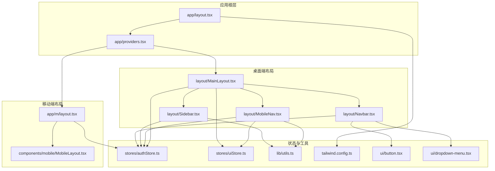
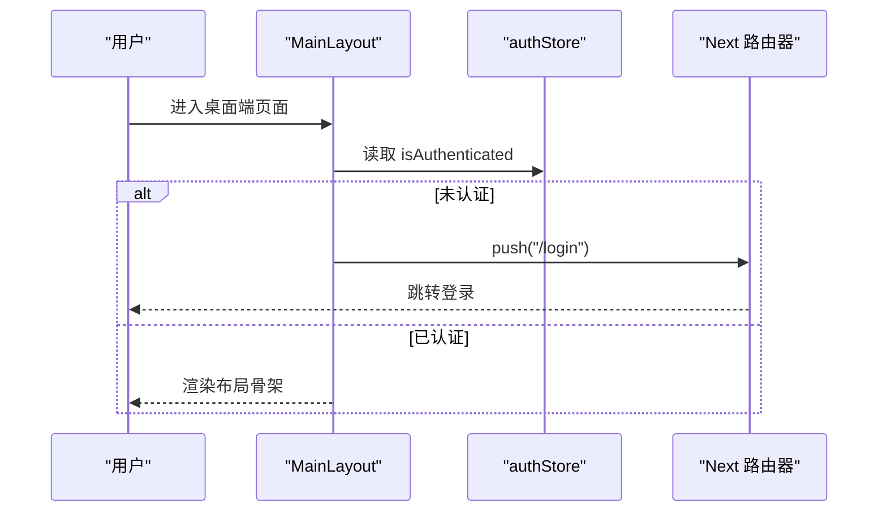
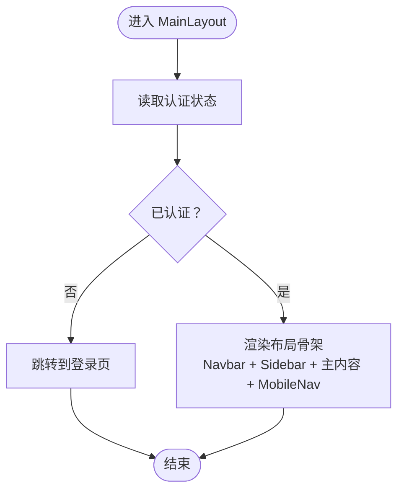
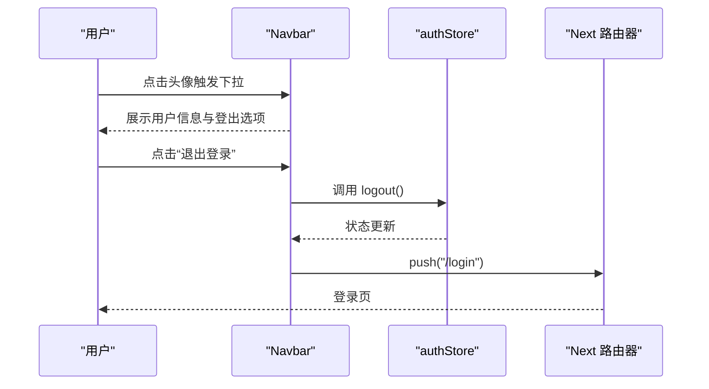
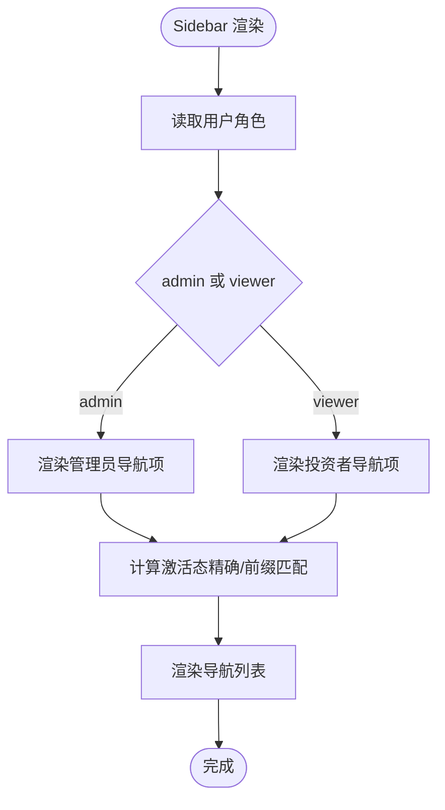
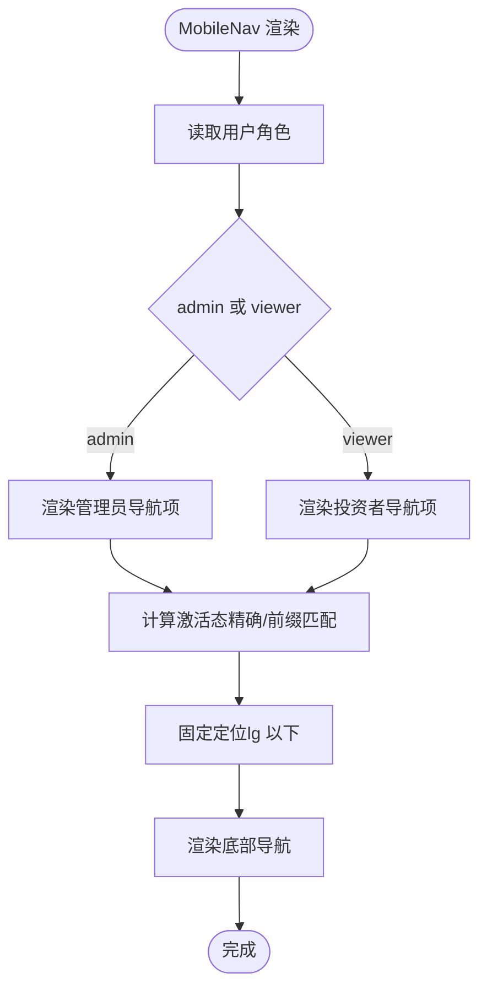
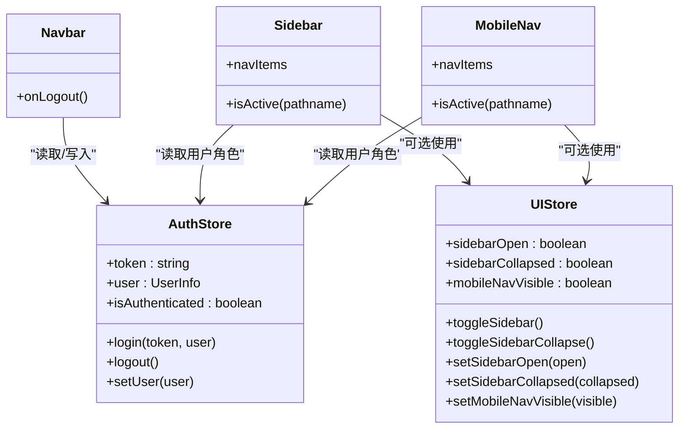
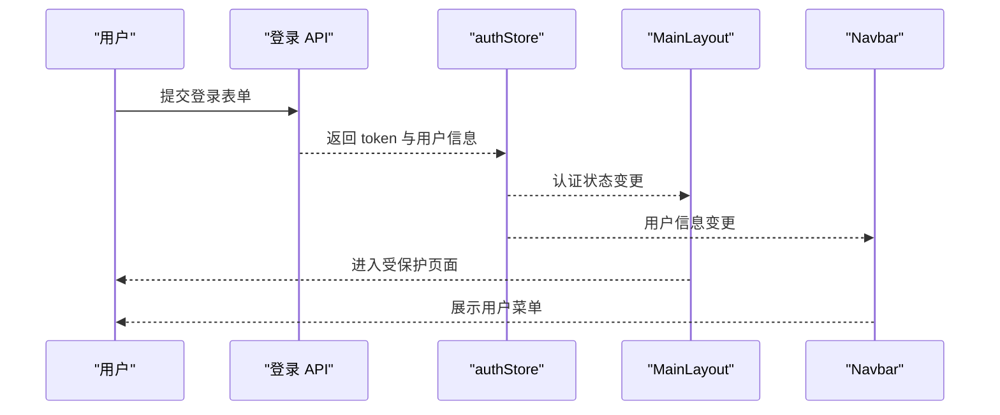
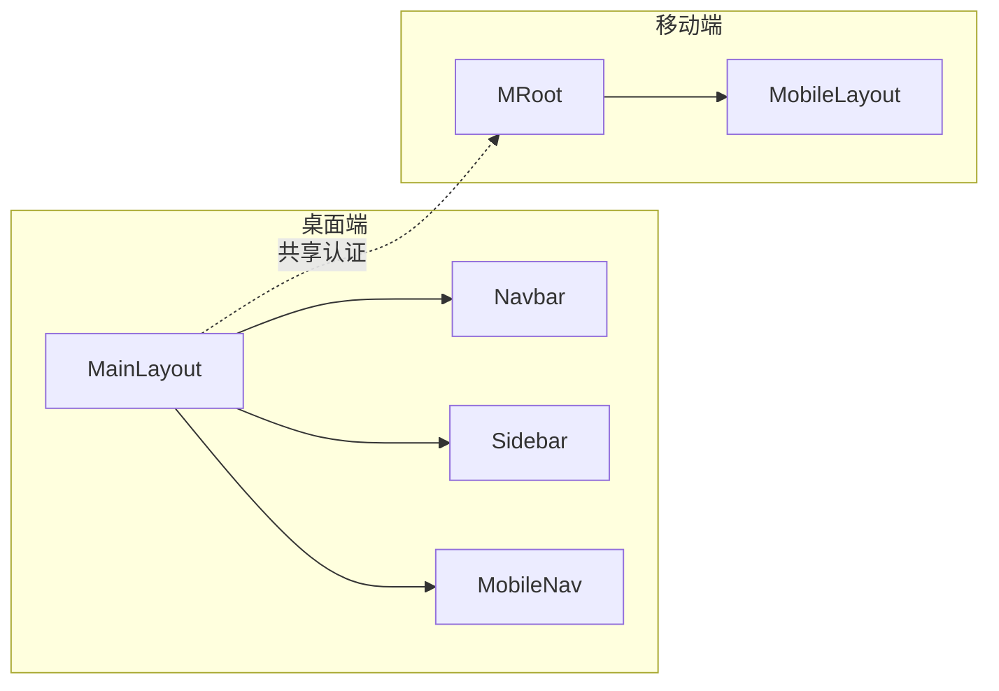
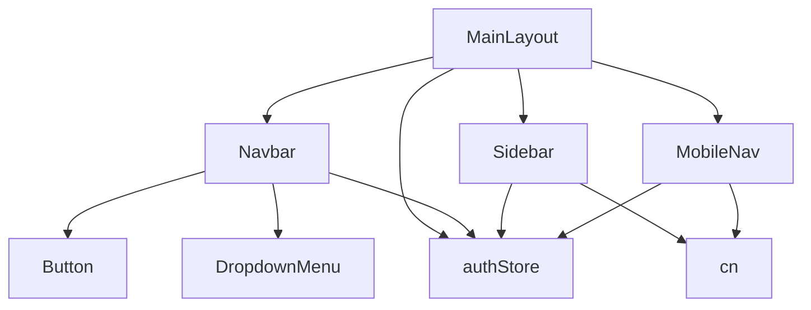

# 布局组件

<cite>
**本文引用的文件**
- [frontend/src/components/layout/MainLayout.tsx](file://frontend/src/components/layout/MainLayout.tsx)
- [frontend/src/components/layout/Navbar.tsx](file://frontend/src/components/layout/Navbar.tsx)
- [frontend/src/components/layout/Sidebar.tsx](file://frontend/src/components/layout/Sidebar.tsx)
- [frontend/src/components/layout/MobileNav.tsx](file://frontend/src/components/layout/MobileNav.tsx)
- [frontend/src/stores/authStore.ts](file://frontend/src/stores/authStore.ts)
- [frontend/src/stores/uiStore.ts](file://frontend/src/stores/uiStore.ts)
- [frontend/src/hooks/useAuth.ts](file://frontend/src/hooks/useAuth.ts)
- [frontend/src/app/layout.tsx](file://frontend/src/app/layout.tsx)
- [frontend/src/app/providers.tsx](file://frontend/src/app/providers.tsx)
- [frontend/src/lib/utils.ts](file://frontend/src/lib/utils.ts)
- [frontend/tailwind.config.ts](file://frontend/tailwind.config.ts)
- [frontend/src/components/ui/button.tsx](file://frontend/src/components/ui/button.tsx)
- [frontend/src/components/ui/dropdown-menu.tsx](file://frontend/src/components/ui/dropdown-menu.tsx)
- [frontend/src/app/m/layout.tsx](file://frontend/src/app/m/layout.tsx)
- [frontend/src/components/mobile/MobileLayout.tsx](file://frontend/src/components/mobile/MobileLayout.tsx)
</cite>

## 目录
1. [简介](#简介)
2. [项目结构](#项目结构)
3. [核心组件](#核心组件)
4. [架构总览](#架构总览)
5. [详细组件分析](#详细组件分析)
6. [依赖关系分析](#依赖关系分析)
7. [性能考虑](#性能考虑)
8. [故障排查指南](#故障排查指南)
9. [结论](#结论)
10. [附录](#附录)

## 简介
本文件系统性解析 InvestRing 前端的布局体系，重点围绕主布局组件 MainLayout 的设计模式与职责划分，详解导航栏 Navbar、侧边栏 Sidebar 与移动导航 MobileNav 的实现原理与交互方式；阐述响应式设计策略（断点、移动端适配与桌面端优化）；说明布局组件之间的通信与状态共享机制；解释与认证系统的集成及权限控制在布局层面的落地；并提供定制化与样式覆盖指南、性能优化技巧与最佳实践。

## 项目结构
布局系统位于前端 src/components/layout 目录，配合全局 Provider、Tailwind 主题与 Zustand 状态管理共同构成完整的布局基础设施。移动端采用独立的 m 子路由与 MobileLayout 组织，保证不同终端的差异化体验。

图表来源
- [frontend/src/app/layout.tsx:1-32](file://frontend/src/app/layout.tsx#L1-L32)
- [frontend/src/app/providers.tsx:1-28](file://frontend/src/app/providers.tsx#L1-L28)
- [frontend/src/components/layout/MainLayout.tsx:1-41](file://frontend/src/components/layout/MainLayout.tsx#L1-L41)
- [frontend/src/components/layout/Navbar.tsx:1-62](file://frontend/src/components/layout/Navbar.tsx#L1-L62)
- [frontend/src/components/layout/Sidebar.tsx:1-67](file://frontend/src/components/layout/Sidebar.tsx#L1-L67)
- [frontend/src/components/layout/MobileNav.tsx:1-61](file://frontend/src/components/layout/MobileNav.tsx#L1-L61)
- [frontend/src/app/m/layout.tsx:1-27](file://frontend/src/app/m/layout.tsx#L1-L27)
- [frontend/src/components/mobile/MobileLayout.tsx:1-16](file://frontend/src/components/mobile/MobileLayout.tsx#L1-L16)
- [frontend/src/stores/authStore.ts:1-71](file://frontend/src/stores/authStore.ts#L1-L71)
- [frontend/src/stores/uiStore.ts:1-85](file://frontend/src/stores/uiStore.ts#L1-L85)
- [frontend/src/lib/utils.ts:1-270](file://frontend/src/lib/utils.ts#L1-L270)
- [frontend/tailwind.config.ts:1-57](file://frontend/tailwind.config.ts#L1-L57)
- [frontend/src/components/ui/button.tsx:1-56](file://frontend/src/components/ui/button.tsx#L1-L56)
- [frontend/src/components/ui/dropdown-menu.tsx:1-145](file://frontend/src/components/ui/dropdown-menu.tsx#L1-L145)

章节来源
- [frontend/src/app/layout.tsx:1-32](file://frontend/src/app/layout.tsx#L1-L32)
- [frontend/src/app/providers.tsx:1-28](file://frontend/src/app/providers.tsx#L1-L28)

## 核心组件
- MainLayout：桌面端主布局容器，负责整体骨架渲染、认证守卫与桌面端内容区域排布。
- Navbar：顶部导航区，包含品牌标识与用户下拉菜单（含登出）。
- Sidebar：桌面端侧边栏，按角色动态渲染导航项，支持高亮当前页。
- MobileNav：移动端底部导航，按角色动态渲染导航项，固定于底部。
- 状态层：authStore 提供认证状态与用户信息；uiStore 提供 UI 状态（如侧边栏开关、移动端导航可见性等）。
- 工具与主题：cn 合并类名、Tailwind 自定义变量与组件库样式。

章节来源
- [frontend/src/components/layout/MainLayout.tsx:1-41](file://frontend/src/components/layout/MainLayout.tsx#L1-L41)
- [frontend/src/components/layout/Navbar.tsx:1-62](file://frontend/src/components/layout/Navbar.tsx#L1-L62)
- [frontend/src/components/layout/Sidebar.tsx:1-67](file://frontend/src/components/layout/Sidebar.tsx#L1-L67)
- [frontend/src/components/layout/MobileNav.tsx:1-61](file://frontend/src/components/layout/MobileNav.tsx#L1-L61)
- [frontend/src/stores/authStore.ts:1-71](file://frontend/src/stores/authStore.ts#L1-L71)
- [frontend/src/stores/uiStore.ts:1-85](file://frontend/src/stores/uiStore.ts#L1-L85)
- [frontend/src/lib/utils.ts:1-270](file://frontend/src/lib/utils.ts#L1-L270)
- [frontend/tailwind.config.ts:1-57](file://frontend/tailwind.config.ts#L1-L57)

## 架构总览
桌面端与移动端分别由独立布局根组件驱动，通过统一的状态源（Zustand）与 UI 组件库实现一致的交互体验。认证状态贯穿所有布局组件，未登录用户会被重定向至登录页。

图表来源
- [frontend/src/components/layout/MainLayout.tsx:18-26](file://frontend/src/components/layout/MainLayout.tsx#L18-L26)
- [frontend/src/stores/authStore.ts:18-27](file://frontend/src/stores/authStore.ts#L18-L27)

## 详细组件分析

### MainLayout 设计与职责
- 设计模式：容器组件，负责认证守卫与布局骨架拼装。
- 职责分工：
  - 认证守卫：监听认证状态，未登录则跳转登录页。
  - 布局拼装：渲染 Navbar、Sidebar、主内容区与 MobileNav。
  - 响应式排布：桌面端使用 Flex 布局，主内容区在 lg 断点以上增加内边距。
- 与状态层交互：订阅 authStore 的认证状态；与 uiStore 解耦（当前不直接使用）。

图表来源
- [frontend/src/components/layout/MainLayout.tsx:10-40](file://frontend/src/components/layout/MainLayout.tsx#L10-L40)

章节来源
- [frontend/src/components/layout/MainLayout.tsx:1-41](file://frontend/src/components/layout/MainLayout.tsx#L1-L41)

### Navbar 实现原理
- 功能要点：
  - 品牌区：点击跳转仪表盘。
  - 用户下拉菜单：显示当前用户姓名与角色，提供“退出登录”入口。
  - 登出流程：触发 authStore.logout，并重定向到登录页。
- 交互细节：使用 Button 与 DropdownMenu 组件，结合 cn 合并类名实现视觉状态切换。

图表来源
- [frontend/src/components/layout/Navbar.tsx:19-22](file://frontend/src/components/layout/Navbar.tsx#L19-L22)
- [frontend/src/stores/authStore.ts:45-51](file://frontend/src/stores/authStore.ts#L45-L51)
- [frontend/src/components/ui/button.tsx:1-56](file://frontend/src/components/ui/button.tsx#L1-L56)
- [frontend/src/components/ui/dropdown-menu.tsx:1-145](file://frontend/src/components/ui/dropdown-menu.tsx#L1-L145)

章节来源
- [frontend/src/components/layout/Navbar.tsx:1-62](file://frontend/src/components/layout/Navbar.tsx#L1-L62)
- [frontend/src/components/ui/button.tsx:1-56](file://frontend/src/components/ui/button.tsx#L1-L56)
- [frontend/src/components/ui/dropdown-menu.tsx:1-145](file://frontend/src/components/ui/dropdown-menu.tsx#L1-L145)

### Sidebar 实现原理
- 导航项配置：
  - 管理员角色：包含仪表盘、投资人、组合、产品、平台、日志、任务、设置等。
  - 投资者角色：仅包含仪表盘与组合。
- 激活态判定：根据 pathname 与前缀匹配决定高亮。
- 响应式策略：仅在 lg 及以上断点显示，移动端由 MobileNav 替代。

图表来源
- [frontend/src/components/layout/Sidebar.tsx:18-32](file://frontend/src/components/layout/Sidebar.tsx#L18-L32)
- [frontend/src/components/layout/Sidebar.tsx:34-66](file://frontend/src/components/layout/Sidebar.tsx#L34-L66)

章节来源
- [frontend/src/components/layout/Sidebar.tsx:1-67](file://frontend/src/components/layout/Sidebar.tsx#L1-L67)

### MobileNav 实现原理
- 导航项配置与激活态逻辑同 Sidebar，但针对移动端进行尺寸与间距优化。
- 固定定位：在 lg 以下固定于底部，避免滚动遮挡。
- 交互行为：点击跳转对应路由，保持移动端导航一致性。

图表来源
- [frontend/src/components/layout/MobileNav.tsx:15-26](file://frontend/src/components/layout/MobileNav.tsx#L15-L26)
- [frontend/src/components/layout/MobileNav.tsx:28-60](file://frontend/src/components/layout/MobileNav.tsx#L28-L60)

章节来源
- [frontend/src/components/layout/MobileNav.tsx:1-61](file://frontend/src/components/layout/MobileNav.tsx#L1-L61)

### 响应式设计策略
- 断点与布局：
  - lg：Sidebar 显示，主内容区增加内边距（lg:p-8、lg:pb-8），提升桌面端阅读体验。
  - lg 以下：Sidebar 隐藏，MobileNav 固定底部，主内容区减少底部留白以适配底部导航高度。
- 适配建议：
  - 使用 Tailwind 断点类控制元素显示/隐藏与间距变化。
  - 通过 cn 合并类名实现条件样式，避免重复分支判断。

章节来源
- [frontend/src/components/layout/MainLayout.tsx:33-36](file://frontend/src/components/layout/MainLayout.tsx#L33-L36)
- [frontend/src/components/layout/MobileNav.tsx:35-35](file://frontend/src/components/layout/MobileNav.tsx#L35-L35)
- [frontend/src/lib/utils.ts:8-10](file://frontend/src/lib/utils.ts#L8-L10)
- [frontend/tailwind.config.ts:1-57](file://frontend/tailwind.config.ts#L1-L57)

### 布局组件间通信与状态共享
- 认证状态共享：authStore 统一维护 token、user、isAuthenticated 等，各布局组件通过 hooks 读取。
- UI 状态共享：uiStore 管理侧边栏开关、移动端导航可见性、全局加载与 Toast 等，MainLayout 当前未直接使用，Sidebar/MobileNav 可按需扩展。
- 通信路径：
  - Navbar 与 MobileNav 通过 authStore 触发登出与用户信息展示。
  - Sidebar/MobileNav 通过 pathname 与 usePathname 判断激活态。
  - MainLayout 作为容器，协调认证守卫与布局渲染。

图表来源
- [frontend/src/stores/authStore.ts:18-27](file://frontend/src/stores/authStore.ts#L18-L27)
- [frontend/src/stores/uiStore.ts:4-26](file://frontend/src/stores/uiStore.ts#L4-L26)
- [frontend/src/components/layout/Navbar.tsx:15-22](file://frontend/src/components/layout/Navbar.tsx#L15-L22)
- [frontend/src/components/layout/Sidebar.tsx:34-45](file://frontend/src/components/layout/Sidebar.tsx#L34-L45)
- [frontend/src/components/layout/MobileNav.tsx:28-39](file://frontend/src/components/layout/MobileNav.tsx#L28-L39)

章节来源
- [frontend/src/stores/authStore.ts:1-71](file://frontend/src/stores/authStore.ts#L1-L71)
- [frontend/src/stores/uiStore.ts:1-85](file://frontend/src/stores/uiStore.ts#L1-L85)
- [frontend/src/hooks/useAuth.ts:1-134](file://frontend/src/hooks/useAuth.ts#L1-L134)

### 与认证系统的集成与权限控制
- 登录与登出：
  - 登录成功后，authStore 写入 token 与用户信息，MainLayout 与 Navbar 即可感知认证状态。
  - 登出时清理本地存储与 Cookie，并清空查询缓存，随后跳转登录页。
- 权限控制：
  - 角色区分：admin 与 viewer，分别渲染不同的导航项集合。
  - 页面级守卫：useAuthGuard 可在路由层对需要认证或禁止认证的页面进行重定向。
- 数据一致性：
  - useCurrentUser 在启用条件下定期拉取用户信息，维持用户状态新鲜度。

图表来源
- [frontend/src/hooks/useAuth.ts:12-36](file://frontend/src/hooks/useAuth.ts#L12-L36)
- [frontend/src/stores/authStore.ts:37-51](file://frontend/src/stores/authStore.ts#L37-L51)
- [frontend/src/components/layout/MainLayout.tsx:15-22](file://frontend/src/components/layout/MainLayout.tsx#L15-L22)
- [frontend/src/components/layout/Navbar.tsx:16-17](file://frontend/src/components/layout/Navbar.tsx#L16-L17)

章节来源
- [frontend/src/hooks/useAuth.ts:1-134](file://frontend/src/hooks/useAuth.ts#L1-L134)
- [frontend/src/stores/authStore.ts:1-71](file://frontend/src/stores/authStore.ts#L1-L71)

### 移动端布局与桌面端协同
- 桌面端：MainLayout 作为根布局，承载 Navbar、Sidebar 与 MobileNav。
- 移动端：MRoot 作为移动端根布局，承载 MobileLayout 与底部导航，避免桌面端样式与交互干扰。
- 共享状态：移动端同样依赖 authStore 进行认证守卫，确保两端一致的登录态。

图表来源
- [frontend/src/app/m/layout.tsx:8-26](file://frontend/src/app/m/layout.tsx#L8-L26)
- [frontend/src/components/mobile/MobileLayout.tsx:5-15](file://frontend/src/components/mobile/MobileLayout.tsx#L5-L15)
- [frontend/src/components/layout/MainLayout.tsx:1-41](file://frontend/src/components/layout/MainLayout.tsx#L1-L41)

章节来源
- [frontend/src/app/m/layout.tsx:1-27](file://frontend/src/app/m/layout.tsx#L1-L27)
- [frontend/src/components/mobile/MobileLayout.tsx:1-16](file://frontend/src/components/mobile/MobileLayout.tsx#L1-L16)

## 依赖关系分析
- 组件依赖：
  - MainLayout 依赖 Navbar、Sidebar、MobileNav。
  - Navbar 依赖 Button、DropdownMenu。
  - Sidebar/MobileNav 依赖 cn 与图标集。
- 状态依赖：
  - 所有布局组件依赖 authStore；Sidebar/MobileNav 依赖用户角色；MainLayout 依赖认证状态。
- 外部依赖：
  - Next 路由器用于重定向。
  - Radix UI DropdownMenu 与自研 Button 组件。
  - Tailwind CSS 与 cn 合并类名。

图表来源
- [frontend/src/components/layout/MainLayout.tsx:6-8](file://frontend/src/components/layout/MainLayout.tsx#L6-L8)
- [frontend/src/components/layout/Navbar.tsx:6-12](file://frontend/src/components/layout/Navbar.tsx#L6-L12)
- [frontend/src/components/layout/Sidebar.tsx:6-6](file://frontend/src/components/layout/Sidebar.tsx#L6-L6)
- [frontend/src/components/layout/MobileNav.tsx:6-6](file://frontend/src/components/layout/MobileNav.tsx#L6-L6)
- [frontend/src/components/ui/button.tsx:1-56](file://frontend/src/components/ui/button.tsx#L1-L56)
- [frontend/src/components/ui/dropdown-menu.tsx:1-145](file://frontend/src/components/ui/dropdown-menu.tsx#L1-L145)
- [frontend/src/lib/utils.ts:8-10](file://frontend/src/lib/utils.ts#L8-L10)
- [frontend/src/stores/authStore.ts:1-71](file://frontend/src/stores/authStore.ts#L1-L71)

章节来源
- [frontend/src/lib/utils.ts:1-270](file://frontend/src/lib/utils.ts#L1-L270)
- [frontend/src/components/ui/button.tsx:1-56](file://frontend/src/components/ui/button.tsx#L1-L56)
- [frontend/src/components/ui/dropdown-menu.tsx:1-145](file://frontend/src/components/ui/dropdown-menu.tsx#L1-L145)

## 性能考虑
- 认证守卫：
  - 在 MainLayout 中进行一次性守卫，避免每个子组件重复校验。
  - 使用 useEffect 监听认证状态变化，减少不必要的渲染。
- 路由与重定向：
  - 使用路由器 push/replace 控制跳转，避免无意义的页面刷新。
- 样式与类名：
  - 使用 cn 合并类名，减少条件分支带来的重复计算。
- 状态持久化：
  - authStore 与 uiStore 使用持久化中间件，减少刷新后的状态丢失。
- 图标与组件：
  - 使用轻量图标库与原子化样式，降低打包体积与渲染开销。

[本节为通用指导，无需特定文件引用]

## 故障排查指南
- 无法进入受保护页面
  - 检查 authStore 是否正确写入 token 与用户信息。
  - 确认 MainLayout 的认证守卫逻辑是否执行。
- 登出后仍显示受保护内容
  - 确认 logout 是否清除本地存储与 Cookie，并重置状态。
  - 检查 QueryClient 是否被清理，避免残留数据导致误判。
- 导航高亮异常
  - 检查 pathname 匹配规则（精确匹配与前缀匹配）。
  - 确认 Sidebar/MobileNav 的激活态计算逻辑。
- 移动端底部导航不显示
  - 确认断点类 lg: 以下显示 MobileNav，lg 以上隐藏 Sidebar。
- 样式错乱
  - 检查 Tailwind 配置与 cn 合并类名的顺序与冲突。

章节来源
- [frontend/src/stores/authStore.ts:45-51](file://frontend/src/stores/authStore.ts#L45-L51)
- [frontend/src/components/layout/MainLayout.tsx:18-26](file://frontend/src/components/layout/MainLayout.tsx#L18-L26)
- [frontend/src/components/layout/Sidebar.tsx:45-45](file://frontend/src/components/layout/Sidebar.tsx#L45-L45)
- [frontend/src/components/layout/MobileNav.tsx:39-39](file://frontend/src/components/layout/MobileNav.tsx#L39-L39)
- [frontend/tailwind.config.ts:1-57](file://frontend/tailwind.config.ts#L1-L57)

## 结论
InvestRing 的布局体系以 MainLayout 为核心，通过 Navbar、Sidebar、MobileNav 形成桌面端与移动端的一致体验。认证系统与状态管理（authStore、uiStore）贯穿布局组件，实现安全、可控且可扩展的界面组织。借助 Tailwind 与原子化组件，布局具备良好的可定制性与性能表现。后续可在 Sidebar/MobileNav 上进一步引入 uiStore 的侧边栏状态，以增强跨页面的一致性与交互体验。

[本节为总结，无需特定文件引用]

## 附录

### 定制化指南与样式覆盖
- 自定义断点与间距
  - 在 Tailwind 配置中扩展断点与圆角，满足业务需求。
  - 使用 lg: 前缀类控制桌面端间距与布局。
- 覆盖组件样式
  - 使用 cn 合并类名实现条件样式覆盖，避免全局污染。
  - 对 Button、DropdownMenu 等组件进行变体与尺寸定制。
- 导航项扩展
  - 在 Sidebar 与 MobileNav 的导航项数组中新增条目，注意图标与路由映射。
- 主题变量
  - 通过 Tailwind 主题变量统一管理颜色与圆角，确保风格一致。

章节来源
- [frontend/tailwind.config.ts:9-51](file://frontend/tailwind.config.ts#L9-L51)
- [frontend/src/lib/utils.ts:8-10](file://frontend/src/lib/utils.ts#L8-L10)
- [frontend/src/components/ui/button.tsx:6-33](file://frontend/src/components/ui/button.tsx#L6-L33)
- [frontend/src/components/ui/dropdown-menu.tsx:54-66](file://frontend/src/components/ui/dropdown-menu.tsx#L54-L66)
- [frontend/src/components/layout/Sidebar.tsx:18-32](file://frontend/src/components/layout/Sidebar.tsx#L18-L32)
- [frontend/src/components/layout/MobileNav.tsx:15-26](file://frontend/src/components/layout/MobileNav.tsx#L15-L26)