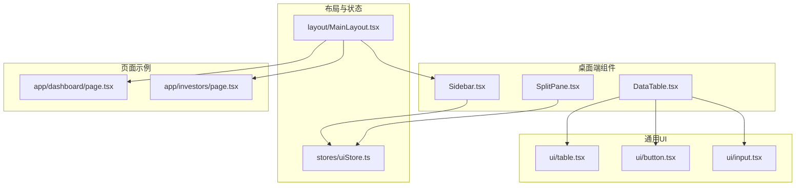
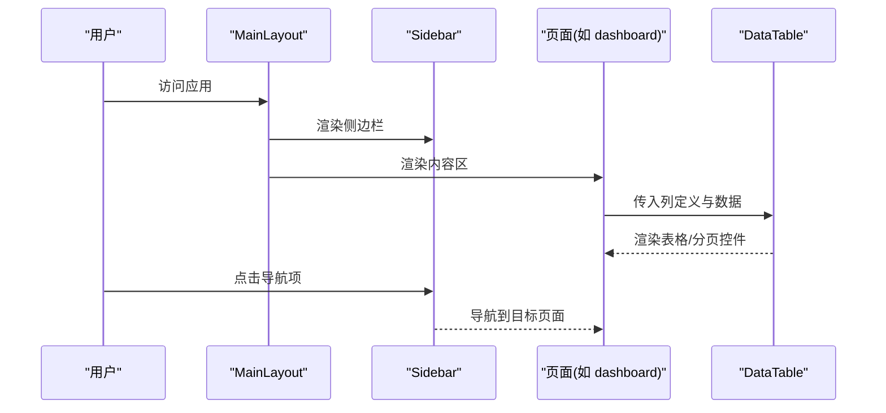
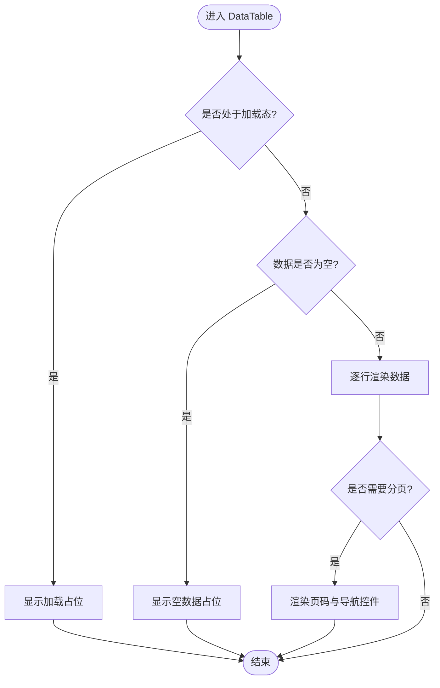
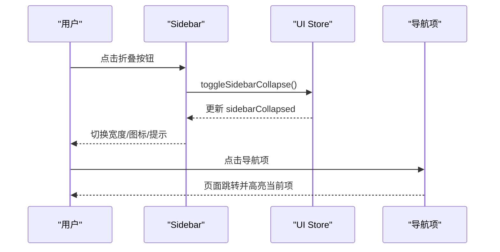
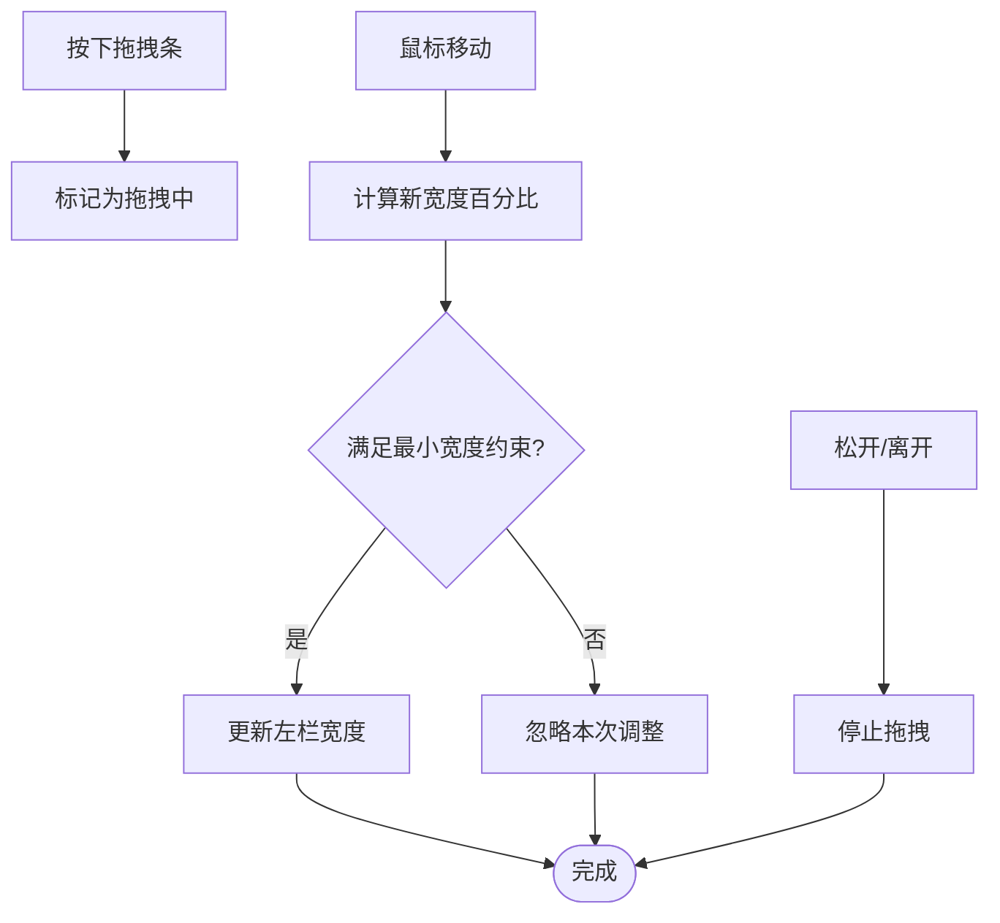
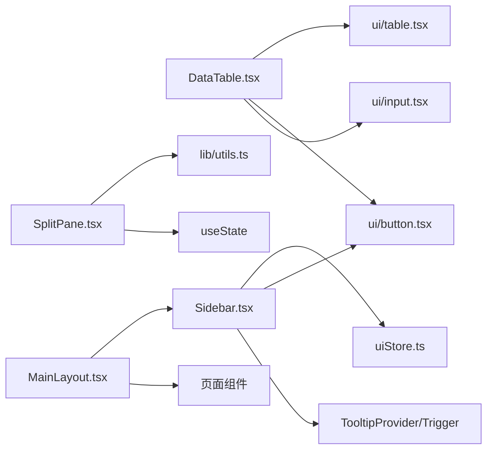

# 桌面端组件

<cite>
**本文引用的文件**
- [frontend/src/components/desktop/DataTable.tsx](file://frontend/src/components/desktop/DataTable.tsx)
- [frontend/src/components/desktop/Sidebar.tsx](file://frontend/src/components/desktop/Sidebar.tsx)
- [frontend/src/components/desktop/SplitPane.tsx](file://frontend/src/components/desktop/SplitPane.tsx)
- [frontend/src/components/layout/MainLayout.tsx](file://frontend/src/components/layout/MainLayout.tsx)
- [frontend/src/components/ui/table.tsx](file://frontend/src/components/ui/table.tsx)
- [frontend/src/components/ui/button.tsx](file://frontend/src/components/ui/button.tsx)
- [frontend/src/components/ui/input.tsx](file://frontend/src/components/ui/input.tsx)
- [frontend/src/stores/uiStore.ts](file://frontend/src/stores/uiStore.ts)
- [frontend/src/lib/utils.ts](file://frontend/src/lib/utils.ts)
- [frontend/src/app/dashboard/page.tsx](file://frontend/src/app/dashboard/page.tsx)
- [frontend/src/app/investors/page.tsx](file://frontend/src/app/investors/page.tsx)
</cite>

## 目录
1. [简介](#简介)
2. [项目结构](#项目结构)
3. [核心组件](#核心组件)
4. [架构总览](#架构总览)
5. [组件详解](#组件详解)
6. [依赖关系分析](#依赖关系分析)
7. [性能与大数据量处理](#性能与大数据量处理)
8. [可访问性与键盘支持](#可访问性与键盘支持)
9. [故障排查指南](#故障排查指南)
10. [结论](#结论)

## 简介
本文件聚焦于桌面端专用组件的设计与实现，覆盖以下主题：
- 数据表格组件（DataTable）：排序、筛选、分页与数据渲染优化
- 侧边栏组件（Sidebar）：桌面端特化布局与交互
- 分割面板组件（SplitPane）：布局控制与尺寸调整机制
- 键盘快捷键与鼠标交互优化
- 可访问性与屏幕阅读器支持
- 性能优化策略与大数据量处理方案

## 项目结构
桌面端组件位于前端工程的 desktop 目录，配合通用 UI 组件与状态管理共同构成桌面端布局与交互基础。

图示来源
- [frontend/src/components/desktop/DataTable.tsx:1-124](file://frontend/src/components/desktop/DataTable.tsx#L1-L124)
- [frontend/src/components/desktop/Sidebar.tsx:1-147](file://frontend/src/components/desktop/Sidebar.tsx#L1-L147)
- [frontend/src/components/desktop/SplitPane.tsx:1-66](file://frontend/src/components/desktop/SplitPane.tsx#L1-L66)
- [frontend/src/components/layout/MainLayout.tsx:1-41](file://frontend/src/components/layout/MainLayout.tsx#L1-L41)
- [frontend/src/components/ui/table.tsx:1-114](file://frontend/src/components/ui/table.tsx#L1-L114)
- [frontend/src/components/ui/button.tsx:1-56](file://frontend/src/components/ui/button.tsx#L1-L56)
- [frontend/src/components/ui/input.tsx:1-25](file://frontend/src/components/ui/input.tsx#L1-L25)
- [frontend/src/stores/uiStore.ts:1-85](file://frontend/src/stores/uiStore.ts#L1-L85)
- [frontend/src/app/dashboard/page.tsx:1-290](file://frontend/src/app/dashboard/page.tsx#L1-L290)
- [frontend/src/app/investors/page.tsx:1-285](file://frontend/src/app/investors/page.tsx#L1-L285)

章节来源
- [frontend/src/components/layout/MainLayout.tsx:1-41](file://frontend/src/components/layout/MainLayout.tsx#L1-L41)
- [frontend/src/stores/uiStore.ts:1-85](file://frontend/src/stores/uiStore.ts#L1-L85)

## 核心组件
- 数据表格（DataTable）：提供列定义、数据渲染、加载态、空态、分页控制与页码输入跳转
- 侧边栏（Sidebar）：桌面端固定侧边栏，支持折叠/展开，根据用户角色动态导航项，提供折叠提示气泡
- 分割面板（SplitPane）：左右布局，支持拖拽调整左右区域宽度，具备最小宽度约束

章节来源
- [frontend/src/components/desktop/DataTable.tsx:1-124](file://frontend/src/components/desktop/DataTable.tsx#L1-L124)
- [frontend/src/components/desktop/Sidebar.tsx:1-147](file://frontend/src/components/desktop/Sidebar.tsx#L1-L147)
- [frontend/src/components/desktop/SplitPane.tsx:1-66](file://frontend/src/components/desktop/SplitPane.tsx#L1-L66)

## 架构总览
桌面端组件通过主布局容器 MainLayout 组织，侧边栏与内容区并排，内容区由具体页面承载。DataTable 作为通用 UI 的上层封装，复用 ui/table 组件；SplitPane 提供可配置的左右布局能力。

图示来源
- [frontend/src/components/layout/MainLayout.tsx:10-41](file://frontend/src/components/layout/MainLayout.tsx#L10-L41)
- [frontend/src/components/desktop/Sidebar.tsx:45-147](file://frontend/src/components/desktop/Sidebar.tsx#L45-L147)
- [frontend/src/app/dashboard/page.tsx:197-234](file://frontend/src/app/dashboard/page.tsx#L197-L234)

## 组件详解

### 数据表格组件（DataTable）
- 功能特性
  - 列定义：支持列键、标题、样式类与自定义渲染函数
  - 数据渲染：支持加载态、空态、错误占位（当前仓库未实现错误态，但结构预留）
  - 分页控制：页码输入框、上一页/下一页按钮，禁用态随页码边界变化
  - 数据渲染优化：按需渲染，避免在空数据或加载中渲染大量行
- 接口要点
  - 列定义接口包含键、标题、可选样式类与渲染函数
  - 分页参数：当前页、每页大小、总数，以及页码变更回调
- 使用建议
  - 在上层页面中计算 total 与分页参数，传递给 DataTable
  - 对于大列表，结合虚拟滚动或服务端分页以提升性能（见“性能与大数据量处理”）

图示来源
- [frontend/src/components/desktop/DataTable.tsx:40-124](file://frontend/src/components/desktop/DataTable.tsx#L40-L124)

章节来源
- [frontend/src/components/desktop/DataTable.tsx:15-40](file://frontend/src/components/desktop/DataTable.tsx#L15-L40)
- [frontend/src/components/desktop/DataTable.tsx:41-124](file://frontend/src/components/desktop/DataTable.tsx#L41-L124)
- [frontend/src/components/ui/table.tsx:1-114](file://frontend/src/components/ui/table.tsx#L1-L114)

### 侧边栏组件（Sidebar）
- 桌面端特化
  - 基于断点 lg 的隐藏/显示策略，仅在桌面端生效
  - 固定位置与粘性定位，随页面滚动保持可见
  - 支持折叠/展开：通过 UI Store 控制折叠状态，切换宽度与图标
- 导航与交互
  - 根据用户角色动态渲染导航项
  - 折叠模式下使用 Tooltip 提示标签
  - 导航高亮：根据当前路径匹配激活态
- 与状态管理
  - 通过 UI Store 的 toggleSidebarCollapse 切换折叠状态
  - 折叠状态持久化存储（参见 uiStore 的持久化配置）

图示来源
- [frontend/src/components/desktop/Sidebar.tsx:45-147](file://frontend/src/components/desktop/Sidebar.tsx#L45-L147)
- [frontend/src/stores/uiStore.ts:40-85](file://frontend/src/stores/uiStore.ts#L40-L85)

章节来源
- [frontend/src/components/desktop/Sidebar.tsx:29-50](file://frontend/src/components/desktop/Sidebar.tsx#L29-L50)
- [frontend/src/components/desktop/Sidebar.tsx:52-147](file://frontend/src/components/desktop/Sidebar.tsx#L52-L147)
- [frontend/src/stores/uiStore.ts:4-11](file://frontend/src/stores/uiStore.ts#L4-L11)

### 分割面板组件（SplitPane）
- 布局控制
  - 左右两栏布局，默认左栏占比可配置，支持最小宽度约束
  - 中间拖拽条：鼠标按下开始拖拽，移动过程中实时计算百分比宽度
- 尺寸调整机制
  - 鼠标事件：按下触发拖拽，移动更新宽度，离开或抬起结束拖拽
  - 宽度限制：确保左右区域不小于最小宽度
- 与状态管理
  - 通过本地状态维护左右宽度与拖拽状态，适合局部布局场景

图示来源
- [frontend/src/components/desktop/SplitPane.tsx:26-42](file://frontend/src/components/desktop/SplitPane.tsx#L26-L42)
- [frontend/src/components/desktop/SplitPane.tsx:44-66](file://frontend/src/components/desktop/SplitPane.tsx#L44-L66)

章节来源
- [frontend/src/components/desktop/SplitPane.tsx:6-22](file://frontend/src/components/desktop/SplitPane.tsx#L6-L22)
- [frontend/src/components/desktop/SplitPane.tsx:23-42](file://frontend/src/components/desktop/SplitPane.tsx#L23-L42)
- [frontend/src/components/desktop/SplitPane.tsx:44-66](file://frontend/src/components/desktop/SplitPane.tsx#L44-L66)

### 页面中的使用示例
- 仪表盘页面（Dashboard）展示了 DataTable 的典型用法：加载态、空态、分页与数据渲染
- 投资人管理页面（Investors）展示了 ui/table 组件的直接使用方式

章节来源
- [frontend/src/app/dashboard/page.tsx:197-234](file://frontend/src/app/dashboard/page.tsx#L197-L234)
- [frontend/src/app/investors/page.tsx:218-280](file://frontend/src/app/investors/page.tsx#L218-L280)

## 依赖关系分析
- 组件耦合
  - DataTable 依赖通用 UI 表格组件与按钮/输入组件
  - Sidebar 依赖 UI Store 与 Tooltip 组件
  - SplitPane 为纯前端布局组件，依赖工具函数与本地状态
- 外部依赖
  - UI 组件库：Radix UI（Tooltip）、Lucide 图标
  - 状态管理：Zustand（持久化）
  - 样式工具：Tailwind CSS 与 cn 工具函数

图示来源
- [frontend/src/components/desktop/DataTable.tsx:3-13](file://frontend/src/components/desktop/DataTable.tsx#L3-L13)
- [frontend/src/components/desktop/Sidebar.tsx:8-14](file://frontend/src/components/desktop/Sidebar.tsx#L8-L14)
- [frontend/src/components/desktop/SplitPane.tsx:3-4](file://frontend/src/components/desktop/SplitPane.tsx#L3-L4)
- [frontend/src/stores/uiStore.ts:1-2](file://frontend/src/stores/uiStore.ts#L1-L2)
- [frontend/src/lib/utils.ts:8-10](file://frontend/src/lib/utils.ts#L8-L10)
- [frontend/src/components/layout/MainLayout.tsx:1-9](file://frontend/src/components/layout/MainLayout.tsx#L1-L9)

章节来源
- [frontend/src/components/desktop/DataTable.tsx:3-13](file://frontend/src/components/desktop/DataTable.tsx#L3-L13)
- [frontend/src/components/desktop/Sidebar.tsx:8-14](file://frontend/src/components/desktop/Sidebar.tsx#L8-L14)
- [frontend/src/components/desktop/SplitPane.tsx:3-4](file://frontend/src/components/desktop/SplitPane.tsx#L3-L4)
- [frontend/src/stores/uiStore.ts:1-2](file://frontend/src/stores/uiStore.ts#L1-L2)
- [frontend/src/lib/utils.ts:8-10](file://frontend/src/lib/utils.ts#L8-L10)

## 性能与大数据量处理
- 当前实现特点
  - DataTable 采用客户端渲染所有行，适合中小规模数据集
  - SplitPane 为静态布局组件，性能开销低
- 大数据量优化建议
  - 虚拟滚动：仅渲染可视区域内的行，显著降低 DOM 节点数量
  - 服务端分页/排序/筛选：将计算压力转移至后端，前端只负责展示
  - 懒加载：按需加载下一页或下一批数据
  - 缓存策略：对相同查询结果进行缓存，减少重复请求
  - 列渲染优化：对复杂渲染函数进行 memo 化，避免重复计算
- 工具与实践
  - 使用工具函数进行格式化与计算，减少渲染层逻辑负担
  - 合理拆分组件，避免不必要的重渲染

章节来源
- [frontend/src/components/desktop/DataTable.tsx:69-81](file://frontend/src/components/desktop/DataTable.tsx#L69-L81)
- [frontend/src/lib/utils.ts:66-121](file://frontend/src/lib/utils.ts#L66-L121)

## 可访问性与键盘支持
- 可访问性现状
  - UI 组件普遍具备焦点可见性与键盘可达性（如按钮、输入框、对话框等）
  - DataTable 与 SplitPane 未内置键盘快捷键
- 建议增强方向
  - 键盘导航：为表格提供 Tab/Shift+Tab 导航、Enter/Space 操作
  - 快捷键：支持 Page Up/Down、Home/End 等快速翻页
  - 屏幕阅读器：为分页控件提供语义化标签与状态读出（如“第 X 页，共 Y 页”）
  - 高对比度与缩放：确保在高对比度与放大场景下的可用性
- 现状参考
  - UI 组件具备焦点环与键盘可达性基线
  - 页面中使用了语义化标签与状态提示

章节来源
- [frontend/src/components/ui/button.tsx:6-32](file://frontend/src/components/ui/button.tsx#L6-L32)
- [frontend/src/components/ui/input.tsx:12-18](file://frontend/src/components/ui/input.tsx#L12-L18)
- [frontend/src/components/desktop/DataTable.tsx:88-90](file://frontend/src/components/desktop/DataTable.tsx#L88-L90)

## 故障排查指南
- 侧边栏不显示或折叠异常
  - 检查断点与容器类名，确认桌面端生效
  - 核对 UI Store 的 sidebarCollapsed 状态与持久化存储
- 分页控件不可用
  - 确认 total 与 pageSize 正确，避免 total 为 0 导致分页隐藏
  - 检查页码输入范围与禁用态逻辑
- 表格渲染异常
  - 确认列定义的 key 与数据字段一致
  - 检查自定义渲染函数的健壮性与空值处理
- 拖拽失效
  - 确认鼠标事件绑定与容器尺寸计算正确
  - 检查最小宽度约束是否导致无法调整

章节来源
- [frontend/src/components/desktop/Sidebar.tsx:52-58](file://frontend/src/components/desktop/Sidebar.tsx#L52-L58)
- [frontend/src/stores/uiStore.ts:40-51](file://frontend/src/stores/uiStore.ts#L40-L51)
- [frontend/src/components/desktop/DataTable.tsx:41-124](file://frontend/src/components/desktop/DataTable.tsx#L41-L124)
- [frontend/src/components/desktop/SplitPane.tsx:30-42](file://frontend/src/components/desktop/SplitPane.tsx#L30-L42)

## 结论
桌面端组件围绕“布局稳定、交互明确、可扩展性强”的目标设计：DataTable 提供清晰的数据呈现与分页控制；Sidebar 适配桌面端的导航与空间利用；SplitPane 提供灵活的左右布局与拖拽调整。建议在大数据量场景引入虚拟滚动与服务端分页，在无障碍方面补充键盘快捷键与语义化读出，持续提升用户体验与可访问性。