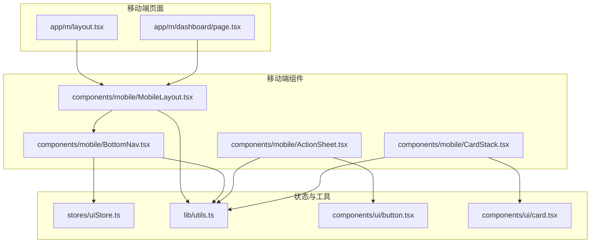
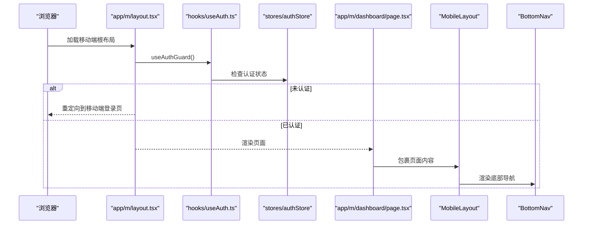
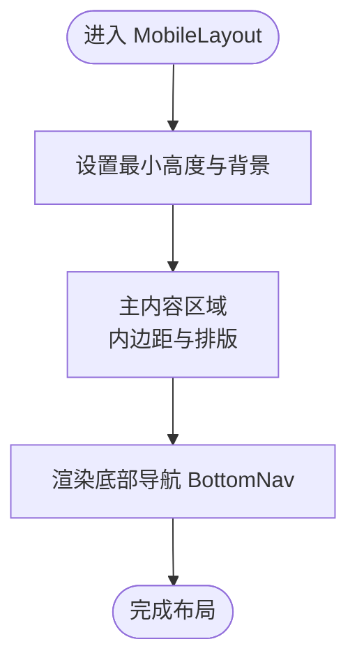
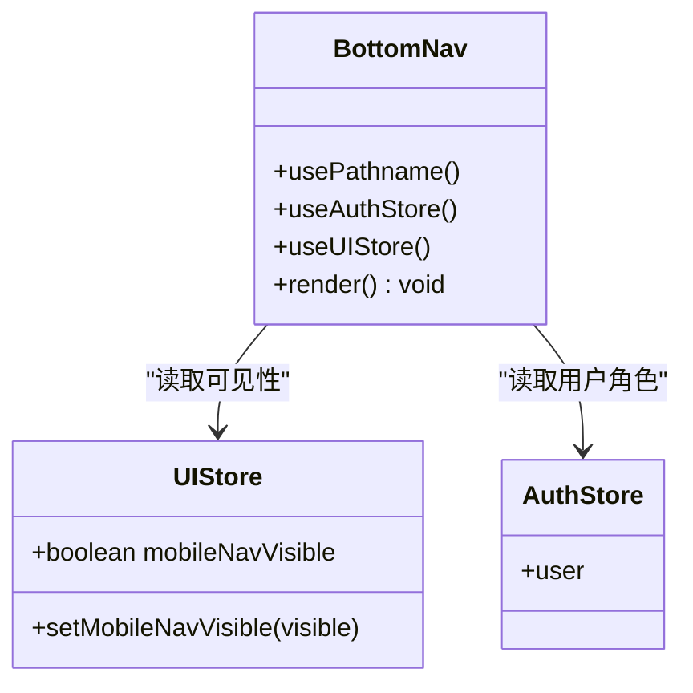
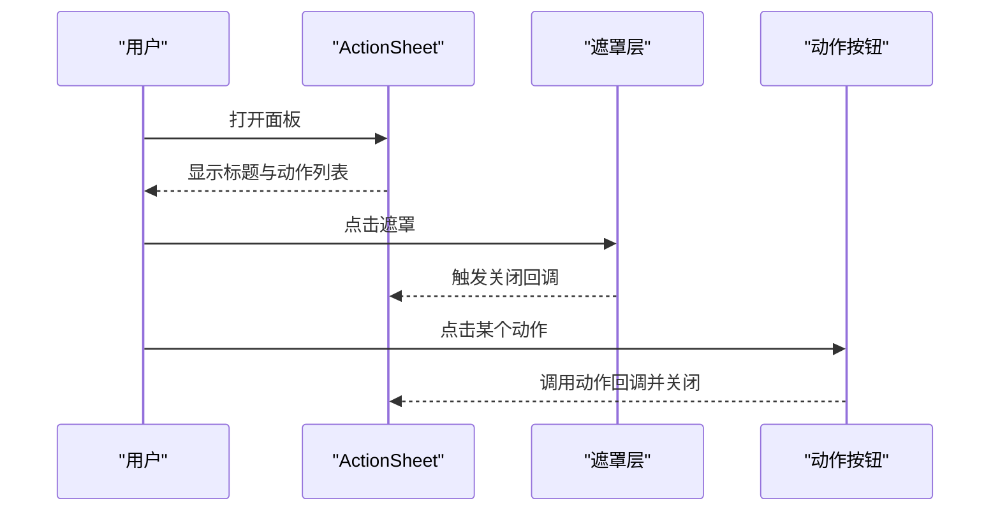
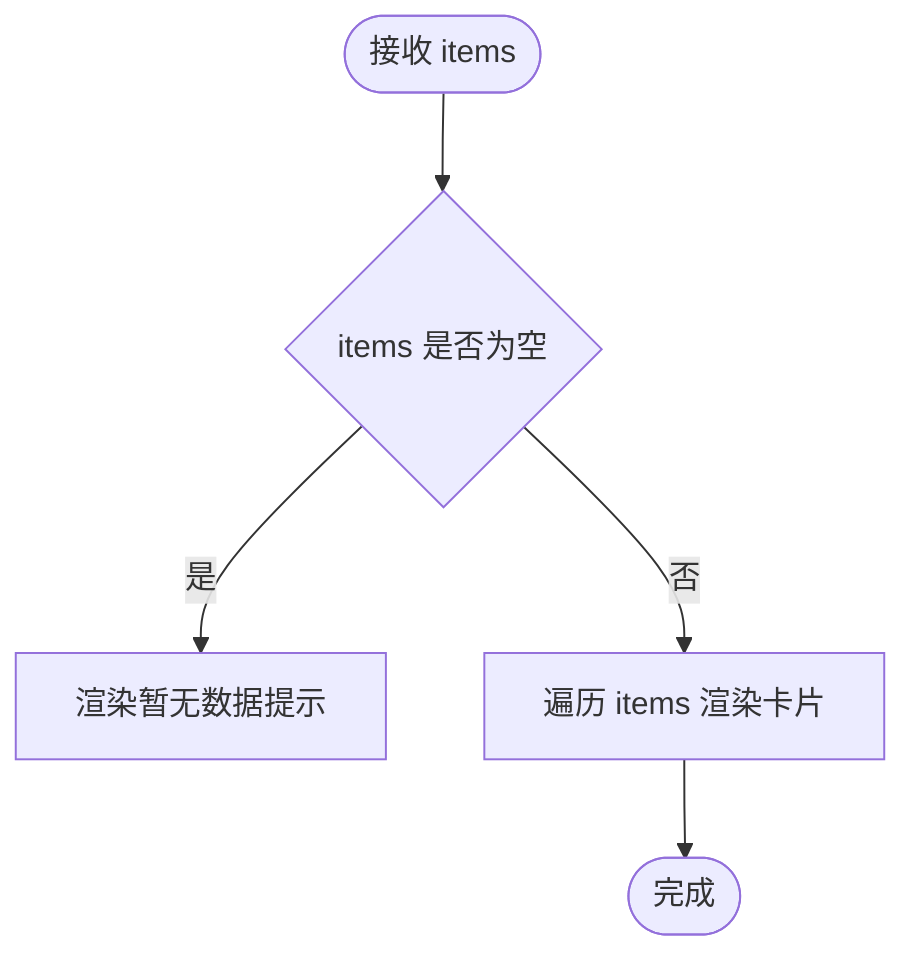
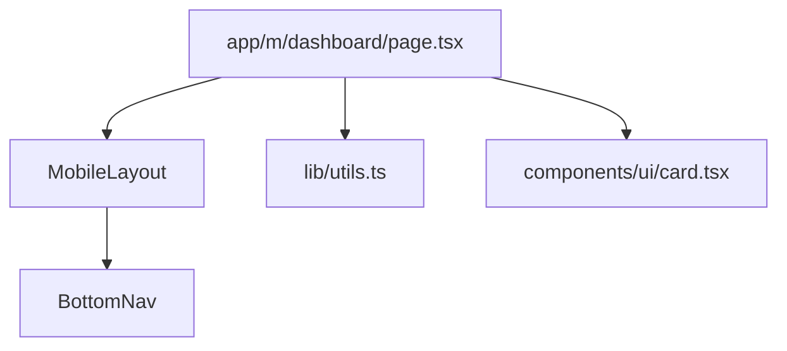
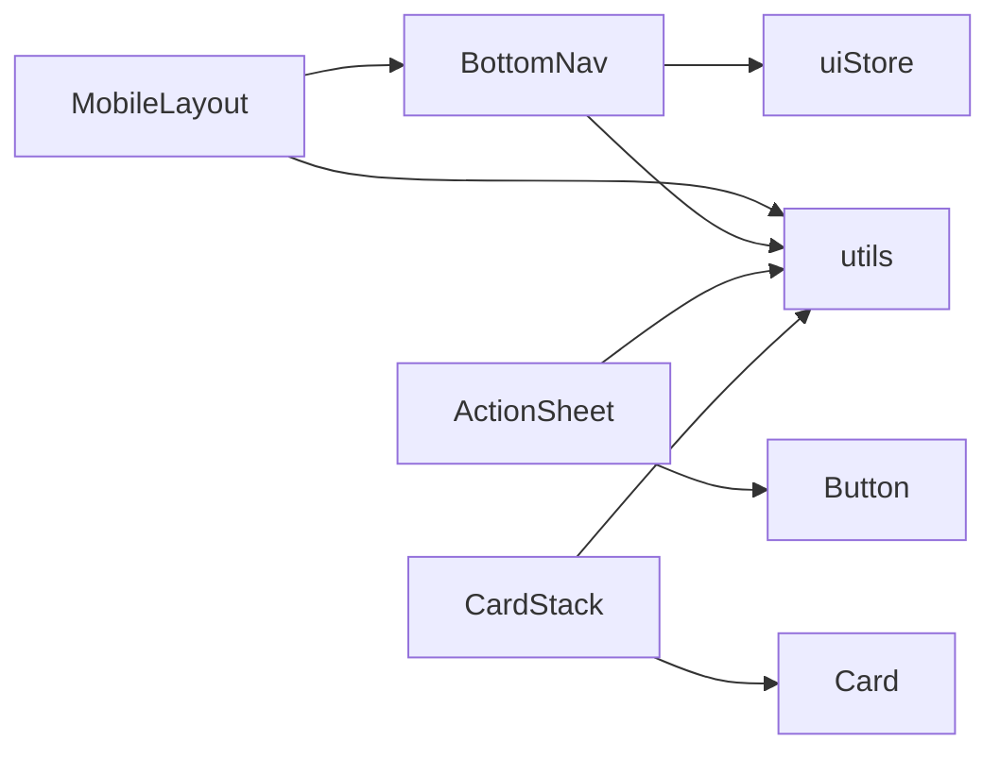

# 移动端组件

<cite>
**本文引用的文件**
- [frontend/src/components/mobile/MobileLayout.tsx](file://frontend/src/components/mobile/MobileLayout.tsx)
- [frontend/src/components/mobile/BottomNav.tsx](file://frontend/src/components/mobile/BottomNav.tsx)
- [frontend/src/components/mobile/ActionSheet.tsx](file://frontend/src/components/mobile/ActionSheet.tsx)
- [frontend/src/components/mobile/CardStack.tsx](file://frontend/src/components/mobile/CardStack.tsx)
- [frontend/src/app/m/layout.tsx](file://frontend/src/app/m/layout.tsx)
- [frontend/src/stores/uiStore.ts](file://frontend/src/stores/uiStore.ts)
- [frontend/src/lib/utils.ts](file://frontend/src/lib/utils.ts)
- [frontend/src/components/ui/button.tsx](file://frontend/src/components/ui/button.tsx)
- [frontend/src/components/ui/card.tsx](file://frontend/src/components/ui/card.tsx)
- [frontend/src/app/m/dashboard/page.tsx](file://frontend/src/app/m/dashboard/page.tsx)
- [frontend/src/hooks/useAuth.ts](file://frontend/src/hooks/useAuth.ts)
</cite>

## 目录
1. [简介](#简介)
2. [项目结构](#项目结构)
3. [核心组件](#核心组件)
4. [架构总览](#架构总览)
5. [详细组件分析](#详细组件分析)
6. [依赖分析](#依赖分析)
7. [性能考虑](#性能考虑)
8. [故障排查指南](#故障排查指南)
9. [结论](#结论)
10. [附录](#附录)

## 简介
本文件聚焦于移动端专用组件，围绕以下目标进行系统化文档化与可视化说明：
- 移动端布局组件（MobileLayout）的响应式设计与安全区域适配
- 底部导航组件（BottomNav）的移动端导航模式与状态管理
- 动作面板组件（ActionSheet）的手势支持与动画效果实现
- 卡片堆叠组件（CardStack）的层级展示与间距控制
- 移动端组件的触摸事件处理与手势识别实现现状
- 移动端组件的性能优化与电池消耗控制策略
- 移动端组件的跨平台兼容性与设备适配方案

## 项目结构
移动端组件位于前端工程的移动目录下，采用按功能模块划分的组织方式：
- 组件层：components/mobile 下包含移动端专用组件
- 页面层：app/m 下为移动端路由与页面入口
- 状态层：stores 提供全局 UI 状态管理
- 工具层：lib/utils 提供通用工具函数
- UI 基础组件：components/ui 提供按钮、卡片等基础 UI

**图示来源**
- [frontend/src/app/m/layout.tsx:1-27](file://frontend/src/app/m/layout.tsx#L1-L27)
- [frontend/src/app/m/dashboard/page.tsx:1-205](file://frontend/src/app/m/dashboard/page.tsx#L1-L205)
- [frontend/src/components/mobile/MobileLayout.tsx:1-16](file://frontend/src/components/mobile/MobileLayout.tsx#L1-L16)
- [frontend/src/components/mobile/BottomNav.tsx:1-79](file://frontend/src/components/mobile/BottomNav.tsx#L1-L79)
- [frontend/src/components/mobile/ActionSheet.tsx:1-59](file://frontend/src/components/mobile/ActionSheet.tsx#L1-L59)
- [frontend/src/components/mobile/CardStack.tsx:1-35](file://frontend/src/components/mobile/CardStack.tsx#L1-L35)
- [frontend/src/stores/uiStore.ts:1-85](file://frontend/src/stores/uiStore.ts#L1-L85)
- [frontend/src/lib/utils.ts:1-270](file://frontend/src/lib/utils.ts#L1-L270)
- [frontend/src/components/ui/button.tsx:1-56](file://frontend/src/components/ui/button.tsx#L1-L56)
- [frontend/src/components/ui/card.tsx:1-79](file://frontend/src/components/ui/card.tsx#L1-L79)

**章节来源**
- [frontend/src/app/m/layout.tsx:1-27](file://frontend/src/app/m/layout.tsx#L1-L27)
- [frontend/src/app/m/dashboard/page.tsx:1-205](file://frontend/src/app/m/dashboard/page.tsx#L1-L205)
- [frontend/src/components/mobile/MobileLayout.tsx:1-16](file://frontend/src/components/mobile/MobileLayout.tsx#L1-L16)
- [frontend/src/components/mobile/BottomNav.tsx:1-79](file://frontend/src/components/mobile/BottomNav.tsx#L1-L79)
- [frontend/src/components/mobile/ActionSheet.tsx:1-59](file://frontend/src/components/mobile/ActionSheet.tsx#L1-L59)
- [frontend/src/components/mobile/CardStack.tsx:1-35](file://frontend/src/components/mobile/CardStack.tsx#L1-L35)
- [frontend/src/stores/uiStore.ts:1-85](file://frontend/src/stores/uiStore.ts#L1-L85)
- [frontend/src/lib/utils.ts:1-270](file://frontend/src/lib/utils.ts#L1-L270)
- [frontend/src/components/ui/button.tsx:1-56](file://frontend/src/components/ui/button.tsx#L1-L56)
- [frontend/src/components/ui/card.tsx:1-79](file://frontend/src/components/ui/card.tsx#L1-L79)

## 核心组件
本节对四个移动端组件进行要点梳理与实现路径说明。

- MobileLayout
  - 职责：提供移动端页面容器，统一内边距与底部安全区，承载主内容与底部导航
  - 关键点：最小高度、内边距、底部留白、固定底部导航容器
  - 参考路径：[frontend/src/components/mobile/MobileLayout.tsx:1-16](file://frontend/src/components/mobile/MobileLayout.tsx#L1-L16)

- BottomNav
  - 职责：移动端底部导航，根据用户角色动态渲染菜单项，基于路径高亮当前项
  - 关键点：移动端可见性控制、路径匹配高亮、图标与标签、安全区域适配类
  - 参考路径：[frontend/src/components/mobile/BottomNav.tsx:1-79](file://frontend/src/components/mobile/BottomNav.tsx#L1-L79)
  - 状态来源：[frontend/src/stores/uiStore.ts:13-15](file://frontend/src/stores/uiStore.ts#L13-L15)

- ActionSheet
  - 职责：从底部弹出的动作面板，支持标题、动作列表与关闭按钮
  - 关键点：遮罩点击关闭、底部滑入动画、动作按钮变体与图标
  - 参考路径：[frontend/src/components/mobile/ActionSheet.tsx:1-59](file://frontend/src/components/mobile/ActionSheet.tsx#L1-L59)
  - 依赖基础组件：[frontend/src/components/ui/button.tsx:1-56](file://frontend/src/components/ui/button.tsx#L1-L56)

- CardStack
  - 职责：卡片堆叠展示，支持自定义间距与内容渲染
  - 关键点：空态提示、卡片间距控制、内容区样式复用
  - 参考路径：[frontend/src/components/mobile/CardStack.tsx:1-35](file://frontend/src/components/mobile/CardStack.tsx#L1-L35)
  - 依赖基础组件：[frontend/src/components/ui/card.tsx:1-79](file://frontend/src/components/ui/card.tsx#L1-L79)

**章节来源**
- [frontend/src/components/mobile/MobileLayout.tsx:1-16](file://frontend/src/components/mobile/MobileLayout.tsx#L1-L16)
- [frontend/src/components/mobile/BottomNav.tsx:1-79](file://frontend/src/components/mobile/BottomNav.tsx#L1-L79)
- [frontend/src/components/mobile/ActionSheet.tsx:1-59](file://frontend/src/components/mobile/ActionSheet.tsx#L1-L59)
- [frontend/src/components/mobile/CardStack.tsx:1-35](file://frontend/src/components/mobile/CardStack.tsx#L1-L35)
- [frontend/src/stores/uiStore.ts:13-15](file://frontend/src/stores/uiStore.ts#L13-L15)
- [frontend/src/components/ui/button.tsx:1-56](file://frontend/src/components/ui/button.tsx#L1-L56)
- [frontend/src/components/ui/card.tsx:1-79](file://frontend/src/components/ui/card.tsx#L1-L79)

## 架构总览
移动端页面通过根布局进行认证守卫与布局包裹，再由 MobileLayout 承载业务页面与底部导航。

**图示来源**
- [frontend/src/app/m/layout.tsx:1-27](file://frontend/src/app/m/layout.tsx#L1-L27)
- [frontend/src/hooks/useAuth.ts:96-115](file://frontend/src/hooks/useAuth.ts#L96-L115)
- [frontend/src/app/m/dashboard/page.tsx:1-205](file://frontend/src/app/m/dashboard/page.tsx#L1-L205)
- [frontend/src/components/mobile/MobileLayout.tsx:1-16](file://frontend/src/components/mobile/MobileLayout.tsx#L1-L16)
- [frontend/src/components/mobile/BottomNav.tsx:1-79](file://frontend/src/components/mobile/BottomNav.tsx#L1-L79)

## 详细组件分析

### MobileLayout 组件分析
- 响应式与安全区域
  - 使用最小高度与底部留白，避免内容被底部导航遮挡
  - 固定底部导航容器，保证导航在所有页面一致呈现
- 与页面的关系
  - 作为页面容器，内部放置主内容区域与底部导航
- 与工具类的协作
  - 通过工具函数合并类名，保持样式一致性

**图示来源**
- [frontend/src/components/mobile/MobileLayout.tsx:1-16](file://frontend/src/components/mobile/MobileLayout.tsx#L1-L16)
- [frontend/src/lib/utils.ts:8-10](file://frontend/src/lib/utils.ts#L8-L10)

**章节来源**
- [frontend/src/components/mobile/MobileLayout.tsx:1-16](file://frontend/src/components/mobile/MobileLayout.tsx#L1-L16)
- [frontend/src/lib/utils.ts:8-10](file://frontend/src/lib/utils.ts#L8-L10)

### BottomNav 组件分析
- 导航模式
  - 固定在屏幕底部，仅在移动端显示
  - 根据用户角色动态选择菜单项集合
- 状态管理
  - 通过 UI 状态存储控制导航可见性
  - 通过路径匹配高亮当前项，增强可访问性
- 交互与视觉
  - 图标与文字组合，支持激活态背景与指示器
  - 使用安全区域类保证在刘海屏/圆角屏下的正确显示

**图示来源**
- [frontend/src/components/mobile/BottomNav.tsx:1-79](file://frontend/src/components/mobile/BottomNav.tsx#L1-L79)
- [frontend/src/stores/uiStore.ts:13-15](file://frontend/src/stores/uiStore.ts#L13-L15)

**章节来源**
- [frontend/src/components/mobile/BottomNav.tsx:1-79](file://frontend/src/components/mobile/BottomNav.tsx#L1-L79)
- [frontend/src/stores/uiStore.ts:13-15](file://frontend/src/stores/uiStore.ts#L13-L15)

### ActionSheet 组件分析
- 手势支持
  - 遮罩层点击触发关闭，提供明确的关闭通道
- 动画效果
  - 使用底部滑入动画类，提升交互自然度
- 功能实现
  - 支持标题、动作列表与关闭按钮；每个动作可配置图标与变体
- 依赖关系
  - 基于基础按钮组件与工具类函数

**图示来源**
- [frontend/src/components/mobile/ActionSheet.tsx:1-59](file://frontend/src/components/mobile/ActionSheet.tsx#L1-L59)
- [frontend/src/components/ui/button.tsx:1-56](file://frontend/src/components/ui/button.tsx#L1-L56)

**章节来源**
- [frontend/src/components/mobile/ActionSheet.tsx:1-59](file://frontend/src/components/mobile/ActionSheet.tsx#L1-L59)
- [frontend/src/components/ui/button.tsx:1-56](file://frontend/src/components/ui/button.tsx#L1-L56)

### CardStack 组件分析
- 展示逻辑
  - 当无数据时显示占位文案；有数据时按顺序渲染卡片
  - 通过属性控制卡片间距，便于在不同页面复用
- 与基础组件的关系
  - 复用卡片基础组件，保持一致的视觉与交互体验

**图示来源**
- [frontend/src/components/mobile/CardStack.tsx:1-35](file://frontend/src/components/mobile/CardStack.tsx#L1-L35)
- [frontend/src/components/ui/card.tsx:1-79](file://frontend/src/components/ui/card.tsx#L1-L79)

**章节来源**
- [frontend/src/components/mobile/CardStack.tsx:1-35](file://frontend/src/components/mobile/CardStack.tsx#L1-L35)
- [frontend/src/components/ui/card.tsx:1-79](file://frontend/src/components/ui/card.tsx#L1-L79)

### 页面集成示例（移动端仪表盘）
- 页面通过 MobileLayout 包裹，内部使用卡片与链接等组件构建信息密度高的移动端界面
- 通过工具函数进行格式化与颜色控制，提升可读性

**图示来源**
- [frontend/src/app/m/dashboard/page.tsx:1-205](file://frontend/src/app/m/dashboard/page.tsx#L1-L205)
- [frontend/src/components/mobile/MobileLayout.tsx:1-16](file://frontend/src/components/mobile/MobileLayout.tsx#L1-L16)
- [frontend/src/components/mobile/BottomNav.tsx:1-79](file://frontend/src/components/mobile/BottomNav.tsx#L1-L79)
- [frontend/src/lib/utils.ts:1-270](file://frontend/src/lib/utils.ts#L1-L270)
- [frontend/src/components/ui/card.tsx:1-79](file://frontend/src/components/ui/card.tsx#L1-L79)

**章节来源**
- [frontend/src/app/m/dashboard/page.tsx:1-205](file://frontend/src/app/m/dashboard/page.tsx#L1-L205)

## 依赖分析
- 组件间耦合
  - MobileLayout 与 BottomNav 强关联（布局与导航），其他组件通过工具与状态解耦
- 外部依赖
  - Next.js 的路由与导航能力（usePathname、Link）
  - Zustand 状态管理（UI 状态）
  - Radix UI 与 Tailwind CSS（基础组件与样式）

**图示来源**
- [frontend/src/components/mobile/BottomNav.tsx:1-79](file://frontend/src/components/mobile/BottomNav.tsx#L1-L79)
- [frontend/src/stores/uiStore.ts:1-85](file://frontend/src/stores/uiStore.ts#L1-L85)
- [frontend/src/components/mobile/MobileLayout.tsx:1-16](file://frontend/src/components/mobile/MobileLayout.tsx#L1-L16)
- [frontend/src/components/mobile/ActionSheet.tsx:1-59](file://frontend/src/components/mobile/ActionSheet.tsx#L1-L59)
- [frontend/src/components/mobile/CardStack.tsx:1-35](file://frontend/src/components/mobile/CardStack.tsx#L1-L35)
- [frontend/src/lib/utils.ts:1-270](file://frontend/src/lib/utils.ts#L1-L270)
- [frontend/src/components/ui/button.tsx:1-56](file://frontend/src/components/ui/button.tsx#L1-L56)
- [frontend/src/components/ui/card.tsx:1-79](file://frontend/src/components/ui/card.tsx#L1-L79)

**章节来源**
- [frontend/src/components/mobile/BottomNav.tsx:1-79](file://frontend/src/components/mobile/BottomNav.tsx#L1-L79)
- [frontend/src/stores/uiStore.ts:1-85](file://frontend/src/stores/uiStore.ts#L1-L85)
- [frontend/src/components/mobile/MobileLayout.tsx:1-16](file://frontend/src/components/mobile/MobileLayout.tsx#L1-L16)
- [frontend/src/components/mobile/ActionSheet.tsx:1-59](file://frontend/src/components/mobile/ActionSheet.tsx#L1-L59)
- [frontend/src/components/mobile/CardStack.tsx:1-35](file://frontend/src/components/mobile/CardStack.tsx#L1-L35)
- [frontend/src/lib/utils.ts:1-270](file://frontend/src/lib/utils.ts#L1-L270)
- [frontend/src/components/ui/button.tsx:1-56](file://frontend/src/components/ui/button.tsx#L1-L56)
- [frontend/src/components/ui/card.tsx:1-79](file://frontend/src/components/ui/card.tsx#L1-L79)

## 性能考虑
- 渲染与重绘
  - 使用工具函数合并类名，减少重复计算与样式冲突
  - 底部导航在移动端隐藏时直接返回空，避免不必要渲染
- 状态持久化
  - UI 状态持久化仅保留部分字段，降低存储与初始化成本
- 动画与过渡
  - 使用 CSS 动画类实现滑入效果，避免复杂 JavaScript 动画带来的性能损耗
- 数据展示
  - CardStack 在空数据时快速返回占位文案，减少列表渲染开销

**章节来源**
- [frontend/src/lib/utils.ts:8-10](file://frontend/src/lib/utils.ts#L8-L10)
- [frontend/src/components/mobile/BottomNav.tsx:37-39](file://frontend/src/components/mobile/BottomNav.tsx#L37-L39)
- [frontend/src/stores/uiStore.ts:76-83](file://frontend/src/stores/uiStore.ts#L76-L83)
- [frontend/src/components/mobile/ActionSheet.tsx:29-32](file://frontend/src/components/mobile/ActionSheet.tsx#L29-L32)
- [frontend/src/components/mobile/CardStack.tsx:18-24](file://frontend/src/components/mobile/CardStack.tsx#L18-L24)

## 故障排查指南
- 底部导航不显示
  - 检查 UI 状态中的可见性开关
  - 参考：[frontend/src/stores/uiStore.ts:13-15](file://frontend/src/stores/uiStore.ts#L13-L15)
- 导航高亮异常
  - 检查路径匹配逻辑与当前路由
  - 参考：[frontend/src/components/mobile/BottomNav.tsx:46-47](file://frontend/src/components/mobile/BottomNav.tsx#L46-L47)
- 动作面板无法关闭
  - 检查遮罩点击回调与关闭函数绑定
  - 参考：[frontend/src/components/mobile/ActionSheet.tsx:27-28](file://frontend/src/components/mobile/ActionSheet.tsx#L27-L28)
- 卡片间距不生效
  - 检查传入的 gap 参数与类名拼接规则
  - 参考：[frontend/src/components/mobile/CardStack.tsx:27-27](file://frontend/src/components/mobile/CardStack.tsx#L27-L27)

**章节来源**
- [frontend/src/stores/uiStore.ts:13-15](file://frontend/src/stores/uiStore.ts#L13-L15)
- [frontend/src/components/mobile/BottomNav.tsx:46-47](file://frontend/src/components/mobile/BottomNav.tsx#L46-L47)
- [frontend/src/components/mobile/ActionSheet.tsx:27-28](file://frontend/src/components/mobile/ActionSheet.tsx#L27-L28)
- [frontend/src/components/mobile/CardStack.tsx:27-27](file://frontend/src/components/mobile/CardStack.tsx#L27-L27)

## 结论
本文件对移动端布局、导航、动作面板与卡片堆叠组件进行了全面的结构化说明，并结合实际源码路径定位关键实现点。当前组件在移动端适配方面具备良好的基础：底部导航可见性控制、安全区域适配、动画与手势交互（遮罩关闭）、以及通过工具与状态管理实现的低耦合设计。后续可在手势识别（如滑动手势）与更精细的性能优化（如虚拟滚动、懒加载）方面进一步完善。

## 附录
- 跨平台兼容性与设备适配建议
  - 使用媒体查询与安全区域类保证在不同设备上的显示一致性
  - 对于手势识别，可引入轻量级手势库并在移动端启用，桌面端禁用或降级
- 电池消耗控制策略
  - 减少不必要的重渲染与状态更新
  - 使用 CSS 动画替代复杂 JS 动画
  - 控制动画时长与频率，避免高频触发的副作用