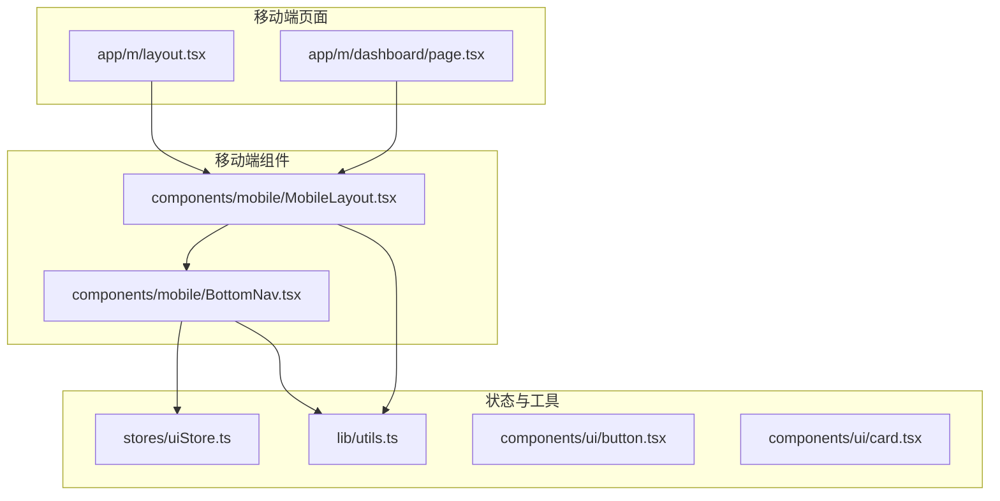
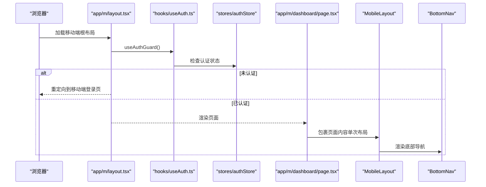
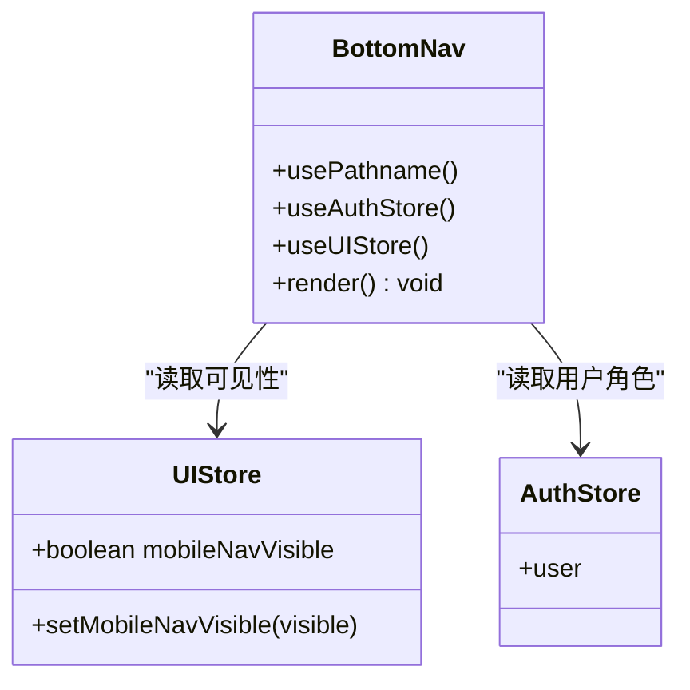
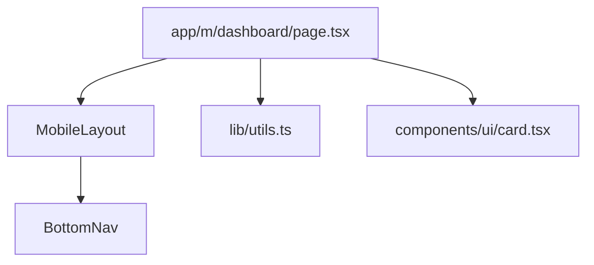
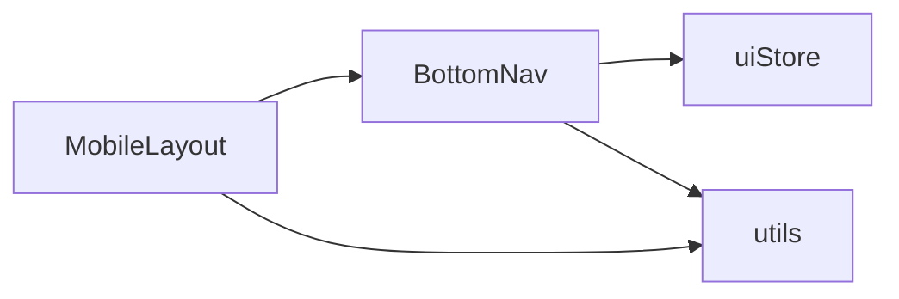

# 移动端组件

<cite>
**本文引用的文件**
- [frontend/src/components/mobile/MobileLayout.tsx](file://frontend/src/components/mobile/MobileLayout.tsx)
- [frontend/src/components/mobile/BottomNav.tsx](file://frontend/src/components/mobile/BottomNav.tsx)
- [frontend/src/app/m/layout.tsx](file://frontend/src/app/m/layout.tsx)
- [frontend/src/stores/uiStore.ts](file://frontend/src/stores/uiStore.ts)
- [frontend/src/lib/utils.ts](file://frontend/src/lib/utils.ts)
- [frontend/src/components/ui/button.tsx](file://frontend/src/components/ui/button.tsx)
- [frontend/src/components/ui/card.tsx](file://frontend/src/components/ui/card.tsx)
- [frontend/src/app/m/dashboard/page.tsx](file://frontend/src/app/m/dashboard/page.tsx)
- [frontend/src/hooks/useAuth.ts](file://frontend/src/hooks/useAuth.ts)
</cite>

## 更新摘要
**所做更改**
- 移除了已删除的 ActionSheet.tsx 和 CardStack.tsx 组件相关文档内容
- 更新了移动端组件架构，仅保留 MobileLayout 和 BottomNav 两个核心组件
- 调整了依赖分析和架构图表以反映当前代码库状态
- 更新了故障排查指南，移除已删除组件的相关问题解决方案

## 目录
1. [简介](#简介)
2. [项目结构](#项目结构)
3. [核心组件](#核心组件)
4. [架构总览](#架构总览)
5. [详细组件分析](#详细组件分析)
6. [依赖分析](#依赖分析)
7. [性能考虑](#性能考虑)
8. [故障排查指南](#故障排查指南)
9. [结论](#结论)
10. [附录](#附录)

## 简介
本文件聚焦于移动端专用组件，围绕以下目标进行系统化文档化与可视化说明：
- 移动端布局组件（MobileLayout）的响应式设计与安全区域适配
- 底部导航组件（BottomNav）的移动端导航模式与状态管理
- 移动端组件的触摸事件处理与手势识别实现现状
- 移动端组件的性能优化与电池消耗控制策略
- 移动端组件的跨平台兼容性与设备适配方案

**最新更新**：经过清理阶段后，ActionSheet.tsx 和 CardStack.tsx 组件已被移除，当前移动端组件架构简化为 MobileLayout 和 BottomNav 两个核心组件。

## 项目结构
移动端组件位于前端工程的移动目录下，采用按功能模块划分的组织方式：
- 组件层：components/mobile 下包含移动端专用组件
- 页面层：app/m 下为移动端路由与页面入口
- 状态层：stores 提供全局 UI 状态管理
- 工具层：lib/utils 提供通用工具函数
- UI 基础组件：components/ui 提供按钮、卡片等基础 UI

**图示来源**
- [frontend/src/app/m/layout.tsx:1-27](file://frontend/src/app/m/layout.tsx#L1-L27)
- [frontend/src/app/m/dashboard/page.tsx:1-205](file://frontend/src/app/m/dashboard/page.tsx#L1-L205)
- [frontend/src/components/mobile/MobileLayout.tsx:1-16](file://frontend/src/components/mobile/MobileLayout.tsx#L1-L16)
- [frontend/src/components/mobile/BottomNav.tsx:1-79](file://frontend/src/components/mobile/BottomNav.tsx#L1-L79)
- [frontend/src/stores/uiStore.ts:1-85](file://frontend/src/stores/uiStore.ts#L1-L85)
- [frontend/src/lib/utils.ts:1-270](file://frontend/src/lib/utils.ts#L1-L270)
- [frontend/src/components/ui/button.tsx:1-56](file://frontend/src/components/ui/button.tsx#L1-L56)
- [frontend/src/components/ui/card.tsx:1-79](file://frontend/src/components/ui/card.tsx#L1-L79)

**章节来源**
- [frontend/src/app/m/layout.tsx:1-27](file://frontend/src/app/m/layout.tsx#L1-L27)
- [frontend/src/app/m/dashboard/page.tsx:1-205](file://frontend/src/app/m/dashboard/page.tsx#L1-L205)
- [frontend/src/components/mobile/MobileLayout.tsx:1-16](file://frontend/src/components/mobile/MobileLayout.tsx#L1-L16)
- [frontend/src/components/mobile/BottomNav.tsx:1-79](file://frontend/src/components/mobile/BottomNav.tsx#L1-L79)
- [frontend/src/stores/uiStore.ts:1-85](file://frontend/src/stores/uiStore.ts#L1-L85)
- [frontend/src/lib/utils.ts:1-270](file://frontend/src/lib/utils.ts#L1-L270)
- [frontend/src/components/ui/button.tsx:1-56](file://frontend/src/components/ui/button.tsx#L1-L56)
- [frontend/src/components/ui/card.tsx:1-79](file://frontend/src/components/ui/card.tsx#L1-L79)

## 核心组件
本节对两个核心移动端组件进行要点梳理与实现路径说明。

- MobileLayout
  - 职责：提供移动端页面容器，统一内边距与底部安全区，承载主内容与底部导航
  - 关键点：最小高度、内边距、底部留白、固定底部导航容器
  - 参考路径：[frontend/src/components/mobile/MobileLayout.tsx:1-16](file://frontend/src/components/mobile/MobileLayout.tsx#L1-L16)

- BottomNav
  - 职责：移动端底部导航，根据用户角色动态渲染菜单项，基于路径高亮当前项
  - 关键点：移动端可见性控制、路径匹配高亮、图标与标签、安全区域适配类
  - 参考路径：[frontend/src/components/mobile/BottomNav.tsx:1-79](file://frontend/src/components/mobile/BottomNav.tsx#L1-L79)
  - 状态来源：[frontend/src/stores/uiStore.ts:13-15](file://frontend/src/stores/uiStore.ts#L13-L15)

**章节来源**
- [frontend/src/components/mobile/MobileLayout.tsx:1-16](file://frontend/src/components/mobile/MobileLayout.tsx#L1-L16)
- [frontend/src/components/mobile/BottomNav.tsx:1-79](file://frontend/src/components/mobile/BottomNav.tsx#L1-L79)
- [frontend/src/stores/uiStore.ts:13-15](file://frontend/src/stores/uiStore.ts#L13-L15)

## 架构总览
移动端页面通过根布局进行认证守卫与布局包裹，再由 MobileLayout 承载业务页面与底部导航。

**图示来源**
- [frontend/src/app/m/layout.tsx:1-27](file://frontend/src/app/m/layout.tsx#L1-L27)
- [frontend/src/hooks/useAuth.ts:96-115](file://frontend/src/hooks/useAuth.ts#L96-L115)
- [frontend/src/app/m/dashboard/page.tsx:1-205](file://frontend/src/app/m/dashboard/page.tsx#L1-L205)
- [frontend/src/components/mobile/MobileLayout.tsx:1-16](file://frontend/src/components/mobile/MobileLayout.tsx#L1-L16)
- [frontend/src/components/mobile/BottomNav.tsx:1-79](file://frontend/src/components/mobile/BottomNav.tsx#L1-L79)

## 详细组件分析

### MobileLayout 组件分析
- 响应式与安全区域
  - 使用最小高度与底部留白，避免内容被底部导航遮挡
  - 固定底部导航容器，保证导航在所有页面一致呈现
- 与页面的关系
  - 作为页面容器，内部放置主内容区域与底部导航
- 与工具类的协作
  - 通过工具函数合并类名，保持样式一致性

**图示来源**
- [frontend/src/components/mobile/MobileLayout.tsx:1-16](file://frontend/src/components/mobile/MobileLayout.tsx#L1-L16)
- [frontend/src/lib/utils.ts:8-10](file://frontend/src/lib/utils.ts#L8-L10)

**章节来源**
- [frontend/src/components/mobile/MobileLayout.tsx:1-16](file://frontend/src/components/mobile/MobileLayout.tsx#L1-L16)
- [frontend/src/lib/utils.ts:8-10](file://frontend/src/lib/utils.ts#L8-L10)

### BottomNav 组件分析
- 导航模式
  - 固定在屏幕底部，仅在移动端显示
  - 根据用户角色动态选择菜单项集合
- 状态管理
  - 通过 UI 状态存储控制导航可见性
  - 通过路径匹配高亮当前项，增强可访问性
- 交互与视觉
  - 图标与文字组合，支持激活态背景与指示器
  - 使用安全区域类保证在刘海屏/圆角屏下的正确显示

**图示来源**
- [frontend/src/components/mobile/BottomNav.tsx:1-79](file://frontend/src/components/mobile/BottomNav.tsx#L1-L79)
- [frontend/src/stores/uiStore.ts:13-15](file://frontend/src/stores/uiStore.ts#L13-L15)

**章节来源**
- [frontend/src/components/mobile/BottomNav.tsx:1-79](file://frontend/src/components/mobile/BottomNav.tsx#L1-L79)
- [frontend/src/stores/uiStore.ts:13-15](file://frontend/src/stores/uiStore.ts#L13-L15)

### 页面集成示例（移动端仪表盘）
- 页面通过 MobileLayout 包裹，内部使用卡片与链接等组件构建信息密度高的移动端界面
- 通过工具函数进行格式化与颜色控制，提升可读性

**图示来源**
- [frontend/src/app/m/dashboard/page.tsx:1-205](file://frontend/src/app/m/dashboard/page.tsx#L1-L205)
- [frontend/src/components/mobile/MobileLayout.tsx:1-16](file://frontend/src/components/mobile/MobileLayout.tsx#L1-L16)
- [frontend/src/components/mobile/BottomNav.tsx:1-79](file://frontend/src/components/mobile/BottomNav.tsx#L1-L79)
- [frontend/src/lib/utils.ts:1-270](file://frontend/src/lib/utils.ts#L1-L270)
- [frontend/src/components/ui/card.tsx:1-79](file://frontend/src/components/ui/card.tsx#L1-L79)

**章节来源**
- [frontend/src/app/m/dashboard/page.tsx:1-205](file://frontend/src/app/m/dashboard/page.tsx#L1-L205)

## 依赖分析
- 组件间耦合
  - MobileLayout 与 BottomNav 强关联（布局与导航），其他组件通过工具与状态解耦
- 外部依赖
  - Next.js 的路由与导航能力（usePathname、Link）
  - Zustand 状态管理（UI 状态）
  - Radix UI 与 Tailwind CSS（基础组件与样式）

**图示来源**
- [frontend/src/components/mobile/BottomNav.tsx:1-79](file://frontend/src/components/mobile/BottomNav.tsx#L1-L79)
- [frontend/src/stores/uiStore.ts:1-85](file://frontend/src/stores/uiStore.ts#L1-L85)
- [frontend/src/components/mobile/MobileLayout.tsx:1-16](file://frontend/src/components/mobile/MobileLayout.tsx#L1-L16)
- [frontend/src/lib/utils.ts:1-270](file://frontend/src/lib/utils.ts#L1-L270)

**章节来源**
- [frontend/src/components/mobile/BottomNav.tsx:1-79](file://frontend/src/components/mobile/BottomNav.tsx#L1-L79)
- [frontend/src/stores/uiStore.ts:1-85](file://frontend/src/stores/uiStore.ts#L1-L85)
- [frontend/src/components/mobile/MobileLayout.tsx:1-16](file://frontend/src/components/mobile/MobileLayout.tsx#L1-L16)
- [frontend/src/lib/utils.ts:1-270](file://frontend/src/lib/utils.ts#L1-L270)

## 性能考虑
- 渲染与重绘
  - 使用工具函数合并类名，减少重复计算与样式冲突
  - 底部导航在移动端隐藏时直接返回空，避免不必要渲染
- 状态持久化
  - UI 状态持久化仅保留部分字段，降低存储与初始化成本
- 动画与过渡
  - 使用 CSS 动画类实现滑入效果，避免复杂 JavaScript 动画带来的性能损耗
- **更新**：经过清理阶段后，移除了不必要的组件依赖，简化了整体架构，提升了渲染性能

**章节来源**
- [frontend/src/lib/utils.ts:8-10](file://frontend/src/lib/utils.ts#L8-L10)
- [frontend/src/components/mobile/BottomNav.tsx:37-39](file://frontend/src/components/mobile/BottomNav.tsx#L37-L39)
- [frontend/src/stores/uiStore.ts:76-83](file://frontend/src/stores/uiStore.ts#L76-L83)

## 故障排查指南
- 底部导航不显示
  - 检查 UI 状态中的可见性开关
  - 参考：[frontend/src/stores/uiStore.ts:13-15](file://frontend/src/stores/uiStore.ts#L13-L15)
- 导航高亮异常
  - 检查路径匹配逻辑与当前路由
  - 参考：[frontend/src/components/mobile/BottomNav.tsx:46-47](file://frontend/src/components/mobile/BottomNav.tsx#L46-L47)
- **新增**：移动端登录页面认证问题
  - 检查/m/login端点的认证守卫是否正确配置
  - 确认useAuthGuard钩子是否正确处理认证状态
  - 参考：[frontend/src/hooks/useAuth.ts:96-115](file://frontend/src/hooks/useAuth.ts#L96-L115)
- **新增**：布局嵌套问题
  - 确保MobileLayout只通过m/layout提供一次布局
  - 检查是否有重复的布局包裹导致嵌套布局问题

**章节来源**
- [frontend/src/stores/uiStore.ts:13-15](file://frontend/src/stores/uiStore.ts#L13-L15)
- [frontend/src/components/mobile/BottomNav.tsx:46-47](file://frontend/src/components/mobile/BottomNav.tsx#L46-L47)
- [frontend/src/hooks/useAuth.ts:96-115](file://frontend/src/hooks/useAuth.ts#L96-L115)

## 结论
本文件对移动端布局与导航组件进行了全面的结构化说明，并结合实际源码路径定位关键实现点。当前组件在移动端适配方面具备良好的基础：底部导航可见性控制、安全区域适配、以及通过工具与状态管理实现的低耦合设计。

**最新更新**：经过清理阶段后，ActionSheet.tsx 和 CardStack.tsx 组件已被移除，当前移动端组件架构更加简洁高效。后续可在手势识别（如滑动手势）与更精细的性能优化（如虚拟滚动、懒加载）方面进一步完善。

## 附录
- 跨平台兼容性与设备适配建议
  - 使用媒体查询与安全区域类保证在不同设备上的显示一致性
  - 对于手势识别，可引入轻量级手势库并在移动端启用，桌面端禁用或降级
- 电池消耗控制策略
  - 减少不必要的重渲染与状态更新
  - 使用 CSS 动画替代复杂 JS 动画
  - 控制动画时长与频率，避免高频触发的副作用
- **新增**：布局系统最佳实践
  - 确保移动端布局组件只实例化一次，避免嵌套布局
  - 合理使用认证守卫，确保路由级别的权限控制
  - 利用Next.js的路由系统进行统一的移动端页面管理