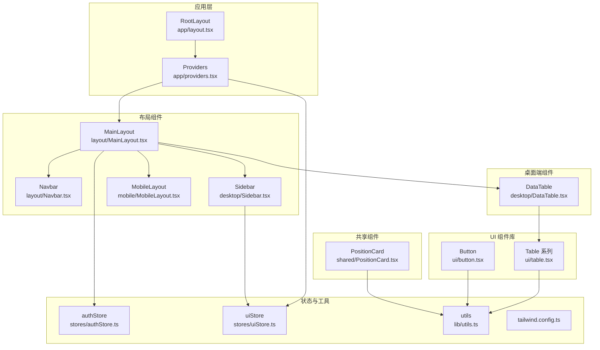
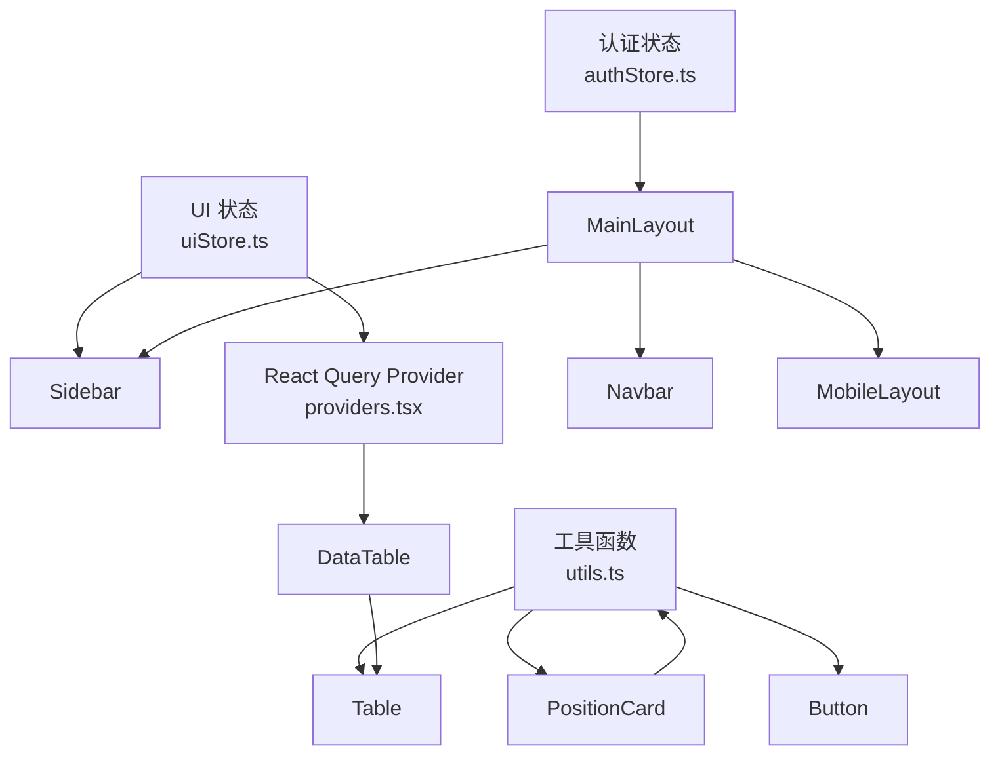
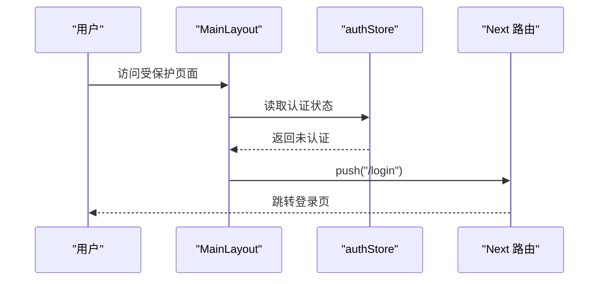
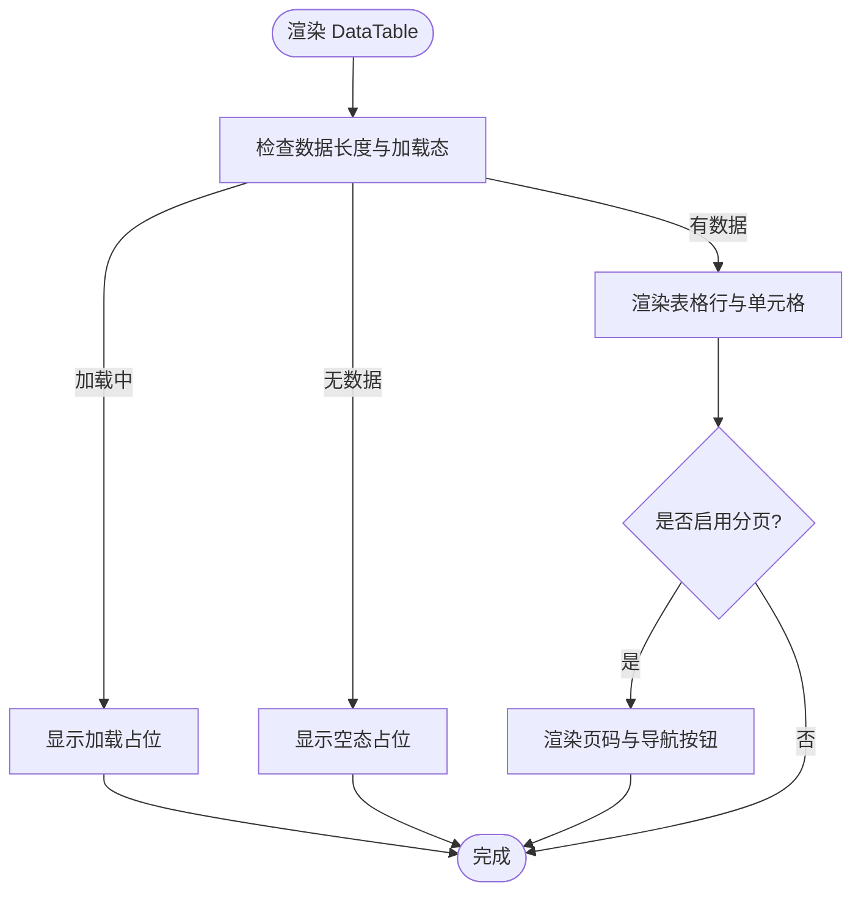
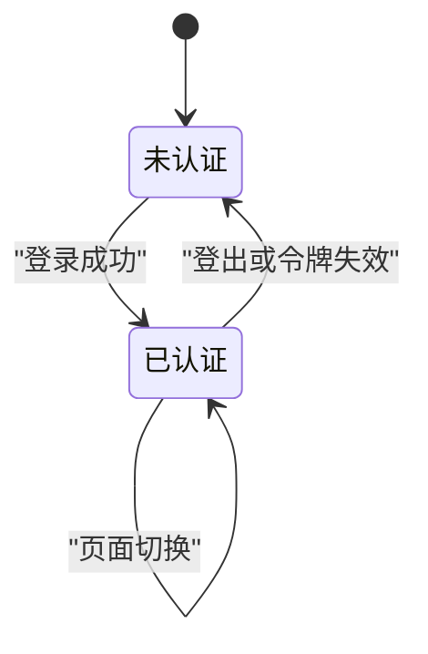
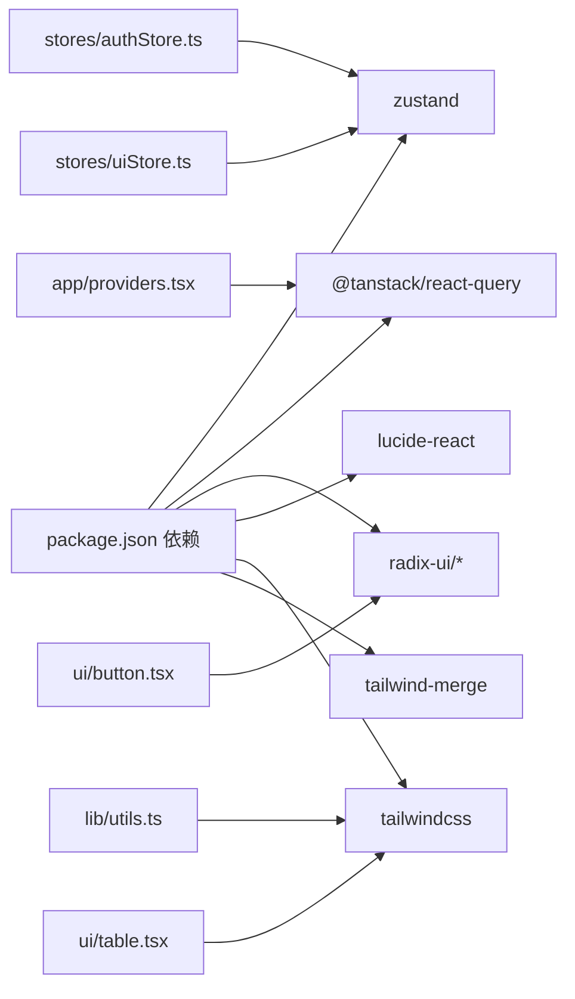

# 组件系统架构

<cite>
**本文引用的文件**
- [MainLayout.tsx](file://frontend/src/components/layout/MainLayout.tsx)
- [Sidebar.tsx](file://frontend/src/components/desktop/Sidebar.tsx)
- [MobileLayout.tsx](file://frontend/src/components/mobile/MobileLayout.tsx)
- [button.tsx](file://frontend/src/components/ui/button.tsx)
- [table.tsx](file://frontend/src/components/ui/table.tsx)
- [DataTable.tsx](file://frontend/src/components/desktop/DataTable.tsx)
- [PositionCard.tsx](file://frontend/src/components/shared/PositionCard.tsx)
- [Navbar.tsx](file://frontend/src/components/layout/Navbar.tsx)
- [layout.tsx](file://frontend/src/app/layout.tsx)
- [providers.tsx](file://frontend/src/app/providers.tsx)
- [authStore.ts](file://frontend/src/stores/authStore.ts)
- [uiStore.ts](file://frontend/src/stores/uiStore.ts)
- [utils.ts](file://frontend/src/lib/utils.ts)
- [tailwind.config.ts](file://frontend/tailwind.config.ts)
- [package.json](file://frontend/package.json)
</cite>

## 目录
1. [引言](#引言)
2. [项目结构](#项目结构)
3. [核心组件](#核心组件)
4. [架构总览](#架构总览)
5. [组件详解](#组件详解)
6. [依赖关系分析](#依赖关系分析)
7. [性能考量](#性能考量)
8. [故障排查指南](#故障排查指南)
9. [结论](#结论)
10. [附录](#附录)

## 引言
本文件系统性梳理 InvestRing 前端组件系统架构，聚焦以下目标：
- 分层设计：布局组件、桌面端组件与移动端组件的职责边界与协作方式
- 复用策略：通用 UI 组件、业务卡片与布局容器的复用路径
- 通信机制：状态存储（Zustand）、全局查询缓存（React Query）、UI 状态与路由联动
- UI 组件库：shadcn/ui + TailwindCSS 的使用规范与自定义组件开发
- 响应式设计：断点策略与移动端适配
- 状态管理、事件处理与生命周期
- 开发规范、样式约定与可访问性
- 测试策略与性能优化建议

## 项目结构
前端采用 Next.js App Router 结构，按功能域组织组件与页面。整体目录要点如下：
- app：应用根布局、全局提供者、页面入口
- components：按领域分层的组件集合
  - layout：布局组件（桌面/移动导航、主布局）
  - desktop：桌面端专用组件（表格、侧边栏等）
  - mobile：移动端布局与交互组件
  - ui：基于 shadcn/ui 的基础 UI 组件封装
  - shared：跨页面复用的业务组件
- stores：状态管理（Zustand）
- lib：工具函数（样式合并、格式化、通用逻辑）
- tailwind.config.ts：Tailwind 主题与变量扩展

图表来源
- [layout.tsx:1-32](file://frontend/src/app/layout.tsx#L1-L32)
- [providers.tsx:1-28](file://frontend/src/app/providers.tsx#L1-L28)
- [MainLayout.tsx:1-41](file://frontend/src/components/layout/MainLayout.tsx#L1-L41)
- [Navbar.tsx:1-62](file://frontend/src/components/layout/Navbar.tsx#L1-L62)
- [Sidebar.tsx:1-147](file://frontend/src/components/desktop/Sidebar.tsx#L1-L147)
- [MobileLayout.tsx:1-16](file://frontend/src/components/mobile/MobileLayout.tsx#L1-L16)
- [DataTable.tsx:1-124](file://frontend/src/components/desktop/DataTable.tsx#L1-L124)
- [table.tsx:1-114](file://frontend/src/components/ui/table.tsx#L1-L114)
- [button.tsx:1-56](file://frontend/src/components/ui/button.tsx#L1-L56)
- [PositionCard.tsx:1-83](file://frontend/src/components/shared/PositionCard.tsx#L1-L83)
- [authStore.ts:1-71](file://frontend/src/stores/authStore.ts#L1-L71)
- [uiStore.ts:1-85](file://frontend/src/stores/uiStore.ts#L1-L85)
- [utils.ts:1-270](file://frontend/src/lib/utils.ts#L1-L270)
- [tailwind.config.ts:1-57](file://frontend/tailwind.config.ts#L1-L57)

章节来源
- [layout.tsx:1-32](file://frontend/src/app/layout.tsx#L1-L32)
- [providers.tsx:1-28](file://frontend/src/app/providers.tsx#L1-L28)

## 核心组件
- 布局层
  - MainLayout：统一认证校验、桌面端主布局与移动端导航整合
  - Navbar：顶部用户信息与下拉菜单
  - Sidebar：桌面端导航与侧边栏折叠控制
  - MobileLayout：移动端内容区与底部导航容器
- 桌面端组件
  - DataTable：通用表格组件，支持分页、加载态与空态
- 共享组件
  - PositionCard：组合持仓卡片，统一收益展示与点击交互
- UI 组件库
  - Button：基于 CVA 的变体与尺寸体系
  - Table 系列：表格容器与行/单元格封装
- 工具与状态
  - utils：样式合并、格式化、颜色与市场映射等
  - authStore：认证状态持久化与登录/登出流程
  - uiStore：UI 状态（侧边栏、全局加载、Toast）

章节来源
- [MainLayout.tsx:1-41](file://frontend/src/components/layout/MainLayout.tsx#L1-L41)
- [Navbar.tsx:1-62](file://frontend/src/components/layout/Navbar.tsx#L1-L62)
- [Sidebar.tsx:1-147](file://frontend/src/components/desktop/Sidebar.tsx#L1-L147)
- [MobileLayout.tsx:1-16](file://frontend/src/components/mobile/MobileLayout.tsx#L1-L16)
- [DataTable.tsx:1-124](file://frontend/src/components/desktop/DataTable.tsx#L1-L124)
- [PositionCard.tsx:1-83](file://frontend/src/components/shared/PositionCard.tsx#L1-L83)
- [button.tsx:1-56](file://frontend/src/components/ui/button.tsx#L1-L56)
- [table.tsx:1-114](file://frontend/src/components/ui/table.tsx#L1-L114)
- [authStore.ts:1-71](file://frontend/src/stores/authStore.ts#L1-L71)
- [uiStore.ts:1-85](file://frontend/src/stores/uiStore.ts#L1-L85)
- [utils.ts:1-270](file://frontend/src/lib/utils.ts#L1-L270)

## 架构总览
组件系统围绕“布局层 + 业务组件层 + UI 组件库 + 状态与工具”四层构建，通过 Zustand 管理 UI 状态与认证状态，通过 React Query 提供全局数据缓存与失效策略，通过 TailwindCSS 与主题变量实现一致的视觉语言。

图表来源
- [authStore.ts:1-71](file://frontend/src/stores/authStore.ts#L1-L71)
- [uiStore.ts:1-85](file://frontend/src/stores/uiStore.ts#L1-L85)
- [providers.tsx:1-28](file://frontend/src/app/providers.tsx#L1-L28)
- [MainLayout.tsx:1-41](file://frontend/src/components/layout/MainLayout.tsx#L1-L41)
- [Navbar.tsx:1-62](file://frontend/src/components/layout/Navbar.tsx#L1-L62)
- [Sidebar.tsx:1-147](file://frontend/src/components/desktop/Sidebar.tsx#L1-L147)
- [MobileLayout.tsx:1-16](file://frontend/src/components/mobile/MobileLayout.tsx#L1-L16)
- [DataTable.tsx:1-124](file://frontend/src/components/desktop/DataTable.tsx#L1-L124)
- [table.tsx:1-114](file://frontend/src/components/ui/table.tsx#L1-L114)
- [button.tsx:1-56](file://frontend/src/components/ui/button.tsx#L1-L56)
- [PositionCard.tsx:1-83](file://frontend/src/components/shared/PositionCard.tsx#L1-L83)
- [utils.ts:1-270](file://frontend/src/lib/utils.ts#L1-L270)

## 组件详解

### 布局组件
- MainLayout
  - 职责：统一认证检查、桌面端主布局与移动端导航整合；根据认证状态决定渲染或跳转
  - 关键点：使用路由守卫进行未登录重定向；桌面端主内容区域与移动端底部导航并存
- Navbar
  - 职责：顶部品牌区、用户信息下拉菜单与退出登录
  - 关键点：结合认证状态显示角色与名称；触发登出后跳转登录页
- Sidebar
  - 职责：桌面端导航菜单、品牌区、折叠开关；根据用户角色动态渲染菜单项
  - 关键点：基于路径高亮当前菜单；支持图标+文字与纯图标两种展示模式；折叠状态由 UI Store 控制
- MobileLayout
  - 职责：移动端内容区与底部导航容器，保证底部导航不被内容遮挡

图表来源
- [MainLayout.tsx:18-26](file://frontend/src/components/layout/MainLayout.tsx#L18-L26)
- [authStore.ts:18-27](file://frontend/src/stores/authStore.ts#L18-L27)

章节来源
- [MainLayout.tsx:1-41](file://frontend/src/components/layout/MainLayout.tsx#L1-L41)
- [Navbar.tsx:1-62](file://frontend/src/components/layout/Navbar.tsx#L1-L62)
- [Sidebar.tsx:1-147](file://frontend/src/components/desktop/Sidebar.tsx#L1-L147)
- [MobileLayout.tsx:1-16](file://frontend/src/components/mobile/MobileLayout.tsx#L1-L16)

### 桌面端组件
- DataTable
  - 职责：通用数据表格，支持列定义、分页、加载态与空态
  - 关键点：通过泛型约束列与数据；分页按钮禁用态；加载与空态占位
- Table 系列
  - 职责：表格容器与行/单元格封装，统一滚动容器与悬停态
- Button
  - 职责：基于 CVA 的变体与尺寸体系，支持 asChild 透传
  - 关键点：通过 cn 合并类名；支持禁用态与焦点态

图表来源
- [DataTable.tsx:40-124](file://frontend/src/components/desktop/DataTable.tsx#L40-L124)
- [table.tsx:1-114](file://frontend/src/components/ui/table.tsx#L1-L114)
- [button.tsx:1-56](file://frontend/src/components/ui/button.tsx#L1-L56)

章节来源
- [DataTable.tsx:1-124](file://frontend/src/components/desktop/DataTable.tsx#L1-L124)
- [table.tsx:1-114](file://frontend/src/components/ui/table.tsx#L1-L114)
- [button.tsx:1-56](file://frontend/src/components/ui/button.tsx#L1-L56)

### 共享组件
- PositionCard
  - 职责：组合持仓卡片，统一展示产品信息与收益情况
  - 关键点：收益正负以中国习惯的红涨绿跌着色；等宽数字对齐；支持点击回调

章节来源
- [PositionCard.tsx:1-83](file://frontend/src/components/shared/PositionCard.tsx#L1-L83)
- [utils.ts:169-210](file://frontend/src/lib/utils.ts#L169-L210)

### UI 组件库与自定义组件开发
- 使用规范
  - 统一通过 cn 合并类名，避免冲突
  - 变体与尺寸使用 CVA，保持一致的视觉与交互
  - 表格组件使用 Table 系列容器，确保滚动与悬停态一致
- 自定义组件开发
  - 基于现有 Button/Dialog/Table 等组件进行组合
  - 通过 utils.cn 与 Tailwind 扩展变量实现主题一致性
  - 为复杂交互组件提供明确的 props 接口与默认值

章节来源
- [button.tsx:1-56](file://frontend/src/components/ui/button.tsx#L1-L56)
- [table.tsx:1-114](file://frontend/src/components/ui/table.tsx#L1-L114)
- [utils.ts:8-10](file://frontend/src/lib/utils.ts#L8-L10)
- [tailwind.config.ts:9-51](file://frontend/tailwind.config.ts#L9-L51)

### 响应式设计与断点策略
- 断点策略
  - lg（桌面端）：侧边栏默认展开，导航采用图标+文字模式
  - 移动端：侧边栏隐藏，使用底部导航与内容区容器
- 实践要点
  - 使用 Tailwind 扩展变量与圆角、间距保持一致
  - 通过 UI Store 控制侧边栏折叠，减少桌面端空间占用
  - 移动端内容区预留底部导航高度，避免遮挡

章节来源
- [Sidebar.tsx:54-58](file://frontend/src/components/desktop/Sidebar.tsx#L54-L58)
- [MobileLayout.tsx:10-15](file://frontend/src/components/mobile/MobileLayout.tsx#L10-L15)
- [tailwind.config.ts:46-50](file://frontend/tailwind.config.ts#L46-L50)

### 组件状态管理、事件处理与生命周期
- 状态管理
  - 认证状态：authStore 提供登录/登出与持久化，MainLayout 在挂载时进行认证检查
  - UI 状态：uiStore 管理侧边栏折叠、全局加载、Toast 列表与移动端导航可见性
  - 全局查询：Providers 中初始化 React Query，统一缓存策略
- 事件处理
  - 导航切换：Sidebar 基于路径高亮；Navbar 下拉菜单触发登出
  - 分页交互：DataTable 内部维护页码并回调外部 onPageChange
- 生命周期
  - 认证守卫在 useEffect 中执行；UI 状态通过 Zustand 持久化到本地存储

图表来源
- [authStore.ts:37-51](file://frontend/src/stores/authStore.ts#L37-L51)
- [MainLayout.tsx:18-26](file://frontend/src/components/layout/MainLayout.tsx#L18-L26)

章节来源
- [authStore.ts:1-71](file://frontend/src/stores/authStore.ts#L1-L71)
- [uiStore.ts:1-85](file://frontend/src/stores/uiStore.ts#L1-L85)
- [providers.tsx:7-27](file://frontend/src/app/providers.tsx#L7-L27)
- [MainLayout.tsx:1-41](file://frontend/src/components/layout/MainLayout.tsx#L1-L41)
- [Navbar.tsx:19-22](file://frontend/src/components/layout/Navbar.tsx#L19-L22)
- [DataTable.tsx:92-119](file://frontend/src/components/desktop/DataTable.tsx#L92-L119)

## 依赖关系分析
- 组件依赖
  - 布局组件依赖 UI Store 与认证状态
  - 业务组件依赖工具函数与格式化能力
  - UI 组件依赖 utils 与 Tailwind 扩展
- 外部依赖
  - Zustand：状态管理
  - React Query：数据缓存与失效
  - shadcn/ui + Lucide：UI 组件与图标
  - TailwindCSS + tailwind-merge：样式系统

图表来源
- [package.json:11-38](file://frontend/package.json#L11-L38)
- [utils.ts:1-10](file://frontend/src/lib/utils.ts#L1-L10)
- [button.tsx:1-5](file://frontend/src/components/ui/button.tsx#L1-L5)
- [table.tsx:1-3](file://frontend/src/components/ui/table.tsx#L1-L3)
- [providers.tsx:3-25](file://frontend/src/app/providers.tsx#L3-L25)
- [authStore.ts:1-2](file://frontend/src/stores/authStore.ts#L1-L2)
- [uiStore.ts:1-2](file://frontend/src/stores/uiStore.ts#L1-L2)

章节来源
- [package.json:1-45](file://frontend/package.json#L1-L45)

## 性能考量
- 渲染优化
  - 使用 cn 合并类名，减少重复样式计算
  - 表格组件使用固定列宽与等宽数字，降低重排
- 状态与缓存
  - React Query 默认缓存时间与重试策略，减少重复请求
  - Zustand 持久化仅保存必要字段，避免冗余
- 图标与资源
  - Lucide 图标按需引入，避免全量打包
- 响应式
  - 侧边栏折叠减少 DOM 与绘制开销；移动端容器避免过度嵌套

## 故障排查指南
- 登录后仍跳转登录页
  - 检查认证状态是否正确写入与持久化
  - 确认路由守卫逻辑与重定向路径
- 侧边栏不显示或无法折叠
  - 检查 UI Store 初始化与持久化字段
  - 确认桌面断点与类名条件
- 表格无数据或分页异常
  - 检查数据源与 total/pageSize 传参
  - 确认分页回调 onPageChange 的实现
- Toast 不显示
  - 检查 Providers 中 ToastContainer 是否渲染
  - 确认添加 Toast 的类型与去重逻辑

章节来源
- [authStore.ts:37-51](file://frontend/src/stores/authStore.ts#L37-L51)
- [uiStore.ts:40-84](file://frontend/src/stores/uiStore.ts#L40-L84)
- [MainLayout.tsx:18-26](file://frontend/src/components/layout/MainLayout.tsx#L18-L26)
- [DataTable.tsx:40-124](file://frontend/src/components/desktop/DataTable.tsx#L40-L124)
- [providers.tsx:21-26](file://frontend/src/app/providers.tsx#L21-L26)

## 结论
该组件系统以清晰的分层与职责划分为基础，结合 shadcn/ui + TailwindCSS 的一致视觉语言，配合 Zustand 与 React Query 的状态与缓存策略，实现了可复用、可维护且具有良好响应式的前端界面。通过统一的工具函数与样式合并策略，进一步提升了开发效率与一致性。

## 附录
- 开发规范
  - 组件命名：语义化、领域相关
  - Props 设计：明确必填与可选，提供合理默认值
  - 样式：优先使用 Tailwind 扩展变量与 CVA
  - 可访问性：为交互元素提供键盘可达性与语义标签
- 测试策略
  - 单元测试：针对格式化函数与工具函数
  - 组件快照：验证渲染一致性
  - 用户操作：模拟登录、分页、折叠等关键流程
- 性能优化
  - 惰性渲染：路由级懒加载
  - 缓存策略：合理设置 staleTime 与 refetchOnWindowFocus
  - 体积控制：Tree-shaking 与按需引入