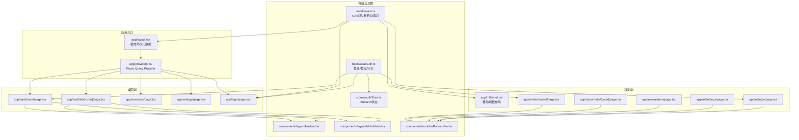
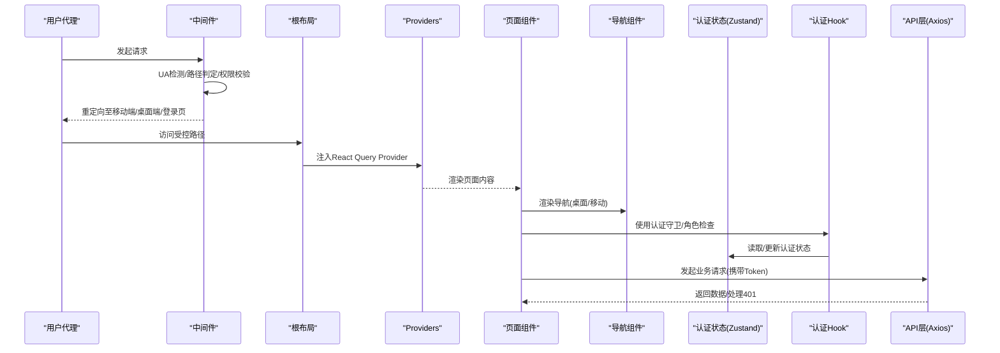
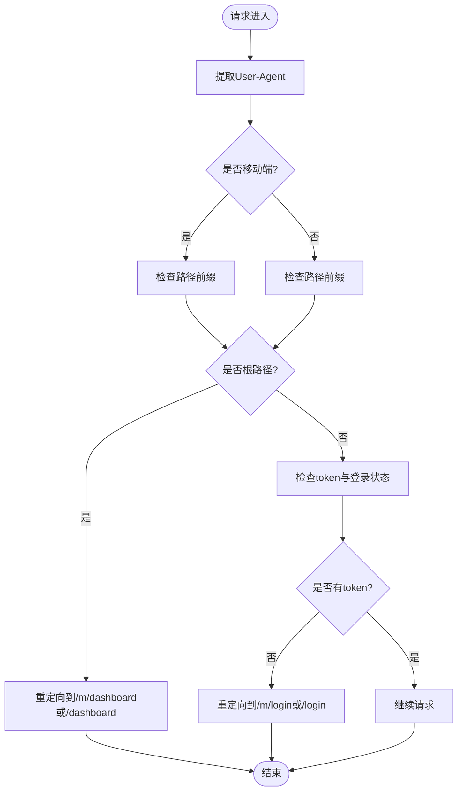
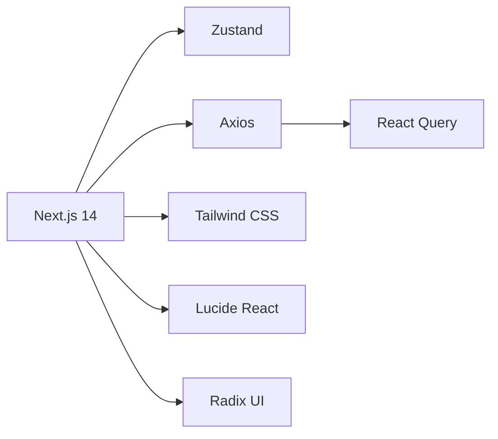

# 路由与导航

<cite>
**本文引用的文件**
- [frontend/src/app/layout.tsx](file://frontend/src/app/layout.tsx)
- [frontend/src/app/providers.tsx](file://frontend/src/app/providers.tsx)
- [frontend/src/middleware.ts](file://frontend/src/middleware.ts)
- [frontend/src/app/page.tsx](file://frontend/src/app/page.tsx)
- [frontend/src/app/login/page.tsx](file://frontend/src/app/login/page.tsx)
- [frontend/src/app/m/layout.tsx](file://frontend/src/app/m/layout.tsx)
- [frontend/src/components/layout/MainLayout.tsx](file://frontend/src/components/layout/MainLayout.tsx)
- [frontend/src/components/layout/Navbar.tsx](file://frontend/src/components/layout/Navbar.tsx)
- [frontend/src/components/layout/MobileNav.tsx](file://frontend/src/components/layout/MobileNav.tsx)
- [frontend/src/components/mobile/BottomNav.tsx](file://frontend/src/components/mobile/BottomNav.tsx)
- [frontend/src/hooks/useAuth.ts](file://frontend/src/hooks/useAuth.ts)
- [frontend/src/stores/authStore.ts](file://frontend/src/stores/authStore.ts)
- [frontend/src/lib/api.ts](file://frontend/src/lib/api.ts)
- [frontend/src/lib/utils.ts](file://frontend/src/lib/utils.ts)
- [frontend/package.json](file://frontend/package.json)
</cite>

## 目录
1. [引言](#引言)
2. [项目结构](#项目结构)
3. [核心组件](#核心组件)
4. [架构总览](#架构总览)
5. [详细组件分析](#详细组件分析)
6. [依赖关系分析](#依赖关系分析)
7. [性能考虑](#性能考虑)
8. [故障排查指南](#故障排查指南)
9. [结论](#结论)
10. [附录](#附录)

## 引言
本文件系统性梳理 InvestRing 前端的路由与导航体系，覆盖 Next.js App Router 的路由组织、嵌套路由设计、移动端与 PC 端差异化导航策略、中间件与权限控制、动态路由参数处理与路由守卫、程序化导航与链接组件使用、性能优化与预加载策略，以及导航状态管理与用户体验优化方案。目标是帮助开发者快速理解并扩展该路由与导航系统。

## 项目结构
InvestRing 前端采用 Next.js App Router 的目录约定进行路由组织，根布局负责全局元数据与 Provider 注入；移动端与 PC 端分别通过独立的根布局与导航组件实现差异化体验；中间件负责 UA 检测、路径重定向与权限校验；认证状态通过 Zustand 管理，并结合 React Query 提供缓存与错误处理。

图表来源
- [frontend/src/app/layout.tsx:1-32](file://frontend/src/app/layout.tsx#L1-L32)
- [frontend/src/app/providers.tsx:1-28](file://frontend/src/app/providers.tsx#L1-L28)
- [frontend/src/middleware.ts:1-40](file://frontend/src/middleware.ts#L1-L40)
- [frontend/src/app/login/page.tsx:1-101](file://frontend/src/app/login/page.tsx#L1-L101)
- [frontend/src/app/m/layout.tsx:1-27](file://frontend/src/app/m/layout.tsx#L1-L27)
- [frontend/src/components/layout/Navbar.tsx:1-62](file://frontend/src/components/layout/Navbar.tsx#L1-L62)
- [frontend/src/components/layout/MobileNav.tsx:1-61](file://frontend/src/components/layout/MobileNav.tsx#L1-L61)
- [frontend/src/components/mobile/BottomNav.tsx:1-79](file://frontend/src/components/mobile/BottomNav.tsx#L1-L79)
- [frontend/src/hooks/useAuth.ts:1-134](file://frontend/src/hooks/useAuth.ts#L1-L134)
- [frontend/src/stores/authStore.ts:1-71](file://frontend/src/stores/authStore.ts#L1-L71)

章节来源
- [frontend/src/app/layout.tsx:1-32](file://frontend/src/app/layout.tsx#L1-L32)
- [frontend/src/app/providers.tsx:1-28](file://frontend/src/app/providers.tsx#L1-L28)
- [frontend/src/middleware.ts:1-40](file://frontend/src/middleware.ts#L1-L40)

## 核心组件
- 根布局与元数据：定义站点标题、描述、Web App 清单与 Apple Web App 配置，注入 Providers。
- Providers：初始化 React Query 客户端，设置默认查询行为（staleTime、refetchOnWindowFocus、retry）。
- 中间件：基于 UA 自动区分移动端/桌面端，处理根路径跳转、移动端路径前缀、未登录跳转登录页、匹配器过滤静态资源与 API。
- 登录页：表单提交触发认证 API，成功后写入本地状态并跳转仪表盘。
- 桌面端布局：包含顶部导航栏与侧边栏，移动端底部导航在小屏自动隐藏。
- 移动端布局：独立的移动端根布局与底部导航，按角色显示不同菜单项。
- 认证 Hook：封装登录、登出、当前用户信息拉取、认证守卫与角色检查。
- 认证状态存储：Zustand 管理 token、用户信息、认证状态与持久化。
- API 层：Axios 实例，请求拦截器自动附加 Bearer Token，响应拦截器统一处理 401 并跳转登录。

章节来源
- [frontend/src/app/layout.tsx:1-32](file://frontend/src/app/layout.tsx#L1-L32)
- [frontend/src/app/providers.tsx:1-28](file://frontend/src/app/providers.tsx#L1-L28)
- [frontend/src/middleware.ts:1-40](file://frontend/src/middleware.ts#L1-L40)
- [frontend/src/app/login/page.tsx:1-101](file://frontend/src/app/login/page.tsx#L1-L101)
- [frontend/src/components/layout/Navbar.tsx:1-62](file://frontend/src/components/layout/Navbar.tsx#L1-L62)
- [frontend/src/components/layout/MobileNav.tsx:1-61](file://frontend/src/components/layout/MobileNav.tsx#L1-L61)
- [frontend/src/components/mobile/BottomNav.tsx:1-79](file://frontend/src/components/mobile/BottomNav.tsx#L1-L79)
- [frontend/src/hooks/useAuth.ts:1-134](file://frontend/src/hooks/useAuth.ts#L1-L134)
- [frontend/src/stores/authStore.ts:1-71](file://frontend/src/stores/authStore.ts#L1-L71)
- [frontend/src/lib/api.ts:1-627](file://frontend/src/lib/api.ts#L1-L627)

## 架构总览
下图展示了从请求进入、中间件处理、根布局渲染到页面级导航的整体流程，以及认证状态与权限控制的关键节点。

图表来源
- [frontend/src/middleware.ts:1-40](file://frontend/src/middleware.ts#L1-L40)
- [frontend/src/app/layout.tsx:1-32](file://frontend/src/app/layout.tsx#L1-L32)
- [frontend/src/app/providers.tsx:1-28](file://frontend/src/app/providers.tsx#L1-L28)
- [frontend/src/components/layout/Navbar.tsx:1-62](file://frontend/src/components/layout/Navbar.tsx#L1-L62)
- [frontend/src/components/layout/MobileNav.tsx:1-61](file://frontend/src/components/layout/MobileNav.tsx#L1-L61)
- [frontend/src/components/mobile/BottomNav.tsx:1-79](file://frontend/src/components/mobile/BottomNav.tsx#L1-L79)
- [frontend/src/hooks/useAuth.ts:1-134](file://frontend/src/hooks/useAuth.ts#L1-L134)
- [frontend/src/stores/authStore.ts:1-71](file://frontend/src/stores/authStore.ts#L1-L71)
- [frontend/src/lib/api.ts:1-627](file://frontend/src/lib/api.ts#L1-L627)

## 详细组件分析

### 路由组织与嵌套路由设计
- 根布局与全局 Provider：根布局负责站点元数据与字体注入，Providers 初始化 React Query 客户端并提供全局 Toast 容器，确保所有页面共享状态与缓存策略。
- 桌面端路由：以 app 下的页面作为路由入口，支持嵌套子路由（如 portfolio/[code] 下的 positions、trades、subscriptions 等），Next.js 自动解析动态段并传递给页面组件。
- 移动端路由：以 app/m 下的页面作为移动端入口，同样支持与桌面端一致的嵌套结构，中间件会根据 UA 将桌面端访问重定向到移动端路径，反之亦然。
- 根路径处理：根路径直接重定向到桌面端或移动端仪表盘，避免无状态页面渲染。

章节来源
- [frontend/src/app/layout.tsx:1-32](file://frontend/src/app/layout.tsx#L1-L32)
- [frontend/src/app/providers.tsx:1-28](file://frontend/src/app/providers.tsx#L1-L28)
- [frontend/src/middleware.ts:1-40](file://frontend/src/middleware.ts#L1-L40)
- [frontend/src/app/page.tsx:1-15](file://frontend/src/app/page.tsx#L1-L15)

### 移动端与 PC 端导航策略
- 桌面端导航：顶部导航栏包含品牌标识与用户下拉菜单；侧边栏提供主要功能入口；移动端底部导航在小屏隐藏，避免遮挡内容。
- 移动端导航：底部固定导航条，按用户角色（admin/viewer）显示不同菜单项；导航项根据当前路径高亮，支持图标与文字组合。
- 路径前缀：移动端路径统一以 /m 开头，中间件负责在桌面端访问时自动添加 /m 前缀，在移动端访问时移除前缀，保证路径一致性。

章节来源
- [frontend/src/components/layout/Navbar.tsx:1-62](file://frontend/src/components/layout/Navbar.tsx#L1-L62)
- [frontend/src/components/layout/MobileNav.tsx:1-61](file://frontend/src/components/layout/MobileNav.tsx#L1-L61)
- [frontend/src/components/mobile/BottomNav.tsx:1-79](file://frontend/src/components/mobile/BottomNav.tsx#L1-L79)
- [frontend/src/middleware.ts:1-40](file://frontend/src/middleware.ts#L1-L40)

### 中间件与权限控制机制
- UA 检测与路径重定向：中间件根据 User-Agent 判断是否为移动端，自动将桌面端访问重定向到 /m 路径，或将移动端访问重定向到桌面端路径。
- 根路径处理：根路径根据 UA 重定向到桌面端或移动端仪表盘。
- 权限控制：若未携带有效 token 且访问非登录页，则重定向到对应端的登录页；匹配器排除静态资源与 API 请求，避免对构建产物与服务端接口造成影响。

图表来源
- [frontend/src/middleware.ts:1-40](file://frontend/src/middleware.ts#L1-L40)

章节来源
- [frontend/src/middleware.ts:1-40](file://frontend/src/middleware.ts#L1-L40)

### 动态路由参数处理与路由守卫
- 动态路由：portfolio/[code] 等动态段由 Next.js 解析并传递给页面组件；页面可通过路由参数获取具体资源标识。
- 路由守卫：useAuthGuard 在客户端监听认证状态变化，未登录时强制跳转登录页，已登录访问登录页时可跳转仪表盘；支持 requireAuth 参数控制守卫行为。
- 当前用户信息：useCurrentUser 通过 API 拉取用户信息并缓存，启用条件查询（enabled: !!token）与合理的 staleTime，减少不必要的请求。

章节来源
- [frontend/src/hooks/useAuth.ts:1-134](file://frontend/src/hooks/useAuth.ts#L1-L134)
- [frontend/src/lib/api.ts:1-627](file://frontend/src/lib/api.ts#L1-L627)

### 程序化导航与链接组件使用
- 程序化导航：登录成功后使用 router.push 进行页面跳转；登出时清理状态并跳转登录页；根页面 Home 使用 router.push 直接跳转登录页。
- 链接组件：导航条与底部导航使用 Next/link 组件渲染，支持图标与文字，根据当前路径高亮；移动端底部导航根据角色动态渲染菜单项。
- 根布局与移动端根布局：桌面端 MainLayout 与移动端 MobileRootLayout 在未登录时均会跳转到对应登录页，确保导航始终处于受控状态。

章节来源
- [frontend/src/app/login/page.tsx:1-101](file://frontend/src/app/login/page.tsx#L1-L101)
- [frontend/src/components/layout/Navbar.tsx:1-62](file://frontend/src/components/layout/Navbar.tsx#L1-L62)
- [frontend/src/components/layout/MobileNav.tsx:1-61](file://frontend/src/components/layout/MobileNav.tsx#L1-L61)
- [frontend/src/components/mobile/BottomNav.tsx:1-79](file://frontend/src/components/mobile/BottomNav.tsx#L1-L79)
- [frontend/src/app/m/layout.tsx:1-27](file://frontend/src/app/m/layout.tsx#L1-L27)
- [frontend/src/app/page.tsx:1-15](file://frontend/src/app/page.tsx#L1-L15)

### 导航状态管理与用户体验优化
- 认证状态：Zustand 管理 token、用户信息与认证状态，并持久化部分状态，提升刷新后的可用性。
- 导航高亮：底部导航与侧边栏根据当前路径或前缀匹配进行高亮，增强用户定位感。
- 错误提示：登录页与各处操作通过 ToastContainer 提示反馈，API 层统一处理 401 并跳转登录页，减少异常状态对用户体验的影响。
- 性能缓存：React Query 默认 staleTime 与 retry 策略降低重复请求成本，提高交互流畅度。

章节来源
- [frontend/src/stores/authStore.ts:1-71](file://frontend/src/stores/authStore.ts#L1-L71)
- [frontend/src/components/mobile/BottomNav.tsx:1-79](file://frontend/src/components/mobile/BottomNav.tsx#L1-L79)
- [frontend/src/app/providers.tsx:1-28](file://frontend/src/app/providers.tsx#L1-L28)
- [frontend/src/lib/api.ts:1-627](file://frontend/src/lib/api.ts#L1-L627)

## 依赖关系分析
- Next.js 版本：项目使用 Next.js 14，支持 App Router 与中间件。
- UI 与工具：Tailwind CSS、Lucide React 图标、Radix UI 组件库，提供一致的视觉与交互基础。
- 状态与网络：Zustand 管理认证状态，Axios 与 React Query 提供网络请求与缓存能力。
- 类名合并：clsx 与 tailwind-merge 提升样式组合的可维护性。

图表来源
- [frontend/package.json:1-45](file://frontend/package.json#L1-L45)

章节来源
- [frontend/package.json:1-45](file://frontend/package.json#L1-L45)

## 性能考虑
- 路由与导航性能
  - 中间件匹配器精确排除静态资源与 API，减少不必要的中间件执行。
  - 根布局与 Providers 仅在顶层渲染一次，避免重复初始化。
  - 底部导航与侧边栏使用轻量组件，减少重排与重绘。
- 数据获取与缓存
  - React Query 默认 staleTime 与 retry 策略降低重复请求频率。
  - useCurrentUser 设置合理的 staleTime，避免频繁拉取用户信息。
  - API 层统一处理 401，避免页面级重复处理逻辑。
- 预加载与懒加载
  - 可利用 Next.js 的路由预加载特性（如 Link 组件的 prefetch）在用户悬停或视口接近时提前加载页面。
  - 对于大列表或复杂图表，建议采用虚拟滚动与懒加载策略，减少首屏压力。
- 体积与构建
  - 保持依赖精简，避免引入不必要的 UI 组件库分支。
  - Tailwind CSS 按需引入与 Tree Shaking，减少打包体积。

## 故障排查指南
- 登录后仍被重定向到登录页
  - 检查中间件是否正确识别 UA 与路径前缀；确认 token 是否写入 Cookie 与 localStorage。
  - 确认认证 Hook 是否正确设置认证状态与用户信息。
- 401 未触发登录跳转
  - 检查 API 请求拦截器是否正确附加 Authorization 头；确认响应拦截器是否在 401 时清除 token 并跳转登录页。
- 移动端与桌面端路径不一致
  - 确认中间件是否正确处理 /m 前缀；检查移动端根布局与桌面端根布局的登录跳转逻辑。
- 导航高亮异常
  - 检查底部导航与侧边栏的路径匹配逻辑，确保使用当前路径或前缀匹配策略。

章节来源
- [frontend/src/middleware.ts:1-40](file://frontend/src/middleware.ts#L1-L40)
- [frontend/src/stores/authStore.ts:1-71](file://frontend/src/stores/authStore.ts#L1-L71)
- [frontend/src/lib/api.ts:1-627](file://frontend/src/lib/api.ts#L1-L627)
- [frontend/src/components/mobile/BottomNav.tsx:1-79](file://frontend/src/components/mobile/BottomNav.tsx#L1-L79)

## 结论
InvestRing 的前端路由与导航体系以 Next.js App Router 为核心，结合中间件实现跨端路径统一与权限控制，通过 Zustand 与 React Query 提供稳定的认证状态与数据缓存，配合桌面端与移动端差异化的导航组件，形成一致且高效的用户体验。后续可在现有基础上进一步完善路由预加载、权限细化与导航性能优化。

## 附录
- 关键实现参考路径
  - 根布局与 Provider：[frontend/src/app/layout.tsx:1-32](file://frontend/src/app/layout.tsx#L1-L32)，[frontend/src/app/providers.tsx:1-28](file://frontend/src/app/providers.tsx#L1-L28)
  - 中间件与权限控制：[frontend/src/middleware.ts:1-40](file://frontend/src/middleware.ts#L1-L40)
  - 登录与认证 Hook：[frontend/src/app/login/page.tsx:1-101](file://frontend/src/app/login/page.tsx#L1-L101)，[frontend/src/hooks/useAuth.ts:1-134](file://frontend/src/hooks/useAuth.ts#L1-L134)
  - 认证状态存储：[frontend/src/stores/authStore.ts:1-71](file://frontend/src/stores/authStore.ts#L1-L71)
  - API 层与错误处理：[frontend/src/lib/api.ts:1-627](file://frontend/src/lib/api.ts#L1-L627)
  - 导航组件：[frontend/src/components/layout/Navbar.tsx:1-62](file://frontend/src/components/layout/Navbar.tsx#L1-L62)，[frontend/src/components/layout/MobileNav.tsx:1-61](file://frontend/src/components/layout/MobileNav.tsx#L1-L61)，[frontend/src/components/mobile/BottomNav.tsx:1-79](file://frontend/src/components/mobile/BottomNav.tsx#L1-L79)
  - 工具函数与样式：[frontend/src/lib/utils.ts:1-270](file://frontend/src/lib/utils.ts#L1-L270)