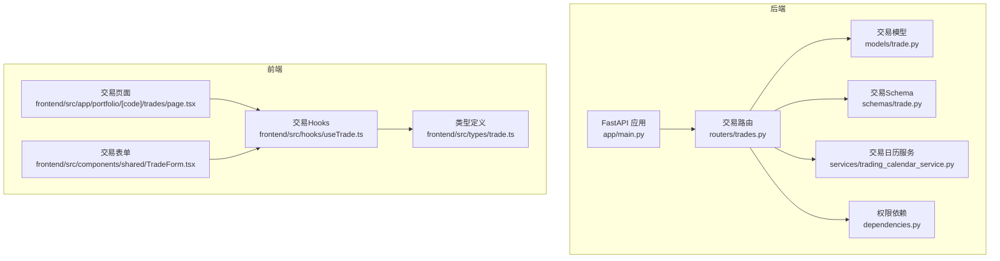
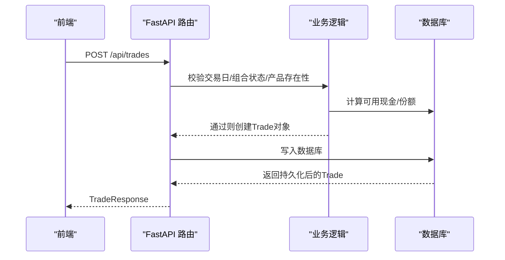
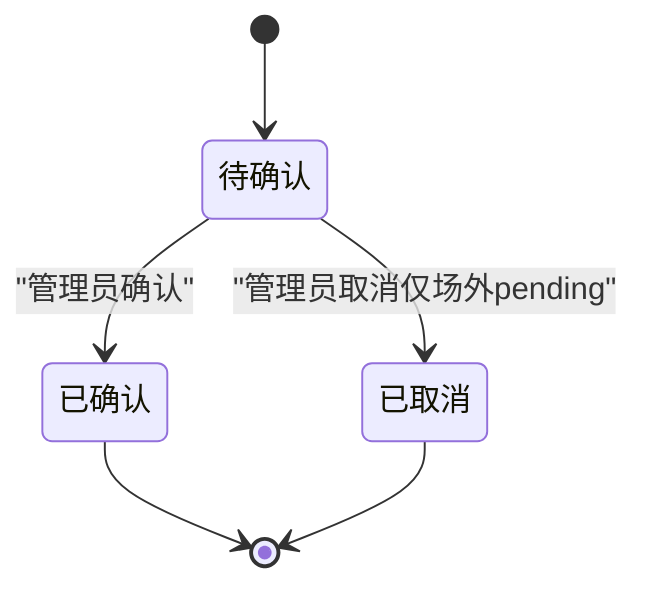
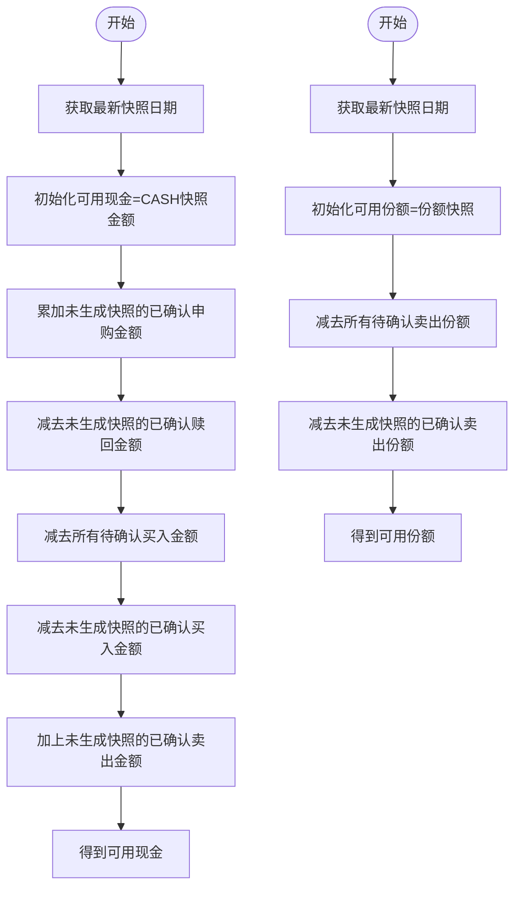
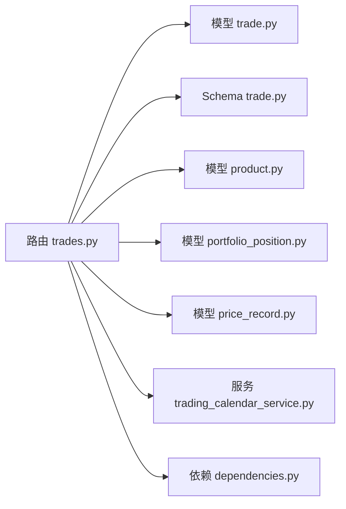

# 交易管理API

<cite>
**本文引用的文件**
- [backend/app/main.py](file://backend/app/main.py)
- [backend/app/routers/trades.py](file://backend/app/routers/trades.py)
- [backend/app/schemas/trade.py](file://backend/app/schemas/trade.py)
- [backend/app/models/trade.py](file://backend/app/models/trade.py)
- [backend/app/models/portfolio.py](file://backend/app/models/portfolio.py)
- [backend/app/models/product.py](file://backend/app/models/product.py)
- [backend/app/models/portfolio_position.py](file://backend/app/models/portfolio_position.py)
- [backend/app/models/subscription.py](file://backend/app/models/subscription.py)
- [backend/app/models/price_record.py](file://backend/app/models/price_record.py)
- [backend/app/services/trading_calendar_service.py](file://backend/app/services/trading_calendar_service.py)
- [backend/app/dependencies.py](file://backend/app/dependencies.py)
- [frontend/src/app/portfolio/[code]/trades/page.tsx](file://frontend/src/app/portfolio/[code]/trades/page.tsx)
- [frontend/src/components/shared/TradeForm.tsx](file://frontend/src/components/shared/TradeForm.tsx)
- [frontend/src/hooks/useTrade.ts](file://frontend/src/hooks/useTrade.ts)
- [frontend/src/types/trade.ts](file://frontend/src/types/trade.ts)
</cite>

## 目录
1. [简介](#简介)
2. [项目结构](#项目结构)
3. [核心组件](#核心组件)
4. [架构概览](#架构概览)
5. [详细组件分析](#详细组件分析)
6. [依赖分析](#依赖分析)
7. [性能考虑](#性能考虑)
8. [故障排除指南](#故障排除指南)
9. [结论](#结论)
10. [附录](#附录)

## 简介
本文件为 InvestRing 交易管理模块的完整API文档，覆盖交易CRUD操作、交易执行与确认、状态管理、费用计算、查询接口及权限控制。文档面向前后端开发者与运维人员，提供HTTP方法、URL模式、请求/响应格式、权限要求、示例与约束说明，帮助快速集成与排错。

## 项目结构
交易管理API位于后端FastAPI应用中，通过统一入口注册到根路径下。前端通过React组件与Hooks调用后端接口，实现交易的创建、查询、确认与取消。

**图表来源**
- [backend/app/main.py:32-48](file://backend/app/main.py#L32-L48)
- [backend/app/routers/trades.py:108](file://backend/app/routers/trades.py#L108)
- [backend/app/services/trading_calendar_service.py:15](file://backend/app/services/trading_calendar_service.py#L15)

**章节来源**
- [backend/app/main.py:32-48](file://backend/app/main.py#L32-L48)

## 核心组件
- 路由器：交易路由集中于 [routers/trades.py](file://backend/app/routers/trades.py)，提供交易CRUD、确认、取消与查询。
- 模型：交易实体定义于 [models/trade.py](file://backend/app/models/trade.py)，包含字段、索引与外键约束。
- Schema：请求/响应数据结构定义于 [schemas/trade.py](file://backend/app/schemas/trade.py)，用于Pydantic校验与序列化。
- 权限：用户与管理员权限校验位于 [dependencies.py](file://backend/app/dependencies.py)。
- 交易日历：交易日判断与同步逻辑位于 [services/trading_calendar_service.py](file://backend/app/services/trading_calendar_service.py)。
- 前端：交易页面、表单与Hooks位于 [frontend](file://frontend/src/) 目录，负责调用后端API并展示结果。

**章节来源**
- [backend/app/routers/trades.py:108](file://backend/app/routers/trades.py#L108)
- [backend/app/models/trade.py:5-32](file://backend/app/models/trade.py#L5-L32)
- [backend/app/schemas/trade.py:6-45](file://backend/app/schemas/trade.py#L6-L45)
- [backend/app/dependencies.py:49-146](file://backend/app/dependencies.py#L49-L146)
- [backend/app/services/trading_calendar_service.py:15-125](file://backend/app/services/trading_calendar_service.py#L15-L125)

## 架构概览
交易管理API采用分层设计：路由层处理HTTP请求与权限校验，服务层封装业务逻辑（可用资金/份额计算、净值确认、交易日校验），数据层通过SQLAlchemy模型与数据库交互。

**图表来源**
- [backend/app/routers/trades.py:292-402](file://backend/app/routers/trades.py#L292-L402)
- [backend/app/models/trade.py:5-32](file://backend/app/models/trade.py#L5-L32)

## 详细组件分析

### 交易路由与接口定义
- 基础路径：/api/trades
- 路由注册：见 [backend/app/main.py](file://backend/app/main.py#L42)

接口一览（按功能分组）：

- 交易列表查询
  - 方法与路径：GET /api/trades
  - 查询参数：
    - portfolio_code: 组合代码（可选）
    - page: 页码，默认1
    - page_size: 每页条数，默认20
  - 权限：普通用户（需登录）
  - 响应：分页对象，包含items、total、page、page_size
  - 实现参考：[backend/app/routers/trades.py:271-289](file://backend/app/routers/trades.py#L271-L289)

- 单个交易查询
  - 方法与路径：GET /api/trades/{id}
  - 权限：普通用户（需登录）
  - 响应：TradeResponse
  - 实现参考：[backend/app/routers/trades.py:405-414](file://backend/app/routers/trades.py#L405-L414)

- 创建交易（买入/卖出）
  - 方法与路径：POST /api/trades
  - 请求体：TradeCreate
  - 权限：管理员（admin）
  - 业务要点：
    - 交易日校验：仅允许交易日
    - 组合状态：仅允许active状态组合
    - 产品存在性：按product_code与market匹配
    - 买入校验：amount > 0，且不超过可用现金
    - 卖出校验：shares > 0，且不超过可用份额
    - 自动计算：根据price、fee与实际金额推导amount/shares
  - 响应：TradeResponse（初始状态为pending）
  - 实现参考：[backend/app/routers/trades.py:292-402](file://backend/app/routers/trades.py#L292-L402)

- 更新交易
  - 方法与路径：PUT /api/trades/{id}
  - 请求体：TradeUpdate（支持部分字段更新）
  - 权限：管理员（admin）
  - 响应：TradeResponse
  - 实现参考：[backend/app/routers/trades.py:535-551](file://backend/app/routers/trades.py#L535-L551)

- 删除交易
  - 方法与路径：DELETE /api/trades/{id}
  - 权限：管理员（admin）
  - 响应：成功消息
  - 实现参考：[backend/app/routers/trades.py:554-566](file://backend/app/routers/trades.py#L554-L566)

- 确认交易
  - 方法与路径：POST /api/trades/{id}/confirm
  - 查询参数：
    - confirm_date: 确认日期（可选，默认根据产品确认周期推算）
    - price: 确认价格（可选，净值型产品通常不填，系统自动取净值）
  - 权限：管理员（admin）
  - 业务要点：
    - 仅pending状态可确认
    - 净值型产品（OEF/LOF CN_OTC）必须有T日净值（QDII禁止向前查找）
    - 非净值型产品若传入price，则按price重算amount/shares
    - 确认后更新confirm_date与最终amount/price/shares
  - 响应：包含message、id、portfolio_code、trade_type、status、confirm_date与trade对象
  - 实现参考：[backend/app/routers/trades.py:417-504](file://backend/app/routers/trades.py#L417-L504)

- 取消交易
  - 方法与路径：POST /api/trades/{id}/cancel
  - 权限：管理员（admin）
  - 业务要点：
    - 仅pending状态可取消
    - 仅场外（CN_OTC）的pending可取消，场内（CN_EXCHANGE）不可取消
  - 响应：成功消息
  - 实现参考：[backend/app/routers/trades.py:507-532](file://backend/app/routers/trades.py#L507-L532)

请求/响应模式与字段说明（基于Schema与模型）：
- TradeBase/TradeCreate/TradeUpdate/TradeResponse 字段定义参见 [backend/app/schemas/trade.py:6-45](file://backend/app/schemas/trade.py#L6-L45)
- Trade模型字段与约束参见 [backend/app/models/trade.py:5-32](file://backend/app/models/trade.py#L5-32)

权限与鉴权：
- 普通用户：通过Bearer Token鉴权，见 [backend/app/dependencies.py:49-111](file://backend/app/dependencies.py#L49-L111)
- 管理员：除登录外，还需角色为admin，见 [backend/app/dependencies.py:114-129](file://backend/app/dependencies.py#L114-L129)

交易日历与确认周期：
- 交易日判断：见 [backend/app/services/trading_calendar_service.py:110-124](file://backend/app/services/trading_calendar_service.py#L110-L124)
- 产品确认周期：Product.confirm_days决定T+N确认周期，见 [backend/app/models/product.py](file://backend/app/models/product.py#L13)

前端集成要点：
- 交易页面与表单：见 [frontend/src/app/portfolio/[code]/trades/page.tsx](file://frontend/src/app/portfolio/[code]/trades/page.tsx#L33-L44) 与 [frontend/src/components/shared/TradeForm.tsx:25-46](file://frontend/src/components/shared/TradeForm.tsx#L25-L46)
- Hooks与类型：见 [frontend/src/hooks/useTrade.ts:22-103](file://frontend/src/hooks/useTrade.ts#L22-L103) 与 [frontend/src/types/trade.ts:1-45](file://frontend/src/types/trade.ts#L1-L45)

**章节来源**
- [backend/app/routers/trades.py:271-566](file://backend/app/routers/trades.py#L271-L566)
- [backend/app/schemas/trade.py:6-45](file://backend/app/schemas/trade.py#L6-L45)
- [backend/app/models/trade.py:5-32](file://backend/app/models/trade.py#L5-L32)
- [backend/app/dependencies.py:49-129](file://backend/app/dependencies.py#L49-L129)
- [backend/app/services/trading_calendar_service.py:110-124](file://backend/app/services/trading_calendar_service.py#L110-L124)
- [backend/app/models/product.py:13](file://backend/app/models/product.py#L13)
- [frontend/src/app/portfolio/[code]/trades/page.tsx:33-44](file://frontend/src/app/portfolio/[code]/trades/page.tsx#L33-L44)
- [frontend/src/components/shared/TradeForm.tsx:25-46](file://frontend/src/components/shared/TradeForm.tsx#L25-L46)
- [frontend/src/hooks/useTrade.ts:22-103](file://frontend/src/hooks/useTrade.ts#L22-L103)
- [frontend/src/types/trade.ts:1-45](file://frontend/src/types/trade.ts#L1-L45)

### 交易状态管理与流程
交易状态包括：pending（待确认）、confirmed（已确认）、cancelled（已取消）。确认流程根据产品类型与市场区分净值型与非净值型，并结合交易日历与确认周期自动推导确认日期。

**图表来源**
- [backend/app/routers/trades.py:417-532](file://backend/app/routers/trades.py#L417-L532)

**章节来源**
- [backend/app/routers/trades.py:417-532](file://backend/app/routers/trades.py#L417-L532)

### 交易费用与金额计算
- 买入：amount = actual_amount - fee；shares = amount / price
- 卖出：amount = actual_amount + fee；shares为输入
- 确认时若传入price，按price重算；净值型产品按T日净值自动计算

**章节来源**
- [backend/app/routers/trades.py:337-395](file://backend/app/routers/trades.py#L337-L395)
- [backend/app/routers/trades.py:479-489](file://backend/app/routers/trades.py#L479-L489)

### 可用资金与可用份额计算
- 可用现金（Cash）：基于最新快照现金，叠加/扣减未生成快照的确认申赎、待确认买入、已确认买入与已确认卖出
- 可用份额：基于最新快照份额，扣减待确认/已确认卖出

**图表来源**
- [backend/app/routers/trades.py:128-217](file://backend/app/routers/trades.py#L128-L217)
- [backend/app/routers/trades.py:220-268](file://backend/app/routers/trades.py#L220-L268)

**章节来源**
- [backend/app/routers/trades.py:128-268](file://backend/app/routers/trades.py#L128-L268)

### 净值确认与QDII规则
- 净值型产品（OEF/LOF CN_OTC）：
  - QDII：必须取T日净值，禁止向前查找；缺失时报错
  - 非QDII：取T日或最近交易日净值；缺失时返回None
- 确认时若前端传入price，则优先使用该价格；否则使用系统获取的净值

**章节来源**
- [backend/app/routers/trades.py:53-105](file://backend/app/routers/trades.py#L53-L105)
- [backend/app/models/product.py:11-14](file://backend/app/models/product.py#L11-L14)

## 依赖分析
- 路由依赖：交易路由依赖数据库会话、当前用户与管理员权限
- 业务依赖：交易逻辑依赖交易日历服务、产品模型、价格记录、组合与持仓快照
- 前端依赖：交易页面通过Hooks调用API，类型与响应结构与后端保持一致

**图表来源**
- [backend/app/routers/trades.py:1-16](file://backend/app/routers/trades.py#L1-L16)
- [backend/app/models/trade.py:5-32](file://backend/app/models/trade.py#L5-L32)
- [backend/app/models/product.py:5-22](file://backend/app/models/product.py#L5-L22)
- [backend/app/models/portfolio_position.py:5-34](file://backend/app/models/portfolio_position.py#L5-L34)
- [backend/app/models/price_record.py:5-28](file://backend/app/models/price_record.py#L5-L28)
- [backend/app/services/trading_calendar_service.py:15-125](file://backend/app/services/trading_calendar_service.py#L15-L125)
- [backend/app/dependencies.py:49-129](file://backend/app/dependencies.py#L49-L129)

**章节来源**
- [backend/app/routers/trades.py:1-16](file://backend/app/routers/trades.py#L1-L16)
- [backend/app/models/trade.py:5-32](file://backend/app/models/trade.py#L5-L32)
- [backend/app/models/product.py:5-22](file://backend/app/models/product.py#L5-L22)
- [backend/app/models/portfolio_position.py:5-34](file://backend/app/models/portfolio_position.py#L5-L34)
- [backend/app/models/price_record.py:5-28](file://backend/app/models/price_record.py#L5-L28)
- [backend/app/services/trading_calendar_service.py:15-125](file://backend/app/services/trading_calendar_service.py#L15-L125)
- [backend/app/dependencies.py:49-129](file://backend/app/dependencies.py#L49-L129)

## 性能考虑
- 分页查询：列表接口默认每页20条，避免一次性加载过多数据
- 交易日历批量写入：同步交易日历时采用批量插入，减少数据库往返
- 余额与份额计算：基于最新快照与增量计算，避免全量扫描
- 建议：
  - 前端对高频查询设置合理缓存时间
  - 后端对热点查询增加索引（如按portfolio_code、status、trade_date）

## 故障排除指南
常见错误与处理：
- 非交易日提交：返回“非交易日，请等待交易日再提交”
- 组合未激活：返回“组合未激活”
- 产品不存在：返回“Product not found”
- 买入金额无效或超可用现金：返回“买入金额必须大于0”或“买入金额超过可用现金”
- 卖出份额无效或超可用份额：返回“卖出份额必须大于0”或“卖出份额超过可用份额”
- 状态不符：仅pending可确认/取消，否则返回“仅 pending 状态可确认/取消”
- 场内交易不可取消：返回“场内交易不可取消”
- 净值型产品缺少净值：QDII返回“T日净值尚未同步”，非QDII返回“净值尚未同步”

定位参考：
- 错误抛出位置与消息定义见 [backend/app/routers/trades.py:298-336](file://backend/app/routers/trades.py#L298-L336)、[L364-L374]、[L428-L432]、[L516-L528]、[L458-L464]
- 交易日判断见 [backend/app/services/trading_calendar_service.py:110-124](file://backend/app/services/trading_calendar_service.py#L110-L124)

**章节来源**
- [backend/app/routers/trades.py:298-336](file://backend/app/routers/trades.py#L298-L336)
- [backend/app/routers/trades.py:364-374](file://backend/app/routers/trades.py#L364-L374)
- [backend/app/routers/trades.py:428-432](file://backend/app/routers/trades.py#L428-L432)
- [backend/app/routers/trades.py:516-528](file://backend/app/routers/trades.py#L516-L528)
- [backend/app/routers/trades.py:458-464](file://backend/app/routers/trades.py#L458-L464)
- [backend/app/services/trading_calendar_service.py:110-124](file://backend/app/services/trading_calendar_service.py#L110-L124)

## 结论
交易管理API提供了完整的调仓交易生命周期管理：从创建（买入/卖出）、到确认（净值型与非净值型差异化处理）、再到取消与删除。通过严格的权限控制、交易日校验、可用资金/份额计算与状态机管理，确保交易安全与一致性。前端通过标准化的Hooks与类型定义，简化了集成与调试。

## 附录

### 接口清单与示例

- 交易列表
  - 方法：GET
  - 路径：/api/trades
  - 查询参数：portfolio_code、page、page_size
  - 示例响应：items、total、page、page_size
  - 参考：[backend/app/routers/trades.py:271-289](file://backend/app/routers/trades.py#L271-L289)

- 单个交易
  - 方法：GET
  - 路径：/api/trades/{id}
  - 权限：登录用户
  - 示例响应：TradeResponse
  - 参考：[backend/app/routers/trades.py:405-414](file://backend/app/routers/trades.py#L405-L414)

- 创建交易
  - 方法：POST
  - 路径：/api/trades
  - 权限：管理员
  - 请求体：TradeCreate（买入需amount，卖出需shares）
  - 示例响应：TradeResponse（status=pending）
  - 参考：[backend/app/routers/trades.py:292-402](file://backend/app/routers/trades.py#L292-L402)

- 更新交易
  - 方法：PUT
  - 路径：/api/trades/{id}
  - 权限：管理员
  - 请求体：TradeUpdate（部分字段）
  - 示例响应：TradeResponse
  - 参考：[backend/app/routers/trades.py:535-551](file://backend/app/routers/trades.py#L535-L551)

- 删除交易
  - 方法：DELETE
  - 路径：/api/trades/{id}
  - 权限：管理员
  - 示例响应：成功消息
  - 参考：[backend/app/routers/trades.py:554-566](file://backend/app/routers/trades.py#L554-L566)

- 确认交易
  - 方法：POST
  - 路径：/api/trades/{id}/confirm
  - 查询参数：confirm_date（可选）、price（可选）
  - 权限：管理员
  - 示例响应：包含message、id、portfolio_code、trade_type、status、confirm_date与trade对象
  - 参考：[backend/app/routers/trades.py:417-504](file://backend/app/routers/trades.py#L417-L504)

- 取消交易
  - 方法：POST
  - 路径：/api/trades/{id}/cancel
  - 权限：管理员
  - 示例响应：成功消息
  - 参考：[backend/app/routers/trades.py:507-532](file://backend/app/routers/trades.py#L507-L532)

### 数据模型与字段说明
- Trade模型字段：id、portfolio_code、platform_code、product_code、market、trade_type、shares、amount、price、fee、actual_amount、trade_date、confirm_date、status、notes、created_at、updated_at
  - 参考：[backend/app/models/trade.py:5-32](file://backend/app/models/trade.py#L5-32)
- Trade Schema：TradeBase/TradeCreate/TradeUpdate/TradeResponse
  - 参考：[backend/app/schemas/trade.py:6-45](file://backend/app/schemas/trade.py#L6-L45)
- Product模型：product_type、confirm_days、is_qdii
  - 参考：[backend/app/models/product.py:11-14](file://backend/app/models/product.py#L11-L14)
- Portfolio模型：status
  - 参考：[backend/app/models/portfolio.py](file://backend/app/models/portfolio.py#L11)
- PortfolioPosition模型：shares、snapshot_date
  - 参考：[backend/app/models/portfolio_position.py:13-20](file://backend/app/models/portfolio_position.py#L13-L20)
- Subscription模型：sub_type、amount、shares、unit_price、apply_date、confirm_date、status
  - 参考：[backend/app/models/subscription.py:11-17](file://backend/app/models/subscription.py#L11-L17)
- PriceRecord模型：unit_price、pre_close、pct_change、net_asset
  - 参考：[backend/app/models/price_record.py:12-16](file://backend/app/models/price_record.py#L12-L16)