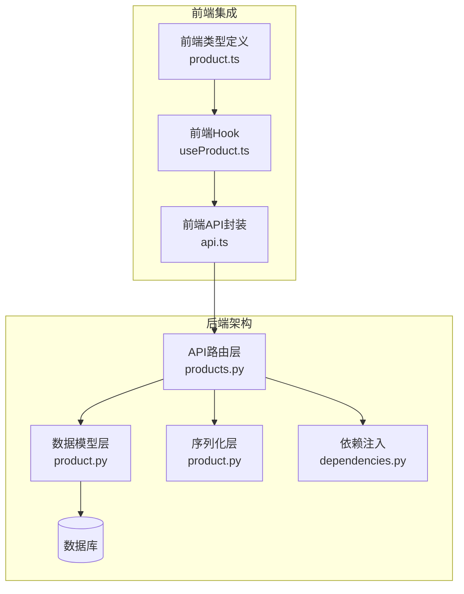
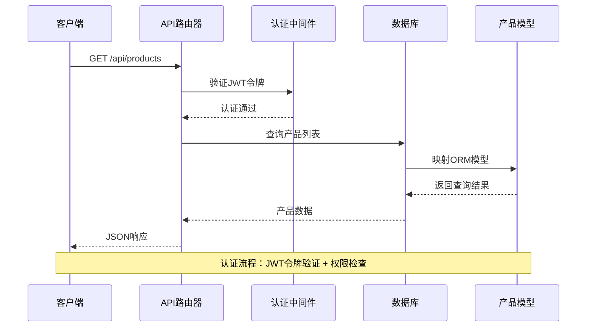
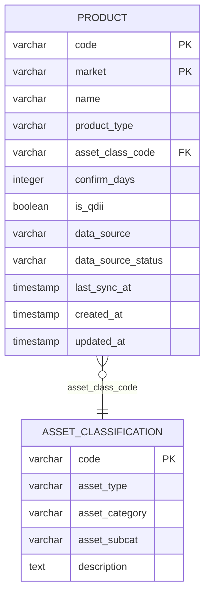
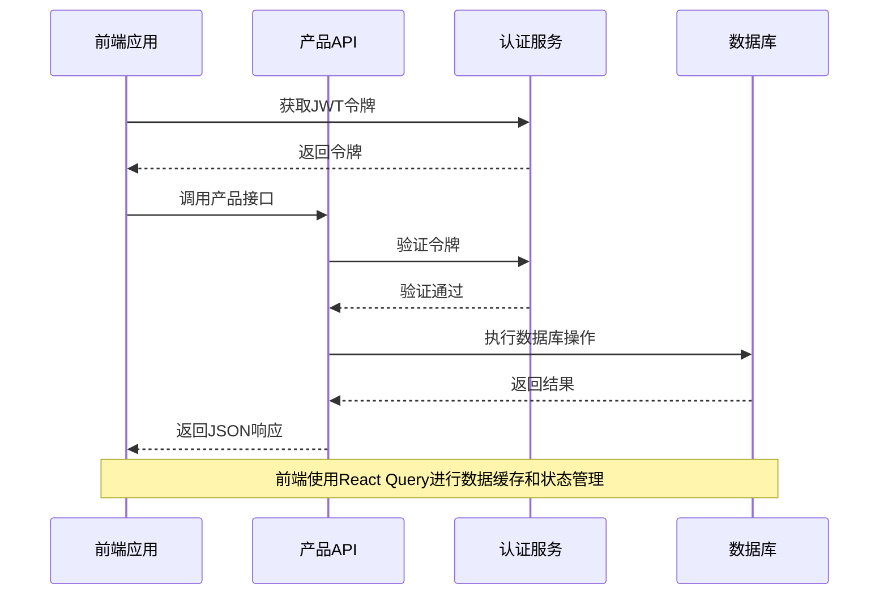

# 产品管理API

<cite>
**本文档引用的文件**
- [backend/app/routers/products.py](file://backend/app/routers/products.py)
- [backend/app/schemas/product.py](file://backend/app/schemas/product.py)
- [backend/app/models/product.py](file://backend/app/models/product.py)
- [backend/app/models/asset_classification.py](file://backend/app/models/asset_classification.py)
- [backend/app/dependencies.py](file://backend/app/dependencies.py)
- [backend/app/main.py](file://backend/app/main.py)
- [Docs/04-后端开发.md](file://Docs/04-后端开发.md)
- [Docs/02-数据库设计.md](file://Docs/02-数据库设计.md)
- [frontend/src/lib/api.ts](file://frontend/src/lib/api.ts)
- [frontend/src/hooks/useProduct.ts](file://frontend/src/hooks/useProduct.ts)
- [frontend/src/types/product.ts](file://frontend/src/types/product.ts)
</cite>

## 目录
1. [简介](#简介)
2. [项目结构](#项目结构)
3. [核心组件](#核心组件)
4. [架构概览](#架构概览)
5. [详细组件分析](#详细组件分析)
6. [依赖分析](#依赖分析)
7. [性能考虑](#性能考虑)
8. [故障排除指南](#故障排除指南)
9. [结论](#结论)
10. [附录](#附录)

## 简介
本文件为 InvestRing 产品管理模块的完整API文档，涵盖金融产品CRUD操作、产品分类、产品配置等相关接口。文档详细说明了HTTP方法、URL模式、请求/响应模式和权限要求，包含产品创建、更新、删除、查询等基本操作接口，产品分类管理、产品属性配置、产品状态控制等功能接口，以及产品列表查询、分页排序、条件筛选等高级查询接口说明。同时提供具体的请求示例和响应示例，涵盖不同类型产品的操作差异，并解释产品数据验证规则和产品约束条件。

## 项目结构
产品管理模块位于后端FastAPI应用中，采用标准的MVC架构模式：
- 路由层：定义RESTful API接口和权限控制
- 模型层：定义数据库表结构和关系
- 序列化层：定义Pydantic模型进行数据验证
- 依赖注入：提供认证和授权服务



**图表来源**
- [backend/app/routers/products.py:1-142](file://backend/app/routers/products.py#L1-L142)
- [backend/app/models/product.py:1-22](file://backend/app/models/product.py#L1-L22)
- [backend/app/schemas/product.py:1-36](file://backend/app/schemas/product.py#L1-L36)
- [frontend/src/lib/api.ts:271-308](file://frontend/src/lib/api.ts#L271-L308)

**章节来源**
- [backend/app/main.py:32-48](file://backend/app/main.py#L32-L48)
- [backend/app/routers/products.py:1-142](file://backend/app/routers/products.py#L1-L142)

## 核心组件
产品管理模块包含以下核心组件：

### 数据模型
产品表采用复合主键设计，支持不同市场的同代码产品记录：
- 主键：code + market（部分产品market可为空）
- 关键字段：name、product_type、asset_class_code、confirm_days、is_qdii
- 外键关系：关联资产分类表

### Pydantic模型
- ProductBase：基础产品信息模型
- ProductCreate：产品创建模型
- ProductUpdate：产品更新模型
- ProductResponse：产品响应模型

### 路由控制器
提供完整的CRUD操作和业务逻辑：
- 产品列表查询（支持分页和过滤）
- 产品创建（自动计算确认天数）
- 产品详情查询
- 产品更新（支持动态字段更新）
- 产品删除

**章节来源**
- [backend/app/models/product.py:5-22](file://backend/app/models/product.py#L5-L22)
- [backend/app/schemas/product.py:6-36](file://backend/app/schemas/product.py#L6-L36)
- [backend/app/routers/products.py:27-142](file://backend/app/routers/products.py#L27-L142)

## 架构概览
产品管理API采用分层架构设计，确保职责分离和可维护性：



**图表来源**
- [backend/app/routers/products.py:27-45](file://backend/app/routers/products.py#L27-L45)
- [backend/app/dependencies.py:49-111](file://backend/app/dependencies.py#L49-L111)

## 详细组件分析

### 产品CRUD操作

#### 产品列表查询
**接口定义**
- 方法：GET
- URL：/api/products
- 权限：普通用户（需要认证）

**查询参数**
- product_type：产品类型过滤
- page：页码（默认1）
- page_size：每页数量（默认20）

**响应结构**
```json
{
  "items": [...],
  "total": 100,
  "page": 1,
  "page_size": 20
}
```

**章节来源**
- [backend/app/routers/products.py:27-45](file://backend/app/routers/products.py#L27-L45)
- [Docs/04-后端开发.md:717-722](file://Docs/04-后端开发.md#L717-L722)

#### 产品创建
**接口定义**
- 方法：POST
- URL：/api/products
- 权限：管理员用户

**请求体**
```json
{
  "code": "161725",
  "market": "CN_EXCHANGE",
  "name": "华夏成长混合",
  "product_type": "ETF",
  "asset_class_code": "STOCK_CN_LARGE",
  "is_qdii": false
}
```

**自动计算逻辑**
确认天数根据市场类型和QDII状态自动计算：
- CN_EXCHANGE：0天（当日确认）
- CN_OTC且非QDII：1天（T+1）
- CN_OTC且QDII：2天（T+2）
- 其他：1天

**章节来源**
- [backend/app/routers/products.py:48-76](file://backend/app/routers/products.py#L48-L76)
- [backend/app/routers/products.py:12-24](file://backend/app/routers/products.py#L12-L24)
- [Docs/04-后端开发.md:705-715](file://Docs/04-后端开发.md#L705-L715)

#### 产品详情查询
**接口定义**
- 方法：GET
- URL：/api/products/{code}/{market}
- 权限：普通用户

**响应体**
```json
{
  "code": "161725",
  "market": "CN_EXCHANGE",
  "name": "华夏成长混合",
  "product_type": "ETF",
  "asset_class_code": "STOCK_CN_LARGE",
  "confirm_days": 0,
  "is_qdii": false,
  "data_source": "tushare",
  "data_source_status": "pending",
  "last_sync_at": "2024-01-01T00:00:00Z",
  "created_at": "2024-01-01T00:00:00Z",
  "updated_at": "2024-01-01T00:00:00Z"
}
```

**章节来源**
- [backend/app/routers/products.py:79-92](file://backend/app/routers/products.py#L79-L92)
- [backend/app/schemas/product.py:27-36](file://backend/app/schemas/product.py#L27-L36)

#### 产品更新
**接口定义**
- 方法：PUT
- URL：/api/products/{code}/{market}
- 权限：管理员用户

**请求体**
```json
{
  "name": "更新后的名称",
  "asset_class_code": "STOCK_CN_SMALL",
  "is_qdii": true
}
```

**自动更新逻辑**
当market或is_qdii字段发生变化时，确认天数会自动重新计算。

**章节来源**
- [backend/app/routers/products.py:95-122](file://backend/app/routers/products.py#L95-L122)
- [Docs/04-后端开发.md:745-751](file://Docs/04-后端开发.md#L745-L751)

#### 产品删除
**接口定义**
- 方法：DELETE
- URL：/api/products/{code}/{market}
- 权限：管理员用户

**响应体**
```json
{
  "message": "Product deleted successfully"
}
```

**章节来源**
- [backend/app/routers/products.py:125-141](file://backend/app/routers/products.py#L125-L141)

### 产品分类管理

#### 资产分类模型
资产分类表提供标准化的资产分类体系：
- code：分类代码（主键）
- asset_type：资产大类
- asset_category：一级分类
- asset_subcat：二级分类
- description：描述信息

**支持的标准分类**
- 股票类：国内股票、港股、美股、欧洲、日本、全球股票
- 债券类：国内债券、国际债券、黄金、现金

**章节来源**
- [backend/app/models/asset_classification.py:5-13](file://backend/app/models/asset_classification.py#L5-L13)
- [Docs/02-数据库设计.md:212-246](file://Docs/02-数据库设计.md#L212-L246)

### 产品配置接口

#### 市场-数据源映射
不同市场对应不同的数据源和同步策略：
- CN_EXCHANGE：tushare.fund_daily → 收盘价
- CN_OTC：tushare.fund_nav → 净值
- HK_MUTUAL：akshare → 净值
- NULL：无数据源（现金类产品）

**章节来源**
- [Docs/02-数据库设计.md:199-207](file://Docs/02-数据库设计.md#L199-L207)

#### 产品类型定义
- ETF：场内交易基金，使用收盘价
- OEF：开放式基金，使用净值
- LOF：上市开放式基金，需区分场内和场外
- CASH：现金类资产，无市场

**章节来源**
- [Docs/02-数据库设计.md:171-179](file://Docs/02-数据库设计.md#L171-L179)

### 高级查询功能

#### 产品搜索和过滤
支持多种查询条件：
- 按产品类型过滤：product_type
- 按市场过滤：market  
- 按资产分类过滤：asset_class_code
- 分页查询：page、page_size

**章节来源**
- [backend/app/routers/products.py:27-45](file://backend/app/routers/products.py#L27-L45)
- [Docs/04-后端开发.md:717-722](file://Docs/04-后端开发.md#L717-L722)

### 权限控制机制

#### 认证流程
所有接口都需要有效的JWT令牌：
1. 解析token获取user_code、timestamp、signature
2. 检查token是否在黑名单
3. 验证signature是否正确
4. 查询用户信息，附加到请求上下文

#### 授权策略
- 普通用户：只能访问查询类接口
- 管理员用户：可以执行所有管理操作
- viewer角色：只能查看，不能修改

**章节来源**
- [backend/app/dependencies.py:49-129](file://backend/app/dependencies.py#L49-L129)
- [Docs/04-后端开发.md:50-69](file://Docs/04-后端开发.md#L50-L69)

## 依赖分析

### 数据库关系图


**图表来源**
- [backend/app/models/product.py:5-22](file://backend/app/models/product.py#L5-L22)
- [backend/app/models/asset_classification.py:5-13](file://backend/app/models/asset_classification.py#L5-L13)

### 前后端交互流程


**图表来源**
- [frontend/src/lib/api.ts:271-308](file://frontend/src/lib/api.ts#L271-L308)
- [frontend/src/hooks/useProduct.ts:1-108](file://frontend/src/hooks/useProduct.ts#L1-L108)

**章节来源**
- [backend/app/routers/products.py:1-142](file://backend/app/routers/products.py#L1-L142)
- [frontend/src/lib/api.ts:271-308](file://frontend/src/lib/api.ts#L271-L308)

## 性能考虑

### 数据库优化
- 复合主键设计：product表使用(code, market)作为复合主键
- 外键约束：确保数据完整性
- 索引策略：为常用查询字段建立索引

### 缓存策略
前端使用React Query进行智能缓存：
- 查询缓存：30秒缓存策略
- 自动失效：操作成功后自动刷新相关查询
- 错误处理：统一的错误状态管理

### 并发处理
- SQLite WAL模式：支持读写并发
- 任务队列：异步处理数据同步任务
- 幂等性：支持重复请求的安全处理

## 故障排除指南

### 常见错误及解决方案

#### 认证相关错误
- 401 Missing authentication token：检查Authorization头是否正确设置
- 401 Invalid or expired token：重新登录获取新令牌
- 403 FORBIDDEN：确认用户角色是否为admin

#### 业务逻辑错误
- 400 Product already exists：检查产品代码和市场的唯一性
- 404 Product not found：确认产品是否存在
- 403 ACCOUNT_LOCKED：等待账户解锁或联系管理员

#### 数据验证错误
- 字段类型不匹配：检查请求体格式
- 字段长度限制：确认字符串长度符合要求
- 外键约束：确保关联数据存在

**章节来源**
- [backend/app/routers/products.py:58-59](file://backend/app/routers/products.py#L58-L59)
- [backend/app/dependencies.py:58-101](file://backend/app/dependencies.py#L58-L101)

### 调试建议
1. 使用Postman或curl测试API接口
2. 检查网络请求头中的Authorization字段
3. 查看服务器日志获取详细错误信息
4. 使用数据库客户端验证数据一致性

## 结论
InvestRing产品管理模块提供了完整的金融产品生命周期管理能力，包括产品创建、查询、更新、删除等核心功能，以及产品分类管理和配置接口。系统采用分层架构设计，确保了良好的可维护性和扩展性。通过严格的权限控制和数据验证机制，保障了系统的安全性和数据完整性。前后端分离的设计使得系统具有良好的用户体验和开发效率。

## 附录

### API接口清单

#### 基础CRUD接口
- GET /api/products - 获取产品列表
- POST /api/products - 创建产品
- GET /api/products/{code}/{market} - 获取产品详情
- PUT /api/products/{code}/{market} - 更新产品
- DELETE /api/products/{code}/{market} - 删除产品

#### 高级查询接口
- GET /api/products/{code} - 按代码查询所有市场版本

#### 数据源配置接口
- POST /api/products/{code}/{market}/validate-source - 校验数据源
- POST /api/products/{code}/{market}/sync-history - 同步历史数据

**章节来源**
- [Docs/04-后端开发.md:703-772](file://Docs/04-后端开发.md#L703-L772)

### 数据模型字段说明

#### 产品表字段
- code：产品代码（主键之一）
- market：市场类型（主键之一，可为空）
- name：产品名称
- product_type：产品类型
- asset_class_code：资产分类代码
- confirm_days：确认天数
- is_qdii：是否为QDII产品
- data_source：数据源
- data_source_status：数据源状态
- last_sync_at：最后同步时间

#### 资产分类表字段
- code：分类代码（主键）
- asset_type：资产大类
- asset_category：一级分类
- asset_subcat：二级分类
- description：描述信息

**章节来源**
- [backend/app/models/product.py:5-22](file://backend/app/models/product.py#L5-L22)
- [backend/app/models/asset_classification.py:5-13](file://backend/app/models/asset_classification.py#L5-L13)