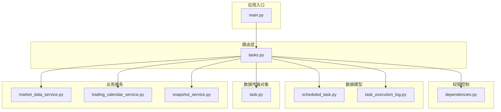
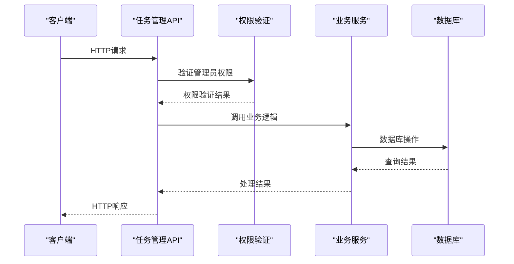
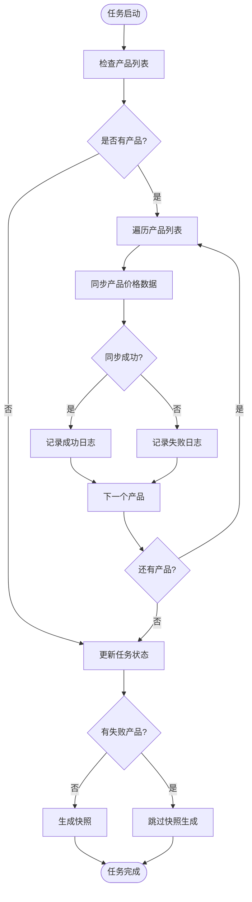
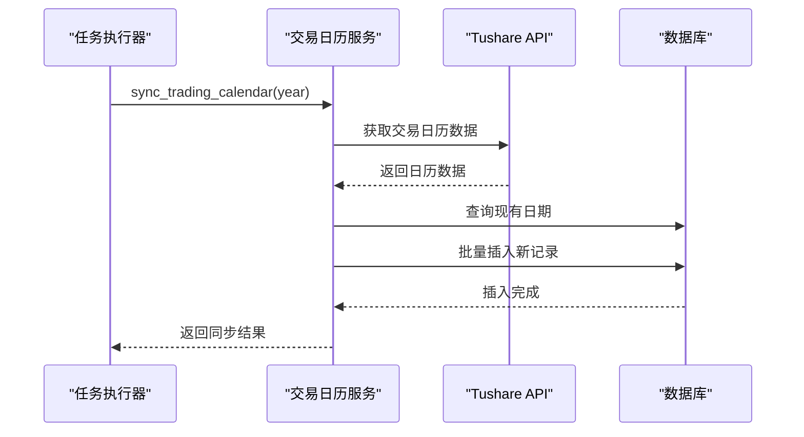
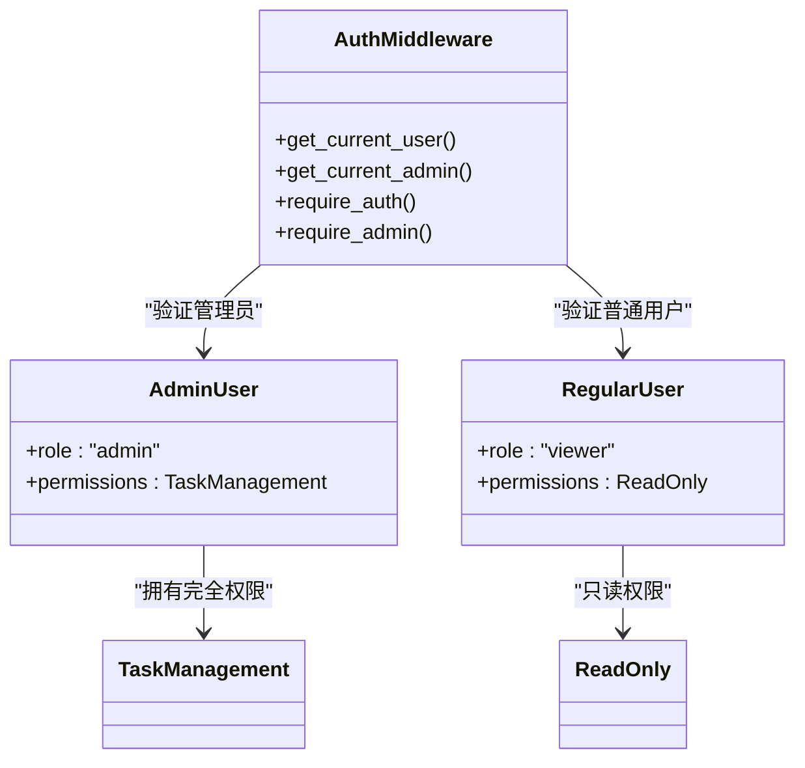
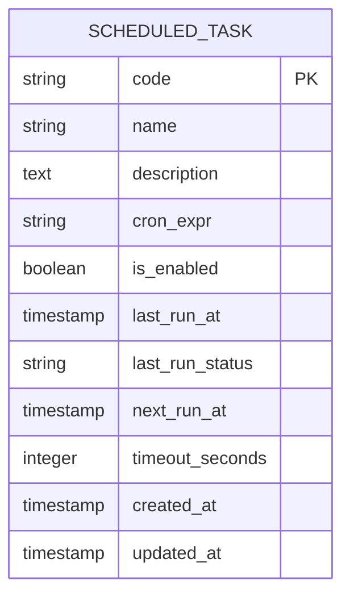
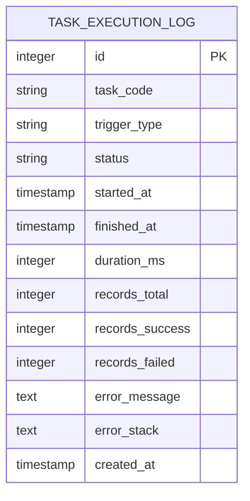
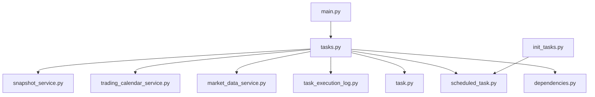

# 任务管理API

<cite>
**本文档引用的文件**
- [tasks.py](file://backend/app/routers/tasks.py)
- [task.py](file://backend/app/schemas/task.py)
- [scheduled_task.py](file://backend/app/models/scheduled_task.py)
- [task_execution_log.py](file://backend/app/models/task_execution_log.py)
- [init_tasks.py](file://backend/app/init_tasks.py)
- [dependencies.py](file://backend/app/dependencies.py)
- [main.py](file://backend/app/main.py)
- [market_data_service.py](file://backend/app/services/market_data_service.py)
- [trading_calendar_service.py](file://backend/app/services/trading_calendar_service.py)
- [snapshot_service.py](file://backend/app/services/snapshot_service.py)
- [04-后端开发.md](file://Docs/04-后端开发.md)
- [02-数据库设计.md](file://Docs/02-数据库设计.md)
- [config.py](file://backend/app/config.py)
</cite>

## 目录
1. [简介](#简介)
2. [项目结构](#项目结构)
3. [核心组件](#核心组件)
4. [架构概览](#架构概览)
5. [详细组件分析](#详细组件分析)
6. [依赖分析](#依赖分析)
7. [性能考虑](#性能考虑)
8. [故障排除指南](#故障排除指南)
9. [结论](#结论)

## 简介
本文件为 InvestRing 任务管理模块的完整API文档，覆盖定时任务管理、任务执行、任务监控等相关接口。文档详细说明了HTTP方法、URL模式、请求/响应模式和权限要求，包含任务创建、任务暂停、任务恢复、任务删除等操作接口，以及任务调度管理、任务执行历史、任务状态监控等功能接口。同时提供任务列表查询、任务执行日志查询、任务性能统计等查询接口说明，并解释任务调度的并发控制和错误重试机制。

## 项目结构
任务管理模块位于后端应用的路由层，主要文件包括：
- 路由定义：backend/app/routers/tasks.py
- 数据模型：backend/app/models/scheduled_task.py、backend/app/models/task_execution_log.py
- 数据传输对象：backend/app/schemas/task.py
- 初始化脚本：backend/app/init_tasks.py
- 权限控制：backend/app/dependencies.py
- 应用入口：backend/app/main.py
- 业务服务：market_data_service.py、trading_calendar_service.py、snapshot_service.py

**图表来源**
- [main.py:1-53](file://backend/app/main.py#L1-L53)
- [tasks.py:1-323](file://backend/app/routers/tasks.py#L1-L323)
- [dependencies.py:1-146](file://backend/app/dependencies.py#L1-L146)

**章节来源**
- [main.py:1-53](file://backend/app/main.py#L1-L53)
- [tasks.py:1-323](file://backend/app/routers/tasks.py#L1-L323)

## 核心组件
任务管理模块包含以下核心组件：

### 数据模型
- **ScheduledTask**：定时任务模型，包含任务代码、名称、描述、Cron表达式、启用状态、执行时间等字段
- **TaskExecutionLog**：任务执行日志模型，记录任务执行的详细信息

### 数据传输对象
- **TaskResponse**：任务响应模型，包含任务的基本信息和状态
- **TaskExecutionLogResponse**：任务执行日志响应模型，包含执行详情

### 业务服务
- **净值同步服务**：处理基金净值数据的同步
- **交易日历服务**：管理交易日历的同步
- **快照服务**：生成组合快照数据

**章节来源**
- [scheduled_task.py:1-19](file://backend/app/models/scheduled_task.py#L1-L19)
- [task_execution_log.py:1-21](file://backend/app/models/task_execution_log.py#L1-L21)
- [task.py:1-40](file://backend/app/schemas/task.py#L1-L40)

## 架构概览
任务管理模块采用分层架构设计，通过FastAPI框架实现RESTful API接口。

**图表来源**
- [tasks.py:70-323](file://backend/app/routers/tasks.py#L70-L323)
- [dependencies.py:114-146](file://backend/app/dependencies.py#L114-L146)

## 详细组件分析

### API接口定义

#### 任务列表查询
- **URL**: `/api/system/tasks`
- **HTTP方法**: GET
- **权限**: 需要管理员权限
- **查询参数**:
  - page: 页码，默认1
  - page_size: 每页大小，默认20
- **响应**: 包含任务列表、总数、页码信息的对象

#### 手动执行任务
- **URL**: `/api/system/tasks/{code}/run`
- **HTTP方法**: POST
- **权限**: 需要管理员权限
- **路径参数**:
  - code: 任务代码
- **响应**: 任务执行结果，包含成功信息和统计数据

#### 启用任务
- **URL**: `/api/system/tasks/{code}/enable`
- **HTTP方法**: POST
- **权限**: 需要管理员权限
- **路径参数**:
  - code: 任务代码
- **响应**: 成功消息

#### 禁用任务
- **URL**: `/api/system/tasks/{code}/disable`
- **HTTP方法**: POST
- **权限**: 需要管理员权限
- **路径参数**:
  - code: 任务代码
- **响应**: 成功消息

#### 查询任务执行日志
- **URL**: `/api/system/tasks/{code}/logs`
- **HTTP方法**: GET
- **权限**: 需要管理员权限
- **路径参数**:
  - code: 任务代码
- **查询参数**:
  - page: 页码，默认1
  - page_size: 每页大小，默认20
- **响应**: 包含日志列表、总数、页码信息的对象

**章节来源**
- [tasks.py:70-323](file://backend/app/routers/tasks.py#L70-L323)

### 任务类型与执行逻辑

#### 净值同步任务 (nav_sync)
该任务负责同步基金净值数据，执行流程如下：

**图表来源**
- [tasks.py:127-237](file://backend/app/routers/tasks.py#L127-L237)
- [market_data_service.py:88-200](file://backend/app/services/market_data_service.py#L88-L200)

#### 交易日历同步任务 (trading_calendar_sync)
该任务负责同步指定年份的交易日历数据：

**图表来源**
- [tasks.py:112-125](file://backend/app/routers/tasks.py#L112-L125)
- [trading_calendar_service.py:15-66](file://backend/app/services/trading_calendar_service.py#L15-L66)

#### 日志清理任务 (log_cleanup)
该任务负责清理过期的日志数据，保留策略：
- 登录日志：保留30天
- 审计日志：保留90天
- 任务执行日志：保留90天
- 系统错误日志：保留30天

**章节来源**
- [tasks.py:19-68](file://backend/app/routers/tasks.py#L19-L68)
- [tasks.py:239-250](file://backend/app/routers/tasks.py#L239-L250)

### 权限控制机制
任务管理API采用管理员权限控制：

**图表来源**
- [dependencies.py:114-146](file://backend/app/dependencies.py#L114-L146)

**章节来源**
- [dependencies.py:114-146](file://backend/app/dependencies.py#L114-L146)

### 数据模型设计

#### 定时任务表结构

#### 任务执行日志表结构

**图表来源**
- [scheduled_task.py:5-19](file://backend/app/models/scheduled_task.py#L5-L19)
- [task_execution_log.py:5-21](file://backend/app/models/task_execution_log.py#L5-L21)

**章节来源**
- [scheduled_task.py:1-19](file://backend/app/models/scheduled_task.py#L1-L19)
- [task_execution_log.py:1-21](file://backend/app/models/task_execution_log.py#L1-L21)

## 依赖分析

### 外部依赖
- **FastAPI**: Web框架，提供API路由和依赖注入
- **SQLAlchemy**: ORM框架，处理数据库操作
- **Pydantic**: 数据验证和序列化
- **Tushare**: 金融数据API，用于净值和日历数据获取

### 内部依赖关系

**图表来源**
- [tasks.py:1-16](file://backend/app/routers/tasks.py#L1-L16)
- [main.py:46](file://backend/app/main.py#L46)

**章节来源**
- [tasks.py:1-16](file://backend/app/routers/tasks.py#L1-L16)
- [main.py:46](file://backend/app/main.py#L46)

## 性能考虑

### 并发控制机制
系统采用SQLite WAL模式支持并发读写：
- 读操作不阻塞写操作
- 写操作不阻塞读操作
- 适用于读多写少的场景

### 错误重试机制
- **Tushare API限流**: 200次/分钟，超出需分页获取
- **任务超时控制**: 默认超时时间为300秒
- **批量操作优化**: 支持批量插入和查询

### 数据库优化
- **索引设计**: 为常用查询字段建立索引
- **连接池**: 使用SQLAlchemy连接池管理数据库连接
- **事务管理**: 正确使用数据库事务确保数据一致性

**章节来源**
- [02-数据库设计.md:624-656](file://Docs/02-数据库设计.md#L624-L656)
- [market_data_service.py:666-673](file://Docs/04-后端开发.md#L666-L673)

## 故障排除指南

### 常见错误及解决方案

#### 权限相关错误
- **401 未授权**: 检查Token是否有效
- **403 禁止访问**: 确认用户角色为admin
- **404 任务不存在**: 验证任务代码是否正确

#### 任务执行错误
- **500 服务器内部错误**: 查看错误日志，检查API密钥配置
- **超时错误**: 调整任务超时时间或优化数据量
- **数据源错误**: 检查Tushare API配置和网络连接

#### 数据库相关错误
- **连接超时**: 检查数据库连接配置
- **锁等待超时**: 优化查询语句，避免长时间事务
- **并发冲突**: 使用WAL模式或调整并发策略

### 调试建议
1. 启用调试模式查看详细错误信息
2. 检查任务执行日志了解具体执行过程
3. 验证数据库连接和权限设置
4. 确认外部API服务可用性

**章节来源**
- [dependencies.py:58-101](file://backend/app/dependencies.py#L58-L101)
- [tasks.py:259-267](file://backend/app/routers/tasks.py#L259-L267)

## 结论
InvestRing任务管理模块提供了完整的定时任务管理能力，包括任务调度、执行监控、日志记录等功能。通过清晰的API设计、严格的权限控制和完善的错误处理机制，确保了系统的稳定性和可靠性。系统采用现代化的技术栈和最佳实践，为金融数据处理提供了高效可靠的基础设施。