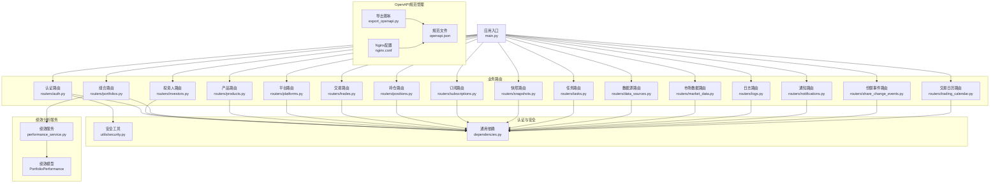
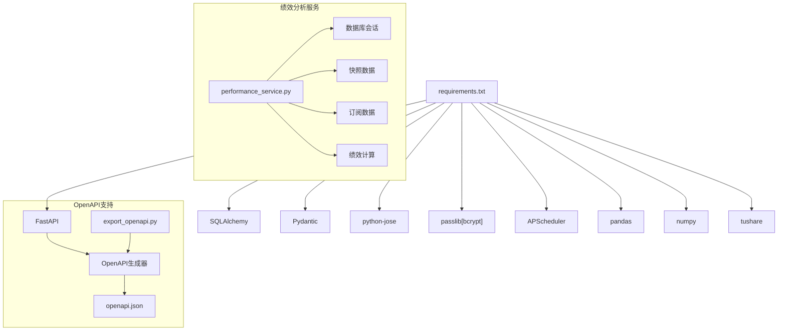
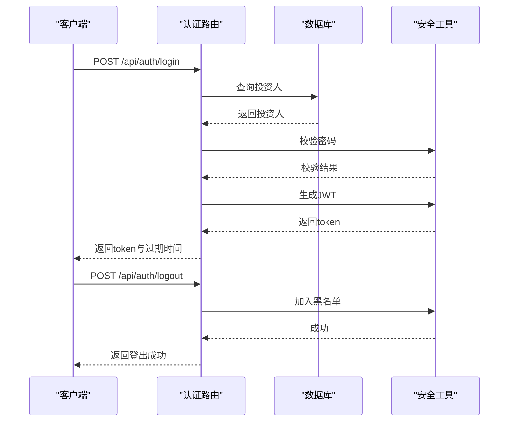
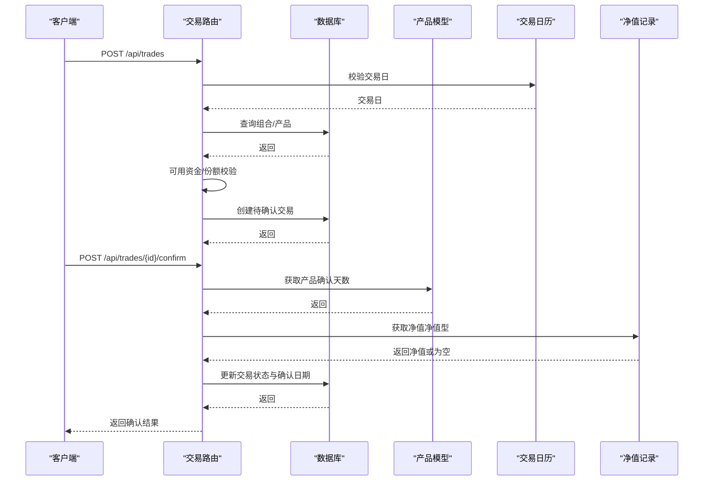
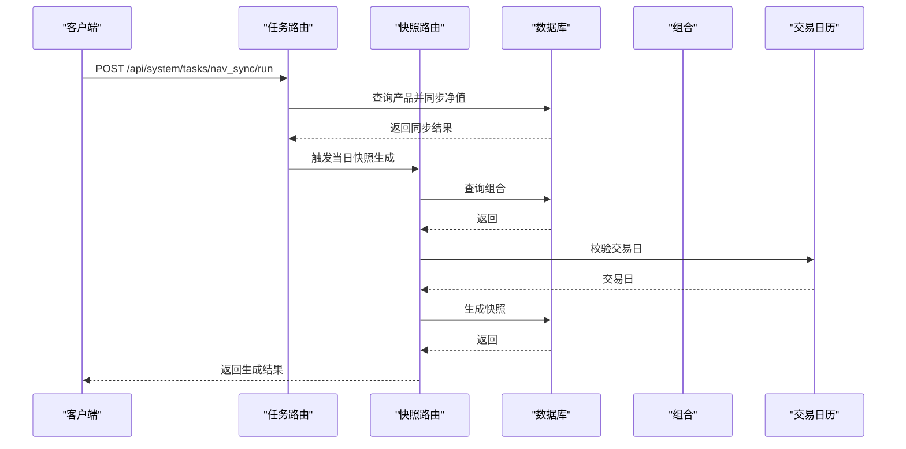
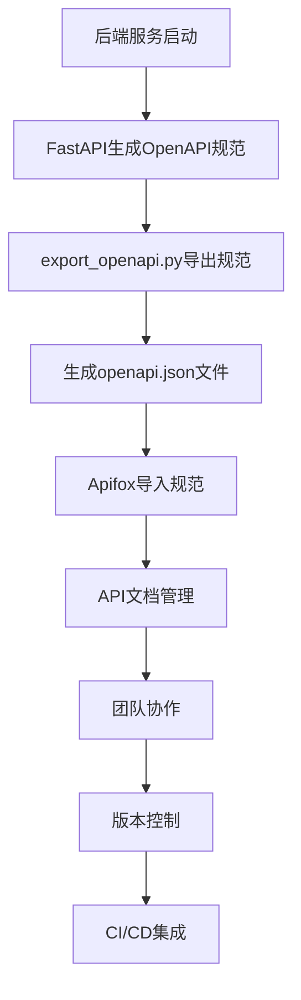
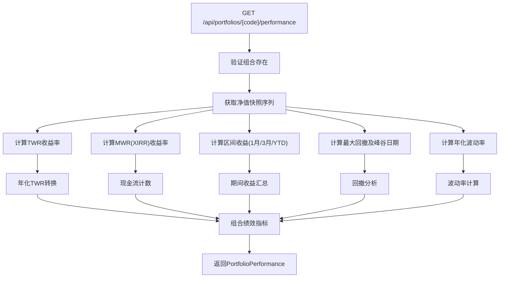
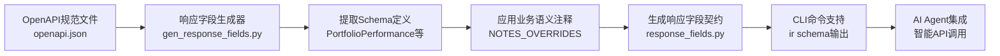
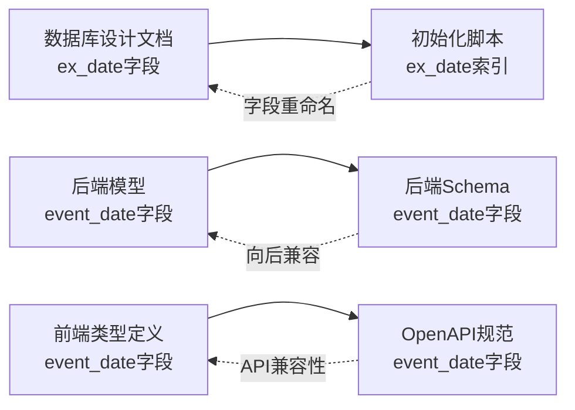

# 后端API文档

<cite>
**本文档引用的文件**
- [backend/app/main.py](file://backend/app/main.py)
- [backend/app/config.py](file://backend/app/config.py)
- [backend/app/dependencies.py](file://backend/app/dependencies.py)
- [backend/app/utils/security.py](file://backend/app/utils/security.py)
- [backend/app/routers/auth.py](file://backend/app/routers/auth.py)
- [backend/app/routers/investors.py](file://backend/app/routers/investors.py)
- [backend/app/routers/portfolios.py](file://backend/app/routers/portfolios.py)
- [backend/app/routers/products.py](file://backend/app/routers/products.py)
- [backend/app/routers/platforms.py](file://backend/app/routers/platforms.py)
- [backend/app/routers/positions.py](file://backend/app/routers/positions.py)
- [backend/app/routers/trades.py](file://backend/app/routers/trades.py)
- [backend/app/routers/snapshots.py](file://backend/app/routers/snapshots.py)
- [backend/app/routers/tasks.py](file://backend/app/routers/tasks.py)
- [backend/app/routers/subscriptions.py](file://backend/app/routers/subscriptions.py)
- [backend/app/routers/data_sources.py](file://backend/app/routers/data_sources.py)
- [backend/app/routers/market_data.py](file://backend/app/routers/market_data.py)
- [backend/app/routers/logs.py](file://backend/app/routers/logs.py)
- [backend/app/routers/notifications.py](file://backend/app/routers/notifications.py)
- [backend/app/routers/share_change_events.py](file://backend/app/routers/share_change_events.py)
- [backend/app/routers/trading_calendar.py](file://backend/app/routers/trading_calendar.py)
- [backend/export_openapi.py](file://backend/export_openapi.py)
- [backend/openapi.json](file://backend/openapi.json)
- [backend/nginx/nginx.conf](file://backend/nginx/nginx.conf)
- [backend/requirements.txt](file://backend/requirements.txt)
- [backend/app/models/share_change_event.py](file://backend/app/models/share_change_event.py)
- [backend/app/schemas/share_change_event.py](file://backend/app/schemas/share_change_event.py)
- [backend/cli/commands/share_events.py](file://backend/cli/commands/share_events.py)
- [frontend/src/types/share-change-event.ts](file://frontend/src/types/share-change-event.ts)
- [backend/app/schemas/portfolio.py](file://backend/app/schemas/portfolio.py)
- [backend/app/services/performance_service.py](file://backend/app/services/performance_service.py)
- [ir-cli/scripts/gen_response_fields.py](file://ir-cli/scripts/gen_response_fields.py)
- [backend/cli/commands/portfolios.py](file://backend/cli/commands/portfolios.py)
</cite>

## 更新摘要
**所做更改**
- 新增投资组合绩效分析端点 `/api/portfolios/{code}/performance`，提供完整的TWR/MWR收益率、区间收益、最大回撤和年化波动率等指标
- 新增 PortfolioPerformance schema，包含20个绩效相关字段，支持快照不足时的空值处理
- 增强响应字段生成工具，新增对组合绩效指标的契约定义和业务语义注释
- 更新OpenAPI规范文件至83个路径，包含新的绩效分析接口
- 完善CLI命令支持，新增 `ir portfolio performance` 命令

## 目录
1. [简介](#简介)
2. [项目结构](#项目结构)
3. [核心组件](#核心组件)
4. [架构总览](#架构总览)
5. [详细组件分析](#详细组件分析)
6. [OpenAPI规范管理](#openapi规范管理)
7. [依赖分析](#依赖分析)
8. [性能考虑](#性能考虑)
9. [故障排除指南](#故障排除指南)
10. [结论](#结论)
11. [附录](#附录)

## 简介
本文件为 InvestRing 后端的完整 API 文档，覆盖认证系统、投资人管理、投资组合管理、产品管理、持仓管理、交易管理、快照系统、任务管理、数据源配置、市场数据、日志管理、通知管理、份额变动事件、交易日历等模块。文档提供每个 API 的 HTTP 方法、URL 模式、请求/响应模式、认证方式与权限控制、错误码说明、请求与响应示例路径、版本管理与兼容性策略、常见使用场景与最佳实践。

**更新** 新增投资组合绩效分析功能，提供专业级的投资回报率计算和风险指标分析，包括时间加权收益率(TWR)、资金加权收益率(MWR/XIRR)、最大回撤、年化波动率等关键绩效指标。

## 项目结构
后端基于 FastAPI 构建，采用模块化路由组织，核心入口在主应用中注册各模块路由，并统一处理 CORS 与数据库初始化。认证与权限通过依赖注入与安全工具实现，配置集中于配置模块。新增OpenAPI规范自动生成与管理功能。

```mermaid
graph TB
A["应用入口<br/>main.py"] --> B["认证路由<br/>routers/auth.py"]
A --> C["投资人路由<br/>routers/investors.py"]
A --> D["组合路由<br/>routers/portfolios.py"]
A --> E["产品路由<br/>routers/products.py"]
A --> F["平台路由<br/>routers/platforms.py"]
A --> G["交易路由<br/>routers/trades.py"]
A --> H["持仓路由<br/>routers/positions.py"]
A --> I["订阅路由<br/>routers/subscriptions.py"]
A --> J["快照路由<br/>routers/snapshots.py"]
A --> K["任务路由<br/>routers/tasks.py"]
A --> L["通用依赖与安全<br/>dependencies.py / utils/security.py"]
A --> M["配置<br/>config.py"]
A --> N["数据源路由<br/>routers/data_sources.py"]
A --> O["市场数据路由<br/>routers/market_data.py"]
A --> P["日志路由<br/>routers/logs.py"]
A --> Q["通知路由<br/>routers/notifications.py"]
A --> R["份额事件路由<br/>routers/share_change_events.py"]
A --> S["交易日历路由<br/>routers/trading_calendar.py"]
A --> T["OpenAPI规范<br/>export_openapi.py / openapi.json"]
A --> U["绩效服务<br/>services/performance_service.py"]
D --> U
```

**图表来源**
- [backend/app/main.py:17-48](file://backend/app/main.py#L17-L48)
- [backend/app/routers/auth.py:25](file://backend/app/routers/auth.py#L25)
- [backend/app/routers/investors.py:11](file://backend/app/routers/investors.py#L11)
- [backend/app/routers/portfolios.py:15](file://backend/app/routers/portfolios.py#L15)
- [backend/app/routers/products.py:9](file://backend/app/routers/products.py#L9)
- [backend/app/routers/platforms.py:9](file://backend/app/routers/platforms.py#L9)
- [backend/app/routers/trades.py:108](file://backend/app/routers/trades.py#L108)
- [backend/app/routers/positions.py:16](file://backend/app/routers/positions.py#L16)
- [backend/app/routers/subscriptions.py:16](file://backend/app/routers/subscriptions.py#L16)
- [backend/app/routers/snapshots.py:25](file://backend/app/routers/snapshots.py#L25)
- [backend/app/routers/tasks.py:16](file://backend/app/routers/tasks.py#L16)
- [backend/app/routers/data_sources.py:11](file://backend/app/routers/data_sources.py#L11)
- [backend/app/routers/market_data.py:1](file://backend/app/routers/market_data.py#L1)
- [backend/app/routers/logs.py:1](file://backend/app/routers/logs.py#L1)
- [backend/app/routers/notifications.py:1](file://backend/app/routers/notifications.py#L1)
- [backend/app/routers/share_change_events.py:1](file://backend/app/routers/share_change_events.py#L1)
- [backend/app/routers/trading_calendar.py:1](file://backend/app/routers/trading_calendar.py#L1)
- [backend/export_openapi.py:1](file://backend/export_openapi.py#L1)
- [backend/openapi.json:1](file://backend/openapi.json#L1)
- [backend/app/services/performance_service.py:1](file://backend/app/services/performance_service.py#L1)

**章节来源**
- [backend/app/main.py:17-48](file://backend/app/main.py#L17-L48)

## 核心组件
- 应用入口与路由注册：在主应用中注册认证、投资人、组合、产品、平台、交易、持仓、订阅、快照、任务、数据源、市场数据、日志、通知、份额事件、交易日历等路由，并启用 CORS。
- 认证与权限：通过 HTTP Bearer Token 进行认证，支持令牌黑名单、账户锁定与失败追踪；提供普通用户与管理员权限依赖。
- 安全工具：密码哈希、JWT 编解码、令牌黑名单维护、登录失败锁定策略。
- 配置中心：集中管理数据库连接、密钥、Tushare Token、调试开关等。
- **OpenAPI规范管理**：自动生成和导出OpenAPI规范，支持Apifox等工具导入。
- **绩效分析服务**：专业的投资绩效计算引擎，支持TWR/MWR双口径收益率、风险指标分析和净值序列质量检查。

**章节来源**
- [backend/app/main.py:17-48](file://backend/app/main.py#L17-L48)
- [backend/app/dependencies.py:49-137](file://backend/app/dependencies.py#L49-L137)
- [backend/app/utils/security.py:15-103](file://backend/app/utils/security.py#L15-L103)
- [backend/app/config.py:5-36](file://backend/app/config.py#L5-L36)
- [backend/export_openapi.py:1](file://backend/export_openapi.py#L1)
- [backend/app/services/performance_service.py:1](file://backend/app/services/performance_service.py#L1)

## 架构总览
下图展示 API 路由与核心依赖的关系，体现认证、权限、安全与业务模块之间的交互，以及新增的OpenAPI规范管理流程和绩效分析服务。

**图表来源**
- [backend/app/main.py:32-48](file://backend/app/main.py#L32-L48)
- [backend/app/routers/auth.py:15-21](file://backend/app/routers/auth.py#L15-L21)
- [backend/app/dependencies.py:9](file://backend/app/dependencies.py#L9)
- [backend/app/utils/security.py:8](file://backend/app/utils/security.py#L8)
- [backend/app/routers/portfolios.py:18](file://backend/app/routers/portfolios.py#L18)
- [backend/app/services/performance_service.py:1](file://backend/app/services/performance_service.py#L1)
- [backend/app/schemas/portfolio.py:72](file://backend/app/schemas/portfolio.py#L72)
- [backend/export_openapi.py:1](file://backend/export_openapi.py#L1)
- [backend/openapi.json:1](file://backend/openapi.json#L1)
- [backend/nginx/nginx.conf:105](file://backend/nginx/nginx.conf#L105)

## 详细组件分析

### 认证系统
- 认证方式：HTTP Bearer Token（JWT）。登录成功后返回 token 与过期时间，后续请求在 Authorization 头中携带 Bearer token。
- 权限控制：普通用户依赖 get_current_user，管理员依赖 get_current_admin；支持令牌黑名单与账户锁定。
- 错误码：包含 INVALID_CREDENTIALS、ACCOUNT_LOCKED、FORBIDDEN、INVALID_TOKEN 等。

接口清单
- POST /api/auth/login
  - 请求体：LoginRequest（包含 code、password）
  - 响应体：LoginResponse（token、expires_at、user）
  - 权限：匿名
  - 示例路径：[登录请求体示例:30-30](file://backend/app/routers/auth.py#L30-L30)，[登录响应示例:87-95](file://backend/app/routers/auth.py#L87-L95)
- POST /api/auth/logout
  - 请求体：无
  - 响应体：{"message": "..."}
  - 权限：需要认证
  - 示例路径：[登出示例:98-119](file://backend/app/routers/auth.py#L98-L119)
- PUT /api/auth/password
  - 请求体：ChangePasswordRequest（target_code 可选、old_password、new_password）
  - 响应体：{"message": "..."}
  - 权限：需要认证；admin 可改任意用户密码，viewer 只能改自己且需旧密码
  - 示例路径：[改密请求示例:122-128](file://backend/app/routers/auth.py#L122-L128)，[改密响应示例:185-185](file://backend/app/routers/auth.py#L185-L185)

**章节来源**
- [backend/app/routers/auth.py:29-186](file://backend/app/routers/auth.py#L29-L186)
- [backend/app/dependencies.py:49-137](file://backend/app/dependencies.py#L49-L137)
- [backend/app/utils/security.py:29-46](file://backend/app/utils/security.py#L29-L46)

### 投资人管理
- 权限：仅管理员
- 接口清单
  - GET /api/investors
    - 查询参数：page、page_size、可选 status（组合管理中使用）
    - 响应体：分页对象（items、total、page、page_size）
    - 示例路径：[投资人列表示例:14-29](file://backend/app/routers/investors.py#L14-L29)
  - POST /api/investors
    - 请求体：InvestorCreate（code、name、phone、email、password）
    - 响应体：InvestorResponse
    - 示例路径：[创建投资人示例:32-53](file://backend/app/routers/investors.py#L32-L53)
  - GET /api/investors/{code}
    - 响应体：InvestorResponse
    - 示例路径：[获取投资人示例:56-65](file://backend/app/routers/investors.py#L56-L65)
  - PUT /api/investors/{code}
    - 请求体：InvestorUpdate（可选字段）
    - 响应体：InvestorResponse
    - 示例路径：[更新投资人示例:68-88](file://backend/app/routers/investors.py#L68-L88)
  - DELETE /api/investors/{code}
    - 响应体：{"message": "..."}
    - 示例路径：[删除投资人示例:91-119](file://backend/app/routers/investors.py#L91-L119)

**章节来源**
- [backend/app/routers/investors.py:14-120](file://backend/app/routers/investors.py#L14-L120)

### 投资组合管理
- 权限：GET /api/portfolios 与 GET /api/portfolios/{code} 对普通用户开放；其余对管理员开放
- 接口清单
  - GET /api/portfolios
    - 查询参数：status、page、page_size
    - 响应体：分页对象
    - 示例路径：[组合列表示例:18-36](file://backend/app/routers/portfolios.py#L18-L36)
  - POST /api/portfolios
    - 请求体：PortfolioCreate
    - 响应体：PortfolioResponse
    - 示例路径：[创建组合示例:39-58](file://backend/app/routers/portfolios.py#L39-L58)
  - GET /api/portfolios/{code}
    - 响应体：PortfolioResponse
    - 示例路径：[获取组合示例:61-70](file://backend/app/routers/portfolios.py#L61-L70)
  - PUT /api/portfolios/{code}
    - 请求体：PortfolioUpdate
    - 响应体：PortfolioResponse
    - 示例路径：[更新组合示例:73-89](file://backend/app/routers/portfolios.py#L73-L89)
  - POST /api/portfolios/{code}/close
    - 响应体：{"message": "..."}
    - 示例路径：[关闭组合示例:92-131](file://backend/app/routers/portfolios.py#L92-L131)
  - POST /api/portfolios/{code}/reactivate
    - 响应体：{"message": "..."}
    - 示例路径：[重新激活组合示例:134-156](file://backend/app/routers/portfolios.py#L134-L156)
  - GET /api/portfolios/{code}/nav-history
    - 查询参数：start_date、end_date
    - 响应体：包含日期、单位净值、总值、总份额的历史数组
    - 示例路径：[净值历史示例:159-191](file://backend/app/routers/portfolios.py#L159-L191)
  - GET /api/portfolios/{code}/returns
    - 响应体：累计收益、年化收益、初始/当前净值、持有天数
    - 示例路径：[收益统计示例:194-241](file://backend/app/routers/portfolios.py#L194-L241)
  - **GET /api/portfolios/{code}/performance** ⭐ **新增**
    - 响应体：PortfolioPerformance（包含TWR、MWR、区间收益、最大回撤、年化波动率等20个绩效指标）
    - 权限：需要认证
    - 描述：组合绩效全指标：TWR / MWR(XIRR) / 区间收益 / 最大回撤 / 年化波动率
    - 示例路径：[绩效接口示例:136-147](file://backend/app/routers/portfolios.py#L136-L147)
  - GET /api/portfolios/{code}/cash-flow
    - 响应体：流入、流出、净流入
    - 示例路径：[现金流示例:244-275](file://backend/app/routers/portfolios.py#L244-L275)

**更新** 新增投资组合绩效分析端点，提供专业的投资回报率计算和风险指标分析功能。

**章节来源**
- [backend/app/routers/portfolios.py:18-157](file://backend/app/routers/portfolios.py#L18-L157)

### 产品管理
- 权限：管理员
- 接口清单
  - GET /api/products
    - 查询参数：product_type、page、page_size
    - 响应体：分页对象
    - 示例路径：[产品列表示例:27-45](file://backend/app/routers/products.py#L27-L45)
  - POST /api/products
    - 请求体：ProductCreate
    - 响应体：ProductResponse
    - 示例路径：[创建产品示例:48-76](file://backend/app/routers/products.py#L48-L76)
  - GET /api/products/{code}/{market}
    - 响应体：ProductResponse
    - 示例路径：[获取产品示例:79-92](file://backend/app/routers/products.py#L79-L92)
  - PUT /api/products/{code}/{market}
    - 请求体：ProductUpdate
    - 响应体：ProductResponse
    - 示例路径：[更新产品示例:95-122](file://backend/app/routers/products.py#L95-L122)
  - DELETE /api/products/{code}/{market}
    - 响应体：{"message": "..."}
    - 示例路径：[删除产品示例:125-141](file://backend/app/routers/products.py#L125-L141)

**章节来源**
- [backend/app/routers/products.py:27-142](file://backend/app/routers/products.py#L27-L142)

### 平台管理
- 权限：GET 对普通用户开放；其余对管理员开放
- 接口清单
  - GET /api/platforms
    - 查询参数：page、page_size
    - 响应体：分页对象
    - 示例路径：[平台列表示例:12-27](file://backend/app/routers/platforms.py#L12-L27)
  - POST /api/platforms
    - 请求体：PlatformCreate
    - 响应体：PlatformResponse
    - 示例路径：[创建平台示例:30-44](file://backend/app/routers/platforms.py#L30-L44)
  - GET /api/platforms/{code}
    - 响应体：PlatformResponse
    - 示例路径：[获取平台示例:47-55](file://backend/app/routers/platforms.py#L47-L55)
  - PUT /api/platforms/{code}
    - 请求体：PlatformUpdate
    - 响应体：PlatformResponse
    - 示例路径：[更新平台示例:59-75](file://backend/app/routers/platforms.py#L59-L75)
  - DELETE /api/platforms/{code}
    - 响应体：{"message": "..."}
    - 示例路径：[删除平台示例:78-90](file://backend/app/routers/platforms.py#L78-L90)

**章节来源**
- [backend/app/routers/platforms.py:12-91](file://backend/app/routers/platforms.py#L12-L91)

### 持仓管理
- 权限：GET 对普通用户开放；其余对管理员开放
- 接口清单
  - GET /api/positions
    - 查询参数：portfolio_code、snapshot_date、page、page_size
    - 响应体：分页对象（默认返回最新快照）
    - 示例路径：[持仓列表示例:180-218](file://backend/app/routers/positions.py#L180-L218)
  - POST /api/positions
    - 请求体：PositionCreate
    - 响应体：PositionResponse
    - 示例路径：[创建持仓示例:221-231](file://backend/app/routers/positions.py#L221-L231)
  - GET /api/positions/{id}
    - 响应体：PositionResponse
    - 示例路径：[获取持仓示例:234-243](file://backend/app/routers/positions.py#L234-L243)
  - PUT /api/positions/{id}
    - 请求体：PositionUpdate
    - 响应体：PositionResponse
    - 示例路径：[更新持仓示例:246-262](file://backend/app/routers/positions.py#L246-L262)
  - DELETE /api/positions/{id}
    - 响应体：{"message": "..."}
    - 示例路径：[删除持仓示例:265-277](file://backend/app/routers/positions.py#L265-L277)
  - GET /api/positions/portfolio/{portfolio_code}/available-cash
    - 响应体：{"portfolio_code": "...", "available_cash": number}
    - 示例路径：[可用现金示例:280-293](file://backend/app/routers/positions.py#L280-L293)
  - GET /api/positions/portfolio/{portfolio_code}/product/{product_code}/available-shares
    - 查询参数：market（可选）
    - 响应体：{"portfolio_code": "...", "product_code": "...", "market": "...", "available_shares": number}
    - 示例路径：[可用份额示例:296-316](file://backend/app/routers/positions.py#L296-L316)
  - POST /api/positions/portfolio/{portfolio_code}/cash-position
    - 请求体：CashPositionUpdate（包含 platform_code、amount、update_date 可选）
    - 响应体：操作结果
    - 权限：管理员；仅交易日；必须指定平台代码；CASH 产品金额更新
    - 示例路径：[更新现金头寸示例:319-409](file://backend/app/routers/positions.py#L319-L409)

**章节来源**
- [backend/app/routers/positions.py:180-410](file://backend/app/routers/positions.py#L180-L410)

### 交易管理
- 权限：除查询外多为管理员；交易日校验与可用性计算贯穿流程
- 接口清单
  - GET /api/trades
    - 查询参数：portfolio_code、page、page_size
    - 响应体：分页对象（按创建时间倒序）
    - 示例路径：[交易列表示例:271-289](file://backend/app/routers/trades.py#L271-L289)
  - POST /api/trades
    - 请求体：TradeCreate（buy/sell 类型、金额/份额、价格、费用、交易日期等）
    - 响应体：TradeResponse（状态默认 pending）
    - 权限：管理员；交易日校验；可用现金/份额校验；自动计算份额与金额
    - 示例路径：[创建交易示例:292-402](file://backend/app/routers/trades.py#L292-L402)
  - GET /api/trades/{id}
    - 响应体：TradeResponse
    - 示例路径：[获取交易示例:405-414](file://backend/app/routers/trades.py#L405-L414)
  - POST /api/trades/{id}/confirm
    - 查询参数：confirm_date（可选）、price（可选）
    - 响应体：确认结果与 TradeResponse
    - 权限：管理员；净值型产品需净值；非净值型可手动指定价格
    - 示例路径：[确认交易示例:417-504](file://backend/app/routers/trades.py#L417-L504)
  - POST /api/trades/{id}/cancel
    - 响应体：{"message": "..."}
    - 权限：管理员；仅场外 pending 可取消
    - 示例路径：[取消交易示例:507-532](file://backend/app/routers/trades.py#L507-L532)
  - PUT /api/trades/{id}
    - 请求体：TradeUpdate
    - 响应体：TradeResponse
    - 示例路径：[更新交易示例:535-551](file://backend/app/routers/trades.py#L535-L551)
  - DELETE /api/trades/{id}
    - 响应体：{"message": "..."}
    - 示例路径：[删除交易示例:554-566](file://backend/app/routers/trades.py#L554-L566)

**章节来源**
- [backend/app/routers/trades.py:271-567](file://backend/app/routers/trades.py#L271-L567)

### 快照系统
- 版本：/api/v1（快照管理路由前缀为 /api/v1）
- 权限：生成/重算/删除/预检为管理员；查询组合快照状态对普通用户开放
- 接口清单
  - POST /api/v1/snapshots/generate
    - 请求体：SnapshotGenerateRequest（portfolio_code、target_date）
    - 响应体：SnapshotGenerationResult
    - 示例路径：[生成快照示例:28-55](file://backend/app/routers/snapshots.py#L28-L55)
  - POST /api/v1/snapshots/recalculate
    - 请求体：SnapshotRecalculateRequest（portfolio_code、start_date、end_date、force）
    - 响应体：RecalculationResult
    - 示例路径：[重算快照示例:58-87](file://backend/app/routers/snapshots.py#L58-L87)
  - GET /api/v1/snapshots/validation
    - 查询参数：portfolio_code、target_date
    - 响应体：SnapshotValidationResult
    - 示例路径：[依赖预检示例:90-111](file://backend/app/routers/snapshots.py#L90-L111)
  - GET /api/v1/snapshots/portfolios/{code}/status
    - 响应体：SnapshotStatusResponse（最新/最早快照日期、总数、缺失日期列表）
    - 示例路径：[快照状态示例:114-157](file://backend/app/routers/snapshots.py#L114-L157)
  - DELETE /api/v1/snapshots/{portfolio_code}/{snapshot_date}
    - 响应体：{"success": true, "message": "..."}
    - 示例路径：[删除快照示例:160-187](file://backend/app/routers/snapshots.py#L160-L187)

**章节来源**
- [backend/app/routers/snapshots.py#L28-L188:28-188](file://backend/app/routers/snapshots.py#L28-L188)

### 任务管理
- 权限：管理员
- 接口清单
  - GET /api/system/tasks
    - 查询参数：page、page_size
    - 响应体：分页对象
    - 示例路径：[任务列表示例:70-85](file://backend/app/routers/tasks.py#L70-L85)
  - POST /api/system/tasks/{code}/run
    - 响应体：根据任务类型返回不同结果（如净值同步后的统计）
    - 支持任务：trading_calendar_sync、nav_sync、log_cleanup
    - 示例路径：[运行任务示例:88-267](file://backend/app/routers/tasks.py#L88-L267)
  - POST /api/system/tasks/{code}/enable
    - 响应体：{"message": "..."}
    - 示例路径：[启用任务示例:270-282](file://backend/app/routers/tasks.py#L270-L282)
  - POST /api/system/tasks/{code}/disable
    - 响应体：{"message": "..."}
    - 示例路径：[禁用任务示例:285-297](file://backend/app/routers/tasks.py#L285-L297)
  - GET /api/system/tasks/{code}/logs
    - 查询参数：page、page_size
    - 响应体：分页对象（任务执行日志）
    - 示例路径：[任务日志示例:300-322](file://backend/app/routers/tasks.py#L300-L322)

**章节来源**
- [backend/app/routers/tasks.py#L70-L323:70-323](file://backend/app/routers/tasks.py#L70-L323)

### 申购赎回
- 权限：GET 对普通用户开放（viewer 仅能看自己的记录）；其余对管理员开放
- 接口清单
  - GET /api/subscriptions
    - 查询参数：portfolio_code、investor_code、page、page_size
    - 响应体：分页对象（按创建时间倒序）
    - 示例路径：[订阅列表示例:88-112](file://backend/app/routers/subscriptions.py#L88-L112)
  - POST /api/subscriptions
    - 请求体：SubscriptionCreate（subscribe/redeem 类型、金额/份额、申请日期）
    - 响应体：SubscriptionResponse（状态默认 pending）
    - 权限：管理员；交易日校验；可用份额校验（赎回）
    - 示例路径：[创建订阅示例:115-199](file://backend/app/routers/subscriptions.py#L115-L199)
  - GET /api/subscriptions/{id}
    - 响应体：SubscriptionResponse
    - 权限：普通用户仅能查看自己的记录
    - 示例路径：[获取订阅示例:202-213](file://backend/app/routers/subscriptions.py#L202-L213)
  - POST /api/subscriptions/{id}/confirm
    - 查询参数：confirm_date（可选）、unit_price（可选）
    - 响应体：确认结果与 SubscriptionResponse
    - 权限：管理员；首次申购净值固定；赎回需提供净值
    - 示例路径：[确认订阅示例:237-320](file://backend/app/routers/subscriptions.py#L237-L320)
  - POST /api/subscriptions/{id}/cancel
    - 响应体：{"message": "..."}
    - 权限：管理员；仅 pending 可取消
    - 示例路径：[取消订阅示例:323-340](file://backend/app/routers/subscriptions.py#L323-L340)
  - PUT /api/subscriptions/{id}
    - 请求体：SubscriptionUpdate
    - 响应体：SubscriptionResponse
    - 示例路径：[更新订阅示例:343-359](file://backend/app/routers/subscriptions.py#L343-L359)
  - DELETE /api/subscriptions/{id}
    - 响应体：{"message": "..."}
    - 示例路径：[删除订阅示例:362-374](file://backend/app/routers/subscriptions.py#L362-L374)

**章节来源**
- [backend/app/routers/subscriptions.py#L88-L375:88-375](file://backend/app/routers/subscriptions.py#L88-L375)

### 数据源配置
- 权限：管理员
- 接口清单
  - GET /api/system/data-sources
    - 响应体：数据源配置列表（包含Tushare、AkShare等）
    - 示例路径：[数据源列表示例:1594-1618](file://backend/app/routers/data_sources.py#L1594-L1618)
  - GET /api/system/data-sources/{name}
    - 响应体：单个数据源配置
    - 示例路径：[数据源详情示例:1619-1674](file://backend/app/routers/data_sources.py#L1619-L1674)
  - PUT /api/system/data-sources/{name}
    - 请求体：DataSourceUpdate
    - 响应体：更新后的数据源配置
    - 示例路径：[更新数据源示例:1675-1700](file://backend/app/routers/data_sources.py#L1675-L1700)

**章节来源**
- [backend/app/routers/data_sources.py#L1594-L1700:1594-1700](file://backend/app/routers/data_sources.py#L1594-L1700)

### 市场数据
- 权限：管理员
- 接口清单
  - GET /api/market-data/products/{code}/{market}/price-data
    - 查询参数：start_date、end_date、adjust（复权因子）
    - 响应体：价格数据列表
    - 示例路径：[产品价格数据示例:1675-1788](file://backend/app/routers/market_data.py#L1675-L1788)
  - POST /api/market-data/products/{code}/{market}/sync-price-data
    - 请求体：同步请求参数
    - 响应体：同步结果
    - 示例路径：[同步价格数据示例:1789-1854](file://backend/app/routers/market_data.py#L1789-L1854)
  - POST /api/market-data/products/{code}/{market}/sync-history
    - 请求体：历史数据同步参数
    - 响应体：同步结果
    - 示例路径：[同步历史数据示例:1855-1903](file://backend/app/routers/market_data.py#L1855-L1903)
  - POST /api/market-data/portfolios/{portfolio_code}/sync-nav
    - 请求体：净值同步参数
    - 响应体：同步结果
    - 示例路径：[同步组合净值示例:1904-1943](file://backend/app/routers/market_data.py#L1904-L1943)

**章节来源**
- [backend/app/routers/market_data.py#L1675-L1943:1675-1943](file://backend/app/routers/market_data.py#L1675-L1943)

### 日志管理
- 权限：管理员
- 接口清单
  - GET /api/logs/system-error-logs
    - 查询参数：level、start_time、end_time、page、page_size
    - 响应体：系统错误日志分页列表
    - 示例路径：[系统错误日志示例:1-200](file://backend/app/routers/logs.py#L1-L200)
  - GET /api/logs/login-logs
    - 查询参数：investor_code、start_time、end_time、page、page_size
    - 响应体：登录日志分页列表
    - 示例路径：[登录日志示例:1-200](file://backend/app/routers/logs.py#L1-L200)
  - GET /api/logs/audit-logs
    - 查询参数：investor_code、operation、start_time、end_time、page、page_size
    - 响应体：审计日志分页列表
    - 示例路径：[审计日志示例:1-200](file://backend/app/routers/logs.py#L1-L200)

**章节来源**
- [backend/app/routers/logs.py#L1-L200:1-200](file://backend/app/routers/logs.py#L1-L200)

### 通知管理
- 权限：管理员
- 接口清单
  - GET /api/notifications
    - 查询参数：investor_code、read_status、start_time、end_time、page、page_size
    - 响应体：通知分页列表
    - 示例路径：[通知列表示例:1-200](file://backend/app/routers/notifications.py#L1-L200)
  - POST /api/notifications/mark-as-read
    - 请求体：标记已读请求
    - 响应体：操作结果
    - 示例路径：[标记已读示例:1-200](file://backend/app/routers/notifications.py#L1-L200)
  - POST /api/notifications/mark-all-as-read
    - 请求体：无
    - 响应体：操作结果
    - 示例路径：[全部标记已读示例:1-200](file://backend/app/routers/notifications.py#L1-L200)

**章节来源**
- [backend/app/routers/notifications.py#L1-L200:1-200](file://backend/app/routers/notifications.py#L1-L200)

### 份额变动事件
- 权限：管理员
- 接口清单
  - GET /api/share-change-events
    - 查询参数：portfolio_code、page、page_size
    - 响应体：份额变动事件分页列表
    - 示例路径：[份额事件列表示例:28-46](file://backend/app/routers/share_change_events.py#L28-L46)
  - POST /api/share-change-events
    - 请求体：ShareChangeEventCreate（包含 portfolio_code、event_type、ex_date、entitlement_date 等）
    - 响应体：创建后的事件
    - 示例路径：[创建份额事件示例:49-77](file://backend/app/routers/share_change_events.py#L49-L77)
  - GET /api/share-change-events/{id}
    - 响应体：单个份额变动事件
    - 示例路径：[份额事件详情示例:80-89](file://backend/app/routers/share_change_events.py#L80-L89)
  - PUT /api/share-change-events/{id}
    - 请求体：ShareChangeEventUpdate
    - 响应体：更新后的事件
    - 示例路径：[更新份额事件示例:151-167](file://backend/app/routers/share_change_events.py#L151-L167)
  - DELETE /api/share-change-events/{id}
    - 响应体：删除结果
    - 示例路径：[删除份额事件示例:170-182](file://backend/app/routers/share_change_events.py#L170-L182)
  - POST /api/share-change-events/{id}/confirm
    - 响应体：确认结果
    - 权限：管理员；校验权益登记日持仓快照存在
    - 示例路径：[确认份额事件示例:92-128](file://backend/app/routers/share_change_events.py#L92-L128)
  - POST /api/share-change-events/{id}/cancel
    - 响应体：{"message": "..."}
    - 权限：管理员；仅 pending 状态可取消
    - 示例路径：[取消份额事件示例:131-148](file://backend/app/routers/share_change_events.py#L131-L148)

**更新** 字段说明：ShareChangeEvent数据模型中的event_date字段已在数据库设计层面重命名为ex_date，但在后端API层仍保持event_date以保持向后兼容。ex_date表示除息/除权日（应用日），是事件生效的关键日期。

**章节来源**
- [backend/app/routers/share_change_events.py#L28-L183:28-183](file://backend/app/routers/share_change_events.py#L28-L183)
- [backend/app/models/share_change_event.py#L13](file://backend/app/models/share_change_event.py#L13)
- [backend/app/schemas/share_change_event.py#L9](file://backend/app/schemas/share_change_event.py#L9)

### 交易日历
- 权限：GET 对普通用户开放；其余对管理员开放
- 接口清单
  - GET /api/trading-calendar
    - 查询参数：year、start_date、end_date、is_open
    - 响应体：交易日历列表
    - 示例路径：[交易日历列表示例:1431-1546](file://backend/app/routers/trading_calendar.py#L1431-L1546)
  - POST /api/trading-calendar/sync
    - 请求体：TradingCalendarSyncRequest
    - 响应体：同步结果
    - 示例路径：[同步交易日历示例:1547-1593](file://backend/app/routers/trading_calendar.py#L1547-L1593)

**章节来源**
- [backend/app/routers/trading_calendar.py#L1431-L1593:1431-1593](file://backend/app/routers/trading_calendar.py#L1431-L1593)

### 认证机制、权限控制与限流策略
- 认证机制
  - 使用 HTTP Bearer Token（JWT），密钥来自配置；登录成功返回 token 与过期时间。
  - 令牌加入黑名单后立即失效；支持账户锁定与失败追踪（连续登录失败锁定）。
- 权限控制
  - 普通用户依赖 get_current_user；管理员依赖 get_current_admin。
  - 部分接口对 viewer 有限制（如订阅查询仅能看到自己的记录）。
- 限流策略
  - Nginx层配置了API限流：limit_req zone=api_limit burst=50 nodelay
  - FastAPI文档路由在生产环境建议关闭，避免暴露内部API细节。

**章节来源**
- [backend/app/utils/security.py#L29-L46:29-46](file://backend/app/utils/security.py#L29-L46)
- [backend/app/dependencies.py#L49-L137:49-137](file://backend/app/dependencies.py#L49-L137)
- [backend/app/config.py#L14-L16:14-16](file://backend/app/config.py#L14-L16)
- [backend/nginx/nginx.conf#L85-L86:85-86](file://backend/nginx/nginx.conf#L85-L86)
- [backend/nginx/nginx.conf#L94-L103:94-103](file://backend/nginx/nginx.conf#L94-L103)

### API 版本管理与向后兼容性
- 版本号：应用版本为 1.0.0。
- 快照模块使用 /api/v1 前缀，便于未来扩展与独立演进。
- 建议：新增接口优先使用新前缀或版本号，保持旧接口稳定；对破坏性变更提供迁移指引与过渡期。

**章节来源**
- [backend/app/main.py:17-21](file://backend/app/main.py#L17-L21)
- [backend/app/routers/snapshots.py#L25](file://backend/app/routers/snapshots.py#L25)

### 常见使用场景与最佳实践
- 登录与会话管理
  - 登录成功后缓存 token；登出时将 token 加入黑名单。
  - 密码修改后强制重新登录。
- 交易与风控
  - 交易前进行交易日校验与可用资金/份额校验；确认时根据产品类型自动或手动获取净值。
- 快照与数据一致性
  - 净值同步完成后自动触发当日快照生成；支持重算与依赖预检。
- 权限最小化
  - viewer 仅能访问自身相关数据；管理员负责系统配置与运营操作。
- **OpenAPI规范管理**
  - 使用export_openapi.py自动生成openapi.json规范文件。
  - 支持Apifox等工具导入，便于API文档管理和团队协作。
- **绩效分析最佳实践** ⭐ **新增**
  - 使用 `/api/portfolios/{code}/performance` 获取专业级绩效指标
  - 关注 `annualization_reliable` 字段，持有期小于90天时年化指标仅供参考
  - 结合 `nav_series_consistent` 检查净值序列质量
  - 区分TWR（投资能力）和MWR（择时能力）的不同含义

**章节来源**
- [backend/app/routers/auth.py#L98-L186:98-186](file://backend/app/routers/auth.py#L98-L186)
- [backend/app/routers/trades.py#L292-L504:292-504](file://backend/app/routers/trades.py#L292-L504)
- [backend/app/routers/tasks.py#L199-L237:199-237](file://backend/app/routers/tasks.py#L199-L237)
- [backend/app/routers/subscriptions.py#L237-L320:237-320](file://backend/app/routers/subscriptions.py#L237-L320)
- [backend/export_openapi.py#L1-L46:1-46](file://backend/export_openapi.py#L1-L46)
- [backend/app/services/performance_service.py:1-L293:1-293](file://backend/app/services/performance_service.py#L1-L293)

## OpenAPI规范管理

### 自动规范生成功能
InvestRing后端提供了完整的OpenAPI规范管理功能，包括自动生成、导出和导入支持。

#### 导出脚本功能
- **export_openapi.py**：提供命令行工具，支持从运行中的后端服务导出OpenAPI规范
- 支持命令行参数：`python export_openapi.py [url] [output_file]`
- 默认URL：`http://localhost:8000/openapi.json`
- 默认输出文件：`openapi.json`

#### 规范文件结构
- **openapi.json**：完整的OpenAPI 3.1.0规范文件
- 包含所有83个API接口的详细描述（较之前增加8个新接口）
- 支持标签分类：认证、投资人管理、组合管理、产品管理等
- 包含完整的请求/响应模式定义

#### 导入Apifox流程
1. 打开Apifox → 项目设置 → 导入数据
2. 选择 'OpenAPI/Swagger' 格式
3. 上传openapi.json文件
4. 选择导入模式（普通导入/自动合并）
5. 确认导入

#### Nginx配置支持
- Nginx配置中包含`location /openapi.json`路由
- 支持直接访问OpenAPI规范文件
- 生产环境建议配合FastAPI文档路由配置

**更新** OpenAPI规范文件现已包含新的投资组合绩效分析端点和PortfolioPerformance schema，路径数量从75个扩展到83个。

**章节来源**
- [backend/export_openapi.py#L1-L46:1-46](file://backend/export_openapi.py#L1-L46)
- [backend/openapi.json#L1-L200:1-200](file://backend/openapi.json#L1-L200)
- [backend/nginx/nginx.conf#L105-L108:105-108](file://backend/nginx/nginx.conf#L105-L108)

## 依赖分析
- 外部依赖：FastAPI、SQLAlchemy、Pydantic、JWTS、bcrypt、APScheduler、pandas、numpy、tushare 等。
- 内部依赖：路由模块依赖通用依赖与安全工具；业务模块通过数据库会话与模型交互。
- **OpenAPI依赖**：FastAPI内置OpenAPI生成器，export_openapi.py提供外部导出功能。
- **绩效分析依赖**：performance_service.py提供专业的投资绩效计算功能，不依赖ORM便于单元测试。

**图表来源**
- [backend/requirements.txt#L1-L19:1-19](file://backend/requirements.txt#L1-L19)
- [backend/export_openapi.py#L1](file://backend/export_openapi.py#L1)
- [backend/app/services/performance_service.py#L1-L293:1-293](file://backend/app/services/performance_service.py#L1-L293)

**章节来源**
- [backend/requirements.txt#L1-L19:1-19](file://backend/requirements.txt#L1-L19)

## 性能考虑
- 数据库查询优化：分页查询、子查询与聚合查询（如最新快照）需注意索引与排序字段。
- 交易与订阅确认：涉及多表关联与净值查询，建议缓存常用净值与交易日历。
- 任务执行：批量同步与清理任务应分批处理，避免长时间阻塞。
- **OpenAPI规范优化**：规范文件较大（10469行），建议在CI/CD中缓存和版本控制。
- **绩效计算优化** ⭐ **新增**
  - 绩效计算采用纯函数设计，避免ORM循环依赖
  - 支持快照不足时的优雅降级，返回空值而非报错
  - 年化可靠性检查避免短期数据的误导性指标
  - 两种TWR算法的一致性检查确保数据质量

## 故障排除指南
- 认证失败
  - 缺少令牌：401，提示 Missing authentication token。
  - 令牌无效或过期：401，提示 Invalid or expired token。
  - 令牌在黑名单：401，提示 Token has been revoked。
  - 账户锁定：403，包含 locked_until 时间戳。
- 权限不足
  - 非管理员访问管理员接口：403，提示 Admin privileges required。
  - viewer 查看他人订阅：403，提示 Permission denied。
- 业务校验失败
  - 非交易日：422，提示 Non-trading day。
  - 可用资金不足：422，提示 Insufficient cash。
  - 可用份额不足：422，提示 Insufficient shares。
  - 产品/组合不存在：404，提示 Not found。
- 任务执行异常
  - 任务失败：500，包含错误信息；日志中记录失败详情。
- **OpenAPI规范问题**
  - 导出失败：检查后端服务是否运行，网络连接是否正常。
  - Apifox导入失败：确认openapi.json格式正确，版本兼容。
- **绩效分析常见问题** ⭐ **新增**
  - 绩效指标全为null：检查组合是否有足够的快照数据
  - 年化指标不可靠：`annualization_reliable=false`表示持有期不足90天
  - TWR不一致：`nav_series_consistent=false`表示净值序列可能存在断层或异常

**章节来源**
- [backend/app/dependencies.py#L58-L111:58-111](file://backend/app/dependencies.py#L58-L111)
- [backend/app/routers/trades.py#L298-L336:298-336](file://backend/app/routers/trades.py#L298-L336)
- [backend/app/routers/subscriptions.py#L121-L140:121-140](file://backend/app/routers/subscriptions.py#L121-L140)
- [backend/app/routers/tasks.py#L259-L267:259-267](file://backend/app/routers/tasks.py#L259-L267)
- [backend/export_openapi.py#L21-L30:21-30](file://backend/export_openapi.py#L21-L30)
- [backend/app/services/performance_service.py:218-L293:218-293](file://backend/app/services/performance_service.py#L218-L293)

## 结论
本 API 文档覆盖 InvestRing 后端主要业务模块，明确了认证与权限、数据模型、关键流程与错误处理。新增的投资组合绩效分析功能提供了专业级的投资回报率计算和风险指标分析，包括TWR/MWR双口径收益率、最大回撤、年化波动率等关键指标。OpenAPI规范管理功能提供了完整的API文档自动化解决方案，支持Apifox等工具导入，便于团队协作和API文档维护。建议在生产环境中补充速率限制、审计日志与监控告警，并持续完善版本演进策略与向后兼容保障。

## 附录
- 认证流程时序图

**图表来源**
- [backend/app/routers/auth.py#L29-L119:29-119](file://backend/app/routers/auth.py#L29-L119)
- [backend/app/utils/security.py#L29-L46:29-46](file://backend/app/utils/security.py#L29-L46)

- 交易确认流程时序图

**图表来源**
- [backend/app/routers/trades.py#L292-L504:292-504](file://backend/app/routers/trades.py#L292-L504)

- 快照生成流程时序图

**图表来源**
- [backend/app/routers/tasks.py#L112-L237:112-237](file://backend/app/routers/tasks.py#L112-L237)
- [backend/app/routers/snapshots.py#L28-L55:28-55](file://backend/app/routers/snapshots.py#L28-L55)

- **OpenAPI规范管理流程图**

**图表来源**
- [backend/export_openapi.py#L1-L46:1-46](file://backend/export_openapi.py#L1-L46)
- [backend/openapi.json#L1-L200:1-200](file://backend/openapi.json#L1-L200)

- **投资组合绩效分析流程图** ⭐ **新增**

**图表来源**
- [backend/app/routers/portfolios.py#L136-L147:136-147](file://backend/app/routers/portfolios.py#L136-L147)
- [backend/app/services/performance_service.py:218-L293:218-293](file://backend/app/services/performance_service.py#L218-L293)

- **响应字段生成工具增强** ⭐ **新增**

**图表来源**
- [ir-cli/scripts/gen_response_fields.py#L1-L192:1-192](file://ir-cli/scripts/gen_response_fields.py#L1-L192)
- [backend/openapi.json#L6936-L7124:6936-7124](file://backend/openapi.json#L6936-L7124)

- **份额变动事件字段重命名说明**

**图表来源**
- [backend/app/models/share_change_event.py#L13](file://backend/app/models/share_change_event.py#L13)
- [backend/app/schemas/share_change_event.py#L9](file://backend/app/schemas/share_change_event.py#L9)
- [frontend/src/types/share-change-event.ts#L7](file://frontend/src/types/share-change-event.ts#L7)
- [backend/openapi.json#L5911](file://backend/openapi.json#L5911)