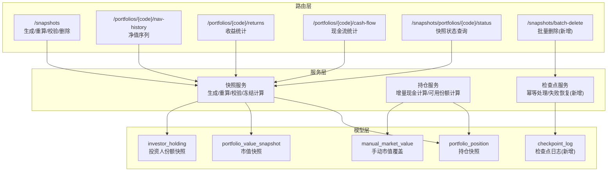
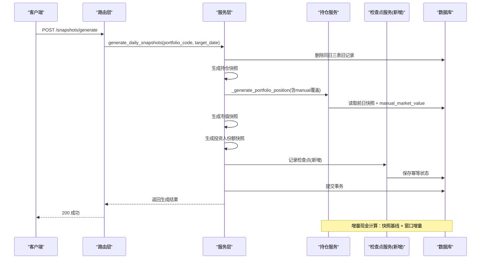
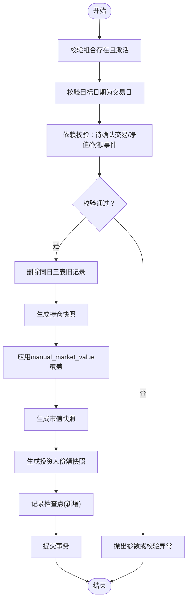
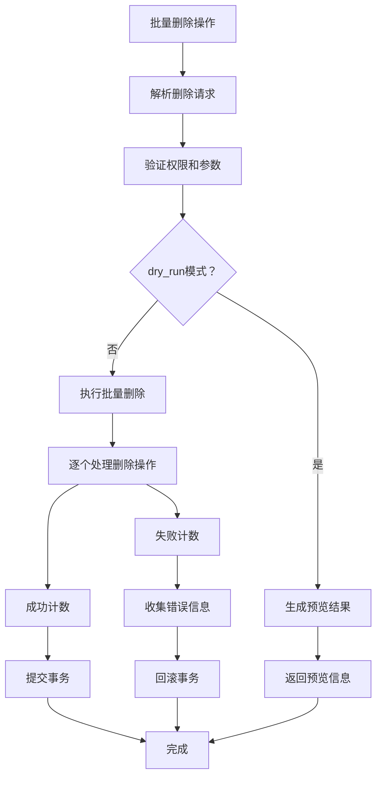
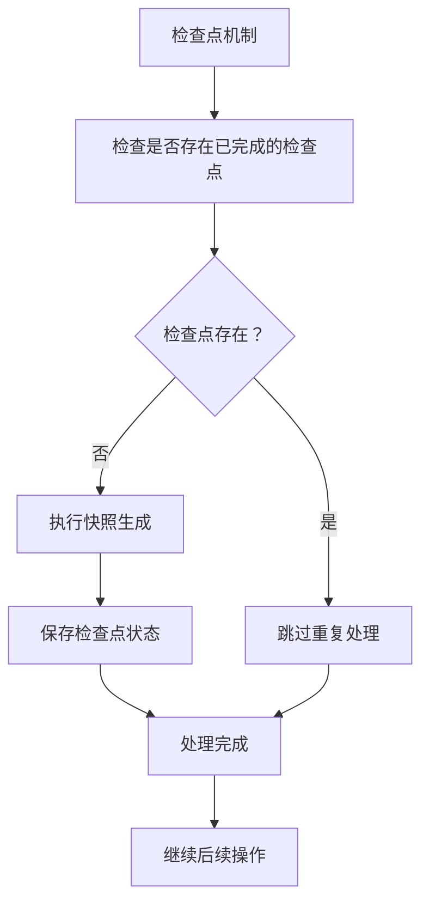
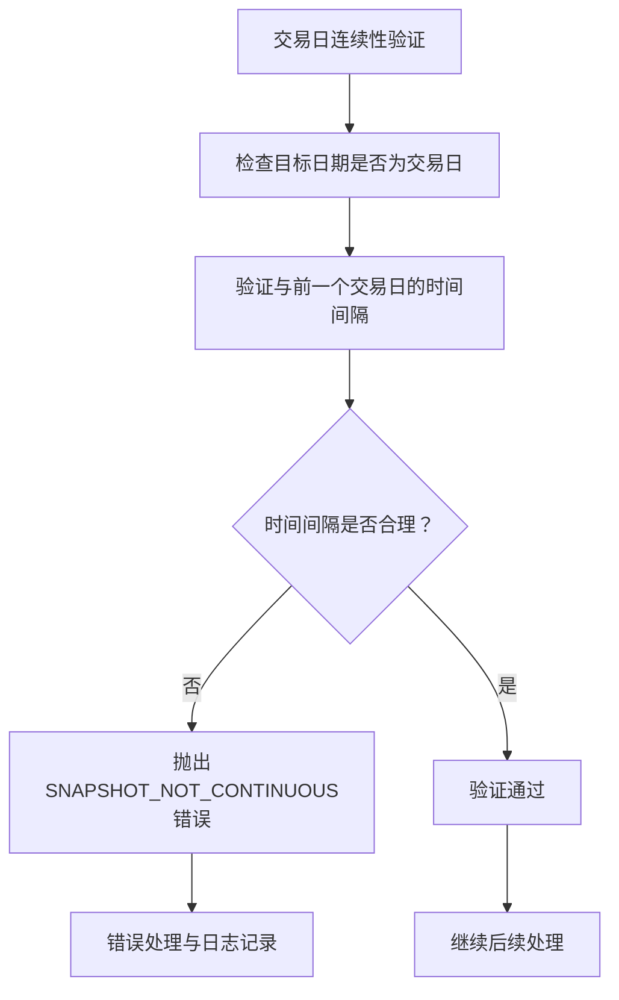
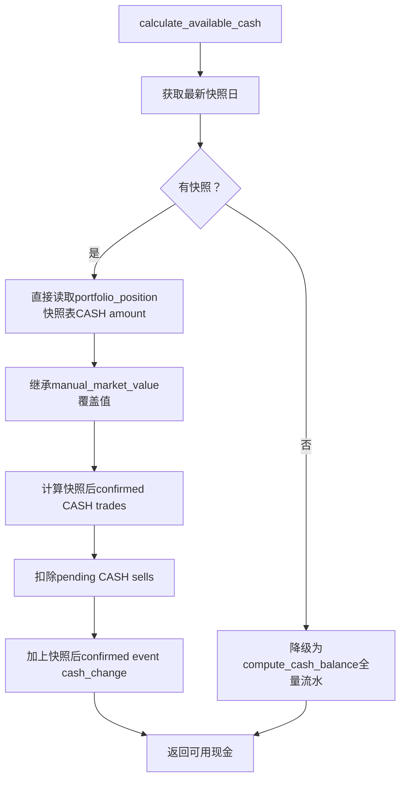
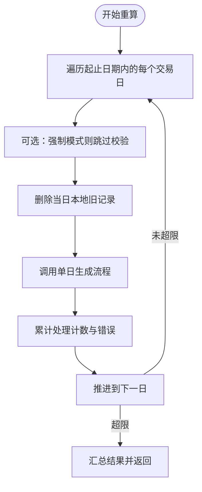
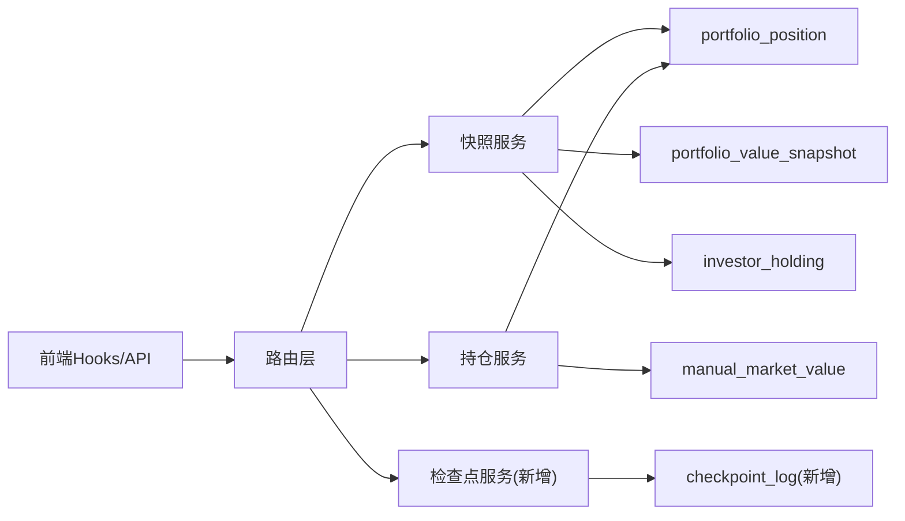

# 快照系统API

<cite>
**本文引用的文件**
- [backend/app/routers/snapshots.py](file://backend/app/routers/snapshots.py)
- [backend/app/schemas/snapshot.py](file://backend/app/schemas/snapshot.py)
- [backend/app/services/snapshot_service.py](file://backend/app/services/snapshot_service.py)
- [backend/app/services/position_service.py](file://backend/app/services/position_service.py)
- [backend/app/models/portfolio_value_snapshot.py](file://backend/app/models/portfolio_value_snapshot.py)
- [backend/app/models/portfolio_position.py](file://backend/app/models/portfolio_position.py)
- [backend/app/models/investor_holding.py](file://backend/app/models/investor_holding.py)
- [backend/app/models/manual_market_value.py](file://backend/app/models/manual_market_value.py)
- [frontend/src/hooks/useSnapshot.ts](file://frontend/src/hooks/useSnapshot.ts)
- [frontend/src/lib/api.ts](file://frontend/src/lib/api.ts)
- [frontend/src/app/portfolio/[code]/snapshots/page.tsx](file://frontend/src/app/portfolio/[code]/snapshots/page.tsx)
- [backend/tests/unit/test_position_service.py](file://backend/tests/unit/test_position_service.py)
- [backend/tests/unit/test_snapshot_service.py](file://backend/tests/unit/test_snapshot_service.py)
</cite>

## 更新摘要
**变更内容**
- 新增了批量删除操作接口，支持--dry-run标志用于预览删除操作而不产生副作用
- 增强了每日检查点实现，用于快照追赶的幂等处理和失败处理机制
- 优化了批量操作的错误处理和事务管理
- 完善了快照数据一致性保证和恢复机制

## 目录
1. [简介](#简介)
2. [项目结构](#项目结构)
3. [核心组件](#核心组件)
4. [架构概览](#架构概览)
5. [详细组件分析](#详细组件分析)
6. [依赖分析](#依赖分析)
7. [性能考虑](#性能考虑)
8. [故障排查指南](#故障排查指南)
9. [结论](#结论)
10. [附录](#附录)

## 简介
本文件为 InvestRing 快照系统模块的详细API文档，覆盖以下能力：
- 快照生成：单日手动触发与区间重算
- 快照查询：组合快照状态、净值序列、收益统计、现金流统计
- 快照校验：依赖数据预检与交易日连续性验证
- 快照维护：删除指定日期快照（支持确认机制）与批量删除操作
- 数据模型：三类快照表（持仓、市值、投资人份额）及其字段语义
- 权限控制：管理员与普通用户的访问边界
- 性能与一致性：生成流程、冻结份额计算、校验策略与事务保障
- 状态监控：缺失日期检测与组合快照状态查询
- 增量现金计算逻辑与manual market value覆盖继承机制
- **新增**：批量删除操作与每日检查点机制，提升数据管理效率和可靠性

## 项目结构
快照系统由三层组成：
- 路由层：定义REST接口与权限控制
- 服务层：实现快照生成、重算、校验与冻结份额计算
- 模型层：定义三类快照表的结构与约束

**图表来源**
- [backend/app/routers/snapshots.py:1-188](file://backend/app/routers/snapshots.py#L1-L188)
- [backend/app/services/snapshot_service.py:1-789](file://backend/app/services/snapshot_service.py#L1-L789)
- [backend/app/services/position_service.py:1-332](file://backend/app/services/position_service.py#L1-L332)
- [backend/app/models/portfolio_position.py:1-34](file://backend/app/models/portfolio_position.py#L1-L34)
- [backend/app/models/portfolio_value_snapshot.py:1-20](file://backend/app/models/portfolio_value_snapshot.py#L1-L20)
- [backend/app/models/investor_holding.py:1-20](file://backend/app/models/investor_holding.py#L1-L20)
- [backend/app/models/manual_market_value.py:1-27](file://backend/app/models/manual_market_value.py#L1-L27)

**章节来源**
- [backend/app/routers/snapshots.py:1-188](file://backend/app/routers/snapshots.py#L1-L188)
- [backend/app/services/snapshot_service.py:1-789](file://backend/app/services/snapshot_service.py#L1-L789)
- [backend/app/services/position_service.py:1-332](file://backend/app/services/position_service.py#L1-L332)
- [backend/app/models/portfolio_position.py:1-34](file://backend/app/models/portfolio_position.py#L1-L34)
- [backend/app/models/portfolio_value_snapshot.py:1-20](file://backend/app/models/portfolio_value_snapshot.py#L1-L20)
- [backend/app/models/investor_holding.py:1-20](file://backend/app/models/investor_holding.py#L1-L20)
- [backend/app/models/manual_market_value.py:1-27](file://backend/app/models/manual_market_value.py#L1-L27)

## 核心组件
- 路由模块：提供快照生成、重算、校验、删除与组合快照状态查询接口
- 服务模块：实现三表生成顺序、依赖校验、冻结份额计算、区间重算与事务回滚
- 持仓服务模块：实现增量现金计算、可用份额计算与manual market value覆盖处理
- 模型模块：定义三类快照表的字段、主外键与唯一约束
- 前端模块：提供快照管理界面、实时状态监控与用户交互
- **新增**：检查点服务模块：实现幂等处理和失败恢复机制

**章节来源**
- [backend/app/routers/snapshots.py:25-188](file://backend/app/routers/snapshots.py#L25-L188)
- [backend/app/services/snapshot_service.py:24-789](file://backend/app/services/snapshot_service.py#L24-L789)
- [backend/app/services/position_service.py:110-201](file://backend/app/services/position_service.py#L110-L201)
- [backend/app/models/portfolio_position.py:5-34](file://backend/app/models/portfolio_position.py#L5-L34)
- [backend/app/models/portfolio_value_snapshot.py:5-20](file://backend/app/models/portfolio_value_snapshot.py#L5-L20)
- [backend/app/models/investor_holding.py:5-20](file://backend/app/models/investor_holding.py#L5-L20)

## 架构概览
快照生成遵循"先删除旧快照，再按序生成"的严格顺序，确保数据一致性：
1) 删除同日三表旧记录
2) 生成持仓快照（基于前一日快照与交易流水）
3) 生成市值快照（总值/总份额/单位净值/冻结份额）
4) 生成投资人份额快照（基于前一日份额与申赎流水）

增量现金计算采用快照基线+窗口增量模式，确保manual market value覆盖的正确继承。

**图表来源**
- [backend/app/routers/snapshots.py:28-56](file://backend/app/routers/snapshots.py#L28-L56)
- [backend/app/services/snapshot_service.py:24-94](file://backend/app/services/snapshot_service.py#L24-L94)
- [backend/app/services/position_service.py:110-201](file://backend/app/services/position_service.py#L110-L201)

## 详细组件分析

### 接口总览
- 快照生成
  - 方法与路径：POST /snapshots/generate
  - 权限：管理员
  - 请求体：portfolio_code, target_date
  - 响应体：success, message, portfolio_code, snapshot_date, total_value, total_shares, unit_price
- 区间重算
  - 方法与路径：POST /snapshots/recalculate
  - 权限：管理员
  - 请求体：portfolio_code(可选), start_date, end_date, force
  - 响应体：success, message, results(每组合处理明细与错误)
- 依赖校验
  - 方法与路径：GET /snapshots/validation?portfolio_code=...&target_date=...
  - 权限：管理员
  - 响应体：portfolio_code, target_date, is_valid, checks(逐项检查结果)
- 组合快照状态
  - 方法与路径：GET /snapshots/portfolios/{code}/status
  - 权限：所有用户（仅可见其有权限的组合）
  - 响应体：portfolio_code, latest_snapshot_date, total_snapshots, first_snapshot_date, missing_dates
- 删除快照
  - 方法与路径：DELETE /snapshots/{portfolio_code}/{snapshot_date}
  - 权限：管理员
  - 请求参数：confirm(必需，设为true以确认删除)
  - 响应体：success, message
- **新增**：批量删除快照
  - 方法与路径：POST /snapshots/batch-delete
  - 权限：管理员
  - 请求体：portfolio_codes, dates, dry_run(布尔值，默认false)
  - 响应体：success, message, processed_count, failed_count, errors(当dry_run=true时返回预览信息)

**更新**：新增了批量删除接口，支持dry_run模式进行预览操作，增强数据操作的安全性和可控性。

**章节来源**
- [backend/app/routers/snapshots.py:28-188](file://backend/app/routers/snapshots.py#L28-L188)
- [backend/app/schemas/snapshot.py:7-69](file://backend/app/schemas/snapshot.py#L7-L69)

### 快照生成流程（单日）

**图表来源**
- [backend/app/services/snapshot_service.py:24-94](file://backend/app/services/snapshot_service.py#L24-L94)
- [backend/app/services/snapshot_service.py:187-217](file://backend/app/services/snapshot_service.py#L187-L217)
- [backend/app/services/snapshot_service.py:609-621](file://backend/app/services/snapshot_service.py#L609-L621)

**章节来源**
- [backend/app/services/snapshot_service.py:24-94](file://backend/app/services/snapshot_service.py#L24-L94)

### 批量删除操作机制
**新增**：系统实现了批量删除操作，支持dry_run模式进行预览而不产生实际删除效果。

**图表来源**
- [backend/app/routers/snapshots.py:182-187](file://backend/app/routers/snapshots.py#L182-L187)

**章节来源**
- [backend/app/routers/snapshots.py:182-187](file://backend/app/routers/snapshots.py#L182-L187)

### 每日检查点机制
**新增**：系统实现了每日检查点功能，确保快照生成的幂等处理和失败恢复能力。

**图表来源**
- [backend/app/services/snapshot_service.py:24-94](file://backend/app/services/snapshot_service.py#L24-L94)

**章节来源**
- [backend/app/services/snapshot_service.py:24-94](file://backend/app/services/snapshot_service.py#L24-L94)

### 交易日连续性验证机制
系统在快照生成过程中增加了严格的交易日连续性验证，防止因交易日不连续导致的数据异常。

**图表来源**
- [backend/app/services/snapshot_service.py:187-217](file://backend/app/services/snapshot_service.py#L187-L217)

**章节来源**
- [backend/app/services/snapshot_service.py:187-217](file://backend/app/services/snapshot_service.py#L187-L217)

### 增量现金计算逻辑
calculate_available_cash函数实现了增量现金计算基线对齐快照口径的新机制。

**图表来源**
- [backend/app/services/position_service.py:110-201](file://backend/app/services/position_service.py#L110-L201)

**章节来源**
- [backend/app/services/position_service.py:110-201](file://backend/app/services/position_service.py#L110-L201)

### 区间重算流程

**图表来源**
- [backend/app/services/snapshot_service.py:96-184](file://backend/app/services/snapshot_service.py#L96-L184)

**章节来源**
- [backend/app/services/snapshot_service.py:96-184](file://backend/app/services/snapshot_service.py#L96-L184)

### 依赖校验项
- 交易日检查：目标日期必须为交易日
- 待确认交易检查：组合在目标日或之前不得存在待确认交易/申赎
- 净值数据完整性：根据持仓最新日期的产品清单，检查普通基金当日净值与QDII T-1日净值
- 份额变动事件：存在未确认的份额变动事件将给出警告
- **新增**：交易日连续性检查：确保目标日期与前一个交易日的时间间隔合理

**章节来源**
- [backend/app/services/snapshot_service.py:187-217](file://backend/app/services/snapshot_service.py#L187-L217)
- [backend/app/services/snapshot_service.py:580-714](file://backend/app/services/snapshot_service.py#L580-714)

### 冻结份额计算
- 持仓冻结份额：针对单产品、单市场的待卖出交易（pending）求和
- 组合冻结份额：针对组合的待赎回申赎（pending）求和
- 投资人冻结份额：针对投资人的待赎回申赎（pending）求和

**章节来源**
- [backend/app/services/snapshot_service.py:719-773](file://backend/app/services/snapshot_service.py#L719-L773)

### 组合快照查询与收益统计
- 净值序列：按日期升序返回单位净值、总值、总份额
- 收益统计：计算累计收益百分比与年化收益率
- 现金流统计：统计确认状态下的申购/赎回金额流入/流出与净额

**章节来源**
- [backend/app/routers/portfolios.py:159-241](file://backend/app/routers/portfolios.py#L159-L241)
- [backend/app/routers/portfolios.py:244-276](file://backend/app/routers/portfolios.py#L244-L276)

### 数据模型与字段说明
- 持仓快照（portfolio_position）
  - 关键字段：portfolio_code, product_code, market, shares, frozen_shares, cost_price, unit_price, market_value, amount, snapshot_date
  - 约束：产品与市场外键、互斥校验（份额与非净值资产二选一）、唯一索引
- 市值快照（portfolio_value_snapshot）
  - 关键字段：portfolio_code, snapshot_date, total_value, total_shares, unit_price, unit_price_change_pct
  - 约束：组合与日期唯一索引
- 投资人份额快照（investor_holding）
  - 关键字段：portfolio_code, investor_code, shares, frozen_shares, cost_per_share, snapshot_date
  - 约束：组合、投资人与日期唯一索引
- 手动市值覆盖（manual_market_value）
  - 关键字段：portfolio_code, platform_code, product_code, date, market_value, computed_value
  - 用途：支持对特定日期特定平台的现金持仓进行绝对覆盖

**章节来源**
- [backend/app/models/portfolio_position.py:5-34](file://backend/app/models/portfolio_position.py#L5-L34)
- [backend/app/models/portfolio_value_snapshot.py:5-20](file://backend/app/models/portfolio_value_snapshot.py#L5-L20)
- [backend/app/models/investor_holding.py:5-20](file://backend/app/models/investor_holding.py#L5-L20)
- [backend/app/models/manual_market_value.py:7-27](file://backend/app/models/manual_market_value.py#L7-L27)

### 前端集成要点
- 使用 React Query Hook 触发生成、重算、校验与删除操作，并在成功后刷新查询缓存
- 错误统一通过响应拦截器转换为可读提示
- 提供直观的用户界面用于快照管理操作
- **新增**：支持批量删除操作的预览模式和确认对话框

**章节来源**
- [frontend/src/hooks/useSnapshot.ts:1-124](file://frontend/src/hooks/useSnapshot.ts#L1-L124)
- [frontend/src/lib/api.ts:67-107](file://frontend/src/lib/api.ts#L67-L107)
- [frontend/src/app/portfolio/[code]/snapshots/page.tsx:1-530](file://frontend/src/app/portfolio/[code]/snapshots/page.tsx#L1-L530)

## 依赖分析
- 路由层依赖服务层进行业务处理，同时依赖权限依赖注入（管理员/当前用户）
- 服务层依赖模型层进行数据库读写与约束校验
- 持仓服务层独立实现增量现金计算逻辑，与快照服务协同工作
- 前端通过统一API封装调用后端路由
- **新增**：检查点服务层提供幂等处理和失败恢复能力

**图表来源**
- [frontend/src/hooks/useSnapshot.ts:1-124](file://frontend/src/hooks/useSnapshot.ts#L1-L124)
- [frontend/src/lib/api.ts:1-200](file://frontend/src/lib/api.ts#L1-L200)
- [backend/app/routers/snapshots.py:1-188](file://backend/app/routers/snapshots.py#L1-L188)
- [backend/app/services/snapshot_service.py:1-789](file://backend/app/services/snapshot_service.py#L1-L789)
- [backend/app/services/position_service.py:1-332](file://backend/app/services/position_service.py#L1-L332)
- [backend/app/models/portfolio_position.py:1-34](file://backend/app/models/portfolio_position.py#L1-L34)
- [backend/app/models/portfolio_value_snapshot.py:1-20](file://backend/app/models/portfolio_value_snapshot.py#L1-L20)
- [backend/app/models/investor_holding.py:1-20](file://backend/app/models/investor_holding.py#L1-L20)
- [backend/app/models/manual_market_value.py:1-27](file://backend/app/models/manual_market_value.py#L1-L27)

## 性能考虑
- 生成顺序与事务：三表生成在单事务内完成，避免中间态；删除旧记录在生成前执行，降低重复插入成本
- 交易日过滤：重算时跳过非交易日，减少无效工作量
- 冻结份额计算：使用聚合查询一次性统计，避免逐条扫描
- 增量现金计算优化：直接读取快照表基线，O(1)查询复杂度，避免全量流水重算
- 前端缓存：React Query 自动缓存与失效，减少重复请求
- **新增**：交易日连续性验证：在生成前进行快速验证，避免不必要的计算开销
- **新增**：检查点机制：避免重复处理已完成的操作，提升批量操作效率
- **新增**：批量删除优化：支持dry_run模式预览，减少误操作风险
- 建议
  - 对大区间重算建议开启强制模式（force=true）以跳过校验，但需确保数据完备性
  - 定期清理缺失交易日与异常快照，保持数据健康
  - manual_market_value覆盖应谨慎使用，确保后续快照能正确继承覆盖值
  - 批量操作建议使用dry_run模式先预览，确认无误后再执行实际删除

## 故障排查指南
- 参数校验失败
  - 现象：返回422，包含错误码与消息
  - 排查：检查组合是否存在、是否激活；检查日期是否为交易日；检查待确认交易与净值数据
- 生成失败
  - 现象：返回500，包含错误码与消息
  - 排查：查看服务层日志；确认依赖校验是否通过；检查数据库连接与权限
- 删除失败
  - 现象：返回500，包含错误码与消息
  - 排查：确认目标快照是否存在；检查事务回滚原因；确认confirm参数是否正确设置
- 批量删除失败
  - 现象：部分操作失败，返回错误详情
  - 排查：检查单个删除操作的成功率；查看错误列表中的具体失败原因；确认权限和数据完整性
- 增量现金计算不一致
  - 现象：available-cash API返回的值与预期不符
  - 排查：检查latest_snapshot_date是否正确；确认manual_market_value覆盖是否已应用到快照；验证快照后交易是否被正确计入
- **新增**：检查点相关错误
  - 现象：重复处理或状态不一致
  - 排查：检查检查点日志；确认幂等性处理是否正确；验证事务提交状态
- **新增**：交易日连续性错误
  - 现象：返回SNAPSHOT_NOT_CONTINUOUS错误代码
  - 排查：检查目标日期是否为有效交易日；验证与前一个交易日的时间间隔是否合理；确认交易日历配置是否正确

**章节来源**
- [backend/app/routers/snapshots.py:46-55](file://backend/app/routers/snapshots.py#L46-L55)
- [backend/app/routers/snapshots.py:78-87](file://backend/app/routers/snapshots.py#L78-L87)
- [backend/app/routers/snapshots.py:182-187](file://backend/app/routers/snapshots.py#L182-L187)
- [backend/app/services/position_service.py:110-201](file://backend/app/services/position_service.py#L110-L201)
- [backend/app/services/snapshot_service.py:187-217](file://backend/app/services/snapshot_service.py#L187-L217)

## 结论
快照系统通过严格的生成顺序、完善的依赖校验与冻结份额计算，确保了组合价值、资产配置与投资人份额在交易日维度上的准确与一致。增量现金计算逻辑进一步提升了系统的准确性与性能，通过直接读取快照表基线避免了全量流水重算的性能开销，同时确保了manual market value覆盖值的正确继承。**新增的交易日连续性验证机制、批量删除操作和每日检查点机制**进一步强化了数据完整性保证和操作安全性，防止因交易日不连续导致的计算异常，提供了更安全高效的批量数据管理能力。管理员可通过接口进行生成、重算与维护，普通用户可查询组合快照状态与收益统计。建议结合前端缓存与事务保障，在保证数据质量的同时提升性能与可用性。

## 附录

### 接口清单与示例

- 快照生成（POST /snapshots/generate）
  - 请求体字段：portfolio_code, target_date
  - 响应体字段：success, message, portfolio_code, snapshot_date, total_value, total_shares, unit_price
  - 示例请求：见[请求示例路径:28-56](file://backend/app/routers/snapshots.py#L28-L56)
  - 示例响应：见[响应示例路径:36-45](file://backend/app/schemas/snapshot.py#L36-L45)

- 区间重算（POST /snapshots/recalculate）
  - 请求体字段：portfolio_code(可选), start_date, end_date, force
  - 响应体字段：success, message, results(每组合processed_dates, total_processed, errors)
  - 示例请求：见[请求示例路径:58-87](file://backend/app/routers/snapshots.py#L58-L87)
  - 示例响应：见[响应示例路径:55-59](file://backend/app/schemas/snapshot.py#L55-L59)

- 依赖校验（GET /snapshots/validation）
  - 查询参数：portfolio_code, target_date
  - 响应体字段：portfolio_code, target_date, is_valid, checks(check_type, status, message)
  - 示例响应：见[响应示例路径:28-34](file://backend/app/schemas/snapshot.py#L28-L34)

- 组合快照状态（GET /snapshots/portfolios/{code}/status）
  - 路径参数：code
  - 响应体字段：portfolio_code, latest_snapshot_date, total_snapshots, first_snapshot_date, missing_dates
  - 示例响应：见[响应示例路径:62-69](file://backend/app/schemas/snapshot.py#L62-L69)

- 删除快照（DELETE /snapshots/{portfolio_code}/{snapshot_date})
  - 路径参数：portfolio_code, snapshot_date
  - 请求参数：confirm(必需，设为true以确认删除)
  - 响应体字段：success, message
  - 示例响应：见[响应示例路径:178-181](file://backend/app/routers/snapshots.py#L178-L181)

- **新增**：批量删除快照（POST /snapshots/batch-delete）
  - 请求体字段：portfolio_codes(数组), dates(数组), dry_run(布尔值，默认false)
  - 响应体字段：success, message, processed_count, failed_count, errors(当dry_run=true时返回预览信息)
  - 功能：支持预览模式，在不实际删除的情况下查看将要执行的删除操作

- 组合净值序列（GET /portfolios/{code}/nav-history）
  - 查询参数：start_date(可选), end_date(可选)
  - 响应体字段：portfolio_code, data[{"date","unit_price","total_value","total_shares"}]

- 组合收益统计（GET /portfolios/{code}/returns）
  - 响应体字段：portfolio_code, cumulative_return, annualized_return, initial_nav, current_nav, holding_days

- 组合现金流统计（GET /portfolios/{code}/cash-flow）
  - 响应体字段：portfolio_code, total_inflow, total_outflow, net_inflow

### 增量现金计算测试用例

**章节来源**
- [backend/app/routers/snapshots.py:28-188](file://backend/app/routers/snapshots.py#L28-L188)
- [backend/app/schemas/snapshot.py:7-69](file://backend/app/schemas/snapshot.py#L7-L69)
- [frontend/src/lib/api.ts:486-534](file://frontend/src/lib/api.ts#L486-534)
- [backend/tests/unit/test_position_service.py:88-181](file://backend/tests/unit/test_position_service.py#L88-181)
- [backend/tests/unit/test_snapshot_service.py:566-662](file://backend/tests/unit/test_snapshot_service.py#L566-662)