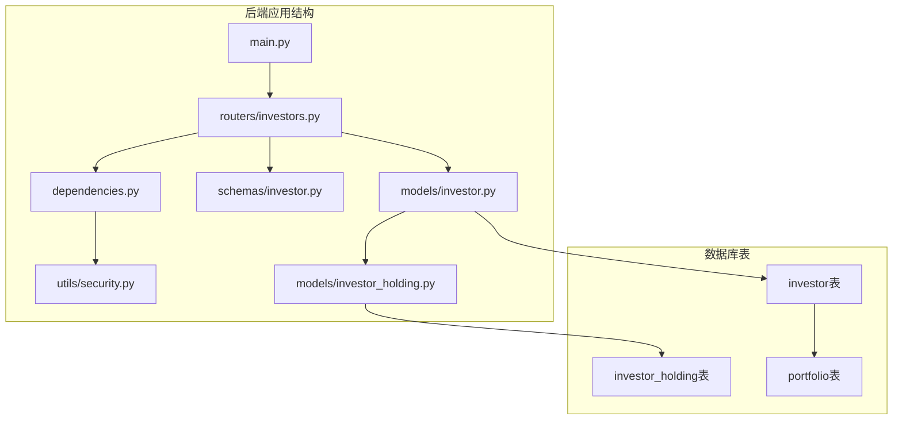
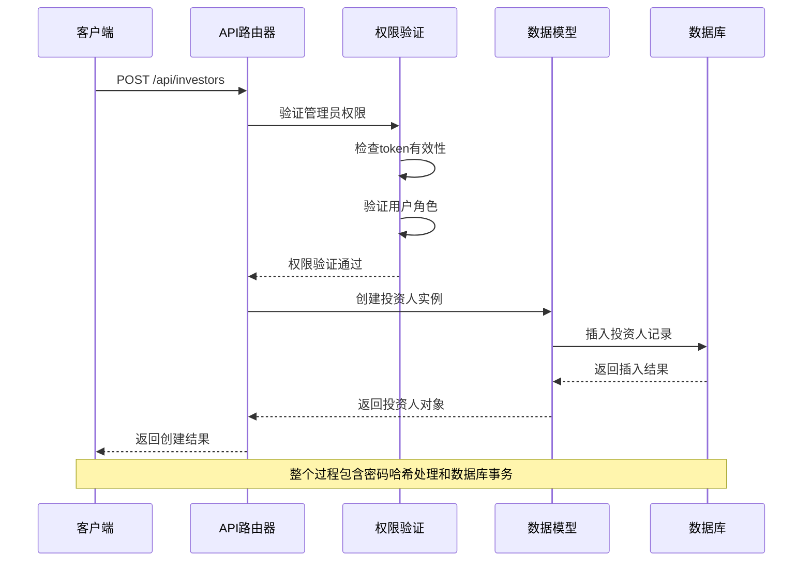
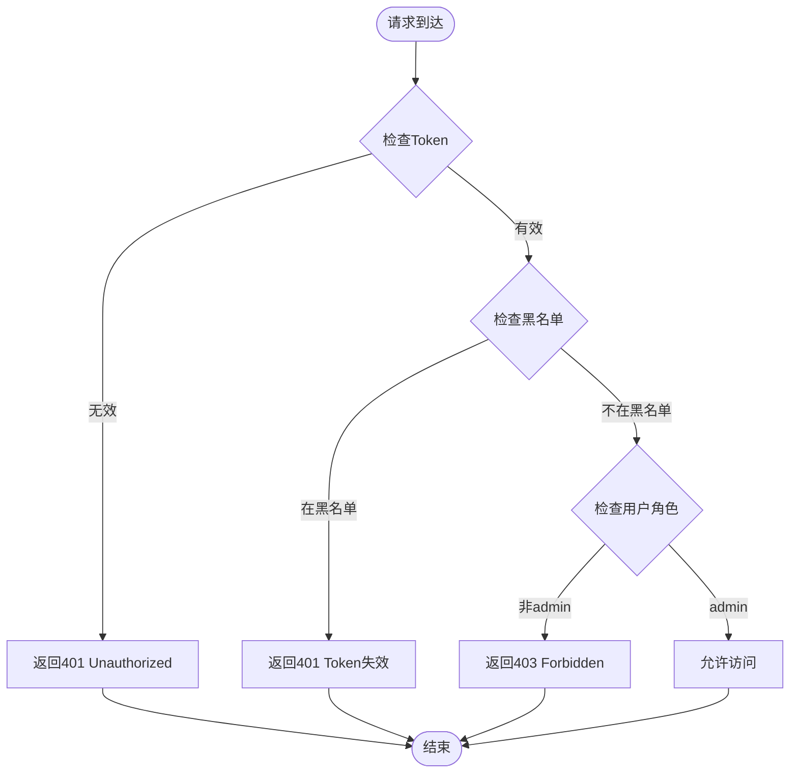
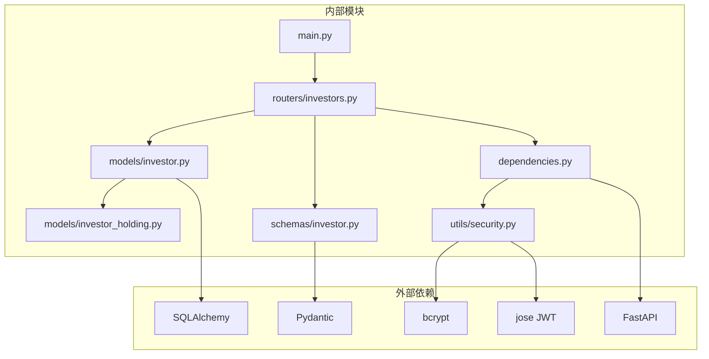
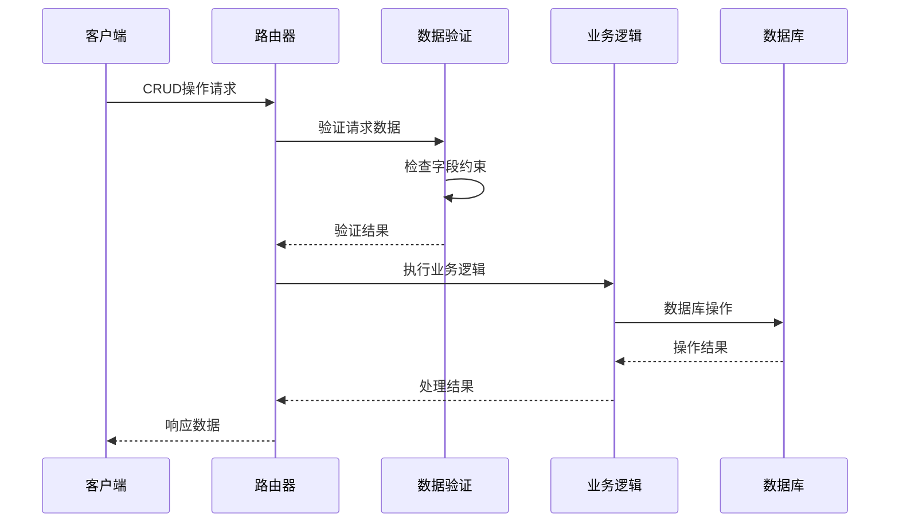

# 投资人管理API

<cite>
**本文档引用的文件**
- [investors.py](file://backend/app/routers/investors.py)
- [investor.py](file://backend/app/models/investor.py)
- [investor.py](file://backend/app/schemas/investor.py)
- [dependencies.py](file://backend/app/dependencies.py)
- [security.py](file://backend/app/utils/security.py)
- [main.py](file://backend/app/main.py)
- [investor_holding.py](file://backend/app/models/investor_holding.py)
- [04-后端开发.md](file://Docs/04-后端开发.md)
- [02-数据库设计.md](file://Docs/02-数据库设计.md)
</cite>

## 目录
1. [简介](#简介)
2. [项目结构](#项目结构)
3. [核心组件](#核心组件)
4. [架构概览](#架构概览)
5. [详细组件分析](#详细组件分析)
6. [依赖分析](#依赖分析)
7. [性能考虑](#性能考虑)
8. [故障排除指南](#故障排除指南)
9. [结论](#结论)

## 简介
InvestRing 投资人管理模块提供了完整的投资人CRUD操作、状态管理、权限分配等相关接口。该模块支持管理员对投资人进行创建、更新、删除、查询等基本操作，同时实现了基于角色的权限控制机制。

## 项目结构
投资人管理模块位于后端应用的路由层，采用FastAPI框架构建RESTful API接口。

**图表来源**
- [main.py:32-48](file://backend/app/main.py#L32-L48)
- [investors.py:1-120](file://backend/app/routers/investors.py#L1-L120)

**章节来源**
- [main.py:17-48](file://backend/app/main.py#L17-L48)

## 核心组件
投资人管理模块的核心组件包括：

### 路由器组件
- **investors.py**: 定义了投资人管理的所有API接口
- **权限依赖**: 提供基于角色的权限控制机制

### 数据模型组件
- **Investor模型**: 定义投资人表结构和字段约束
- **InvestorHolding模型**: 管理投资人与组合的持有关系

### 数据验证组件
- **InvestorBase**: 基础投资人数据结构
- **InvestorCreate**: 创建投资人数据结构
- **InvestorUpdate**: 更新投资人数据结构
- **InvestorResponse**: 响应数据结构

**章节来源**
- [investors.py:1-120](file://backend/app/routers/investors.py#L1-L120)
- [investor.py:5-17](file://backend/app/models/investor.py#L5-L17)
- [investor.py:6-32](file://backend/app/schemas/investor.py#L6-L32)

## 架构概览
投资人管理模块采用分层架构设计，实现了清晰的关注点分离。

**图表来源**
- [investors.py:32-53](file://backend/app/routers/investors.py#L32-L53)
- [dependencies.py:114-129](file://backend/app/dependencies.py#L114-L129)

## 详细组件分析

### 投资人CRUD接口

#### 创建投资人
**HTTP方法**: POST  
**URL模式**: `/api/investors`  
**权限要求**: 管理员身份  
**请求头**: Authorization: Bearer {token}

**请求体结构**:
- code: string (投资人编码)
- name: string (姓名)
- role: string (角色，默认: viewer)
- phone: string (电话, 可选)
- email: string (邮箱, 可选)
- password: string (密码)

**响应结构**:
- code: string
- name: string
- role: string
- phone: string
- email: string
- created_at: datetime

**业务规则**:
- 密码使用bcrypt哈希存储
- 默认角色为viewer
- 投资人编码必须唯一

**章节来源**
- [investors.py:32-53](file://backend/app/routers/investors.py#L32-L53)
- [investor.py:14-16](file://backend/app/models/investor.py#L14-L16)

#### 获取投资人列表
**HTTP方法**: GET  
**URL模式**: `/api/investors`  
**权限要求**: 管理员身份  
**查询参数**: 
- page: int (页码, 默认: 1)
- page_size: int (页面大小, 默认: 20)

**响应结构**:
- items: Array (投资人列表)
- total: int (总数)
- page: int (当前页)
- page_size: int (页面大小)

**章节来源**
- [investors.py:14-29](file://backend/app/routers/investors.py#L14-L29)

#### 获取投资人详情
**HTTP方法**: GET  
**URL模式**: `/api/investors/{code}`  
**权限要求**: 管理员身份  
**路径参数**: code (投资人编码)

**响应结构**:
- code: string
- name: string
- role: string
- phone: string
- email: string
- last_login_at: datetime
- created_at: datetime
- updated_at: datetime

**章节来源**
- [investors.py:56-65](file://backend/app/routers/investors.py#L56-L65)

#### 更新投资人
**HTTP方法**: PUT  
**URL模式**: `/api/investors/{code}`  
**权限要求**: 管理员身份  
**路径参数**: code (投资人编码)

**请求体结构**:
- name: string (姓名, 可选)
- role: string (角色, 可选)
- phone: string (电话, 可选)
- email: string (邮箱, 可选)
- password: string (密码, 可选)

**响应结构**:
- code: string
- name: string
- role: string
- phone: string
- email: string
- last_login_at: datetime
- created_at: datetime
- updated_at: datetime

**业务规则**:
- 密码可选更新，如提供则进行哈希处理
- 支持部分字段更新

**章节来源**
- [investors.py:68-88](file://backend/app/routers/investors.py#L68-L88)

#### 删除投资人
**HTTP方法**: DELETE  
**URL模式**: `/api/investors/{code}`  
**权限要求**: 管理员身份  
**路径参数**: code (投资人编码)

**响应结构**:
- message: string (操作结果)

**业务规则**:
- 删除前检查投资人是否仍持有份额
- 如投资人持有份额，返回422错误
- 支持物理删除投资人记录

**章节来源**
- [investors.py:91-119](file://backend/app/routers/investors.py#L91-L119)

### 权限控制机制

#### 角色定义
- **admin**: 管理员角色，拥有所有权限
- **viewer**: 普通用户角色，仅具有查询权限

#### 权限验证流程

**图表来源**
- [dependencies.py:49-129](file://backend/app/dependencies.py#L49-L129)

**章节来源**
- [dependencies.py:114-129](file://backend/app/dependencies.py#L114-L129)

### 数据验证规则

#### 投资人字段约束
- **code**: 主键，最大20字符
- **name**: 必填，最大50字符
- **role**: 默认viewer，最大20字符
- **phone**: 最大20字符
- **email**: 最大100字符
- **password_hash**: 必填，最大255字符

#### 业务约束条件
- 投资人编码必须唯一
- 密码必须使用bcrypt哈希存储
- 删除投资人前必须清空其持有的所有份额
- 支持部分字段更新，未提供的字段保持不变

**章节来源**
- [investor.py:8-16](file://backend/app/models/investor.py#L8-L16)
- [investor.py:6-12](file://backend/app/schemas/investor.py#L6-L12)

## 依赖分析

### 组件依赖关系

**图表来源**
- [main.py:1-53](file://backend/app/main.py#L1-L53)
- [investors.py:1-10](file://backend/app/routers/investors.py#L1-L10)

### 数据流分析
投资人管理的数据流遵循标准的CRUD模式：

**图表来源**
- [investors.py:14-119](file://backend/app/routers/investors.py#L14-L119)

**章节来源**
- [investors.py:1-120](file://backend/app/routers/investors.py#L1-L120)

## 性能考虑
投资人管理模块的性能特点：

### 数据库优化
- 使用SQLAlchemy ORM进行高效的数据访问
- 投资人表建立索引优化查询性能
- 支持分页查询避免大数据集加载

### 缓存策略
- 密码使用bcrypt哈希，支持快速验证
- JWT令牌验证结果可缓存减少重复计算

### 并发处理
- 支持多用户并发访问
- 数据库连接池管理提高并发性能

## 故障排除指南

### 常见错误及解决方案

#### 401 Unauthorized (未授权)
**原因**: 缺少有效的认证token或token无效
**解决方案**: 
- 确保请求头包含正确的Authorization: Bearer {token}
- 检查token是否过期
- 验证token未被加入黑名单

#### 403 Forbidden (权限不足)
**原因**: 用户不是管理员角色
**解决方案**:
- 确保用户角色为admin
- 检查用户权限配置

#### 404 Not Found (资源不存在)
**原因**: 投资人不存在或已被删除
**解决方案**:
- 验证投资人编码是否正确
- 检查数据库中是否存在该记录

#### 422 Unprocessable Entity (请求处理失败)
**原因**: 投资人仍有持有份额
**解决方案**:
- 先处理所有份额赎回
- 确保投资人持有份额为0

#### 400 Bad Request (请求错误)
**原因**: 投资人编码已存在
**解决方案**:
- 更换唯一的投资人编码
- 检查现有用户列表

**章节来源**
- [investors.py:38-40](file://backend/app/routers/investors.py#L38-L40)
- [investors.py:97-99](file://backend/app/routers/investors.py#L97-L99)
- [investors.py:108-115](file://backend/app/routers/investors.py#L108-L115)

## 结论
InvestRing 投资人管理模块提供了完整的企业级投资人管理功能，具备以下特点：

### 功能完整性
- 支持完整的CRUD操作
- 实现了基于角色的权限控制
- 提供了数据验证和业务约束
- 支持分页查询和条件筛选

### 安全性保障
- 使用JWT进行身份认证
- bcrypt密码哈希存储
- 管理员权限严格控制
- 支持token黑名单机制

### 可扩展性
- 模块化设计便于功能扩展
- 清晰的分层架构支持维护
- 标准化的API接口设计

该模块为InvestRing系统提供了坚实的投资人管理基础，支持家庭投资组合管理的各种业务场景。