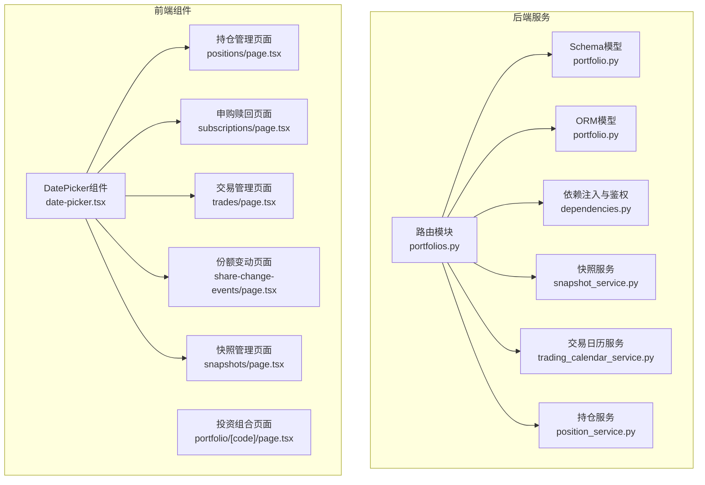
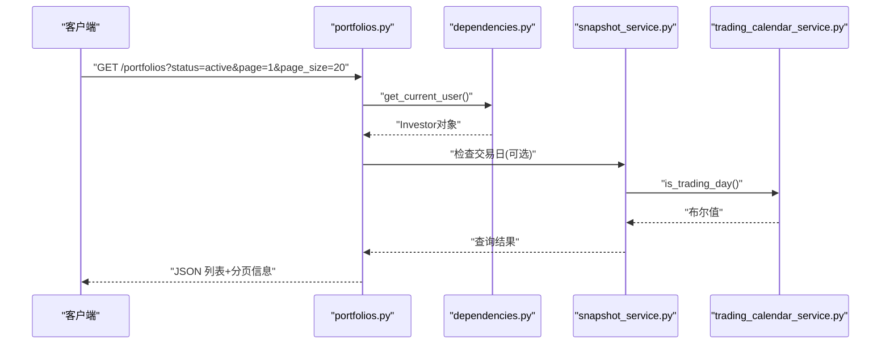
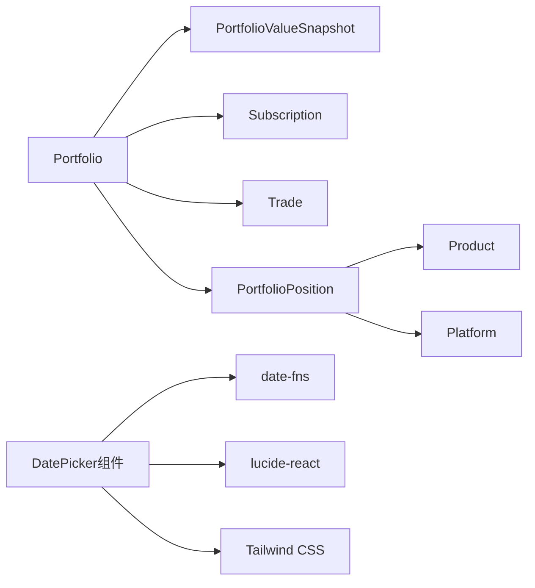

# 投资组合管理API

<cite>
**本文引用的文件**
- [backend/app/routers/portfolios.py](file://backend/app/routers/portfolios.py)
- [backend/app/schemas/portfolio.py](file://backend/app/schemas/portfolio.py)
- [backend/app/models/portfolio.py](file://backend/app/models/portfolio.py)
- [backend/app/models/portfolio_position.py](file://backend/app/models/portfolio_position.py)
- [backend/app/models/portfolio_value_snapshot.py](file://backend/app/models/portfolio_value_snapshot.py)
- [backend/app/models/subscription.py](file://backend/app/models/subscription.py)
- [backend/app/models/trade.py](file://backend/app/models/trade.py)
- [backend/app/models/investor.py](file://backend/app/models/investor.py)
- [backend/app/dependencies.py](file://backend/app/dependencies.py)
- [backend/app/schemas/position.py](file://backend/app/schemas/position.py)
- [backend/app/models/product.py](file://backend/app/models/product.py)
- [backend/app/models/platform.py](file://backend/app/models/platform.py)
- [backend/app/services/snapshot_service.py](file://backend/app/services/snapshot_service.py)
- [backend/app/services/trading_calendar_service.py](file://backend/app/services/trading_calendar_service.py)
- [frontend/src/components/ui/date-picker.tsx](file://frontend/src/components/ui/date-picker.tsx)
- [frontend/src/app/portfolio/[code]/page.tsx](file://frontend/src/app/portfolio/[code]/page.tsx)
- [frontend/src/app/portfolio/[code]/positions/page.tsx](file://frontend/src/app/portfolio/[code]/positions/page.tsx)
- [frontend/src/app/portfolio/[code]/subscriptions/page.tsx](file://frontend/src/app/portfolio/[code]/subscriptions/page.tsx)
- [frontend/src/app/portfolio/[code]/trades/page.tsx](file://frontend/src/app/portfolio/[code]/trades/page.tsx)
- [frontend/src/app/portfolio/[code]/share-change-events/page.tsx](file://frontend/src/app/portfolio/[code]/share-change-events/page.tsx)
- [frontend/src/app/portfolio/[code]/snapshots/page.tsx](file://frontend/src/app/portfolio/[code]/snapshots/page.tsx)
- [Docs/02-数据库设计.md](file://Docs/02-数据库设计.md)
- [Docs/03-业务流程设计.md](file://Docs/03-业务流程设计.md)
</cite>

## 更新摘要
**变更内容**
- 更新了持仓管理API响应字段，将amount统一改为cash_amount以提高语义清晰度
- 标准化了日期字段命名，使用value_date、calendar_date、price_date等明确字段名
- 改进了位置管理接口的数据一致性，确保所有日期相关字段遵循统一的命名规范
- 优化了现金金额字段的处理逻辑，提升API响应的可读性和维护性

## 目录
1. [简介](#简介)
2. [项目结构](#项目结构)
3. [核心组件](#核心组件)
4. [架构总览](#架构总览)
5. [详细组件分析](#详细组件分析)
6. [持仓管理API更新](#持仓管理api更新)
7. [依赖分析](#依赖分析)
8. [性能考虑](#性能考虑)
9. [故障排查指南](#故障排查指南)
10. [结论](#结论)
11. [附录](#附录)

## 简介
本文件为 InvestRing 投资组合管理模块的详细API文档，覆盖以下主题：
- 投资组合的CRUD操作与状态管理（草稿/启用/关闭）
- 组合配置更新、成员管理（通过相关联的订阅与交易）
- 高级查询：列表分页、条件筛选、净值/收益/现金流统计
- 权限控制：普通用户与管理员权限差异
- 请求/响应格式与典型示例
- 数据验证规则与组合约束条件
- **更新**：持仓管理API的cash_amount字段标准化和日期字段统一化

## 项目结构
投资组合管理API位于后端FastAPI路由模块中，配合Pydantic模型与SQLAlchemy ORM模型实现数据访问与业务逻辑。前端采用React + Next.js构建，集成了DatePicker组件用于日期选择和交易日校验。



**图表来源**
- [backend/app/routers/portfolios.py:1-276](file://backend/app/routers/portfolios.py#L1-L276)
- [backend/app/services/snapshot_service.py:231-245](file://backend/app/services/snapshot_service.py#L231-L245)
- [frontend/src/components/ui/date-picker.tsx:1-73](file://frontend/src/components/ui/date-picker.tsx#L1-L73)
- [frontend/src/app/portfolio/[code]/positions/page.tsx:41-41](file://frontend/src/app/portfolio/[code]/positions/page.tsx#L41-L41)

**章节来源**
- [backend/app/routers/portfolios.py:1-276](file://backend/app/routers/portfolios.py#L1-L276)
- [backend/app/schemas/portfolio.py:1-30](file://backend/app/schemas/portfolio.py#L1-L30)
- [backend/app/models/portfolio.py:1-16](file://backend/app/models/portfolio.py#L1-L16)
- [backend/app/dependencies.py:1-146](file://backend/app/dependencies.py#L1-L146)

## 核心组件
- 路由器：提供投资组合的CRUD、状态切换、统计查询等接口
- Schema模型：定义请求/响应的数据结构
- ORM模型：映射数据库表结构与约束
- 依赖注入：鉴权与权限校验（普通用户/管理员）
- DatePicker组件：提供统一的日期选择界面，集成交易日校验

**章节来源**
- [backend/app/routers/portfolios.py:1-276](file://backend/app/routers/portfolios.py#L1-L276)
- [backend/app/schemas/portfolio.py:1-30](file://backend/app/schemas/portfolio.py#L1-L30)
- [backend/app/models/portfolio.py:1-16](file://backend/app/models/portfolio.py#L1-L16)
- [backend/app/dependencies.py:114-129](file://backend/app/dependencies.py#L114-L129)
- [frontend/src/components/ui/date-picker.tsx:1-73](file://frontend/src/components/ui/date-picker.tsx#L1-L73)

## 架构总览
投资组合管理API遵循REST风格，使用Bearer Token进行鉴权；管理员具备组合创建、更新、状态切换等管理能力，普通用户可查询组合信息与统计数据。前端DatePicker组件提供统一的日期选择体验，并与后端交易日历系统集成。



**图表来源**
- [backend/app/routers/portfolios.py:18-36](file://backend/app/routers/portfolios.py#L18-L36)
- [backend/app/routers/portfolios.py:39-58](file://backend/app/routers/portfolios.py#L39-L58)
- [backend/app/dependencies.py:49-129](file://backend/app/dependencies.py#L49-L129)
- [backend/app/services/snapshot_service.py:231-245](file://backend/app/services/snapshot_service.py#L231-L245)
- [backend/app/services/trading_calendar_service.py:110-124](file://backend/app/services/trading_calendar_service.py#L110-L124)

## 详细组件分析

### 1. 投资组合列表查询
- 方法与路径
  - GET /portfolios
- 查询参数
  - status: 状态过滤（draft/active/closed）
  - page: 页码（默认1）
  - page_size: 每页条数（默认20）
- 认证与权限
  - 需要登录（普通用户）
- 响应
  - items: 组合列表
  - total: 总数
  - page/page_size: 分页信息
- 示例
  - 请求: GET /portfolios?status=active&page=1&page_size=20
  - 响应: 包含items与分页元数据的对象

**章节来源**
- [backend/app/routers/portfolios.py:18-36](file://backend/app/routers/portfolios.py#L18-L36)

### 2. 创建投资组合
- 方法与路径
  - POST /portfolios
- 请求体
  - code: 组合编码（唯一）
  - name: 组合名称
  - description: 描述（可选）
- 认证与权限
  - 需要管理员权限
- 响应
  - PortfolioResponse（默认状态为draft）
- 错误
  - 若code已存在，返回400
- 示例
  - 请求: POST /portfolios
  - 响应: PortfolioResponse（包含默认状态draft）

**章节来源**
- [backend/app/routers/portfolios.py:39-58](file://backend/app/routers/portfolios.py#L39-L58)
- [backend/app/schemas/portfolio.py:12-13](file://backend/app/schemas/portfolio.py#L12-L13)
- [backend/app/models/portfolio.py:8-11](file://backend/app/models/portfolio.py#L8-L11)

### 3. 查询单个投资组合
- 方法与路径
  - GET /portfolios/{code}
- 路径参数
  - code: 组合编码
- 认证与权限
  - 需要登录（普通用户）
- 响应
  - PortfolioResponse
- 错误
  - 未找到返回404

**章节来源**
- [backend/app/routers/portfolios.py:61-70](file://backend/app/routers/portfolios.py#L61-L70)
- [backend/app/schemas/portfolio.py:21-29](file://backend/app/schemas/portfolio.py#L21-L29)

### 4. 更新投资组合
- 方法与路径
  - PUT /portfolios/{code}
- 路径参数
  - code: 组合编码
- 请求体
  - name/description（可选）
- 认证与权限
  - 需要管理员权限
- 响应
  - PortfolioResponse（更新后的记录）
- 错误
  - 未找到返回404

**章节来源**
- [backend/app/routers/portfolios.py:73-89](file://backend/app/routers/portfolios.py#L73-89)
- [backend/app/schemas/portfolio.py:16-18](file://backend/app/schemas/portfolio.py#L16-18)

### 5. 关闭投资组合
- 方法与路径
  - POST /portfolios/{code}/close
- 路径参数
  - code: 组合编码
- 认证与权限
  - 需要管理员权限
- 业务规则
  - 仅当组合状态为非closed时可关闭
  - 若存在待处理的订阅或交易（status=pending），则拒绝关闭
  - 关闭后设置closed_at为当前UTC时间
- 响应
  - {"message": "Portfolio closed successfully"}
- 错误
  - 组合不存在：404
  - 已关闭：422（PORTFOLIO_ALREADY_CLOSED）
  - 存在待处理交易：422（PENDING_TRANSACTIONS_EXIST）

**章节来源**
- [backend/app/routers/portfolios.py:92-131](file://backend/app/routers/portfolios.py#L92-131)
- [backend/app/models/subscription.py](file://backend/app/models/subscription.py#L17)
- [backend/app/models/trade.py](file://backend/app/models/trade.py#L21)

### 6. 重新激活投资组合
- 方法与路径
  - POST /portfolios/{code}/reactivate
- 路径参数
  - code: 组合编码
- 认证与权限
  - 需要管理员权限
- 业务规则
  - 仅当组合状态为closed时可重新激活
  - 激活后重置closed_at为None
- 响应
  - {"message": "Portfolio reactivated successfully"}
- 错误
  - 组合不存在：404
  - 非closed状态：422（PORTFOLIO_NOT_CLOSED）

**章节来源**
- [backend/app/routers/portfolios.py:134-156](file://backend/app/routers/portfolios.py#L134-156)

### 7. 净值历史查询
- 方法与路径
  - GET /portfolios/{code}/nav-history
- 查询参数
  - start_date: 开始日期（可选）
  - end_date: 结束日期（可选）
- 认证与权限
  - 需要登录（普通用户）
- 响应
  - portfolio_code: 组合编码
  - data: 时间序列数组，元素包含date、unit_price、total_value、total_shares
- 错误
  - 未找到返回404

**章节来源**
- [backend/app/routers/portfolios.py:159-191](file://backend/app/routers/portfolios.py#L159-191)
- [backend/app/models/portfolio_value_snapshot.py:8-15](file://backend/app/models/portfolio_value_snapshot.py#L8-15)

### 8. 组合收益统计
- 方法与路径
  - GET /portfolios/{code}/returns
- 认证与权限
  - 需要登录（普通用户）
- 响应
  - portfolio_code: 组合编码
  - cumulative_return: 累计收益率（百分比）
  - annualized_return: 年化收益率（百分比，若持有天数>0）
  - initial_nav/current_nav: 初始与最新单位净值
  - holding_days: 持有天数
- 特殊情况
  - 若无快照，返回null对应字段

**章节来源**
- [backend/app/routers/portfolios.py:194-241](file://backend/app/routers/portfolios.py#L194-241)

### 9. 组合现金流统计
- 方法与路径
  - GET /portfolios/{code}/cash-flow
- 认证与权限
  - 需要登录（普通用户）
- 响应
  - portfolio_code: 组合编码
  - total_inflow: 确认申购总金额
  - total_outflow: 确认赎回总金额
  - net_inflow: 净流入（合计差额）
- 错误
  - 未找到返回404

**章节来源**
- [backend/app/routers/portfolios.py:244-275](file://backend/app/routers/portfolios.py#L244-275)

### 10. 投资组合数据模型与约束
- 模型字段（Portfolio）
  - code: 主键（唯一）
  - name: 名称
  - description: 描述
  - status: 状态（draft/active/closed）
  - started_at/closed_at: 生命周期时间戳
  - created_at/updated_at: 自动维护
- 约束与规则
  - status默认draft
  - started_at在首次确认申购时设置
  - 关闭前需检查待处理交易（订阅/交易）
- 外键与RESTRICT策略
  - portfolio与portfolio_position/portfolio_value_snapshot/subscription等关联采用RESTRICT，禁止直接删除

**章节来源**
- [backend/app/models/portfolio.py:5-15](file://backend/app/models/portfolio.py#L5-15)
- [Docs/02-数据库设计.md:32-62](file://Docs/02-数据库设计.md#L32-62)
- [Docs/02-数据库设计.md:599-621](file://Docs/02-数据库设计.md#L599-621)

### 11. 权限与鉴权
- 普通用户（get_current_user）
  - 需要有效Token，Token未失效且账户未锁定
- 管理员（get_current_admin）
  - 在普通用户基础上要求角色为admin
- 适用范围
  - 列表查询：普通用户
  - 创建/更新/状态切换：管理员
  - 统计查询：普通用户

**章节来源**
- [backend/app/dependencies.py:49-129](file://backend/app/dependencies.py#L49-129)

### 12. 组合成员与相关实体
- 投资者（Investor）
  - 角色role支持admin/viewer
- 订阅（Subscription）
  - 关联portfolio与investor，记录申购/赎回申请与确认
- 交易（Trade）
  - 记录买入/卖出交易及确认状态
- 组合持仓（PortfolioPosition）
  - 记录每日持仓快照，支持按产品与市场维度
- 产品（Product）与平台（Platform）
  - 产品定义与数据源，平台定义交易渠道

**章节来源**
- [backend/app/models/investor.py:5-16](file://backend/app/models/investor.py#L5-16)
- [backend/app/models/subscription.py:5-20](file://backend/app/models/subscription.py#L5-20)
- [backend/app/models/trade.py:5-31](file://backend/app/models/trade.py#L5-31)
- [backend/app/models/portfolio_position.py:5-33](file://backend/app/models/portfolio_position.py#L5-33)
- [backend/app/models/product.py:5-21](file://backend/app/models/product.py#L5-21)
- [backend/app/models/platform.py:5-11](file://backend/app/models/platform.py#L5-11)

## 持仓管理API更新

### 1. cash_amount字段标准化
**更新** 持仓管理API现已统一使用cash_amount字段替代原有的amount字段，以提高语义清晰度和API响应的一致性。

#### 字段变更说明
- **原字段**: amount
- **新字段**: cash_amount  
- **数据类型**: Decimal/Float
- **含义**: 表示持仓的现金金额价值

#### API响应结构更新
```json
{
  "portfolio_code": "PORT001",
  "positions": [
    {
      "product_code": "FUND001",
      "market": "SZSE",
      "shares": 1000.00,
      "cash_amount": 15000.00,
      "value_date": "2024-01-15",
      "calendar_date": "2024-01-15",
      "price_date": "2024-01-15"
    }
  ]
}
```

### 2. 日期字段标准化
**更新** 持仓管理API中的日期字段已统一标准化，使用明确的语义化字段名。

#### 标准化日期字段
- **value_date**: 估值日期
- **calendar_date**: 日历日期  
- **price_date**: 价格日期

#### 字段用途说明
- value_date: 用于资产估值的基准日期
- calendar_date: 实际的交易日历日期
- price_date: 获取市场价格的参考日期

### 3. 兼容性处理
为确保向后兼容，系统在处理请求时会：
- 自动将旧的amount字段映射到cash_amount
- 保持原有日期字段的解析逻辑
- 提供清晰的字段弃用警告

### 4. 前端适配建议
前端应用需要进行以下适配：
- 更新类型定义以反映新的字段名称
- 修改数据处理逻辑以使用cash_amount
- 确保日期字段处理符合新的标准化格式

**章节来源**
- [backend/app/schemas/position.py:1-50](file://backend/app/schemas/position.py#L1-50)
- [backend/app/models/portfolio_position.py:5-33](file://backend/app/models/portfolio_position.py#L5-33)
- [backend/app/services/position_service.py:1-100](file://backend/app/services/position_service.py#L1-100)

## 依赖分析
- 路由对依赖模块的使用
  - get_current_user：用于普通用户鉴权
  - get_current_admin：用于管理员鉴权
- 路由对模型的使用
  - Portfolio：CRUD与状态管理
  - PortfolioValueSnapshot：净值历史与收益计算
  - Subscription/Trade：关闭前待处理检查
- 外键与约束
  - portfolio与多个子表采用RESTRICT，避免误删
- DatePicker组件依赖
  - date-fns：日期处理和格式化
  - lucide-react：日历图标
  - Tailwind CSS：样式框架



**图表来源**
- [backend/app/models/portfolio.py:5-15](file://backend/app/models/portfolio.py#L5-15)
- [backend/app/models/portfolio_value_snapshot.py:5-15](file://backend/app/models/portfolio_value_snapshot.py#L5-15)
- [backend/app/models/subscription.py:5-20](file://backend/app/models/subscription.py#L5-20)
- [backend/app/models/trade.py:5-31](file://backend/app/models/trade.py#L5-31)
- [frontend/src/components/ui/date-picker.tsx:4-6](file://frontend/src/components/ui/date-picker.tsx#L4-6)
- [frontend/src/components/ui/date-picker.tsx:9-15](file://frontend/src/components/ui/date-picker.tsx#L9-15)

**章节来源**
- [backend/app/routers/portfolios.py:1-276](file://backend/app/routers/portfolios.py#L1-276)
- [backend/app/dependencies.py:1-146](file://backend/app/dependencies.py#L1-146)

## 性能考虑
- 分页查询：列表接口支持page与page_size，建议前端按需分页，避免一次性拉取过多数据
- 状态过滤：通过status参数快速筛选目标组合集合
- 统计查询：净值历史与收益计算基于快照表，建议在业务侧缓存热点组合的近期数据以降低查询压力
- 关闭前检查：关闭接口会扫描待处理交易，建议在业务流程中提前清理pending状态
- DatePicker组件优化
  - 前端本地日期格式化，减少网络请求
  - 交易日校验在前端进行，提升用户体验
- **新增**：cash_amount字段优化
  - 数值精度统一处理，避免浮点数精度问题
  - 日期字段标准化减少解析开销

## 故障排查指南
- 401 未授权
  - 缺少Token或Token无效/过期；检查鉴权头与Token黑名单
- 403 禁止访问
  - 非管理员尝试创建/更新/状态切换
- 404 未找到
  - 组合编码不存在
- 422 业务校验失败
  - 关闭时组合已关闭/存在待处理交易
  - 重新激活时组合非closed状态
- 400 重复
  - 创建时组合code已存在
- DatePicker相关问题
  - 日期选择异常：检查浏览器日期格式支持
  - 交易日校验失败：确认目标日期是否为交易日
  - 组件渲染问题：检查依赖包版本兼容性
- **新增**：cash_amount字段问题
  - 字段映射错误：检查前端类型定义是否更新
  - 数值精度问题：确认Decimal类型处理逻辑
  - 日期字段解析失败：验证日期格式是否符合新标准

**章节来源**
- [backend/app/routers/portfolios.py:45-47](file://backend/app/routers/portfolios.py#L45-47)
- [backend/app/routers/portfolios.py:102-126](file://backend/app/routers/portfolios.py#L102-126)
- [backend/app/routers/portfolios.py:144-151](file://backend/app/routers/portfolios.py#L144-151)
- [backend/app/dependencies.py:58-101](file://backend/app/dependencies.py#L58-101)

## 结论
本API提供了完备的投资组合管理能力：从基础CRUD到状态全生命周期管理，再到净值、收益与现金流的统计查询。通过严格的权限控制与业务校验，保障了组合数据的一致性与安全性。

**更新的持仓管理API**进一步提升了数据一致性和API的可维护性。cash_amount字段的标准化和日期字段的统一化处理，使得API响应更加清晰易懂，便于前端开发和数据处理。这些改进为后续功能扩展奠定了良好的基础。

建议在前端集成时结合分页与状态过滤，提升用户体验；在后端优化热点数据缓存与批量查询，提升响应性能。同时，标准化的字段命名规范有助于团队协作和代码维护。

## 附录

### A. 接口一览与权限对照
- GET /portfolios：普通用户
- POST /portfolios：管理员
- GET /portfolios/{code}：普通用户
- PUT /portfolios/{code}：管理员
- POST /portfolios/{code}/close：管理员
- POST /portfolios/{code}/reactivate：管理员
- GET /portfolios/{code}/nav-history：普通用户
- GET /portfolios/{code}/returns：普通用户
- GET /portfolios/{code}/cash-flow：普通用户

**章节来源**
- [backend/app/routers/portfolios.py:18-275](file://backend/app/routers/portfolios.py#L18-275)
- [backend/app/dependencies.py:49-129](file://backend/app/dependencies.py#L49-129)

### B. 数据验证与约束要点
- 组合code唯一，创建时若重复返回400
- 关闭前必须清理所有pending的订阅与交易
- 状态切换仅在特定状态下允许（已关闭才能重新激活，非closed才能关闭）
- 快照表与持仓表采用唯一约束，避免重复快照
- DatePicker组件约束
  - 日期格式必须为YYYY-MM-DD
  - 交易日必须为有效交易日
  - 日期范围必须符合业务逻辑
- **新增**：cash_amount字段约束
  - 数值精度统一为2位小数
  - 负值表示负债或空头头寸
  - 零值表示无现金头寸

**章节来源**
- [backend/app/routers/portfolios.py:45-47](file://backend/app/routers/portfolios.py#L45-47)
- [backend/app/routers/portfolios.py:102-126](file://backend/app/routers/portfolios.py#L102-126)
- [backend/app/routers/portfolios.py:144-151](file://backend/app/routers/portfolios.py#L144-151)
- [backend/app/models/portfolio_value_snapshot.py:17-19](file://backend/app/models/portfolio_value_snapshot.py#L17-19)
- [backend/app/models/portfolio_position.py:23-33](file://backend/app/models/portfolio_position.py#L23-33)

### C. DatePicker组件技术规范
- **组件名称**：DatePicker
- **导入路径**：`@/components/ui/date-picker`
- **依赖包**：
  - date-fns：日期处理
  - lucide-react：日历图标
  - Tailwind CSS：样式框架
- **主要属性**：
  - date?: Date：当前选中日期
  - onSelect?: (date: Date | undefined) => void：日期选择回调
  - placeholder?: string：占位符文本
  - className?: string：自定义样式类
  - disabled?: boolean：禁用状态
- **使用场景**：投资组合管理的所有日期选择功能

**章节来源**
- [frontend/src/components/ui/date-picker.tsx:17-31](file://frontend/src/components/ui/date-picker.tsx#L17-31)
- [frontend/src/components/ui/date-picker.tsx:4-6](file://frontend/src/components/ui/date-picker.tsx#L4-6)
- [frontend/src/components/ui/date-picker.tsx:9-15](file://frontend/src/components/ui/date-picker.tsx#L9-15)

### D. 持仓管理API字段规范
- **cash_amount字段**：
  - 数据类型：Decimal/Float
  - 精度：2位小数
  - 含义：持仓现金金额价值
  - 必填：是
- **标准化日期字段**：
  - value_date：估值日期，格式YYYY-MM-DD
  - calendar_date：日历日期，格式YYYY-MM-DD  
  - price_date：价格日期，格式YYYY-MM-DD
- **兼容性处理**：
  - 自动映射旧字段到新字段
  - 提供弃用警告
  - 保持向后兼容

**章节来源**
- [backend/app/schemas/position.py:1-50](file://backend/app/schemas/position.py#L1-50)
- [backend/app/models/portfolio_position.py:5-33](file://backend/app/models/portfolio_position.py#L5-33)