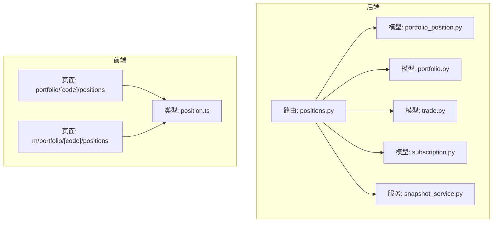
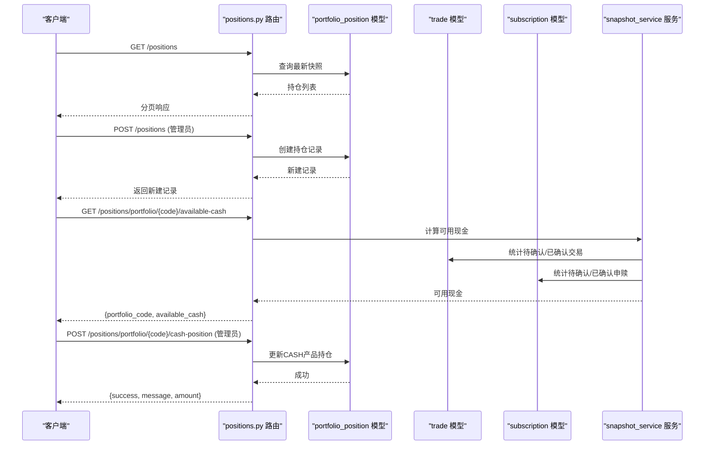
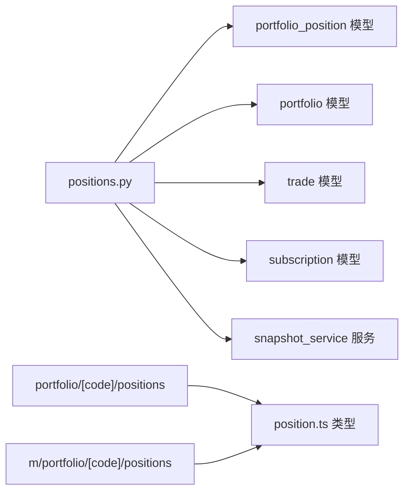

# 持仓管理API

<cite>
**本文引用的文件**
- [backend/app/routers/positions.py](file://backend/app/routers/positions.py)
- [backend/app/schemas/position.py](file://backend/app/schemas/position.py)
- [backend/app/models/portfolio_position.py](file://backend/app/models/portfolio_position.py)
- [backend/app/models/portfolio.py](file://backend/app/models/portfolio.py)
- [backend/app/models/trade.py](file://backend/app/models/trade.py)
- [backend/app/models/subscription.py](file://backend/app/models/subscription.py)
- [backend/app/services/snapshot_service.py](file://backend/app/services/snapshot_service.py)
- [frontend/src/app/portfolio/[code]/positions/page.tsx](file://frontend/src/app/portfolio/[code]/positions/page.tsx)
- [frontend/src/app/m/portfolio/[code]/positions/page.tsx](file://frontend/src/app/m/portfolio/[code]/positions/page.tsx)
- [frontend/src/types/position.ts](file://frontend/src/types/position.ts)
- [Docs/03-业务流程设计.md](file://Docs/03-业务流程设计.md)
</cite>

## 目录
1. [简介](#简介)
2. [项目结构](#项目结构)
3. [核心组件](#核心组件)
4. [架构概览](#架构概览)
5. [详细组件分析](#详细组件分析)
6. [依赖分析](#依赖分析)
7. [性能考虑](#性能考虑)
8. [故障排查指南](#故障排查指南)
9. [结论](#结论)
10. [附录](#附录)

## 简介
本文件为 InvestRing 持仓管理模块的详细API文档，覆盖以下内容：
- 持仓CRUD操作（新增、查询、更新、删除）
- 持仓调整与冻结相关接口
- 持仓状态管理、成本与收益统计能力
- 持仓查询接口（列表、组合维度、产品维度）
- 请求/响应模式、权限要求与数据验证规则
- 持仓冻结份额计算与可用资金/份额的实时计算逻辑

## 项目结构
围绕持仓管理的核心文件组织如下：
- 后端路由层：定义HTTP接口与权限控制
- 数据模型层：定义持仓实体及约束
- 服务层：提供快照生成、冻结份额计算等业务逻辑
- 前端页面：展示持仓列表、收益统计与调仓入口

图表来源
- [backend/app/routers/positions.py:1-410](file://backend/app/routers/positions.py#L1-L410)
- [backend/app/models/portfolio_position.py:1-34](file://backend/app/models/portfolio_position.py#L1-L34)
- [backend/app/models/portfolio.py:1-16](file://backend/app/models/portfolio.py#L1-L16)
- [backend/app/models/trade.py:1-32](file://backend/app/models/trade.py#L1-L32)
- [backend/app/models/subscription.py:1-21](file://backend/app/models/subscription.py#L1-L21)
- [backend/app/services/snapshot_service.py:1-200](file://backend/app/services/snapshot_service.py#L1-L200)
- [frontend/src/app/portfolio/[code]/positions/page.tsx](file://frontend/src/app/portfolio/[code]/positions/page.tsx#L50-L93)
- [frontend/src/app/m/portfolio/[code]/positions/page.tsx](file://frontend/src/app/m/portfolio/[code]/positions/page.tsx#L42-L66)
- [frontend/src/types/position.ts:1-43](file://frontend/src/types/position.ts#L1-L43)

章节来源
- [backend/app/routers/positions.py:1-410](file://backend/app/routers/positions.py#L1-L410)
- [backend/app/models/portfolio_position.py:1-34](file://backend/app/models/portfolio_position.py#L1-L34)
- [backend/app/models/portfolio.py:1-16](file://backend/app/models/portfolio.py#L1-L16)
- [backend/app/models/trade.py:1-32](file://backend/app/models/trade.py#L1-L32)
- [backend/app/models/subscription.py:1-21](file://backend/app/models/subscription.py#L1-L21)
- [backend/app/services/snapshot_service.py:1-200](file://backend/app/services/snapshot_service.py#L1-L200)
- [frontend/src/app/portfolio/[code]/positions/page.tsx](file://frontend/src/app/portfolio/[code]/positions/page.tsx#L50-L93)
- [frontend/src/app/m/portfolio/[code]/positions/page.tsx](file://frontend/src/app/m/portfolio/[code]/positions/page.tsx#L42-L66)
- [frontend/src/types/position.ts:1-43](file://frontend/src/types/position.ts#L1-L43)

## 核心组件
- 持仓实体与约束
  - 持仓记录包含组合代码、产品代码、市场、平台、份额/金额、冻结份额/金额、成本价、单位价、市值、快照日期等字段，并通过check约束确保“净值型”与“非净值型”资产的数据一致性。
- 快照服务
  - 提供生成/重算组合快照的能力，包括持仓快照、组合市值快照、投资人快照；并内置冻结份额计算逻辑。
- 路由与权限
  - 持仓CRUD接口由管理员权限用户访问；可用资金/份额查询接口面向普通用户。

章节来源
- [backend/app/models/portfolio_position.py:1-34](file://backend/app/models/portfolio_position.py#L1-L34)
- [backend/app/services/snapshot_service.py:1-200](file://backend/app/services/snapshot_service.py#L1-L200)
- [backend/app/routers/positions.py:180-410](file://backend/app/routers/positions.py#L180-L410)

## 架构概览
下图展示了持仓相关接口的调用链路与数据流：

图表来源
- [backend/app/routers/positions.py:180-410](file://backend/app/routers/positions.py#L180-L410)
- [backend/app/models/portfolio_position.py:1-34](file://backend/app/models/portfolio_position.py#L1-L34)
- [backend/app/models/trade.py:1-32](file://backend/app/models/trade.py#L1-L32)
- [backend/app/models/subscription.py:1-21](file://backend/app/models/subscription.py#L1-L21)
- [backend/app/services/snapshot_service.py:1-200](file://backend/app/services/snapshot_service.py#L1-L200)

## 详细组件分析

### 1. 持仓CRUD接口
- 列表查询
  - 方法与路径：GET /positions
  - 查询参数：
    - portfolio_code：可选，按组合过滤
    - snapshot_date：可选，按快照日期过滤；未提供时默认取每个组合每个产品的最新快照
    - page/page_size：分页参数
  - 权限：普通用户
  - 响应：分页对象，包含items、total、page、page_size
- 新增持仓
  - 方法与路径：POST /positions
  - 请求体：PositionCreate（见schema）
  - 权限：管理员
  - 响应：PositionResponse
- 查询单条持仓
  - 方法与路径：GET /positions/{id}
  - 权限：普通用户
  - 响应：PositionResponse
- 更新持仓
  - 方法与路径：PUT /positions/{id}
  - 请求体：PositionUpdate（支持部分字段更新）
  - 权限：管理员
  - 响应：PositionResponse
- 删除持仓
  - 方法与路径：DELETE /positions/{id}
  - 权限：管理员
  - 响应：删除成功消息

请求/响应字段参考
- PositionCreate/Update/Response 字段定义参见schema文件
- 前端类型定义与字段映射参见前端types文件

章节来源
- [backend/app/routers/positions.py:180-278](file://backend/app/routers/positions.py#L180-L278)
- [backend/app/schemas/position.py:21-42](file://backend/app/schemas/position.py#L21-L42)
- [frontend/src/types/position.ts:1-43](file://frontend/src/types/position.ts#L1-L43)

### 2. 持仓调整与冻结相关接口
- 组合可用现金实时计算
  - 方法与路径：GET /positions/portfolio/{portfolio_code}/available-cash
  - 权限：普通用户
  - 计算规则要点：
    - 基于最新快照现金，叠加/减去未生成快照的确认申赎与确认买卖，再扣减待确认买入与确认买入未快照的部分
  - 响应：{portfolio_code, available_cash}
- 产品可用份额实时计算
  - 方法与路径：GET /positions/portfolio/{portfolio_code}/product/{product_code}/available-shares
  - 查询参数：market（可选）
  - 权限：普通用户
  - 计算规则要点：
    - 基于最新快照份额，扣除待确认卖出与确认卖出未快照的部分
  - 响应：{portfolio_code, product_code, market, available_shares}
- 非净值资产（现金）更新
  - 方法与路径：POST /positions/portfolio/{portfolio_code}/cash-position
  - 请求体：CashPositionUpdate（包含amount、platform_code、update_date）
  - 权限：管理员
  - 校验规则：
    - 仅可在交易日执行
    - 平台必须存在
    - 若记录不存在则创建，存在则更新；CASH产品需满足check约束（份额为空，金额非空）
  - 响应：{success, message, portfolio_code, platform_code, amount, update_date}

章节来源
- [backend/app/routers/positions.py:280-410](file://backend/app/routers/positions.py#L280-L410)
- [backend/app/schemas/position.py:45-50](file://backend/app/schemas/position.py#L45-L50)
- [Docs/03-业务流程设计.md:2007-2036](file://Docs/03-业务流程设计.md#L2007-L2036)

### 3. 持仓状态管理与收益统计
- 冻结份额计算
  - 服务层提供冻结份额计算函数，用于生成快照时确定冻结份额：
    - 基金层面：pending卖出总份额
    - 组合层面：pending赎回总份额
    - 投资人层面：pending赎回份额
- 收益统计
  - 前端页面基于持仓字段计算总市值、总成本与盈亏，作为收益统计的展示依据
  - 字段来源：shares、cost_price、unit_price、market_value

章节来源
- [backend/app/services/snapshot_service.py:718-789](file://backend/app/services/snapshot_service.py#L718-L789)
- [frontend/src/app/portfolio/[code]/positions/page.tsx](file://frontend/src/app/portfolio/[code]/positions/page.tsx#L67-L69)
- [frontend/src/app/m/portfolio/[code]/positions/page.tsx](file://frontend/src/app/m/portfolio/[code]/positions/page.tsx#L64-L66)

### 4. 查询接口汇总
- 持仓列表
  - GET /positions
  - 支持按组合与快照日期过滤，支持分页
- 组合维度查询
  - GET /positions/portfolio/{portfolio_code}/available-cash
  - GET /positions/portfolio/{portfolio_code}/product/{product_code}/available-shares
- 产品维度查询
  - 通过组合查询接口返回的产品列表，结合前端页面展示产品级明细

章节来源
- [backend/app/routers/positions.py:180-316](file://backend/app/routers/positions.py#L180-L316)

### 5. 数据模型与约束
- 持仓实体字段与约束
  - 关键字段：portfolio_code、product_code、market、platform_code、shares、frozen_shares、cost_price、unit_price、market_value、amount、frozen_amount、snapshot_date
  - 约束：check约束确保“净值型”与“非净值型”资产二选一（份额与金额互斥）

章节来源
- [backend/app/models/portfolio_position.py:1-34](file://backend/app/models/portfolio_position.py#L1-L34)

### 6. 权限与安全
- 持仓CRUD与现金更新接口要求管理员权限
- 可用现金/份额查询接口对普通用户开放

章节来源
- [backend/app/routers/positions.py:221-278](file://backend/app/routers/positions.py#L221-L278)
- [backend/app/routers/positions.py:319-410](file://backend/app/routers/positions.py#L319-L410)

### 7. 请求与响应示例（说明性）
- 新增持仓
  - 请求：POST /positions
  - 请求体字段：portfolio_code、product_code、market、platform_code、shares、frozen_shares、cost_price、unit_price、market_value、amount、frozen_amount、snapshot_date
  - 响应：PositionResponse（含id、created_at等）
- 可用现金查询
  - 请求：GET /positions/portfolio/{portfolio_code}/available-cash
  - 响应：{portfolio_code, available_cash}
- 可用份额查询
  - 请求：GET /positions/portfolio/{portfolio_code}/product/{product_code}/available-shares?market=...
  - 响应：{portfolio_code, product_code, market, available_shares}
- 现金更新
  - 请求：POST /positions/portfolio/{portfolio_code}/cash-position
  - 请求体：{amount, platform_code, update_date}
  - 响应：{success, message, portfolio_code, platform_code, amount, update_date}

章节来源
- [backend/app/routers/positions.py:180-410](file://backend/app/routers/positions.py#L180-L410)
- [backend/app/schemas/position.py:21-50](file://backend/app/schemas/position.py#L21-L50)

### 8. 数据验证与约束条件
- 非净值资产（CASH）更新
  - 仅可在交易日执行
  - 平台必须存在
  - CASH产品需满足check约束（份额为空，金额非空）
- 持仓实体约束
  - 份额与金额互斥，确保资产类型正确
  - 唯一性约束：组合+产品+市场+快照日期唯一

章节来源
- [backend/app/routers/positions.py:319-410](file://backend/app/routers/positions.py#L319-L410)
- [backend/app/models/portfolio_position.py:23-33](file://backend/app/models/portfolio_position.py#L23-L33)

## 依赖分析
- 路由依赖
  - positions.py 路由依赖 portfolio_position、portfolio、trade、subscription 等模型
  - 通过服务层函数实现冻结份额与可用资金/份额的计算
- 前端依赖
  - 页面使用 Position 类型与相关字段进行展示与计算
  - 页面通过API调用获取持仓列表并展示收益统计

图表来源
- [backend/app/routers/positions.py:1-410](file://backend/app/routers/positions.py#L1-L410)
- [backend/app/models/portfolio_position.py:1-34](file://backend/app/models/portfolio_position.py#L1-L34)
- [backend/app/models/portfolio.py:1-16](file://backend/app/models/portfolio.py#L1-L16)
- [backend/app/models/trade.py:1-32](file://backend/app/models/trade.py#L1-L32)
- [backend/app/models/subscription.py:1-21](file://backend/app/models/subscription.py#L1-L21)
- [backend/app/services/snapshot_service.py:1-200](file://backend/app/services/snapshot_service.py#L1-L200)
- [frontend/src/app/portfolio/[code]/positions/page.tsx](file://frontend/src/app/portfolio/[code]/positions/page.tsx#L50-L93)
- [frontend/src/app/m/portfolio/[code]/positions/page.tsx](file://frontend/src/app/m/portfolio/[code]/positions/page.tsx#L42-L66)
- [frontend/src/types/position.ts:1-43](file://frontend/src/types/position.ts#L1-L43)

## 性能考虑
- 查询优化
  - 列表查询默认按组合与产品聚合到最新快照，避免全表扫描
  - 分页参数 page/page_size 控制返回量
- 计算复杂度
  - 可用现金/份额计算涉及多表聚合，建议在交易日与快照生成期间避免频繁调用
- 缓存策略
  - 前端可缓存查询结果并在快照生成后主动刷新

## 故障排查指南
- 404 错误
  - 组合不存在：检查组合代码
  - 持仓不存在：检查id或查询条件
- 422 错误
  - 非交易日提交现金更新：请在交易日提交
- 权限错误
  - CRUD与现金更新需管理员权限
- 数据不一致
  - 确认快照是否已生成，冻结份额与可用资金/份额计算依赖最新快照

章节来源
- [backend/app/routers/positions.py:280-410](file://backend/app/routers/positions.py#L280-L410)

## 结论
本文档梳理了 InvestRing 持仓管理模块的API接口、数据模型与业务逻辑，明确了权限要求、数据验证与约束条件，并提供了查询与调整类接口的使用说明。建议在交易日与快照生成周期内合理安排调用，确保可用资金/份额与冻结份额的准确性。

## 附录

### A. 接口清单与权限对照
- GET /positions：普通用户
- POST /positions：管理员
- GET /positions/{id}：普通用户
- PUT /positions/{id}：管理员
- DELETE /positions/{id}：管理员
- GET /positions/portfolio/{portfolio_code}/available-cash：普通用户
- GET /positions/portfolio/{portfolio_code}/product/{product_code}/available-shares：普通用户
- POST /positions/portfolio/{portfolio_code}/cash-position：管理员

章节来源
- [backend/app/routers/positions.py:180-410](file://backend/app/routers/positions.py#L180-L410)

### B. 数据模型字段说明
- 持仓字段：portfolio_code、product_code、market、platform_code、shares、frozen_shares、cost_price、unit_price、market_value、amount、frozen_amount、snapshot_date、created_at
- 非净值资产更新字段：amount、platform_code、update_date

章节来源
- [backend/app/models/portfolio_position.py:1-34](file://backend/app/models/portfolio_position.py#L1-L34)
- [backend/app/schemas/position.py:6-50](file://backend/app/schemas/position.py#L6-L50)