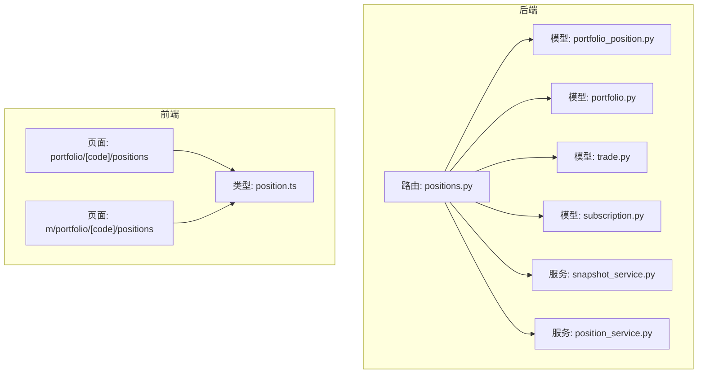
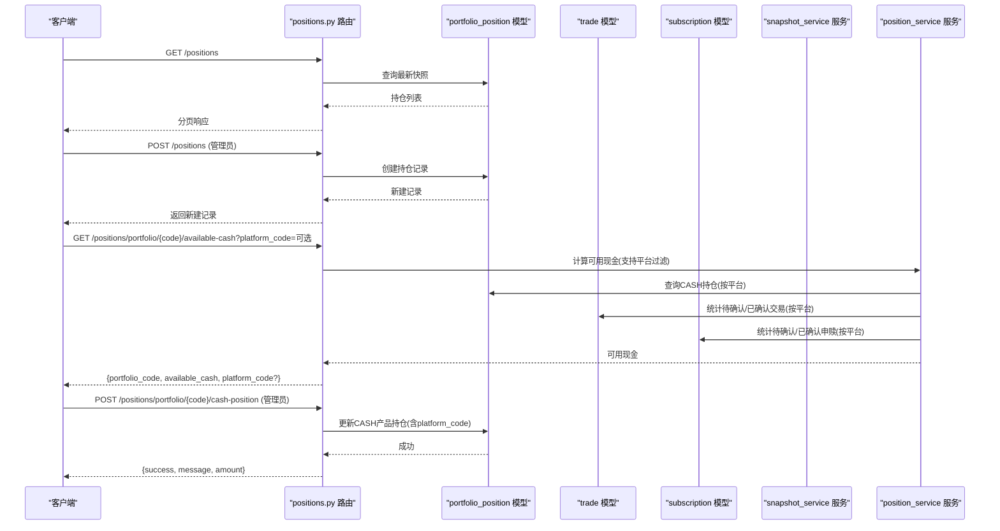
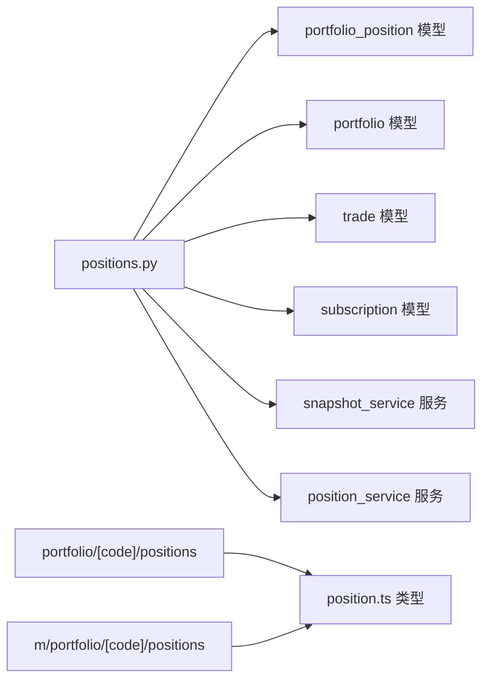

# 持仓管理API

<cite>
**本文引用的文件**
- [backend/app/routers/positions.py](file://backend/app/routers/positions.py)
- [backend/app/schemas/position.py](file://backend/app/schemas/position.py)
- [backend/app/models/portfolio_position.py](file://backend/app/models/portfolio_position.py)
- [backend/app/models/portfolio.py](file://backend/app/models/portfolio.py)
- [backend/app/models/trade.py](file://backend/app/models/trade.py)
- [backend/app/models/subscription.py](file://backend/app/models/subscription.py)
- [backend/app/services/snapshot_service.py](file://backend/app/services/snapshot_service.py)
- [backend/app/services/position_service.py](file://backend/app/services/position_service.py)
- [frontend/src/app/portfolio/[code]/positions/page.tsx](file://frontend/src/app/portfolio/[code]/positions/page.tsx)
- [frontend/src/app/m/portfolio/[code]/positions/page.tsx](file://frontend/src/app/m/portfolio/[code]/positions/page.tsx)
- [frontend/src/types/position.ts](file://frontend/src/types/position.ts)
- [Docs/04-后端开发.md](file://Docs/04-后端开发.md)
</cite>

## 更新摘要
**变更内容**
- 增强了平台维度的可用现金计算功能，支持按platform_code过滤的实时资金计算
- 更新了可用现金查询接口，新增可选的platform_code参数
- 完善了非净值资产（现金）的平台维度管理
- 优化了快照生成服务中的平台维度处理逻辑

## 目录
1. [简介](#简介)
2. [项目结构](#项目结构)
3. [核心组件](#核心组件)
4. [架构概览](#架构概览)
5. [详细组件分析](#详细组件分析)
6. [依赖分析](#依赖分析)
7. [性能考虑](#性能考虑)
8. [故障排查指南](#故障排查指南)
9. [结论](#结论)
10. [附录](#附录)

## 简介
本文件为 InvestRing 持仓管理模块的详细API文档，覆盖以下内容：
- 持仓CRUD操作（新增、查询、更新、删除）
- 持仓调整与冻结相关接口
- **平台维度可用现金计算功能**（新增）
- 持仓状态管理、成本与收益统计能力
- 持仓查询接口（列表、组合维度、产品维度）
- 请求/响应模式、权限要求与数据验证规则
- 持仓冻结份额计算与可用资金/份额的实时计算逻辑

## 项目结构
围绕持仓管理的核心文件组织如下：
- 后端路由层：定义HTTP接口与权限控制
- 数据模型层：定义持仓实体及约束
- 服务层：提供快照生成、冻结份额计算等业务逻辑
- 前端页面：展示持仓列表、收益统计与调仓入口



**图表来源**
- [backend/app/routers/positions.py:1-440](file://backend/app/routers/positions.py#L1-L440)
- [backend/app/models/portfolio_position.py:1-35](file://backend/app/models/portfolio_position.py#L1-L35)
- [backend/app/models/portfolio.py:1-16](file://backend/app/models/portfolio.py#L1-L16)
- [backend/app/models/trade.py:1-33](file://backend/app/models/trade.py#L1-L33)
- [backend/app/models/subscription.py:1-22](file://backend/app/models/subscription.py#L1-L22)
- [backend/app/services/snapshot_service.py:1-200](file://backend/app/services/snapshot_service.py#L1-L200)
- [backend/app/services/position_service.py:1-249](file://backend/app/services/position_service.py#L1-L249)
- [frontend/src/app/portfolio/[code]/positions/page.tsx](file://frontend/src/app/portfolio/[code]/positions/page.tsx#L1-L200)
- [frontend/src/app/m/portfolio/[code]/positions/page.tsx](file://frontend/src/app/m/portfolio/[code]/positions/page.tsx#L42-L66)
- [frontend/src/types/position.ts:1-47](file://frontend/src/types/position.ts#L1-L47)

## 核心组件
- 持仓实体与约束
  - 持仓记录包含组合代码、产品代码、市场、**平台代码**、份额/金额、冻结份额/金额、成本价、单位价、市值、快照日期等字段，并通过check约束确保"净值型"与"非净值型"资产的数据一致性。
- **平台维度可用现金计算服务**（新增）
  - 支持按platform_code过滤的实时资金计算，可查询单个平台的可用现金或汇总所有平台的总可用现金
- 快照服务
  - 提供生成/重算组合快照的能力，包括持仓快照、组合市值快照、投资人快照；并内置冻结份额计算逻辑
- 路由与权限
  - 持仓CRUD接口由管理员权限用户访问；可用资金/份额查询接口面向普通用户

**章节来源**
- [backend/app/models/portfolio_position.py:1-35](file://backend/app/models/portfolio_position.py#L1-L35)
- [backend/app/services/position_service.py:18-143](file://backend/app/services/position_service.py#L18-L143)
- [backend/app/services/snapshot_service.py:1-200](file://backend/app/services/snapshot_service.py#L1-L200)
- [backend/app/routers/positions.py:180-440](file://backend/app/routers/positions.py#L180-L440)

## 架构概览
下图展示了持仓相关接口的调用链路与数据流，特别突出了平台维度的可用现金计算功能：



**图表来源**
- [backend/app/routers/positions.py:306-323](file://backend/app/routers/positions.py#L306-L323)
- [backend/app/services/position_service.py:18-143](file://backend/app/services/position_service.py#L18-L143)
- [backend/app/models/portfolio_position.py:1-35](file://backend/app/models/portfolio_position.py#L1-L35)
- [backend/app/models/trade.py:1-33](file://backend/app/models/trade.py#L1-L33)
- [backend/app/models/subscription.py:1-22](file://backend/app/models/subscription.py#L1-L22)
- [backend/app/services/snapshot_service.py:1-200](file://backend/app/services/snapshot_service.py#L1-L200)

## 详细组件分析

### 1. 持仓CRUD接口
- 列表查询
  - 方法与路径：GET /positions
  - 查询参数：
    - portfolio_code：可选，按组合过滤
    - snapshot_date：可选，按快照日期过滤；未提供时默认取每个组合每个产品的最新快照
    - page/page_size：分页参数
  - 权限：普通用户
  - 响应：分页对象，包含items、total、page、page_size
- 新增持仓
  - 方法与路径：POST /positions
  - 请求体：PositionCreate（见schema）
  - 权限：管理员
  - 响应：PositionResponse
- 查询单条持仓
  - 方法与路径：GET /positions/{id}
  - 权限：普通用户
  - 响应：PositionResponse
- 更新持仓
  - 方法与路径：PUT /positions/{id}
  - 请求体：PositionUpdate（支持部分字段更新）
  - 权限：管理员
  - 响应：PositionResponse
- 删除持仓
  - 方法与路径：DELETE /positions/{id}
  - 权限：管理员
  - 响应：删除成功消息

**章节来源**
- [backend/app/routers/positions.py:206-303](file://backend/app/routers/positions.py#L206-L303)
- [backend/app/schemas/position.py:21-42](file://backend/app/schemas/position.py#L21-L42)
- [frontend/src/types/position.ts:1-47](file://frontend/src/types/position.ts#L1-L47)

### 2. 持仓调整与冻结相关接口

#### 2.1 组合可用现金实时计算（增强版）
- 方法与路径：GET /positions/portfolio/{portfolio_code}/available-cash
- **新增参数**：platform_code（可选），用于指定平台维度查询
- 权限：普通用户
- **计算规则要点**：
  - 基于最新快照现金，叠加/减去未生成快照的确认申赎与确认买卖，再扣减待确认买入与确认买入未快照的部分
  - **当传入platform_code时**：只计算该平台的可用现金
  - **不传platform_code时**：汇总所有平台的可用现金
- 响应：{portfolio_code, available_cash, platform_code?}

**章节来源**
- [backend/app/routers/positions.py:306-323](file://backend/app/routers/positions.py#L306-L323)
- [backend/app/services/position_service.py:18-143](file://backend/app/services/position_service.py#L18-L143)

#### 2.2 产品可用份额实时计算
- 方法与路径：GET /positions/portfolio/{portfolio_code}/product/{product_code}/available-shares
- 查询参数：market（可选）
- 权限：普通用户
- 计算规则要点：
  - 基于最新快照份额，扣除待确认卖出与确认卖出未快照的部分
- 响应：{portfolio_code, product_code, market, available_shares}

**章节来源**
- [backend/app/routers/positions.py:326-346](file://backend/app/routers/positions.py#L326-L346)

#### 2.3 非净值资产（现金）更新（增强版）
- 方法与路径：POST /positions/portfolio/{portfolio_code}/cash-position
- 请求体：CashPositionUpdate（包含amount、**platform_code**、update_date）
- 权限：管理员
- **校验规则**：
  - 仅可在交易日执行
  - **平台必须存在且必填**
  - 若记录不存在则创建，存在则更新；CASH产品需满足check约束（份额为空，金额非空）
  - **按platform_code和snapshot_date唯一性约束**
- 响应：{success, message, portfolio_code, platform_code, amount, update_date}

**章节来源**
- [backend/app/routers/positions.py:349-439](file://backend/app/routers/positions.py#L349-L439)
- [backend/app/schemas/position.py:45-50](file://backend/app/schemas/position.py#L45-L50)

### 3. 平台维度可用现金计算功能（新增）

#### 3.1 核心计算逻辑
- **函数签名**：`calculate_available_cash(db, portfolio_code, platform_code=None)`
- **平台过滤机制**：
  - 当传入platform_code时：只查询该平台的CASH持仓和相关交易
  - 不传platform_code时：汇总所有平台的CASH持仓和相关交易
- **计算流程**：
  1. 获取最新快照日期
  2. 查询CASH持仓（按平台过滤）
  3. 统计confirmed申购（按平台过滤）
  4. 统计confirmed赎回（按平台过滤）
  5. 统计pending买入（按平台过滤）
  6. 统计confirmed买入（按平台过滤）
  7. 统计confirmed卖出（按平台过滤）

#### 3.2 API端点增强
- **GET /positions/portfolio/{portfolio_code}/available-cash**
  - 新增可选query参数：platform_code
  - 当指定platform_code时，响应中包含platform_code字段
  - 支持精确查询单个平台的可用现金

**章节来源**
- [backend/app/services/position_service.py:18-143](file://backend/app/services/position_service.py#L18-L143)
- [backend/app/routers/positions.py:28-150](file://backend/app/routers/positions.py#L28-L150)
- [backend/app/routers/positions.py:306-323](file://backend/app/routers/positions.py#L306-L323)

### 4. 持仓状态管理与收益统计
- 冻结份额计算
  - 服务层提供冻结份额计算函数，用于生成快照时确定冻结份额：
    - 基金层面：pending卖出总份额
    - 组合层面：pending赎回总份额
    - 投资人层面：pending赎回份额
- 收益统计
  - 前端页面基于持仓字段计算总市值、总成本与盈亏，作为收益统计的展示依据
  - 字段来源：shares、cost_price、unit_price、market_value

**章节来源**
- [backend/app/services/snapshot_service.py:718-789](file://backend/app/services/snapshot_service.py#L718-L789)
- [frontend/src/app/portfolio/[code]/positions/page.tsx](file://frontend/src/app/portfolio/[code]/positions/page.tsx#L86-L88)
- [frontend/src/app/m/portfolio/[code]/positions/page.tsx](file://frontend/src/app/m/portfolio/[code]/positions/page.tsx#L59-L61)

### 5. 查询接口汇总
- 持仓列表
  - GET /positions
  - 支持按组合与快照日期过滤，支持分页
- 组合维度查询
  - GET /positions/portfolio/{portfolio_code}/available-cash（**支持platform_code参数**）
  - GET /positions/portfolio/{portfolio_code}/product/{product_code}/available-shares
- 产品维度查询
  - 通过组合查询接口返回的产品列表，结合前端页面展示产品级明细

**章节来源**
- [backend/app/routers/positions.py:206-346](file://backend/app/routers/positions.py#L206-L346)

### 6. 数据模型与约束（增强版）
- 持仓实体字段与约束
  - 关键字段：portfolio_code、product_code、market、**platform_code**、shares、frozen_shares、cost_price、unit_price、market_value、amount、frozen_amount、snapshot_date
  - 约束：check约束确保"净值型"与"非净值型"资产二选一（份额与金额互斥）
  - **唯一性约束**：组合+产品+市场+**平台**+快照日期唯一

**章节来源**
- [backend/app/models/portfolio_position.py:1-35](file://backend/app/models/portfolio_position.py#L1-L35)

### 7. 权限与安全
- 持仓CRUD与现金更新接口要求管理员权限
- 可用现金/份额查询接口对普通用户开放

**章节来源**
- [backend/app/routers/positions.py:247-303](file://backend/app/routers/positions.py#L247-L303)
- [backend/app/routers/positions.py:306-439](file://backend/app/routers/positions.py#L306-L439)

### 8. 请求与响应示例（增强版）
- 新增持仓
  - 请求：POST /positions
  - 请求体字段：portfolio_code、product_code、market、**platform_code**、shares、frozen_shares、cost_price、unit_price、market_value、amount、frozen_amount、snapshot_date
  - 响应：PositionResponse（含id、created_at等）
- **可用现金查询（支持平台维度）**
  - 请求：GET /positions/portfolio/{portfolio_code}/available-cash?platform_code=可选
  - 响应：{portfolio_code, available_cash, platform_code?}
- 可用份额查询
  - 请求：GET /positions/portfolio/{portfolio_code}/product/{product_code}/available-shares?market=...
  - 响应：{portfolio_code, product_code, market, available_shares}
- **现金更新（平台维度）**
  - 请求：POST /positions/portfolio/{portfolio_code}/cash-position
  - 请求体：{amount, **platform_code**, update_date}
  - 响应：{success, message, portfolio_code, platform_code, amount, update_date}

**章节来源**
- [backend/app/routers/positions.py:247-439](file://backend/app/routers/positions.py#L247-L439)
- [backend/app/schemas/position.py:21-50](file://backend/app/schemas/position.py#L21-L50)

### 9. 数据验证与约束条件（增强版）
- 非净值资产（CASH）更新
  - 仅可在交易日执行
  - **平台必须存在且必填**
  - CASH产品需满足check约束（份额为空，金额非空）
  - **按platform_code和snapshot_date的唯一性约束**
- 持仓实体约束
  - 份额与金额互斥，确保资产类型正确
  - **唯一性约束：组合+产品+市场+平台+快照日期唯一**

**章节来源**
- [backend/app/routers/positions.py:349-439](file://backend/app/routers/positions.py#L349-L439)
- [backend/app/models/portfolio_position.py:24-34](file://backend/app/models/portfolio_position.py#L24-L34)

## 依赖分析
- 路由依赖
  - positions.py 路由依赖 portfolio_position、portfolio、trade、subscription 等模型
  - 通过服务层函数实现冻结份额与可用资金/份额的计算
  - **新增position_service.py服务，专门处理平台维度的可用现金计算**
- 前端依赖
  - 页面使用 Position 类型与相关字段进行展示与计算
  - 页面通过API调用获取持仓列表并展示收益统计
  - **前端类型定义已支持platform_code字段**



**图表来源**
- [backend/app/routers/positions.py:1-440](file://backend/app/routers/positions.py#L1-L440)
- [backend/app/models/portfolio_position.py:1-35](file://backend/app/models/portfolio_position.py#L1-L35)
- [backend/app/models/portfolio.py:1-16](file://backend/app/models/portfolio.py#L1-L16)
- [backend/app/models/trade.py:1-33](file://backend/app/models/trade.py#L1-L33)
- [backend/app/models/subscription.py:1-22](file://backend/app/models/subscription.py#L1-L22)
- [backend/app/services/snapshot_service.py:1-200](file://backend/app/services/snapshot_service.py#L1-L200)
- [backend/app/services/position_service.py:1-249](file://backend/app/services/position_service.py#L1-L249)
- [frontend/src/app/portfolio/[code]/positions/page.tsx](file://frontend/src/app/portfolio/[code]/positions/page.tsx#L1-L200)
- [frontend/src/app/m/portfolio/[code]/positions/page.tsx](file://frontend/src/app/m/portfolio/[code]/positions/page.tsx#L42-L66)
- [frontend/src/types/position.ts:1-47](file://frontend/src/types/position.ts#L1-L47)

## 性能考虑
- 查询优化
  - 列表查询默认按组合与产品聚合到最新快照，避免全表扫描
  - 分页参数 page/page_size 控制返回量
  - **平台维度查询通过数据库索引优化，提高过滤效率**
- 计算复杂度
  - 可用现金/份额计算涉及多表聚合，建议在交易日与快照生成期间避免频繁调用
  - **平台维度计算减少了不必要的数据遍历，提升性能**
- 缓存策略
  - 前端可缓存查询结果并在快照生成后主动刷新

## 故障排查指南
- 404 错误
  - 组合不存在：检查组合代码
  - 持仓不存在：检查id或查询条件
  - **平台不存在：检查platform_code是否正确**
- 422 错误
  - 非交易日提交现金更新：请在交易日提交
  - **平台代码无效：请检查platform_code是否存在**
- 权限错误
  - CRUD与现金更新需管理员权限
- 数据不一致
  - 确认快照是否已生成，冻结份额与可用资金/份额计算依赖最新快照
  - **平台维度数据不一致：检查各平台的CASH持仓记录是否完整**

**章节来源**
- [backend/app/routers/positions.py:306-439](file://backend/app/routers/positions.py#L306-L439)

## 结论
本文档梳理了 InvestRing 持仓管理模块的API接口、数据模型与业务逻辑，明确了权限要求、数据验证与约束条件，并提供了查询与调整类接口的使用说明。**新增的平台维度可用现金计算功能**为用户提供了更精细的资金管理能力，支持按平台追踪和分析可用现金。建议在交易日与快照生成周期内合理安排调用，确保可用资金/份额与冻结份额的准确性。

## 附录

### A. 接口清单与权限对照
- GET /positions：普通用户
- POST /positions：管理员
- GET /positions/{id}：普通用户
- PUT /positions/{id}：管理员
- DELETE /positions/{id}：管理员
- **GET /positions/portfolio/{portfolio_code}/available-cash?platform_code=可选**：普通用户
- GET /positions/portfolio/{portfolio_code}/product/{product_code}/available-shares：普通用户
- POST /positions/portfolio/{portfolio_code}/cash-position：管理员

**章节来源**
- [backend/app/routers/positions.py:206-439](file://backend/app/routers/positions.py#L206-L439)

### B. 数据模型字段说明
- 持仓字段：portfolio_code、product_code、market、**platform_code**、shares、frozen_shares、cost_price、unit_price、market_value、amount、frozen_amount、snapshot_date、created_at
- 非净值资产更新字段：amount、**platform_code**、update_date

**章节来源**
- [backend/app/models/portfolio_position.py:1-35](file://backend/app/models/portfolio_position.py#L1-L35)
- [backend/app/schemas/position.py:6-50](file://backend/app/schemas/position.py#L6-L50)

### C. 平台维度可用现金计算详细说明
- **计算逻辑**：
  ```
  available_cash = snapshot_cash 
                 + confirmed_in      // 已确认申购（快照未生成）
                 - confirmed_out     // 已确认赎回（快照未生成）
                 - pending_buy       // pending买入
                 - confirmed_buy     // 已确认买入（快照未生成）
                 + confirmed_sell    // 已确认卖出（快照未生成）
  ```
- **平台过滤**：
  - 当指定platform_code时，所有查询都按该平台过滤
  - 当不指定platform_code时，汇总所有平台的数据
- **响应格式**：
  - 指定platform_code：{portfolio_code, available_cash, platform_code}
  - 不指定platform_code：{portfolio_code, available_cash}

**章节来源**
- [backend/app/services/position_service.py:18-143](file://backend/app/services/position_service.py#L18-L143)
- [backend/app/routers/positions.py:28-150](file://backend/app/routers/positions.py#L28-L150)
- [Docs/04-后端开发.md:268-299](file://Docs/04-后端开发.md#L268-L299)