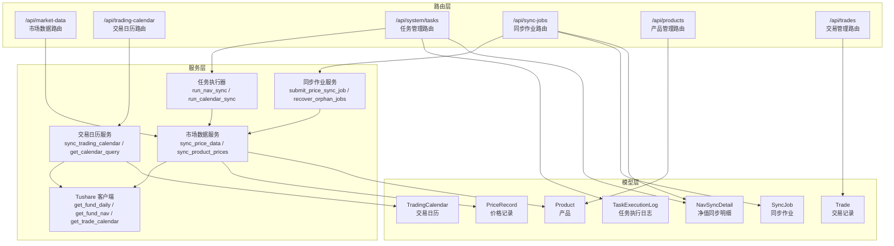
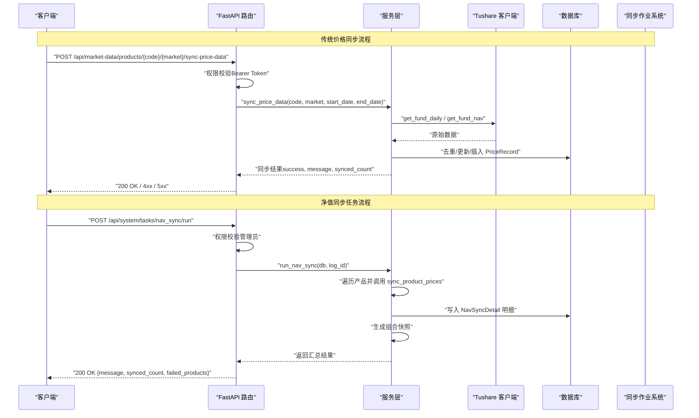
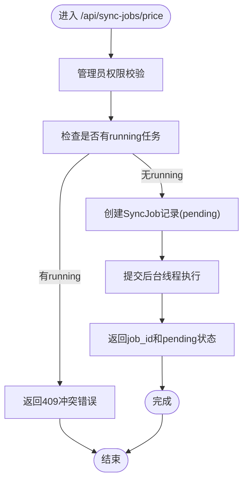
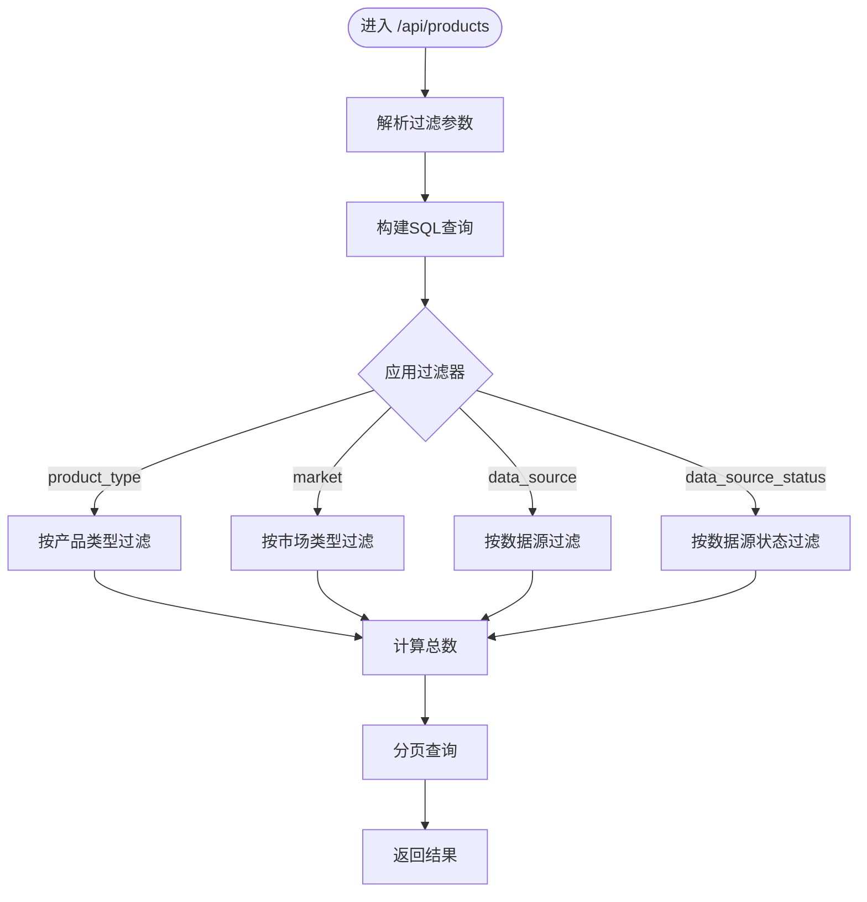
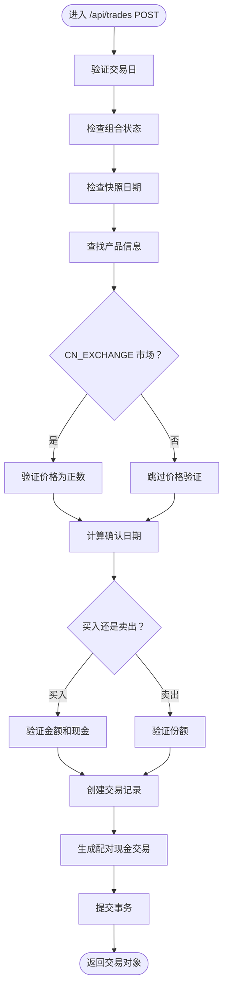
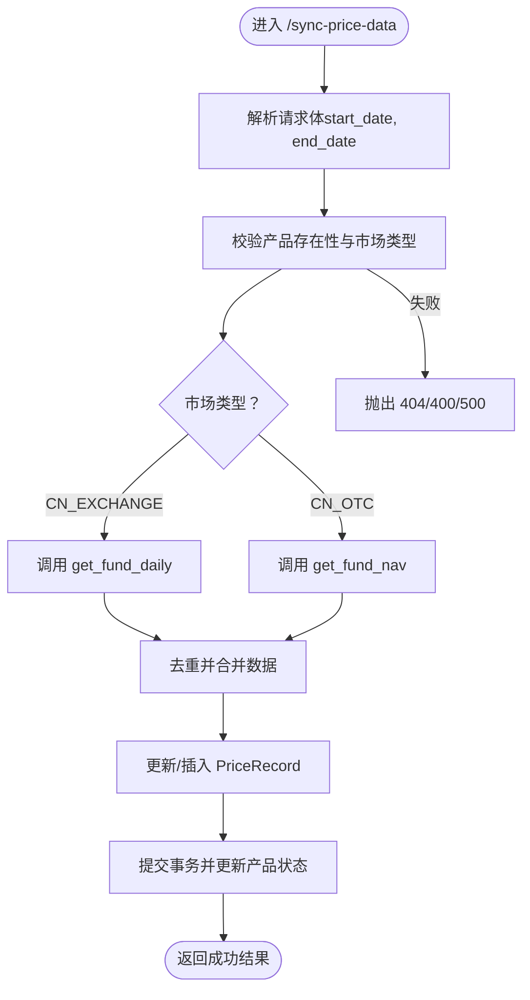
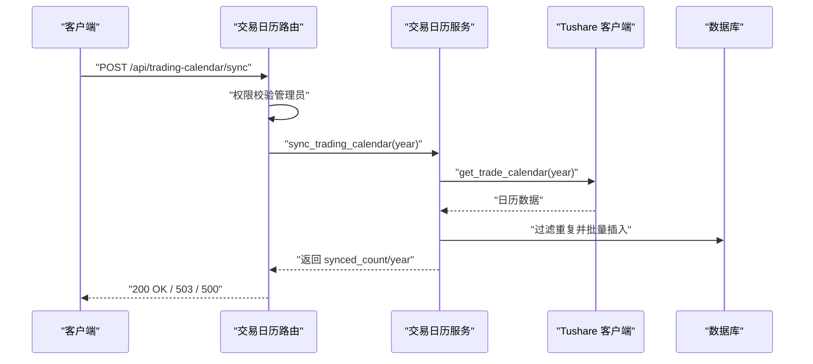
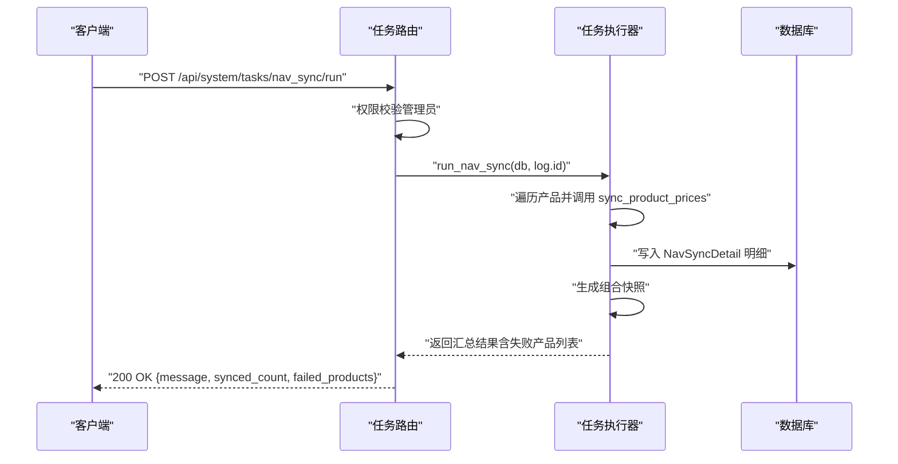

# 数据同步API

<cite>
**本文引用的文件**
- [backend/app/main.py](file://backend/app/main.py)
- [backend/app/routers/market_data.py](file://backend/app/routers/market_data.py)
- [backend/app/routers/sync_jobs.py](file://backend/app/routers/sync_jobs.py)
- [backend/app/routers/products.py](file://backend/app/routers/products.py)
- [backend/app/routers/trades.py](file://backend/app/routers/trades.py)
- [backend/app/routers/tasks.py](file://backend/app/routers/tasks.py)
- [backend/app/services/market_data_service.py](file://backend/app/services/market_data_service.py)
- [backend/app/services/task_runner.py](file://backend/app/services/task_runner.py)
- [backend/app/schemas/market_data.py](file://backend/app/schemas/market_data.py)
- [backend/app/schemas/sync_job.py](file://backend/app/schemas/sync_job.py)
- [backend/app/schemas/product.py](file://backend/app/schemas/product.py)
- [backend/app/schemas/trade.py](file://backend/app/schemas/trade.py)
- [backend/app/models/price_record.py](file://backend/app/models/price_record.py)
- [backend/app/models/product.py](file://backend/app/models/product.py)
- [backend/app/models/sync_job.py](file://backend/app/models/sync_job.py)
- [backend/app/models/nav_sync_detail.py](file://backend/app/models/nav_sync_detail.py)
- [backend/app/routers/trading_calendar.py](file://backend/app/routers/trading_calendar.py)
- [backend/app/services/trading_calendar_service.py](file://backend/app/services/trading_calendar_service.py)
- [backend/app/schemas/trading_calendar.py](file://backend/app/schemas/trading_calendar.py)
- [backend/app/models/trading_calendar.py](file://backend/app/models/trading_calendar.py)
- [backend/app/models/task_execution_log.py](file://backend/app/models/task_execution_log.py)
- [backend/app/services/tushare_client.py](file://backend/app/services/tushare_client.py)
- [backend/app/dependencies.py](file://backend/app/dependencies.py)
- [backend/alembic/versions/0001_sync_job_and_nav_sync_detail_job_id.py](file://backend/alembic/versions/0001_sync_job_and_nav_sync_detail_job_id.py)
</cite>

## 更新摘要
**变更内容**
- **移除组合净值同步端点**：完全删除 `POST /api/market-data/portfolios/{portfolio_code}/sync-nav` 端点和 `sync_portfolio_nav` 函数，因存在严重缺陷包括缺失 snapshot_date 过滤和违反快照不可变性原则
- **净值同步功能迁移**：净值同步功能已迁移到任务系统中，通过 `POST /api/system/tasks/nav_sync/run` 接口调用
- **增强错误追踪机制**：详细的任务执行日志和失败原因记录
- **改进进度监控**：实时跟踪批量同步任务的执行进度和成功率
- **新增并发控制**：单运行锁机制防止重复任务提交
- **完善数据模型**：新增sync_job表和nav_sync_detail表的job_id关联
- **产品管理API增强**：GET /api/products 端点新增 market、data_source、data_source_status 过滤参数
- **交易验证增强**：POST /api/trades 端点对 CN_EXCHANGE 市场交易强制正数价格验证

## 目录
1. [简介](#简介)
2. [项目结构](#项目结构)
3. [核心组件](#核心组件)
4. [架构总览](#架构总览)
5. [详细组件分析](#详细组件分析)
6. [依赖分析](#依赖分析)
7. [性能考虑](#性能考虑)
8. [故障排查指南](#故障排查指南)
9. [结论](#结论)
10. [附录](#附录)

## 简介
本文件为 InvestRing 数据同步模块的完整 API 文档，覆盖以下能力：
- **市场数据同步**：支持手动触发、历史回补、批量导入策略
- **同步作业管理**：新增批量价格同步任务管理、状态查询和进度监控
- **交易日历同步**：按年份同步与查询
- **组合净值同步**：通过任务系统实现，基于持仓与最新价格计算
- **数据质量检查**：通过返回统计与状态字段进行质量核验
- **同步状态与历史**：通过任务日志、明细表与作业系统追踪
- **并发控制与错误恢复**：基于数据库事务、幂等、重试策略与单运行锁
- **产品筛选增强**：支持按市场类型、数据源和数据源状态过滤产品
- **交易验证增强**：场内交易强制正数价格验证，确保数据完整性

**重要变更**：原 `POST /api/market-data/portfolios/{portfolio_code}/sync-nav` 端点已完全移除，净值同步功能现已迁移到任务系统中，通过 `POST /api/system/tasks/nav_sync/run` 接口调用。

本 API 基于 FastAPI 提供，采用 Bearer Token 认证，部分管理类接口要求管理员权限。

## 项目结构
- 路由层：定义 HTTP 接口、参数与权限校验
- 服务层：实现业务逻辑、数据访问与第三方 API 调用
- 模型层：定义数据库表结构与约束
- Schema 层：定义请求/响应模型
- 依赖层：统一认证与权限校验



**图表来源**
- [backend/app/main.py:42-70](file://backend/app/main.py#L42-L70)
- [backend/app/routers/market_data.py:1-111](file://backend/app/routers/market_data.py#L1-L111)
- [backend/app/routers/sync_jobs.py:1-60](file://backend/app/routers/sync_jobs.py#L1-L60)
- [backend/app/routers/products.py:27-54](file://backend/app/routers/products.py#L27-L54)
- [backend/app/routers/trades.py:229-397](file://backend/app/routers/trades.py#L229-L397)
- [backend/app/routers/trading_calendar.py:1-81](file://backend/app/routers/trading_calendar.py#L1-L81)
- [backend/app/routers/tasks.py:1-154](file://backend/app/routers/tasks.py#L1-L154)
- [backend/app/services/market_data_service.py:1-511](file://backend/app/services/market_data_service.py#L1-L511)
- [backend/app/services/task_runner.py:1-320](file://backend/app/services/task_runner.py#L1-L320)
- [backend/app/services/trading_calendar_service.py:1-125](file://backend/app/services/trading_calendar_service.py#L1-L125)
- [backend/app/services/tushare_client.py:1-222](file://backend/app/services/tushare_client.py#L1-L222)
- [backend/app/models/price_record.py:1-28](file://backend/app/models/price_record.py#L1-L28)
- [backend/app/models/product.py:1-22](file://backend/app/models/product.py#L1-L22)
- [backend/app/models/trading_calendar.py:1-13](file://backend/app/models/trading_calendar.py#L1-L13)
- [backend/app/models/task_execution_log.py:1-21](file://backend/app/models/task_execution_log.py#L1-L21)
- [backend/app/models/nav_sync_detail.py:1-18](file://backend/app/models/nav_sync_detail.py#L1-L18)
- [backend/app/models/sync_job.py:1-23](file://backend/app/models/sync_job.py#L1-L23)
- [backend/app/models/trade.py:1-50](file://backend/app/models/trade.py#L1-L50)

**章节来源**
- [backend/app/main.py:42-70](file://backend/app/main.py#L42-L70)

## 核心组件
- 市场数据路由与服务
  - 提供价格数据查询、手动同步、历史回补、净值覆盖率检查
- **同步作业管理路由与服务**（新增）
  - 提供批量价格同步任务提交、状态查询、进度监控和错误追踪
- **任务管理路由**（增强）
  - 提供净值同步、交易日历同步、日志清理等任务执行
- 交易日历路由与服务
  - 提供交易日历查询与按年同步
- 产品管理路由（增强）
  - 提供产品CRUD操作，支持多维度过滤查询
- 交易管理路由（增强）
  - 提供交易CRUD操作，强化价格验证规则
- 第三方数据源客户端
  - 封装 Tushare API 的调用、重试与错误处理

**章节来源**
- [backend/app/routers/market_data.py:17-111](file://backend/app/routers/market_data.py#L17-L111)
- [backend/app/routers/sync_jobs.py:14-60](file://backend/app/routers/sync_jobs.py#L14-60)
- [backend/app/routers/tasks.py:33-98](file://backend/app/routers/tasks.py#L33-98)
- [backend/app/routers/products.py:27-54](file://backend/app/routers/products.py#L27-54)
- [backend/app/routers/trades.py:229-397](file://backend/app/routers/trades.py#L229-397)
- [backend/app/routers/trading_calendar.py:24-81](file://backend/app/routers/trading_calendar.py#L24-81)
- [backend/app/services/market_data_service.py:88-511](file://backend/app/services/market_data_service.py#L88-511)
- [backend/app/services/task_runner.py:74-163](file://backend/app/services/task_runner.py#L74-163)
- [backend/app/services/trading_calendar_service.py:15-125](file://backend/app/services/trading_calendar_service.py#L15-125)
- [backend/app/services/tushare_client.py:123-222](file://backend/app/services/tushare_client.py#L123-222)

## 架构总览
下图展示数据同步的关键交互流程：路由接收请求 → 权限校验 → 服务层调用第三方数据源 → 写入数据库 → 返回结果。**净值同步功能已迁移到任务系统中，不再提供直接的HTTP端点**。



**图表来源**
- [backend/app/routers/market_data.py:55-84](file://backend/app/routers/market_data.py#L55-84)
- [backend/app/routers/tasks.py:33-98](file://backend/app/routers/tasks.py#L33-98)
- [backend/app/services/market_data_service.py:219-227](file://backend/app/services/market_data_service.py#L219-227)
- [backend/app/services/task_runner.py:74-163](file://backend/app/services/task_runner.py#L74-163)
- [backend/app/services/tushare_client.py:123-222](file://backend/app/services/tushare_client.py#L123-222)
- [backend/app/models/price_record.py:5-28](file://backend/app/models/price_record.py#L5-L28)
- [backend/app/models/sync_job.py:5-23](file://backend/app/models/sync_job.py#L5-L23)

## 详细组件分析

### 同步作业管理 API（新增）
- **提交批量价格同步任务**
  - 方法与路径：POST /api/sync-jobs/price
  - 权限：管理员（Bearer Token + role=admin）
  - 请求体：
    - start_date：开始日期（可选，不传则为增量同步）
    - end_date：结束日期（可选）
    - scope：同步范围（all/by_product，默认all）
    - products：指定产品列表（scope=by_product时使用）
  - 响应：包含 job_id、status、message
  - 错误：401 未认证；403 非管理员；409 已有任务在运行中
  - 示例请求：POST /api/sync-jobs/price
    ```json
    {
      "start_date": "2025-01-01",
      "end_date": "2025-01-31",
      "scope": "all",
      "products": []
    }
    ```
  - 示例响应：{"job_id": 123, "status": "pending", "message": "任务已提交"}

- **查询任务状态**
  - 方法与路径：GET /api/sync-jobs/{job_id}
  - 权限：管理员（Bearer Token + role=admin）
  - 响应：完整的任务信息（包含进度统计）
  - 错误：401 未认证；403 非管理员；404 任务不存在
  - 示例请求：GET /api/sync-jobs/123
  - 示例响应：见"附录-请求/响应示例"

- **查询任务详情**
  - 方法与路径：GET /api/sync-jobs/{job_id}/details
  - 权限：管理员（Bearer Token + role=admin）
  - 响应：包含任务信息和逐产品执行明细
  - 错误：401 未认证；403 非管理员；404 任务不存在
  - 示例请求：GET /api/sync-jobs/123/details
  - 示例响应：见"附录-请求/响应示例"



**图表来源**
- [backend/app/routers/sync_jobs.py:14-31](file://backend/app/routers/sync_jobs.py#L14-31)
- [backend/app/services/market_data_service.py:347-379](file://backend/app/services/market_data_service.py#L347-379)

**章节来源**
- [backend/app/routers/sync_jobs.py:14-60](file://backend/app/routers/sync_jobs.py#L14-60)
- [backend/app/schemas/sync_job.py:6-48](file://backend/app/schemas/sync_job.py#L6-48)
- [backend/app/services/market_data_service.py:347-511](file://backend/app/services/market_data_service.py#L347-511)
- [backend/app/models/sync_job.py:5-23](file://backend/app/models/sync_job.py#L5-23)

### 产品管理 API（增强）
- **获取产品列表（增强）**
  - 方法与路径：GET /api/products
  - 权限：需登录（Bearer Token）
  - 查询参数（增强）：
    - product_type：产品类型过滤（可选）
    - market：市场类型过滤（可选）
    - data_source：数据源过滤（可选）
    - data_source_status：数据源状态过滤（可选）
    - page：页码（默认1）
    - page_size：每页数量（默认20）
  - 响应：分页的产品列表（items、total、page、page_size）
  - 示例请求：GET /api/products?market=CN_EXCHANGE&data_source_status=active&page=1&page_size=20
  - 示例响应：见"附录-请求/响应示例"

- **创建产品**
  - 方法与路径：POST /api/products
  - 权限：管理员（Bearer Token + role=admin）
  - 请求体：ProductCreate 模型
  - 响应：创建的产品对象
  - 错误：400 产品已存在；401 未认证；403 非管理员
  - 示例请求：POST /api/products
  - 示例响应：见"附录-请求/响应示例"

- **获取单个产品**
  - 方法与路径：GET /api/products/{code}/{market}
  - 权限：需登录（Bearer Token）
  - 响应：产品对象
  - 错误：404 产品不存在
  - 示例请求：GET /api/products/510300/CN_EXCHANGE
  - 示例响应：见"附录-请求/响应示例"

- **更新产品**
  - 方法与路径：PUT /api/products/{code}/{market}
  - 权限：管理员（Bearer Token + role=admin）
  - 请求体：ProductUpdate 模型
  - 响应：更新后的产品对象
  - 错误：404 产品不存在；401 未认证；403 非管理员
  - 示例请求：PUT /api/products/510300/CN_EXCHANGE
  - 示例响应：见"附录-请求/响应示例"

- **删除产品**
  - 方法与路径：DELETE /api/products/{code}/{market}
  - 权限：管理员（Bearer Token + role=admin）
  - 响应：成功消息
  - 错误：404 产品不存在；401 未认证；403 非管理员
  - 示例请求：DELETE /api/products/510300/CN_EXCHANGE
  - 示例响应：{"message": "Product deleted successfully"}



**图表来源**
- [backend/app/routers/products.py:27-54](file://backend/app/routers/products.py#L27-54)

**章节来源**
- [backend/app/routers/products.py:27-151](file://backend/app/routers/products.py#L27-151)
- [backend/app/schemas/product.py:6-37](file://backend/app/schemas/product.py#L6-37)
- [backend/app/models/product.py:5-22](file://backend/app/models/product.py#L5-22)

### 交易管理 API（增强）
- **创建交易（增强）**
  - 方法与路径：POST /api/trades
  - 权限：管理员（Bearer Token + role=admin）
  - 请求体：TradeCreate 模型
  - 响应：创建的交易对象
  - 错误：404 组合或产品不存在；422 参数验证失败
  - **新增验证规则**：
    - 交易日必须为交易日
    - 组合必须处于激活状态
    - 交易日必须晚于最新快照日
    - **CN_EXCHANGE 市场交易必须提供有效的正数价格**
    - 买入金额必须大于0且不超过可用现金
    - 卖出份额必须大于0且不超过可用份额
  - 示例请求：POST /api/trades
  - 示例响应：见"附录-请求/响应示例"

- **获取交易列表**
  - 方法与路径：GET /api/trades
  - 权限：需登录（Bearer Token）
  - 查询参数：portfolio_code、page、page_size
  - 响应：分页的交易列表
  - 示例请求：GET /api/trades?portfolio_code=P001&page=1&page_size=20
  - 示例响应：见"附录-请求/响应示例"

- **获取单个交易**
  - 方法与路径：GET /api/trades/{id}
  - 权限：需登录（Bearer Token）
  - 响应：交易对象
  - 错误：404 交易不存在
  - 示例请求：GET /api/trades/123
  - 示例响应：见"附录-请求/响应示例"

- **确认交易**
  - 方法与路径：POST /api/trades/{id}/confirm
  - 权限：管理员（Bearer Token + role=admin）
  - 查询参数：confirm_date（可选）、price（可选）
  - 响应：确认结果
  - 错误：404 交易不存在；422 状态无效；422 净值缺失
  - 示例请求：POST /api/trades/123/confirm?price=1.234
  - 示例响应：见"附录-请求/响应示例"

- **取消交易**
  - 方法与路径：POST /api/trades/{id}/cancel
  - 权限：管理员（Bearer Token + role=admin）
  - 响应：取消结果
  - 错误：404 交易不存在；422 状态无效；422 场内交易不可取消
  - 示例请求：POST /api/trades/123/cancel
  - 示例响应：{"message": "Trade cancelled successfully"}

- **取消确认交易**
  - 方法与路径：POST /api/trades/{id}/unconfirm
  - 权限：管理员（Bearer Token + role=admin）
  - 响应：取消确认结果
  - 错误：404 交易不存在；422 状态无效
  - 示例请求：POST /api/trades/123/unconfirm
  - 示例响应：{"message": "Trade unconfirmed successfully"}

- **更新交易**
  - 方法与路径：PUT /api/trades/{id}
  - 权限：管理员（Bearer Token + role=admin）
  - 请求体：TradeUpdate 模型
  - 响应：更新后的交易对象
  - 错误：404 交易不存在；422 已确认交易不可修改
  - 示例请求：PUT /api/trades/123
  - 示例响应：见"附录-请求/响应示例"

- **删除交易**
  - 方法与路径：DELETE /api/trades/{id}
  - 权限：管理员（Bearer Token + role=admin）
  - 响应：删除结果
  - 错误：404 交易不存在；422 已确认交易不可删除
  - 示例请求：DELETE /api/trades/123
  - 示例响应：{"message": "Trade deleted successfully"}



**图表来源**
- [backend/app/routers/trades.py:229-397](file://backend/app/routers/trades.py#L229-397)

**章节来源**
- [backend/app/routers/trades.py:229-614](file://backend/app/routers/trades.py#L229-614)
- [backend/app/schemas/trade.py:6-46](file://backend/app/schemas/trade.py#L6-46)

### 市场数据同步 API
- 价格数据查询
  - 方法与路径：GET /api/market-data/products/{code}/{market}/price-data
  - 权限：需登录（Bearer Token）
  - 查询参数：
    - start_date：开始日期（可选）
    - end_date：结束日期（可选）
    - limit：返回条数上限（默认30，范围1-1000）
  - 响应：价格记录数组（包含 product_code、market、price_date、unit_price）
  - 错误：500 时返回内部错误详情
  - 示例请求：GET /api/market-data/products/123456/CN_EXCHANGE/price-data?start_date=2025-01-01&end_date=2025-01-31&limit=30
  - 示例响应：见"附录-请求/响应示例"

- 净值覆盖率检查
  - 方法与路径：GET /api/market-data/products/{code}/{market}/nav-coverage
  - 权限：需登录（Bearer Token）
  - 查询参数：
    - start_date：开始日期（必填）
    - end_date：结束日期（可选，默认为今天）
  - 响应：覆盖率统计信息（包含 total_trading_days、synced_days、coverage、missing_dates）
  - 错误：404 产品不存在；422 日期范围非法
  - 示例请求：GET /api/market-data/products/510300/CN_EXCHANGE/nav-coverage?start_date=2025-01-01&end_date=2025-01-31
  - 示例响应：见"附录-请求/响应示例"

- 手动触发价格数据同步
  - 方法与路径：POST /api/market-data/products/{code}/{market}/sync-price-data
  - 权限：需登录（Bearer Token）
  - 请求体：可选，包含 start_date、end_date
  - 响应：包含 success、message、synced_count
  - 错误：404 产品不存在；400 参数错误；500 内部错误
  - 示例请求：POST /api/market-data/products/123456/CN_EXCHANGE/sync-price-data
  - 示例响应：见"附录-请求/响应示例"

- 历史回补（默认90天）
  - 方法与路径：POST /api/market-data/products/{code}/{market}/sync-history
  - 权限：需登录（Bearer Token）
  - 行为：自动计算起止日期（今日-90天 至 今日），调用同步接口
  - 响应：包含 success、message、synced_count
  - 错误：404 产品不存在；500 内部错误
  - 示例请求：POST /api/market-data/products/123456/CN_EXCHANGE/sync-history
  - 示例响应：见"附录-请求/响应示例"

**重要变更**：组合净值同步端点 `POST /api/market-data/portfolios/{portfolio_code}/sync-nav` 已完全移除，净值同步功能现已迁移到任务系统中。



**图表来源**
- [backend/app/routers/market_data.py:55-84](file://backend/app/routers/market_data.py#L55-84)
- [backend/app/services/market_data_service.py:144-216](file://backend/app/services/market_data_service.py#L144-216)
- [backend/app/services/tushare_client.py:123-222](file://backend/app/services/tushare_client.py#L123-222)

**章节来源**
- [backend/app/routers/market_data.py:17-111](file://backend/app/routers/market_data.py#L17-111)
- [backend/app/schemas/market_data.py:6-19](file://backend/app/schemas/market_data.py#L6-19)
- [backend/app/services/market_data_service.py:13-227](file://backend/app/services/market_data_service.py#L13-227)
- [backend/app/models/price_record.py:5-28](file://backend/app/models/price_record.py#L5-28)
- [backend/app/models/product.py:5-22](file://backend/app/models/product.py#L5-22)

### 交易日历同步 API
- 交易日历查询
  - 方法与路径：GET /api/trading-calendar
  - 权限：需登录（Bearer Token）
  - 查询参数：
    - year：按年份过滤（可选）
    - start_date：开始日期（可选）
    - end_date：结束日期（可选）
    - is_open：是否开盘（可选）
  - 响应：交易日历数组（包含 date、is_open、created_at）
  - 示例请求：GET /api/trading-calendar?year=2025&is_open=true
  - 示例响应：见"附录-请求/响应示例"

- 同步指定年份交易日历
  - 方法与路径：POST /api/trading-calendar/sync
  - 权限：管理员（Bearer Token + role=admin）
  - 请求体：year（整数）
  - 响应：包含 synced_count、year、message
  - 错误：503 数据源未配置；500 同步失败
  - 示例请求：POST /api/trading-calendar/sync
  - 示例响应：见"附录-请求/响应示例"



**图表来源**
- [backend/app/routers/trading_calendar.py:48-81](file://backend/app/routers/trading_calendar.py#L48-81)
- [backend/app/services/trading_calendar_service.py:15-66](file://backend/app/services/trading_calendar_service.py#L15-66)
- [backend/app/services/tushare_client.py:48-102](file://backend/app/services/tushare_client.py#L48-102)
- [backend/app/models/trading_calendar.py:5-13](file://backend/app/models/trading_calendar.py#L5-13)

**章节来源**
- [backend/app/routers/trading_calendar.py:24-81](file://backend/app/routers/trading_calendar.py#L24-81)
- [backend/app/schemas/trading_calendar.py:6-38](file://backend/app/schemas/trading_calendar.py#L6-38)
- [backend/app/services/trading_calendar_service.py:69-125](file://backend/app/services/trading_calendar_service.py#L69-125)
- [backend/app/models/trading_calendar.py:5-13](file://backend/app/models/trading_calendar.py#L5-13)

### 任务管理与同步历史 API
- 查看任务列表
  - 方法与路径：GET /api/system/tasks
  - 权限：管理员（Bearer Token + role=admin）
  - 响应：分页的任务列表（items、total、page、page_size）

- 手动触发任务
  - 方法与路径：POST /api/system/tasks/{code}/run
  - 权限：管理员（Bearer Token + role=admin）
  - 支持任务：
    - trading_calendar_sync：同步当前年份交易日历
    - nav_sync：**净值同步任务（替代原 portfolios/sync-nav 端点）**
    - log_cleanup：清理过期日志
  - 响应：包含 message、synced_count、products_count、failed_products、snapshots_generated 等（视任务而定）

- 启用/禁用任务
  - 方法与路径：POST /api/system/tasks/{code}/enable | disable
  - 权限：管理员（Bearer Token + role=admin）
  - 响应：确认操作结果

- 查看任务执行日志
  - 方法与路径：GET /api/system/tasks/{code}/logs
  - 权限：管理员（Bearer Token + role=admin）
  - 响应：分页的日志列表（items、total、page、page_size）

**重要变更**：净值同步功能已从 `POST /api/market-data/portfolios/{portfolio_code}/sync-nav` 迁移到 `POST /api/system/tasks/nav_sync/run`。



**图表来源**
- [backend/app/routers/tasks.py:33-98](file://backend/app/routers/tasks.py#L33-98)
- [backend/app/services/task_runner.py:74-163](file://backend/app/services/task_runner.py#L74-163)
- [backend/app/services/market_data_service.py:144-216](file://backend/app/services/market_data_service.py#L144-216)
- [backend/app/models/nav_sync_detail.py:5-18](file://backend/app/models/nav_sync_detail.py#L5-18)
- [backend/app/models/task_execution_log.py:5-21](file://backend/app/models/task_execution_log.py#L5-21)

**章节来源**
- [backend/app/routers/tasks.py:33-154](file://backend/app/routers/tasks.py#L33-154)
- [backend/app/services/task_runner.py:74-320](file://backend/app/services/task_runner.py#L74-320)
- [backend/app/models/nav_sync_detail.py:5-18](file://backend/app/models/nav_sync_detail.py#L5-18)
- [backend/app/models/task_execution_log.py:5-21](file://backend/app/models/task_execution_log.py#L5-21)

## 依赖分析
- 路由与服务耦合
  - 路由层仅负责参数解析与权限校验，业务逻辑集中在服务层，保持高内聚低耦合
- **新增同步作业依赖**
  - 同步作业路由依赖市场数据服务的批量同步功能
  - SyncJob模型与NavSyncDetail建立外键关联关系
- **任务执行器依赖**
  - 任务执行器依赖市场数据服务和快照服务
  - 净值同步任务通过任务系统统一管理
- 第三方依赖
  - Tushare 客户端封装了 API 调用、重试与错误类型化处理
- 数据模型
  - 价格记录与产品模型定义了唯一索引与外键约束，保证数据一致性
  - **新增SyncJob模型支持任务状态管理和进度追踪**
  - **产品模型包含data_source_status字段用于数据源状态管理**
- 权限控制
  - 使用 HTTP Bearer Token，管理员接口通过依赖注入进行角色校验

```mermaid
graph LR
R["路由层"] --> S["服务层"]
S --> T["Tushare 客户端"]
S --> D["数据库模型"]
R -.-> P["权限依赖Bearer Token"]
R4["同步作业路由"] --> S4["同步作业服务"]
S4 --> S1["市场数据服务"]
S4 --> M6["SyncJob模型"]
S4 --> M5["NavSyncDetail模型"]
R3["任务路由"] --> S5["任务执行器"]
S5 --> S1
S5 --> S6["快照服务"]
R5["产品路由"] --> M2["Product模型"]
R6["交易路由"] --> M7["Trade模型"]
M2 --> DS["data_source_status字段"]
```



**图表来源**
- [backend/app/dependencies.py:49-146](file://backend/app/dependencies.py#L49-146)
- [backend/app/routers/market_data.py:1-111](file://backend/app/routers/market_data.py#L1-111)
- [backend/app/routers/sync_jobs.py:1-60](file://backend/app/routers/sync_jobs.py#L1-60)
- [backend/app/routers/tasks.py:1-154](file://backend/app/routers/tasks.py#L1-154)
- [backend/app/routers/products.py:27-54](file://backend/app/routers/products.py#L27-54)
- [backend/app/routers/trades.py:229-397](file://backend/app/routers/trades.py#L229-397)
- [backend/app/routers/trading_calendar.py:1-81](file://backend/app/routers/trading_calendar.py#L1-81)

**章节来源**
- [backend/app/dependencies.py:49-146](file://backend/app/dependencies.py#L49-146)

## 性能考虑
- 批量写入
  - 交易日历服务使用批量插入减少往返次数
  - **同步作业系统支持批量产品同步，提高整体效率**
- 内存去重
  - 价格同步对原始数据按日期去重，避免重复写入
- 事务边界
  - 写入与状态更新在单个事务中完成，确保一致性
- 重试策略
  - Tushare 客户端对网络异常进行指数退避重试，提升稳定性
- 查询优化
  - 价格查询与交易日历查询均支持条件过滤与排序，建议合理使用分页
  - **产品查询支持多维度过滤，提高数据检索效率**
- **并发控制**
  - **新增单运行锁机制，防止多个批量同步任务同时执行**
  - **后台线程池异步执行，避免阻塞HTTP请求**
- **进度监控**
  - **实时跟踪任务执行进度，支持done/total比率显示**
  - **详细的产品级执行状态和错误信息记录**

## 故障排查指南
- 常见错误码与原因
  - 401 未提供或无效 Token
  - 403 非管理员访问管理接口
  - 404 产品/组合不存在或任务不存在
  - 400 参数错误（如日期范围非法）
  - 409 已有同步任务在运行中（新增）
  - 422 参数验证失败（如非交易日、场内交易价格无效等）
  - 500 内部错误（数据库写入异常、第三方 API 异常）
  - 503 数据源未配置（交易日历同步）
- **新增错误追踪机制**
  - **SyncJob.error_message字段记录任务执行过程中的详细错误信息**
  - **NavSyncDetail.error_message字段记录每个产品的具体失败原因**
  - **任务状态包括：pending、running、success、partial、failed、interrupted**
- **新增交易验证错误**
  - **MISSING_OR_INVALID_PRICE：场内交易缺少有效价格**
  - **NON_TRADING_DAY：非交易日交易**
  - **PORTFOLIO_NOT_ACTIVE：组合未激活**
  - **DATE_BEFORE_SNAPSHOT：交易日早于最新快照日**
- 错误恢复机制
  - 服务层捕获异常并回滚事务，必要时更新产品状态为 failed
  - 任务执行日志记录错误堆栈与消息，便于定位问题
  - Tushare 客户端对网络异常进行重试，降低瞬时故障影响
  - **孤儿任务恢复：系统启动时自动检测并标记中断的running任务**
- 建议排查步骤
  - 检查 Bearer Token 是否有效且未加入黑名单
  - 核对产品/组合是否存在且状态正常
  - 查看任务执行日志与净值同步明细表
  - **使用GET /api/sync-jobs/{job_id}/details获取详细的执行明细**
  - **验证场内交易是否提供了有效的正数价格**
  - 确认 .env 中 TUSHARE_TOKEN 已正确配置
  - **注意：原 portfolios/sync-nav 端点已移除，请使用 tasks/nav_sync/run 替代**

**章节来源**
- [backend/app/routers/market_data.py:37-84](file://backend/app/routers/market_data.py#L37-84)
- [backend/app/routers/sync_jobs.py:30-31](file://backend/app/routers/sync_jobs.py#L30-31)
- [backend/app/routers/trading_calendar.py:66-80](file://backend/app/routers/trading_calendar.py#L66-80)
- [backend/app/routers/products.py:27-54](file://backend/app/routers/products.py#L27-54)
- [backend/app/routers/trades.py:229-397](file://backend/app/routers/trades.py#L229-397)
- [backend/app/routers/tasks.py:33-98](file://backend/app/routers/tasks.py#L33-98)
- [backend/app/services/market_data_service.py:210-215](file://backend/app/services/market_data_service.py#L210-215)
- [backend/app/services/market_data_service.py:496-511](file://backend/app/services/market_data_service.py#L496-511)
- [backend/app/services/tushare_client.py:38-46](file://backend/app/services/tushare_client.py#L38-46)
- [backend/app/models/task_execution_log.py:5-21](file://backend/app/models/task_execution_log.py#L5-21)
- [backend/app/models/nav_sync_detail.py:5-18](file://backend/app/models/nav_sync_detail.py#L5-18)
- [backend/app/models/sync_job.py:5-23](file://backend/app/models/sync_job.py#L5-23)

## 结论
本数据同步 API 提供了从交易日历、价格数据到组合净值的全链路同步能力，具备完善的权限控制、错误处理与可观测性。**净值同步功能已从直接HTTP端点迁移到任务系统中，大幅增强了批量数据处理能力，支持任务提交、进度监控、错误追踪和并发控制**。通过任务调度、作业系统和明细记录，可实现对批量同步过程的可视化、审计和故障诊断。**产品管理API的多维度过滤功能和交易管理的严格价格验证进一步提升了系统的灵活性和数据完整性**。

**重要说明**：原 `POST /api/market-data/portfolios/{portfolio_code}/sync-nav` 端点已完全移除，净值同步功能现已通过 `POST /api/system/tasks/nav_sync/run` 接口提供，具有更好的错误处理和进度监控能力。

## 附录

### 请求/响应示例
- **产品列表查询（增强）**
  - 请求：GET /api/products?market=CN_EXCHANGE&data_source=tushare&data_source_status=active&page=1&page_size=20
  - 响应：{"items": [...], "total": 150, "page": 1, "page_size": 20}

- **创建产品**
  - 请求：POST /api/products
    - 请求体：{"code": "510300", "market": "CN_EXCHANGE", "name": "沪深300ETF", "product_type": "LOF", "data_source": "tushare"}
  - 响应：{"code": "510300", "market": "CN_EXCHANGE", "name": "沪深300ETF", "product_type": "LOF", "data_source": "tushare", "data_source_status": "pending", ...}

- **获取单个产品**
  - 请求：GET /api/products/510300/CN_EXCHANGE
  - 响应：{"code": "510300", "market": "CN_EXCHANGE", "name": "沪深300ETF", "product_type": "LOF", "data_source": "tushare", "data_source_status": "active", ...}

- **更新产品**
  - 请求：PUT /api/products/510300/CN_EXCHANGE
    - 请求体：{"name": "沪深300ETF基金", "is_qdii": false}
  - 响应：{"code": "510300", "market": "CN_EXCHANGE", "name": "沪深300ETF基金", "product_type": "LOF", "confirm_days": 0, ...}

- **删除产品**
  - 请求：DELETE /api/products/510300/CN_EXCHANGE
  - 响应：{"message": "Product deleted successfully"}

- **创建交易（增强）**
  - 请求：POST /api/trades
    - 请求体：{"portfolio_code": "P001", "product_code": "510300", "market": "CN_EXCHANGE", "trade_type": "buy", "amount": 10000, "price": 3.5, "fee": 10, "actual_amount": 10010, "trade_date": "2025-01-15"}
  - 响应：{"id": 123, "portfolio_code": "P001", "product_code": "510300", "market": "CN_EXCHANGE", "trade_type": "buy", "shares": 2857.14, "amount": 10000, "price": 3.5, "fee": 10, "actual_amount": 10010, "status": "pending", ...}

- **交易验证错误示例**
  - 请求：POST /api/trades（缺少价格）
    - 请求体：{"portfolio_code": "P001", "product_code": "510300", "market": "CN_EXCHANGE", "trade_type": "buy", "amount": 10000, "fee": 10, "actual_amount": 10010, "trade_date": "2025-01-15"}
  - 响应：{"error": "MISSING_OR_INVALID_PRICE", "message": "场内交易必须提供有效的正数交易价格（--price）"}

- 价格数据查询
  - 请求：GET /api/market-data/products/123456/CN_EXCHANGE/price-data?start_date=2025-01-01&end_date=2025-01-31&limit=30
  - 响应：包含若干条记录，每条包含 product_code、market、price_date、unit_price

- 净值覆盖率检查
  - 请求：GET /api/market-data/products/510300/CN_EXCHANGE/nav-coverage?start_date=2025-01-01&end_date=2025-01-31
  - 响应：{"product_code": "510300", "market": "CN_EXCHANGE", "start_date": "2025-01-01", "end_date": "2025-01-31", "total_trading_days": 22, "synced_days": 20, "coverage": 0.9091, "missing_dates": ["2025-01-06", "2025-01-07"]}

- 手动触发价格数据同步
  - 请求：POST /api/market-data/products/123456/CN_EXCHANGE/sync-price-data
    - 请求体：{"start_date":"2025-01-01","end_date":"2025-01-31"}
  - 响应：{"success":true,"message":"成功同步 X 条价格数据","synced_count":X}

- 历史回补
  - 请求：POST /api/market-data/products/123456/CN_EXCHANGE/sync-history
  - 响应：{"success":true,"message":"无新数据需要同步...","synced_count":0}

- **净值同步任务（替代原 portfolios/sync-nav 端点）**
  - 请求：POST /api/system/tasks/nav_sync/run
  - 响应：{"message": "任务 nav_sync 执行完成", "synced_count": 150, "products_count": 150, "failed_products": [], "dividends_detected": 3, "snapshots_generated": 10, "target_date": "2025-01-15"}

- **新增：提交批量同步任务**
  - 请求：POST /api/sync-jobs/price
    - 请求体：{"start_date":"2025-01-01","end_date":"2025-01-31","scope":"all"}
  - 响应：{"job_id":123,"status":"pending","message":"任务已提交"}

- **新增：查询任务状态**
  - 请求：GET /api/sync-jobs/123
  - 响应：{"id":123,"job_type":"price_history_sync","status":"running","total":123,"done":45,"success_count":42,"failed_count":3,"skipped_count":0,...}

- **新增：查询任务详情**
  - 请求：GET /api/sync-jobs/123/details
  - 响应：{"job":{"id":123,...},"details":[{"product_code":"510300.SH","market":"CN_EXCHANGE","status":"success","synced_count":100,...},{"product_code":"000300.OF","market":"CN_OTC","status":"failed","error_message":"API超时",...}]}

- 交易日历查询
  - 请求：GET /api/trading-calendar?year=2025&is_open=true
  - 响应：包含若干条记录，每条包含 date、is_open、created_at

- 同步交易日历
  - 请求：POST /api/trading-calendar/sync
    - 请求体：{"year":2025}
  - 响应：{"synced_count":244,"year":2025,"message":"交易日历同步成功"}

- 任务管理
  - 触发任务：POST /api/system/tasks/nav_sync/run
  - 响应：包含 message、synced_count、failed_products、snapshots_generated 等

**章节来源**
- [backend/app/routers/products.py:27-151](file://backend/app/routers/products.py#L27-151)
- [backend/app/routers/trades.py:229-614](file://backend/app/routers/trades.py#L229-614)
- [backend/app/routers/market_data.py:17-111](file://backend/app/routers/market_data.py#L17-111)
- [backend/app/routers/sync_jobs.py:14-60](file://backend/app/routers/sync_jobs.py#L14-60)
- [backend/app/routers/trading_calendar.py:24-81](file://backend/app/routers/trading_calendar.py#L24-81)
- [backend/app/routers/tasks.py:33-154](file://backend/app/routers/tasks.py#L33-154)