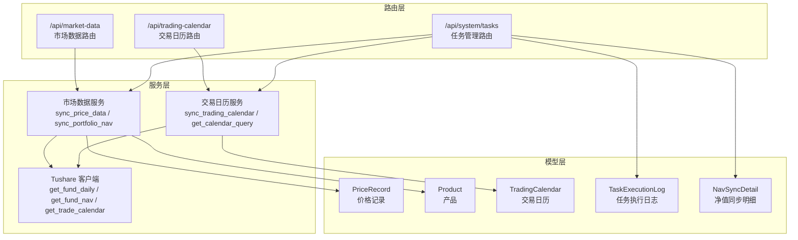
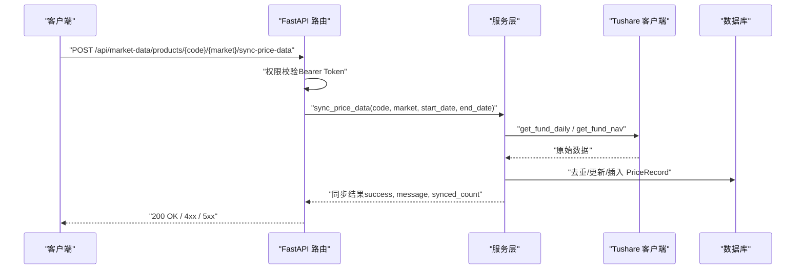
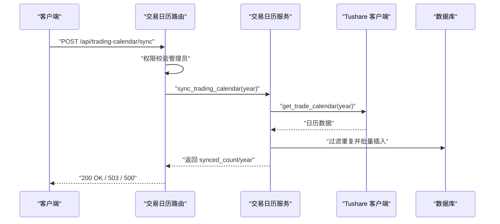
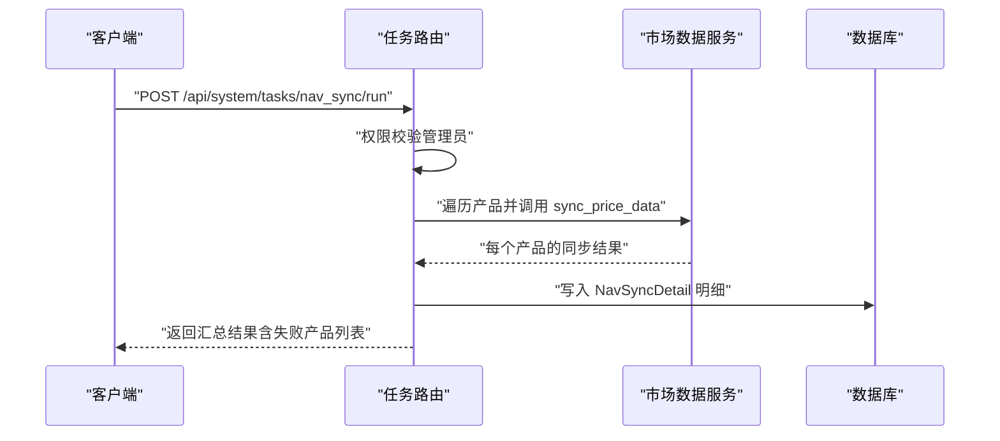
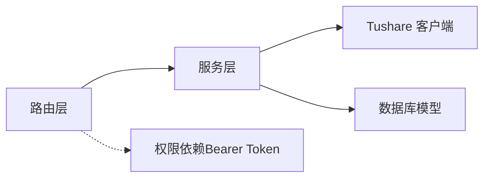

# 数据同步API

<cite>
**本文引用的文件**
- [backend/app/main.py](file://backend/app/main.py)
- [backend/app/routers/market_data.py](file://backend/app/routers/market_data.py)
- [backend/app/services/market_data_service.py](file://backend/app/services/market_data_service.py)
- [backend/app/schemas/market_data.py](file://backend/app/schemas/market_data.py)
- [backend/app/models/price_record.py](file://backend/app/models/price_record.py)
- [backend/app/models/product.py](file://backend/app/models/product.py)
- [backend/app/routers/trading_calendar.py](file://backend/app/routers/trading_calendar.py)
- [backend/app/services/trading_calendar_service.py](file://backend/app/services/trading_calendar_service.py)
- [backend/app/schemas/trading_calendar.py](file://backend/app/schemas/trading_calendar.py)
- [backend/app/models/trading_calendar.py](file://backend/app/models/trading_calendar.py)
- [backend/app/routers/tasks.py](file://backend/app/routers/tasks.py)
- [backend/app/models/task_execution_log.py](file://backend/app/models/task_execution_log.py)
- [backend/app/models/nav_sync_detail.py](file://backend/app/models/nav_sync_detail.py)
- [backend/app/services/tushare_client.py](file://backend/app/services/tushare_client.py)
- [backend/app/dependencies.py](file://backend/app/dependencies.py)
</cite>

## 目录
1. [简介](#简介)
2. [项目结构](#项目结构)
3. [核心组件](#核心组件)
4. [架构总览](#架构总览)
5. [详细组件分析](#详细组件分析)
6. [依赖分析](#依赖分析)
7. [性能考虑](#性能考虑)
8. [故障排查指南](#故障排查指南)
9. [结论](#结论)
10. [附录](#附录)

## 简介
本文件为 InvestRing 数据同步模块的完整 API 文档，覆盖以下能力：
- 市场数据同步：支持手动触发、历史回补、批量导入策略
- 交易日历同步：按年份同步与查询
- 组合净值同步：基于持仓与最新价格计算
- 数据质量检查：通过返回统计与状态字段进行质量核验
- 同步状态与历史：通过任务日志与明细表追踪
- 并发控制与错误恢复：基于数据库事务、幂等与重试策略

本 API 基于 FastAPI 提供，采用 Bearer Token 认证，部分管理类接口要求管理员权限。

## 项目结构
- 路由层：定义 HTTP 接口、参数与权限校验
- 服务层：实现业务逻辑、数据访问与第三方 API 调用
- 模型层：定义数据库表结构与约束
- Schema 层：定义请求/响应模型
- 依赖层：统一认证与权限校验

**图表来源**
- [backend/app/main.py:32-48](file://backend/app/main.py#L32-L48)
- [backend/app/routers/market_data.py:1-112](file://backend/app/routers/market_data.py#L1-L112)
- [backend/app/routers/trading_calendar.py:1-81](file://backend/app/routers/trading_calendar.py#L1-L81)
- [backend/app/routers/tasks.py:1-323](file://backend/app/routers/tasks.py#L1-L323)
- [backend/app/services/market_data_service.py:1-323](file://backend/app/services/market_data_service.py#L1-L323)
- [backend/app/services/trading_calendar_service.py:1-125](file://backend/app/services/trading_calendar_service.py#L1-L125)
- [backend/app/services/tushare_client.py:1-222](file://backend/app/services/tushare_client.py#L1-L222)
- [backend/app/models/price_record.py:1-28](file://backend/app/models/price_record.py#L1-L28)
- [backend/app/models/product.py:1-22](file://backend/app/models/product.py#L1-L22)
- [backend/app/models/trading_calendar.py:1-13](file://backend/app/models/trading_calendar.py#L1-L13)
- [backend/app/models/task_execution_log.py:1-21](file://backend/app/models/task_execution_log.py#L1-L21)
- [backend/app/models/nav_sync_detail.py:1-18](file://backend/app/models/nav_sync_detail.py#L1-L18)

**章节来源**
- [backend/app/main.py:32-48](file://backend/app/main.py#L32-L48)

## 核心组件
- 市场数据路由与服务
  - 提供价格数据查询、手动同步、历史回补、组合净值同步
- 交易日历路由与服务
  - 提供交易日历查询与按年同步
- 任务管理路由
  - 提供手动触发任务、查看任务日志、启用/禁用任务
- 第三方数据源客户端
  - 封装 Tushare API 的调用、重试与错误处理

**章节来源**
- [backend/app/routers/market_data.py:17-112](file://backend/app/routers/market_data.py#L17-L112)
- [backend/app/services/market_data_service.py:88-323](file://backend/app/services/market_data_service.py#L88-L323)
- [backend/app/routers/trading_calendar.py:24-81](file://backend/app/routers/trading_calendar.py#L24-L81)
- [backend/app/services/trading_calendar_service.py:15-125](file://backend/app/services/trading_calendar_service.py#L15-L125)
- [backend/app/routers/tasks.py:88-323](file://backend/app/routers/tasks.py#L88-L323)
- [backend/app/services/tushare_client.py:123-222](file://backend/app/services/tushare_client.py#L123-L222)

## 架构总览
下图展示数据同步的关键交互流程：路由接收请求 → 权限校验 → 服务层调用第三方数据源 → 写入数据库 → 返回结果。

**图表来源**
- [backend/app/routers/market_data.py:43-68](file://backend/app/routers/market_data.py#L43-L68)
- [backend/app/services/market_data_service.py:88-226](file://backend/app/services/market_data_service.py#L88-L226)
- [backend/app/services/tushare_client.py:123-222](file://backend/app/services/tushare_client.py#L123-L222)
- [backend/app/models/price_record.py:5-28](file://backend/app/models/price_record.py#L5-L28)

## 详细组件分析

### 市场数据同步 API
- 价格数据查询
  - 方法与路径：GET /api/market-data/products/{code}/{market}/price-data
  - 权限：需登录（Bearer Token）
  - 查询参数：
    - start_date：开始日期（可选）
    - end_date：结束日期（可选）
    - limit：返回条数上限（默认30，范围1-365）
  - 响应：价格记录数组（包含 product_code、market、date、unit_price）
  - 错误：500 时返回内部错误详情
  - 示例请求：GET /api/market-data/products/123456/CN_EXCHANGE/price-data?start_date=2025-01-01&end_date=2025-01-31&limit=30
  - 示例响应：见“附录-请求/响应示例”

- 手动触发价格数据同步
  - 方法与路径：POST /api/market-data/products/{code}/{market}/sync-price-data
  - 权限：需登录（Bearer Token）
  - 请求体：可选，包含 start_date、end_date
  - 响应：包含 success、message、synced_count
  - 错误：404 产品不存在；400 参数错误；500 内部错误
  - 示例请求：POST /api/market-data/products/123456/CN_EXCHANGE/sync-price-data
  - 示例响应：见“附录-请求/响应示例”

- 历史回补（默认90天）
  - 方法与路径：POST /api/market-data/products/{code}/{market}/sync-history
  - 权限：需登录（Bearer Token）
  - 行为：自动计算起止日期（今日-90天 至 今日），调用同步接口
  - 响应：包含 success、message、synced_count
  - 错误：404 产品不存在；500 内部错误
  - 示例请求：POST /api/market-data/products/123456/CN_EXCHANGE/sync-history
  - 示例响应：见“附录-请求/响应示例”

- 组合净值同步
  - 方法与路径：POST /api/market-data/portfolios/{portfolio_code}/sync-nav
  - 权限：需登录（Bearer Token）
  - 行为：根据组合持仓与最新价格计算净值，并写入快照
  - 响应：包含 success、message、total_value、total_shares、unit_price
  - 错误：404 组合不存在或未激活；500 内部错误
  - 示例请求：POST /api/market-data/portfolios/P001/sync-nav
  - 示例响应：见“附录-请求/响应示例”

**图表来源**
- [backend/app/routers/market_data.py:43-92](file://backend/app/routers/market_data.py#L43-L92)
- [backend/app/services/market_data_service.py:88-226](file://backend/app/services/market_data_service.py#L88-L226)
- [backend/app/services/tushare_client.py:123-222](file://backend/app/services/tushare_client.py#L123-L222)

**章节来源**
- [backend/app/routers/market_data.py:17-112](file://backend/app/routers/market_data.py#L17-L112)
- [backend/app/schemas/market_data.py:6-19](file://backend/app/schemas/market_data.py#L6-L19)
- [backend/app/services/market_data_service.py:15-323](file://backend/app/services/market_data_service.py#L15-L323)
- [backend/app/models/price_record.py:5-28](file://backend/app/models/price_record.py#L5-L28)
- [backend/app/models/product.py:5-22](file://backend/app/models/product.py#L5-L22)

### 交易日历同步 API
- 交易日历查询
  - 方法与路径：GET /api/trading-calendar
  - 权限：需登录（Bearer Token）
  - 查询参数：
    - year：按年份过滤（可选）
    - start_date：开始日期（可选）
    - end_date：结束日期（可选）
    - is_open：是否开盘（可选）
  - 响应：交易日历数组（包含 date、is_open、created_at）
  - 示例请求：GET /api/trading-calendar?year=2025&is_open=true
  - 示例响应：见“附录-请求/响应示例”

- 同步指定年份交易日历
  - 方法与路径：POST /api/trading-calendar/sync
  - 权限：管理员（Bearer Token + role=admin）
  - 请求体：year（整数）
  - 响应：包含 synced_count、year、message
  - 错误：503 数据源未配置；500 同步失败
  - 示例请求：POST /api/trading-calendar/sync
  - 示例响应：见“附录-请求/响应示例”

**图表来源**
- [backend/app/routers/trading_calendar.py:48-81](file://backend/app/routers/trading_calendar.py#L48-L81)
- [backend/app/services/trading_calendar_service.py:15-66](file://backend/app/services/trading_calendar_service.py#L15-L66)
- [backend/app/services/tushare_client.py:48-102](file://backend/app/services/tushare_client.py#L48-L102)
- [backend/app/models/trading_calendar.py:5-13](file://backend/app/models/trading_calendar.py#L5-L13)

**章节来源**
- [backend/app/routers/trading_calendar.py:24-81](file://backend/app/routers/trading_calendar.py#L24-L81)
- [backend/app/schemas/trading_calendar.py:6-38](file://backend/app/schemas/trading_calendar.py#L6-L38)
- [backend/app/services/trading_calendar_service.py:69-125](file://backend/app/services/trading_calendar_service.py#L69-L125)
- [backend/app/models/trading_calendar.py:5-13](file://backend/app/models/trading_calendar.py#L5-L13)

### 任务管理与同步历史 API
- 查看任务列表
  - 方法与路径：GET /api/system/tasks
  - 权限：管理员（Bearer Token + role=admin）
  - 响应：分页的任务列表（items、total、page、page_size）

- 手动触发任务
  - 方法与路径：POST /api/system/tasks/{code}/run
  - 权限：管理员（Bearer Token + role=admin）
  - 支持任务：
    - trading_calendar_sync：同步当前年份交易日历
    - nav_sync：批量同步产品净值（默认最近7天）
    - log_cleanup：清理过期日志
  - 响应：包含 message、synced_count、products_count、failed_products、snapshots_generated 等（视任务而定）

- 启用/禁用任务
  - 方法与路径：POST /api/system/tasks/{code}/enable | disable
  - 权限：管理员（Bearer Token + role=admin）
  - 响应：确认操作结果

- 查看任务执行日志
  - 方法与路径：GET /api/system/tasks/{code}/logs
  - 权限：管理员（Bearer Token + role=admin）
  - 响应：分页的日志列表（items、total、page、page_size）

**图表来源**
- [backend/app/routers/tasks.py:88-268](file://backend/app/routers/tasks.py#L88-L268)
- [backend/app/services/market_data_service.py:88-226](file://backend/app/services/market_data_service.py#L88-L226)
- [backend/app/models/nav_sync_detail.py:5-18](file://backend/app/models/nav_sync_detail.py#L5-L18)
- [backend/app/models/task_execution_log.py:5-21](file://backend/app/models/task_execution_log.py#L5-L21)

**章节来源**
- [backend/app/routers/tasks.py:70-323](file://backend/app/routers/tasks.py#L70-L323)
- [backend/app/models/nav_sync_detail.py:5-18](file://backend/app/models/nav_sync_detail.py#L5-L18)
- [backend/app/models/task_execution_log.py:5-21](file://backend/app/models/task_execution_log.py#L5-L21)

## 依赖分析
- 路由与服务耦合
  - 路由层仅负责参数解析与权限校验，业务逻辑集中在服务层，保持高内聚低耦合
- 第三方依赖
  - Tushare 客户端封装了 API 调用、重试与错误类型化处理
- 数据模型
  - 价格记录与产品模型定义了唯一索引与外键约束，保证数据一致性
- 权限控制
  - 使用 HTTP Bearer Token，管理员接口通过依赖注入进行角色校验

**图表来源**
- [backend/app/dependencies.py:49-146](file://backend/app/dependencies.py#L49-L146)
- [backend/app/routers/market_data.py:1-112](file://backend/app/routers/market_data.py#L1-L112)
- [backend/app/routers/trading_calendar.py:1-81](file://backend/app/routers/trading_calendar.py#L1-L81)
- [backend/app/routers/tasks.py:1-323](file://backend/app/routers/tasks.py#L1-L323)

**章节来源**
- [backend/app/dependencies.py:49-146](file://backend/app/dependencies.py#L49-L146)

## 性能考虑
- 批量写入
  - 交易日历服务使用批量插入减少往返次数
- 内存去重
  - 价格同步对原始数据按日期去重，避免重复写入
- 事务边界
  - 写入与状态更新在单个事务中完成，确保一致性
- 重试策略
  - Tushare 客户端对网络异常进行指数退避重试，提升稳定性
- 查询优化
  - 价格查询与交易日历查询均支持条件过滤与排序，建议合理使用分页

[本节为通用指导，无需特定文件引用]

## 故障排查指南
- 常见错误码与原因
  - 401 未提供或无效 Token
  - 403 非管理员访问管理接口
  - 404 产品/组合不存在或任务不存在
  - 400 参数错误（如日期范围非法）
  - 500 内部错误（数据库写入异常、第三方 API 异常）
  - 503 数据源未配置（交易日历同步）
- 错误恢复机制
  - 服务层捕获异常并回滚事务，必要时更新产品状态为 failed
  - 任务执行日志记录错误堆栈与消息，便于定位问题
  - Tushare 客户端对网络异常进行重试，降低瞬时故障影响
- 建议排查步骤
  - 检查 Bearer Token 是否有效且未加入黑名单
  - 核对产品/组合是否存在且状态正常
  - 查看任务执行日志与净值同步明细表
  - 确认 .env 中 TUSHARE_TOKEN 已正确配置

**章节来源**
- [backend/app/routers/market_data.py:37-67](file://backend/app/routers/market_data.py#L37-L67)
- [backend/app/routers/trading_calendar.py:66-80](file://backend/app/routers/trading_calendar.py#L66-L80)
- [backend/app/services/market_data_service.py:210-215](file://backend/app/services/market_data_service.py#L210-L215)
- [backend/app/services/tushare_client.py:38-46](file://backend/app/services/tushare_client.py#L38-L46)
- [backend/app/models/task_execution_log.py:5-21](file://backend/app/models/task_execution_log.py#L5-L21)
- [backend/app/models/nav_sync_detail.py:5-18](file://backend/app/models/nav_sync_detail.py#L5-L18)

## 结论
本数据同步 API 提供了从交易日历、价格数据到组合净值的全链路同步能力，具备完善的权限控制、错误处理与可观测性。通过任务调度与明细记录，可实现对批量同步过程的可视化与审计。

[本节为总结，无需特定文件引用]

## 附录

### 请求/响应示例
- 价格数据查询
  - 请求：GET /api/market-data/products/123456/CN_EXCHANGE/price-data?start_date=2025-01-01&end_date=2025-01-31&limit=30
  - 响应：包含若干条记录，每条包含 product_code、market、date、unit_price

- 手动触发价格数据同步
  - 请求：POST /api/market-data/products/123456/CN_EXCHANGE/sync-price-data
    - 请求体：{"start_date":"2025-01-01","end_date":"2025-01-31"}
  - 响应：{"success":true,"message":"成功同步 X 条价格数据","synced_count":X}

- 历史回补
  - 请求：POST /api/market-data/products/123456/CN_EXCHANGE/sync-history
  - 响应：{"success":true,"message":"无新数据需要同步...","synced_count":0}

- 组合净值同步
  - 请求：POST /api/market-data/portfolios/P001/sync-nav
  - 响应：{"success":true,"message":"组合净值已更新","total_value":XXX,"total_shares":XXX,"unit_price":XXX}

- 交易日历查询
  - 请求：GET /api/trading-calendar?year=2025&is_open=true
  - 响应：包含若干条记录，每条包含 date、is_open、created_at

- 同步交易日历
  - 请求：POST /api/trading-calendar/sync
    - 请求体：{"year":2025}
  - 响应：{"synced_count":244,"year":2025,"message":"交易日历同步成功"}

- 任务管理
  - 触发任务：POST /api/system/tasks/nav_sync/run
  - 响应：包含 message、synced_count、failed_products、snapshots_generated 等

**章节来源**
- [backend/app/routers/market_data.py:17-112](file://backend/app/routers/market_data.py#L17-L112)
- [backend/app/routers/trading_calendar.py:24-81](file://backend/app/routers/trading_calendar.py#L24-L81)
- [backend/app/routers/tasks.py:88-268](file://backend/app/routers/tasks.py#L88-L268)