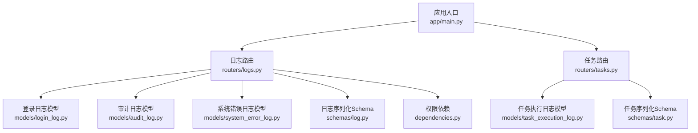
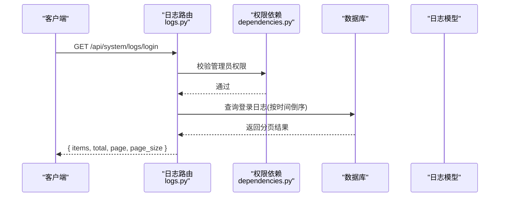
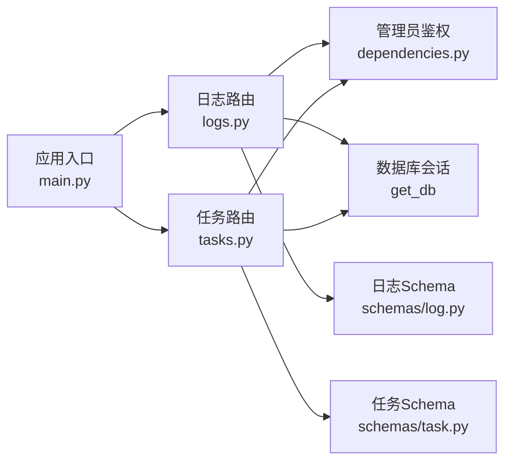

# 日志管理API

<cite>
**本文引用的文件**
- [backend/app/routers/logs.py](file://backend/app/routers/logs.py)
- [backend/app/schemas/log.py](file://backend/app/schemas/log.py)
- [backend/app/models/login_log.py](file://backend/app/models/login_log.py)
- [backend/app/models/audit_log.py](file://backend/app/models/audit_log.py)
- [backend/app/models/system_error_log.py](file://backend/app/models/system_error_log.py)
- [backend/app/models/task_execution_log.py](file://backend/app/models/task_execution_log.py)
- [backend/app/dependencies.py](file://backend/app/dependencies.py)
- [backend/app/main.py](file://backend/app/main.py)
- [backend/app/routers/tasks.py](file://backend/app/routers/tasks.py)
- [backend/app/schemas/task.py](file://backend/app/schemas/task.py)
- [Docs/07-日志系统设计.md](file://Docs/07-日志系统设计.md)
</cite>

## 目录
1. [简介](#简介)
2. [项目结构](#项目结构)
3. [核心组件](#核心组件)
4. [架构总览](#架构总览)
5. [详细组件分析](#详细组件分析)
6. [依赖分析](#依赖分析)
7. [性能考虑](#性能考虑)
8. [故障排查指南](#故障排查指南)
9. [结论](#结论)
10. [附录](#附录)

## 简介
本文件为 InvestRing 日志管理模块的详细API文档，覆盖系统日志、审计日志、任务执行日志、系统错误日志等接口，说明HTTP方法、URL模式、请求/响应格式、权限要求，并提供日志查询、过滤、分页等能力说明。同时结合设计文档，阐述日志保留策略、清理任务及性能优化与存储管理机制。

## 项目结构
日志管理API位于后端FastAPI应用中，通过统一的路由前缀进行组织，核心文件包括：
- 路由定义：/api/system/logs
- 数据模型：登录日志、审计日志、系统错误日志、任务执行日志
- 序列化Schema：各日志类型的响应模型
- 权限依赖：管理员鉴权
- 应用入口：注册路由与中间件

图表来源
- [backend/app/main.py:45](file://backend/app/main.py#L45)
- [backend/app/routers/logs.py:11](file://backend/app/routers/logs.py#L11)
- [backend/app/routers/tasks.py:16](file://backend/app/routers/tasks.py#L16)
- [backend/app/models/login_log.py:5](file://backend/app/models/login_log.py#L5)
- [backend/app/models/audit_log.py:5](file://backend/app/models/audit_log.py#L5)
- [backend/app/models/system_error_log.py:5](file://backend/app/models/system_error_log.py#L5)
- [backend/app/models/task_execution_log.py:5](file://backend/app/models/task_execution_log.py#L5)
- [backend/app/schemas/log.py:6](file://backend/app/schemas/log.py#L6)
- [backend/app/schemas/task.py:6](file://backend/app/schemas/task.py#L6)
- [backend/app/dependencies.py:114](file://backend/app/dependencies.py#L114)

章节来源
- [backend/app/main.py:45](file://backend/app/main.py#L45)
- [backend/app/routers/logs.py:11](file://backend/app/routers/logs.py#L11)
- [backend/app/routers/tasks.py:16](file://backend/app/routers/tasks.py#L16)

## 核心组件
- 日志路由模块：提供登录日志、审计日志、系统错误日志的分页查询接口，均需管理员权限。
- 日志模型：对应数据库表结构，包含基础字段与索引设计。
- 日志Schema：定义响应模型，确保对外输出字段一致。
- 权限依赖：管理员鉴权，确保敏感日志仅管理员可见。
- 任务日志模块：提供任务列表、手动触发、启停任务、执行历史查询等接口；包含日志清理任务。

章节来源
- [backend/app/routers/logs.py:25](file://backend/app/routers/logs.py#L25)
- [backend/app/routers/logs.py:36](file://backend/app/routers/logs.py#L36)
- [backend/app/routers/logs.py:47](file://backend/app/routers/logs.py#L47)
- [backend/app/models/login_log.py:5](file://backend/app/models/login_log.py#L5)
- [backend/app/models/audit_log.py:5](file://backend/app/models/audit_log.py#L5)
- [backend/app/models/system_error_log.py:5](file://backend/app/models/system_error_log.py#L5)
- [backend/app/schemas/log.py:6](file://backend/app/schemas/log.py#L6)
- [backend/app/dependencies.py:114](file://backend/app/dependencies.py#L114)
- [backend/app/routers/tasks.py:70](file://backend/app/routers/tasks.py#L70)
- [backend/app/routers/tasks.py:300](file://backend/app/routers/tasks.py#L300)

## 架构总览
日志管理API遵循“路由-依赖-模型-Schema”的分层设计，统一通过/admin权限校验，返回标准化分页结构。

图表来源
- [backend/app/routers/logs.py:25](file://backend/app/routers/logs.py#L25)
- [backend/app/dependencies.py:114](file://backend/app/dependencies.py#L114)

## 详细组件分析

### 登录日志接口
- 功能：查询登录日志列表，支持分页。
- 权限：管理员。
- URL：/api/system/logs/login
- 方法：GET
- 查询参数：
  - page：页码，默认1
  - page_size：每页数量，默认20
- 响应：分页对象，包含items、total、page、page_size
- 响应字段（LoginLogResponse）：id、investor_code、action、status、ip_address、user_agent、failure_reason、created_at

请求示例
- GET /api/system/logs/login?page=1&page_size=20

响应示例
- {
  "items": [
    {
      "id": 1,
      "investor_code": "INV001",
      "action": "login",
      "status": "success",
      "ip_address": "192.168.1.1",
      "user_agent": "Mozilla/5.0...",
      "failure_reason": null,
      "created_at": "2026-04-24T12:00:00Z"
    }
  ],
  "total": 1,
  "page": 1,
  "page_size": 20
}

章节来源
- [backend/app/routers/logs.py:25](file://backend/app/routers/logs.py#L25)
- [backend/app/schemas/log.py:6](file://backend/app/schemas/log.py#L6)
- [backend/app/models/login_log.py:5](file://backend/app/models/login_log.py#L5)

### 审计日志接口
- 功能：查询审计日志列表，支持分页。
- 权限：管理员。
- URL：/api/system/logs/audit
- 方法：GET
- 查询参数：
  - page：页码，默认1
  - page_size：每页数量，默认20
- 响应：分页对象，包含items、total、page、page_size
- 响应字段（AuditLogResponse）：id、investor_code、action、resource_type、resource_id、resource_name、old_value、new_value、ip_address、created_at

请求示例
- GET /api/system/logs/audit?page=1&page_size=20

响应示例
- {
  "items": [
    {
      "id": 1,
      "investor_code": "INV001",
      "action": "update",
      "resource_type": "portfolio",
      "resource_id": "P001",
      "resource_name": "稳健组合",
      "old_value": "{}",
      "new_value": "{\"risk_level\":\"medium\"}",
      "ip_address": "192.168.1.1",
      "created_at": "2026-04-24T12:00:00Z"
    }
  ],
  "total": 1,
  "page": 1,
  "page_size": 20
}

章节来源
- [backend/app/routers/logs.py:36](file://backend/app/routers/logs.py#L36)
- [backend/app/schemas/log.py:20](file://backend/app/schemas/log.py#L20)
- [backend/app/models/audit_log.py:5](file://backend/app/models/audit_log.py#L5)

### 系统错误日志接口
- 功能：查询系统错误日志列表，支持分页。
- 权限：管理员。
- URL：/api/system/logs/error
- 方法：GET
- 查询参数：
  - page：页码，默认1
  - page_size：每页数量，默认20
- 响应：分页对象，包含items、total、page、page_size
- 响应字段（SystemErrorLogResponse）：id、error_type、error_code、error_message、error_stack、request_path、request_method、request_params、investor_code、ip_address、created_at

请求示例
- GET /api/system/logs/error?page=1&page_size=20

响应示例
- {
  "items": [
    {
      "id": 1,
      "error_type": "exception",
      "error_code": "E500",
      "error_message": "数据库连接失败",
      "error_stack": "...",
      "request_path": "/api/trades",
      "request_method": "POST",
      "request_params": "{}",
      "investor_code": "INV001",
      "ip_address": "192.168.1.1",
      "created_at": "2026-04-24T12:00:00Z"
    }
  ],
  "total": 1,
  "page": 1,
  "page_size": 20
}

章节来源
- [backend/app/routers/logs.py:47](file://backend/app/routers/logs.py#L47)
- [backend/app/schemas/log.py:36](file://backend/app/schemas/log.py#L36)
- [backend/app/models/system_error_log.py:5](file://backend/app/models/system_error_log.py#L5)

### 任务管理与任务执行日志接口
- 功能：查询任务列表、手动触发任务、启停任务、查询任务执行历史。
- 权限：管理员。
- URL与方法：
  - GET /api/system/tasks
  - POST /api/system/tasks/{code}/run
  - POST /api/system/tasks/{code}/enable
  - POST /api/system/tasks/{code}/disable
  - GET /api/system/tasks/{code}/logs
- 查询参数：
  - page：页码，默认1
  - page_size：每页数量，默认20
- 响应：
  - 任务列表：数组，元素为TaskResponse
  - 任务执行历史：分页对象，包含items、total、page、page_size，items为TaskExecutionLogResponse
  - 手动触发：返回消息与执行结果统计

请求示例
- GET /api/system/tasks?page=1&page_size=20
- POST /api/system/tasks/nav_sync/run
- POST /api/system/tasks/nav_sync/enable
- POST /api/system/tasks/nav_sync/disable
- GET /api/system/tasks/nav_sync/logs?page=1&page_size=20

响应示例
- 任务列表：
  - [
    {
      "code": "nav_sync",
      "name": "净值同步",
      "cron_expr": "0 7 * * 1-5",
      "is_enabled": true,
      "last_run_at": "2026-04-24T12:00:00Z",
      "last_run_status": "success",
      "next_run_at": "2026-04-25T07:00:00Z",
      "timeout_seconds": 300,
      "created_at": "2026-04-24T00:00:00Z",
      "updated_at": "2026-04-24T00:00:00Z"
    }
  ]
- 任务执行历史：
  - {
    "items": [
      {
        "id": 1,
        "task_code": "nav_sync",
        "trigger_type": "schedule",
        "status": "success",
        "started_at": "2026-04-24T12:00:00Z",
        "finished_at": "2026-04-24T12:05:00Z",
        "duration_ms": 300000,
        "records_total": 100,
        "records_success": 100,
        "records_failed": 0,
        "error_message": null,
        "error_stack": null,
        "created_at": "2026-04-24T12:00:00Z"
      }
    ],
    "total": 1,
    "page": 1,
    "page_size": 20
  }

章节来源
- [backend/app/routers/tasks.py:70](file://backend/app/routers/tasks.py#L70)
- [backend/app/routers/tasks.py:88](file://backend/app/routers/tasks.py#L88)
- [backend/app/routers/tasks.py:270](file://backend/app/routers/tasks.py#L270)
- [backend/app/routers/tasks.py:285](file://backend/app/routers/tasks.py#L285)
- [backend/app/routers/tasks.py:300](file://backend/app/routers/tasks.py#L300)
- [backend/app/schemas/task.py:6](file://backend/app/schemas/task.py#L6)
- [backend/app/schemas/task.py:23](file://backend/app/schemas/task.py#L23)
- [backend/app/models/task_execution_log.py:5](file://backend/app/models/task_execution_log.py#L5)

### 日志清理任务
- 功能：清理过期日志，按保留周期删除登录日志、审计日志、任务执行日志、系统错误日志。
- 触发方式：定时任务log_cleanup（每周日04:00），也可手动触发。
- 保留周期（设计文档）：
  - 登录日志：30天
  - 审计日志：90天
  - 任务执行日志：90天
  - 系统错误日志：30天
- 手动触发接口：POST /api/system/tasks/log_cleanup/run

章节来源
- [backend/app/routers/tasks.py:19](file://backend/app/routers/tasks.py#L19)
- [backend/app/routers/tasks.py:239](file://backend/app/routers/tasks.py#L239)
- [Docs/07-日志系统设计.md:430](file://Docs/07-日志系统设计.md#L430)

## 依赖分析
- 路由依赖：日志路由依赖数据库会话与管理员权限。
- 权限依赖：管理员鉴权，非管理员无法访问日志查询接口。
- 数据模型：各日志表具备相应索引，提升查询效率。
- 应用注册：主程序将日志路由挂载至/api/system/logs前缀。

图表来源
- [backend/app/routers/logs.py:1](file://backend/app/routers/logs.py#L1)
- [backend/app/dependencies.py:114](file://backend/app/dependencies.py#L114)
- [backend/app/schemas/log.py:1](file://backend/app/schemas/log.py#L1)
- [backend/app/routers/tasks.py:1](file://backend/app/routers/tasks.py#L1)
- [backend/app/schemas/task.py:1](file://backend/app/schemas/task.py#L1)
- [backend/app/main.py:45](file://backend/app/main.py#L45)

章节来源
- [backend/app/routers/logs.py:1](file://backend/app/routers/logs.py#L1)
- [backend/app/dependencies.py:114](file://backend/app/dependencies.py#L114)
- [backend/app/main.py:45](file://backend/app/main.py#L45)

## 性能考虑
- 分页查询：所有日志查询均支持分页，避免一次性加载大量数据。
- 时间倒序：默认按created_at倒序，优先展示最新日志。
- 索引设计：各日志表具备关键字段索引，提升查询效率。
- SQLite并发：定时任务采用单线程执行器，避免SQLite并发写入冲突。
- 清理策略：定期清理过期日志，控制表规模，维持查询性能。

章节来源
- [backend/app/routers/logs.py:14](file://backend/app/routers/logs.py#L14)
- [backend/app/routers/logs.py:32](file://backend/app/routers/logs.py#L32)
- [backend/app/routers/logs.py:43](file://backend/app/routers/logs.py#L43)
- [backend/app/routers/logs.py:54](file://backend/app/routers/logs.py#L54)
- [Docs/07-日志系统设计.md:353](file://Docs/07-日志系统设计.md#L353)
- [Docs/07-日志系统设计.md:430](file://Docs/07-日志系统设计.md#L430)

## 故障排查指南
- 权限不足：访问日志接口返回403，确认当前用户角色为admin。
- 令牌无效：鉴权失败可能因令牌过期或被拉黑，检查令牌状态。
- 查询无结果：确认查询条件（如时间范围、状态）是否过于严格。
- 清理任务未生效：检查log_cleanup任务是否启用且执行成功。

章节来源
- [backend/app/dependencies.py:114](file://backend/app/dependencies.py#L114)
- [backend/app/dependencies.py:49](file://backend/app/dependencies.py#L49)
- [backend/app/routers/tasks.py:239](file://backend/app/routers/tasks.py#L239)

## 结论
日志管理API提供了完整的日志查询、过滤与分页能力，并通过管理员权限保障安全性。配合定时清理任务与合理的索引设计，系统能够在保证可观测性的同时维持良好的性能与存储健康度。

## 附录

### API汇总
- 登录日志
  - GET /api/system/logs/login
  - 查询参数：page、page_size
  - 响应：分页对象
- 审计日志
  - GET /api/system/logs/audit
  - 查询参数：page、page_size
  - 响应：分页对象
- 系统错误日志
  - GET /api/system/logs/error
  - 查询参数：page、page_size
  - 响应：分页对象
- 任务管理
  - GET /api/system/tasks
  - POST /api/system/tasks/{code}/run
  - POST /api/system/tasks/{code}/enable
  - POST /api/system/tasks/{code}/disable
  - GET /api/system/tasks/{code}/logs
  - 查询参数：page、page_size
  - 响应：任务列表或任务执行历史分页对象

章节来源
- [backend/app/routers/logs.py:25](file://backend/app/routers/logs.py#L25)
- [backend/app/routers/logs.py:36](file://backend/app/routers/logs.py#L36)
- [backend/app/routers/logs.py:47](file://backend/app/routers/logs.py#L47)
- [backend/app/routers/tasks.py:70](file://backend/app/routers/tasks.py#L70)
- [backend/app/routers/tasks.py:88](file://backend/app/routers/tasks.py#L88)
- [backend/app/routers/tasks.py:270](file://backend/app/routers/tasks.py#L270)
- [backend/app/routers/tasks.py:285](file://backend/app/routers/tasks.py#L285)
- [backend/app/routers/tasks.py:300](file://backend/app/routers/tasks.py#L300)