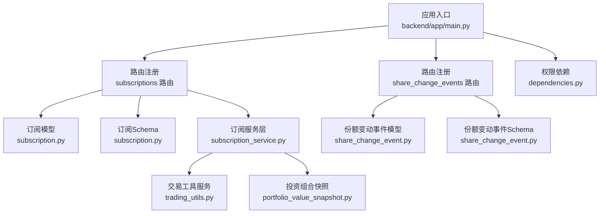
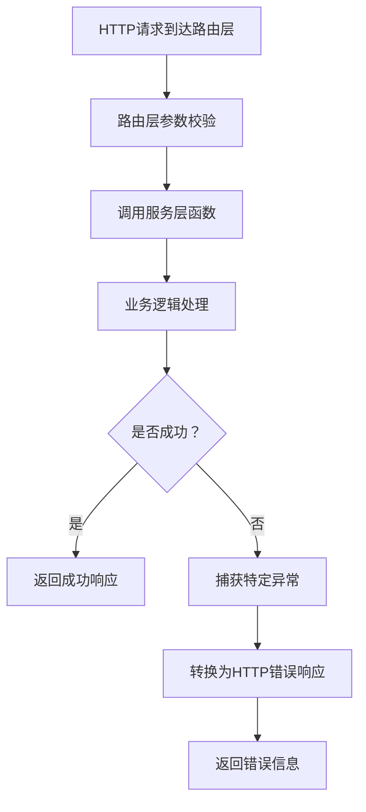
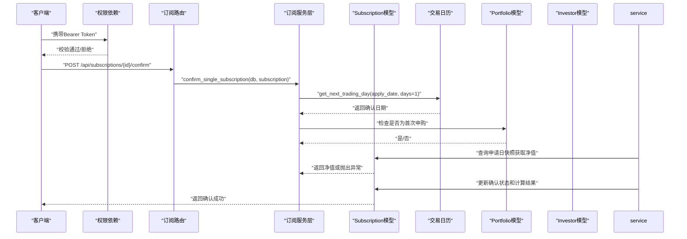
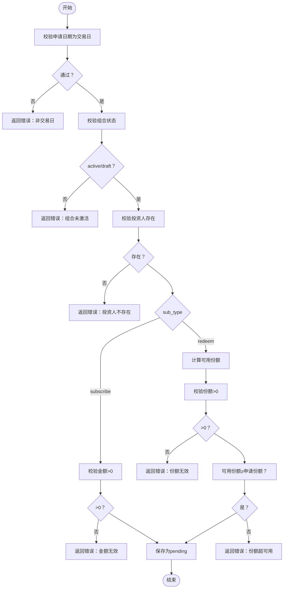
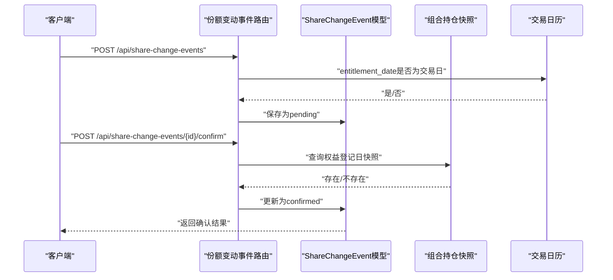
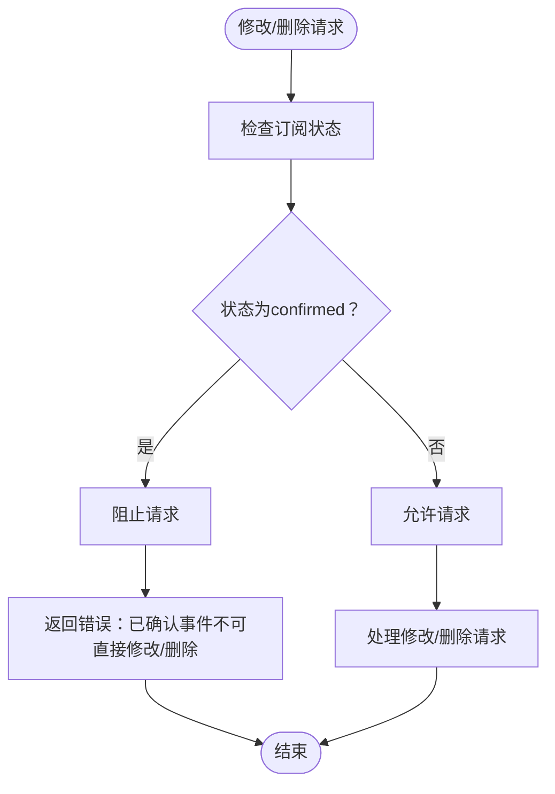
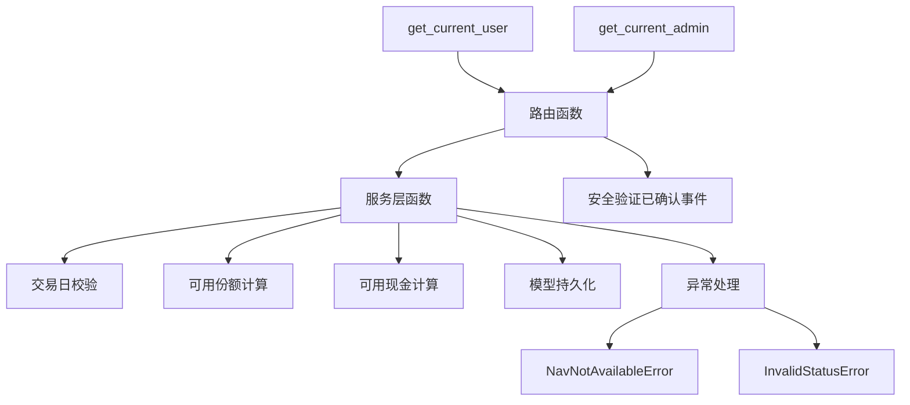

# 申购赎回API

<cite>
**本文引用的文件**
- [backend/app/main.py](file://backend/app/main.py)
- [backend/app/routers/subscriptions.py](file://backend/app/routers/subscriptions.py)
- [backend/app/services/subscription_service.py](file://backend/app/services/subscription_service.py)
- [backend/app/models/subscription.py](file://backend/app/models/subscription.py)
- [backend/app/schemas/subscription.py](file://backend/app/schemas/subscription.py)
- [backend/app/routers/share_change_events.py](file://backend/app/routers/share_change_events.py)
- [backend/app/models/share_change_event.py](file://backend/app/models/share_change_event.py)
- [backend/app/schemas/share_change_event.py](file://backend/app/schemas/share_change_event.py)
- [backend/app/routers/products.py](file://backend/app/routers/products.py)
- [backend/app/routers/portfolios.py](file://backend/app/routers/portfolios.py)
- [backend/app/routers/trades.py](file://backend/app/routers/trades.py)
- [backend/app/dependencies.py](file://backend/app/dependencies.py)
- [Docs/04-后端开发.md](file://Docs/04-后端开发.md)
</cite>

## 更新摘要
**变更内容**
- 新增服务层架构章节，详细说明业务逻辑从路由层提取到 subscription_service.py 的设计
- 更新确认接口说明，移除手动 confirm_date/unit_price 参数的要求
- 新增错误处理机制章节，详细说明 NavNotAvailableError 和 InvalidStatusError 的使用
- 更新架构图表，体现服务层分离和业务逻辑复用
- 增强安全验证机制，完善已确认事件的保护策略

## 目录
1. [简介](#简介)
2. [项目结构与入口](#项目结构与入口)
3. [核心组件](#核心组件)
4. [服务层架构](#服务层架构)
5. [架构概览](#架构概览)
6. [详细组件分析](#详细组件分析)
7. [依赖关系分析](#依赖关系分析)
8. [性能与并发特性](#性能与并发特性)
9. [故障排查指南](#故障排查指南)
10. [结论](#结论)
11. [附录：接口清单与示例](#附录接口清单与示例)

## 简介
本文件为 InvestRing 申购赎回模块的详细API文档，覆盖以下主题：
- 申购/赎回操作接口：创建、确认、取消、更新、删除
- 份额变更事件接口：创建、确认、取消、更新、删除、批量确认、同步分红
- 交易确认流程与净值/份额计算逻辑
- 查询接口：申购赎回列表、份额变动事件列表、产品查询、组合查询
- 权限控制与业务约束（交易日、可用份额/现金、状态机等）
- **新增** 服务层架构设计，业务逻辑从路由层提取
- **新增** 简化的确认接口，自动计算确认日期和单位净值
- **新增** 增强的错误处理机制，提供具体的异常类型
- **新增** 已确认订阅事件的安全保护机制

## 项目结构与入口
- API 路由统一挂载于应用入口，其中"申购赎回"模块对应路由前缀为 /api/subscriptions，"份额变动事件"模块对应 /api/share-change-events。
- 权限依赖通过依赖注入实现，普通用户仅能查看自身记录，管理员可执行写操作。
- **新增** 服务层分离：核心业务逻辑从路由层提取到独立的服务模块，提高代码复用性和可测试性。

**图表来源**
- [backend/app/main.py:32-48](file://backend/app/main.py#L32-L48)
- [backend/app/routers/subscriptions.py:1-16](file://backend/app/routers/subscriptions.py#L1-L16)
- [backend/app/routers/share_change_events.py:1-18](file://backend/app/routers/share_change_events.py#L1-L18)
- [backend/app/services/subscription_service.py:1-20](file://backend/app/services/subscription_service.py#L1-L20)
- [backend/app/dependencies.py:49-129](file://backend/app/dependencies.py#L49-L129)

**章节来源**
- [backend/app/main.py:32-48](file://backend/app/main.py#L32-L48)
- [backend/app/dependencies.py:49-129](file://backend/app/dependencies.py#L49-L129)

## 核心组件
- 申购/赎回模块
  - 路由：/api/subscriptions
  - 主要功能：创建申购/赎回、确认、取消、更新、删除；查询列表与详情
  - 关键模型：Subscription
  - 关键Schema：SubscriptionCreate、SubscriptionUpdate、SubscriptionResponse
  - **新增** 服务层：confirm_single_subscription、unconfirm_single_subscription
- 份额变动事件模块
  - 路由：/api/share-change-events
  - 主要功能：创建、确认、取消、更新、删除；批量确认；同步分红
  - 关键模型：ShareChangeEvent
  - 关键Schema：ShareChangeEventCreate、ShareChangeEventUpdate、ShareChangeEventResponse
- 查询辅助
  - 产品查询：/api/products
  - 组合查询：/api/portfolios
  - 交易确认与净值计算：/api/trades

**章节来源**
- [backend/app/routers/subscriptions.py:88-113](file://backend/app/routers/subscriptions.py#L88-L113)
- [backend/app/services/subscription_service.py:40-134](file://backend/app/services/subscription_service.py#L40-L134)
- [backend/app/routers/share_change_events.py:28-46](file://backend/app/routers/share_change_events.py#L28-L46)
- [backend/app/routers/products.py:27-45](file://backend/app/routers/products.py#L27-45)
- [backend/app/routers/portfolios.py:18-36](file://backend/app/routers/portfolios.py#L18-L36)
- [backend/app/routers/trades.py:271-289](file://backend/app/routers/trades.py#L271-L289)

## 服务层架构
**新增** 为了提升代码复用性和可维护性，申购赎回的核心业务逻辑已从路由层提取到独立的服务模块中。

### 服务层设计原则
- **单一职责**：每个服务函数专注于特定的业务逻辑
- **可复用性**：服务层函数可被HTTP API、CLI、定时任务等多处调用
- **异常处理**：定义专门的异常类型，便于上层统一处理
- **事务管理**：支持自动flush选项，由调用者控制事务边界

### 核心服务函数
- `confirm_single_subscription()`：确认单笔申购/赎回
  - 自动计算确认日期（T+1）
  - 自动确定单位净值（首次申购固定1.0000，否则取申请日组合快照净值）
  - 首次申购确认后自动激活组合状态
- `unconfirm_single_subscription()`：取消确认单笔申购/赎回
  - 将状态从 confirmed 回退至 pending
  - 清空确认相关字段（confirm_date、unit_price等）

### 自定义异常类型
- `NavNotAvailableError`：申请日组合快照不存在时抛出
- `InvalidStatusError`：状态不符合要求时抛出

**图表来源**
- [backend/app/services/subscription_service.py:40-134](file://backend/app/services/subscription_service.py#L40-L134)
- [backend/app/services/subscription_service.py:137-178](file://backend/app/services/subscription_service.py#L137-L178)
- [backend/app/routers/subscriptions.py:216-253](file://backend/app/routers/subscriptions.py#L216-L253)

**章节来源**
- [backend/app/services/subscription_service.py:1-178](file://backend/app/services/subscription_service.py#L1-L178)
- [backend/app/routers/subscriptions.py:216-253](file://backend/app/routers/subscriptions.py#L216-L253)

## 架构概览
- 认证与授权
  - 使用 Bearer Token 进行鉴权，支持普通用户与管理员两种角色
  - 管理员可执行写操作；普通用户仅能查看自身记录
- 业务流程
  - 申购/赎回：提交申请 → 等待确认 → 确认时按净值计算份额/金额
  - 份额变动事件：登记权益日 → 生成快照 → 确认事件 → 计算份额/现金变化
- 数据一致性
  - 交易日校验、可用份额/现金实时计算、状态机约束
- **新增** 服务层分离
  - 业务逻辑从路由层解耦，提高代码复用性
  - 统一的异常处理机制
- **新增** 安全验证
  - 已确认订阅事件不可直接修改或删除，需先取消确认

**图表来源**
- [backend/app/routers/subscriptions.py:216-253](file://backend/app/routers/subscriptions.py#L216-L253)
- [backend/app/services/subscription_service.py:40-134](file://backend/app/services/subscription_service.py#L40-L134)
- [backend/app/dependencies.py:49-129](file://backend/app/dependencies.py#L49-L129)
- [backend/app/routers/subscriptions.py:354-361](file://backend/app/routers/subscriptions.py#L354-L361)

## 详细组件分析

### 申购/赎回模块（/api/subscriptions）
- 接口总览
  - GET /api/subscriptions：查询申购赎回列表（支持组合/投资人过滤）
  - POST /api/subscriptions：创建申购/赎回（管理员）
  - GET /api/subscriptions/{id}：查询详情（本人或管理员）
  - POST /api/subscriptions/{id}/confirm：确认（管理员）
  - POST /api/subscriptions/{id}/cancel：取消（管理员）
  - PUT /api/subscriptions/{id}：更新（管理员）
  - DELETE /api/subscriptions/{id}：删除（管理员）

- 权限与约束
  - 交易日校验：apply_date 必须为交易日
  - 组合状态：仅 active 或 draft 的组合允许申购/赎回
  - 申购：金额必须 > 0
  - 赎回：份额必须 > 0，且不超过可用份额（含pending/未生成快照的已确认赎回）
  - 状态机：仅 pending 可 confirm/cancel
  - **新增** 安全验证：已确认（confirmed）状态的订阅事件不可直接修改或删除

- 份额/金额计算
  - **更新** 确认接口简化：不再需要手动传入 confirm_date 和 unit_price 参数
  - 确认日期：后端自动计算为申请日的下一个交易日（T+1）
  - 单位净值：首次申购固定为 1.0000，其他情况取申请日组合快照净值
  - 申购：确认时按净值计算份额 = 申请金额 / 单位净值
  - 赎回：确认时按净值计算金额 = 申请份额 × 单位净值

- 可用份额计算逻辑（赎回时）
  - 可用份额 = 最新快照份额 − Σ(pending 赎回) − Σ(已确认赎回且确认日期 > 最新快照日期)

**图表来源**
- [backend/app/routers/subscriptions.py:115-199](file://backend/app/routers/subscriptions.py#L115-L199)
- [backend/app/routers/subscriptions.py:36-85](file://backend/app/routers/subscriptions.py#L36-L85)

**章节来源**
- [backend/app/routers/subscriptions.py:88-113](file://backend/app/routers/subscriptions.py#L88-L113)
- [backend/app/routers/subscriptions.py:115-199](file://backend/app/routers/subscriptions.py#L115-L199)
- [backend/app/routers/subscriptions.py:237-320](file://backend/app/routers/subscriptions.py#L237-L320)
- [backend/app/routers/subscriptions.py:323-340](file://backend/app/routers/subscriptions.py#L323-L340)
- [backend/app/routers/subscriptions.py:343-359](file://backend/app/routers/subscriptions.py#L343-L359)
- [backend/app/routers/subscriptions.py:362-374](file://backend/app/routers/subscriptions.py#L362-L374)
- [backend/app/dependencies.py:49-129](file://backend/app/dependencies.py#L49-L129)

### 份额变动事件模块（/api/share-change-events）
- 接口总览
  - GET /api/share-change-events：查询事件列表（支持组合过滤）
  - POST /api/share-change-events：创建事件（管理员）
  - GET /api/share-change-events/{id}：查询详情
  - POST /api/share-change-events/{id}/confirm：确认事件（管理员）
  - POST /api/share-change-events/{id}/cancel：取消事件（管理员）
  - PUT /api/share-change-events/{id}：更新（管理员）
  - DELETE /api/share-change-events/{id}：删除（管理员）

- 权限与约束
  - 权益登记日必须为交易日
  - 仅 pending 状态可 confirm/cancel
  - 确认前必须存在权益登记日的持仓快照（否则报错）

- 事件类型
  - 现金分红、红利再投资、份额拆分、份额合并、送红股、强制调整

- 批量确认与同步
  - 批量确认：对多个事件逐一校验并返回汇总
  - 同步分红：按日期范围同步分红事件

**图表来源**
- [backend/app/routers/share_change_events.py:49-77](file://backend/app/routers/share_change_events.py#L49-L77)
- [backend/app/routers/share_change_events.py:92-128](file://backend/app/routers/share_change_events.py#L92-L128)

**章节来源**
- [backend/app/routers/share_change_events.py:28-46](file://backend/app/routers/share_change_events.py#L28-L46)
- [backend/app/routers/share_change_events.py:49-77](file://backend/app/routers/share_change_events.py#L49-L77)
- [backend/app/routers/share_change_events.py:92-128](file://backend/app/routers/share_change_events.py#L92-L128)
- [backend/app/routers/share_change_events.py:131-148](file://backend/app/routers/share_change_events.py#L131-L148)
- [backend/app/routers/share_change_events.py:151-167](file://backend/app/routers/share_change_events.py#L151-L167)
- [backend/app/routers/share_change_events.py:170-182](file://backend/app/routers/share_change_events.py#L170-L182)
- [Docs/04-后端开发.md:543-646](file://Docs/04-后端开发.md#L543-L646)

### 查询接口补充
- 产品查询（/api/products）
  - GET /api/products：分页查询产品
  - GET /api/products/{code}：查询产品多市场版本
  - GET /api/products/{code}/{market}：查询产品详情
  - PUT /api/products/{code}/{market}：更新产品（自动重算确认天数）
- 组合查询（/api/portfolios）
  - GET /api/portfolios：分页查询组合
  - GET /api/portfolios/{code}：查询组合详情
  - GET /api/portfolios/{code}/nav-history：净值历史
  - GET /api/portfolios/{code}/returns：累计/年化收益
  - GET /api/portfolios/{code}/cash-flow：资金流入流出

**章节来源**
- [backend/app/routers/products.py:27-45](file://backend/app/routers/products.py#L27-L45)
- [backend/app/routers/products.py:79-92](file://backend/app/routers/products.py#L79-L92)
- [backend/app/routers/products.py:95-122](file://backend/app/routers/products.py#L95-L122)
- [backend/app/routers/portfolios.py:18-36](file://backend/app/routers/portfolios.py#L18-L36)
- [backend/app/routers/portfolios.py:61-70](file://backend/app/routers/portfolios.py#L61-L70)
- [backend/app/routers/portfolios.py:159-191](file://backend/app/routers/portfolios.py#L159-L191)
- [backend/app/routers/portfolios.py:194-241](file://backend/app/routers/portfolios.py#L194-L241)
- [backend/app/routers/portfolios.py:244-275](file://backend/app/routers/portfolios.py#L244-L275)

### **新增** 已确认订阅事件的安全验证机制
- **安全验证规则**
  - 已确认（confirmed）状态的订阅事件不可直接修改或删除
  - 修改已确认订阅事件时，系统会检查状态并阻止直接修改
  - 删除已确认订阅事件时，系统会检查状态并阻止直接删除
  - 需要先取消确认（cancel）才能进行修改或删除操作

- **错误处理**
  - 修改已确认订阅事件：返回 422 错误，错误码为 CANNOT_MODIFY_CONFIRMED
  - 删除已确认订阅事件：返回 422 错误，错误码为 CANNOT_DELETE_CONFIRMED
  - 错误信息提示用户需要先取消确认后再进行相应操作

- **业务影响**
  - 确保已确认的交易数据不可篡改，维护数据完整性
  - 防止误操作导致的历史数据丢失
  - 保持审计追踪的完整性和可追溯性

**图表来源**
- [backend/app/routers/subscriptions.py:354-361](file://backend/app/routers/subscriptions.py#L354-L361)
- [backend/app/routers/subscriptions.py:380-388](file://backend/app/routers/subscriptions.py#L380-L388)

**章节来源**
- [backend/app/routers/subscriptions.py:354-361](file://backend/app/routers/subscriptions.py#L354-L361)
- [backend/app/routers/subscriptions.py:380-388](file://backend/app/routers/subscriptions.py#L380-L388)

## 依赖关系分析
- 认证与授权
  - get_current_user：校验Token、黑名单、账户锁定，返回当前用户
  - get_current_admin：要求角色为 admin
- 交易日历
  - _is_trading_day：判断某日是否为交易日
- 实时可用性计算
  - 申购/赎回：_calculate_investor_available_shares
  - 交易：_calculate_available_cash、_calculate_available_shares
- **新增** 服务层依赖
  - confirm_single_subscription：确认业务逻辑
  - unconfirm_single_subscription：取消确认业务逻辑
  - NavNotAvailableError：净值不可用异常
  - InvalidStatusError：状态非法异常

**图表来源**
- [backend/app/dependencies.py:49-129](file://backend/app/dependencies.py#L49-L129)
- [backend/app/routers/subscriptions.py:19-23](file://backend/app/routers/subscriptions.py#L19-L23)
- [backend/app/routers/subscriptions.py:36-85](file://backend/app/routers/subscriptions.py#L36-L85)
- [backend/app/routers/trades.py:18-32](file://backend/app/routers/trades.py#L18-L32)
- [backend/app/routers/trades.py:128-217](file://backend/app/routers/trades.py#L128-L217)
- [backend/app/services/subscription_service.py:22-38](file://backend/app/services/subscription_service.py#L22-L38)

**章节来源**
- [backend/app/dependencies.py:49-129](file://backend/app/dependencies.py#L49-L129)
- [backend/app/routers/subscriptions.py:19-23](file://backend/app/routers/subscriptions.py#L19-L23)
- [backend/app/routers/subscriptions.py:36-85](file://backend/app/routers/subscriptions.py#L36-L85)
- [backend/app/routers/trades.py:18-32](file://backend/app/routers/trades.py#L18-L32)
- [backend/app/routers/trades.py:128-217](file://backend/app/routers/trades.py#L128-L217)
- [backend/app/services/subscription_service.py:22-38](file://backend/app/services/subscription_service.py#L22-L38)

## 性能与并发特性
- 交易日历查询：每次操作均进行一次数据库查询，建议在上层缓存交易日历
- 可用份额/现金计算：涉及多表聚合查询，建议在业务层做缓存或延迟计算
- 批量确认：逐条校验，失败不影响其他事件，适合异步批处理
- **新增** 服务层优化：业务逻辑集中管理，减少重复代码，提高执行效率
- **新增** 异常处理优化：具体异常类型提供更精确的错误信息，减少不必要的重试
- **新增** 安全验证：状态检查为轻量级操作，对性能影响极小

## 故障排查指南
- 常见错误码与原因
  - 422 非交易日：apply_date 不是交易日
  - 422 组合未激活：组合状态非 active/draft
  - 422 金额/份额无效：<=0
  - 422 份额超可用：赎回份额超过可用份额
  - 422 仅 pending 可确认/取消：状态不符
  - 422 缺少持仓快照：权益登记日快照不存在
  - 422 **新增** 已确认事件不可直接修改：CANNOT_MODIFY_CONFIRMED
  - 422 **新增** 已确认事件不可直接删除：CANNOT_DELETE_CONFIRMED
  - 422 **新增** 净值不可用：NAV_NOT_AVAILABLE（申请日快照不存在）
  - 422 **新增** 状态非法：INVALID_STATUS（状态不符合操作要求）
  - 404 未找到：组合/投资人/事件/交易不存在
  - 403 权限不足：非管理员或非本人记录
- 排查步骤
  - 确认 apply_date/entitlement_date 是否为交易日
  - 检查组合状态与投资人是否存在
  - 核对可用份额/现金计算逻辑
  - 确认权益登记日快照是否已生成
  - 确认状态机是否符合预期
  - **新增** 对于已确认事件的修改/删除操作，先执行取消确认操作
  - **新增** 确认净值快照是否存在，必要时先生成快照

**章节来源**
- [backend/app/routers/subscriptions.py:121-126](file://backend/app/routers/subscriptions.py#L121-L126)
- [backend/app/routers/subscriptions.py:136-140](file://backend/app/routers/subscriptions.py#L136-L140)
- [backend/app/routers/subscriptions.py:152-156](file://backend/app/routers/subscriptions.py#L152-L156)
- [backend/app/routers/subscriptions.py:168-172](file://backend/app/routers/subscriptions.py#L168-L172)
- [backend/app/routers/subscriptions.py:176-183](file://backend/app/routers/subscriptions.py#L176-L183)
- [backend/app/routers/subscriptions.py:248-252](file://backend/app/routers/subscriptions.py#L248-L252)
- [backend/app/routers/share_change_events.py:56-63](file://backend/app/routers/share_change_events.py#L56-L63)
- [backend/app/routers/share_change_events.py:116-123](file://backend/app/routers/share_change_events.py#L116-L123)
- [backend/app/routers/share_change_events.py:101-105](file://backend/app/routers/share_change_events.py#L101-L105)
- [backend/app/routers/subscriptions.py:357-361](file://backend/app/routers/subscriptions.py#L357-L361)
- [backend/app/routers/subscriptions.py:384-388](file://backend/app/routers/subscriptions.py#L384-L388)
- [backend/app/services/subscription_service.py:22-38](file://backend/app/services/subscription_service.py#L22-L38)

## 结论
- 申购/赎回与份额变动事件模块均采用严格的交易日与状态机约束，确保业务合规
- 可用份额/现金的实时计算保障了交易与赎回的准确性
- 管理员权限用于关键操作（确认、取消、删除），普通用户仅能查看自身记录
- **新增** 服务层架构设计有效提升了代码复用性和可维护性
- **新增** 简化的确认接口降低了前端集成复杂度，提高了用户体验
- **新增** 增强的错误处理机制提供了更精确的错误信息和更好的调试体验
- **新增** 已确认订阅事件的安全验证机制有效防止了数据篡改，维护了系统的数据完整性
- 建议在前端与网关层增加必要的缓存与限流策略，提升整体性能与稳定性

## 附录：接口清单与示例

### 申购/赎回接口
- GET /api/subscriptions
  - 查询参数：portfolio_code、investor_code、page、page_size
  - 返回：items、total、page、page_size
- POST /api/subscriptions
  - 请求体：portfolio_code、investor_code、sub_type、amount/shares、apply_date、notes
  - 返回：新建记录（status=pending）
- GET /api/subscriptions/{id}
  - 返回：订阅详情（本人或管理员）
- POST /api/subscriptions/{id}/confirm
  - **更新** 无需请求体参数，确认日期和单位净值由后端自动计算
  - 返回：确认后的订阅详情
- POST /api/subscriptions/{id}/cancel
  - 返回：取消成功消息
- PUT /api/subscriptions/{id}
  - 请求体：amount、shares、unit_price、confirm_date、status、notes
  - **新增** 当状态为 confirmed 时，返回错误：已确认事件不可直接修改
  - 返回：更新后的订阅
- DELETE /api/subscriptions/{id}
  - **新增** 当状态为 confirmed 时，返回错误：已确认事件不可直接删除
  - 返回：删除成功消息

**章节来源**
- [backend/app/routers/subscriptions.py:88-113](file://backend/app/routers/subscriptions.py#L88-L113)
- [backend/app/routers/subscriptions.py:115-199](file://backend/app/routers/subscriptions.py#L115-L199)
- [backend/app/routers/subscriptions.py:202-213](file://backend/app/routers/subscriptions.py#L202-L213)
- [backend/app/routers/subscriptions.py:237-320](file://backend/app/routers/subscriptions.py#L237-L320)
- [backend/app/routers/subscriptions.py:323-340](file://backend/app/routers/subscriptions.py#L323-L340)
- [backend/app/routers/subscriptions.py:343-359](file://backend/app/routers/subscriptions.py#L343-L359)
- [backend/app/routers/subscriptions.py:362-374](file://backend/app/routers/subscriptions.py#L362-L374)

### 份额变动事件接口
- GET /api/share-change-events
  - 查询参数：portfolio_code、status、start_date、end_date、page、page_size
  - 返回：items、total、page、page_size
- POST /api/share-change-events
  - 请求体：portfolio_code、product_code、market、event_type、event_date、entitlement_date、div_cash、ratio、cash_product_code、notes
  - 返回：新建事件（status=pending）
- GET /api/share-change-events/{id}
  - 返回：事件详情
- POST /api/share-change-events/{id}/confirm
  - 返回：确认后的事件详情
- POST /api/share-change-events/{id}/cancel
  - 返回：取消成功消息
- PUT /api/share-change-events/{id}
  - 请求体：event_date、entitlement_date、shares_before、shares_change、shares_after、cash_change、div_cash、reinvest_nav、ratio、status、notes
  - 返回：更新后的事件
- DELETE /api/share-change-events/{id}
  - 返回：删除成功消息

**章节来源**
- [backend/app/routers/share_change_events.py:28-46](file://backend/app/routers/share_change_events.py#L28-L46)
- [backend/app/routers/share_change_events.py:49-77](file://backend/app/routers/share_change_events.py#L49-L77)
- [backend/app/routers/share_change_events.py:80-89](file://backend/app/routers/share_change_events.py#L80-L89)
- [backend/app/routers/share_change_events.py:92-128](file://backend/app/routers/share_change_events.py#L92-L128)
- [backend/app/routers/share_change_events.py:131-148](file://backend/app/routers/share_change_events.py#L131-L148)
- [backend/app/routers/share_change_events.py:151-167](file://backend/app/routers/share_change_events.py#L151-L167)
- [backend/app/routers/share_change_events.py:170-182](file://backend/app/routers/share_change_events.py#L170-L182)
- [Docs/04-后端开发.md:543-646](file://Docs/04-后端开发.md#L543-L646)

### 查询接口
- 产品查询
  - GET /api/products：分页查询产品
  - GET /api/products/{code}：查询产品多市场版本
  - GET /api/products/{code}/{market}：查询产品详情
  - PUT /api/products/{code}/{market}：更新产品（自动重算确认天数）
- 组合查询
  - GET /api/portfolios：分页查询组合
  - GET /api/portfolios/{code}：查询组合详情
  - GET /api/portfolios/{code}/nav-history：净值历史
  - GET /api/portfolios/{code}/returns：累计/年化收益
  - GET /api/portfolios/{code}/cash-flow：资金流入流出

**章节来源**
- [backend/app/routers/products.py:27-45](file://backend/app/routers/products.py#L27-L45)
- [backend/app/routers/products.py:79-92](file://backend/app/routers/products.py#L79-L92)
- [backend/app/routers/products.py:95-122](file://backend/app/routers/products.py#L95-L122)
- [backend/app/routers/portfolios.py:18-36](file://backend/app/routers/portfolios.py#L18-L36)
- [backend/app/routers/portfolios.py:61-70](file://backend/app/routers/portfolios.py#L61-L70)
- [backend/app/routers/portfolios.py:159-191](file://backend/app/routers/portfolios.py#L159-L191)
- [backend/app/routers/portfolios.py:194-241](file://backend/app/routers/portfolios.py#L194-L241)
- [backend/app/routers/portfolios.py:244-275](file://backend/app/routers/portfolios.py#L244-L275)