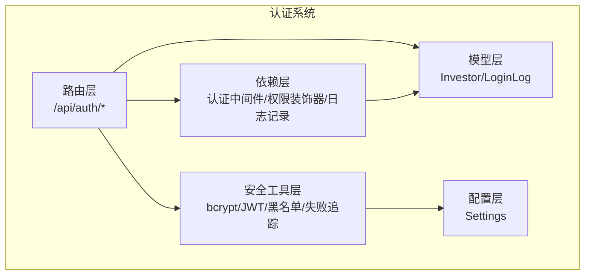
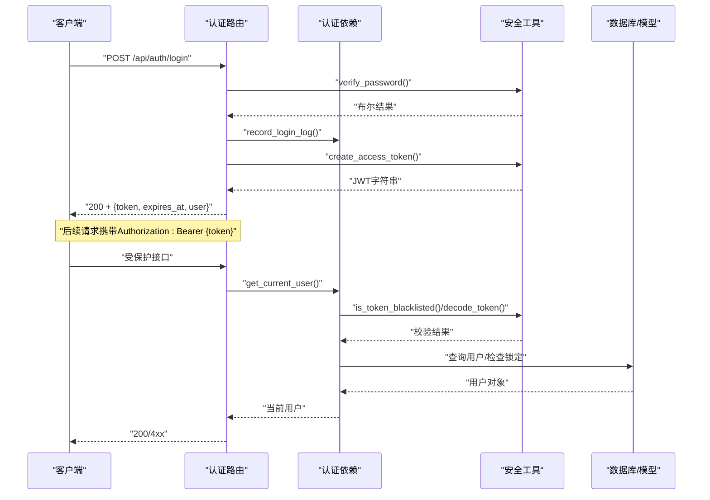
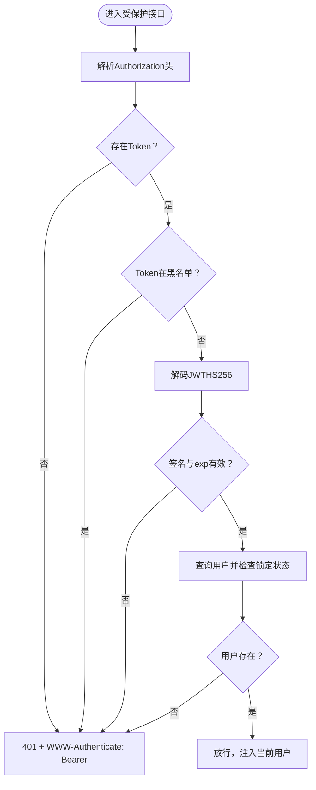
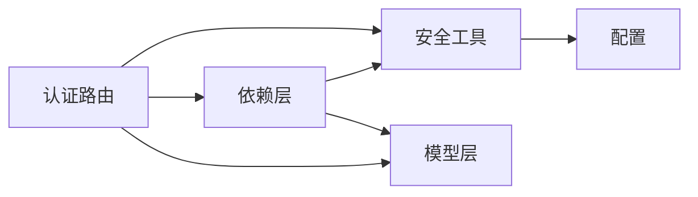

# 认证系统API

<cite>
**本文引用的文件**
- [backend/app/routers/auth.py](file://backend/app/routers/auth.py)
- [backend/app/schemas/auth.py](file://backend/app/schemas/auth.py)
- [backend/app/models/investor.py](file://backend/app/models/investor.py)
- [backend/app/utils/security.py](file://backend/app/utils/security.py)
- [backend/app/dependencies.py](file://backend/app/dependencies.py)
- [backend/app/models/login_log.py](file://backend/app/models/login_log.py)
- [backend/app/config.py](file://backend/app/config.py)
- [backend/app/main.py](file://backend/app/main.py)
- [Docs/04-后端开发.md](file://Docs/04-后端开发.md)
- [Docs/07-日志系统设计.md](file://Docs/07-日志系统设计.md)
</cite>

## 目录
1. [简介](#简介)
2. [项目结构](#项目结构)
3. [核心组件](#核心组件)
4. [架构总览](#架构总览)
5. [详细组件分析](#详细组件分析)
6. [依赖分析](#依赖分析)
7. [性能考虑](#性能考虑)
8. [故障排除指南](#故障排除指南)
9. [结论](#结论)
10. [附录](#附录)

## 简介
本文件为 InvestRing 认证系统的详细API文档，覆盖登录、登出、修改密码等认证相关接口。内容包括：
- HTTP方法、URL模式、请求/响应模式与认证方式
- 登录接口的参数验证、密码哈希验证、账户锁定机制、登录失败记录
- 登出接口的Token黑名单机制与日志记录
- 修改密码接口的权限控制、旧密码验证、新密码强度要求
- 具体请求与响应示例（成功与失败场景）
- 认证中间件工作原理与Token管理策略

## 项目结构
认证系统位于后端FastAPI应用中，主要由以下模块组成：
- 路由层：认证路由定义与接口暴露
- 模型层：投资人模型与登录日志模型
- 工具层：密码哈希、JWT签发与校验、Token黑名单、登录失败追踪
- 依赖层：认证中间件、权限装饰器、客户端IP与UA提取、登录日志记录
- 配置层：密钥与Token过期策略
- 文档：后端开发文档与日志系统设计文档

图表来源
- [backend/app/routers/auth.py:1-186](file://backend/app/routers/auth.py#L1-L186)
- [backend/app/utils/security.py:1-103](file://backend/app/utils/security.py#L1-L103)
- [backend/app/dependencies.py:1-146](file://backend/app/dependencies.py#L1-L146)
- [backend/app/models/investor.py:1-17](file://backend/app/models/investor.py#L1-L17)
- [backend/app/models/login_log.py:1-16](file://backend/app/models/login_log.py#L1-L16)
- [backend/app/config.py:1-37](file://backend/app/config.py#L1-L37)

章节来源
- [backend/app/main.py:32-33](file://backend/app/main.py#L32-L33)
- [Docs/04-后端开发.md:8-70](file://Docs/04-后端开发.md#L8-L70)

## 核心组件
- 认证路由：提供登录、登出、修改密码三个接口
- 安全工具：bcrypt密码哈希、HS256 JWT签发与解码、Token黑名单、登录失败追踪
- 认证中间件：HTTP Bearer校验、Token黑名单检查、账户锁定检查、用户解析
- 权限装饰器：require_auth、require_admin
- 日志记录：登录/登出/密码修改日志入库
- 配置：密钥与Token过期天数

章节来源
- [backend/app/routers/auth.py:29-186](file://backend/app/routers/auth.py#L29-L186)
- [backend/app/utils/security.py:15-103](file://backend/app/utils/security.py#L15-L103)
- [backend/app/dependencies.py:49-146](file://backend/app/dependencies.py#L49-L146)
- [backend/app/models/login_log.py:5-16](file://backend/app/models/login_log.py#L5-L16)
- [backend/app/config.py:5-16](file://backend/app/config.py#L5-L16)

## 架构总览
认证系统遵循“路由-依赖-工具-模型-配置”的分层设计，认证中间件贯穿所有受保护接口，确保：
- Token合法性与黑名单校验
- 账户锁定状态检查
- 登录日志与审计日志记录

图表来源
- [backend/app/routers/auth.py:29-96](file://backend/app/routers/auth.py#L29-L96)
- [backend/app/dependencies.py:49-111](file://backend/app/dependencies.py#L49-L111)
- [backend/app/utils/security.py:15-47](file://backend/app/utils/security.py#L15-L47)

## 详细组件分析

### 登录接口
- 方法与路径
  - POST /api/auth/login
- 请求体
  - code: 用户编码
  - password: 明文密码
- 响应体
  - token: JWT字符串
  - expires_at: 过期时间（ISO 8601）
  - user: { code, name, role }
- 认证方式
  - 无（登录接口不强制要求Token）
- 参数验证
  - 查找用户：根据code查询Investor
  - 账户锁定检查：若处于锁定期内，直接返回403
- 密码验证
  - bcrypt校验明文密码与password_hash
- 登录失败处理
  - 失败时记录失败次数与锁定截止时间；连续失败≥5次锁定15分钟
- 登录成功处理
  - 清除失败记录
  - 更新last_login_at
  - 记录登录日志（action=login, status=success）
  - 生成JWT：载荷包含sub（用户编码）、role（角色），并设置exp
- Token管理
  - 过期策略：由配置决定（默认7天）
  - 登出策略：客户端清除本地Token即可；服务端不维护会话

请求示例
- POST /api/auth/login
- Body: { "code": "admin", "password": "admin123" }

成功响应示例
- 200 OK
- Body: {
  - "token": "<JWT字符串>",
  - "expires_at": "2026-05-01T12:00:00Z",
  - "user": {
    - "code": "admin",
    - "name": "管理员",
    - "role": "admin"
  }
}

失败响应示例
- 401 Unauthorized
- Body: {
  - "error": "INVALID_CREDENTIALS",
  - "message": "用户名或密码错误"
}
- 403 Forbidden（账户锁定）
- Body: {
  - "error": "ACCOUNT_LOCKED",
  - "message": "连续登录失败次数过多，账户已锁定至 2026-05-01T12:00:00Z",
  - "locked_until": "2026-05-01T12:00:00Z"
}

章节来源
- [backend/app/routers/auth.py:29-96](file://backend/app/routers/auth.py#L29-L96)
- [backend/app/utils/security.py:57-103](file://backend/app/utils/security.py#L57-L103)
- [backend/app/models/investor.py:5-16](file://backend/app/models/investor.py#L5-L16)
- [backend/app/models/login_log.py:5-16](file://backend/app/models/login_log.py#L5-L16)
- [backend/app/config.py:14-16](file://backend/app/config.py#L14-L16)

### 登出接口
- 方法与路径
  - POST /api/auth/logout
- 认证方式
  - 需要Authorization: Bearer {token}
- 处理流程
  - 从请求头解析Bearer Token
  - 将Token加入黑名单
  - 记录登出日志（action=logout, status=success）
- Token黑名单机制
  - 黑名单为内存集合；每次请求都会检查Token是否在黑名单中
  - 已登出的Token在过期前均视为失效
- 日志记录
  - 记录IP地址与User-Agent，便于审计

请求示例
- POST /api/auth/logout
- Headers: Authorization: Bearer <JWT>

成功响应示例
- 200 OK
- Body: { "message": "登出成功" }

章节来源
- [backend/app/routers/auth.py:98-119](file://backend/app/routers/auth.py#L98-L119)
- [backend/app/utils/security.py:49-55](file://backend/app/utils/security.py#L49-L55)
- [backend/app/dependencies.py:27-47](file://backend/app/dependencies.py#L27-L47)

### 修改密码接口
- 方法与路径
  - PUT /api/auth/password
- 认证方式
  - 需要Authorization: Bearer {token}
- 请求体
  - target_code: 目标用户编码（admin可指定；viewer仅能修改自己）
  - old_password: 旧密码（修改自己的密码时必填）
  - new_password: 新密码
- 权限控制
  - admin可修改任意用户密码，无需old_password
  - viewer仅能修改自己的密码，且必须提供old_password
- 旧密码验证
  - bcrypt校验old_password与当前password_hash
- 新密码强度
  - 代码层面未强制长度/复杂度；建议结合前端与业务策略实施
- 处理流程
  - 校验权限与旧密码（如需）
  - 使用bcrypt生成新password_hash并持久化
  - 将当前Token加入黑名单（强制重新登录）
  - 记录密码修改日志（action=password_changed, status=success）

请求示例
- PUT /api/auth/password
- Headers: Authorization: Bearer <JWT>
- Body: {
  - "target_code": "admin",
  - "old_password": "old123",
  - "new_password": "new456"
}

成功响应示例
- 200 OK
- Body: { "message": "密码修改成功，请重新登录" }

失败响应示例
- 403 Forbidden（无权修改他人密码）
- Body: {
  - "error": "FORBIDDEN",
  - "message": "无权修改其他用户密码"
}
- 400 Bad Request（修改自己密码未提供旧密码）
- Body: {
  - "error": "OLD_PASSWORD_REQUIRED",
  - "message": "修改密码需要提供旧密码"
}
- 400 Bad Request（旧密码错误）
- Body: {
  - "error": "INVALID_OLD_PASSWORD",
  - "message": "旧密码错误"
}
- 404 Not Found（目标用户不存在）
- Body: { "message": "用户不存在" }

章节来源
- [backend/app/routers/auth.py:122-186](file://backend/app/routers/auth.py#L122-L186)
- [backend/app/utils/security.py:15-26](file://backend/app/utils/security.py#L15-L26)
- [backend/app/dependencies.py:114-129](file://backend/app/dependencies.py#L114-L129)

### 认证中间件与Token管理策略
- HTTP Bearer认证
  - 使用HTTPBearer自动从Authorization头解析Bearer Token
- Token黑名单
  - 登出时将Token加入黑名单；后续请求若命中黑名单即401
- Token解码与校验
  - HS256算法解码，校验签名与exp
- 账户锁定检查
  - 登录与中间件均会检查账户是否锁定；锁定期内403
- 权限装饰器
  - require_auth：要求已登录
  - require_admin：要求管理员角色
- 客户端IP与UA
  - 从请求头提取X-Forwarded-For或client.host，记录到登录日志

图表来源
- [backend/app/dependencies.py:49-111](file://backend/app/dependencies.py#L49-L111)
- [backend/app/utils/security.py:41-47](file://backend/app/utils/security.py#L41-L47)
- [backend/app/utils/security.py:49-55](file://backend/app/utils/security.py#L49-L55)

章节来源
- [backend/app/dependencies.py:11-146](file://backend/app/dependencies.py#L11-L146)
- [backend/app/utils/security.py:1-103](file://backend/app/utils/security.py#L1-L103)

## 依赖分析
- 路由依赖
  - 依赖安全工具（密码哈希、JWT、黑名单、失败追踪）
  - 依赖依赖层（IP/UA提取、登录日志记录、当前用户解析）
  - 依赖模型层（Investor、LoginLog）
- 依赖层
  - 依赖安全工具（JWT解码、黑名单、失败追踪）
  - 依赖模型层（Investor、LoginLog）
- 工具层
  - 依赖配置（secret_key、token_expire_days）
  - 依赖第三方库（bcrypt、jose/jwt）

图表来源
- [backend/app/routers/auth.py:1-26](file://backend/app/routers/auth.py#L1-L26)
- [backend/app/dependencies.py:1-146](file://backend/app/dependencies.py#L1-L146)
- [backend/app/utils/security.py:1-103](file://backend/app/utils/security.py#L1-L103)
- [backend/app/config.py:1-37](file://backend/app/config.py#L1-L37)

章节来源
- [backend/app/routers/auth.py:1-26](file://backend/app/routers/auth.py#L1-L26)
- [backend/app/dependencies.py:1-146](file://backend/app/dependencies.py#L1-L146)
- [backend/app/utils/security.py:1-103](file://backend/app/utils/security.py#L1-L103)
- [backend/app/config.py:1-37](file://backend/app/config.py#L1-L37)

## 性能考虑
- 密码哈希成本
  - bcrypt轮数为12，平衡安全性与性能；可根据服务器能力调整
- Token黑名单
  - 内存集合查找O(1)，适合中小规模并发；若需分布式部署，建议迁移到Redis等外部存储
- 登录失败追踪
  - 内存字典记录失败次数与锁定截止时间；重启后清空；建议持久化到数据库
- JWT过期策略
  - 默认7天；建议结合前端刷新策略与安全策略评估
- 日志写入
  - 登录日志为轻量写入，建议配合索引优化查询

[本节为通用性能讨论，不直接分析特定文件]

## 故障排除指南
- 401 Unauthorized
  - 缺少Authorization头或Token无效/过期
  - 检查请求头格式：Authorization: Bearer <JWT>
  - 确认Token未被加入黑名单
- 403 Forbidden
  - 账户被锁定（连续登录失败≥5次，锁定15分钟）
  - 等待锁定截止时间或联系管理员
  - 管理员权限不足（非admin访问管理接口）
- 400 Bad Request
  - 修改密码未提供旧密码（viewer修改自己的密码）
  - 旧密码错误
- 404 Not Found
  - 目标用户不存在
- 登录日志审计
  - 登录/登出/密码修改均有日志记录，便于排查与审计
  - 登录失败原因会写入failure_reason字段

章节来源
- [backend/app/dependencies.py:58-111](file://backend/app/dependencies.py#L58-L111)
- [backend/app/utils/security.py:57-103](file://backend/app/utils/security.py#L57-L103)
- [backend/app/models/login_log.py:5-16](file://backend/app/models/login_log.py#L5-L16)
- [Docs/07-日志系统设计.md:35-51](file://Docs/07-日志系统设计.md#L35-L51)

## 结论
InvestRing 认证系统采用JWT与内存黑名单相结合的方式，实现了基础而实用的认证与授权能力。登录接口具备完善的失败次数与锁定机制，登出接口通过黑名单即时失效Token，修改密码接口严格控制权限并强制重新登录。建议在生产环境中：
- 将黑名单与失败追踪持久化
- 引入分布式缓存（如Redis）以支持多实例部署
- 增强密码强度策略与二次验证
- 完善登录日志的查询与导出能力

[本节为总结性内容，不直接分析特定文件]

## 附录

### API定义总览
- 登录
  - 方法: POST
  - 路径: /api/auth/login
  - 认证: 无
  - 请求体: { code, password }
  - 响应体: { token, expires_at, user }
- 登出
  - 方法: POST
  - 路径: /api/auth/logout
  - 认证: Bearer
  - 请求体: 无
  - 响应体: { message }
- 修改密码
  - 方法: PUT
  - 路径: /api/auth/password
  - 认证: Bearer
  - 请求体: { target_code?, old_password?, new_password }
  - 响应体: { message }

章节来源
- [Docs/04-后端开发.md:10-48](file://Docs/04-后端开发.md#L10-L48)
- [backend/app/routers/auth.py:29-186](file://backend/app/routers/auth.py#L29-L186)