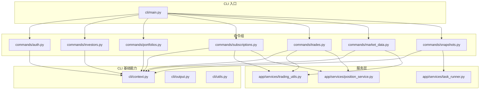
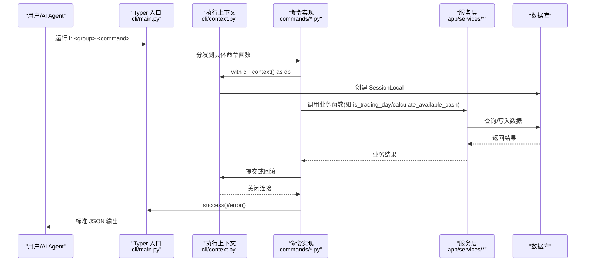
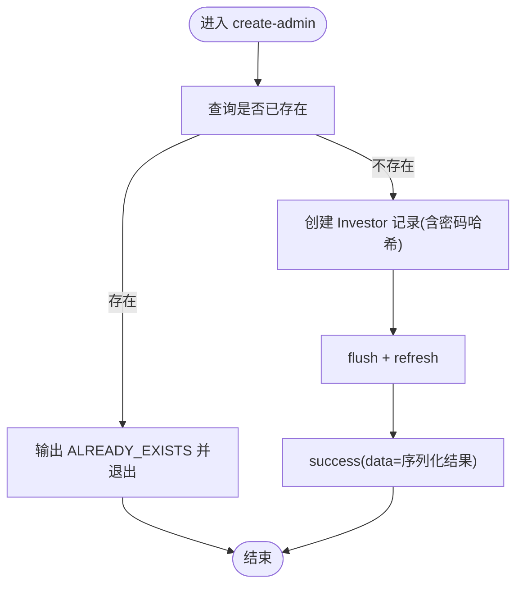
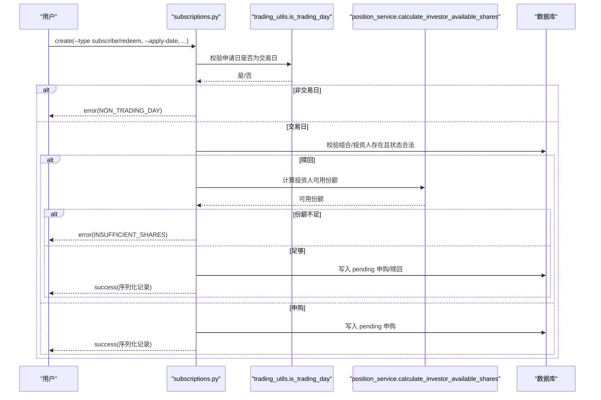
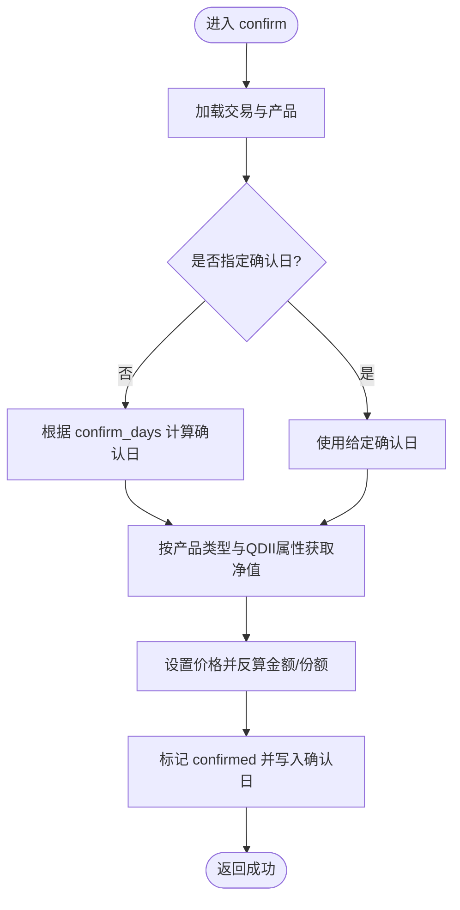
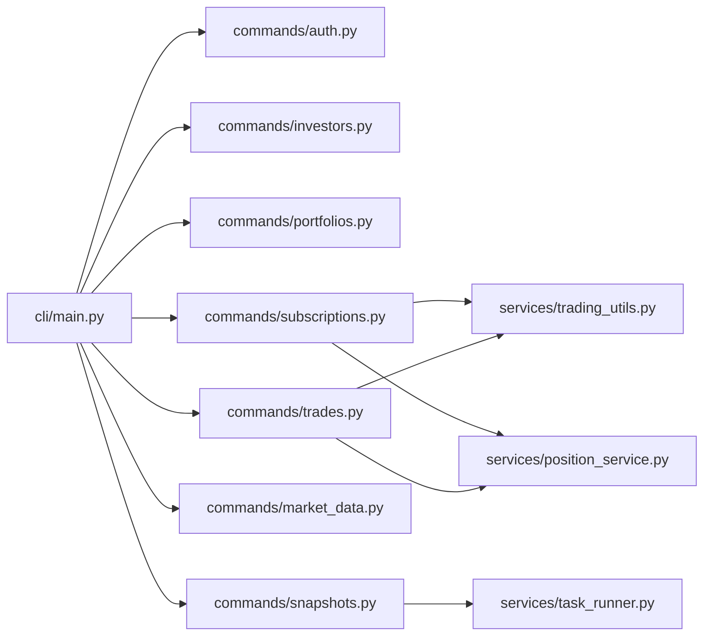

# API 文档工具集

<cite>
**本文引用的文件**   
- [backend/cli/main.py](file://backend/cli/main.py)
- [backend/pyproject.toml](file://backend/pyproject.toml)
- [backend/cli/context.py](file://backend/cli/context.py)
- [backend/cli/output.py](file://backend/cli/output.py)
- [backend/cli/utils.py](file://backend/cli/utils.py)
- [backend/app/services/trading_utils.py](file://backend/app/services/trading_utils.py)
- [backend/app/services/position_service.py](file://backend/app/services/position_service.py)
- [backend/app/services/task_runner.py](file://backend/app/services/task_runner.py)
- [backend/cli/commands/auth.py](file://backend/cli/commands/auth.py)
- [backend/cli/commands/investors.py](file://backend/cli/commands/investors.py)
- [backend/cli/commands/portfolios.py](file://backend/cli/commands/portfolios.py)
- [backend/cli/commands/subscriptions.py](file://backend/cli/commands/subscriptions.py)
- [backend/cli/commands/trades.py](file://backend/cli/commands/trades.py)
- [backend/cli/commands/market_data.py](file://backend/cli/commands/market_data.py)
- [backend/cli/commands/snapshots.py](file://backend/cli/commands/snapshots.py)
</cite>

## 目录
1. [简介](#简介)
2. [项目结构](#项目结构)
3. [核心组件](#核心组件)
4. [架构总览](#架构总览)
5. [详细组件分析](#详细组件分析)
6. [依赖关系分析](#依赖关系分析)
7. [性能与可扩展性](#性能与可扩展性)
8. [故障排查指南](#故障排查指南)
9. [结论](#结论)
10. [附录：命令清单与使用要点](#附录命令清单与使用要点)

## 简介
本仓库包含 InvestRing 的“API 文档工具集”——一个面向 AI Agent 的原生 CLI 工具（主管理员版本）。该工具基于 Typer 构建，直接导入后端服务层操作数据库，所有输出为结构化 JSON，便于机器解析与自动化编排。CLI 覆盖组合管理、申购赎回、调仓交易、份额变动事件、快照生成、市场数据同步、任务管理等核心能力，提供统一错误码与分页元数据，适合在 CI/CD、运维脚本与 Agent 工作流中稳定使用。

## 项目结构
CLI 位于 backend/cli 下，采用“入口 + 上下文 + 输出协议 + 公共辅助 + 命令组”的分层组织方式；业务逻辑集中在 app/services 中，CLI 仅负责参数校验、事务边界与结果序列化。

图表来源
- [backend/cli/main.py:1-50](file://backend/cli/main.py#L1-L50)
- [backend/cli/context.py:1-59](file://backend/cli/context.py#L1-L59)
- [backend/cli/output.py:1-64](file://backend/cli/output.py#L1-L64)
- [backend/cli/utils.py:1-67](file://backend/cli/utils.py#L1-L67)
- [backend/cli/commands/auth.py:1-39](file://backend/cli/commands/auth.py#L1-L39)
- [backend/cli/commands/investors.py:1-135](file://backend/cli/commands/investors.py#L1-L135)
- [backend/cli/commands/portfolios.py:1-241](file://backend/cli/commands/portfolios.py#L1-L241)
- [backend/cli/commands/subscriptions.py:1-214](file://backend/cli/commands/subscriptions.py#L1-L214)
- [backend/cli/commands/trades.py:1-264](file://backend/cli/commands/trades.py#L1-L264)
- [backend/cli/commands/market_data.py:1-83](file://backend/cli/commands/market_data.py#L1-L83)
- [backend/cli/commands/snapshots.py:1-127](file://backend/cli/commands/snapshots.py#L1-L127)
- [backend/app/services/trading_utils.py:1-69](file://backend/app/services/trading_utils.py#L1-L69)
- [backend/app/services/position_service.py:1-211](file://backend/app/services/position_service.py#L1-L211)
- [backend/app/services/task_runner.py:1-188](file://backend/app/services/task_runner.py#L1-L188)

章节来源
- [backend/cli/main.py:1-50](file://backend/cli/main.py#L1-L50)
- [backend/pyproject.toml:1-16](file://backend/pyproject.toml#L1-L16)

## 核心组件
- CLI 入口与命令注册：定义应用名、帮助文本，并集中注册 14 个命令组。
- 执行上下文：统一的 DB Session 生命周期管理、异常映射与退出码控制。
- 输出协议：统一成功/失败 JSON 格式，支持 Decimal/date/datetime 序列化。
- 公共辅助：模型序列化、分页、日期解析等通用工具。
- 服务层复用：交易日判断、可用现金/份额计算、任务执行体等从路由层提取到服务层，供 CLI 与 HTTP 路由共用。

章节来源
- [backend/cli/main.py:1-50](file://backend/cli/main.py#L1-L50)
- [backend/cli/context.py:1-59](file://backend/cli/context.py#L1-L59)
- [backend/cli/output.py:1-64](file://backend/cli/output.py#L1-L64)
- [backend/cli/utils.py:1-67](file://backend/cli/utils.py#L1-L67)
- [backend/app/services/trading_utils.py:1-69](file://backend/app/services/trading_utils.py#L1-L69)
- [backend/app/services/position_service.py:1-211](file://backend/app/services/position_service.py#L1-L211)
- [backend/app/services/task_runner.py:1-188](file://backend/app/services/task_runner.py#L1-L188)

## 架构总览
CLI 通过 Typer 暴露子命令，每个命令在 cli_context 中获取数据库会话，调用 service 层完成业务处理，最终通过 output 输出标准 JSON。

图表来源
- [backend/cli/main.py:1-50](file://backend/cli/main.py#L1-L50)
- [backend/cli/context.py:1-59](file://backend/cli/context.py#L1-L59)
- [backend/cli/output.py:1-64](file://backend/cli/output.py#L1-L64)
- [backend/app/services/trading_utils.py:1-69](file://backend/app/services/trading_utils.py#L1-L69)
- [backend/app/services/position_service.py:1-211](file://backend/app/services/position_service.py#L1-L211)

## 详细组件分析

### 认证管理（ir auth）
- 功能：创建管理员账户，密码哈希存储，避免重复创建。
- 关键流程：
  - 检查是否存在同名代码
  - 写入 Investor 记录并刷新
  - 输出时排除敏感字段

图表来源
- [backend/cli/commands/auth.py:1-39](file://backend/cli/commands/auth.py#L1-L39)

章节来源
- [backend/cli/commands/auth.py:1-39](file://backend/cli/commands/auth.py#L1-L39)

### 投资人管理（ir investor）
- 功能：列表/详情/创建/更新/删除，默认角色 viewer，删除前校验持有份额。
- 关键点：
  - 列表支持分页与全部拉取
  - 更新支持选择性字段覆盖
  - 删除前检查最新持有份额 > 0 则拒绝

章节来源
- [backend/cli/commands/investors.py:1-135](file://backend/cli/commands/investors.py#L1-L135)

### 组合管理（ir portfolio）
- 功能：CRUD、关闭/重新激活、净值历史、收益率、资金流。
- 关键点：
  - 关闭前校验无 pending 申赎/交易
  - 首次确认申购自动将组合状态由 draft 切换为 active
  - 收益率计算基于首尾净值与持有天数

章节来源
- [backend/cli/commands/portfolios.py:1-241](file://backend/cli/commands/portfolios.py#L1-L241)

### 申购赎回（ir sub）
- 功能：列表/创建/详情/确认/取消/取消确认。
- 关键校验：
  - 申请日必须为交易日
  - 组合需处于 active/draft
  - 赎回前校验投资人可用份额
  - 首次申购净值固定为 1.0000，后续需提供确认净值

图表来源
- [backend/cli/commands/subscriptions.py:1-214](file://backend/cli/commands/subscriptions.py#L1-L214)
- [backend/app/services/trading_utils.py:1-69](file://backend/app/services/trading_utils.py#L1-L69)
- [backend/app/services/position_service.py:1-211](file://backend/app/services/position_service.py#L1-L211)

章节来源
- [backend/cli/commands/subscriptions.py:1-214](file://backend/cli/commands/subscriptions.py#L1-L214)

### 调仓交易（ir trade）
- 功能：列表/创建/详情/确认/取消/取消确认。
- 关键校验：
  - 交易日校验
  - 买入金额不超过可用现金，卖出份额不超过可用份额
  - 确认时按产品类型与是否 QDII 选择净值策略
  - 场内交易不可取消

图表来源
- [backend/cli/commands/trades.py:1-264](file://backend/cli/commands/trades.py#L1-L264)

章节来源
- [backend/cli/commands/trades.py:1-264](file://backend/cli/commands/trades.py#L1-L264)

### 市场数据（ir market）
- 功能：价格查询、价格同步（Tushare）、近90天历史同步、组合净值同步。
- 关键点：
  - 查询支持起止日期与条数限制
  - 同步失败返回 DATA_SOURCE_ERROR
  - 组合净值同步封装于服务层

章节来源
- [backend/cli/commands/market_data.py:1-83](file://backend/cli/commands/market_data.py#L1-L83)

### 快照管理（ir snapshot）
- 功能：单日生成、区间重算、依赖校验、状态查看、删除。
- 关键点：
  - 删除会级联清理当日持仓、净值与投资人持有快照
  - 重算支持强制模式跳过校验

章节来源
- [backend/cli/commands/snapshots.py:1-127](file://backend/cli/commands/snapshots.py#L1-L127)

### 服务层工具
- trading_utils：交易日判断、前后 N 个交易日、最新快照日期。
- position_service：组合可用现金、基金可用份额、投资人可用份额。
- task_runner：日志清理、净值同步（含自动触发当日快照）、交易日历同步。

章节来源
- [backend/app/services/trading_utils.py:1-69](file://backend/app/services/trading_utils.py#L1-L69)
- [backend/app/services/position_service.py:1-211](file://backend/app/services/position_service.py#L1-L211)
- [backend/app/services/task_runner.py:1-188](file://backend/app/services/task_runner.py#L1-L188)

## 依赖关系分析
- 入口与命令组：main.py 集中注册各命令组，降低耦合度。
- 命令与服务层：命令只负责参数与事务，复杂逻辑下沉至 services。
- 共享工具：交易日与可用量计算被多命令复用，避免重复实现。
- 安装与可执行：pyproject.toml 定义 entry point，使 ir 可直接调用。

图表来源
- [backend/cli/main.py:1-50](file://backend/cli/main.py#L1-L50)
- [backend/cli/commands/subscriptions.py:1-214](file://backend/cli/commands/subscriptions.py#L1-L214)
- [backend/cli/commands/trades.py:1-264](file://backend/cli/commands/trades.py#L1-L264)
- [backend/cli/commands/snapshots.py:1-127](file://backend/cli/commands/snapshots.py#L1-L127)
- [backend/app/services/trading_utils.py:1-69](file://backend/app/services/trading_utils.py#L1-L69)
- [backend/app/services/position_service.py:1-211](file://backend/app/services/position_service.py#L1-L211)
- [backend/app/services/task_runner.py:1-188](file://backend/app/services/task_runner.py#L1-L188)

章节来源
- [backend/pyproject.toml:1-16](file://backend/pyproject.toml#L1-L16)

## 性能与可扩展性
- 事务粒度：每个命令独立开启/提交/关闭会话，避免长事务阻塞。
- 数值精度：内部使用 Decimal 运算，输出统一四舍五入到 4 位小数，减少浮点误差。
- 查询优化：列表接口支持分页与全量拉取开关，避免一次性加载大数据集。
- 扩展建议：
  - 对高频查询增加缓存（如 get_settings、日历查询）
  - 批量操作引入事务批处理与分批提交
  - 对外部数据源调用增加超时与重试策略

[本节为通用指导，不直接分析具体文件]

## 故障排查指南
- 常见错误码
  - NOT_FOUND：资源不存在
  - ALREADY_EXISTS：唯一约束冲突或重复创建
  - VALIDATION_ERROR：参数校验失败
  - NON_TRADING_DAY：非交易日
  - INSUFFICIENT_CASH / INSUFFICIENT_SHARES：可用余额不足
  - INVALID_STATUS：状态不允许当前操作
  - MISSING_NAV：缺失净值数据
  - DATA_SOURCE_ERROR：外部数据源同步失败
- 定位方法
  - 查看 stderr 堆栈（内部异常会打印堆栈）
  - 检查数据库约束与索引
  - 核对交易日配置与净值同步状态
  - 使用 jq 解析 JSON 输出快速定位字段

章节来源
- [backend/cli/output.py:1-64](file://backend/cli/output.py#L1-L64)
- [backend/cli/context.py:1-59](file://backend/cli/context.py#L1-L59)

## 结论
本工具集以 CLI 形式将核心投资管理能力暴露给 AI Agent 与自动化流程，具备统一输出协议、健壮的错误处理与清晰的服务分层。通过复用服务层工具函数，既保证了 CLI 与 HTTP 路由的一致性，也降低了维护成本。建议在后续迭代中持续完善缓存、批处理与外部依赖容错能力。

[本节为总结性内容，不直接分析具体文件]

## 附录：命令清单与使用要点
- 认证
  - ir auth create-admin --code --name --password
- 投资人
  - ir investor list [--page --page-size --all]
  - ir investor create --code --name --password [--phone --email --role]
  - ir investor get CODE
  - ir investor update CODE [--name --role --phone --email --password]
  - ir investor delete CODE [--yes]
- 组合
  - ir portfolio list [--status --page --page-size --all]
  - ir portfolio create --code --name [--description]
  - ir portfolio get CODE
  - ir portfolio update CODE [--name --description]
  - ir portfolio close CODE [--yes]
  - ir portfolio reactivate CODE
  - ir portfolio nav-history CODE [--start-date --end-date]
  - ir portfolio returns CODE
  - ir portfolio cash-flow CODE
- 申购赎回
  - ir sub list [--portfolio-code --investor-code --page --page-size --all]
  - ir sub create --portfolio-code --investor-code --type {subscribe,redeem} --amount/--shares --apply-date [--notes]
  - ir sub get ID
  - ir sub confirm ID [--confirm-date --unit-price]
  - ir sub cancel ID
  - ir sub unconfirm ID
- 调仓交易
  - ir trade list [--portfolio-code --page --page-size --all]
  - ir trade create --portfolio-code --product-code --market --type {buy,sell} --actual-amount --fee --platform-code --trade-date [--price --shares --notes]
  - ir trade get ID
  - ir trade confirm ID [--confirm-date --price]
  - ir trade cancel ID
  - ir trade unconfirm ID
- 市场数据
  - ir market price PRODUCT_CODE MARKET [--start-date --end-date --limit]
  - ir market sync PRODUCT_CODE MARKET [--start-date --end-date]
  - ir market sync-history PRODUCT_CODE MARKET
  - ir market sync-nav PORTFOLIO_CODE
- 快照
  - ir snapshot generate --portfolio-code --target-date
  - ir snapshot recalculate [--portfolio-code] --start-date --end-date [--force]
  - ir snapshot validate --portfolio-code --target-date
  - ir snapshot status PORTFOLIO_CODE
  - ir snapshot delete PORTFOLIO_CODE SNAPSHOT_DATE [--yes]

[本节为概览说明，不直接分析具体文件]