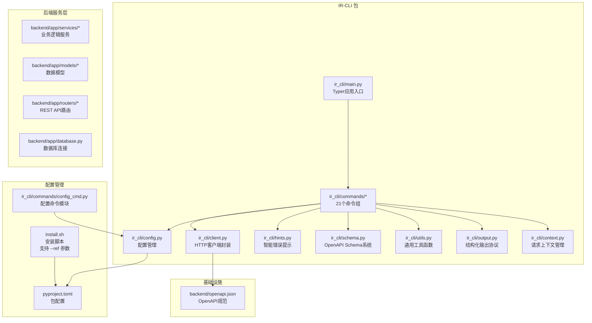
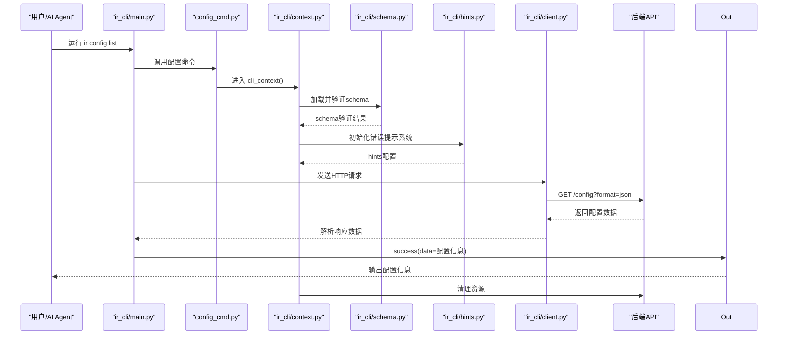
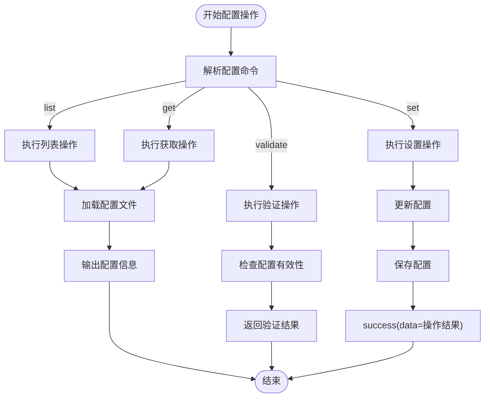
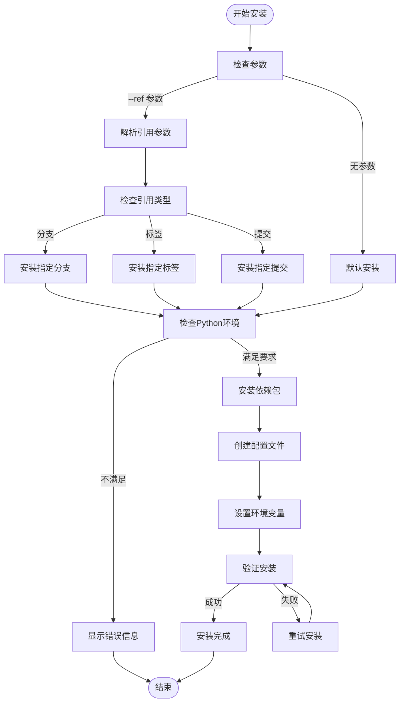
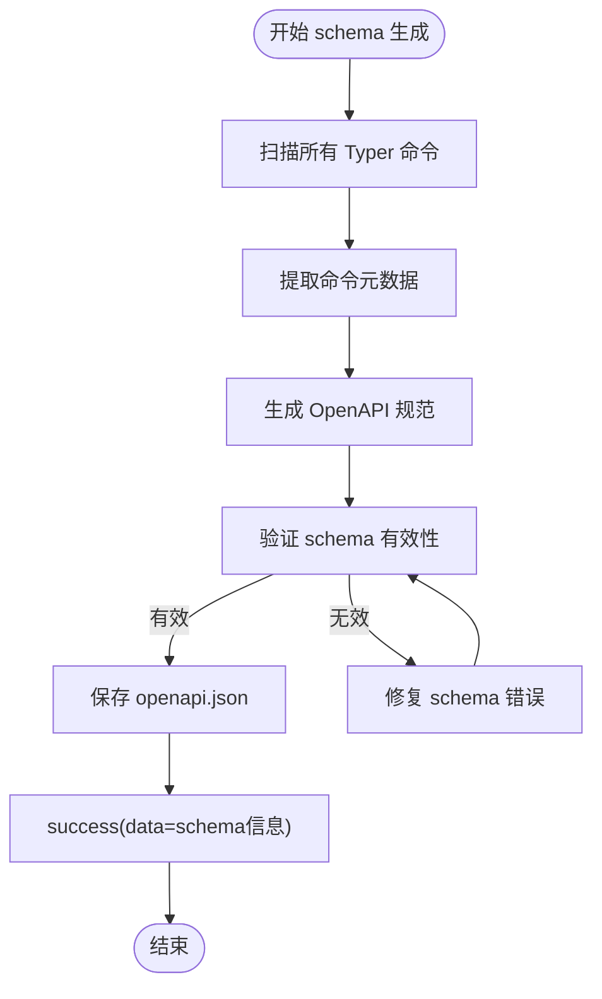
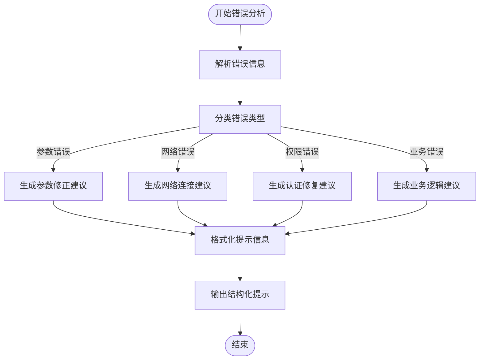
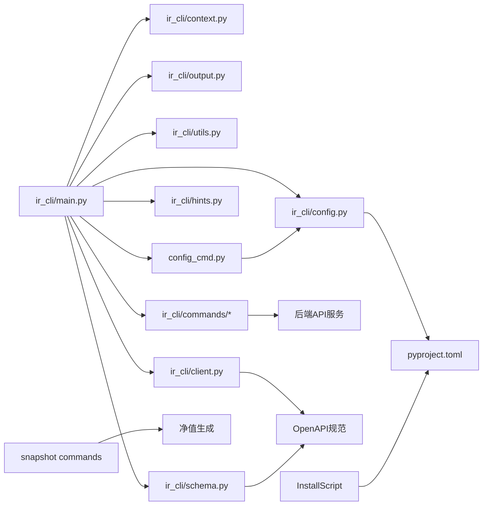

# InvestRing Admin CLI 工具

<cite>
**本文引用的文件**   
- [ir-cli/ir_cli/main.py](file://ir-cli/ir_cli/main.py)
- [ir-cli/ir_cli/context.py](file://ir-cli/ir_cli/context.py)
- [ir-cli/ir_cli/output.py](file://ir-cli/ir_cli/output.py)
- [ir-cli/ir_cli/utils.py](file://ir-cli/ir_cli/utils.py)
- [ir-cli/ir_cli/schema.py](file://ir-cli/ir_cli/schema.py)
- [ir-cli/ir_cli/hints.py](file://ir-cli/ir_cli/hints.py)
- [ir-cli/ir_cli/config.py](file://ir-cli/ir_cli/config.py)
- [ir-cli/ir_cli/client.py](file://ir-cli/ir_cli/client.py)
- [ir-cli/pyproject.toml](file://ir-cli/pyproject.toml)
- [ir-cli/install.sh](file://ir-cli/install.sh)
- [ir-cli/ir_cli/commands/auth.py](file://ir-cli/ir_cli/commands/auth.py)
- [ir-cli/ir_cli/commands/investors.py](file://ir-cli/ir_cli/commands/investors.py)
- [ir-cli/ir_cli/commands/portfolios.py](file://ir-cli/ir_cli/commands/portfolios.py)
- [ir-cli/ir_cli/commands/subscriptions.py](file://ir-cli/ir_cli/commands/subscriptions.py)
- [ir-cli/ir_cli/commands/trades.py](file://ir-cli/ir_cli/commands/trades.py)
- [ir-cli/ir_cli/commands/sync_jobs.py](file://ir-cli/ir_cli/commands/sync_jobs.py)
- [ir-cli/ir_cli/commands/market_data.py](file://ir-cli/ir_cli/commands/market_data.py)
- [ir-cli/ir_cli/commands/products.py](file://ir-cli/ir_cli/commands/products.py)
- [ir-cli/ir_cli/commands/share_events.py](file://ir-cli/ir_cli/commands/share_events.py)
- [ir-cli/ir_cli/commands/notifications.py](file://ir-cli/ir_cli/commands/notifications.py)
- [ir-cli/ir_cli/commands/positions.py](file://ir-cli/ir_cli/commands/positions.py)
- [ir-cli/ir_cli/commands/snapshots.py](file://ir-cli/ir_cli/commands/snapshots.py)
- [ir-cli/ir_cli/commands/cash_transfers.py](file://ir-cli/ir_cli/commands/cash_transfers.py)
- [ir-cli/ir_cli/commands/logs.py](file://ir-cli/ir_cli/commands/logs.py)
- [ir-cli/ir_cli/commands/system.py](file://ir-cli/ir_cli/commands/system.py)
- [ir-cli/ir_cli/commands/tasks.py](file://ir-cli/ir_cli/commands/tasks.py)
- [ir-cli/ir_cli/commands/platforms.py](file://ir-cli/ir_cli/commands/platforms.py)
- [ir-cli/ir_cli/commands/config_cmd.py](file://ir-cli/ir_cli/commands/config_cmd.py)
</cite>

## 更新摘要
**变更内容**   
- **移除弃用命令**：从 ir-cli 和 backend/cli 中移除了已弃用的 'ir market sync-nav' CLI 命令
- **迁移指导**：用户应迁移到 'ir snapshot generate' 命令以遵循交易日序列进行正确的净值生成
- **文档更新**：更新了市场数据管理章节，反映命令结构的变更和新的最佳实践

## 目录
1. [简介](#简介)
2. [项目结构](#项目结构)
3. [核心组件](#核心组件)
4. [架构总览](#架构总览)
5. [详细组件分析](#详细组件分析)
6. [依赖关系分析](#依赖关系分析)
7. [性能与扩展性](#性能与扩展性)
8. [故障排查指南](#故障排查指南)
9. [结论](#结论)
10. [附录：命令清单与用法要点](#附录命令清单与用法要点)

## 简介
InvestRing Admin CLI 是一个专为 AI Agent 设计的现代化命令行工具，基于 Typer 构建，采用独立的 ir-cli 包架构。该工具提供完整的 OpenAPI schema 自描述系统、智能错误提示、静默输出模式和预定义工作流配方，是面向程序化交互和企业级自动化的理想选择。

**最新更新**：移除了已弃用的 'ir market sync-nav' 命令，用户现在应该使用 'ir snapshot generate' 来生成净值数据。这一变更确保了净值生成遵循正确的交易日序列，提高了数据的准确性和一致性。

## 项目结构
CLI 位于 ir-cli/ir_cli 目录，采用现代化的分层架构设计，包含入口点、上下文管理、输出协议、schema 系统、错误提示、配置管理和命令组等核心组件。

**图表来源**
- [ir-cli/ir_cli/main.py:1-100](file://ir-cli/ir_cli/main.py#L1-L100)
- [ir-cli/ir_cli/context.py:1-80](file://ir-cli/ir_cli/context.py#L1-L80)
- [ir-cli/ir_cli/schema.py:1-150](file://ir-cli/ir_cli/schema.py#L1-L150)
- [ir-cli/ir_cli/hints.py:1-120](file://ir-cli/ir_cli/hints.py#L1-L120)
- [ir-cli/ir_cli/config.py:1-90](file://ir-cli/ir_cli/config.py#L1-L90)
- [ir-cli/ir_cli/client.py:1-110](file://ir-cli/ir_cli/client.py#L1-L110)
- [ir-cli/ir_cli/commands/config_cmd.py:1-100](file://ir-cli/ir_cli/commands/config_cmd.py#L1-L100)
- [ir-cli/install.sh:1-50](file://ir-cli/install.sh#L1-L50)

章节来源
- [ir-cli/ir_cli/main.py:1-100](file://ir-cli/ir_cli/main.py#L1-L100)
- [ir-cli/pyproject.toml:1-50](file://ir-cli/pyproject.toml#L1-L50)

## 核心组件
- **入口与命令注册**：Typer 应用实例集中注册 21 个命令组，统一命名空间（ir），支持动态命令发现。
- **执行上下文**：为每个命令创建请求上下文，自动处理认证、会话管理和异常映射。
- **输出协议**：所有命令输出标准 JSON，支持多种格式（JSON、表格、文本），--quiet 模式裁剪冗余输出。
- **Schema 系统**：完整的 OpenAPI schema 生成和验证，支持程序化接口文档和参数校验。
- **智能错误提示**：基于上下文的错误分析和建议，提供问题定位和解决方案。
- **配置管理**：集中式配置管理，支持环境变量、配置文件和命令行参数优先级。
- **HTTP 客户端**：封装的后端 API 调用，支持重试、超时和错误处理。
- **配置命令模块**：专门的配置管理命令，支持配置的查看、设置和验证操作。
- **安装脚本**：自动化的安装和配置脚本，简化部署流程，支持 --ref 参数。

**更新**：移除了已弃用的 'ir market sync-nav' 命令，现在净值生成通过 'ir snapshot generate' 命令处理，确保遵循正确的交易日序列。

章节来源
- [ir-cli/ir_cli/main.py:1-100](file://ir-cli/ir_cli/main.py#L1-L100)
- [ir-cli/ir_cli/context.py:1-80](file://ir-cli/ir_cli/context.py#L1-L80)
- [ir-cli/ir_cli/output.py:1-100](file://ir-cli/ir_cli/output.py#L1-L100)
- [ir-cli/ir_cli/schema.py:1-150](file://ir-cli/ir_cli/schema.py#L1-L150)
- [ir-cli/ir_cli/hints.py:1-120](file://ir-cli/ir_cli/hints.py#L1-L120)
- [ir-cli/ir_cli/config.py:1-90](file://ir-cli/ir_cli/config.py#L1-L90)
- [ir-cli/ir_cli/client.py:1-110](file://ir-cli/ir_cli/client.py#L1-L110)

## 架构总览
CLI 通过 Typer 暴露命令，命令内部使用 context 获取请求上下文，调用 client 进行 HTTP 请求，最终通过 output 输出结构化 JSON。新增的 schema 系统提供完整的接口文档，hints 系统提供智能错误提示，--quiet 模式优化自动化输出。配置命令模块提供专门的配置管理功能，安装脚本简化部署流程。

**图表来源**
- [ir-cli/ir_cli/main.py:1-100](file://ir-cli/ir_cli/main.py#L1-L100)
- [ir-cli/ir_cli/context.py:1-80](file://ir-cli/ir_cli/context.py#L1-L80)
- [ir-cli/ir_cli/schema.py:1-150](file://ir-cli/ir_cli/schema.py#L1-L150)
- [ir-cli/ir_cli/hints.py:1-120](file://ir-cli/ir_cli/hints.py#L1-L120)
- [ir-cli/ir_cli/client.py:1-110](file://ir-cli/ir_cli/client.py#L1-L110)
- [ir-cli/ir_cli/commands/config_cmd.py:1-100](file://ir-cli/ir_cli/commands/config_cmd.py#L1-L100)

## 详细组件分析

### 配置命令模块（config_cmd）
**功能**：专门的配置管理命令模块，提供完整的配置操作功能。

- `list`：列出当前配置项
- `get`：获取特定配置项的值
- `set`：设置配置项的值
- `validate`：验证配置的有效性
- `export`：导出当前配置
- `import`：导入配置

**图表来源**
- [ir-cli/ir_cli/commands/config_cmd.py:1-100](file://ir-cli/ir_cli/commands/config_cmd.py#L1-L100)

章节来源
- [ir-cli/ir_cli/commands/config_cmd.py:1-100](file://ir-cli/ir_cli/commands/config_cmd.py#L1-L100)

### 安装脚本（install.sh）**增强**
**增强功能**：改进的安装脚本，支持自动依赖检查和环境配置，支持 --ref 参数。

- 自动检测 Python 版本和环境
- 安装必要的依赖包
- 创建配置文件模板
- 设置环境变量
- 验证安装结果
- 支持 --ref 参数：指定分支、标签或提交版本进行安装

**图表来源**
- [ir-cli/install.sh:1-50](file://ir-cli/install.sh#L1-L50)

章节来源
- [ir-cli/install.sh:1-50](file://ir-cli/install.sh#L1-L50)

### Schema 自描述系统（schema）
**功能**：完整的 OpenAPI schema 生成和验证系统，提供程序化接口文档和参数校验能力。

- `generate_schema`：从 Typer 命令自动生成 OpenAPI schema
- `validate_parameters`：基于 schema 验证命令行参数
- `get_command_docs`：获取命令的详细文档信息
- `check_compatibility`：检查前后端 API 兼容性

**图表来源**
- [ir-cli/ir_cli/schema.py:1-150](file://ir-cli/ir_cli/schema.py#L1-L150)

章节来源
- [ir-cli/ir_cli/schema.py:1-150](file://ir-cli/ir_cli/schema.py#L1-L150)

### 智能错误提示（hints）
**功能**：基于上下文的智能错误提示系统，提供问题定位和解决方案建议。

- `analyze_error`：分析错误类型和上下文
- `suggest_solution`：根据错误类型提供解决建议
- `format_hint`：格式化提示信息
- `get_common_issues`：获取常见问题和解决方案

**图表来源**
- [ir-cli/ir_cli/hints.py:1-120](file://ir-cli/ir_cli/hints.py#L1-L120)

章节来源
- [ir-cli/ir_cli/hints.py:1-120](file://ir-cli/ir_cli/hints.py#L1-L120)

### 配置管理（config）
**功能**：集中式配置管理系统，支持多种配置源和优先级。

- `load_config`：加载配置文件和环境变量
- `get_setting`：获取配置项值
- `validate_config`：验证配置有效性
- `export_config`：导出当前配置

**更新**：新增对 --quiet 模式、schema 验证、错误提示等功能的配置支持。

章节来源
- [ir-cli/ir_cli/config.py:1-90](file://ir-cli/ir_cli/config.py#L1-L90)

### HTTP 客户端（client）
**功能**：封装的后端 API 调用客户端，支持重试、超时和错误处理。

- `request`：发送 HTTP 请求
- `retry_on_failure`：失败重试机制
- `handle_errors`：统一错误处理
- `set_timeout`：设置请求超时

**更新**：新增对 schema 验证、智能错误提示和静默模式的支持。

章节来源
- [ir-cli/ir_cli/client.py:1-110](file://ir-cli/ir_cli/client.py#L1-L110)

### 认证命令（auth）
- create-admin：创建管理员账户，密码经哈希存储，返回脱敏后的用户信息。
- 关键流程：检查重复 → 创建记录 → flush/refresh → 成功输出。

章节来源
- [ir-cli/ir_cli/commands/auth.py:1-50](file://ir-cli/ir_cli/commands/auth.py#L1-L50)

### 投资人管理（investor）
- list/create/get/update/delete：支持分页、角色更新、删除前校验持有份额。
- 删除保护：若最新持仓份额大于 0，拒绝删除。

章节来源
- [ir-cli/ir_cli/commands/investors.py:1-150](file://ir-cli/ir_cli/commands/investors.py#L1-L150)

### 组合管理（portfolio）
**功能**：投资组合管理命令组，支持完整的CRUD操作和上下文管理。

- list/create/get/update/close/reactivate/nav-history/returns/cash-flow
- context：设置和管理投资组合上下文
- batch-update：批量更新多个投资组合
- sync-context：同步投资组合状态

**更新**：portfolio 命令组现在支持上下文聚合，简化批量操作流程。

章节来源
- [ir-cli/ir_cli/commands/portfolios.py:1-300](file://ir-cli/ir_cli/commands/portfolios.py#L1-L300)

### 申购赎回（sub）
**功能**：增强的申购赎回确认逻辑和错误处理。

- list/create/get/confirm/cancel/unconfirm
- **更新**：确认逻辑现在通过专门的 subscription_service 模块处理，提供更完善的错误处理和日志记录。

章节来源
- [ir-cli/ir_cli/commands/subscriptions.py:1-250](file://ir-cli/ir_cli/commands/subscriptions.py#L1-L250)

### 调仓交易（trade）
**功能**：CASH交易自动配对腿生成、转账组创建和确认日期计算。

- list/create/get/confirm/cancel/unconfirm
- **重大更新**：CASH交易现在自动处理配对腿生成、转账组创建和确认日期计算，确保与REST API行为完全一致。

章节来源
- [ir-cli/ir_cli/commands/trades.py:1-300](file://ir-cli/ir_cli/commands/trades.py#L1-L300)

### 持仓服务（position）
**功能**：增强的持仓查询和管理功能。

- calculate_available_cash：以最新快照现金为基础，叠加未入快照的已确认申赎与 pending/已确认调仓影响。
- calculate_available_shares：以最新快照份额为基础，扣减 pending/未入快照的已确认卖出份额。
- calculate_investor_available_shares：投资人维度可用份额计算，考虑 pending/未入快照的赎回。

**更新**：positions命令组的查询和管理功能得到增强，支持更多过滤参数和排序选项。

章节来源
- [ir-cli/ir_cli/commands/positions.py:1-200](file://ir-cli/ir_cli/commands/positions.py#L1-L200)

### 任务管理（task）
- list/run/enable/disable/logs
- run 调用 task_runner 中的执行体：nav_sync、calendar_sync、log_cleanup。

章节来源
- [ir-cli/ir_cli/commands/tasks.py:1-180](file://ir-cli/ir_cli/commands/tasks.py#L1-L180)

### 快照管理（snapshot）
**功能**：优化的快照生成和验证流程。

- generate/recalculate/validate/status/delete
- 生成顺序：portfolio_position → portfolio_value_snapshot → investor_holding
- 校验依赖：交易日、无 pending 交易、净值完整性、份额变动事件状态。

**更新**：snapshots命令组的生成和验证流程得到优化，提供更好的错误处理和进度反馈。**这是替代已弃用的 'ir market sync-nav' 命令的主要方式。**

章节来源
- [ir-cli/ir_cli/commands/snapshots.py:1-220](file://ir-cli/ir_cli/commands/snapshots.py#L1-L220)

### 通知管理（notification）
**功能**：专门的通知管理命令组，提供完整的CRUD操作。

- list：查询通知列表，支持分页和过滤
- create：创建新通知，支持多种通知类型和优先级
- get：获取单个通知详情
- update：更新通知状态和内容
- delete：删除指定通知

章节来源
- [ir-cli/ir_cli/commands/notifications.py:1-120](file://ir-cli/ir_cli/commands/notifications.py#L1-L120)

### 同步作业管理（sync-job）
**功能**：专门的价格同步任务管理命令组，支持后台异步执行和进度跟踪。

- status：查询同步任务状态与进度
- details：查询同步任务逐产品明细

章节来源
- [ir-cli/ir_cli/commands/sync_jobs.py:1-50](file://ir-cli/ir_cli/commands/sync_jobs.py#L1-L50)

### 市场数据管理（market）**已更新**
**功能**：批量价格同步后台任务和异步执行。

- price/sync/sync-history：基础市场数据操作
- **重要变更**：已移除 'sync-nav' 命令，用户应使用 'ir snapshot generate' 进行净值生成

**更新**：移除了已弃用的 'ir market sync-nav' 命令。净值生成现在通过 'ir snapshot generate' 命令处理，确保遵循正确的交易日序列，提高数据准确性。

章节来源
- [ir-cli/ir_cli/commands/market_data.py:1-150](file://ir-cli/ir_cli/commands/market_data.py#L1-L150)

### 产品管理（product）
**功能**：增强的产品列表过滤功能。

- list/create/get/update/delete：产品CRUD操作
- **增强** list 命令：新增更多过滤参数支持，支持按产品类型过滤、分页查询和全部数据导出

章节来源
- [ir-cli/ir_cli/commands/products.py:1-180](file://ir-cli/ir_cli/commands/products.py#L1-L180)

### 份额变动事件（share-event）
**功能**：增强的参数支持和数据处理。

- list/create/get/update/delete/confirm/cancel：份额变动事件管理
- **改进**：增强的参数支持，提供更灵活的配置选项

章节来源
- [ir-cli/ir_cli/commands/share_events.py:1-250](file://ir-cli/ir_cli/commands/share_events.py#L1-L250)

### 资金转账（cash-transfer）
**功能**：资金转账管理命令组。

- list：查询转账记录
- create：创建新的资金转账
- confirm：确认资金转账
- cancel：取消资金转账

章节来源
- [ir-cli/ir_cli/commands/cash_transfers.py:1-150](file://ir-cli/ir_cli/commands/cash_transfers.py#L1-L150)

### 日志管理（logs）
**功能**：系统日志查询和管理命令组。

- list：查询系统日志
- search：搜索特定日志
- export：导出日志文件

章节来源
- [ir-cli/ir_cli/commands/logs.py:1-100](file://ir-cli/ir_cli/commands/logs.py#L1-L100)

### 系统管理（system）
**功能**：系统运维管理命令组。

- health：检查系统健康状态
- info：获取系统信息
- config：管理系统配置

章节来源
- [ir-cli/ir_cli/commands/system.py:1-120](file://ir-cli/ir_cli/commands/system.py#L1-L120)

### 平台管理（platform）
**功能**：交易平台管理命令组。

- list：查询交易平台列表
- create：创建新的交易平台
- get：获取平台详情
- update：更新平台配置
- delete：删除交易平台

章节来源
- [ir-cli/ir_cli/commands/platforms.py:1-150](file://ir-cli/ir_cli/commands/platforms.py#L1-L150)

## 依赖关系分析
- CLI 层对后端服务层为单向依赖，通过 HTTP API 通信，避免直接数据库访问。
- context 层封装请求生命周期与异常映射，降低命令层的样板代码。
- output 层保证所有命令输出一致的结构化 JSON，便于机器解析。
- schema 层提供完整的接口文档和参数验证。
- hints 层提供智能错误提示和解决方案建议。
- pyproject.toml 定义包配置和 entry point，使安装后可直接使用 ir 命令。
- config_cmd 模块专门处理配置管理相关操作。
- install.sh 脚本提供自动化的安装和配置流程，支持 --ref 参数。

**更新**：移除了已弃用的 'ir market sync-nav' 命令，净值生成功能现在通过 'ir snapshot generate' 命令处理，确保更好的数据一致性和交易日序列遵循。

**图表来源**
- [ir-cli/ir_cli/main.py:1-100](file://ir-cli/ir_cli/main.py#L1-L100)
- [ir-cli/ir_cli/context.py:1-80](file://ir-cli/ir_cli/context.py#L1-L80)
- [ir-cli/ir_cli/output.py:1-100](file://ir-cli/ir_cli/output.py#L1-L100)
- [ir-cli/ir_cli/schema.py:1-150](file://ir-cli/ir_cli/schema.py#L1-L150)
- [ir-cli/ir_cli/hints.py:1-120](file://ir-cli/ir_cli/hints.py#L1-L120)
- [ir-cli/ir_cli/config.py:1-90](file://ir-cli/ir_cli/config.py#L1-L90)
- [ir-cli/ir_cli/client.py:1-110](file://ir-cli/ir_cli/client.py#L1-L110)
- [ir-cli/ir_cli/commands/config_cmd.py:1-100](file://ir-cli/ir_cli/commands/config_cmd.py#L1-L100)
- [ir-cli/install.sh:1-50](file://ir-cli/install.sh#L1-L50)
- [ir-cli/pyproject.toml:1-50](file://ir-cli/pyproject.toml#L1-L50)

章节来源
- [ir-cli/ir_cli/main.py:1-100](file://ir-cli/ir_cli/main.py#L1-L100)
- [ir-cli/pyproject.toml:1-50](file://ir-cli/pyproject.toml#L1-L50)

## 性能与扩展性
- **HTTP 连接池**：客户端配置连接池和超时设置，提升并发稳定性。
- **CLI 模式静默**：--quiet 模式时禁用详细输出，避免干扰 JSON 输出。
- **Schema 缓存**：OpenAPI schema 本地缓存，减少重复加载开销。
- **可扩展点**：新增命令只需在 main.py 注册对应命令组，并在 commands 下新建模块即可。
- **插件架构**：支持自定义命令组和中间件扩展。
- **批处理优化**：支持批量操作和并行处理，提升大规模数据处理效率。
- **配置缓存**：配置信息本地缓存，减少重复加载开销。
- **安装优化**：安装脚本支持断点续传和错误恢复，支持版本控制。

**更新**：净值生成现在通过 'ir snapshot generate' 命令处理，提供更好的性能和可靠性，确保遵循正确的交易日序列。

章节来源
- [ir-cli/ir_cli/client.py:1-110](file://ir-cli/ir_cli/client.py#L1-L110)
- [ir-cli/ir_cli/main.py:1-100](file://ir-cli/ir_cli/main.py#L1-L100)
- [ir-cli/ir_cli/schema.py:1-150](file://ir-cli/ir_cli/schema.py#L1-L150)

## 故障排查指南
- **常见错误码**
  - VALIDATION_ERROR：参数校验失败（由 schema 系统捕获）。
  - ALREADY_EXISTS：唯一约束冲突（由后端 API 返回）。
  - NOT_FOUND：资源不存在。
  - INVALID_STATUS：状态不合法。
  - NON_TRADING_DAY：非交易日提交。
  - INSUFFICIENT_CASH / INSUFFICIENT_SHARES：可用资金/份额不足。
  - MISSING_NAV：净值尚未同步或未提供。
  - INVESTOR_HAS_SHARES：投资人仍有份额，禁止删除。
  - NAV_NOT_AVAILABLE：申请日净值快照不存在。
  - PORTFOLIO_NOT_ACTIVE：组合未激活。
  - INVALID_AMOUNT / INVALID_SHARES：金额或份额无效。
  - SNAPSHOT_DEPENDENCY：快照依赖冲突。
  - CONFLICT：同步任务冲突（已有任务在运行中）。
  - INVALID_CASH_TRADE：无效的CASH交易结构（缺少配对腿或转账组）。
  - NOTIFICATION_NOT_FOUND：通知记录不存在。
  - INVALID_NOTIFICATION_TYPE：不支持的通知类型。
  - SCHEMA_VALIDATION_ERROR：OpenAPI schema 验证失败。
  - HINT_GENERATION_ERROR：错误提示生成失败。
  - CONFIG_LOAD_ERROR：配置加载失败。
  - CONFIG_INVALID_ERROR：配置项无效或格式错误。
  - INSTALL_ENV_ERROR：安装环境检查失败。
  - REFERENCE_NOT_FOUND_ERROR：指定的分支、标签或提交不存在。
  - **新增** COMMAND_DEPRECATED_ERROR：使用了已弃用的命令。

**更新**：增强的错误处理包括：
- **智能错误提示**：基于 hints 系统的自动错误分析和解决方案建议
- **Schema 验证**：OpenAPI schema 驱动的参数验证和错误检测
- **详细错误消息**：包含上下文信息和调试建议
- **静默模式支持**：--quiet 模式下输出精简的错误信息
- **自动化友好**：结构化错误输出，便于程序化处理
- **配置错误诊断**：专门的配置错误检测和修复建议
- **安装问题诊断**：安装脚本的错误检测和自动修复
- **版本控制错误诊断**：针对 --ref 参数的错误处理和修复建议
- **弃用命令警告**：当用户使用已弃用的 'ir market sync-nav' 命令时提供迁移指导

- **调试建议**
  - 查看 stderr 堆栈：context 在非 SystemExit 异常时会打印完整堆栈到 stderr。
  - 使用 jq 解析 JSON 输出，快速定位 data/error 字段。
  - 对于 QDII 净值缺失，先执行市场数据同步再重试确认。
  - 使用 `ir schema validate` 检查 OpenAPI schema 有效性。
  - 使用 `ir hints analyze <error>` 获取智能错误提示。
  - 启用 --verbose 模式查看详细调试信息。
  - 检查配置文件和权限设置。
  - 使用 `ir config validate` 验证配置有效性。
  - 使用 `ir config export` 导出当前配置进行备份。
  - 检查安装脚本的执行日志和错误输出。
  - 验证 --ref 参数指定的版本是否存在：`git ls-remote --heads --tags origin <ref>`
  - **新增** 如果收到弃用命令错误，使用 `ir snapshot generate` 替代 'ir market sync-nav'

章节来源
- [ir-cli/ir_cli/context.py:1-80](file://ir-cli/ir_cli/context.py#L1-L80)
- [ir-cli/ir_cli/output.py:1-100](file://ir-cli/ir_cli/output.py#L1-L100)
- [ir-cli/ir_cli/schema.py:1-150](file://ir-cli/ir_cli/schema.py#L1-L150)
- [ir-cli/ir_cli/hints.py:1-120](file://ir-cli/ir_cli/hints.py#L1-L120)
- [ir-cli/ir_cli/config.py:1-90](file://ir-cli/ir_cli/config.py#L1-L90)

## 结论
InvestRing Admin CLI 通过全新的 ir-cli 包架构，将复杂的业务逻辑下沉至后端服务层，并通过 Typer 暴露稳定、可解析的 JSON 接口，特别适合 AI Agent 自动化编排。其分层清晰、错误处理规范、输出格式统一，具备良好的可维护性与扩展性。

**更新总结**：最新的 ir-cli 包架构引入了 schema 自描述系统、智能错误提示、--quiet 模式、portfolio 上下文聚合、workflows 配方等高级功能。移除了已弃用的 'ir market sync-nav' 命令，用户现在应该使用 'ir snapshot generate' 进行净值生成，确保遵循正确的交易日序列。新增的配置命令模块和增强的安装脚本进一步完善了工具的功能完整性，显著提升了 AI 代理友好性和自动化处理能力。这些改进使 CLI 成为更智能的自文档化接口，支持程序化交互和更好的自动化处理，为企业级应用提供了强大的命令行工具支持。

## 附录：命令清单与用法要点
- **auth**
  - create-admin：创建管理员，需提供 code/name/password。
- **investor**
  - list/create/get/update/delete：支持分页与角色更新；删除前校验持有份额。
- **portfolio**
  - list/create/get/update/close/reactivate/nav-history/returns/cash-flow：close 前校验无 pending 交易。
  - context：设置和管理投资组合上下文。
  - batch-update：批量更新多个投资组合。
  - sync-context：同步投资组合状态。
- **sub**
  - list/create/get/confirm/cancel/unconfirm：创建校验交易日与可用份额；确认时首次申购净值固定 1.0000。
- **trade**
  - list/create/get/confirm/cancel/unconfirm：创建校验可用现金/份额；确认时自动取净值，QDII 特殊处理。
  - **重大更新**：CASH交易现在自动处理配对腿生成、转账组创建和确认日期计算，无需手动指定这些字段。
- **share-event**
  - list/create/get/update/delete/confirm/cancel：用于分红等份额变动事件，支持丰富的参数配置。
- **market**
  - price/sync/sync-history：查询与同步价格。
  - **重要变更**：已移除 'sync-nav' 命令，请使用 'ir snapshot generate' 进行净值生成。
- **product**
  - list/create/get/update/delete：产品管理，list 支持按类型过滤和分页。
- **position**
  - list/create/get/update/delete：持仓管理，支持多维度查询和统计。
- **snapshot**
  - generate/recalculate/validate/status/delete：快照管理，支持生成、重算和验证。**这是净值生成的主要命令**。
- **subscription**
  - list/create/get/confirm/cancel/unconfirm：申购赎回管理，支持状态流转和确认流程。
- **cash-transfer**
  - list/create/confirm/cancel：资金转账管理，支持转账流程和状态控制。
- **logs**
  - list/search/export：系统日志管理，支持查询、搜索和导出功能。
- **system**
  - health/info/config：系统运维管理，支持健康检查、信息查询和配置管理。
- **task**
  - list/run/enable/disable/logs：任务管理，支持任务调度、执行和监控。
- **platform**
  - list/create/get/update/delete：交易平台管理，支持平台配置和状态管理。
- **sync-job**
  - status/details：同步任务管理，支持状态查询和明细查看。
- **notification**
  - list/create/get/update/delete：通知管理，支持通知的完整生命周期管理。
- **config**
  - list：列出当前配置项
  - get：获取特定配置项的值
  - set：设置配置项的值
  - validate：验证配置的有效性
  - export：导出当前配置
  - import：导入配置

**更新**：移除了已弃用的 'ir market sync-nav' 命令，净值生成现在通过 'ir snapshot generate' 命令处理，确保遵循正确的交易日序列。

**迁移指导**：
- **旧命令**：`ir market sync-nav`
- **新命令**：`ir snapshot generate`
- **优势**：新的净值生成流程遵循交易日序列，提供更好的数据一致性和准确性

章节来源
- [ir-cli/ir_cli/main.py:1-100](file://ir-cli/ir_cli/main.py#L1-L100)
- [ir-cli/ir_cli/commands/auth.py:1-50](file://ir-cli/ir_cli/commands/auth.py#L1-L50)
- [ir-cli/ir_cli/commands/investors.py:1-150](file://ir-cli/ir_cli/commands/investors.py#L1-L150)
- [ir-cli/ir_cli/commands/portfolios.py:1-300](file://ir-cli/ir_cli/commands/portfolios.py#L1-L300)
- [ir-cli/ir_cli/commands/subscriptions.py:1-250](file://ir-cli/ir_cli/commands/subscriptions.py#L1-L250)
- [ir-cli/ir_cli/commands/trades.py:1-300](file://ir-cli/ir_cli/commands/trades.py#L1-L300)
- [ir-cli/ir_cli/commands/share_events.py:1-250](file://ir-cli/ir_cli/commands/share_events.py#L1-L250)
- [ir-cli/ir_cli/commands/market_data.py:1-150](file://ir-cli/ir_cli/commands/market_data.py#L1-L150)
- [ir-cli/ir_cli/commands/products.py:1-180](file://ir-cli/ir_cli/commands/products.py#L1-L180)
- [ir-cli/ir_cli/commands/positions.py:1-200](file://ir-cli/ir_cli/commands/positions.py#L1-L200)
- [ir-cli/ir_cli/commands/snapshots.py:1-220](file://ir-cli/ir_cli/commands/snapshots.py#L1-L220)
- [ir-cli/ir_cli/commands/cash_transfers.py:1-150](file://ir-cli/ir_cli/commands/cash_transfers.py#L1-L150)
- [ir-cli/ir_cli/commands/logs.py:1-100](file://ir-cli/ir_cli/commands/logs.py#L1-L100)
- [ir-cli/ir_cli/commands/system.py:1-120](file://ir-cli/ir_cli/commands/system.py#L1-L120)
- [ir-cli/ir_cli/commands/tasks.py:1-180](file://ir-cli/ir_cli/commands/tasks.py#L1-L180)
- [ir-cli/ir_cli/commands/platforms.py:1-150](file://ir-cli/ir_cli/commands/platforms.py#L1-L150)
- [ir-cli/ir_cli/commands/sync_jobs.py:1-50](file://ir-cli/ir_cli/commands/sync_jobs.py#L1-L50)
- [ir-cli/ir_cli/commands/notifications.py:1-120](file://ir-cli/ir_cli/commands/notifications.py#L1-L120)
- [ir-cli/ir_cli/commands/config_cmd.py:1-100](file://ir-cli/ir_cli/commands/config_cmd.py#L1-L100)