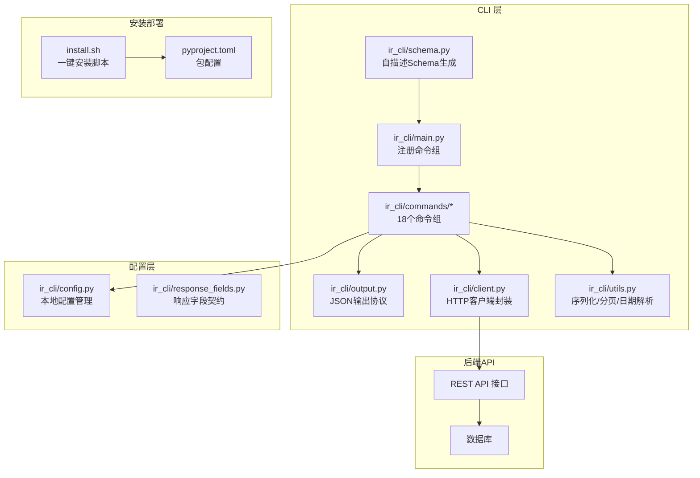
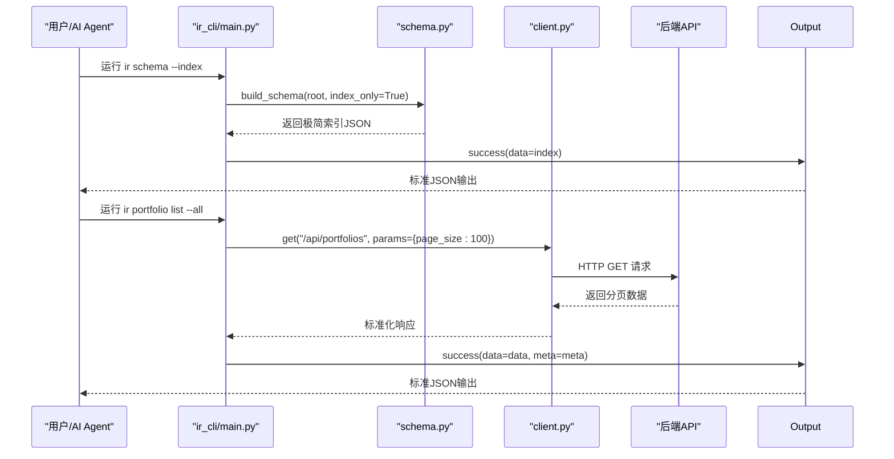
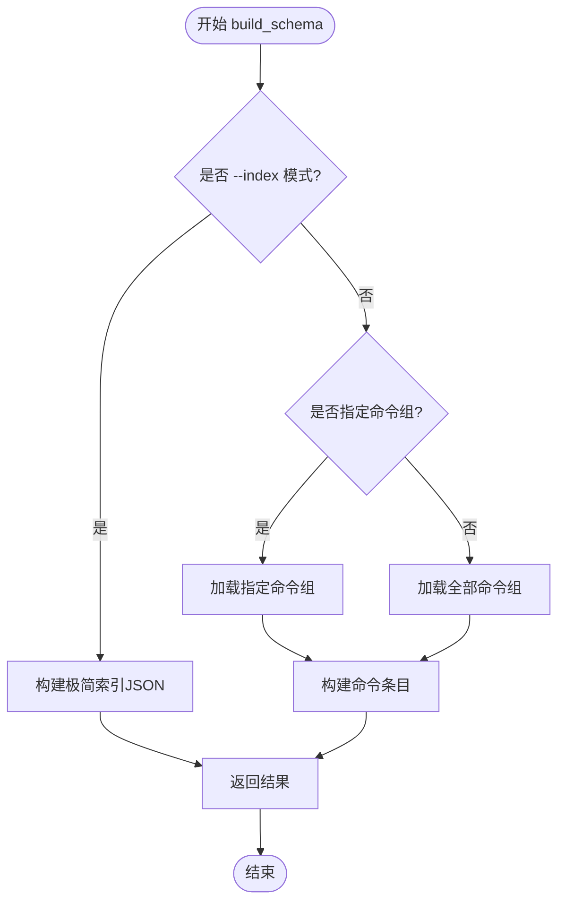
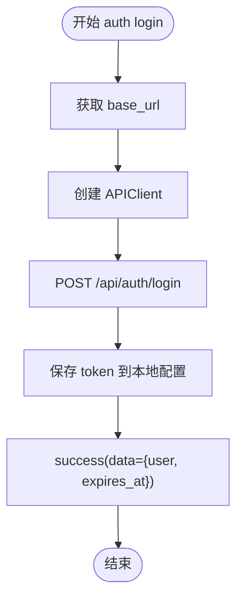
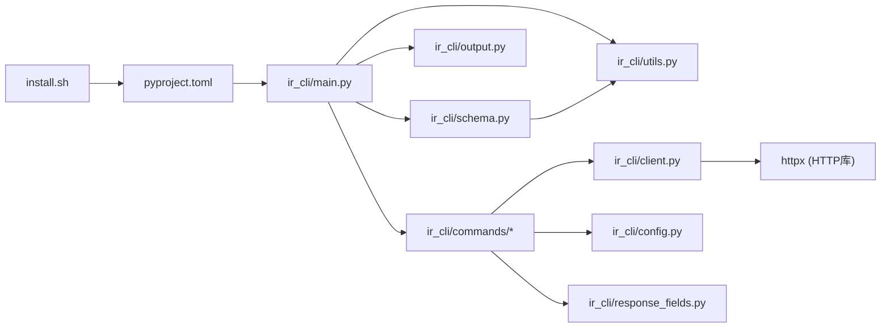

# InvestRing Admin CLI 工具

<cite>
**本文引用的文件**   
- [ir-cli/ir_cli/main.py](file://ir-cli/ir_cli/main.py)
- [ir-cli/ir_cli/schema.py](file://ir-cli/ir_cli/schema.py)
- [ir-cli/ir_cli/output.py](file://ir-cli/ir_cli/output.py)
- [ir-cli/ir_cli/client.py](file://ir-cli/ir_cli/client.py)
- [ir-cli/ir_cli/utils.py](file://ir-cli/ir_cli/utils.py)
- [ir-cli/ir_cli/response_fields.py](file://ir-cli/ir_cli/response_fields.py)
- [ir-cli/pyproject.toml](file://ir-cli/pyproject.toml)
- [ir-cli/install.sh](file://ir-cli/install.sh)
- [ir-cli/ir_cli/commands/auth.py](file://ir-cli/ir_cli/commands/auth.py)
- [ir-cli/ir_cli/commands/config_cmd.py](file://ir-cli/ir_cli/commands/config_cmd.py)
</cite>

## 更新摘要
**变更内容**   
- 新增自描述 Schema 系统，支持 `ir schema` 命令一次性获取全部命令/参数/枚举/错误码的机读 JSON 结构
- 实现结构化退出码体系（0=成功、1=业务错误、2=认证错误、3=连接/超时错误）
- 增强 AI Agent 兼容性，提供精简帮助输出和响应字段契约
- 新增版本管理功能，支持 `ir --version` 命令显示版本号
- 完善 HTTP 客户端封装，统一处理认证、错误和响应格式
- 扩展命令组至 18 个，约 90 条命令
- 新增一键安装脚本 install.sh，支持 --ref 参数指定分支/tag/commit

## 目录
1. [简介](#简介)
2. [项目结构](#项目结构)
3. [核心组件](#核心组件)
4. [架构总览](#架构总览)
5. [详细组件分析](#详细组件分析)
6. [依赖关系分析](#依赖关系分析)
7. [性能与扩展性](#性能与扩展性)
8. [故障排查指南](#故障排查指南)
9. [结论](#结论)
10. [附录：命令清单与用法要点](#附录命令清单与用法要点)

## 简介
InvestRing Admin CLI 是一个面向 AI Agent 的原生命令行工具，基于 Typer 构建，通过轻量 HTTP 客户端与后端 REST API 通信。它采用自描述 Schema 系统，支持 `ir schema` 命令一次性获取全部指令结构，便于 AI Agent 自动化编排与批处理。

**最新更新**：新增了自描述 Schema 系统，支持结构化退出码、AI Agent 兼容性增强、版本管理功能，以及完善的 HTTP 客户端封装。最新版本支持一键安装和灵活的版本管理。

## 项目结构
CLI 位于 ir-cli/ir_cli 目录，采用"入口 + 上下文 + 输出协议 + 公共辅助 + 命令组"的分层组织方式；通过 HTTP 客户端与后端服务通信，避免直接数据库访问。

图表来源
- [ir-cli/ir_cli/main.py:1-118](file://ir-cli/ir_cli/main.py#L1-L118)
- [ir-cli/ir_cli/schema.py:1-233](file://ir-cli/ir_cli/schema.py#L1-L233)
- [ir-cli/ir_cli/output.py:1-97](file://ir-cli/ir_cli/output.py#L1-L97)
- [ir-cli/ir_cli/client.py:1-269](file://ir-cli/ir_cli/client.py#L1-L269)
- [ir-cli/ir_cli/utils.py:1-134](file://ir-cli/ir_cli/utils.py#L1-L134)
- [ir-cli/ir_cli/response_fields.py:1-49](file://ir-cli/ir_cli/response_fields.py#L1-L49)
- [ir-cli/install.sh:1-98](file://ir-cli/install.sh#L1-L98)
- [ir-cli/pyproject.toml:1-17](file://ir-cli/pyproject.toml#L1-L17)

章节来源
- [ir-cli/ir_cli/main.py:1-118](file://ir-cli/ir_cli/main.py#L1-L118)
- [ir-cli/pyproject.toml:1-17](file://ir-cli/pyproject.toml#L1-L17)

## 核心组件
- **自描述 Schema 系统**：通过 `ir schema` 命令生成完整的命令结构 JSON，包含所有命令、参数、枚举值、错误码和输出协议。
- **结构化退出码**：统一的退出码体系（0=成功、1=业务错误、2=认证错误、3=连接/超时错误），便于脚本处理和错误分类。
- **HTTP 客户端封装**：统一的 HTTP 请求处理，包括认证、重试机制、错误处理和响应格式化。
- **响应字段契约**：预定义的响应字段规范，支持字段裁剪和类型提示。
- **版本管理**：支持 `ir --version` 命令显示当前版本信息。
- **一键安装**：通过 install.sh 脚本支持快速安装和升级，支持 --ref 参数指定分支/tag/commit。

**更新**：新增了自描述 Schema 系统和结构化退出码体系，大幅提升了 AI Agent 兼容性和可维护性。最新版本增强了安装体验和版本管理能力。

章节来源
- [ir-cli/ir_cli/main.py:97-118](file://ir-cli/ir_cli/main.py#L97-L118)
- [ir-cli/ir_cli/schema.py:17-36](file://ir-cli/ir_cli/schema.py#L17-L36)
- [ir-cli/ir_cli/output.py:61-64](file://ir-cli/ir_cli/output.py#L61-L64)
- [ir-cli/ir_cli/client.py:32-63](file://ir-cli/ir_cli/client.py#L32-L63)
- [ir-cli/install.sh:1-98](file://ir-cli/install.sh#L1-L98)

## 架构总览
CLI 通过 Typer 暴露命令，命令内部使用 APIClient 与后端 REST API 通信，统一通过 output 模块输出标准 JSON。新增的自描述 Schema 系统支持 AI Agent 一次性获取全部指令结构。

图表来源
- [ir-cli/ir_cli/main.py:97-118](file://ir-cli/ir_cli/main.py#L97-L118)
- [ir-cli/ir_cli/schema.py:184-233](file://ir-cli/ir_cli/schema.py#L184-L233)
- [ir-cli/ir_cli/client.py:222-264](file://ir-cli/ir_cli/client.py#L222-L264)
- [ir-cli/ir_cli/output.py:43-58](file://ir-cli/ir_cli/output.py#L43-L58)

## 详细组件分析

### 自描述 Schema 系统（schema）**新增**
**全新功能**：通过反射 Typer 命令树，生成完整的 CLI 结构描述 JSON，供 AI Agent 一次性了解全部指令。

- `build_schema`：构建完整或分组的命令结构
- `_command_entry`：单个命令条目生成（含参数、输出契约）
- `_param_entry`：单个参数条目生成（类型、必填、默认值）
- 支持 `--index` 模式输出极简索引（<1KB）
- 包含协议定义、约定说明、枚举值、错误提示和工作流配方

图表来源
- [ir-cli/ir_cli/schema.py:184-233](file://ir-cli/ir_cli/schema.py#L184-L233)

章节来源
- [ir-cli/ir_cli/schema.py:1-233](file://ir-cli/ir_cli/schema.py#L1-L233)

### 输出协议（output）**增强**
**更新**：实现了结构化退出码体系和统一的 JSON 输出格式。

- 成功输出：`{"ok": true, "data": ..., "meta"?:..., "hints"?:...}`
- 错误输出：`{"ok": false, "error": {"code", "message", "details"?:..., "hints"?:...}}`
- 退出码：0=成功、1=业务错误、2=认证错误、3=连接/超时错误
- 自定义 JSON 编码器：处理 Decimal/date/datetime 类型
- 自动错误提示：根据错误码自动生成补救建议

**更新**：增强了错误处理机制，支持自动附加错误提示和详细的错误信息。

章节来源
- [ir-cli/ir_cli/output.py:1-97](file://ir-cli/ir_cli/output.py#L1-L97)

### HTTP 客户端（client）**增强**
**更新**：统一的 HTTP 客户端封装，支持认证、重试、错误处理。

- `APIClient.from_config()`：从配置文件加载 base_url 和 token
- `_handle_response()`：统一处理 HTTP 响应和错误
- `_request()`：统一的请求入口，支持幂等请求重试
- 环境变量支持：IR_TOKEN、IR_BASE_URL、IR_RETRY、IR_DEBUG 等
- 智能重试机制：GET 请求支持自动重试网络异常和 5xx 错误
- 结构化错误处理：从后端响应中提取错误码和详细信息

**更新**：增强了错误处理逻辑，支持从后端结构化错误响应中提取错误码。

章节来源
- [ir-cli/ir_cli/client.py:1-269](file://ir-cli/ir_cli/client.py#L1-L269)

### 认证命令（auth）**增强**
**更新**：增强的认证管理功能，支持登录、登出、密码修改和状态查询。

- `login`：登录获取 token，保存到本地配置文件
- `logout`：登出并清理本地 token
- `change-password`：修改密码
- `status`：显示当前用户和 token 状态

图表来源
- [ir-cli/ir_cli/commands/auth.py:10-26](file://ir-cli/ir_cli/commands/auth.py#L10-L26)

章节来源
- [ir-cli/ir_cli/commands/auth.py:1-64](file://ir-cli/ir_cli/commands/auth.py#L1-L64)

### 配置管理（config）**增强**
**更新**：纯本地配置管理，读写 ~/.ir/config 文件。

- `set`：写入配置项（仅支持 base_url）
- `show`：显示当前生效配置（含环境变量覆盖）

**更新**：提供了安全的配置管理机制，防止拼写错误写入无效键。

章节来源
- [ir-cli/ir_cli/commands/config_cmd.py:1-44](file://ir-cli/ir_cli/commands/config_cmd.py#L1-L44)

### 工具函数（utils）**增强**
**更新**：增强的命令层共享工具，支持请求体构造、验证和字段裁剪。

- `validate_body`：本地预校验日期格式和枚举取值
- `resolve_body`：支持 --json 直传和逐项参数合并
- `project_fields`：按逗号分隔的字段列表裁剪输出
- `run_list`：列表命令统一执行（分页+字段裁剪）

**更新**：增强了枚举验证和日期格式检查。

章节来源
- [ir-cli/ir_cli/utils.py:1-134](file://ir-cli/ir_cli/utils.py#L1-L134)

### 响应字段契约（response_fields）**新增**
**全新功能**：预定义的响应字段规范，自动生成于 scripts/gen_response_fields.py。

- 定义各资源的默认摘要字段和可选字段
- 支持字段级注释和约束说明
- 与 utils.SUMMARY_FIELDS 保持一致

**更新**：为 AI Agent 提供标准化的字段契约。

章节来源
- [ir-cli/ir_cli/response_fields.py:1-49](file://ir-cli/ir_cli/response_fields.py#L1-L49)

### 一键安装脚本（install.sh）**新增**
**全新功能**：支持一键安装和升级 ir-cli 的工具脚本。

- 支持多种安装源：github、gitee、自定义 git URL
- 支持 --ref 参数指定分支/tag/commit
- 支持 --base-url 参数直接配置服务端地址
- 自动检测并使用最佳安装器：uv > pipx > 自动安装 uv
- 安全的环境检查和错误处理

**更新**：提供了便捷的安装体验，支持灵活的安装配置。

章节来源
- [ir-cli/install.sh:1-98](file://ir-cli/install.sh#L1-L98)

## 依赖关系分析
- CLI 层对 services 层无直接依赖，通过 HTTP API 通信。
- client 层封装所有 HTTP 交互，降低命令层的样板代码。
- output 层保证所有命令输出一致的结构化 JSON，便于机器解析。
- pyproject.toml 定义 entry point，使安装后可直接使用 ir 命令。
- **更新**：新增的自描述 Schema 系统被 main.py 调用，提供 AI Agent 友好的接口。
- **更新**：install.sh 脚本支持多种安装方式和版本管理。

图表来源
- [ir-cli/ir_cli/main.py:54-95](file://ir-cli/ir_cli/main.py#L54-L95)
- [ir-cli/ir_cli/schema.py:12-14](file://ir-cli/ir_cli/schema.py#L12-L14)
- [ir-cli/ir_cli/client.py:17-20](file://ir-cli/ir_cli/client.py#L17-L20)
- [ir-cli/pyproject.toml:5-13](file://ir-cli/pyproject.toml#L5-L13)
- [ir-cli/install.sh:1-98](file://ir-cli/install.sh#L1-L98)

章节来源
- [ir-cli/ir_cli/main.py:1-118](file://ir-cli/ir_cli/main.py#L1-L118)
- [ir-cli/pyproject.toml:1-17](file://ir-cli/pyproject.toml#L1-L17)

## 性能与扩展性
- HTTP 连接池：httpx.Client 配置连接超时、读取超时和连接池大小。
- 请求重试机制：幂等 GET 请求支持自动重试（IR_RETRY 环境变量控制）。
- 字段裁剪：减少网络传输和 AI Agent 上下文消耗。
- 可扩展点：新增命令只需在 main.py 注册对应命令组，并在 commands 下新建模块即可。
- **更新**：自描述 Schema 系统支持增量加载，节省 AI Agent 的 token 消耗。
- **更新**：install.sh 脚本支持多种安装器和版本管理，提升部署效率。

章节来源
- [ir-cli/ir_cli/client.py:40-51](file://ir-cli/ir_cli/client.py#L40-L51)
- [ir-cli/ir_cli/client.py:168-221](file://ir-cli/ir_cli/client.py#L168-L221)
- [ir-cli/ir_cli/utils.py:95-134](file://ir-cli/ir_cli/utils.py#L95-L134)
- [ir-cli/install.sh:59-71](file://ir-cli/install.sh#L59-L71)

## 故障排查指南
- **常见错误码**
  - VALIDATION_ERROR：参数校验失败（日期格式、枚举取值）
  - AUTH_REQUIRED：未登录或 token 已过期
  - NOT_FOUND：资源不存在
  - INVALID_STATUS：状态不合法
  - INSUFFICIENT_CASH / INSUFFICIENT_SHARES：可用资金/份额不足
  - MISSING_NAV：净值尚未同步或未提供
  - CONFLICT：资源冲突（如重复创建）
  - TIMEOUT_ERROR：请求超时
  - CONNECTION_ERROR：无法连接到服务端

- **退出码分层**
  - 0：成功
  - 1：业务错误（可换参数重试）
  - 2：认证错误（需 ir auth login）
  - 3：连接/超时错误（可原样重试或检查服务）

- **调试建议**
  - 设置 IR_DEBUG=1 查看请求耗时和状态码
  - 使用 jq 解析 JSON 输出，快速定位 data/error 字段
  - 对于认证问题，先执行 `ir auth status` 检查本地 token
  - 使用 `ir schema --index` 获取极简命令索引，再按需加载具体命令组
  - 安装问题检查 PATH 配置和环境变量

**更新**：新增了结构化退出码和详细的错误提示信息，便于自动化处理和故障诊断。

章节来源
- [ir-cli/ir_cli/output.py:61-96](file://ir-cli/ir_cli/output.py#L61-L96)
- [ir-cli/ir_cli/client.py:65-137](file://ir-cli/ir_cli/client.py#L65-L137)
- [ir-cli/ir_cli/utils.py:44-92](file://ir-cli/ir_cli/utils.py#L44-L92)

## 结论
InvestRing Admin CLI 通过自描述 Schema 系统和结构化退出码体系，为 AI Agent 提供了稳定、可解析的 JSON 接口。其分层清晰、错误处理规范、输出格式统一，具备良好的可维护性与扩展性。

**更新总结**：最新的增强包括全新的自描述 Schema 系统、结构化退出码体系、增强的 HTTP 客户端封装、完善的响应字段契约、版本管理功能、一键安装脚本，以及更好的 AI Agent 兼容性，进一步提升了系统的稳定性和可维护性。新版本支持灵活的版本管理和便捷的安装体验。

## 附录：命令清单与用法要点
- **版本管理**
  - `ir --version`：显示版本号并退出

- **Schema 系统**
  - `ir schema`：输出完整 CLI 结构（命令/参数/枚举/错误码/输出协议）
  - `ir schema --index`：输出极简命令索引（<1KB）
  - `ir schema <group>`：输出指定命令组结构

- **认证管理（auth）**
  - `login`：登录获取 token
  - `logout`：登出并清理本地 token
  - `change-password`：修改密码
  - `status`：显示当前用户和 token 状态

- **配置管理（config）**
  - `set`：写入配置项（base_url）
  - `show`：显示当前生效配置

- **组合管理（portfolio）**
  - `list/create/get/update/close/reactivate/nav-history/returns/cash-flow/context`
  - context 命令提供操作前侦察能力

- **调仓交易（trade）**
  - `list/create/get/confirm/cancel/unconfirm/update/preview`
  - 支持 JSON 直传、自动确认、静默输出

- **其他命令组**
  - investor、position、sub、share-event、market、product、platform、system、log、task、snapshot、cash-transfer、sync-job、notification

- **安装与升级**
  - `./install.sh`：一键安装（默认从 GitHub）
  - `./install.sh --repo gitee`：从 Gitee 安装
  - `./install.sh --ref dev`：指定分支/tag/commit
  - `./install.sh --base-url https://ir.example.com`：配置服务端地址

**更新**：新增了版本管理和 Schema 系统相关命令，增强了 AI Agent 的自动化能力。最新版本支持一键安装和灵活的版本管理选项。

章节来源
- [ir-cli/ir_cli/main.py:30-52](file://ir-cli/ir_cli/main.py#L30-L52)
- [ir-cli/ir_cli/main.py:97-118](file://ir-cli/ir_cli/main.py#L97-L118)
- [ir-cli/ir_cli/commands/auth.py:1-64](file://ir-cli/ir_cli/commands/auth.py#L1-L64)
- [ir-cli/ir_cli/commands/config_cmd.py:1-44](file://ir-cli/ir_cli/commands/config_cmd.py#L1-L44)
- [ir-cli/install.sh:1-98](file://ir-cli/install.sh#L1-L98)